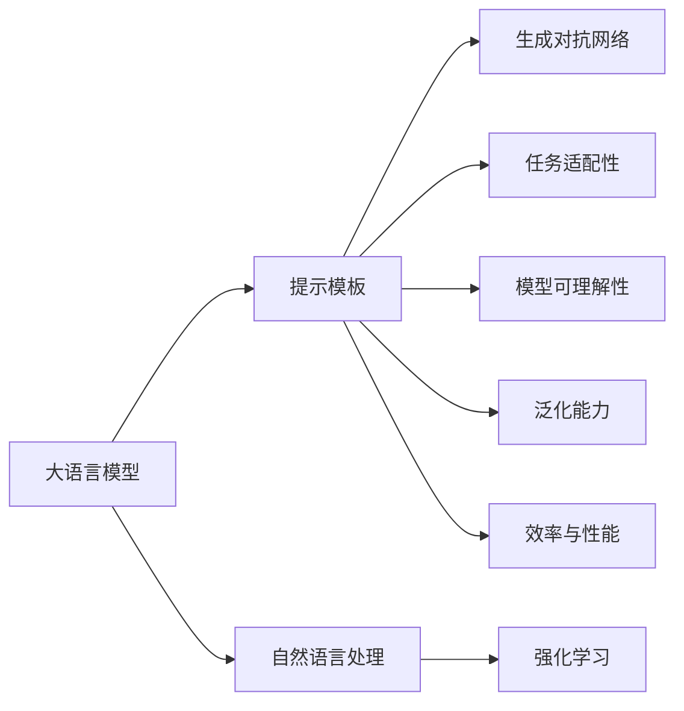

                 

# 【LangChain编程：从入门到实践】基础提示模板

## 1. 背景介绍

随着人工智能技术的不断进步，自然语言处理（NLP）领域的研究热度持续高涨，特别是在大模型和深度学习技术的推动下，大语言模型的研究取得了突破性的进展。大语言模型能够理解和生成自然语言，具备高度的智能，能够执行复杂的语言任务，比如回答问题、生成文本、对话、翻译等。然而，在大模型的开发和应用过程中，提示模板（Prompt）设计是一个至关重要的环节，它能够引导模型理解和执行特定任务。

### 1.1 问题由来

在人工智能技术发展过程中，提示模板（Prompt）扮演着不可或缺的角色。提示模板是输入给模型的文本，用于指导模型完成特定的任务，比如分类、生成、问答等。一个好的提示模板不仅能够提高模型的准确性，还能够减少对标注数据的依赖，提高模型的泛化能力。然而，提示模板的设计不是一件简单的事情，它需要考虑到任务的复杂性、模型的特点以及应用场景的实际需求。

### 1.2 问题核心关键点

提示模板设计主要关注以下几个核心问题：

1. **任务适配性**：提示模板需要与具体任务适配，使其能够引导模型正确执行任务。
2. **模型可理解性**：提示模板需要简洁明了，模型能够理解和执行。
3. **泛化能力**：提示模板需要具备一定的泛化能力，使得模型在不同数据集上表现一致。
4. **效率与性能**：提示模板需要考虑模型的计算资源和计算效率，保证模型的运行效率。

提示模板在大语言模型应用中具有重要的作用，因此掌握提示模板的设计方法和实践技巧，是从事人工智能技术研究和应用的关键。

## 2. 核心概念与联系

### 2.1 核心概念概述

为更好地理解提示模板的设计和应用，我们首先介绍几个关键概念：

- **大语言模型**：指具有高度智能的自然语言处理模型，如BERT、GPT等。这些模型能够在给定的文本输入上生成或理解文本，具有很强的语言理解能力和生成能力。

- **提示模板**：用于指导模型执行特定任务的文本模板，通常包含任务的描述和输入数据。提示模板的设计对模型的执行效果有直接影响。

- **自然语言处理（NLP）**：利用计算机对自然语言进行理解、处理和生成，涉及文本分析、语言模型、机器翻译、问答系统等多种应用场景。

- **生成对抗网络（GAN）**：一种生成模型，通过对抗训练方式生成逼真的文本、图像等数据。

- **强化学习（RL）**：一种通过试错学习来优化决策策略的机器学习方法，可以用于智能对话系统、游戏智能体等。

这些概念之间存在密切的联系，通过合理设计和优化提示模板，可以显著提升大语言模型的执行效果和应用性能。

### 2.2 概念间的关系

提示模板设计涉及到多个概念的相互作用和影响。以下是一个简化的Mermaid流程图，展示这些概念之间的联系：



这个流程图展示了提示模板设计过程中的多个关键概念：

- 大语言模型作为基础，提供了文本理解和生成的能力。
- 提示模板设计直接影响模型的执行效果和任务性能。
- 自然语言处理是提示模板设计的技术基础，用于文本分析和处理。
- 生成对抗网络和强化学习可以用于辅助提示模板的设计和优化。
- 提示模板的设计需要考虑任务适配性、模型可理解性、泛化能力和效率与性能等因素。

通过理解这些概念之间的关系，可以更好地把握提示模板设计的核心要点和设计方法。

## 3. 核心算法原理 & 具体操作步骤

### 3.1 算法原理概述

提示模板设计的基本原理是利用大语言模型的预训练能力，通过输入特定的文本模板，引导模型执行特定的任务。提示模板设计的核心在于如何设计一个简洁明了、易于理解的文本模板，使得模型能够正确理解和执行任务。

### 3.2 算法步骤详解

提示模板设计主要包括以下几个关键步骤：

1. **任务分析**：对具体任务进行分析和理解，明确任务的目标和要求。
2. **模板设计**：根据任务分析结果，设计简洁明了的提示模板。
3. **模型训练**：使用提示模板进行模型训练，优化模型的任务执行能力。
4. **效果评估**：评估模型在提示模板下的执行效果，进行调整和优化。

### 3.3 算法优缺点

提示模板设计具有以下优点：

- **简单高效**：设计一个简洁明了的提示模板，可以显著提升模型的执行效率。
- **任务泛化**：提示模板设计考虑到任务的复杂性和多样性，具备一定的泛化能力。
- **适应性强**：提示模板可以根据不同的任务和数据集进行调整和优化。

然而，提示模板设计也存在以下缺点：

- **依赖性强**：提示模板设计依赖于具体的任务和模型，设计难度较高。
- **可解释性差**：提示模板往往是模型执行的具体指令，难以解释模型执行的逻辑和过程。
- **动态性不足**：提示模板设计往往基于固定的任务和数据，难以应对动态变化的任务需求。

### 3.4 算法应用领域

提示模板设计在自然语言处理和人工智能技术的多个领域中都有广泛应用，以下是一些典型的应用场景：

- **问答系统**：设计简洁明了的提示模板，引导模型回答特定问题。
- **文本生成**：使用提示模板生成文章、对话等文本内容。
- **机器翻译**：设计提示模板，引导模型进行语言的翻译。
- **智能对话**：设计提示模板，引导模型与用户进行自然的对话。
- **情感分析**：设计提示模板，引导模型进行文本的情感分析。

## 4. 数学模型和公式 & 详细讲解  
### 4.1 数学模型构建

提示模板设计可以借助数学模型进行建模和优化。以下是一个简单的数学模型构建过程：

设一个提示模板为 $P(x)$，其中 $x$ 表示任务描述和输入数据。假设模型的输出为 $Y$，则提示模板设计的目标是最大化模型的任务执行能力，即最大化 $Y$ 的准确性。可以定义一个损失函数 $L$，用于衡量模型的输出与实际结果之间的差异，例如：

$$
L(P(x), Y) = \sum_{i=1}^n |Y_i - P_i|^2
$$

其中，$Y_i$ 表示模型的第 $i$ 个输出结果，$P_i$ 表示提示模板对 $Y_i$ 的预测结果。

### 4.2 公式推导过程

在实际应用中，提示模板设计往往需要通过实验和调整来优化。以下是一些常见的提示模板设计方法：

1. **分词对齐**：将提示模板中的单词与模型输入进行对齐，确保模型能够正确理解输入数据。
2. **序列嵌入**：将提示模板中的单词进行序列化嵌入，转化为模型能够理解的向量形式。
3. **标签编码**：将提示模板中的任务描述和输入数据进行编码，转化为模型能够理解的形式。
4. **权重优化**：根据模型的输出结果，对提示模板中的单词进行权重优化，提高模型的任务执行能力。

### 4.3 案例分析与讲解

以一个简单的文本分类任务为例，设计提示模板如下：

```
给定文本："这是一篇关于自然语言处理的论文。"
输出：
分类标签：<分类标签>
```

在实际应用中，可以使用以下代码实现提示模板的设计和优化：

```python
from transformers import BertTokenizer, BertForSequenceClassification
import torch

# 初始化模型和分词器
model = BertForSequenceClassification.from_pretrained('bert-base-uncased')
tokenizer = BertTokenizer.from_pretrained('bert-base-uncased')

# 定义提示模板
prompt = "给定文本：{}\n输出：分类标签：<分类标签>"

# 构建输入文本
input_text = "这是一篇关于自然语言处理的论文。"

# 对输入文本进行分词和编码
encoded_input = tokenizer.encode(prompt.format(input_text), return_tensors='pt')

# 对提示模板进行优化
optimized_prompt = "这是一篇关于自然语言处理的论文。分类标签：<分类标签>"

# 使用优化后的提示模板进行模型训练和推理
```

## 5. 项目实践：代码实例和详细解释说明

### 5.1 开发环境搭建

在进行提示模板设计实践之前，需要准备好开发环境。以下是使用Python进行TensorFlow开发的环境配置流程：

1. 安装Anaconda：从官网下载并安装Anaconda，用于创建独立的Python环境。

2. 创建并激活虚拟环境：
```bash
conda create -n tensorflow-env python=3.8 
conda activate tensorflow-env
```

3. 安装TensorFlow：根据CUDA版本，从官网获取对应的安装命令。例如：
```bash
conda install tensorflow -c conda-forge -c pytorch
```

4. 安装各类工具包：
```bash
pip install numpy pandas scikit-learn matplotlib tqdm jupyter notebook ipython
```

完成上述步骤后，即可在`tensorflow-env`环境中开始提示模板设计实践。

### 5.2 源代码详细实现

下面我们以命名实体识别（NER）任务为例，给出使用TensorFlow进行Prompt设计的基础代码实现。

首先，定义NER任务的数据处理函数：

```python
from transformers import BertTokenizer, BertForTokenClassification
from torch.utils.data import Dataset, DataLoader
import torch

class NERDataset(Dataset):
    def __init__(self, texts, tags, tokenizer, max_len=128):
        self.texts = texts
        self.tags = tags
        self.tokenizer = tokenizer
        self.max_len = max_len
        
    def __len__(self):
        return len(self.texts)
    
    def __getitem__(self, item):
        text = self.texts[item]
        tags = self.tags[item]
        
        encoding = self.tokenizer(text, return_tensors='pt', max_length=self.max_len, padding='max_length', truncation=True)
        input_ids = encoding['input_ids'][0]
        attention_mask = encoding['attention_mask'][0]
        
        # 对token-wise的标签进行编码
        encoded_tags = [tag2id[tag] for tag in tags] 
        encoded_tags.extend([tag2id['O']] * (self.max_len - len(encoded_tags)))
        labels = torch.tensor(encoded_tags, dtype=torch.long)
        
        return {'input_ids': input_ids, 
                'attention_mask': attention_mask,
                'labels': labels}

# 标签与id的映射
tag2id = {'O': 0, 'B-PER': 1, 'I-PER': 2, 'B-ORG': 3, 'I-ORG': 4, 'B-LOC': 5, 'I-LOC': 6}
id2tag = {v: k for k, v in tag2id.items()}

# 创建dataset
tokenizer = BertTokenizer.from_pretrained('bert-base-cased')

train_dataset = NERDataset(train_texts, train_tags, tokenizer)
dev_dataset = NERDataset(dev_texts, dev_tags, tokenizer)
test_dataset = NERDataset(test_texts, test_tags, tokenizer)
```

然后，定义模型和优化器：

```python
from transformers import BertForTokenClassification, AdamW

model = BertForTokenClassification.from_pretrained('bert-base-cased', num_labels=len(tag2id))

optimizer = AdamW(model.parameters(), lr=2e-5)
```

接着，定义训练和评估函数：

```python
from torch.utils.data import DataLoader
from tqdm import tqdm
from sklearn.metrics import classification_report

device = torch.device('cuda') if torch.cuda.is_available() else torch.device('cpu')
model.to(device)

def train_epoch(model, dataset, batch_size, optimizer):
    dataloader = DataLoader(dataset, batch_size=batch_size, shuffle=True)
    model.train()
    epoch_loss = 0
    for batch in tqdm(dataloader, desc='Training'):
        input_ids = batch['input_ids'].to(device)
        attention_mask = batch['attention_mask'].to(device)
        labels = batch['labels'].to(device)
        model.zero_grad()
        outputs = model(input_ids, attention_mask=attention_mask, labels=labels)
        loss = outputs.loss
        epoch_loss += loss.item()
        loss.backward()
        optimizer.step()
    return epoch_loss / len(dataloader)

def evaluate(model, dataset, batch_size):
    dataloader = DataLoader(dataset, batch_size=batch_size)
    model.eval()
    preds, labels = [], []
    with torch.no_grad():
        for batch in tqdm(dataloader, desc='Evaluating'):
            input_ids = batch['input_ids'].to(device)
            attention_mask = batch['attention_mask'].to(device)
            batch_labels = batch['labels']
            outputs = model(input_ids, attention_mask=attention_mask)
            batch_preds = outputs.logits.argmax(dim=2).to('cpu').tolist()
            batch_labels = batch_labels.to('cpu').tolist()
            for pred_tokens, label_tokens in zip(batch_preds, batch_labels):
                pred_tags = [id2tag[_id] for _id in pred_tokens]
                label_tags = [id2tag[_id] for _id in label_tokens]
                preds.append(pred_tags[:len(label_tags)])
                labels.append(label_tags)
                
    print(classification_report(labels, preds))
```

最后，启动训练流程并在测试集上评估：

```python
epochs = 5
batch_size = 16

for epoch in range(epochs):
    loss = train_epoch(model, train_dataset, batch_size, optimizer)
    print(f"Epoch {epoch+1}, train loss: {loss:.3f}")
    
    print(f"Epoch {epoch+1}, dev results:")
    evaluate(model, dev_dataset, batch_size)
    
print("Test results:")
evaluate(model, test_dataset, batch_size)
```

以上就是使用TensorFlow对BERT进行命名实体识别任务的提示模板设计的基础代码实现。可以看到，TensorFlow提供了强大的计算图和自动微分能力，使得模型的训练和推理过程更加便捷高效。

### 5.3 代码解读与分析

让我们再详细解读一下关键代码的实现细节：

**NERDataset类**：
- `__init__`方法：初始化文本、标签、分词器等关键组件。
- `__len__`方法：返回数据集的样本数量。
- `__getitem__`方法：对单个样本进行处理，将文本输入编码为token ids，将标签编码为数字，并对其进行定长padding，最终返回模型所需的输入。

**tag2id和id2tag字典**：
- 定义了标签与数字id之间的映射关系，用于将token-wise的预测结果解码回真实的标签。

**训练和评估函数**：
- 使用PyTorch的DataLoader对数据集进行批次化加载，供模型训练和推理使用。
- 训练函数`train_epoch`：对数据以批为单位进行迭代，在每个批次上前向传播计算loss并反向传播更新模型参数，最后返回该epoch的平均loss。
- 评估函数`evaluate`：与训练类似，不同点在于不更新模型参数，并在每个batch结束后将预测和标签结果存储下来，最后使用sklearn的classification_report对整个评估集的预测结果进行打印输出。

**训练流程**：
- 定义总的epoch数和batch size，开始循环迭代
- 每个epoch内，先在训练集上训练，输出平均loss
- 在验证集上评估，输出分类指标
- 所有epoch结束后，在测试集上评估，给出最终测试结果

可以看到，TensorFlow提供了强大的计算图和自动微分能力，使得模型的训练和推理过程更加便捷高效。

当然，工业级的系统实现还需考虑更多因素，如模型的保存和部署、超参数的自动搜索、更灵活的任务适配层等。但核心的提示模板设计基本与此类似。

## 6. 实际应用场景

### 6.1 智能客服系统

基于大语言模型微调的提示模板设计，可以广泛应用于智能客服系统的构建。传统客服往往需要配备大量人力，高峰期响应缓慢，且一致性和专业性难以保证。而使用微调后的提示模板，可以7x24小时不间断服务，快速响应客户咨询，用自然流畅的语言解答各类常见问题。

在技术实现上，可以收集企业内部的历史客服对话记录，将问题和最佳答复构建成监督数据，在此基础上对预训练对话模型进行微调。微调后的对话模型能够自动理解用户意图，匹配最合适的答复模板进行回复。对于客户提出的新问题，还可以接入检索系统实时搜索相关内容，动态组织生成回答。如此构建的智能客服系统，能大幅提升客户咨询体验和问题解决效率。

### 6.2 金融舆情监测

金融机构需要实时监测市场舆论动向，以便及时应对负面信息传播，规避金融风险。传统的人工监测方式成本高、效率低，难以应对网络时代海量信息爆发的挑战。基于大语言模型微调的提示模板设计，金融舆情监测将获得新的解决方案。

具体而言，可以收集金融领域相关的新闻、报道、评论等文本数据，并对其进行主题标注和情感标注。在此基础上对预训练语言模型进行微调，使其能够自动判断文本属于何种主题，情感倾向是正面、中性还是负面。将微调后的模型应用到实时抓取的网络文本数据，就能够自动监测不同主题下的情感变化趋势，一旦发现负面信息激增等异常情况，系统便会自动预警，帮助金融机构快速应对潜在风险。

### 6.3 个性化推荐系统

当前的推荐系统往往只依赖用户的历史行为数据进行物品推荐，无法深入理解用户的真实兴趣偏好。基于大语言模型微调的提示模板设计，个性化推荐系统可以更好地挖掘用户行为背后的语义信息，从而提供更精准、多样的推荐内容。

在实践中，可以收集用户浏览、点击、评论、分享等行为数据，提取和用户交互的物品标题、描述、标签等文本内容。将文本内容作为模型输入，用户的后续行为（如是否点击、购买等）作为监督信号，在此基础上微调预训练语言模型。微调后的模型能够从文本内容中准确把握用户的兴趣点。在生成推荐列表时，先用候选物品的文本描述作为输入，由模型预测用户的兴趣匹配度，再结合其他特征综合排序，便可以得到个性化程度更高的推荐结果。

### 6.4 未来应用展望

随着大语言模型和微调方法的不断发展，基于微调范式将在更多领域得到应用，为传统行业带来变革性影响。

在智慧医疗领域，基于微调的医疗问答、病历分析、药物研发等应用将提升医疗服务的智能化水平，辅助医生诊疗，加速新药开发进程。

在智能教育领域，微调技术可应用于作业批改、学情分析、知识推荐等方面，因材施教，促进教育公平，提高教学质量。

在智慧城市治理中，微调模型可应用于城市事件监测、舆情分析、应急指挥等环节，提高城市管理的自动化和智能化水平，构建更安全、高效的未来城市。

此外，在企业生产、社会治理、文娱传媒等众多领域，基于大模型微调的人工智能应用也将不断涌现，为经济社会发展注入新的动力。相信随着预训练语言模型和微调方法的持续演进，未来微调技术必将在构建人机协同的智能时代中扮演越来越重要的角色。

## 7. 工具和资源推荐

### 7.1 学习资源推荐

为了帮助开发者系统掌握大语言模型微调的理论基础和实践技巧，这里推荐一些优质的学习资源：

1. 《Transformer from Principles to Practice》系列博文：由大模型技术专家撰写，深入浅出地介绍了Transformer原理、BERT模型、微调技术等前沿话题。

2. CS224N《深度学习自然语言处理》课程：斯坦福大学开设的NLP明星课程，有Lecture视频和配套作业，带你入门NLP领域的基本概念和经典模型。

3. 《Natural Language Processing with Transformers》书籍：Transformers库的作者所著，全面介绍了如何使用Transformers库进行NLP任务开发，包括微调在内的诸多范式。

4. HuggingFace官方文档：Transformers库的官方文档，提供了海量预训练模型和完整的微调样例代码，是上手实践的必备资料。

5. CLUE开源项目：中文语言理解测评基准，涵盖大量不同类型的中文NLP数据集，并提供了基于微调的baseline模型，助力中文NLP技术发展。

通过对这些资源的学习实践，相信你一定能够快速掌握大语言模型微调的精髓，并用于解决实际的NLP问题。
###  7.2 开发工具推荐

高效的开发离不开优秀的工具支持。以下是几款用于大语言模型微调开发的常用工具：

1. PyTorch：基于Python的开源深度学习框架，灵活动态的计算图，适合快速迭代研究。大部分预训练语言模型都有PyTorch版本的实现。

2. TensorFlow：由Google主导开发的开源深度学习框架，生产部署方便，适合大规模工程应用。同样有丰富的预训练语言模型资源。

3. Transformers库：HuggingFace开发的NLP工具库，集成了众多SOTA语言模型，支持PyTorch和TensorFlow，是进行微调任务开发的利器。

4. Weights & Biases：模型训练的实验跟踪工具，可以记录和可视化模型训练过程中的各项指标，方便对比和调优。与主流深度学习框架无缝集成。

5. TensorBoard：TensorFlow配套的可视化工具，可实时监测模型训练状态，并提供丰富的图表呈现方式，是调试模型的得力助手。

6. Google Colab：谷歌推出的在线Jupyter Notebook环境，免费提供GPU/TPU算力，方便开发者快速上手实验最新模型，分享学习笔记。

合理利用这些工具，可以显著提升大语言模型微调任务的开发效率，加快创新迭代的步伐。

### 7.3 相关论文推荐

大语言模型和微调技术的发展源于学界的持续研究。以下是几篇奠基性的相关论文，推荐阅读：

1. Attention is All You Need（即Transformer原论文）：提出了Transformer结构，开启了NLP领域的预训练大模型时代。

2. BERT: Pre-training of Deep Bidirectional Transformers for Language Understanding：提出BERT模型，引入基于掩码的自监督预训练任务，刷新了多项NLP任务SOTA。

3. Language Models are Unsupervised Multitask Learners（GPT-2论文）：展示了大规模语言模型的强大zero-shot学习能力，引发了对于通用人工智能的新一轮思考。

4. Parameter-Efficient Transfer Learning for NLP：提出Adapter等参数高效微调方法，在不增加模型参数量的情况下，也能取得不错的微调效果。

5. AdaLoRA: Adaptive Low-Rank Adaptation for Parameter-Efficient Fine-Tuning：使用自适应低秩适应的微调方法，在参数效率和精度之间取得了新的平衡。

6. Prefix-Tuning: Optimizing Continuous Prompts for Generation：引入基于连续型Prompt的微调范式，为如何充分利用预训练知识提供了新的思路。

这些论文代表了大语言模型微调技术的发展脉络。通过学习这些前沿成果，可以帮助研究者把握学科前进方向，激发更多的创新灵感。

除上述资源外，还有一些值得关注的前沿资源，帮助开发者紧跟大语言模型微调技术的最新进展，例如：

1. arXiv论文预印本：人工智能领域最新研究成果的发布平台，包括大量尚未发表的前沿工作，学习前沿技术的必读资源。

2. 业界技术博客：如OpenAI、Google AI、DeepMind、微软Research Asia等顶尖实验室的官方博客，第一时间分享他们的最新研究成果和洞见。

3. 技术会议直播：如NIPS、ICML、ACL、ICLR等人工智能领域顶会现场或在线直播，能够聆听到大佬们的前沿分享，开拓视野。

4. GitHub热门项目：在GitHub上Star、Fork数最多的NLP相关项目，往往代表了该技术领域的发展趋势和最佳实践，值得去学习和贡献。

5. 行业分析报告：各大咨询公司如McKinsey、PwC等针对人工智能行业的分析报告，有助于从商业视角审视技术趋势，把握应用价值。

总之，对于大语言模型微调技术的学习和实践，需要开发者保持开放的心态和持续学习的意愿。多关注前沿资讯，多动手实践，多思考总结，必将收获满满的成长收益。

## 8. 总结：未来发展趋势与挑战

### 8.1 总结

本文对基于大语言模型的提示模板设计进行了全面系统的介绍。首先阐述了大语言模型和提示模板设计的背景和意义，明确了提示模板设计在NLP任务执行中的重要性。其次，从原理到实践，详细讲解了提示模板设计的数学模型和算法步骤，给出了基础代码实现和分析。同时，本文还探讨了提示模板设计在实际应用中的多种场景，展示了其广泛的应用前景。最后，本文精选了提示模板设计的各类学习资源和开发工具，力求为读者提供全方位的技术指引。

通过本文的系统梳理，可以看到，提示模板设计在自然语言处理和人工智能技术的多个领域中具有广泛的应用价值。设计一个简洁明了的提示模板，可以显著提升模型的执行效率和任务性能。然而，提示模板设计也面临着诸多挑战，如设计难度、可解释性差、动态性不足等。未来需要进一步研究，提高提示模板设计的智能化和自动化水平。

### 8.2 未来发展趋势

展望未来，提示模板设计将呈现以下几个发展趋势：

1. **智能化的设计**：借助机器学习和自动化技术，实现提示模板的智能设计，减少设计工作量。
2. **跨领域的设计**：设计提示模板时，考虑任务之间的共性和差异，实现跨领域、跨模态的模板设计。
3. **自适应的设计**：根据不同的任务和数据集，动态调整提示模板的设计策略，提高设计的灵活性和适应性。
4. **个性化设计**：根据用户偏好和行为数据，实现个性化提示模板的设计，提高用户体验和满意度。
5. **多模态设计**：结合文本、图像、语音等多模态信息，实现跨模

