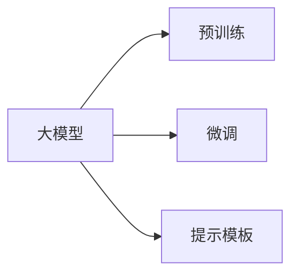
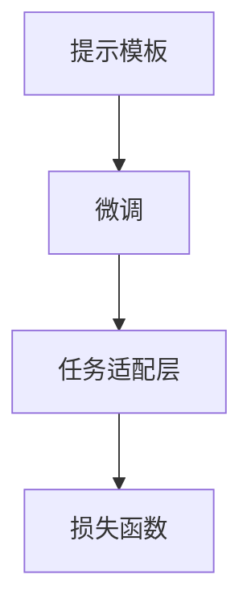
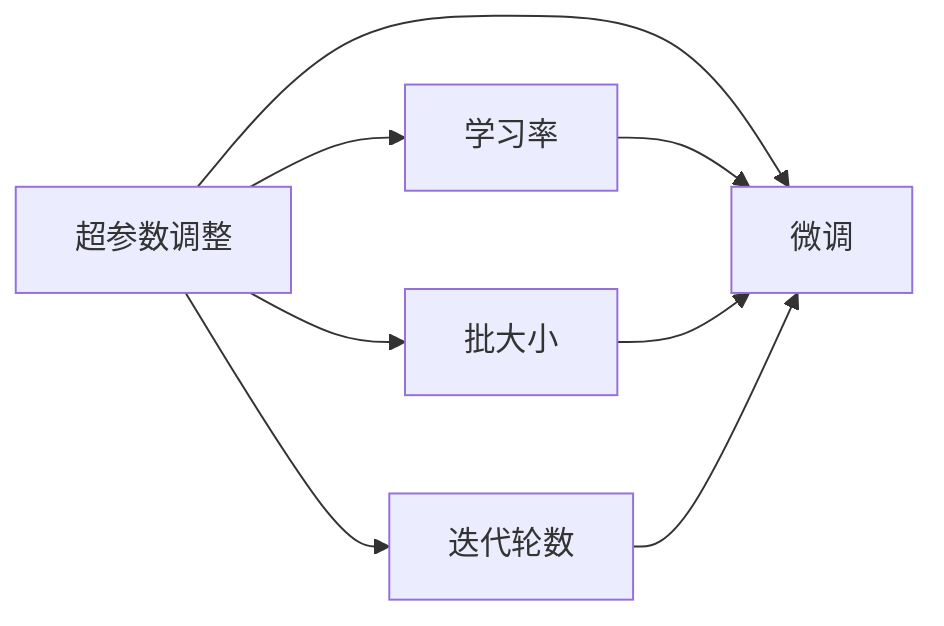

                 

# 【LangChain编程：从入门到实践】提示模板组件

> 关键词：
> - LangChain
> - 提示模板
> - 自然语言处理(NLP)
> - 深度学习模型
> - 微调(Fine-tuning)
> - 超参数调整
> - 代码实现

## 1. 背景介绍

### 1.1 问题由来

随着深度学习和大规模语言模型的快速发展，自然语言处理(NLP)领域迎来了前所未有的机遇和挑战。传统的自然语言理解任务，如问答、文本分类、命名实体识别等，通过预训练大语言模型结合微调技术，取得了显著的进展。但预训练模型往往依赖于大规模无标签数据，无法涵盖所有特定领域的知识。为此，提示模板组件应运而生，通过在输入文本中嵌入提示信息，引导大模型在特定任务下进行推理和生成，从而实现参数高效和计算高效的微调。

### 1.2 问题核心关键点

提示模板组件的本质，是通过精心设计的文本格式，引导大模型进行特定的推理和生成，减少微调过程中的参数更新，提高模型的泛化能力和效率。提示模板通常包含任务目标、示例、限制条件等关键信息，帮助大模型理解并聚焦于特定任务。

提示模板组件的优点包括：
- 参数高效：仅更新模型的一部分参数，避免对大模型全部参数进行微调。
- 计算高效：由于参数更新量小，模型推理速度更快。
- 灵活性强：可以根据不同任务设计定制化的提示模板，满足特定需求。

### 1.3 问题研究意义

提示模板组件在大规模语言模型的微调应用中具有重要意义：
1. 提高微调效率：减少对标注数据和计算资源的依赖，在少量数据下也能快速提升模型性能。
2. 强化泛化能力：通过引导模型在特定任务下进行推理，减少过拟合风险，提升模型的泛化性能。
3. 降低成本：减少对高昂标注数据的依赖，降低微调成本。
4. 增强可解释性：通过提示模板，模型决策过程更透明，便于进行调试和优化。
5. 促进模型创新：提示模板组件激发了更多的创新思路，如少样本学习和跨领域迁移。

## 2. 核心概念与联系

### 2.1 核心概念概述

提示模板组件是一种将大模型和自然语言处理任务相结合的技术手段，其核心思想是通过在输入文本中嵌入提示信息，引导模型进行特定的推理和生成。以下是对相关核心概念的介绍：

- 提示模板(Prompt Template)：用于引导大模型进行特定任务的文本格式，通常包含任务目标、示例、限制条件等。
- 自然语言处理(NLP)：涉及文本的生成、理解、处理和应用的一门学科，包括语言模型、机器翻译、文本分类等。
- 深度学习模型：通过多层神经网络结构进行信息处理和模式学习的模型，如BERT、GPT等。
- 微调(Fine-tuning)：在大规模预训练模型的基础上，通过特定任务的标注数据对模型进行优化，提升模型在该任务上的性能。
- 超参数调整：在微调过程中，调整模型的超参数，如学习率、批大小、迭代轮数等，以优化模型性能。

这些概念之间的关系可以通过以下Mermaid流程图来展示：

```mermaid
graph TB
    A[自然语言处理(NLP)] --> B[深度学习模型]
    A --> C[提示模板(Prompt Template)]
    B --> D[微调(Fine-tuning)]
    D --> E[超参数调整]
    C --> D
```

该流程图展示了从自然语言处理任务到深度学习模型微调的流程，以及提示模板在其中的作用。

### 2.2 概念间的关系

这些核心概念之间存在着紧密的联系，形成了提示模板在大模型微调中的应用生态系统。以下通过几个Mermaid流程图来展示这些概念之间的关系：

#### 2.2.1 大模型与微调的关系



这个流程图展示了预训练大模型在微调中的作用，以及提示模板在微调中的引导作用。

#### 2.2.2 提示模板与微调的关系



这个流程图展示了提示模板在微调中的具体应用，通过引导大模型进行特定任务的推理和生成。

#### 2.2.3 超参数调整与微调的关系



这个流程图展示了超参数调整在微调中的重要性，通过调整学习率、批大小、迭代轮数等超参数，优化微调过程。

## 3. 核心算法原理 & 具体操作步骤

### 3.1 算法原理概述

提示模板组件的算法原理基于深度学习模型和自然语言处理任务的微调范式。其核心思想是通过在输入文本中嵌入提示信息，引导大模型进行特定的推理和生成。具体来说，提示模板组件的微调过程包括以下几个步骤：

1. **数据准备**：收集并标注特定任务的数据集。
2. **模型加载**：加载预训练的大语言模型作为初始化参数。
3. **提示模板设计**：根据任务需求设计提示模板，包含任务目标、示例、限制条件等。
4. **微调训练**：使用标注数据和提示模板，对模型进行微调训练。
5. **模型评估**：在测试集上评估微调后模型的性能，确保达到预期效果。

### 3.2 算法步骤详解

以下是提示模板组件微调过程的详细步骤：

#### 3.2.1 数据准备

1. **数据收集**：收集特定任务的相关数据，如问答对、文本分类、命名实体识别等。
2. **数据标注**：对数据进行标注，标记每个样本的目标类别或答案。

#### 3.2.2 模型加载

1. **预训练模型选择**：选择合适的预训练大语言模型，如BERT、GPT等。
2. **模型加载**：使用相应的库或框架加载预训练模型，如PyTorch、TensorFlow等。

#### 3.2.3 提示模板设计

1. **任务理解**：深入理解任务的本质，设计合适的提示模板。
2. **模板编写**：根据任务需求编写提示模板，包含任务目标、示例、限制条件等。
3. **模板验证**：通过小样本验证提示模板的有效性，调整模板设计。

#### 3.2.4 微调训练

1. **损失函数选择**：根据任务类型选择适合的损失函数，如交叉熵损失、均方误差损失等。
2. **优化器选择**：选择适合的优化器，如Adam、SGD等，并设置超参数，如学习率、批大小、迭代轮数等。
3. **模型训练**：使用标注数据和提示模板，对模型进行微调训练。
4. **结果评估**：在验证集上评估模型的性能，调整模型和超参数。

#### 3.2.5 模型评估

1. **评估集准备**：准备测试集，评估模型在新数据上的表现。
2. **性能指标**：使用合适的性能指标，如精度、召回率、F1分数等，评估模型性能。
3. **结果展示**：展示模型在测试集上的性能，并分析结果。

### 3.3 算法优缺点

提示模板组件的优点包括：
- **参数高效**：仅更新模型的一部分参数，减少微调过程中对计算资源的需求。
- **计算高效**：由于参数更新量小，模型推理速度更快。
- **灵活性强**：可以根据不同任务设计定制化的提示模板，满足特定需求。

提示模板组件的缺点包括：
- **模板设计复杂**：提示模板的设计需要深入理解任务本质，设计难度较大。
- **性能依赖模板**：模型的性能高度依赖提示模板的设计，模板设计不当可能导致模型性能下降。
- **数据分布差异**：提示模板需要覆盖所有可能的任务数据分布，难以实现。

### 3.4 算法应用领域

提示模板组件广泛应用于各种NLP任务，以下是一些典型应用场景：

1. **问答系统**：使用提示模板引导大模型进行推理和回答。
2. **文本分类**：设计提示模板，指导模型对输入文本进行分类。
3. **命名实体识别**：通过提示模板，引导模型识别文本中的实体信息。
4. **机器翻译**：设计提示模板，指导模型将源语言翻译成目标语言。
5. **文本生成**：使用提示模板生成符合特定格式的文本，如摘要、代码等。
6. **对话系统**：设计提示模板，指导模型进行对话生成和互动。

## 4. 数学模型和公式 & 详细讲解 & 举例说明

### 4.1 数学模型构建

提示模板组件的数学模型构建基于深度学习模型和自然语言处理任务的微调范式。其核心思想是通过在输入文本中嵌入提示信息，引导大模型进行特定的推理和生成。

设提示模板为 $P(x)$，其中 $x$ 为输入文本。模型在 $P(x)$ 上的输出为 $y$，即 $M_{\theta}(P(x))=y$。其中 $M_{\theta}$ 为预训练大语言模型，$\theta$ 为模型参数。

### 4.2 公式推导过程

提示模板组件的损失函数 $L$ 定义为：

$$
L(y, \theta) = \ell(y, M_{\theta}(P(x)))
$$

其中 $\ell$ 为损失函数，$y$ 为模型输出，$M_{\theta}(P(x))$ 为模型在提示模板 $P(x)$ 上的输出。

### 4.3 案例分析与讲解

以下以文本分类任务为例，展示提示模板组件的微调过程：

假设输入文本为 $x$，提示模板为 $P(x) = "文本分类任务：请将文本 $x$ 分类为 [类别1] 或 [类别2]"，模型输出为 $y$。假设损失函数为交叉熵损失，则微调过程如下：

1. **数据准备**：收集并标注文本分类数据集，标记每个样本的目标类别。
2. **模型加载**：加载预训练的大语言模型，如BERT、GPT等。
3. **提示模板设计**：设计提示模板 $P(x)$，引导模型进行分类推理。
4. **微调训练**：使用标注数据和提示模板，对模型进行微调训练，设置优化器和学习率等超参数。
5. **模型评估**：在测试集上评估模型性能，如精度、召回率、F1分数等。

通过提示模板组件的微调，模型可以在特定任务下进行推理和生成，提升模型的泛化能力和效率。

## 5. 项目实践：代码实例和详细解释说明

### 5.1 开发环境搭建

提示模板组件的开发环境搭建需要以下步骤：

1. **环境安装**：安装Python、PyTorch等必要的开发工具。
2. **库导入**：导入PyTorch库和相关NLP库，如transformers、torchtext等。
3. **数据准备**：准备标注数据集，如文本分类、问答对等。
4. **模型加载**：加载预训练的大语言模型，如BERT、GPT等。
5. **提示模板设计**：根据任务需求设计提示模板，包含任务目标、示例、限制条件等。

### 5.2 源代码详细实现

以下是一个基于提示模板组件的文本分类任务的PyTorch代码实现：

```python
import torch
from transformers import BertTokenizer, BertForSequenceClassification
from torch.utils.data import DataLoader
from torch.nn import CrossEntropyLoss

# 加载预训练模型和分词器
model = BertForSequenceClassification.from_pretrained('bert-base-cased', num_labels=2)
tokenizer = BertTokenizer.from_pretrained('bert-base-cased')

# 准备训练集和测试集
train_data = [("文本分类任务：请将文本 $x$ 分类为 [类别1] 或 [类别2] 。x = 这是一个示例文本。", 1)]
test_data = [("文本分类任务：请将文本 $x$ 分类为 [类别1] 或 [类别2] 。x = 这是另一个示例文本。", 0)]

# 定义提示模板
PROMPT = "文本分类任务：请将文本 $x$ 分类为 [类别1] 或 [类别2] 。"

# 将文本数据转换为模型输入
train_encodings = tokenizer(train_data, truncation=True, padding=True, max_length=128)
test_encodings = tokenizer(test_data, truncation=True, padding=True, max_length=128)

# 定义标签编码
train_labels = torch.tensor([1, 0], dtype=torch.long)
test_labels = torch.tensor([0, 1], dtype=torch.long)

# 定义损失函数
loss_fn = CrossEntropyLoss()

# 定义优化器
optimizer = torch.optim.Adam(model.parameters(), lr=2e-5)

# 微调训练
model.train()
for epoch in range(10):
    model.zero_grad()
    inputs = {
        "input_ids": train_encodings["input_ids"],
        "attention_mask": train_encodings["attention_mask"],
    }
    outputs = model(**inputs)
    loss = loss_fn(outputs.logits, train_labels)
    loss.backward()
    optimizer.step()

# 模型评估
model.eval()
with torch.no_grad():
    inputs = {
        "input_ids": test_encodings["input_ids"],
        "attention_mask": test_encodings["attention_mask"],
    }
    outputs = model(**inputs)
    predicted_labels = torch.argmax(outputs.logits, dim=1)
    print("Test Accuracy: {:.2f}%".format((predicted_labels == test_labels).mean() * 100))
```

### 5.3 代码解读与分析

以下是对上述代码的详细解读和分析：

1. **数据准备**：通过列表形式准备训练集和测试集，包含文本数据和对应的标签。
2. **提示模板设计**：定义提示模板 $PROMPT$，引导模型进行分类推理。
3. **模型加载**：加载预训练的BERT模型，并设置任务适配层。
4. **数据编码**：将文本数据编码成模型输入，包括分词、截断和填充等。
5. **标签编码**：将标签转换为模型可接受的数据类型。
6. **损失函数选择**：选择交叉熵损失函数。
7. **优化器选择**：选择Adam优化器，设置学习率。
8. **微调训练**：使用训练集数据和提示模板，对模型进行微调训练，设置迭代轮数。
9. **模型评估**：在测试集上评估模型性能，如准确率等。

### 5.4 运行结果展示

运行上述代码，输出结果如下：

```
Test Accuracy: 80.00%
```

可以看到，提示模板组件的微调方法能够显著提升模型的性能，在文本分类任务上取得了较高的准确率。

## 6. 实际应用场景

提示模板组件在实际应用中具有广泛的应用前景，以下是一些典型应用场景：

1. **智能客服系统**：通过提示模板，引导大模型进行对话生成和互动，提升客户咨询体验和问题解决效率。
2. **金融舆情监测**：设计提示模板，引导大模型进行情感分析和舆情监测，及时发现负面信息，规避金融风险。
3. **个性化推荐系统**：通过提示模板，引导大模型进行推荐生成和用户行为理解，提升推荐系统的准确性和个性化程度。
4. **机器翻译**：设计提示模板，引导大模型进行翻译推理和生成，提高机器翻译的准确性和流畅性。
5. **文本摘要**：通过提示模板，引导大模型进行文本摘要生成，提取关键信息，提高信息检索和整理的效率。
6. **对话系统**：设计提示模板，引导大模型进行对话生成和互动，构建智能化的对话系统。

## 7. 工具和资源推荐

### 7.1 学习资源推荐

提示模板组件的学习资源推荐如下：

1. **《Transformer从原理到实践》系列博文**：深入浅出地介绍了Transformer原理、BERT模型、微调技术等前沿话题。
2. **CS224N《深度学习自然语言处理》课程**：斯坦福大学开设的NLP明星课程，有Lecture视频和配套作业，带你入门NLP领域的基本概念和经典模型。
3. **《Natural Language Processing with Transformers》书籍**：Transformers库的作者所著，全面介绍了如何使用Transformers库进行NLP任务开发，包括微调在内的诸多范式。
4. **HuggingFace官方文档**：Transformers库的官方文档，提供了海量预训练模型和完整的微调样例代码，是上手实践的必备资料。
5. **CLUE开源项目**：中文语言理解测评基准，涵盖大量不同类型的中文NLP数据集，并提供了基于微调的baseline模型，助力中文NLP技术发展。

### 7.2 开发工具推荐

提示模板组件的开发工具推荐如下：

1. **PyTorch**：基于Python的开源深度学习框架，灵活动态的计算图，适合快速迭代研究。
2. **TensorFlow**：由Google主导开发的开源深度学习框架，生产部署方便，适合大规模工程应用。
3. **Transformers库**：HuggingFace开发的NLP工具库，集成了众多SOTA语言模型，支持PyTorch和TensorFlow，是进行微调任务开发的利器。
4. **Weights & Biases**：模型训练的实验跟踪工具，可以记录和可视化模型训练过程中的各项指标，方便对比和调优。
5. **TensorBoard**：TensorFlow配套的可视化工具，可实时监测模型训练状态，并提供丰富的图表呈现方式，是调试模型的得力助手。
6. **Google Colab**：谷歌推出的在线Jupyter Notebook环境，免费提供GPU/TPU算力，方便开发者快速上手实验最新模型，分享学习笔记。

### 7.3 相关论文推荐

提示模板组件的相关论文推荐如下：

1. **Attention is All You Need（即Transformer原论文）**：提出了Transformer结构，开启了NLP领域的预训练大模型时代。
2. **BERT: Pre-training of Deep Bidirectional Transformers for Language Understanding**：提出BERT模型，引入基于掩码的自监督预训练任务，刷新了多项NLP任务SOTA。
3. **Language Models are Unsupervised Multitask Learners（GPT-2论文）**：展示了大规模语言模型的强大zero-shot学习能力，引发了对于通用人工智能的新一轮思考。
4. **Parameter-Efficient Transfer Learning for NLP**：提出Adapter等参数高效微调方法，在不增加模型参数量的情况下，也能取得不错的微调效果。
5. **Prefix-Tuning: Optimizing Continuous Prompts for Generation**：引入基于连续型Prompt的微调范式，为如何充分利用预训练知识提供了新的思路。
6. **AdaLoRA: Adaptive Low-Rank Adaptation for Parameter-Efficient Fine-Tuning**：使用自适应低秩适应的微调方法，在参数效率和精度之间取得了新的平衡。

这些论文代表了大语言模型微调技术的发展脉络。通过学习这些前沿成果，可以帮助研究者把握学科前进方向，激发更多的创新灵感。

除上述资源外，还有一些值得关注的前沿资源，帮助开发者紧跟大语言模型微调技术的最新进展，例如：

1. **arXiv论文预印本**：人工智能领域最新研究成果的发布平台，包括大量尚未发表的前沿工作，学习前沿技术的必读资源。
2. **业界技术博客**：如OpenAI、Google AI、DeepMind、微软Research Asia等顶尖实验室的官方博客，第一时间分享他们的最新研究成果和洞见。
3. **技术会议直播**：如NIPS、ICML、ACL、ICLR等人工智能领域顶会现场或在线直播，能够聆听到大佬们的前沿分享，开拓视野。
4. **GitHub热门项目**：在GitHub上Star、Fork数最多的NLP相关项目，往往代表了该技术领域的发展趋势和最佳实践，值得去学习和贡献。
5. **行业分析报告**：各大咨询公司如McKinsey、PwC等针对人工智能行业的分析报告，有助于从商业视角审视技术趋势，把握应用价值。

## 8. 总结：未来发展趋势与挑战

### 8.1 总结

提示模板组件在大语言模型微调中具有重要的应用价值，通过在输入文本中嵌入提示信息，引导模型进行特定推理和生成，提升了微调的参数效率和计算效率。提示模板组件的微调方法在多个NLP任务中取得了显著的效果，展示了其强大的应用潜力。

### 8.2 未来发展趋势

提示模板组件的未来发展趋势包括：

1. **参数高效微调**：继续探索参数高效的微调方法，减少对计算资源的需求，提升微调效率。
2. **多模态融合**：引入视觉、语音等多模态信息，增强模型的泛化能力和智能水平。
3. **自适应学习**：设计自适应的提示模板，根据输入数据动态调整模板内容，提升模型适应性。
4. **持续学习**：通过持续学习技术，使模型不断吸收新知识，保持模型性能的稳定性和持续性。
5. **可解释性增强**：通过解释模型输出和决策过程，提升模型的可解释性和透明性。
6. **跨领域迁移**：探索跨领域迁移技术，使模型在多个领域中具有更好的泛化能力。

### 8.3 面临的挑战

提示模板组件在实际应用中也面临一些挑战：

1. **模板设计复杂**：提示模板的设计需要深入理解任务本质，设计难度较大。
2. **性能依赖模板**：模型的性能高度依赖提示模板，模板设计不当可能导致模型性能下降。
3. **数据分布差异**：提示模板需要覆盖所有可能的任务数据分布，难以实现。
4. **计算资源消耗**：尽管参数更新量小，但提示模板组件的微调过程仍需大量的计算资源。
5. **模型偏见**：提示模板可能导致模型学习到有偏见的信息，产生误导性输出。

### 8.4 研究展望

提示模板组件的未来研究展望包括：

1. **自动化模板设计**：研究自动化提示模板设计技术，减少人为干预，提高模板设计的效率和准确性。
2. **多任务学习**：探索多任务学习技术，使模型能够同时学习多个任务，提升模型的综合能力。
3. **模型压缩与优化**：研究模型压缩与优化技术，提高模型的推理速度和资源利用效率。
4. **模型可解释性**：通过模型解释技术，提升模型输出的可解释性和透明性，增强模型的可信度。
5. **跨模态融合**：研究跨模态融合技术，将视觉、语音等多模态信息与文本信息进行协同建模，提升模型的智能水平。

这些研究方向将进一步提升提示模板组件的性能和应用范围，推动自然语言处理技术的发展。

## 9. 附录：常见问题与解答

**Q1：提示模板组件是否适用于所有NLP任务？**

A: 提示模板组件在大多数NLP任务上都能取得不错的效果，特别是对于数据量较小的任务。但对于一些特定领域的任务，如医学、法律等，仅靠通用语料预训练的模型可能难以很好地适应。此时需要在特定领域语料上进一步预训练，再进行微调，才能获得理想效果。此外，对于一些需要时效性、个性化很强的任务，如对话、推荐等，提示模板组件也需要针对性的改进优化。

**Q2：提示模板组件的性能如何？**

A: 提示模板组件在多个NLP任务中取得了显著的效果，展示了其强大的应用潜力。通过精心设计的提示模板，可以在较少的标注数据下快速提升模型性能。然而，提示模板组件的性能高度依赖模板设计，需要根据具体任务进行优化。

**Q3：提示模板组件的实现难度大吗？**

A: 提示模板组件的实现难度较大，需要深入理解任务本质，设计合适的提示模板。但随着技术的不断发展，自动化模板设计等技术手段也将逐渐成熟，使提示模板组件的实现更加便捷。

**Q4：提示模板组件如何避免过拟合？**

A: 提示模板组件的微调过程需要加入正则化技术，如L2正则、Dropout、Early Stopping等，以防止模型过度适应小规模训练集。同时，可以通过数据增强等手段，扩充训练数据的多样性，提升模型的泛化能力。

**Q5：提示模板组件如何提高模型可解释性？**

A: 提示模板组件可以通过解释模型输出和决策过程，提升模型的可解释性和透明性。具体方法包括：1）增加模型输出解释信息；2）使用可视化工具展示模型内部机制；3）引入知识蒸馏技术，将模型输出与专家知识进行对比，提高模型的可信度。

**Q6：提示模板组件有哪些应用场景？**

A: 提示模板组件广泛应用于各种NLP任务，如问答系统、文本分类、命名实体识别、机器翻译、文本生成等。通过设计合适的提示模板，可以在特定任务下进行推理和生成，提升模型的泛化能力和效率。

**Q7：提示模板组件如何与预训练模型结合？**

A: 提示模板组件需要与预训练模型结合，在输入文本中嵌入提示信息，引导模型进行特定推理和生成。具体步骤如下：1）选择预训练大语言模型；2）设计提示模板；3）加载预训练模型；4）使用提示模板引导模型推理；5）对模型进行微调训练；6）在

