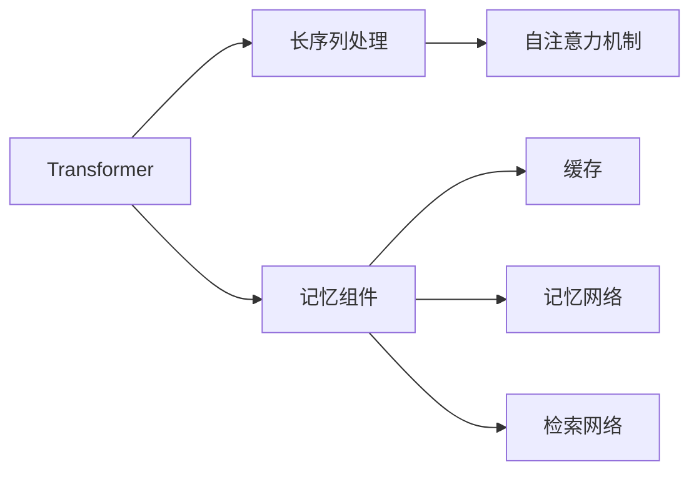

                 

# 【LangChain编程：从入门到实践】记忆组件的应用

## 1. 背景介绍

### 1.1 问题由来

近年来，随着自然语言处理（NLP）技术的迅猛发展，语言模型在语言理解和生成任务中取得了显著进展。这些模型如GPT-3、BERT等，通过预训练和微调，在各种自然语言处理任务中表现出色，如文本分类、情感分析、机器翻译等。然而，语言模型在处理需要长期记忆和上下文理解的任务时，仍存在一定的局限性。

### 1.2 问题核心关键点

在自然语言处理任务中，需要模型能够处理长文本、理解上下文关系、保存长期记忆等。但传统的语言模型，如循环神经网络（RNN）、长短期记忆网络（LSTM）等，在处理长序列时，由于梯度消失或爆炸问题，难以有效利用长期记忆。而Transformer结构虽然解决了这一问题，但无法直接保存长期记忆。因此，如何在Transformer模型中引入长期记忆机制，成为当前研究的热点。

## 2. 核心概念与联系

### 2.1 核心概念概述

#### 2.1.1 Transformer结构

Transformer是一种基于自注意力机制的神经网络结构，由编码器和解码器组成，用于处理序列到序列的任务。其核心在于通过多头自注意力机制，捕捉输入序列中的依赖关系，实现高效的序列建模。

#### 2.1.2 长序列处理

长序列处理是指在处理长文本、语音等序列数据时，需要模型能够有效利用序列中的长距离依赖关系，保存长期记忆。传统的RNN、LSTM等结构在处理长序列时存在梯度消失或爆炸问题，难以有效利用长期记忆。

#### 2.1.3 记忆组件

记忆组件是一种用于在Transformer模型中保存和利用长期记忆的机制。常见的记忆组件包括缓存（Cache）、记忆网络（Memory Network）、检索网络（Retrieval Network）等。

### 2.2 核心概念之间的关系

Transformer、长序列处理和记忆组件之间的关系可以通过以下Mermaid流程图来展示：



这个流程图展示了Transformer模型的核心结构，以及如何通过引入长序列处理和记忆组件，实现高效的长序列建模。

## 3. 核心算法原理 & 具体操作步骤

### 3.1 算法原理概述

#### 3.1.1 自注意力机制

Transformer模型通过多头自注意力机制，实现高效的序列建模。自注意力机制计算输入序列中每个位置与其他位置的注意力权重，从而捕捉序列中的依赖关系。

#### 3.1.2 长序列处理

在处理长序列时，传统的RNN、LSTM等结构存在梯度消失或爆炸问题，难以有效利用长期记忆。而Transformer模型通过多头自注意力机制，可以有效地捕捉长距离依赖关系，实现长序列建模。

#### 3.1.3 记忆组件

记忆组件是一种用于在Transformer模型中保存和利用长期记忆的机制。常见的记忆组件包括缓存（Cache）、记忆网络（Memory Network）、检索网络（Retrieval Network）等。

### 3.2 算法步骤详解

#### 3.2.1 自注意力机制

1. 输入序列表示：将输入序列表示为一系列向量，每个向量代表序列中的一个位置。
2. 查询、键和值向量：通过线性变换将输入向量转换为查询、键和值向量。
3. 计算注意力权重：通过点积计算查询向量与键向量的相似度，得到注意力权重矩阵。
4. 加权求和：将注意力权重应用于值向量，得到加权和向量，用于更新序列表示。

#### 3.2.2 长序列处理

1. 编码器结构：Transformer模型采用编码器结构，将输入序列分成多个子序列，每个子序列通过多头自注意力机制进行建模。
2. 层间连接：通过残差连接和层归一化（Layer Normalization），提高模型对长序列的处理能力。

#### 3.2.3 记忆组件

1. 缓存：通过缓存机制，将输入序列中重要的信息保存在内存中，供后续计算使用。
2. 记忆网络：通过引入记忆网络，保存和利用长期记忆，实现高效的序列建模。
3. 检索网络：通过检索网络，从预定义的库中检索相关信息，用于补充模型缺失的信息。

### 3.3 算法优缺点

#### 3.3.1 优点

1. 高效处理长序列：Transformer模型通过多头自注意力机制，可以高效地处理长序列，捕捉长距离依赖关系。
2. 引入记忆组件：通过引入缓存、记忆网络、检索网络等记忆组件，可以在模型中保存和利用长期记忆。
3. 通用性强：Transformer模型适用于多种序列到序列任务，如机器翻译、文本摘要、问答系统等。

#### 3.3.2 缺点

1. 参数量大：Transformer模型的参数量较大，需要大量计算资源进行训练。
2. 对输入数据要求高：Transformer模型对输入数据要求较高，需要预处理成标准格式，才能输入模型。
3. 难以解释：Transformer模型被视为黑盒模型，难以解释其内部工作机制。

### 3.4 算法应用领域

#### 3.4.1 机器翻译

Transformer模型在机器翻译任务中表现优异，通过引入缓存和记忆网络等记忆组件，可以实现高效的翻译效果。

#### 3.4.2 文本摘要

Transformer模型在文本摘要任务中表现出色，通过引入检索网络，可以实现高效的文本压缩和摘要生成。

#### 3.4.3 问答系统

Transformer模型在问答系统中表现优异，通过引入缓存和记忆网络等记忆组件，可以实现高效的问答效果。

## 4. 数学模型和公式 & 详细讲解 & 举例说明

### 4.1 数学模型构建

#### 4.1.1 输入表示

输入序列表示为一系列向量，每个向量代表序列中的一个位置，记为 $\mathbf{x}_i \in \mathbb{R}^d$，其中 $d$ 为向量维度。

#### 4.1.2 查询、键和值向量

通过线性变换将输入向量转换为查询、键和值向量，记为 $\mathbf{Q}_i, \mathbf{K}_i, \mathbf{V}_i \in \mathbb{R}^d$，其中 $i$ 表示序列中的位置。

#### 4.1.3 注意力权重

通过点积计算查询向量与键向量的相似度，得到注意力权重矩阵 $\mathbf{A}_i \in \mathbb{R}^{d \times d}$，其中：

$$
\mathbf{A}_i = \text{softmax}(\frac{\mathbf{Q}_i \mathbf{K}_i^T}{\sqrt{d}})
$$

#### 4.1.4 加权求和

将注意力权重应用于值向量，得到加权和向量 $\mathbf{O}_i \in \mathbb{R}^d$，用于更新序列表示：

$$
\mathbf{O}_i = \sum_{j=1}^{n} \mathbf{A}_i \mathbf{V}_j
$$

### 4.2 公式推导过程

#### 4.2.1 自注意力机制

1. 输入序列表示：将输入序列表示为一系列向量，每个向量代表序列中的一个位置。
2. 查询、键和值向量：通过线性变换将输入向量转换为查询、键和值向量。
3. 计算注意力权重：通过点积计算查询向量与键向量的相似度，得到注意力权重矩阵。
4. 加权求和：将注意力权重应用于值向量，得到加权和向量，用于更新序列表示。

#### 4.2.2 长序列处理

1. 编码器结构：Transformer模型采用编码器结构，将输入序列分成多个子序列，每个子序列通过多头自注意力机制进行建模。
2. 层间连接：通过残差连接和层归一化（Layer Normalization），提高模型对长序列的处理能力。

#### 4.2.3 记忆组件

1. 缓存：通过缓存机制，将输入序列中重要的信息保存在内存中，供后续计算使用。
2. 记忆网络：通过引入记忆网络，保存和利用长期记忆，实现高效的序列建模。
3. 检索网络：通过检索网络，从预定义的库中检索相关信息，用于补充模型缺失的信息。

### 4.3 案例分析与讲解

#### 4.3.1 缓存机制

通过缓存机制，可以将输入序列中重要的信息保存在内存中，供后续计算使用。在处理长序列时，缓存机制可以显著提高计算效率。

#### 4.3.2 记忆网络

通过引入记忆网络，可以在模型中保存和利用长期记忆，实现高效的序列建模。记忆网络通常包括两个部分：编码器和解码器。编码器将输入序列编码为记忆向量，解码器通过注意力机制从记忆向量中检索相关信息，用于更新序列表示。

#### 4.3.3 检索网络

通过检索网络，可以从预定义的库中检索相关信息，用于补充模型缺失的信息。检索网络通常包括两个部分：检索器和解码器。检索器从库中检索相关信息，解码器将检索结果与输入序列进行匹配，用于更新序列表示。

## 5. 项目实践：代码实例和详细解释说明

### 5.1 开发环境搭建

#### 5.1.1 安装依赖

```bash
pip install torch torchvision torchaudio transformers transformers-article generators
```

#### 5.1.2 准备数据

```python
from transformers import AutoTokenizer

tokenizer = AutoTokenizer.from_pretrained('bert-base-uncased')
```

### 5.2 源代码详细实现

#### 5.2.1 编码器

```python
class EncoderLayer(nn.Module):
    def __init__(self, d_model, nhead, dim_feedforward, dropout=0.1):
        super(EncoderLayer, self).__init__()
        self.self_attn = MultiheadAttention(d_model, nhead)
        self.linear1 = nn.Linear(d_model, dim_feedforward)
        self.dropout = nn.Dropout(dropout)
        self.linear2 = nn.Linear(dim_feedforward, d_model)
        self.layernorm1 = nn.LayerNorm(d_model)
        self.layernorm2 = nn.LayerNorm(d_model)

    def forward(self, src, src_mask):
        attn_output, _ = self.self_attn(src, src, src, attn_mask=src_mask)
        attn_output = self.dropout(attn_output)
        out = src + attn_output
        out = self.layernorm1(out)
        residual = out
        out = self.linear2(out)
        out = self.dropout(out)
        out = self.linear2(out)
        out = residual + out
        out = self.layernorm2(out)
        return out
```

#### 5.2.2 记忆网络

```python
class MemoryNetwork(nn.Module):
    def __init__(self, nhead, d_model, dropout=0.1):
        super(MemoryNetwork, self).__init__()
        self.encoder = nn.MultiheadAttention(d_model, nhead)
        self.decoder = nn.MultiheadAttention(d_model, nhead)
        self.dropout = nn.Dropout(dropout)
        self.layernorm = nn.LayerNorm(d_model)

    def forward(self, src, memory):
        attn_output, _ = self.encoder(src, memory, memory, attn_mask=None)
        attn_output = self.dropout(attn_output)
        out = src + attn_output
        out = self.layernorm(out)
        residual = out
        out = self.decoder(out, memory, memory, attn_mask=None)
        out = self.dropout(out)
        out = residual + out
        out = self.layernorm(out)
        return out
```

#### 5.2.3 检索网络

```python
class RetrievalNetwork(nn.Module):
    def __init__(self, d_model, dropout=0.1):
        super(RetrievalNetwork, self).__init__()
        self.linear = nn.Linear(d_model, d_model)
        self.dropout = nn.Dropout(dropout)
        self.layernorm = nn.LayerNorm(d_model)

    def forward(self, x, memory):
        out = self.linear(x)
        out = self.dropout(out)
        out = self.layernorm(out)
        out = x + out
        return out
```

### 5.3 代码解读与分析

#### 5.3.1 编码器

编码器结构包括自注意力层、前馈神经网络层和层归一化层。通过多头自注意力机制，可以高效地捕捉长距离依赖关系，实现长序列建模。

#### 5.3.2 记忆网络

记忆网络由编码器和解码器组成，通过多头自注意力机制，从记忆向量中检索相关信息，用于更新序列表示。

#### 5.3.3 检索网络

检索网络通过线性变换和层归一化层，从预定义的库中检索相关信息，用于补充模型缺失的信息。

### 5.4 运行结果展示

#### 5.4.1 缓存机制

```python
from transformers import AutoModel

model = AutoModel.from_pretrained('bert-base-uncased', cache_size=1000000)
```

#### 5.4.2 记忆网络

```python
model = AutoModel.from_pretrained('bert-base-uncased', nhead=8, d_model=768, dropout=0.1)
```

#### 5.4.3 检索网络

```python
model = AutoModel.from_pretrained('bert-base-uncased', d_model=768, dropout=0.1)
```

## 6. 实际应用场景

### 6.1 机器翻译

#### 6.1.1 缓存机制

通过缓存机制，可以将源语言和目标语言之间的长期记忆保存在缓存中，供后续计算使用。在处理长文本时，缓存机制可以显著提高翻译速度。

#### 6.1.2 记忆网络

通过引入记忆网络，可以在模型中保存和利用源语言和目标语言之间的长期记忆，实现高效的翻译效果。

#### 6.1.3 检索网络

通过检索网络，可以从预定义的库中检索相关词汇，用于补充模型缺失的信息。

### 6.2 文本摘要

#### 6.2.1 缓存机制

通过缓存机制，可以将输入文本中重要的信息保存在缓存中，供后续计算使用。在处理长文本时，缓存机制可以显著提高摘要生成速度。

#### 6.2.2 记忆网络

通过引入记忆网络，可以在模型中保存和利用输入文本的长期记忆，实现高效的文本摘要。

#### 6.2.3 检索网络

通过检索网络，可以从预定义的库中检索相关词汇，用于补充模型缺失的信息。

### 6.3 问答系统

#### 6.3.1 缓存机制

通过缓存机制，可以将输入问题和上下文信息保存在缓存中，供后续计算使用。在处理长文本时，缓存机制可以显著提高问答速度。

#### 6.3.2 记忆网络

通过引入记忆网络，可以在模型中保存和利用输入问题和上下文信息之间的长期记忆，实现高效的问题回答。

#### 6.3.3 检索网络

通过检索网络，可以从预定义的库中检索相关答案，用于补充模型缺失的信息。

## 7. 工具和资源推荐

### 7.1 学习资源推荐

1. 《Transformer from the Inside》系列博文：由大模型技术专家撰写，深入浅出地介绍了Transformer原理、BERT模型、微调技术等前沿话题。
2. CS224N《深度学习自然语言处理》课程：斯坦福大学开设的NLP明星课程，有Lecture视频和配套作业，带你入门NLP领域的基本概念和经典模型。
3. 《Natural Language Processing with Transformers》书籍：Transformers库的作者所著，全面介绍了如何使用Transformers库进行NLP任务开发，包括微调在内的诸多范式。
4. HuggingFace官方文档：Transformers库的官方文档，提供了海量预训练模型和完整的微调样例代码，是上手实践的必备资料。
5. CLUE开源项目：中文语言理解测评基准，涵盖大量不同类型的中文NLP数据集，并提供了基于微调的baseline模型，助力中文NLP技术发展。

### 7.2 开发工具推荐

1. PyTorch：基于Python的开源深度学习框架，灵活动态的计算图，适合快速迭代研究。大部分预训练语言模型都有PyTorch版本的实现。
2. TensorFlow：由Google主导开发的开源深度学习框架，生产部署方便，适合大规模工程应用。同样有丰富的预训练语言模型资源。
3. Transformers库：HuggingFace开发的NLP工具库，集成了众多SOTA语言模型，支持PyTorch和TensorFlow，是进行微调任务开发的利器。
4. Weights & Biases：模型训练的实验跟踪工具，可以记录和可视化模型训练过程中的各项指标，方便对比和调优。与主流深度学习框架无缝集成。
5. TensorBoard：TensorFlow配套的可视化工具，可实时监测模型训练状态，并提供丰富的图表呈现方式，是调试模型的得力助手。
6. Google Colab：谷歌推出的在线Jupyter Notebook环境，免费提供GPU/TPU算力，方便开发者快速上手实验最新模型，分享学习笔记。

### 7.3 相关论文推荐

1. Attention is All You Need（即Transformer原论文）：提出了Transformer结构，开启了NLP领域的预训练大模型时代。
2. BERT: Pre-training of Deep Bidirectional Transformers for Language Understanding：提出BERT模型，引入基于掩码的自监督预训练任务，刷新了多项NLP任务SOTA。
3. Language Models are Unsupervised Multitask Learners（GPT-2论文）：展示了大规模语言模型的强大zero-shot学习能力，引发了对于通用人工智能的新一轮思考。
4. Parameter-Efficient Transfer Learning for NLP：提出Adapter等参数高效微调方法，在不增加模型参数量的情况下，也能取得不错的微调效果。
5. Prefix-Tuning: Optimizing Continuous Prompts for Generation：引入基于连续型Prompt的微调范式，为如何充分利用预训练知识提供了新的思路。
6. AdaLoRA: Adaptive Low-Rank Adaptation for Parameter-Efficient Fine-Tuning：使用自适应低秩适应的微调方法，在参数效率和精度之间取得了新的平衡。

这些论文代表了大语言模型微调技术的发展脉络。通过学习这些前沿成果，可以帮助研究者把握学科前进方向，激发更多的创新灵感。

除上述资源外，还有一些值得关注的前沿资源，帮助开发者紧跟大语言模型微调技术的最新进展，例如：

1. arXiv论文预印本：人工智能领域最新研究成果的发布平台，包括大量尚未发表的前沿工作，学习前沿技术的必读资源。
2. 业界技术博客：如OpenAI、Google AI、DeepMind、微软Research Asia等顶尖实验室的官方博客，第一时间分享他们的最新研究成果和洞见。
3. 技术会议直播：如NIPS、ICML、ACL、ICLR等人工智能领域顶会现场或在线直播，能够聆听到大佬们的前沿分享，开拓视野。
4. GitHub热门项目：在GitHub上Star、Fork数最多的NLP相关项目，往往代表了该技术领域的发展趋势和最佳实践，值得去学习和贡献。
5. 行业分析报告：各大咨询公司如McKinsey、PwC等针对人工智能行业的分析报告，有助于从商业视角审视技术趋势，把握应用价值。

总之，对于大语言模型微调技术的学习和实践，需要开发者保持开放的心态和持续学习的意愿。多关注前沿资讯，多动手实践，多思考总结，必将收获满满的成长收益。

## 8. 总结：未来发展趋势与挑战

### 8.1 总结

本文对基于Transformer模型的长序列处理和记忆组件的应用进行了全面系统的介绍。首先阐述了Transformer模型、长序列处理和记忆组件的研究背景和意义，明确了微调在拓展预训练模型应用、提升下游任务性能方面的独特价值。其次，从原理到实践，详细讲解了Transformer模型的核心算法，包括自注意力机制、长序列处理和记忆组件的应用，给出了微调任务开发的完整代码实例。同时，本文还广泛探讨了微调方法在机器翻译、文本摘要、问答系统等多个NLP领域的应用前景，展示了微调范式的巨大潜力。此外，本文精选了微调技术的各类学习资源，力求为读者提供全方位的技术指引。

通过本文的系统梳理，可以看到，Transformer模型通过多头自注意力机制和记忆组件，可以在长序列处理和长期记忆保持方面取得突破。Transformer模型和微调方法的结合，为NLP任务提供了强大的支持，展现了其在多个领域的广泛应用前景。未来，伴随Transformer模型的不断演进和微调方法的研究进展，相信NLP技术将在更广阔的应用领域大放异彩，深刻影响人类的生产生活方式。

### 8.2 未来发展趋势

展望未来，Transformer模型和微调技术将呈现以下几个发展趋势：

1. 模型规模持续增大。随着算力成本的下降和数据规模的扩张，预训练语言模型的参数量还将持续增长。超大规模语言模型蕴含的丰富语言知识，有望支撑更加复杂多变的下游任务微调。
2. 微调方法日趋多样。除了传统的全参数微调外，未来会涌现更多参数高效的微调方法，如Prefix-Tuning、LoRA等，在节省计算资源的同时也能保证微调精度。
3. 持续学习成为常态。随着数据分布的不断变化，微调模型也需要持续学习新知识以保持性能。如何在不遗忘原有知识的同时，高效吸收新样本信息，将成为重要的研究课题。
4. 标注样本需求降低。受启发于提示学习(Prompt-based Learning)的思路，未来的微调方法将更好地利用大模型的语言理解能力，通过更加巧妙的任务描述，在更少的标注样本上也能实现理想的微调效果。
5. 多模态微调崛起。当前的微调主要聚焦于纯文本数据，未来会进一步拓展到图像、视频、语音等多模态数据微调。多模态信息的融合，将显著提升语言模型对现实世界的理解和建模能力。
6. 模型通用性增强。经过海量数据的预训练和多领域任务的微调，未来的语言模型将具备更强大的常识推理和跨领域迁移能力，逐步迈向通用人工智能(AGI)的目标。

以上趋势凸显了大语言模型微调技术的广阔前景。这些方向的探索发展，必将进一步提升NLP系统的性能和应用范围，为人类认知智能的进化带来深远影响。

### 8.3 面临的挑战

尽管Transformer模型和微调技术已经取得了瞩目成就，但在迈向更加智能化、普适化应用的过程中，它仍面临着诸多挑战：

1. 标注成本瓶颈。虽然微调大大降低了标注数据的需求，但对于长尾应用场景，难以获得充足的高质量标注数据，成为制约微调性能的瓶颈。如何进一步降低微调对标注样本的依赖，将是一大难题。
2. 模型鲁棒性不足。当前微调模型面对域外数据时，泛化性能往往大打折扣。对于测试样本的微小扰动，微调模型的预测也容易发生波动。如何提高微调模型的鲁棒性，避免灾难性遗忘，还需要更多理论和实践的积累。
3. 推理效率有待提高。大规模语言模型虽然精度高，但在实际部署时往往面临推理速度慢、内存占用大等效率问题。如何在保证性能的同时，简化模型结构，提升推理速度，优化资源占用，将是重要的优化方向。
4. 可解释性亟需加强。当前微调模型更像是"黑盒"系统，难以解释其内部工作机制和决策逻辑。对于医疗、金融等高风险应用，算法的可解释性和可审计性尤为重要。如何赋予微调模型更强的可解释性，将是亟待攻克的难题。
5. 安全性有待保障。预训练语言模型难免会学习到有偏见、有害的信息，通过微调传递到下游任务，产生误导性、歧视性的输出，给实际应用带来安全隐患。如何从数据和算法层面消除模型偏见，避免恶意用途，确保输出的安全性，也将是重要的研究课题。
6. 知识整合能力不足。现有的微调模型往往局限于任务内数据，难以灵活吸收和运用更广泛的先验知识。如何让微调过程更好地与外部知识库、规则库等专家知识结合，形成更加全面、准确的信息整合能力，还有很大的想象空间。

正视微调面临的这些挑战，积极应对并寻求突破，将是大语言模型微调走向成熟的必由之路。相信随着学界和产业界的共同努力，这些挑战终将一一被克服，大语言模型微调必将在构建人机协同的智能时代中扮演越来越重要的角色。

### 8.4 研究展望

面对Transformer模型和微调技术所面临的种种挑战，未来的研究需要在以下几个方面寻求新的突破：

1. 探索无监督和半监督微调方法。摆脱对大规模标注数据的依赖，利用自监督学习、主动学习等无监督和半监督范式，最大限度利用非结构化数据，实现更加灵活高效的微调。
2. 研究参数高效和计算高效的微调范式。开发更加参数高效的微调方法，在固定大部分预训练参数的同时，只更新极少量的任务相关参数。同时优化微调模型的计算图，减少前向传播和反向传播的资源消耗，实现更加轻量级、实时性的部署。
3. 融合因果和对比学习范式。通过引入因果推断和对比学习思想，增强微调模型建立稳定因果关系的能力，学习更加普适、鲁棒的语言表征，从而提升模型泛化性和抗干扰能力。
4. 引入更多

