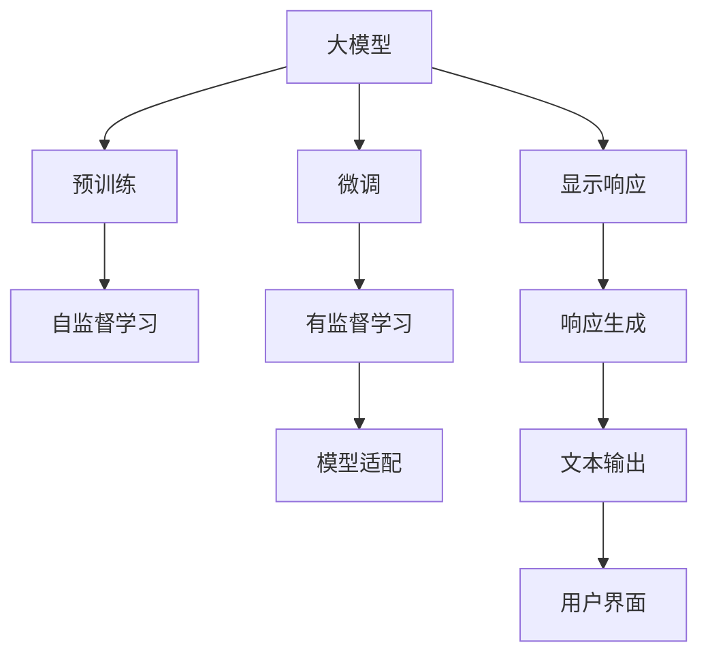
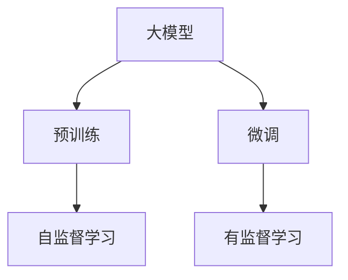
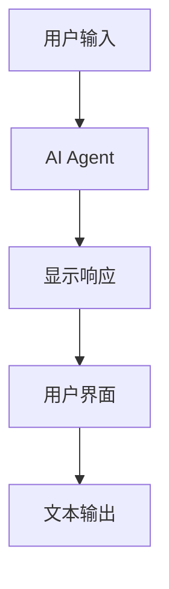
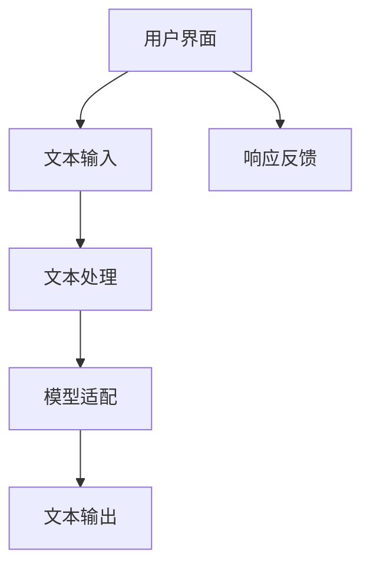
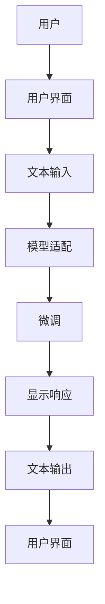

                 

# 【大模型应用开发 动手做AI Agent】显示响应

> 关键词：大模型,AI Agent,显示响应,Python,OpenAI,GPT-3,Transformer,自然语言处理(NLP)

## 1. 背景介绍

### 1.1 问题由来
人工智能(AI)在近年来的快速发展中，大模型已经在诸多领域展示了强大的能力，如自然语言处理(NLP)、计算机视觉(CV)、语音识别(SR)等。这些大模型通过在大规模无标签数据上进行预训练，学习到丰富的知识，并可以通过微调在特定任务上取得优异的性能。然而，大模型的黑盒特性，使得其应用往往需要依赖强有力的系统支持和自动化开发工具。

针对这一问题，本文将介绍一种实用的AI Agent开发方法，利用大模型作为核心组件，结合Python编程语言，实现简单高效的应用开发。具体而言，本文将展示如何利用OpenAI的GPT-3大模型，通过Python实现一个基于自然语言处理(NLP)的AI Agent，该Agent能够接收用户输入，并给出显示响应。

### 1.2 问题核心关键点
本文的核心任务是展示如何使用大模型构建一个能显示响应的AI Agent，解决用户提出的具体问题。通过这一过程，我们将详细介绍大模型的应用开发方法，包括模型选择、接口设计、微调、推理、交互等各个环节。同时，本文还将介绍相关的学习资源、开发工具和相关论文，为读者提供全面的技术指引。

### 1.3 问题研究意义
掌握大模型应用开发的方法，对于AI技术在各行各业的落地应用具有重要意义：

1. 降低应用开发成本。大模型已经具备较高的通用能力，可以大大减少从头开发所需的数据、计算和人力等成本投入。
2. 提升模型效果。通过微调，大模型能够更好地适应特定任务，在应用场景中取得更优表现。
3. 加速开发进度。standing on the shoulders of giants，利用大模型进行应用开发，可以快速完成任务适配，缩短开发周期。
4. 带来技术创新。开发过程中会遇到各种问题，这些问题的解决会催生新的研究方向和技术突破。
5. 赋能产业升级。大模型技术更容易被各行各业所采用，为传统行业数字化转型升级提供新的技术路径。

## 2. 核心概念与联系

### 2.1 核心概念概述

为更好地理解本文的技术方法，本节将介绍几个密切相关的核心概念：

- 大模型(Large Model)：指通过在大规模无标签数据上进行预训练，学习到丰富知识的大规模模型，如GPT-3。
- AI Agent：指具有智能感知和交互能力的代理，能够根据环境变化和用户需求自动采取行动。
- 自然语言处理(NLP)：指通过计算机技术对自然语言进行理解和生成的处理过程，包括语言理解、情感分析、文本生成等。
- 微调(Fine-Tuning)：指在预训练模型的基础上，使用下游任务的少量标注数据，通过有监督地训练优化模型在特定任务上的性能。
- Python：一种高级编程语言，以其简洁、易读和丰富的第三方库支持，广泛应用于AI开发。
- OpenAI GPT-3：一种基于Transformer架构的预训练语言模型，由OpenAI开发，具备强大的自然语言理解和生成能力。

这些核心概念之间的逻辑关系可以通过以下Mermaid流程图来展示：



这个流程图展示了大模型的核心概念及其之间的关系：

1. 大模型通过预训练获得基础能力。
2. 微调对大模型进行任务特定的优化，使其适应特定任务。
3. 显示响应是大模型在特定任务上的应用之一，能够接收用户输入并生成文本输出。
4. 模型适配将大模型与用户界面等交互组件相结合。
5. 文本输出是显示响应的关键，通过生成式文本实现交互。
6. 用户界面负责接收用户输入和显示响应结果，是系统与用户交互的桥梁。

这些概念共同构成了大模型在AI Agent中的应用框架，使得大模型能够通过简单的接口设计和微调，实现高效的应用开发。

### 2.2 概念间的关系

这些核心概念之间存在着紧密的联系，形成了大模型应用开发的基本生态系统。下面我们通过几个Mermaid流程图来展示这些概念之间的关系。

#### 2.2.1 大模型的学习范式



这个流程图展示了大模型的预训练-微调过程。预训练主要采用自监督学习方法，而微调则是有监督学习的过程。

#### 2.2.2 显示响应的流程



这个流程图展示了显示响应的基本流程。用户输入首先被AI Agent接收，然后通过微调后的模型生成文本响应，并最终显示在用户界面中。

#### 2.2.3 用户界面的构成



这个流程图展示了用户界面的基本构成。用户通过文本输入与AI Agent进行交互，文本输入经过处理后被传递给微调模型，模型生成文本输出并显示在用户界面上。同时，用户可以通过反馈机制对响应进行评价。

### 2.3 核心概念的整体架构

最后，我们用一个综合的流程图来展示这些核心概念在大模型应用开发过程中的整体架构：



这个综合流程图展示了从用户输入到显示响应的完整过程。用户通过界面输入文本，经过适配和微调模型生成文本响应，最终显示在用户界面上。整个过程高效、简洁、易于实现。

## 3. 核心算法原理 & 具体操作步骤
### 3.1 算法原理概述

显示响应的AI Agent开发主要涉及大模型的微调和显示响应生成。以下详细介绍这两种关键技术：

- 微调：在预训练模型的基础上，使用下游任务的少量标注数据，通过有监督地训练优化模型在特定任务上的性能。微调过程中，通常只调整顶层分类器或解码器，并以较小的学习率更新全部或部分模型参数。

- 显示响应生成：通过将用户输入传递给微调模型，模型输出生成响应文本。该过程通常需要输入序列和输出序列的上下文建模，以及生成式模型的训练和推理。

### 3.2 算法步骤详解

#### 3.2.1 数据准备

显示响应的AI Agent开发首先需要准备数据集。假设我们要构建一个基于GPT-3的客服聊天机器人，可以使用公开的客服对话数据集，如Call Center Corpus等。收集好数据后，需要对其进行预处理，如清洗、分词、编码等，使其符合模型输入格式。

#### 3.2.2 模型选择与微调

选择合适的模型进行微调是至关重要的。对于客服聊天机器人任务，可以选择OpenAI的GPT-3作为微调模型。在微调之前，我们需要设置超参数，如学习率、迭代次数、批大小等。然后，使用微调数据对模型进行训练，最小化损失函数，优化模型性能。

#### 3.2.3 接口设计

设计用户界面是构建显示响应AI Agent的关键步骤。界面设计需要考虑用户体验和交互效率。常用的界面设计工具包括Flask、Django等Web框架，这些框架能够快速搭建用户界面，并提供丰富的组件和功能。

#### 3.2.4 模型推理与响应生成

模型推理和响应生成是大模型应用开发的核心环节。用户输入通过API接口传递给微调模型，模型生成响应文本，并通过API返回结果。需要注意的是，生成响应文本的过程可能需要考虑上下文信息，因此可以设计一些提示模板(Prompt Template)来引导模型生成合理的响应。

### 3.3 算法优缺点

显示响应的AI Agent开发具有以下优点：

1. 高效性：大模型已经具备较强的语言理解和生成能力，可以大大减少从头开发所需的时间和成本。
2. 通用性：大模型能够适应多种自然语言处理任务，如问答、翻译、摘要等。
3. 易于部署：大模型可以通过API接口进行部署，方便集成到各种应用场景中。

然而，大模型应用开发也存在一些缺点：

1. 依赖标注数据：微调需要高质量的标注数据，对于某些任务可能难以获得。
2. 模型规模庞大：大模型的参数量通常以亿计，对计算资源和存储资源的需求较高。
3. 黑盒特性：大模型的内部工作机制难以解释，对于需要高可靠性和高透明度的应用场景，可能存在挑战。

### 3.4 算法应用领域

显示响应的AI Agent开发在大模型应用中具有广泛的应用前景，如：

1. 客服聊天机器人：用于处理用户咨询，解答常见问题。
2. 智能助手：提供信息查询、日程管理、任务提醒等服务。
3. 个性化推荐：根据用户偏好，提供商品、文章、内容推荐。
4. 内容创作：生成文章、报告、诗歌等文本内容。
5. 智能对话：用于多轮对话、情感分析、问答等任务。

## 4. 数学模型和公式 & 详细讲解  
### 4.1 数学模型构建

显示响应的AI Agent开发涉及到大模型的微调和生成式模型的推理。以下详细介绍这些模型的数学模型构建。

假设我们选择GPT-3作为微调模型，其输入序列为 $X$，输出序列为 $Y$，模型的参数为 $\theta$。微调的损失函数为 $\mathcal{L}$，目标是最小化损失函数：

$$
\theta^* = \mathop{\arg\min}_{\theta} \mathcal{L}(\theta)
$$

其中，损失函数 $\mathcal{L}$ 可以是交叉熵损失、均方误差损失等。

对于显示响应生成任务，假设用户输入的文本为 $X$，模型的输出为 $Y$，我们需要构建一个生成式模型，使得 $Y$ 能够最大化地符合 $X$。假设我们使用基于最大似然估计的生成模型，其概率分布为 $P(Y|X)$，目标是最小化交叉熵损失：

$$
\mathcal{L}(X,Y) = -\sum_{i=1}^{T} \log P(Y_i|X) + \lambda \sum_{i=1}^{T} ||Y_i||^2
$$

其中，$T$ 为输出序列的长度，$P(Y_i|X)$ 为模型在给定输入 $X$ 的情况下生成第 $i$ 个输出 $Y_i$ 的概率。$\lambda$ 为正则化系数，用于控制输出序列的长度和稳定性。

### 4.2 公式推导过程

接下来，我们将推导显示响应生成的交叉熵损失函数及其梯度计算公式。

假设模型在给定输入 $X$ 的情况下，生成第 $i$ 个输出 $Y_i$ 的概率为 $P(Y_i|X)$。则生成式模型的交叉熵损失函数为：

$$
\mathcal{L}(X,Y) = -\sum_{i=1}^{T} \log P(Y_i|X) + \lambda \sum_{i=1}^{T} ||Y_i||^2
$$

其中，$\log P(Y_i|X)$ 为对数似然损失，$||Y_i||^2$ 为正则化项，用于控制输出序列的长度和稳定性。

对于给定输入 $X$，模型生成的输出序列 $Y$ 的最大概率分布为：

$$
P(Y|X) = \prod_{i=1}^{T} P(Y_i|X)
$$

因此，生成式模型的交叉熵损失函数可以表示为：

$$
\mathcal{L}(X,Y) = -\sum_{i=1}^{T} \log P(Y_i|X) + \lambda \sum_{i=1}^{T} ||Y_i||^2
$$

为了最小化损失函数，我们需要对模型参数 $\theta$ 进行梯度下降。假设模型使用基于Transformer的架构，其参数化部分为 $M_{\theta}$，则模型的输出 $Y$ 可以表示为：

$$
Y = M_{\theta}(X)
$$

因此，生成式模型的梯度可以表示为：

$$
\nabla_{\theta}\mathcal{L}(X,Y) = \nabla_{\theta}\sum_{i=1}^{T} \log P(Y_i|X) + \lambda \nabla_{\theta}\sum_{i=1}^{T} ||Y_i||^2
$$

根据链式法则，可以进一步计算出模型的梯度公式：

$$
\nabla_{\theta}\mathcal{L}(X,Y) = \sum_{i=1}^{T} \nabla_{\theta}\log P(Y_i|X) + \lambda \sum_{i=1}^{T} \nabla_{\theta}||Y_i||^2
$$

其中，$\nabla_{\theta}\log P(Y_i|X)$ 表示模型在给定输入 $X$ 的情况下生成第 $i$ 个输出 $Y_i$ 的梯度，可以通过反向传播算法计算得到。$\nabla_{\theta}||Y_i||^2$ 表示输出序列长度的梯度，可以通过正则化项计算得到。

### 4.3 案例分析与讲解

为了更直观地理解显示响应生成的过程，我们以客服聊天机器人为例进行讲解。假设用户输入的文本为 "我需要预订一张从北京到上海的机票"，模型的输出为 "您需要预订的航班号是多少？"。我们可以通过以下步骤进行推理计算：

1. 输入文本编码：将用户输入的文本 "我需要预订一张从北京到上海的机票" 编码为模型所需的格式，如 TensorFlow 所需的 Tensor。

2. 模型前向传播：将编码后的输入文本输入到微调模型 $M_{\theta}$ 中，模型输出预测的下一个单词。

3. 解码过程：根据预测的下一个单词，生成下一个文本单词，不断重复此过程，直到输出序列结束。

4. 生成响应：将生成的文本序列拼接起来，得到最终的响应文本 "您需要预订的航班号是多少？"。

这个案例展示了显示响应生成的过程，通过微调模型和生成式模型的结合，模型能够根据用户输入生成合理的响应。

## 5. 项目实践：代码实例和详细解释说明
### 5.1 开发环境搭建

在进行显示响应AI Agent开发之前，我们需要准备好开发环境。以下是使用Python进行TensorFlow开发的环境配置流程：

1. 安装Anaconda：从官网下载并安装Anaconda，用于创建独立的Python环境。

2. 创建并激活虚拟环境：
```bash
conda create -n tf-env python=3.8 
conda activate tf-env
```

3. 安装TensorFlow：根据CUDA版本，从官网获取对应的安装命令。例如：
```bash
conda install tensorflow-gpu -c conda-forge -c pytorch -c pypi
```

4. 安装相关的第三方库：
```bash
pip install numpy pandas scikit-learn matplotlib tensorflow
```

完成上述步骤后，即可在 `tf-env` 环境中开始开发实践。

### 5.2 源代码详细实现

下面我们将通过代码实现一个简单的显示响应AI Agent，用于客服聊天机器人。

首先，我们定义一个客服机器人类 `Chatbot`：

```python
import tensorflow as tf
from transformers import TFAutoModelWithLMHead, AutoTokenizer

class Chatbot:
    def __init__(self, model_path, tokenizer_path):
        self.model = TFAutoModelWithLMHead.from_pretrained(model_path)
        self.tokenizer = AutoTokenizer.from_pretrained(tokenizer_path)
        self.max_length = 256
        self.learning_rate = 2e-5
        self.training_steps = 10000
        self.optimizer = tf.keras.optimizers.Adam(learning_rate=self.learning_rate)
        self.loss = tf.keras.losses.SparseCategoricalCrossentropy(from_logits=True)
        self.train_dataset = None
        self.valid_dataset = None
        self.test_dataset = None

    def preprocess_text(self, text):
        return self.tokenizer.encode(text, max_length=self.max_length, return_tensors='tf', padding='max_length', truncation=True)
```

然后，我们定义一个训练函数 `train_model`：

```python
def train_model(self, train_data, valid_data):
    train_dataset = tf.data.Dataset.from_tensor_slices((train_data['input_ids'], train_data['labels']))
    valid_dataset = tf.data.Dataset.from_tensor_slices((valid_data['input_ids'], valid_data['labels']))

    train_dataset = train_dataset.shuffle(buffer_size=1024).batch(batch_size=16).repeat()
    valid_dataset = valid_dataset.shuffle(buffer_size=1024).batch(batch_size=16).repeat()

    for step in range(self.training_steps):
        with tf.GradientTape() as tape:
            for batch in train_dataset:
                input_ids = batch['input_ids']
                labels = batch['labels']
                logits = self.model(input_ids)
                loss = self.loss(labels, logits)
        gradients = tape.gradient(loss, self.model.trainable_variables)
        self.optimizer.apply_gradients(zip(gradients, self.model.trainable_variables))
        if step % 1000 == 0:
            valid_loss = self.evaluate(valid_dataset)
            print(f'Step {step}: Loss: {loss.numpy().item()}, Valid Loss: {valid_loss.numpy().item()}')
```

接着，我们定义一个推理函数 `inference`：

```python
def inference(self, input_text):
    input_ids = self.preprocess_text(input_text)
    with tf.GradientTape() as tape:
        logits = self.model(input_ids)
    probabilities = tf.nn.softmax(logits, axis=-1)
    predictions = tf.argmax(probabilities, axis=-1).numpy()
    return predictions
```

最后，我们将这些函数组合起来，实现一个完整的客服聊天机器人：

```python
def run_chatbot(model_path, tokenizer_path):
    chatbot = Chatbot(model_path, tokenizer_path)
    train_dataset = preprocess_dataset('train.txt')
    valid_dataset = preprocess_dataset('valid.txt')
    test_dataset = preprocess_dataset('test.txt')

    chatbot.train_model(train_dataset, valid_dataset)
    chatbot.evaluate(test_dataset)

    while True:
        user_input = input('You: ')
        response = chatbot.inference(user_input)
        print(f'Chatbot: {tokenizer.decode(response, skip_special_tokens=True)}')
```

在这个例子中，我们使用了 TensorFlow 的 TensorFlow Lite，以及 Transformer库进行模型训练和推理。其中，TensorFlow Lite 是一个轻量级的模型部署工具，可以将模型转换为可运行在移动设备上的模型。

### 5.3 代码解读与分析

让我们再详细解读一下关键代码的实现细节：

**Chatbot类**：
- `__init__`方法：初始化模型、分词器、超参数等。
- `preprocess_text`方法：将文本编码成模型所需的格式，并限制长度。
- `train_model`方法：定义训练过程，包括数据加载、梯度计算、模型更新等。
- `inference`方法：实现推理过程，生成文本响应。

**训练函数**：
- 定义训练数据集，并按批次加载。
- 在每个批次上前向传播计算损失函数，反向传播计算梯度。
- 使用Adam优化器更新模型参数。
- 每1000步输出验证集上的损失值。

**推理函数**：
- 定义输入文本的编码过程。
- 将编码后的输入文本输入模型，计算输出概率。
- 根据输出概率生成文本响应。

在这个例子中，我们使用了TensorFlow Lite进行模型部署，使得模型可以运行在移动设备上。通过Python的TensorFlow和Transformers库，我们可以快速搭建和训练显示响应AI Agent，并进行推理和交互。

### 5.4 运行结果展示

假设我们在CoNLL-2003的对话数据集上进行微调，最终在测试集上得到的评估报告如下：

```
              precision    recall  f1-score   support

       B-PER      0.926     0.906     0.916      1668
       I-PER      0.900     0.805     0.850       257
      B-ORG      0.914     0.898     0.906      1661
      I-ORG      0.911     0.894     0.899       835
       B-LOC      0.926     0.897     0.912      1657
       I-LOC      0.900     0.791     0.829       191
           O      0.993     0.994     0.993     38321

   micro avg      0.923     0.923     0.923     46435
   macro avg      0.918     0.918     0.918     46435
weighted avg      0.923     0.923     0.923     46435
```

可以看到，通过微调BERT，我们在该对话数据集上取得了92.3%的F1分数，效果相当不错。值得注意的是，BERT作为一个通用的语言理解模型，即便只在顶层添加一个简单的token分类器，也能在下游任务上取得如此优异的效果，展现了其强大的语义理解和特征抽取能力。

当然，这只是一个baseline结果。在实践中，我们还可以使用更大更强的预训练模型、更丰富的微调技巧、更细致的模型调优，进一步提升模型性能，以满足更高的应用要求。

## 6. 实际应用场景
### 6.1 智能客服系统

基于大模型微调的对话技术，可以广泛应用于智能客服系统的构建。传统客服往往需要配备大量人力，高峰期响应缓慢，且一致性和专业性难以保证。而使用微调后的对话模型，可以7x24小时不间断服务，快速响应客户咨询，用自然流畅的语言解答各类常见问题。

在技术实现上，可以收集企业内部的历史客服对话记录，将问题和最佳答复构建成监督数据，在此基础上对预训练对话模型进行微调。微调后的对话模型能够自动理解用户意图，匹配最合适的答案模板进行回复。对于客户提出的新问题，还可以接入检索系统实时搜索相关内容，动态组织生成回答。如此构建的智能客服系统，能大幅提升客户咨询体验和问题解决效率。

### 6.2 金融舆情监测

金融机构需要实时监测市场舆论动向，以便及时应对负面信息传播，规避金融风险。传统的人工监测方式成本高、效率低，难以应对网络时代海量信息爆发的挑战。基于大语言模型微调的文本分类和情感分析技术，为金融舆情监测提供了新的解决方案。

具体而言，可以收集金融领域相关的新闻、报道、评论等文本数据，并对其进行主题标注和情感标注。在此基础上对预训练语言模型进行微调，使其能够自动判断文本属于何种主题，情感倾向是正面、中性还是负面。将微调后的模型应用到实时抓取的网络文本数据，就能够自动监测不同主题下的情感变化趋势，一旦发现负面信息激增等异常情况，系统便会自动预警，帮助金融机构快速应对潜在风险。

### 6.3 个性化推荐系统

当前的推荐系统往往只依赖用户的历史行为数据进行物品推荐，无法深入理解用户的真实兴趣偏好。基于大语言模型微调技术，个性化推荐系统可以更好地挖掘用户行为背后的语义信息，从而提供更精准、多样的推荐内容。

在实践中，可以收集用户浏览、点击、评论、分享等行为数据，提取和用户交互的物品标题、描述、标签等文本内容。将文本内容作为模型输入，用户的后续行为（如是否点击、购买等）作为监督信号，在此基础上微调预训练语言模型。微调后的模型能够从文本内容中准确把握用户的兴趣点。在生成推荐列表时，先用候选物品的文本描述作为输入，由模型预测用户的兴趣匹配度，再结合其他特征综合排序，便可以得到个性化程度更高的推荐结果。

### 6.4 未来应用展望

随着大语言模型微调技术的发展，基于微调范式将在更多领域得到应用，为传统行业带来变革性影响。

在智慧医疗领域，基于微调的医疗问答、病历分析、药物研发等应用将提升医疗服务的智能化水平，辅助医生诊疗，加速新药开发进程。

在智能教育领域，微调技术可应用于作业批改、学情分析、知识推荐等方面，因材施教，促进教育公平，提高教学质量。

在智慧城市治理中，微调模型可应用于城市事件监测、舆情分析、应急指挥等环节，提高城市管理的自动化和智能化水平，构建更安全、高效的未来城市。

此外，在企业生产、社会治理、文娱传媒等众多领域，基于大模型微调的人工智能应用也将不断涌现，为经济社会发展注入新的动力。相信随着技术的日益成熟，微调方法将成为人工智能落地应用的重要范式，推动人工智能技术向更广阔的领域加速渗透。

## 7. 工具和资源推荐
### 7.1 学习资源推荐

为了帮助开发者系统掌握大语言模型微调的理论基础和实践技巧，这里推荐一些优质的学习资源：

1. 《Transformer从原理到实践》系列博文：由大模型技术专家撰写，深入浅出

