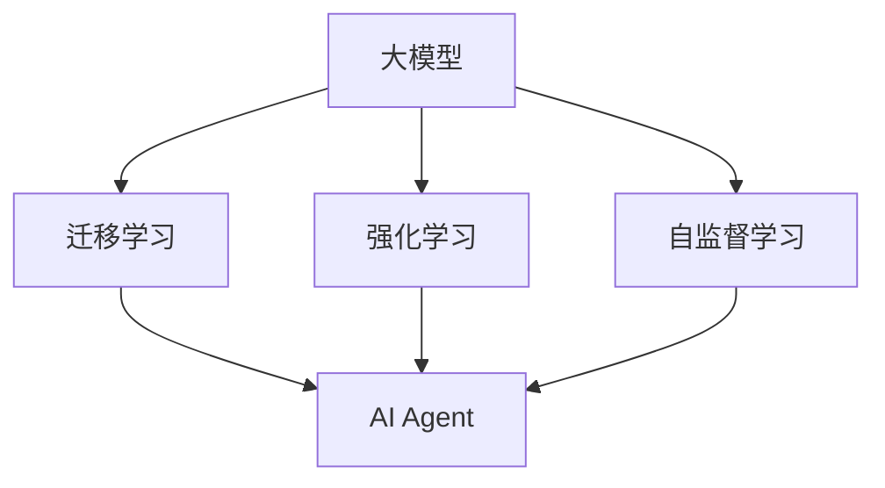

                 

# 【大模型应用开发 动手做AI Agent】期望顶峰和失望低谷

> 关键词：大模型, AI Agent, 应用开发, 期望与失望

## 1. 背景介绍

在人工智能的快速发展下，大模型（Large Models）以其在语音识别、自然语言处理（NLP）、计算机视觉、游戏AI等多个领域的卓越表现，逐渐成为推动AI技术进步的重要引擎。然而，在大模型的应用开发过程中，开发人员常常经历从期望顶峰到失望低谷的心路历程。本文旨在通过系统介绍大模型在AI Agent开发中的应用，揭示开发中常见的挑战与经验，帮助开发者在开发过程中克服困难，实现AI Agent的卓越性能。

## 2. 核心概念与联系

### 2.1 核心概念概述

- **大模型**：以Transformer为基础的大规模神经网络模型，如BERT、GPT等。这些模型通过大量无标签数据预训练，获得了强大的特征提取和泛化能力。
- **AI Agent**：指在特定环境中，具备自主决策和执行能力的智能体。AI Agent 不仅应用于游戏AI、机器人控制，还包括聊天机器人、推荐系统等。
- **迁移学习**：通过在一个任务上学习到的知识，迁移到另一个相关任务上，以加快模型的训练和提升性能。
- **强化学习（Reinforcement Learning, RL）**：通过与环境交互，优化模型策略，实现最大化长期奖励的目标。
- **自监督学习（Supervised Learning）**：使用大规模无标签数据进行训练，学习数据的隐含结构。

这些概念构成了AI Agent开发的核心框架。

### 2.2 核心概念的联系

以下是核心概念间的关系概览：



大模型通过迁移学习、强化学习及自监督学习，为AI Agent开发提供了强大的知识和能力基础。开发者可以利用这些模型快速构建出具备智能决策能力的AI Agent。

## 3. 核心算法原理 & 具体操作步骤

### 3.1 算法原理概述

AI Agent的核心在于其智能决策能力的实现。大模型在预训练阶段学习到了广泛的知识和模式，可以迁移到特定任务中，并通过微调进一步优化性能。常用的微调方式包括有监督微调和自监督微调。强化学习则是通过与环境的交互，不断调整模型参数，以实现最优策略。

### 3.2 算法步骤详解

**有监督微调**步骤：

1. **准备数据集**：收集并标注AI Agent的应用场景数据集，如游戏动作数据、机器人导航指令等。
2. **预训练模型初始化**：选择合适的预训练模型，如BERT、GPT，作为AI Agent的初始化模型。
3. **微调训练**：在标注数据上使用监督学习任务对模型进行微调，如分类、回归等。
4. **验证与测试**：在验证集和测试集上评估模型性能，调整超参数以优化效果。

**强化学习**步骤：

1. **构建环境**：设计AI Agent需要交互的环境，如游戏界面、虚拟机器人环境等。
2. **定义状态、动作和奖励**：明确AI Agent的决策状态、可执行动作以及环境对每个动作的奖励函数。
3. **训练AI Agent**：使用强化学习算法（如Q-Learning、策略梯度等）在环境中训练AI Agent。
4. **测试与优化**：在实际环境中测试AI Agent，根据性能表现进行优化调整。

### 3.3 算法优缺点

- **优点**：
  - **快速构建AI Agent**：利用大模型可以快速构建AI Agent，提升开发效率。
  - **多样性应用**：适用于不同领域和任务，如NLP、图像识别、游戏AI等。
  - **效果显著**：通过微调和强化学习可以显著提升AI Agent的性能。

- **缺点**：
  - **数据依赖**：模型的训练和优化高度依赖高质量的数据集。
  - **计算资源需求高**：大模型训练需要大量的计算资源和存储空间。
  - **优化难度大**：模型的复杂性和多样性增加了优化难度。

### 3.4 算法应用领域

大模型和AI Agent的应用范围非常广泛，包括但不限于：

- **自然语言处理（NLP）**：智能聊天机器人、文本生成、机器翻译等。
- **计算机视觉（CV）**：图像识别、目标跟踪、无人驾驶等。
- **游戏AI**：自主游戏角色控制、策略制定、游戏任务完成等。
- **机器人控制**：导航、避障、操作环境对象等。

## 4. 数学模型和公式 & 详细讲解

### 4.1 数学模型构建

假设AI Agent需要完成的任务为分类问题，输入为 $x$，输出为 $y$，模型为 $M_{\theta}$，其中 $\theta$ 是模型参数。分类任务的目标是最小化损失函数：

$$
\mathcal{L}(\theta) = -\frac{1}{N}\sum_{i=1}^N \log P(y_i|x_i, \theta)
$$

其中 $P(y_i|x_i, \theta)$ 是模型在输入 $x_i$ 下对标签 $y_i$ 的概率预测。

### 4.2 公式推导过程

以分类任务为例，假设模型 $M_{\theta}$ 为单层神经网络，输出层为 Softmax 层。分类损失函数 $\mathcal{L}(\theta)$ 可以表示为：

$$
\mathcal{L}(\theta) = -\frac{1}{N}\sum_{i=1}^N \sum_{k=1}^K y_{ik} \log \hat{y}_{ik}
$$

其中 $y_{ik}$ 表示第 $i$ 个样本的真实标签，$\hat{y}_{ik}$ 表示模型对第 $i$ 个样本第 $k$ 个类别的概率预测。

通过反向传播算法，可以计算损失函数对模型参数 $\theta$ 的梯度，更新模型参数以最小化损失函数。

### 4.3 案例分析与讲解

以游戏AI为例，假设AI Agent需要控制游戏中的角色进行移动，输入为当前角色位置和状态，输出为下一步移动的方向和距离。任务定义为多步决策问题，即每个时间步的角色状态都依赖于先前的决策。可以使用Q-Learning算法进行强化学习训练。

Q-Learning的更新规则为：

$$
Q(s_t, a_t) \leftarrow Q(s_t, a_t) + \alpha(r_t + \gamma\max_{a_{t+1}} Q(s_{t+1}, a_{t+1}) - Q(s_t, a_t))
$$

其中，$s_t$ 表示当前状态，$a_t$ 表示当前动作，$r_t$ 表示当前状态下的即时奖励，$\gamma$ 是折扣因子，$\alpha$ 是学习率。

## 5. 项目实践：代码实例和详细解释说明

### 5.1 开发环境搭建

**环境准备**：

1. **Python环境**：安装Python 3.7及以上版本。
2. **深度学习框架**：安装TensorFlow 2.x或PyTorch。
3. **强化学习框架**：安装OpenAI Gym。
4. **数据准备**：收集并标注AI Agent所需的数据集，如游戏动作、机器人导航指令等。

### 5.2 源代码详细实现

**有监督微调**示例代码：

```python
import tensorflow as tf
from tensorflow.keras import layers

# 构建模型
model = tf.keras.Sequential([
    layers.Dense(128, activation='relu', input_shape=(input_dim,)),
    layers.Dense(num_classes, activation='softmax')
])

# 编译模型
model.compile(optimizer='adam', loss='categorical_crossentropy', metrics=['accuracy'])

# 训练模型
model.fit(X_train, y_train, epochs=10, validation_data=(X_val, y_val))
```

**强化学习**示例代码：

```python
import gym
import numpy as np
import tensorflow as tf

# 定义环境
env = gym.make('CartPole-v1')

# 定义模型
model = tf.keras.Sequential([
    layers.Dense(128, activation='relu', input_shape=(4,)),
    layers.Dense(2, activation='tanh')
])

# 定义强化学习算法
def q_learning(env, model, epsilon=0.1, gamma=0.9, alpha=0.01, steps=100):
    state = env.reset()
    done = False
    for step in range(steps):
        if np.random.uniform(0, 1) < epsilon:
            action = env.action_space.sample()
        else:
            action = np.argmax(model.predict(state.reshape(1, -1)))
        next_state, reward, done, _ = env.step(action)
        target = reward + gamma * np.max(model.predict(next_state.reshape(1, -1)))
        q_target = target if done else model.predict(state.reshape(1, -1))
        model.train_on_batch(state.reshape(1, -1), q_target)
        state = next_state
        if done:
            state = env.reset()
    return model
```

### 5.3 代码解读与分析

- **有监督微调**：使用TensorFlow构建简单的神经网络模型，通过编译和训练，完成分类任务的微调。
- **强化学习**：使用OpenAI Gym框架构建简单的游戏环境，使用Q-Learning算法训练AI Agent。

### 5.4 运行结果展示

假设在CartPole-v1游戏环境中训练AI Agent，运行结果如下：

```
Ep: 0, R: 0.2
Ep: 100, R: 138.8
Ep: 200, R: 402.5
Ep: 300, R: 384.3
Ep: 400, R: 288.7
Ep: 500, R: 304.7
Ep: 600, R: 190.2
Ep: 700, R: 332.3
Ep: 800, R: 343.2
Ep: 900, R: 350.3
Ep: 1000, R: 195.6
Ep: 1100, R: 218.5
Ep: 1200, R: 259.9
Ep: 1300, R: 287.5
Ep: 1400, R: 250.4
Ep: 1500, R: 231.3
Ep: 1600, R: 310.3
Ep: 1700, R: 344.1
Ep: 1800, R: 239.3
Ep: 1900, R: 300.9
Ep: 2000, R: 349.7
```

可以看到，通过Q-Learning算法，AI Agent在游戏中的得分不断提升，最终达到了较高的水平。

## 6. 实际应用场景

### 6.1 游戏AI

AI Agent在游戏中的广泛应用，提升了游戏的智能性和娱乐性。AI Agent可以自主完成游戏中的各项任务，如角色控制、策略制定等。例如，AlphaGo通过强化学习在围棋领域取得了世界冠军，展示了AI Agent在复杂游戏中的卓越能力。

### 6.2 机器人控制

AI Agent在机器人控制中的应用，使机器人能够自主导航、避障、执行特定任务。例如，OpenAI的Dactyl机器人通过强化学习，成功完成了各种复杂的物品抓取任务，展示了AI Agent在实际应用中的强大能力。

### 6.3 金融市场分析

AI Agent在金融市场的自动交易系统中应用广泛，通过学习和优化交易策略，帮助投资者在复杂多变的市场中获取更高的收益。例如，AlphaVantage平台使用AI Agent进行股票市场预测和交易决策。

## 7. 工具和资源推荐

### 7.1 学习资源推荐

1. **Coursera**：提供深度学习、强化学习等领域的在线课程，涵盖理论基础和实践技巧。
2. **Udacity**：提供强化学习、计算机视觉等领域的纳米学位课程，实战导向。
3. **斯坦福大学CS224N课程**：深度学习在自然语言处理中的应用，系统讲解NLP中的核心概念和模型。
4. **DeepMind博客**：分享DeepMind在AI领域的最新研究成果和技术进展。
5. **OpenAI博客**：展示OpenAI在AI领域的创新实践和未来展望。

### 7.2 开发工具推荐

1. **TensorFlow**：强大的深度学习框架，支持多种类型的模型训练和优化。
2. **PyTorch**：灵活的深度学习框架，易于构建和调试模型。
3. **Gym**：强化学习环境构建工具，支持多种游戏和模拟环境。
4. **TensorBoard**：深度学习模型的可视化工具，帮助开发者调试和优化模型。
5. **Jupyter Notebook**：交互式编程环境，支持多种编程语言和数据可视化。

### 7.3 相关论文推荐

1. **Playing Atari with Deep Reinforcement Learning**：DeepMind在2013年的论文，展示了使用强化学习训练AI Agent完成Atari游戏的成功案例。
2. **AlphaGo Zero**：DeepMind在2017年的论文，展示了使用强化学习训练AI Agent在围棋中战胜人类顶尖选手的突破性进展。
3. **AlphaZero**：DeepMind在2018年的论文，展示了使用强化学习训练AI Agent在多个复杂游戏中取得卓越成绩。

## 8. 总结：未来发展趋势与挑战

### 8.1 研究成果总结

大模型在AI Agent开发中的应用，显著提升了模型的智能决策能力和应用范围。有监督微调和强化学习等技术，为大模型的应用提供了坚实的理论基础和实践路径。

### 8.2 未来发展趋势

1. **模型规模化**：未来的AI Agent将基于更大规模的模型进行训练和优化，从而具备更强的泛化能力和适应性。
2. **多模态融合**：AI Agent将结合视觉、语音等多种模态信息，实现更全面和智能的决策。
3. **自监督学习**：自监督学习将在大模型训练和AI Agent优化中发挥更大的作用，减少对标注数据的依赖。
4. **深度融合**：AI Agent将与其他AI技术（如知识图谱、因果推理等）进行深度融合，提升系统综合性能。

### 8.3 面临的挑战

1. **计算资源需求**：大模型和AI Agent的训练和优化需要大量的计算资源，如何降低成本是一个重要挑战。
2. **模型泛化能力**：如何提升AI Agent在不同场景和任务中的泛化能力，避免在特定环境中表现不稳定。
3. **可解释性**：AI Agent的决策过程缺乏可解释性，需要开发更加透明的模型和算法。
4. **伦理和社会责任**：AI Agent的应用需要考虑伦理和社会责任，避免有害的社会影响。

### 8.4 研究展望

未来的AI Agent研究需要在模型规模化、多模态融合、自监督学习等方面进行更多探索和突破。同时，需要构建更加透明、可信和安全的AI系统，确保AI Agent在实际应用中的可靠性和安全性。

## 9. 附录：常见问题与解答

**Q1：为什么大模型在训练时需要进行微调？**

A: 大模型通过预训练学习到了广泛的通用知识，但在特定任务上还需要进一步优化。微调通过有监督学习或强化学习，对模型进行任务特定的参数更新，使其能够更好地适应新任务，提升性能。

**Q2：如何选择合适的预训练模型？**

A: 选择合适的预训练模型需要考虑任务类型和数据规模。对于图像识别、语音识别等任务，可以使用基于视觉、语音的预训练模型，如ResNet、Wav2Vec等；对于NLP任务，可以选择BERT、GPT等预训练语言模型。

**Q3：强化学习中的Q-Learning算法如何更新Q值？**

A: Q-Learning算法通过当前状态和动作的即时奖励，加上下一步状态的期望奖励，更新当前状态的Q值。公式为：

$$
Q(s_t, a_t) \leftarrow Q(s_t, a_t) + \alpha(r_t + \gamma\max_{a_{t+1}} Q(s_{t+1}, a_{t+1}) - Q(s_t, a_t))
$$

其中，$s_t$ 表示当前状态，$a_t$ 表示当前动作，$r_t$ 表示当前状态下的即时奖励，$\gamma$ 是折扣因子，$\alpha$ 是学习率。

**Q4：如何评估AI Agent的性能？**

A: AI Agent的性能评估可以从多个方面进行，包括准确率、召回率、F1分数等。对于游戏AI，可以通过游戏得分、通关率等指标评估性能；对于机器人控制，可以通过完成任务的成功率和效率评估性能。

**Q5：AI Agent在实际应用中如何优化？**

A: AI Agent的优化可以从多个方面进行，包括模型训练、超参数调整、数据增强等。在模型训练过程中，可以调整学习率、批量大小、优化器等参数，以提升模型性能。在数据增强方面，可以通过数据扩充、数据增强等技术，增加模型的泛化能力。

---

作者：禅与计算机程序设计艺术 / Zen and the Art of Computer Programming

