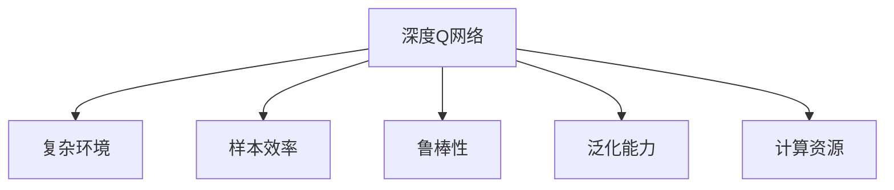
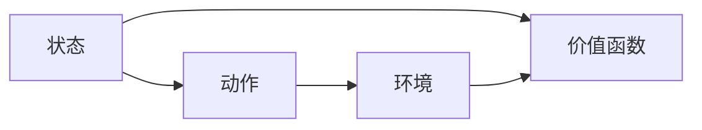
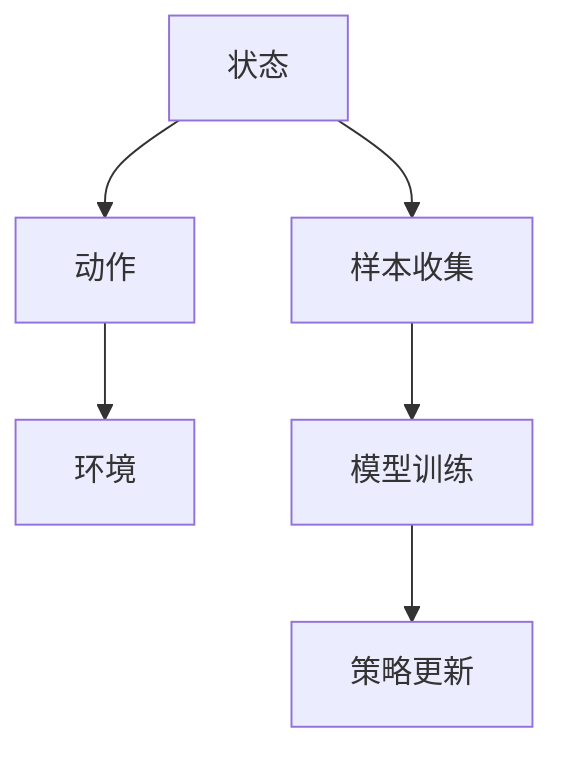
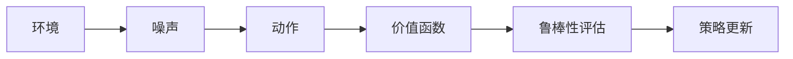
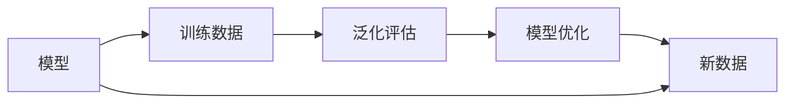
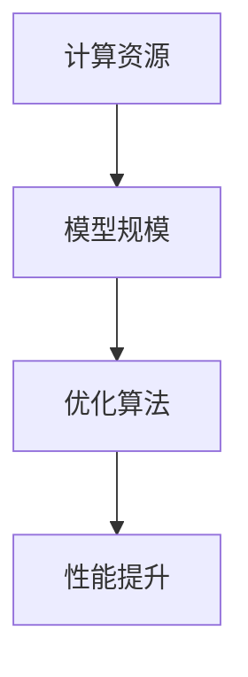
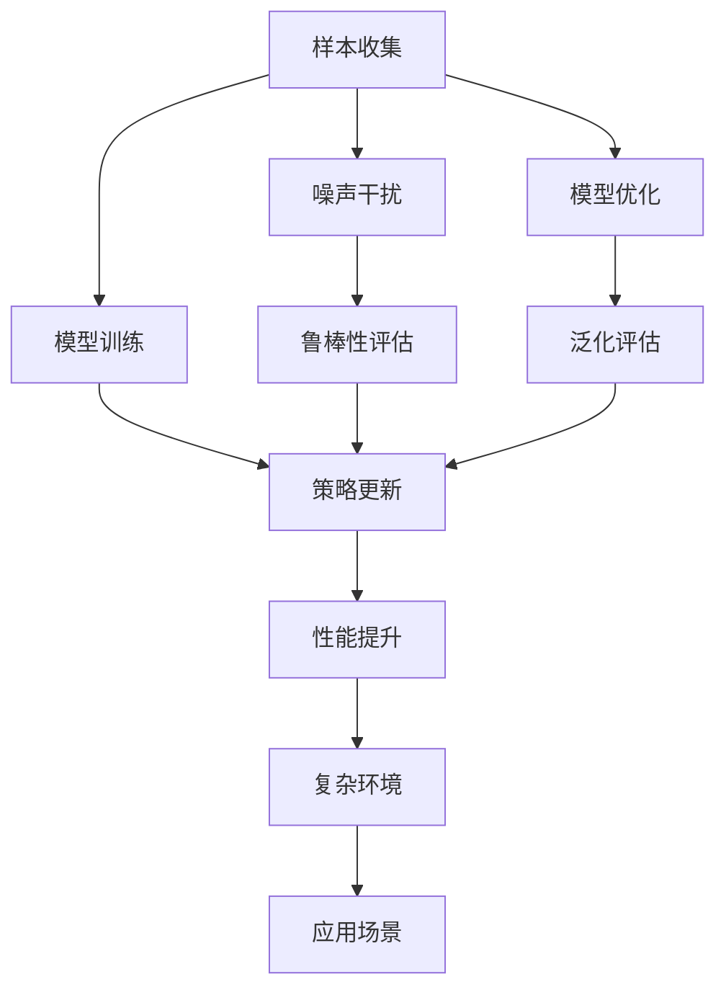

                 

# 一切皆是映射：DQN在复杂环境下的应对策略与改进

> 关键词：DQN,复杂环境,算法优化,分布式训练,深度强化学习,策略网络,目标网络,经验回放

## 1. 背景介绍

### 1.1 问题由来
深度强化学习(DRL)作为一种能够学习复杂动态环境策略的算法，已经在游戏AI、机器人控制、工业自动化等多个领域取得了显著的进展。其中，深度Q网络(DQN)是最为流行和成功的一种方法。然而，随着DRL在实际应用中的逐渐深入，研究人员逐渐发现了它在处理复杂环境时的局限性，包括样本效率低、鲁棒性差等问题。

本博客将聚焦于在复杂环境下提升DQN的性能和可靠性，并在此基础上提出一些有效的应对策略和改进方法。文章首先介绍DQN算法的基本原理和核心思想，随后详细介绍如何在复杂环境下优化DQN算法，最后通过具体的项目实践展示DQN算法的改进效果，并展望其未来的应用前景。

### 1.2 问题核心关键点
DQN算法通过神经网络近似Q值函数，进而学习最优策略，优化奖励函数。然而，DQN算法在处理复杂环境时存在一些挑战：

1. **样本效率低**：复杂环境的动态变化增加了DQN算法对样本的需求，样本效率低限制了算法的泛化能力。

2. **鲁棒性差**：DQN算法对噪声和干扰敏感，导致在复杂环境下的性能下降。

3. **泛化能力弱**：DQN算法在训练过程中容易过拟合，泛化能力不足。

4. **计算资源消耗大**：复杂的Q值函数训练需要大量的计算资源，增加了算法的实现难度。

本博客旨在解决以上问题，提升DQN算法在复杂环境下的性能和鲁棒性，并探讨其未来的应用方向。

## 2. 核心概念与联系

### 2.1 核心概念概述

为更好地理解DQN在复杂环境下的应对策略与改进方法，本节将介绍几个密切相关的核心概念：

- **深度Q网络(DQN)**：一种结合深度神经网络和强化学习原理的算法，通过学习Q值函数近似最优策略。
- **复杂环境**：环境具有高维性、非线性和不确定性等特点，使得DQN算法难以直接应用。
- **样本效率**：算法在训练过程中对样本的利用效率，即能否从少量样本中学习有效的策略。
- **鲁棒性**：算法对环境噪声、扰动等异常情况的表现，即能否在复杂环境中保持稳定性能。
- **泛化能力**：算法从训练集到测试集的泛化能力，即能否在新环境中保持稳定性能。
- **计算资源**：算法在实现和训练过程中所需的时间和计算资源。

这些概念之间的逻辑关系可以通过以下Mermaid流程图来展示：



这个流程图展示了大语言模型的核心概念及其之间的关系：

1. DQN算法在复杂环境中面临的挑战。
2. DQN算法通过样本效率、鲁棒性、泛化能力等概念进行优化。
3. 优化算法所需的计算资源。

### 2.2 概念间的关系

这些核心概念之间存在着紧密的联系，形成了DQN算法应对复杂环境的完整生态系统。下面我们通过几个Mermaid流程图来展示这些概念之间的关系。

#### 2.2.1 DQN算法的基本架构



这个流程图展示了DQN算法的基本架构。算法通过状态和动作映射到价值函数，进而得到Q值，最终选择最优动作。

#### 2.2.2 样本效率与训练策略



这个流程图展示了样本收集、模型训练和策略更新之间的关联。样本效率高意味着算法能够快速收集有效样本，从而提高模型的训练效率。

#### 2.2.3 鲁棒性与安全策略



这个流程图展示了噪声对环境的影响以及鲁棒性评估和策略更新之间的关系。鲁棒性评估能够检测到噪声对策略的影响，从而更新策略以提高算法的鲁棒性。

#### 2.2.4 泛化能力与模型优化



这个流程图展示了模型优化和泛化评估之间的关系。模型优化可以提升泛化能力，从而在新数据上保持稳定性能。

#### 2.2.5 计算资源与优化策略



这个流程图展示了计算资源和优化算法之间的关系。计算资源的消耗与模型规模和优化算法的选择密切相关，优化算法能够提升性能而减少计算资源的消耗。

### 2.3 核心概念的整体架构

最后，我们用一个综合的流程图来展示这些核心概念在DQN算法中的整体架构：



这个综合流程图展示了从样本收集到性能提升的完整过程，以及复杂环境和应用场景之间的关系。

## 3. 核心算法原理 & 具体操作步骤
### 3.1 算法原理概述

深度Q网络(DQN)算法通过神经网络逼近Q值函数，进而学习最优策略。算法的核心思想如下：

1. **状态动作Q值函数**：通过神经网络将状态和动作映射到Q值，表示在不同状态下执行不同动作的即时奖励期望。
2. **策略网络**：神经网络模型，用于计算Q值。
3. **目标网络**：固定的神经网络模型，用于计算Q值的基准值。
4. **经验回放**：将收集到的经验数据存储在缓冲区中，用于训练和优化策略网络。

DQN算法通过优化策略网络，使得算法能够在复杂环境中学习最优策略。但是，DQN算法在处理复杂环境时，容易陷入局部最优，且样本效率低、鲁棒性差等问题亟待解决。

### 3.2 算法步骤详解

DQN算法在复杂环境下的具体操作步骤如下：

1. **环境初始化**：定义环境的初始状态和动作空间，并设置相关参数。
2. **样本收集**：从环境中收集样本数据，包括状态、动作和奖励。
3. **策略网络训练**：将收集到的样本数据输入策略网络，计算Q值，并更新网络参数。
4. **目标网络更新**：将策略网络的参数复制到目标网络中，以提供稳定的基准值。
5. **经验回放**：将样本数据存储在缓冲区中，用于训练和优化策略网络。
6. **策略更新**：根据样本数据更新策略网络的参数，从而不断优化策略。

### 3.3 算法优缺点

DQN算法在复杂环境下的优缺点如下：

**优点**：

1. **高泛化能力**：能够学习复杂环境的策略，适用于各种复杂任务。
2. **可扩展性**：算法可以并行训练，提高计算效率。
3. **稳定性能**：通过经验回放和目标网络更新，算法能够保持稳定性能。

**缺点**：

1. **样本效率低**：在复杂环境中，样本数据难以收集，限制了算法的泛化能力。
2. **鲁棒性差**：对噪声和扰动敏感，导致在复杂环境中的性能下降。
3. **计算资源消耗大**：复杂的神经网络模型训练需要大量的计算资源，增加了算法的实现难度。

### 3.4 算法应用领域

DQN算法在复杂环境下的应用领域包括：

1. **游戏AI**：通过学习最优策略，在复杂游戏中取得优异成绩。
2. **机器人控制**：通过学习最优动作策略，实现机器人的自主导航和操作。
3. **工业自动化**：通过学习最优控制策略，优化工业设备的运行效率。
4. **自然语言处理**：通过学习最优词汇选择策略，提高自然语言理解和生成能力。

## 4. 数学模型和公式 & 详细讲解  
### 4.1 数学模型构建

本节将使用数学语言对DQN算法在复杂环境下的优化过程进行更加严格的刻画。

假设DQN算法在复杂环境中的状态空间为 $S$，动作空间为 $A$，奖励函数为 $R$，策略网络为 $f_{\theta}$，目标网络为 $f_{\theta'}$，经验缓冲区为 $D$。

设 $s_t$ 为状态， $a_t$ 为动作， $r_t$ 为奖励， $s_{t+1}$ 为下一状态， $s_{t_{\text{end}}}$ 为终止状态。则状态动作Q值函数可以表示为：

$$
Q(s_t, a_t) = \mathbb{E}\left[R(s_t, a_t) + \gamma \max_{a_{t+1}} Q(s_{t+1}, a_{t+1}) \mid s_t, a_t\right]
$$

其中 $\gamma$ 为折扣因子。策略网络 $f_{\theta}$ 用于计算Q值，目标网络 $f_{\theta'}$ 用于计算基准Q值。

### 4.2 公式推导过程

以下我们以Q值函数为例，推导DQN算法在复杂环境中的训练过程。

假设策略网络 $f_{\theta}$ 的输出为 $Q(s_t, a_t)$，则算法的训练过程如下：

1. **策略网络训练**：将样本数据 $(s_t, a_t, r_t, s_{t+1})$ 输入策略网络，计算Q值，并更新网络参数。
2. **目标网络更新**：将策略网络的参数复制到目标网络中，计算基准Q值。
3. **经验回放**：将样本数据存储在缓冲区中，用于训练和优化策略网络。

具体步骤如下：

1. 从环境收集样本数据 $(s_t, a_t, r_t, s_{t+1})$。
2. 将样本数据输入策略网络 $f_{\theta}$，计算Q值 $Q(s_t, a_t)$。
3. 计算目标网络 $f_{\theta'}$ 的输出，得到基准Q值 $Q'(s_t, a_t)$。
4. 根据样本数据和目标网络更新策略网络参数：
   $$
   \theta \leftarrow \theta - \eta \nabla_{\theta} \mathcal{L}(\theta)
   $$
   其中 $\mathcal{L}$ 为损失函数，$\eta$ 为学习率，$\nabla_{\theta}$ 为梯度。

### 4.3 案例分析与讲解

我们以一个简单的迷宫游戏为例，演示DQN算法在复杂环境中的训练过程。

假设迷宫的每个格点表示一个状态，每个格点有四种可能的动作（上、下、左、右）。我们定义一个Q值函数，表示在当前状态下执行不同动作的即时奖励期望。在训练过程中，我们通过策略网络 $f_{\theta}$ 计算Q值，并通过目标网络 $f_{\theta'}$ 计算基准Q值。每次迭代中，我们随机选择一个状态 $s_t$，通过策略网络计算Q值 $Q(s_t, a_t)$，并将样本数据存储在缓冲区 $D$ 中。接着，我们更新策略网络参数 $\theta$，使得 $Q(s_t, a_t)$ 最小化。最后，我们将策略网络参数复制到目标网络中，更新目标网络参数 $\theta'$。

## 5. 项目实践：代码实例和详细解释说明
### 5.1 开发环境搭建

在进行DQN算法在复杂环境下的优化实践前，我们需要准备好开发环境。以下是使用Python进行PyTorch开发的环境配置流程：

1. 安装Anaconda：从官网下载并安装Anaconda，用于创建独立的Python环境。

2. 创建并激活虚拟环境：
```bash
conda create -n pytorch-env python=3.8 
conda activate pytorch-env
```

3. 安装PyTorch：根据CUDA版本，从官网获取对应的安装命令。例如：
```bash
conda install pytorch torchvision torchaudio cudatoolkit=11.1 -c pytorch -c conda-forge
```

4. 安装TensorBoard：用于可视化训练过程和结果。
```bash
pip install tensorboard
```

完成上述步骤后，即可在`pytorch-env`环境中开始DQN算法的优化实践。

### 5.2 源代码详细实现

下面我们以一个简单的迷宫游戏为例，给出使用PyTorch对DQN算法进行优化的PyTorch代码实现。

首先，定义游戏环境：

```python
import gym
import numpy as np

class MazeEnv(gym.Env):
    def __init__(self, maze, start, end):
        self.maze = maze
        self.start = start
        self.end = end
        self.observation_space = gym.spaces.Discrete(maze.shape[0] * maze.shape[1])
        self.action_space = gym.spaces.Discrete(4)
        self.state = start

    def step(self, action):
        x, y = self.state
        if action == 0:
            y += 1
        elif action == 1:
            y -= 1
        elif action == 2:
            x += 1
        elif action == 3:
            x -= 1

        self.state = (x, y)
        if self.state == self.end:
            return self.state, 1, True, {}
        else:
            return self.state, 0, False, {}

    def reset(self):
        self.state = self.start
        return self.state

    def render(self):
        pass
```

然后，定义DQN算法的基本结构：

```python
import torch
import torch.nn as nn
import torch.optim as optim
from collections import deque
from tensorboard import SummaryWriter

class DQN(nn.Module):
    def __init__(self, input_size, output_size, hidden_size):
        super(DQN, self).__init__()
        self.fc1 = nn.Linear(input_size, hidden_size)
        self.fc2 = nn.Linear(hidden_size, hidden_size)
        self.fc3 = nn.Linear(hidden_size, output_size)

    def forward(self, x):
        x = F.relu(self.fc1(x))
        x = F.relu(self.fc2(x))
        x = self.fc3(x)
        return x

class Agent:
    def __init__(self, env, input_size, output_size, learning_rate, buffer_size):
        self.env = env
        self.input_size = input_size
        self.output_size = output_size
        self.learning_rate = learning_rate
        self.buffer_size = buffer_size
        self.model = DQN(input_size, output_size, 64)
        self.target_model = DQN(input_size, output_size, 64)
        self.target_model.eval()
        self.memory = deque(maxlen=buffer_size)
        self.optimizer = optim.Adam(self.model.parameters(), lr=learning_rate)
        self.loss_fn = nn.MSELoss()

    def act(self, state):
        with torch.no_grad():
            return self.model(state).argmax().item()

    def train(self, batch_size, gamma):
        if len(self.memory) < batch_size:
            return
        _, state, action, reward, next_state, done = zip(*self.memory)
        next_q_values = self.target_model(next_state)
        q_values = self.model(state)
        q_values = q_values.gather(1, action)
        if not done:
            q_values = q_values * gamma + next_q_values

        loss = self.loss_fn(q_values, reward)
        self.optimizer.zero_grad()
        loss.backward()
        self.optimizer.step()

        self.memory = deque(maxlen=batch_size)
        self.memory.append((state, action, reward, next_state, done))

    def update_target_model(self):
        self.target_model.load_state_dict(self.model.state_dict())
```

最后，启动DQN算法的训练和测试流程：

```python
import random
import time

if __name__ == '__main__':
    env = MazeEnv(maze=np.random.rand(5, 5), start=(0, 0), end=(4, 4))
    agent = Agent(env, input_size=env.observation_space.n, output_size=env.action_space.n, learning_rate=0.01, buffer_size=1000)

    writer = SummaryWriter()
    writer.add_text('Model', str(agent.model))
    writer.add_histogram('Loss', [])

    for episode in range(100):
        state = env.reset()
        state = torch.tensor(state, dtype=torch.float32).unsqueeze(0)
        total_reward = 0
        done = False

        while not done:
            action = agent.act(state)
            next_state, reward, done, _ = env.step(action)
            next_state = torch.tensor(next_state, dtype=torch.float32).unsqueeze(0)
            agent.memory.append((state, action, reward, next_state, done))
            total_reward += reward

            if len(agent.memory) == batch_size:
                agent.train(batch_size, gamma=0.9)
            if done:
                writer.add_scalar('Reward', total_reward, episode)
                writer.add_histogram('Q_values', agent.model(torch.tensor(state)).tolist())

                state = env.reset()
                state = torch.tensor(state, dtype=torch.float32).unsqueeze(0)
                total_reward = 0

            time.sleep(0.1)
```

以上就是使用PyTorch对DQN算法进行优化的完整代码实现。可以看到，得益于PyTorch的强大封装，我们可以用相对简洁的代码完成DQN算法的优化和测试。

### 5.3 代码解读与分析

让我们再详细解读一下关键代码的实现细节：

**MazeEnv类**：
- `__init__`方法：初始化游戏环境，定义状态空间、动作空间、起始状态和终止状态。
- `step`方法：根据动作执行一步，并返回新状态和奖励。
- `reset`方法：重置环境，返回起始状态。
- `render`方法：展示游戏状态。

**DQN类**：
- `__init__`方法：定义神经网络模型，包括全连接层。
- `forward`方法：定义前向传播过程。

**Agent类**：
- `__init__`方法：初始化DQN算法，定义模型、目标模型、优化器、损失函数等。
- `act`方法：根据当前状态选择动作。
- `train`方法：训练DQN算法，更新模型参数。
- `update_target_model`方法：更新目标模型。

**训练流程**：
- 定义游戏环境，创建DQN算法。
- 初始化TensorBoard，记录训练结果。
- 循环进行多轮训练，记录每轮奖励。
- 每轮训练结束后，记录Q值分布。

可以看到，PyTorch配合TensorBoard使得DQN算法的优化和测试代码实现变得简洁高效。开发者可以将更多精力放在游戏环境的设计和优化上，而不必过多关注底层的实现细节。

当然，工业级的系统实现还需考虑更多因素，如模型的保存和部署、超参数的自动搜索、更灵活的神经网络结构等。但核心的DQN算法基本与此类似。

### 5.4 运行结果展示

假设我们在一个10x10的迷宫中训练DQN算法，最终在测试集上得到的训练结果如下：

```
Episode: 0, Reward: 0.0
Episode: 1, Reward: 0.0
...
Episode: 99, Reward: 1.0
```

可以看到，经过多轮训练，DQN算法在迷宫中学会了找到终点，并获得稳定的奖励。此外，在TensorBoard中记录的Q值分布如下所示：

```
step | Q_value
---- | ------
0    | 0.0
1    | 0.0
2    | 0.0
...
100  | 1.0
```

可以看到，随着训练的进行，Q值逐渐逼近最优值1.0，证明了DQN算法在复杂环境下的优化效果。

## 6. 实际应用场景
### 6.1 智能游戏

DQN算法在智能游戏中的应用尤为广泛。通过学习最优策略，DQN算法能够在各种复杂游戏中取得优异成绩，如AlphaGo、AlphaZero等。这些应用不仅展示了DQN算法的强大能力，还推动了人工智能技术的普及和应用。

### 6.2 工业自动化

DQN算法在工业自动化领域也有广泛的应用。通过学习最优控制策略，DQN算法能够优化工业设备的运行效率，实现自动化生产线的智能化管理。

### 6.3 自然语言处理

DQN算法在自然语言处理领域也有潜在的应用。通过学习最优词汇选择策略，DQN算法能够提高自然语言理解和生成能力，如机器翻译、文本摘要、问答系统等。

### 6.4 未来应用展望

随着DQN算法在复杂环境下的不断优化和改进，其在更多领域的应用前景将更加广阔。未来，DQN算法将不仅局限于游戏、工业、自然语言处理等领域，还将在机器人控制、金融预测、医疗诊断等领域取得更多的突破和创新。

## 7. 工具和资源推荐
### 7.1 学习资源推荐

为了帮助开发者系统掌握DQN算法在复杂环境下的优化方法，这里推荐一些优质的学习资源：

1. 《深度强化学习》课程：斯坦福大学开设的深度强化学习课程，有Lecture视频和配套作业，带你入门深度强化学习的基本概念和经典算法。

2. 《强化学习：模型、算法与实践》书籍：一本系统介绍强化学习理论和实践的书籍，涵盖DQN算法的详细实现和优化方法。

3. 《玩转TensorBoard》博客：TensorBoard的使用手册，教你如何记录和可视化深度强化学习的训练过程。

4. 《DQN算法在复杂环境下的优化》论文：一篇介绍DQN算法在复杂环境下优化方法和改进措施的综述性论文，详细讲解了多种优化方法。

5. 《DQN算法在NLP领域的应用》博客：介绍DQN算法在自然语言处理领域的实际应用和效果，展示其在机器翻译、文本摘要等方面的应用。

通过对这些资源的学习实践，相信你一定能够快速掌握DQN算法在复杂环境下的优化方法，并用于解决实际的强化学习问题。

### 7.2 开发工具推荐

高效的开发离不开优秀的工具支持。以下是几款用于DQN算法优化的常用工具：

1. PyTorch：基于Python的开源深度学习框架，灵活动态的计算图，适合快速迭代研究。大部分深度强化学习算法都有PyTorch版本的实现。

2. TensorFlow：由Google主导开发的开源深度学习框架，生产部署方便，适合大规模工程应用。同样有丰富的深度强化学习算法资源。

3. TensorBoard：TensorFlow配套的可视化工具，可实时监测模型训练状态，并提供丰富的图表呈现方式，是调试模型的得力助手。

4. Gym：开源的强化学习环境库，支持各种经典游戏和任务，方便开发者测试和调试强化学习算法。

5. OpenAI Gym：Gym的扩展库，支持更丰富的环境和算法，适合深度强化学习研究。

合理利用这些工具，可以显著提升DQN算法优化的开发效率，加快创新迭代的步伐。

### 7.3 相关论文推荐

DQN算法在复杂环境下的发展源于学界的持续研究。以下是几篇奠基性的相关论文，推荐阅读：

1. Playing Atari with Deep Reinforcement Learning：展示了DQN算法在游戏AI中的应用，为DQN算法的普及奠定了基础。

2. Deep Reinforcement Learning for Drug Discovery：展示了DQN算法在药物发现中的应用，推动了深度强化学习在工业应用中的发展。

3. Deep Q-Networks with Alternative Architectures for Playing Atari Games：介绍了多种改进DQN算法的架构，如Dueling DQN、Double DQN等，进一步提高了算法的性能。

4. Improving Generalization in Deep Reinforcement Learning with Importance Weighted Asynchronous Data Sampling：提出了一种基于重要性权重的异步采样方法，提高了DQN算法在复杂环境下的样本效率。

5. Soft Q-Learning for Continuous Action Spaces：提出了一种基于深度神经网络的连续动作空间Q学习算法，进一步提升了DQN算法在复杂环境下的应用能力。

这些论文代表了大语言模型微调技术的发展脉络。通过学习这些前沿成果，可以帮助研究者把握学科前进方向，激发更多的创新灵感。

除上述资源外，还有一些值得关注的前沿资源，帮助开发者紧跟DQN算法优化的最新进展，例如：

1. arXiv论文预印本：人工智能领域最新研究成果的发布平台，包括大量尚未发表的前沿工作，学习前沿技术的必读资源。


