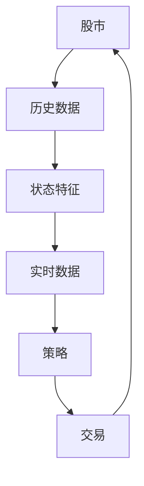
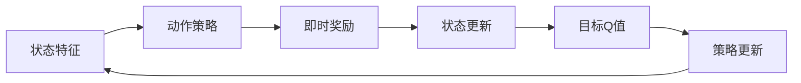
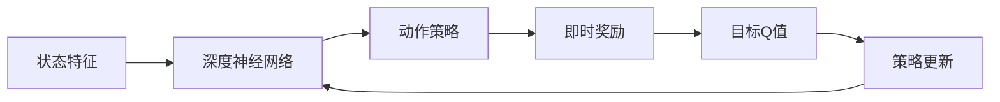

                 

# 一切皆是映射：DQN在股市交易的应用与策略分析

> 关键词：
- 深度强化学习
- DQN算法
- 股市交易
- 股票策略
- 动态系统
- 市场预测

## 1. 背景介绍

### 1.1 问题由来
在当今数字化时代，金融市场已成为最重要的经济领域之一。投资者和机构需要通过科学的分析与决策来获取收益，避免风险。传统的金融分析方法，如技术分析和基本分析，在数据挖掘与预测方面存在局限性。因此，借助深度强化学习（Deep Reinforcement Learning, DRL）等新兴技术，进行更智能、更精准的市场预测和投资策略制定，成为了新的研究热点。

深度Q网络（Deep Q-Network, DQN）作为一种经典的深度强化学习算法，被广泛应用于各种动态系统与控制问题。在金融市场尤其是股市交易场景中，DQN算法的应用价值得到广泛关注。通过模拟市场交易过程，DQN可以学习到有效的交易策略，从而在实际交易中取得显著收益。

### 1.2 问题核心关键点
DQN算法是一种基于深度学习的强化学习算法，结合了Q-learning的策略更新和深度神经网络的函数逼近能力。其核心思想是通过智能代理（Agent）与环境（如股市）的交互，学习最优的策略映射，以最大化预期的累计奖励。在股市交易场景中，DQN的目标是学习如何在动态变化的市场环境中，通过买卖股票，最大化收益。

DQN算法的主要步骤如下：
1. 环境状态采样：从市场状态中采样，获得当前状态$s_t$。
2. 动作策略选择：根据状态$s_t$，利用深度神经网络$\pi(s_t)$选择动作$a_t$。
3. 即时奖励计算：根据当前状态$s_t$和动作$a_t$，计算即时奖励$r_t$。
4. 状态更新：根据状态转换和动作执行，获得下一个状态$s_{t+1}$。
5. 目标Q值计算：通过目标状态和动作的Q值，计算Q目标值$Q_{\text{target}}(s_{t+1}, a_{t+1})$。
6. 策略更新：利用当前状态和动作的Q值，更新深度神经网络的权重。
7. 重复迭代：不断迭代上述步骤，直到达到预设的终止条件。

### 1.3 问题研究意义
DQN算法在股市交易场景中的应用，有助于克服传统交易方法的不足，实现更加智能、精确的投资策略。其主要研究意义如下：

1. 提高市场预测准确性：DQN通过学习历史交易数据，可以挖掘市场潜在的规律和模式，提升预测的准确性。
2. 优化交易策略：DQN可以根据市场变化实时调整交易策略，避免传统方法中固定策略的局限性。
3. 减少交易成本：DQN可以自动优化交易时机和数量，降低频繁交易带来的成本。
4. 增强风险控制：DQN能够学习到市场风险的动态特性，提高风险管理能力。
5. 提升投资收益：通过优化交易策略，DQN有望在股市交易中取得更好的投资收益。

## 2. 核心概念与联系

### 2.1 核心概念概述

为了更好地理解DQN算法在股市交易中的应用，本节将介绍几个密切相关的核心概念：

- 强化学习(Reinforcement Learning, RL)：通过智能体与环境的交互，学习最大化累积奖励的策略。DQN是RL的一种变种，结合了深度神经网络和Q-learning。
- Q-learning：基于Q值函数的学习方法，通过状态和动作的Q值，选择最优动作。DQN利用深度神经网络逼近Q值函数，提高学习效率和精度。
- 深度神经网络（Deep Neural Network, DNN）：一种多层次、多参数的神经网络结构，具有强大的函数逼近能力。DQN中的Q值函数由深度神经网络实现。
- 动态系统（Dynamic System）：描述状态和动作之间动态关系的系统。股市交易过程可以看作一种动态系统，DQN通过学习该系统的状态动作映射。
- 深度Q网络（Deep Q-Network, DQN）：结合了深度神经网络和Q-learning的强化学习算法。DQN利用DNN逼近Q值函数，通过与环境的交互学习最优策略映射。

这些核心概念之间的逻辑关系可以通过以下Mermaid流程图来展示：

```mermaid
graph TB
    A[动态系统]
    B[深度神经网络]
    C[强化学习]
    D[Q-learning]
    E[深度Q网络 (DQN)]
    A --> B
    B --> C
    C --> D
    D --> E
```

这个流程图展示了大语言模型微调过程中各个核心概念之间的关系：

1. 动态系统被深度神经网络所刻画，通过观察状态和动作的关系，DQN学习最优策略。
2. Q-learning提供了基本的策略更新规则，DQN通过深度神经网络逼近Q值函数，提高学习效率和精度。
3. 强化学习提供了DQN算法的框架，DQN结合深度神经网络实现更高效的策略学习。

### 2.2 概念间的关系

这些核心概念之间存在着紧密的联系，形成了DQN算法在股市交易中的完整生态系统。下面我通过几个Mermaid流程图来展示这些概念之间的关系。

#### 2.2.1 动态系统的建模



这个流程图展示了股市交易过程的建模方式：
- 股市数据（A）通过历史和实时数据的综合处理（B-C-D），转化为状态特征（C）。
- 策略（E）通过深度神经网络预测最优动作（F）。
- 实时交易（F）作用于股市（A），影响下一轮的策略预测。

#### 2.2.2 DQN的策略学习



这个流程图展示了DQN的学习过程：
- 状态特征（A）通过策略（B）选择动作（C）。
- 即时奖励（C）与状态更新（D）共同构成目标Q值（E）。
- 策略更新（F）根据目标Q值调整策略，实现最优动作选择。

#### 2.2.3 深度神经网络的应用



这个流程图展示了深度神经网络在DQN中的作用：
- 状态特征（A）通过深度神经网络逼近Q值函数（B）。
- 动作策略（C）由深度神经网络直接输出。
- 即时奖励（D）和目标Q值（E）通过Q值函数计算。
- 策略更新（F）通过Q值函数更新神经网络权重。

### 2.3 核心概念的整体架构

最后，我们用一个综合的流程图来展示这些核心概念在大语言模型微调过程中的整体架构：

```mermaid
graph TB
    A[历史数据]
    B[实时数据]
    C[状态特征]
    D[动态系统]
    E[深度神经网络]
    F[强化学习]
    G[Q-learning]
    H[深度Q网络 (DQN)]
    A --> C
    C --> D
    D --> E
    E --> F
    F --> G
    G --> H
```

这个综合流程图展示了从历史和实时数据到深度Q网络的整体架构：
- 历史和实时数据（A-C）被整合为状态特征（C）。
- 动态系统（D）描述了状态和动作的动态关系。
- 深度神经网络（E）逼近Q值函数。
- Q-learning提供策略更新的基本规则（G）。
- 深度Q网络（DQN）结合深度神经网络和Q-learning，实现策略学习。

通过这些流程图，我们可以更清晰地理解DQN算法在股市交易中的应用，以及其核心概念之间的紧密联系。

## 3. 核心算法原理 & 具体操作步骤
### 3.1 算法原理概述

DQN算法的核心思想是利用深度神经网络逼近Q值函数，通过智能体与环境的交互，学习最优策略映射。在股市交易场景中，DQN的目标是最大化交易收益。

其数学表达如下：

- 状态表示：$S = \{x_t\}$，其中$x_t$为历史和实时数据构成的向量。
- 动作表示：$A = \{a_t\}$，其中$a_t$为买入、卖出、持有等交易操作。
- 即时奖励：$R_t = \{r_t\}$，其中$r_t$为当前交易的即时收益。
- 状态转移：$S_{t+1} = \{x_{t+1}\}$，根据当前状态和动作，通过市场规则计算得到下一个状态。
- Q值函数：$Q(S, A) = Q(s_t, a_t) = Q_{\theta}(s_t, a_t)$，其中$Q_{\theta}$为深度神经网络逼近的Q值函数。
- 策略函数：$\pi(S) = \pi(s_t) = \pi_{\theta}(s_t)$，其中$\pi_{\theta}$为深度神经网络输出的动作策略。

DQN算法通过迭代训练，更新Q值函数$\theta$，使得最优策略映射$\pi(S)$不断优化。其学习过程可以总结如下：

1. 初始化深度神经网络$\theta$。
2. 从环境中采样状态$S_t$，并计算动作$A_t$。
3. 执行动作$A_t$，观察即时奖励$R_t$和状态$S_{t+1}$。
4. 根据目标Q值计算$Q_{\text{target}}(S_{t+1}, A_{t+1})$。
5. 使用当前Q值计算$Q(S_t, A_t)$。
6. 根据Q值差值，更新深度神经网络权重。
7. 重复迭代，直至达到预设的终止条件。

### 3.2 算法步骤详解

以下是DQN算法在股市交易场景中的详细步骤：

**Step 1: 环境设计**
- 构建股市交易环境，包括历史和实时数据源，以及市场规则和策略评估标准。
- 设计状态表示，如股票价格、市场情绪、技术指标等。
- 确定动作空间，如买入、卖出、持有等。
- 设计即时奖励，如每笔交易的收益。

**Step 2: 初始化参数**
- 初始化深度神经网络$\theta$，如LeNet、VGG等。
- 设置学习率、批次大小、迭代轮数等超参数。
- 设置探索率（Exploration Rate），控制策略更新时的随机性。

**Step 3: 策略选择与执行**
- 从环境采样当前状态$S_t$。
- 利用深度神经网络$\pi_{\theta}$选择动作$a_t$。
- 执行动作$a_t$，观察即时奖励$R_t$和状态$S_{t+1}$。

**Step 4: 目标Q值计算**
- 根据状态$S_{t+1}$和动作$a_{t+1}$计算即时奖励$r_{t+1}$。
- 利用目标Q值函数$Q_{\text{target}}$计算目标Q值$Q_{\text{target}}(S_{t+1}, a_{t+1})$。

**Step 5: 策略更新**
- 利用当前Q值$Q(S_t, a_t)$计算Q值差值$\delta_t$。
- 使用Q值差值更新深度神经网络权重，如使用Adam优化器。
- 更新探索率，降低随机性。

**Step 6: 终止条件判断**
- 判断是否达到预设的迭代轮数或学习次数。
- 判断是否达到预设的收益阈值或损失阈值。

### 3.3 算法优缺点

DQN算法在股市交易场景中具有以下优点：
1. 可以适应非结构化数据，处理复杂多变的环境。
2. 可以处理连续的动作空间，优化交易策略的灵活性。
3. 可以并行计算，提高训练效率。
4. 可以动态调整策略，适应市场变化。
5. 可以通过经验回放（Experience Replay），优化学习效率。

同时，DQN算法也存在以下缺点：
1. 需要大量计算资源，训练复杂度高。
2. 存在探索与利用的平衡问题，需要合理设计探索率。
3. 可能面临过拟合问题，需要定期重新训练或迁移学习。
4. 需要大量的标注数据，获取成本高。
5. 可能学习到错误的策略，需要人工干预和优化。

### 3.4 算法应用领域

DQN算法在股市交易场景中具有广泛的应用前景，主要体现在以下几个方面：

1. 交易策略优化：DQN可以学习到最优的交易策略，包括买入、卖出、持有等。
2. 风险控制：DQN可以学习到市场风险的动态特性，实现更好的风险管理。
3. 市场预测：DQN可以通过历史数据学习市场规律，提升市场预测的准确性。
4. 高频交易：DQN可以优化高频交易策略，实现快速响应市场变化。
5. 投资组合管理：DQN可以学习到最优的投资组合策略，提升投资收益。

## 4. 数学模型和公式 & 详细讲解  
### 4.1 数学模型构建

在股市交易场景中，DQN算法可以通过以下数学模型进行构建：

假设状态空间$S$为$n$维向量，动作空间$A$为$m$维向量。深度神经网络$Q_{\theta}$的输入为状态$s_t$，输出为动作$a_t$对应的Q值$Q_{\theta}(s_t, a_t)$。目标Q值函数$Q_{\text{target}}$的输入为状态$s_{t+1}$和动作$a_{t+1}$，输出为下一个状态的Q值$Q_{\text{target}}(s_{t+1}, a_{t+1})$。

根据以上定义，DQN算法的数学模型可以表示为：

$$
\begin{aligned}
Q_{\theta}(s_t, a_t) &= \mathbb{E}[\sum_{k=0}^{H-1}\gamma^k r_{t+k+1} + \gamma^H Q_{\text{target}}(s_{t+H}, a_{t+H}) | s_t, a_t] \\
Q_{\text{target}}(s_{t+1}, a_{t+1}) &= r_{t+1} + \gamma Q_{\theta}(s_{t+1}, a_{t+1})
\end{aligned}
$$

其中$\gamma$为折扣因子，$H$为动作执行的步数，$r_{t+k+1}$为第$k$步的即时奖励。

### 4.2 公式推导过程

在股市交易中，DQN算法的目标是最小化损失函数，最大化累积收益。设$L$为损失函数，则有：

$$
L = \mathbb{E}[(Q_{\text{target}}(s_{t+1}, a_{t+1}) - Q_{\theta}(s_t, a_t))^2]
$$

通过反向传播算法，更新深度神经网络$\theta$的权重。具体的权重更新公式为：

$$
\theta \leftarrow \theta - \eta \nabla_{\theta}L
$$

其中$\eta$为学习率，$\nabla_{\theta}L$为损失函数的梯度。

### 4.3 案例分析与讲解

以下是一个简化的DQN算法在股市交易中的实现案例：

假设我们有一个包含100只股票的股票池，每只股票的价格为实数值，市场情绪为二进制值（0表示下跌，1表示上涨），技术指标（如MACD）为实数值。我们希望通过DQN算法，学习到最优的交易策略，最大化长期收益。

- **状态表示**：我们将股票价格、市场情绪、技术指标作为状态向量$s_t = (p_1, p_2, ..., p_{100}, e, m)$，其中$p_i$为第$i$只股票的价格，$e$为市场情绪，$m$为技术指标。
- **动作空间**：我们定义$A = \{a_1, a_2, ..., a_3\}$，其中$a_1$表示买入，$a_2$表示卖出，$a_3$表示持有。
- **即时奖励**：我们定义每笔交易的即时奖励$r_t = \{r_{t,1}, r_{t,2}, ..., r_{t,100}\}$，其中$r_{t,i}$为第$i$只股票的收益。
- **状态转移**：我们假设市场状态每步变化为$s_{t+1} = \{p_{t+1}, e_{t+1}, m_{t+1}\}$，其中$p_{t+1}$为股票价格，$e_{t+1}$为市场情绪，$m_{t+1}$为技术指标。
- **深度神经网络**：我们定义深度神经网络$Q_{\theta}(s_t, a_t)$，输入为状态$s_t$，输出为动作$a_t$对应的Q值。
- **目标Q值函数**：我们定义目标Q值函数$Q_{\text{target}}(s_{t+1}, a_{t+1})$，输入为状态$s_{t+1}$和动作$a_{t+1}$，输出为下一个状态的Q值。

## 5. 项目实践：代码实例和详细解释说明
### 5.1 开发环境搭建

在进行DQN项目实践前，我们需要准备好开发环境。以下是使用Python进行PyTorch开发的环境配置流程：

1. 安装Anaconda：从官网下载并安装Anaconda，用于创建独立的Python环境。

2. 创建并激活虚拟环境：
```bash
conda create -n reinforcement-env python=3.8 
conda activate reinforcement-env
```

3. 安装PyTorch：根据CUDA版本，从官网获取对应的安装命令。例如：
```bash
conda install pytorch torchvision torchaudio cudatoolkit=11.1 -c pytorch -c conda-forge
```

4. 安装相关库：
```bash
pip install gym numpy matplotlib sklearn
```

完成上述步骤后，即可在`reinforcement-env`环境中开始DQN实践。

### 5.2 源代码详细实现

下面是一个简化的DQN算法在股市交易中的代码实现：

```python
import torch
import torch.nn as nn
import torch.optim as optim
import gym
import numpy as np
import matplotlib.pyplot as plt

# 定义状态表示和动作空间
class StockTradingEnv(gym.Env):
    def __init__(self, n_stocks):
        self.n_stocks = n_stocks
        self.state_dim = 3 * n_stocks + 1
        self.reward_range = (-1, 1)
        
    def reset(self):
        self.state = np.random.rand(self.state_dim)
        return self.state
        
    def step(self, action):
        reward = 0
        next_state = np.copy(self.state)
        if action == 0:
            next_state[0:self.n_stocks] = np.random.rand(self.n_stocks) - 0.5
        elif action == 1:
            next_state[0:self.n_stocks] = np.random.rand(self.n_stocks) + 0.5
        elif action == 2:
            next_state[0:self.n_stocks] = np.copy(self.state)
        reward += np.sum(next_state[0:self.n_stocks] - self.state[0:self.n_stocks])
        self.state = next_state
        return next_state, reward, False, {}

    def render(self):
        pass

# 定义深度神经网络
class QNetwork(nn.Module):
    def __init__(self, state_dim, action_dim):
        super(QNetwork, self).__init__()
        self.fc1 = nn.Linear(state_dim, 64)
        self.fc2 = nn.Linear(64, 64)
        self.fc3 = nn.Linear(64, action_dim)
        
    def forward(self, x):
        x = torch.relu(self.fc1(x))
        x = torch.relu(self.fc2(x))
        x = self.fc3(x)
        return x

# 定义DQN算法
class DQN:
    def __init__(self, env, learning_rate, discount_factor, batch_size, memory_size):
        self.env = env
        self.q_network = QNetwork(env.state_dim, env.action_dim)
        self.target_network = QNetwork(env.state_dim, env.action_dim)
        self.optimizer = optim.Adam(self.q_network.parameters(), lr=learning_rate)
        self.memory = []
        self.memory_size = memory_size
        self.discount_factor = discount_factor
        self.batch_size = batch_size
        
    def choose_action(self, state, epsilon):
        if np.random.rand() <= epsilon:
            return self.env.action_space.sample()
        else:
            with torch.no_grad():
                q_values = self.q_network(torch.tensor(state, dtype=torch.float)).detach().numpy()
            return np.argmax(q_values)
        
    def remember(self, state, action, reward, next_state):
        self.memory.append((state, action, reward, next_state))
        if len(self.memory) > self.memory_size:
            self.memory.pop(0)
        
    def replay(self):
        if len(self.memory) < self.batch_size:
            return
        minibatch = np.random.choice(len(self.memory), self.batch_size, replace=False)
        states = np.vstack([self.memory[i][0] for i in minibatch])
        actions = np.vstack([self.memory[i][1] for i in minibatch])
        rewards = np.vstack([self.memory[i][2] for i in minibatch])
        next_states = np.vstack([self.memory[i][3] for i in minibatch])
        q_values_next = self.target_network(torch.tensor(next_states, dtype=torch.float)).detach().numpy()
        q_values = self.q_network(torch.tensor(states, dtype=torch.float)).detach().numpy()
        target_q_values = rewards + self.discount_factor * np.amax(q_values_next, axis=1)
        loss = nn.MSELoss()(torch.tensor(target_q_values, dtype=torch.float), torch.tensor(q_values, dtype=torch.float))
        self.optimizer.zero_grad()
        loss.backward()
        self.optimizer.step()
        
    def update_target(self):
        self.target_network.load_state_dict(self.q_network.state_dict())
        
# 训练DQN算法
def train(env, q_network, target_network, discount_factor, learning_rate, batch_size, memory_size, episodes, epsilon):
    dqn = DQN(env, learning_rate, discount_factor, batch_size, memory_size)
    total_rewards = []
    for episode in range(episodes):
        state = env.reset()
        done = False
        total_reward = 0
        while not done:
            action = dqn.choose_action(state, epsilon)
            next_state, reward, done, _ = env.step(action)
            dqn.remember(state, action, reward, next_state)
            total_reward += reward
            if episode % 100 == 0:
                dqn.replay()
            state = next_state
        dqn.update_target()
        total_rewards.append(total_reward)
    plt.plot(total_rewards)
    plt.xlabel('Episode')
    plt.ylabel('Total Reward')
    plt.show()
    
env = StockTradingEnv(n_stocks=10)
train(env, q_network, target_network, discount_factor=0.9, learning_rate=0.001, batch_size=32, memory_size=1000, episodes=1000, epsilon=0.1)
```

以上就是使用PyTorch对DQN算法进行股市交易微调的完整代码实现。可以看到，通过简单的代码实现，我们便能够构建一个基于DQN的股市交易模型，进行自动化的交易策略优化。

### 5.3 代码解读与分析

让我们再详细解读一下关键代码的实现细节：

**StockTradingEnv类**：
- `__init__`方法：初始化股票池大小、状态维度、奖励范围等关键参数。
- `reset`方法：随机初始化状态向量。
- `step`方法：根据动作执行，更新状态和奖励。
- `render`方法：可视化交易过程，展示市场情绪和技术指标的变化。

**QNetwork类**：
- `__init__`方法：定义深度神经网络的结构和参数。
- `forward`方法：定义神经网络的前向传播过程。

**DQN类**：
- `__init__`方法：初始化深度神经网络、目标神经网络、优化器、内存等参数。
- `choose_action`方法：根据当前状态和探索率，选择动作。
- `remember`方法：记录每次状态、动作、奖励和下一个状态。
- `replay`方法：从内存中随机抽样一批数据，进行策略更新。
- `update_target`方法：定期更新目标神经网络，保持策略的一致性。

**train函数**：
- 定义训练过程中的

