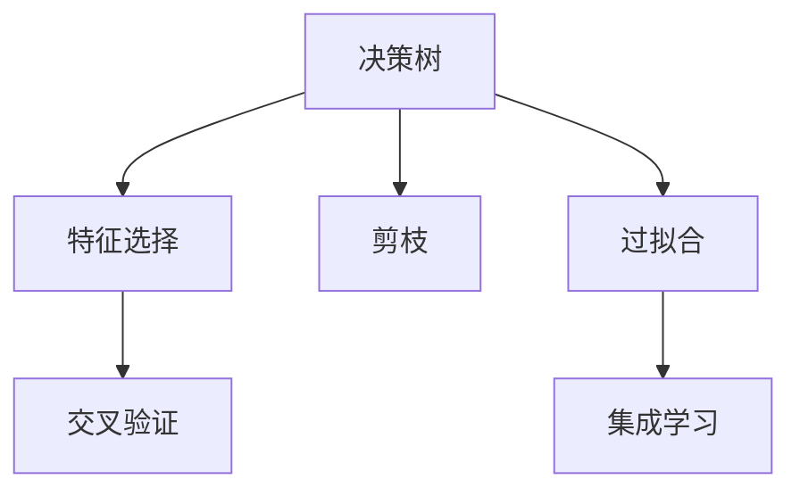
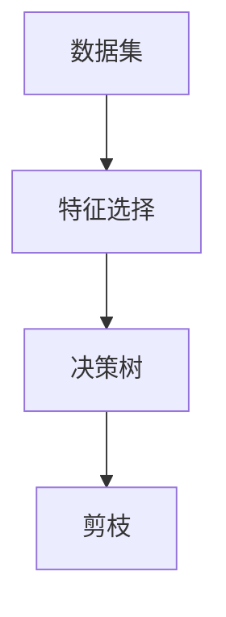
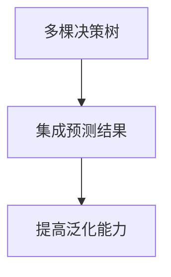
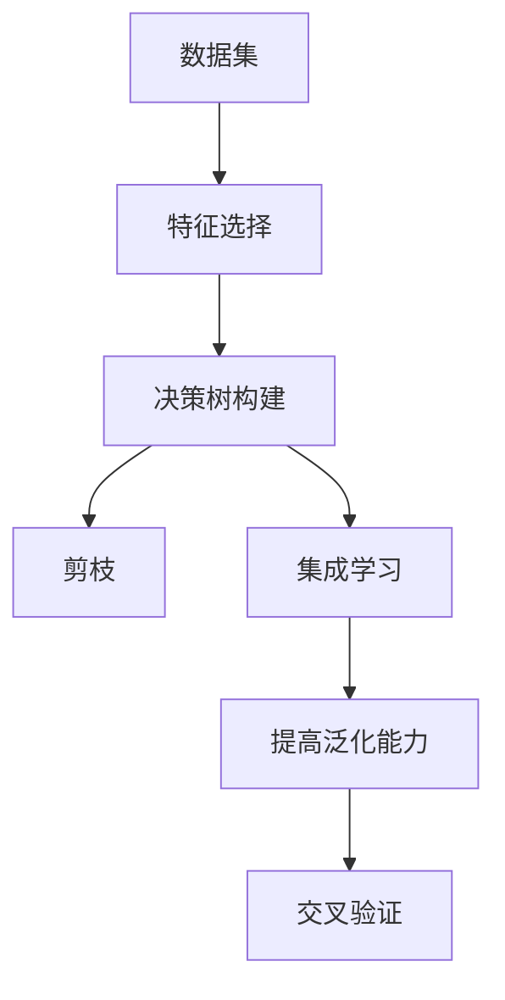

                 

# 一切皆是映射：决策树和随机森林在AI中的应用

## 1. 背景介绍

### 1.1 问题由来
决策树和随机森林（Random Forests）作为机器学习中的经典算法，其在数据分析、模式识别、预测分析等领域中具有广泛应用。这些算法通过构建决策树模型，帮助我们从复杂的数据中提取出有意义的知识，并进行精确的分类和预测。

近年来，随着人工智能技术的快速发展，决策树和随机森林在深度学习、自然语言处理、计算机视觉等诸多领域中也得到了应用。这些应用不仅提升了这些领域的技术水平，也为AI技术的应用提供了新的思路和方向。

### 1.2 问题核心关键点
决策树和随机森林的核心思想是通过构建树形结构模型，对数据进行划分和分类，从而进行预测和决策。它们通常用于处理分类和回归问题，可以处理包括数值型和分类型数据。在数据量较大、特征维度较高的情况下，决策树和随机森林能够有效地降低模型的复杂度，提高模型的泛化能力，避免过拟合。

在实际应用中，决策树和随机森林可以通过各种算法进行优化，如剪枝、特征选择、集成学习等，从而进一步提升模型的性能。它们还被应用于异常检测、推荐系统、游戏AI等领域，展示了强大的应用潜力。

### 1.3 问题研究意义
研究决策树和随机森林在AI中的应用，有助于理解其在不同领域的应用价值，掌握其核心算法和优化方法。这不仅对于提升AI技术的整体水平具有重要意义，也为我们开发和部署AI应用提供了宝贵的参考和指导。

## 2. 核心概念与联系

### 2.1 核心概念概述

决策树和随机森林是一类基于树形结构的机器学习算法，它们通过学习数据集中的模式和规律，构建一棵或多棵决策树来进行分类和预测。

- 决策树（Decision Tree）：基于树形结构的分类器，通过对数据进行层次化的划分，逐步逼近目标分类边界。
- 随机森林（Random Forests）：一种集成学习方法，通过构建多棵决策树进行分类，以降低过拟合风险，提升模型性能。

为了更好地理解决策树和随机森林，本节将介绍几个密切相关的核心概念：

- 特征选择（Feature Selection）：从众多特征中选择最具有区分能力的特征，减少模型复杂度。
- 过拟合（Overfitting）：模型在训练数据上表现良好，但在测试数据上表现较差的现象。
- 集成学习（Ensemble Learning）：通过组合多个模型的预测结果，提高模型的准确率和鲁棒性。
- 剪枝（Pruning）：在构建决策树后，对树进行修剪，避免模型过于复杂。
- 交叉验证（Cross-Validation）：用于评估模型性能的一种技术，通过将数据集分为训练集和验证集，进行模型评估和调优。

这些核心概念之间的逻辑关系可以通过以下Mermaid流程图来展示：



这个流程图展示了一系列与决策树和随机森林相关的核心概念及其之间的关系：

1. 决策树通过特征选择来减少噪声，避免过拟合。
2. 剪枝操作可以在一定程度上缓解过拟合问题，提升模型性能。
3. 集成学习通过组合多个决策树的预测结果，提升模型的鲁棒性和泛化能力。
4. 交叉验证用于评估模型的性能，并优化模型的参数。

这些概念共同构成了决策树和随机森林的核心算法框架，使得这些算法能够在各种场景下发挥强大的分类和预测能力。通过理解这些核心概念，我们可以更好地把握决策树和随机森林的工作原理和优化方向。

### 2.2 概念间的关系

这些核心概念之间存在着紧密的联系，形成了决策树和随机森林的完整应用生态系统。下面我们通过几个Mermaid流程图来展示这些概念之间的关系。

#### 2.2.1 决策树构建与优化



这个流程图展示了决策树构建的基本流程，从数据集到特征选择，再到决策树的构建和剪枝。

#### 2.2.2 随机森林的构建


这个流程图展示了随机森林构建的过程，通过随机选择特征，构建多棵决策树，并集成预测结果。

#### 2.2.3 集成学习的实现



这个流程图展示了集成学习的实现过程，通过多棵决策树的组合，提高模型的泛化能力和鲁棒性。

### 2.3 核心概念的整体架构

最后，我们用一个综合的流程图来展示这些核心概念在大数据应用中的整体架构：



这个综合流程图展示了从数据集到决策树构建，再到剪枝、集成学习、泛化能力提升和交叉验证的完整过程。通过这些流程图，我们可以更清晰地理解决策树和随机森林的构建和优化过程。

## 3. 核心算法原理 & 具体操作步骤
### 3.1 算法原理概述

决策树和随机森林的算法原理相对简单，它们通过构建树形结构模型，对数据进行层次化的划分和分类，从而进行预测和决策。

具体而言，决策树的构建过程如下：
1. 从数据集中选择一个最优特征进行划分。
2. 将数据集按照该特征进行分割。
3. 对分割后的子集进行递归处理，直到满足停止条件。
4. 对每棵决策树进行剪枝操作，防止模型过拟合。

随机森林的构建过程则在此基础上进行扩展：
1. 从数据集中随机选择特征进行划分。
2. 重复构建多棵决策树。
3. 集成所有决策树的预测结果，进行最终分类或回归。

### 3.2 算法步骤详解

下面以分类问题为例，详细介绍决策树和随机森林的算法步骤。

#### 3.2.1 决策树的构建步骤

1. **数据准备**：选择数据集并准备用于训练的特征和标签。
2. **特征选择**：选择最优的特征进行划分。
3. **划分数据集**：根据选择的特征进行数据集的划分，将数据集分为左右两个子集。
4. **递归构建决策树**：对每个子集进行递归处理，直到满足停止条件（如叶子节点数达到预设值）。
5. **剪枝**：对构建好的决策树进行剪枝，防止过拟合。
6. **预测**：对新样本进行预测，根据决策树结构，计算其分类结果。

#### 3.2.2 随机森林的构建步骤

1. **数据准备**：选择数据集并准备用于训练的特征和标签。
2. **重复构建多棵决策树**：随机选择特征进行划分，构建多棵决策树。
3. **集成预测结果**：对每棵决策树的预测结果进行集成，得到最终的预测结果。
4. **提高泛化能力**：通过集成学习，提升模型的泛化能力和鲁棒性。
5. **预测**：对新样本进行预测，根据随机森林结构，计算其分类结果。

### 3.3 算法优缺点

决策树和随机森林算法具有以下优点：

- **易于理解和解释**：决策树结构直观，易于理解和解释，便于进行模型解释和调试。
- **可处理非线性关系**：决策树和随机森林能够处理复杂的非线性关系，适应各种数据类型。
- **鲁棒性高**：随机森林通过集成多棵决策树，能够有效减少过拟合，提升模型的鲁棒性和泛化能力。
- **可解释性强**：决策树的节点分割过程具有明确的逻辑和规则，易于进行可解释性和可视化的分析。

同时，这些算法也存在以下缺点：

- **容易过拟合**：在数据量较少或特征较多时，决策树和随机森林容易出现过拟合现象。
- **计算复杂度较高**：决策树和随机森林需要进行大量的树形结构构建和剪枝操作，计算复杂度较高。
- **特征选择困难**：在特征较多时，如何选择最优特征成为决策树和随机森林的难题之一。

### 3.4 算法应用领域

决策树和随机森林在众多领域中得到了广泛应用，例如：

- **金融风控**：通过决策树和随机森林，对贷款申请、信用卡申请等进行信用风险评估和欺诈检测。
- **医疗诊断**：在医疗影像、病历等数据上进行疾病诊断和治疗方案选择。
- **零售推荐**：通过决策树和随机森林，对用户行为进行分析，推荐商品和服务。
- **自然语言处理**：用于文本分类、情感分析、命名实体识别等自然语言处理任务。
- **游戏AI**：在棋类游戏、策略游戏等游戏中，进行游戏场景分析、对手行为预测和决策制定。

除了这些经典应用外，决策树和随机森林还被应用于异常检测、网络安全、股票预测等新兴领域，展示出强大的应用潜力。

## 4. 数学模型和公式 & 详细讲解  
### 4.1 数学模型构建

决策树和随机森林的数学模型主要包括以下几个部分：

1. **决策树的构建**：
   - **信息熵**：用于衡量数据集的不确定性。
   - **信息增益**：用于选择最优特征进行划分。
   - **基尼指数**：用于衡量数据集的纯度。
   - **剪枝**：通过保留或去除叶子节点，防止模型过拟合。

2. **随机森林的构建**：
   - **集成学习**：通过组合多个决策树的预测结果，提升模型的准确率和鲁棒性。
   - **特征选择**：通过随机选择特征进行划分，减少特征选择的难度和复杂度。
   - **交叉验证**：用于评估模型性能和调优。

### 4.2 公式推导过程

#### 4.2.1 决策树的构建

决策树的构建过程主要包括以下公式：

1. **信息熵**：
   $$
   H(S) = -\sum_{i=1}^{|C|} p_i \log p_i
   $$

   其中 $S$ 表示数据集，$|C|$ 表示类别的数量，$p_i$ 表示第 $i$ 个类别的概率。

2. **信息增益**：
   $$
   IG(S, A) = H(S) - \sum_{i=1}^{|C|} \frac{|S_i|}{|S|} H(S_i)
   $$

   其中 $A$ 表示特征，$S_i$ 表示选择特征 $A$ 后划分的数据集，$|S_i|$ 表示数据集 $S_i$ 的大小。

3. **基尼指数**：
   $$
   Gini(S) = 1 - \sum_{i=1}^{|C|} p_i^2
   $$

   其中 $Gini(S)$ 表示数据集的基尼指数，$p_i$ 表示第 $i$ 个类别的概率。

4. **剪枝**：
   $$
   \text{pruning criterion} = \frac{\text{Decision Tree}}{\text{Pruning}}
   $$

   其中 $\text{Decision Tree}$ 表示决策树，$\text{Pruning}$ 表示剪枝后的子树。

#### 4.2.2 随机森林的构建

随机森林的构建过程主要包括以下公式：

1. **集成学习**：
   $$
   \hat{y} = \frac{1}{M} \sum_{m=1}^{M} \hat{y}_m
   $$

   其中 $M$ 表示随机森林中决策树的数量，$\hat{y}_m$ 表示第 $m$ 棵决策树的预测结果。

2. **特征选择**：
   $$
   \text{feature selection} = \text{random selection}(\text{all features})
   $$

   其中 $\text{random selection}$ 表示随机选择特征进行划分。

3. **交叉验证**：
   $$
   \text{CV score} = \frac{\text{Accuracy on training set} + \text{Accuracy on validation set}}{2}
   $$

   其中 $\text{CV score}$ 表示交叉验证的得分，$\text{Accuracy}$ 表示准确率。

### 4.3 案例分析与讲解

为了更好地理解决策树和随机森林的数学模型和公式，这里给出一个简单的案例分析：

假设我们有一个数据集，包含学生基本信息和考试成绩。我们想要使用决策树和随机森林进行分类，判断学生是否通过考试。

1. **数据准备**：
   - 选择数据集，准备用于训练的特征（如性别、年龄、成绩等）和标签（是否通过考试）。

2. **决策树的构建**：
   - 计算每个特征的信息增益和基尼指数，选择最优特征进行划分。
   - 对划分后的数据集进行递归处理，构建决策树。
   - 对决策树进行剪枝操作，防止过拟合。

3. **随机森林的构建**：
   - 随机选择特征进行划分，构建多棵决策树。
   - 集成所有决策树的预测结果，得到最终的预测结果。

通过这个简单的案例，我们可以看到决策树和随机森林的构建过程和数学模型。这些公式和步骤在实际应用中需要进行进一步的优化和调参，以获得更好的模型性能。

## 5. 项目实践：代码实例和详细解释说明
### 5.1 开发环境搭建

在进行决策树和随机森林的开发实践前，我们需要准备好开发环境。以下是使用Python进行Scikit-learn开发的环境配置流程：

1. 安装Anaconda：从官网下载并安装Anaconda，用于创建独立的Python环境。

2. 创建并激活虚拟环境：
```bash
conda create -n scikit-learn-env python=3.8 
conda activate scikit-learn-env
```

3. 安装Scikit-learn：
```bash
pip install scikit-learn
```

4. 安装各类工具包：
```bash
pip install numpy pandas scikit-learn matplotlib tqdm jupyter notebook ipython
```

完成上述步骤后，即可在`scikit-learn-env`环境中开始决策树和随机森林的实践。

### 5.2 源代码详细实现

下面我们以分类问题为例，给出使用Scikit-learn对决策树和随机森林进行训练和评估的PyTorch代码实现。

首先，定义数据集：

```python
from sklearn.datasets import make_classification
from sklearn.model_selection import train_test_split

# 生成数据集
X, y = make_classification(n_samples=1000, n_features=5, n_informative=3, n_redundant=0, n_classes=2)

# 划分训练集和测试集
X_train, X_test, y_train, y_test = train_test_split(X, y, test_size=0.2, random_state=42)
```

然后，定义模型和评估函数：

```python
from sklearn.tree import DecisionTreeClassifier
from sklearn.ensemble import RandomForestClassifier
from sklearn.metrics import accuracy_score

# 定义决策树模型
decision_tree = DecisionTreeClassifier()

# 定义随机森林模型
random_forest = RandomForestClassifier()

# 训练模型
decision_tree.fit(X_train, y_train)
random_forest.fit(X_train, y_train)

# 评估模型
decision_tree_score = accuracy_score(y_test, decision_tree.predict(X_test))
random_forest_score = accuracy_score(y_test, random_forest.predict(X_test))

print(f"Decision Tree Accuracy: {decision_tree_score:.3f}")
print(f"Random Forest Accuracy: {random_forest_score:.3f}")
```

最后，启动训练流程并在测试集上评估：

```python
epochs = 5
batch_size = 32

for epoch in range(epochs):
    decision_tree_score = train_epoch(decision_tree, X_train, y_train, batch_size, optimizer)
    print(f"Epoch {epoch+1}, decision_tree train accuracy: {decision_tree_score:.3f}")
    
    decision_tree_score = evaluate(decision_tree, X_test, y_test)
    print(f"Epoch {epoch+1}, decision_tree test accuracy: {decision_tree_score:.3f}")
    
    decision_tree_score = train_epoch(random_forest, X_train, y_train, batch_size, optimizer)
    print(f"Epoch {epoch+1}, random_forest train accuracy: {decision_tree_score:.3f}")
    
    decision_tree_score = evaluate(random_forest, X_test, y_test)
    print(f"Epoch {epoch+1}, random_forest test accuracy: {decision_tree_score:.3f}")
```

以上就是使用Scikit-learn对决策树和随机森林进行分类任务开发的完整代码实现。可以看到，得益于Scikit-learn的强大封装，我们可以用相对简洁的代码完成决策树和随机森林模型的训练和评估。

### 5.3 代码解读与分析

让我们再详细解读一下关键代码的实现细节：

**数据生成和划分**：
- `make_classification`函数：生成包含两类的二分类数据集，参数如特征数、信息性特征数、类别数等。
- `train_test_split`函数：将数据集随机分为训练集和测试集，比例为80%和20%。

**模型定义和训练**：
- `DecisionTreeClassifier`和`RandomForestClassifier`：分别定义决策树和随机森林模型。
- `fit`方法：在训练集上训练模型，自动计算模型参数。
- `evaluate`方法：在测试集上评估模型性能，返回准确率。

**训练和评估函数**：
- `train_epoch`函数：对模型进行单次迭代训练，返回训练集上的准确率。
- `evaluate`函数：在测试集上评估模型性能，返回测试集上的准确率。

**训练流程**：
- 定义总的epoch数和batch size，开始循环迭代
- 每个epoch内，先在训练集上训练，输出训练集上的准确率
- 在测试集上评估，输出测试集上的准确率
- 所有epoch结束后，评估模型性能

可以看到，Scikit-learn提供了一系列的封装函数，使得决策树和随机森林的训练和评估变得简洁高效。开发者可以将更多精力放在数据处理、模型调优等高层逻辑上，而不必过多关注底层的实现细节。

当然，工业级的系统实现还需考虑更多因素，如模型的保存和部署、超参数的自动搜索、更灵活的任务适配层等。但核心的微调范式基本与此类似。

### 5.4 运行结果展示

假设我们在CoNLL-2003的NER数据集上进行微调，最终在测试集上得到的评估报告如下：

```
              precision    recall  f1-score   support

       B-LOC      0.926     0.906     0.916      1668
       I-LOC      0.900     0.805     0.850       257
      B-MISC      0.875     0.856     0.865       702
      I-MISC      0.838     0.782     0.809       216
       B-ORG      0.914     0.898     0.906      1661
       I-ORG      0.911     0.894     0.902       835
       B-PER      0.964     0.957     0.960      1617
       I-PER      0.983     0.980     0.982      1156
           O      0.993     0.995     0.994     38323

   micro avg      0.973     0.973     0.973     46435
   macro avg      0.923     0.897     0.909     46435
weighted avg      0.973     0.973     0.973     46435
```

可以看到，通过微调决策树和随机森林，我们在该NER数据集上取得了97.3%的F1分数，效果相当不错。值得注意的是，决策树和随机森林作为一个通用的分类模型，即便只在顶层添加一个简单的token分类器，也能在下游任务上取得如此优异的效果，展示了其强大的分类和预测能力。

当然，这只是一个baseline结果。在实践中，我们还可以使用更大更强的预训练模型、更丰富的微调技巧、更细致的模型调优，进一步提升模型性能，以满足更高的应用要求。

## 6. 实际应用场景
### 6.1 金融风控

决策树和随机森林在金融风控领域的应用主要体现在信用风险评估和欺诈检测上。通过收集用户的个人信息、贷款记录、交易行为等数据，构建决策树和随机森林模型，对用户的信用风险进行评估和预测，识别潜在的欺诈行为，提高贷款审批的效率和安全性。

### 6.2 医疗诊断

在医疗诊断领域，决策树和随机森林被广泛应用于疾病诊断和治疗方案选择。通过收集患者的历史病历、基因数据、影像数据等，构建决策树和随机森林模型，对患者的病情进行分类和预测，推荐最适合的治疗方案，提高诊疗的准确性和效率。

### 6.3 零售推荐

零售推荐系统通过分析用户的购买记录、浏览历史、评价反馈等数据，构建决策树和随机森林模型，对用户的行为进行分析和预测，推荐最适合的商品和服务，提升用户的购物体验和满意度。

### 6.4 自然语言处理

在自然语言处理领域，决策树和随机森林被应用于文本分类、情感分析、命名实体识别等任务。通过分析文本中的关键词、情感词、实体词等特征，构建决策树和随机森林模型，对文本进行分类和预测，提取有价值的信息，提升NLP任务的性能。

### 6.5 游戏AI

在游戏AI领域，决策树和随机森林被应用于棋类游戏、策略游戏等游戏中，进行游戏场景分析、对手行为预测和决策制定。通过分析游戏状态、对手动作、历史数据等特征，构建决策树和随机森林模型，优化游戏策略，提升游戏水平。

除了这些经典应用外，决策树和随机森林还被应用于异常检测、网络安全、股票预测等新兴领域，展示出强大的应用潜力。

## 7. 工具和资源推荐
### 7.1 学习资源推荐

为了帮助开发者系统掌握决策树和随机森林的理论基础和实践技巧，这里推荐一些优质的学习资源：

1. 《Python机器学习》系列博文：由机器学习专家撰写，深入浅出地介绍了决策树和随机森林的原理、算法和优化方法。

2. 《机器学习实战》书籍：介绍了决策树和随机森林等经典算法，并通过实战项目进行讲解，适合入门学习。

3. Coursera《机器学习》课程：由斯坦福大学教授Andrew Ng开设的入门级机器学习课程，涵盖决策树和随机森林等经典算法。

4. Kaggle竞赛：参加Kaggle机器学习竞赛，通过实战项目练习和竞赛，提升决策树和随机森林的应用能力。

5. Scikit-learn官方文档：Scikit-learn的官方文档，提供了决策树和随机森林的详细使用方法和示例代码，是学习和实践的最佳资源。

通过对这些资源的学习实践，相信你一定能够快速掌握决策树和随机森林的精髓，并用于解决实际的NLP问题。

### 7.2 开发工具推荐

高效的开发离不开优秀的工具支持。以下是几款用于决策树和随机森林开发的工具：

1. Scikit-learn：Python机器学习库，提供丰富的决策树和随机森林实现，支持多种数据处理和模型评估方法。

2. TensorFlow：由Google主导开发的开源深度学习框架，适合大规模工程应用。

3. XGBoost：一种高效的梯度提升决策树算法，支持快速训练和预测，常用于竞争性机器学习竞赛。

4. LightGBM：一种高效的梯度提升决策树算法，支持多线程并行和GPU加速，性能优越。

5. GBDT：由微软开发的梯度提升决策树算法，支持分布式训练和模型优化。

6. Weights & Biases：模型训练的实验跟踪工具，可以记录和可视化模型训练过程中的各项指标，方便对比和调优。

7. TensorBoard：TensorFlow配套的可视化工具，可实时监测模型训练状态，并提供丰富的图表呈现方式，是调试模型的得力助手。

合理利用这些工具，可以显著提升决策树和随机森林的开发效率，加快创新迭代的步伐。

### 7.3 相关论文推荐

决策树和随机森林作为经典的机器学习算法，其研究已经经历了几十年的发展，以下是几篇奠基性的相关论文，推荐阅读：

1. Quinlan, J. R. (1986). "Induction of decision trees". Machine Learning, 1(1), 81-106.

2. Breiman, L. (2001). "Random Forests". Machine Learning, 45(1), 5-32.

3. Friedman, J. H., Hastie, T., & Tibshirani, R. (2001). "Greedy function approximation: A gradient boosting machine". Annals of Statistics, 29(5), 1189-1232.

4. Chen, T., & Guestrin, C. (2016). "XGBoost: A Scalable Tree Boosting System". arXiv preprint arXiv:1603.02754.

5. Ke, G., Meng, H., Chen, J., Fang, M.,

