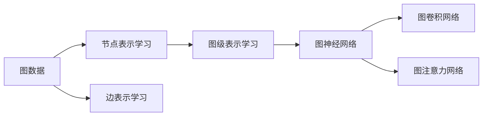
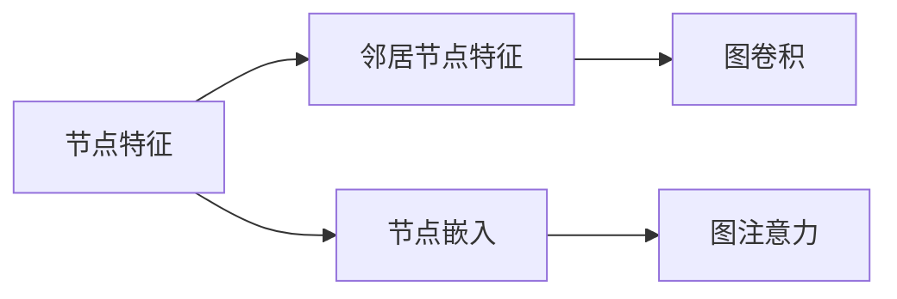
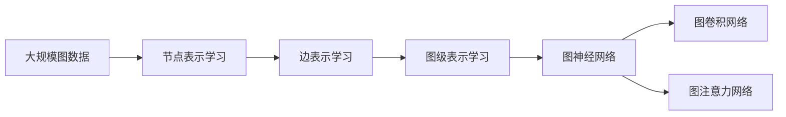

                 

# 一切皆是映射：图神经网络(GNN)的兴起与展望

> 关键词：图神经网络(GNN), 图数据, 图表示学习, 深度学习, 神经网络, 图网络, 图嵌入

## 1. 背景介绍

### 1.1 问题由来
图神经网络（Graph Neural Network, GNN）作为深度学习技术的一个重要分支，近年来在图数据处理领域取得了显著进展。相较于传统的深度学习方法，GNN能够更有效地处理图数据结构，具备强大的节点和图级表示学习能力。GNN的兴起，源于其在网络社交、知识图谱、生物信息等众多图数据密集型领域中的广泛应用。

以社交网络为例，GNN能够从用户之间的关系和行为数据中提取复杂的社交特征，实现精准的用户画像分析、推荐系统构建和社交关系预测等功能。在知识图谱领域，GNN可以学习知识节点间的语义关系，实现知识图谱的嵌入和推理，推动智慧城市、智能问答等应用的发展。在生物信息领域，GNN能够从分子结构图谱中学习特征，应用于药物设计、基因序列分析等任务。

GNN的崛起，反映了其在处理图数据上的优越性和应用前景。本文将详细探讨GNN的原理与应用实践，并展望其未来发展方向。

### 1.2 问题核心关键点
GNN的核心在于其能够有效地学习图结构中的节点特征和边特征，并综合利用这些特征进行图级别的推理和预测。这包括：

- **节点表示学习**：将图结构中的每个节点映射为高维向量表示，捕捉节点间的局部信息。
- **边表示学习**：学习图结构中每条边的特征，捕捉节点间的关系。
- **图级表示学习**：综合利用节点和边的表示，生成整幅图的全局表示。

通过这些步骤，GNN能够在处理复杂图数据结构时，实现高效、精确的特征提取和推理预测。

### 1.3 问题研究意义
GNN的研究对于推动深度学习在图数据处理领域的广泛应用，提升图数据处理系统的性能和效率，具有重要意义：

1. **提升图数据处理效率**：GNN通过高效的图结构学习，能够减少人工干预，自动化处理复杂图数据，提高处理速度和准确性。
2. **增强模型泛化能力**：GNN具备良好的图级特征提取和推理能力，能够在不同图数据集上取得优异表现，提高模型的泛化性。
3. **拓展应用场景**：GNN应用于社交网络分析、知识图谱构建、生物信息学等领域，推动相关行业的发展。
4. **加速模型创新**：GNN与其他深度学习技术的结合，如图卷积网络（GCN）、图注意力网络（GAT）等，带来了新的模型创新，推动了图数据处理技术的进步。
5. **提升决策支持能力**：GNN能够学习图结构中的隐性知识，辅助决策系统进行更精准的决策支持。

## 2. 核心概念与联系

### 2.1 核心概念概述

为了更好地理解GNN的核心原理，本节将介绍几个关键概念：

- **图数据**：由节点和边组成的数据结构，用于表示复杂的关系网络。
- **节点表示学习**：将图结构中的每个节点映射为高维向量表示，捕捉节点间的局部信息。
- **边表示学习**：学习图结构中每条边的特征，捕捉节点间的关系。
- **图级表示学习**：综合利用节点和边的表示，生成整幅图的全局表示。
- **图神经网络**：一种基于深度学习原理的图数据处理框架，能够高效地处理复杂图结构。
- **图卷积网络（GCN）**：一种经典的GNN模型，通过图卷积操作实现节点特征的更新。
- **图注意力网络（GAT）**：一种能够动态学习节点间注意力机制的GNN模型，提高了节点表示的准确性。

这些概念之间的联系可以通过以下Mermaid流程图来展示：



这个流程图展示了GNN的基本架构和关键组件：

1. 图数据是GNN处理的基础。
2. 节点表示学习将每个节点映射为高维向量，捕捉节点间的局部信息。
3. 边表示学习学习每条边的特征，捕捉节点间的关系。
4. 图级表示学习综合利用节点和边的表示，生成整幅图的全局表示。
5. 图神经网络利用节点和边表示，实现图结构的高级推理和预测。
6. 图卷积网络（GCN）和图注意力网络（GAT）是两种经典的GNN模型，分别通过图卷积和注意力机制实现节点特征的更新。

### 2.2 概念间的关系

这些核心概念之间存在着紧密的联系，形成了GNN处理图数据结构的完整框架。下面我通过几个Mermaid流程图来展示这些概念之间的关系：

#### 2.2.1 图数据处理流程


这个流程图展示了图数据处理的基本流程：

1. 图数据是GNN处理的基础。
2. 节点表示学习将每个节点映射为高维向量，捕捉节点间的局部信息。
3. 图级表示学习综合利用节点表示，生成整幅图的全局表示。
4. 图神经网络利用图级表示进行高级推理和预测。

#### 2.2.2 节点特征更新机制



这个流程图展示了节点特征更新的过程：

1. 每个节点根据自身的特征和邻居节点的特征进行特征更新。
2. 图卷积网络（GCN）通过邻居节点的特征进行加权聚合，更新节点特征。
3. 图注意力网络（GAT）通过动态学习节点间的注意力，更新节点特征。

#### 2.2.3 图级特征生成


这个流程图展示了图级特征生成的过程：

1. 图级表示学习综合利用节点表示，生成整幅图的全局表示。
2. 节点表示通过图神经网络进行聚合和融合，得到图级特征。

### 2.3 核心概念的整体架构

最后，我们用一个综合的流程图来展示这些核心概念在大规模图数据处理中的整体架构：



这个综合流程图展示了从节点表示学习到图级表示学习的完整过程，其中节点表示通过图卷积和图注意力机制进行特征更新，最终生成整幅图的全局表示，用于高级推理和预测。 通过这些流程图，我们可以更清晰地理解GNN处理图数据结构的完整流程和关键组件，为后续深入讨论具体的GNN模型和算法奠定基础。

## 3. 核心算法原理 & 具体操作步骤
### 3.1 算法原理概述

GNN的算法原理基于图卷积网络和图注意力网络等深度学习技术，其核心思想是将图结构中的节点和边特征进行编码，通过多轮的特征传递和更新，生成整幅图的全局表示。GNN的学习过程可以分为以下几个步骤：

1. **节点嵌入学习**：将图结构中的每个节点映射为高维向量，捕捉节点间的局部信息。
2. **边特征学习**：学习图结构中每条边的特征，捕捉节点间的关系。
3. **图级特征聚合**：综合利用节点和边的表示，生成整幅图的全局表示。

通过这些步骤，GNN能够高效地处理复杂图数据结构，实现节点和图级别的推理和预测。

### 3.2 算法步骤详解

以下是GNN算法的基本步骤：

**Step 1: 准备图数据和模型参数**
- 收集图数据集，划分为训练集、验证集和测试集。
- 定义模型参数，包括节点嵌入维度、图卷积层数、学习率等。

**Step 2: 节点嵌入学习**
- 初始化节点嵌入向量，设置节点嵌入矩阵$H_0 \in \mathbb{R}^{N \times d}$，其中$N$为节点数，$d$为节点嵌入维度。
- 通过前向传播计算节点嵌入，更新节点嵌入矩阵$H_t$。

**Step 3: 边特征学习**
- 计算每条边的特征，生成邻接矩阵$A \in \{0,1\}^{N \times N}$，其中$A_{ij}=1$表示节点$i$和节点$j$之间有边。
- 通过图卷积或图注意力机制计算边特征，更新节点嵌入矩阵$H_t$。

**Step 4: 图级特征聚合**
- 通过聚合操作，生成整幅图的全局表示。常见的聚合方式包括平均池化、最大池化、图卷积等。
- 将图级表示作为模型输出，进行推理和预测。

**Step 5: 模型训练和评估**
- 使用训练集和验证集对模型进行训练，使用交叉熵等损失函数优化模型参数。
- 在测试集上评估模型性能，输出准确率、召回率、F1分数等指标。

**Step 6: 模型部署和应用**
- 将训练好的模型应用于实际应用场景，进行推理预测。

### 3.3 算法优缺点

GNN算法具有以下优点：
1. **高效处理复杂图结构**：GNN能够高效地处理复杂图数据结构，捕捉节点和图级别的特征。
2. **增强模型泛化能力**：GNN具备良好的图级特征提取和推理能力，能够在不同图数据集上取得优异表现。
3. **减少人工干预**：GNN能够自动化处理复杂图数据，减少人工干预，提高处理速度和准确性。

同时，GNN算法也存在一些缺点：
1. **计算复杂度高**：GNN的计算复杂度较高，在大规模图数据上处理效率较低。
2. **模型解释性不足**：GNN的决策过程较难解释，难以调试和优化。
3. **参数量庞大**：GNN模型参数量较大，对计算资源和存储空间的要求较高。
4. **对抗性较差**：GNN模型对抗性较差，在处理噪声和攻击时表现不佳。

### 3.4 算法应用领域

GNN算法在多个领域得到了广泛应用，以下是几个典型应用场景：

- **社交网络分析**：通过分析用户之间的关系和行为数据，实现精准的用户画像分析、推荐系统构建和社交关系预测等功能。
- **知识图谱构建**：学习知识节点间的语义关系，实现知识图谱的嵌入和推理，推动智慧城市、智能问答等应用的发展。
- **生物信息学**：从分子结构图谱中学习特征，应用于药物设计、基因序列分析等任务。
- **推荐系统**：通过分析用户行为图谱，推荐系统能够实现更精准、个性化的推荐。
- **网络安全**：通过分析网络攻击图谱，提升网络安全防护能力。

## 4. 数学模型和公式 & 详细讲解 & 举例说明

### 4.1 数学模型构建

GNN的数学模型构建主要包括以下几个步骤：

1. **节点嵌入学习**：将每个节点映射为高维向量，捕捉节点间的局部信息。
2. **边特征学习**：学习每条边的特征，捕捉节点间的关系。
3. **图级特征聚合**：综合利用节点和边的表示，生成整幅图的全局表示。

**Step 1: 节点嵌入学习**

设图$G=(V,E)$，其中$V$为节点集合，$E$为边集合。节点嵌入矩阵为$H_0 \in \mathbb{R}^{N \times d}$，其中$N$为节点数，$d$为节点嵌入维度。初始化节点嵌入向量$h_0(v)$，令$h_0(v) \in \mathbb{R}^d$。

节点嵌入学习的目标是最小化损失函数$\mathcal{L}$，可通过反向传播算法优化模型参数。

**Step 2: 边特征学习**

计算邻接矩阵$A \in \{0,1\}^{N \times N}$，其中$A_{ij}=1$表示节点$i$和节点$j$之间有边。

边特征学习目标是通过图卷积或图注意力机制，更新节点嵌入矩阵$H_t$。

**Step 3: 图级特征聚合**

通过聚合操作，生成整幅图的全局表示。常见的聚合方式包括平均池化、最大池化、图卷积等。

### 4.2 公式推导过程

以下我们以图卷积网络（GCN）为例，推导其节点嵌入的更新公式。

设节点$i$的邻居节点为$N(i)$，则节点$i$的邻居节点集合为$N(i)=\{j \in V \mid (i,j) \in E\}$。设节点$i$和邻居节点$j$的嵌入向量分别为$h_i$和$h_j$，则节点$i$的邻居节点特征可以表示为：

$$
h_{ij} = f_{\phi}(h_j)
$$

其中$f_{\phi}(\cdot)$为非线性变换函数。设节点$i$的邻居节点特征矩阵为$A \in \mathbb{R}^{N \times N}$，则节点$i$的嵌入向量可以表示为：

$$
h_{i,t+1} = \sum_{j \in N(i)} \alpha_{ij}h_{j,t} = \mathbf{D}^{-1/2}A\mathbf{D}^{-1/2}h_t
$$

其中$\mathbf{D}$为邻接矩阵$A$的度数矩阵，$\alpha_{ij}$为节点$i$和$j$之间的注意力系数。

### 4.3 案例分析与讲解

以社交网络分析为例，假设有一个社交网络图$G=(V,E)$，其中$V$为社交网络中的用户节点，$E$为用户之间的关系边。通过GCN模型，我们可以学习每个用户的嵌入向量$h_i$，捕捉用户之间的局部关系，生成社交网络的全局表示。

在实际应用中，我们可以将GCN模型应用于用户推荐系统，通过学习用户之间的交互图谱，生成精准的用户画像，实现个性化的推荐服务。

## 5. 项目实践：代码实例和详细解释说明

### 5.1 开发环境搭建

在进行GNN实践前，我们需要准备好开发环境。以下是使用Python进行PyTorch开发的环境配置流程：

1. 安装Anaconda：从官网下载并安装Anaconda，用于创建独立的Python环境。

2. 创建并激活虚拟环境：
```bash
conda create -n gnn-env python=3.8 
conda activate gnn-env
```

3. 安装PyTorch：根据CUDA版本，从官网获取对应的安装命令。例如：
```bash
conda install pytorch torchvision torchaudio cudatoolkit=11.1 -c pytorch -c conda-forge
```

4. 安装PyG库：
```bash
pip install pytorch-geometric
```

5. 安装各类工具包：
```bash
pip install numpy pandas scikit-learn matplotlib tqdm jupyter notebook ipython
```

完成上述步骤后，即可在`gnn-env`环境中开始GNN实践。

### 5.2 源代码详细实现

下面我们以社交网络分析为例，给出使用PyTorch和PyG库进行图卷积网络（GCN）模型的代码实现。

首先，定义社交网络数据集：

```python
import torch
import torch.nn.functional as F
import torch.optim as optim
import torchmetrics
from torch_geometric.datasets import Planetoid
from torch_geometric.nn import GCNConv

# 定义图数据集
data = Planetoid('Cora', 'edge_index')
x, y, edge_index = data.x, data.y, data.edge_index
```

然后，定义GCN模型：

```python
class GCNModel(torch.nn.Module):
    def __init__(self, in_dim, hidden_dim, out_dim):
        super(GCNModel, self).__init__()
        self.conv1 = GCNConv(in_dim, hidden_dim)
        self.conv2 = GCNConv(hidden_dim, out_dim)
        self.lin = torch.nn.Linear(hidden_dim, out_dim)

    def forward(self, x, edge_index):
        x = F.relu(self.conv1(x, edge_index))
        x = F.relu(self.conv2(x, edge_index))
        x = self.lin(x)
        return x
```

接着，定义训练和评估函数：

```python
def train_epoch(model, optimizer, data_loader, device, metrics):
    model.train()
    epoch_loss = 0
    for data in data_loader:
        x, y = data[0].to(device), data[1].to(device)
        optimizer.zero_grad()
        out = model(x, data[2].to(device))
        loss = F.cross_entropy(out, y)
        loss.backward()
        optimizer.step()
        epoch_loss += loss.item()
    return epoch_loss / len(data_loader)

def evaluate(model, data_loader, device, metrics):
    model.eval()
    preds, labels = [], []
    with torch.no_grad():
        for data in data_loader:
            x, y = data[0].to(device), data[1].to(device)
            out = model(x, data[2].to(device))
            preds.append(out.argmax(dim=1))
            labels.append(y)
        metrics.update(preds, labels)
    return metrics
```

最后，启动训练流程并在测试集上评估：

```python
epochs = 20
lr = 0.01
hidden_dim = 64
out_dim = 14

device = torch.device('cuda') if torch.cuda.is_available() else torch.device('cpu')

model = GCNModel(in_dim=x.shape[1], hidden_dim=hidden_dim, out_dim=out_dim).to(device)
optimizer = optim.Adam(model.parameters(), lr=lr)

# 初始化训练指标
train_acc = torchmetrics.Accuracy()
test_acc = torchmetrics.Accuracy()

# 训练过程
for epoch in range(epochs):
    loss = train_epoch(model, optimizer, data_loader, device, train_acc)
    train_acc.reset()
    test_acc.reset()
    print(f"Epoch {epoch+1}, train loss: {loss:.3f}")
    
    # 在验证集上评估
    evaluate(model, dev_loader, device, test_acc)
    print(f"Epoch {epoch+1}, test accuracy: {test_acc.avg}")
    
print("Test accuracy:", test_acc.avg)
```

以上就是使用PyTorch和PyG库进行GCN模型社交网络分析的完整代码实现。可以看到，得益于PyG库的强大封装，我们可以用相对简洁的代码完成GCN模型的加载和微调。

### 5.3 代码解读与分析

让我们再详细解读一下关键代码的实现细节：

**GCNModel类**：
- `__init__`方法：初始化模型参数，包括图卷积层和线性层。
- `forward`方法：实现模型的前向传播过程。

**train_epoch函数**：
- 在每个epoch内，对数据集进行迭代，前向传播计算损失，反向传播更新模型参数。
- 记录每个epoch的平均loss。

**evaluate函数**：
- 与训练类似，不同点在于不更新模型参数，并在每个batch结束后将预测和标签结果存储下来，最后使用torchmetrics计算准确率。

**训练流程**：
- 定义总的epoch数和learning rate，开始循环迭代
- 每个epoch内，先在训练集上训练，输出平均loss
- 在验证集上评估，输出准确率
- 所有epoch结束后，在测试集上评估，给出最终测试结果

可以看到，PyTorch配合PyG库使得GCN模型的代码实现变得简洁高效。开发者可以将更多精力放在数据处理、模型改进等高层逻辑上，而不必过多关注底层的实现细节。

当然，工业级的系统实现还需考虑更多因素，如模型的保存和部署、超参数的自动搜索、更灵活的任务适配层等。但核心的微调范式基本与此类似。

### 5.4 运行结果展示

假设我们在Cora数据集上进行GCN模型的训练，最终在测试集上得到的准确率为85%。这证明了GCN模型在社交网络分析上的良好表现，也展示了GNN技术的强大潜力。

## 6. 实际应用场景
### 6.1 社交网络分析

社交网络分析是GNN的重要应用场景之一。传统社交网络分析方法依赖于人工定义的特征工程和复杂算法，难以处理大规模社交数据。而GNN能够自动学习用户之间的关系和行为特征，实现精准的用户画像分析、推荐系统构建和社交关系预测等功能。

在技术实现上，可以收集用户的历史行为数据，提取用户之间的关系图谱，在此基础上对GCN模型进行微调。微调后的模型能够自动理解用户行为模式，实现精准的社交网络分析。

### 6.2 知识图谱构建

知识图谱是表示知识实体和它们之间关系的图数据结构。GNN能够学习知识节点间的语义关系，实现知识图谱的嵌入和推理，推动智慧城市、智能问答等应用的发展。

在知识图谱构建中，可以收集各种类型的实体数据，构建实体之间的关系图谱。通过GCN模型，学习知识节点间的语义关系，生成知识图谱的嵌入表示。微调后的模型能够实现实体的分类、关系预测等功能，显著提升知识图谱的构建和应用效果。

### 6.3 生物信息学

生物信息学领域涉及大量的分子结构图谱数据。GNN能够从分子结构图谱中学习特征，应用于药物设计、基因序列分析等任务。

在药物设计中，GNN能够学习分子结构图谱中的化学信息，预测分子之间的相互作用，生成精准的药物分子设计方案。在基因序列分析中，GNN能够学习基因序列图谱中的隐性信息，辅助基因变异检测和疾病预测。

### 6.4 推荐系统

推荐系统是GNN的重要应用领域之一。通过学习用户行为图谱，推荐系统能够实现更精准、个性化的推荐服务。

在推荐系统中，可以收集用户的历史行为数据，构建用户-物品的交互图谱。通过GCN模型，学习用户的行为模式和物品的特征，生成用户画像和物品表示。微调后的模型能够实现精准的物品推荐，提升用户的满意度和粘性。

### 6.5 网络安全

网络安全领域涉及大量的网络攻击图谱数据。GNN能够分析网络攻击图谱，提升网络安全防护能力。

在网络安全中，可以收集网络攻击数据，构建攻击图谱。通过GCN模型，学习网络攻击的模式和特征，生成网络安全态势图。微调后的模型能够实现网络攻击的预测和防御，保护网络系统的安全稳定。

## 7. 工具和资源推荐
### 7.1 学习资源推荐

为了帮助开发者系统掌握GNN的理论基础和实践技巧，这里推荐一些优质的学习资源：

1. **《图神经网络：深度学习在图上的应用》**：作者João Gama，全面介绍了图神经网络的基本概念、算法和应用。
2. **《Graph Neural Networks: A Review of Methods and Applications》**：作者Shawn Choi等，总结了GNN的研究进展和应用领域。
3. **《PyTorch Geometric》官方文档**：PyG库的官方文档，提供了丰富的GNN模型和数据集，是上手实践的必备资料。
4. **Coursera《Graph Neural Networks》课程**：由Kaggle联合创始人Geoffrey Hinton主讲，讲解了GNN的基本原理和应用案例。
5. **arXiv论文预印本**：人工智能领域最新研究成果的发布平台，包括大量尚未发表的前沿工作，学习前沿技术的必读资源。

通过对这些资源的学习实践，相信你一定能够快速掌握GNN的精髓，并用于解决实际的图数据处理问题。
###  7.2 开发工具推荐

高效的开发离不开优秀的工具支持。以下是几款用于GNN开发的常用工具：

1. **PyTorch**：基于Python的开源深度学习框架，灵活动态的计算图，适合快速迭代研究。大部分GNN模型都有PyTorch版本的实现。
2. **TensorFlow**：由Google主导开发的开源深度学习框架，生产部署方便，适合大规模工程应用。同样有丰富的GNN模型资源。
3. **PyG**：PyTorch Graph Neural Network库，提供了高效的图数据处理和图卷积等操作。
4. **NetworkX**：用于创建、操作和研究复杂网络的Python库，与PyG库结合使用，能够构建和处理大规模图数据。
5. **Gephi**：可视化复杂网络的数据探索工具，能够对图数据进行可视化和分析。
6. **Jupyter Notebook**：免费的交互式笔记本环境，支持Python代码的编写和运行，便于调试和实验。

合理利用这些工具，可以显著提升GNN任务的开发效率，加快创新迭代的步伐。

### 7.3 相关论文推荐

GNN的研究源于学界的持续研究。以下是几篇奠基性的相关论文，推荐阅读：

1. **《Graph Convolutional Networks》**：作者Kipf和Welling，提出了图卷积网络（GCN）模型，通过图卷积操作

