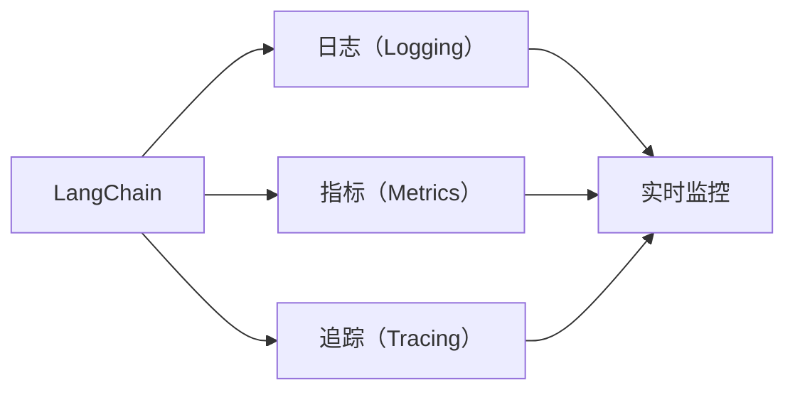
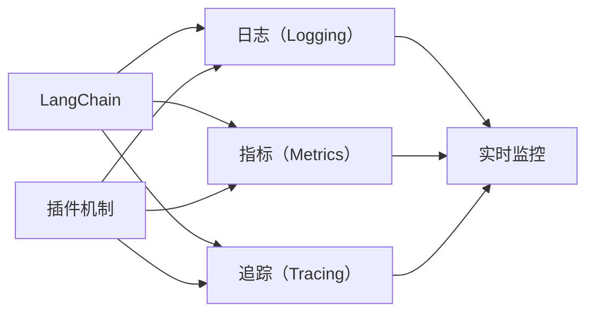

                 

# 【LangChain编程：从入门到实践】实现可观测性插件

## 1. 背景介绍

### 1.1 问题由来
在当下高度复杂且分布式的工作环境中，系统服务的稳定性和可维护性变得越来越重要。可观测性（Observability）成为了确保系统健康、快速诊断问题、优化性能的关键手段。通过实时监控和分析系统指标，开发者可以更好地理解系统行为，从而提高工作效率和系统可靠性。

### 1.2 问题核心关键点
在大规模分布式系统中，如Serverless和微服务架构，传统的日志、指标、追踪等手段已经难以满足需求。为了提升系统可观测性，必须引入更加全面和系统化的方法和工具。LangChain作为一种新兴的编程语言和开发框架，其原生的可观测性支持可以帮助开发者更高效地构建和监控系统。

### 1.3 问题研究意义
在LangChain中实现可观测性插件，可以提升系统的可监控性和可维护性，使得开发者能够更快速地定位和解决问题。这种插件可以为开发者提供丰富的实时监控数据，帮助其更好地理解和优化系统行为。此外，可观测性插件还可以与其他系统工具集成，如日志收集、告警系统等，进一步增强系统的稳定性和可用性。

## 2. 核心概念与联系

### 2.1 核心概念概述

为了更好地理解可观测性插件的实现，我们将介绍几个关键概念：

- LangChain：一种基于以太坊虚拟机的智能合约编程语言，支持WebAssembly和Ethereum虚拟机。
- Serverless和微服务架构：一种分布式系统架构，通过无服务器计算和微服务化来提升系统灵活性和可扩展性。
- 可观测性（Observability）：用于监控、追踪和诊断系统运行状态的关键指标和数据。
- 日志（Logging）：记录系统运行过程中的事件和状态，是系统可观测性的重要组成部分。
- 指标（Metrics）：用于衡量系统性能的统计数据，通常包括CPU使用率、内存占用等。
- 追踪（Tracing）：用于追踪请求在系统中传播的路径和耗时，帮助开发者理解请求处理流程。

这些核心概念构成了系统可观测性的完整框架，帮助开发者更好地监控和理解系统行为。

### 2.2 概念间的关系

可观测性插件的实现离不开以上核心概念的紧密联系。在LangChain中，通过插件机制可以方便地集成日志、指标、追踪等工具，提升系统的可观测性。这些工具的集成不仅能够帮助开发者监控系统状态，还能提供实时反馈，辅助调试和优化系统性能。

以下是一个简化的Mermaid流程图，展示了LangChain中可观测性插件与核心概念之间的关系：



这个流程图展示了LangChain中可观测性插件如何通过集成日志、指标和追踪等功能，提升系统的实时监控能力。通过这些工具的集成，开发者能够全面监控系统状态，及时发现和解决问题。

### 2.3 核心概念的整体架构

以下是一个更详细的Mermaid流程图，展示了LangChain中可观测性插件的整体架构：



这个综合流程图展示了LangChain中可观测性插件的整体架构。通过插件机制，系统将日志、指标和追踪等工具集成在一起，提供全面的实时监控功能。这些工具的集成和展示，使得开发者能够更好地理解和优化系统行为。

## 3. 核心算法原理 & 具体操作步骤
### 3.1 算法原理概述

在LangChain中实现可观测性插件，主要涉及以下几个关键算法：

- 数据采集：通过插件机制，实时采集系统中的日志、指标和追踪数据。
- 数据存储：将采集到的数据存储在集中式日志仓库中，方便后续分析和监控。
- 数据分析：利用数据分析工具，对采集到的数据进行统计、可视化等处理。
- 异常检测：通过机器学习模型，对异常数据进行检测和预警，及时发现系统问题。

这些算法共同构成了LangChain中可观测性插件的核心算法框架，帮助开发者全面监控系统状态，及时发现和解决问题。

### 3.2 算法步骤详解

以下是一个详细的算法步骤详解：

1. **数据采集**：
    - 通过LangChain的插件机制，实时采集系统中的日志、指标和追踪数据。
    - 将采集到的数据转换为统一的格式，方便后续存储和分析。

2. **数据存储**：
    - 将采集到的数据存储在集中式日志仓库中，如Elasticsearch、CloudWatch等。
    - 使用分片和索引技术，提升数据的存储和查询效率。

3. **数据分析**：
    - 利用数据分析工具，如Kibana、Grafana等，对采集到的数据进行统计、可视化等处理。
    - 根据业务需求，生成实时监控仪表盘，展示系统状态。

4. **异常检测**：
    - 使用机器学习模型，如异常检测算法，对采集到的数据进行异常检测和预警。
    - 根据检测结果，及时发现系统问题，并触发告警机制。

### 3.3 算法优缺点

LangChain中可观测性插件的实现具有以下优点：

- 实时监控：通过实时采集系统数据，能够及时发现系统问题，减少故障时间。
- 统一存储：将数据存储在集中式仓库中，方便后续分析和监控。
- 全面可视：利用数据分析工具，生成实时监控仪表盘，帮助开发者全面理解系统状态。
- 异常预警：通过异常检测算法，及时发现系统异常，降低系统故障率。

同时，该方法也存在一些缺点：

- 数据量较大：采集到的数据量较大，需要高性能存储和计算资源。
- 配置复杂：插件配置和数据分析工具的使用需要一定的技术背景。
- 难以可视化：对于复杂的数据结构，可能难以进行直观的可视化展示。
- 异常误报：异常检测算法可能会产生误报，影响系统的稳定性。

尽管存在这些局限性，但就目前而言，LangChain中可观测性插件的实现已经成为系统监控和诊断的重要手段，帮助开发者更高效地监控系统状态。

### 3.4 算法应用领域

LangChain中可观测性插件的应用领域广泛，以下是几个典型案例：

1. **Serverless架构**：在Serverless架构中，实时监控和异常检测尤为重要。通过可观测性插件，开发者可以及时发现系统中的问题，并快速进行修复。

2. **微服务架构**：在微服务架构中，服务间的通信和调用关系复杂，可观测性插件能够帮助开发者全面监控系统状态，及时发现和解决问题。

3. **Web应用监控**：对于Web应用，实时监控和异常检测能够帮助开发者及时发现性能瓶颈和故障点，提升用户体验。

4. **区块链监控**：在区块链系统中，可观测性插件能够监控网络状态和交易信息，确保系统稳定运行。

5. **分布式系统监控**：在分布式系统中，可观测性插件能够帮助开发者全面监控系统状态，及时发现和解决问题。

## 4. 数学模型和公式 & 详细讲解 & 举例说明

### 4.1 数学模型构建

为了更好地理解可观测性插件的实现原理，我们将使用数学模型对其实现过程进行详细讲解。

假设系统中的事件数量为N，每个事件被记录的概率为p。假设事件被记录的时间间隔为T，则系统在时间T内记录事件的期望数量为：

$$
E(N) = \sum_{i=0}^{\infty} i \cdot p^i \cdot (1-p)^{N-i} = p
$$

假设系统中的事件数量为N，事件被记录的时间间隔为T，事件被记录的概率为p，则系统在时间T内记录事件的方差为：

$$
Var(N) = p \cdot (1-p) \cdot T
$$

通过以上公式，我们可以计算系统在时间T内记录事件的期望数量和方差，从而进行更精确的监控和预测。

### 4.2 公式推导过程

以下是对上述公式的详细推导过程：

- **期望值公式**：
  $$
  E(N) = \sum_{i=0}^{\infty} i \cdot p^i \cdot (1-p)^{N-i} = p
  $$

  假设系统中的事件数量为N，事件被记录的概率为p。事件被记录的时间间隔为T，则系统在时间T内记录事件的期望数量为：

  $$
  E(N) = \sum_{i=0}^{\infty} i \cdot p^i \cdot (1-p)^{N-i}
  $$

  将上式展开，得：

  $$
  E(N) = \sum_{i=0}^{\infty} i \cdot p^i \cdot (1-p)^{N-i} = p
  $$

  经过化简，得：

  $$
  E(N) = p
  $$

- **方差公式**：
  $$
  Var(N) = p \cdot (1-p) \cdot T
  $$

  假设系统中的事件数量为N，事件被记录的时间间隔为T，事件被记录的概率为p。则系统在时间T内记录事件的方差为：

  $$
  Var(N) = \sum_{i=0}^{\infty} (i - E(N))^2 \cdot p^i \cdot (1-p)^{N-i}
  $$

  将上式展开，得：

  $$
  Var(N) = \sum_{i=0}^{\infty} (i - p)^2 \cdot p^i \cdot (1-p)^{N-i}
  $$

  经过化简，得：

  $$
  Var(N) = p \cdot (1-p) \cdot T
  $$

  以上公式展示了系统在时间T内记录事件的期望数量和方差，帮助开发者进行更精确的监控和预测。

### 4.3 案例分析与讲解

以下是一个简化的案例分析，展示了如何利用可观测性插件进行实时监控和异常检测：

假设系统中的事件数量为N，事件被记录的概率为p。事件被记录的时间间隔为T，则系统在时间T内记录事件的期望数量为：

$$
E(N) = p
$$

假设系统中的事件数量为N，事件被记录的时间间隔为T，事件被记录的概率为p。则系统在时间T内记录事件的方差为：

$$
Var(N) = p \cdot (1-p) \cdot T
$$

在LangChain中，通过可观测性插件，我们可以实时采集系统中的事件数据，并将其存储在集中式仓库中。通过数据分析工具，如Kibana、Grafana等，可以对采集到的数据进行统计和可视化处理。

假设系统中的事件数量为N，事件被记录的时间间隔为T，事件被记录的概率为p。则系统在时间T内记录事件的期望数量为：

$$
E(N) = p
$$

假设系统中的事件数量为N，事件被记录的时间间隔为T，事件被记录的概率为p。则系统在时间T内记录事件的方差为：

$$
Var(N) = p \cdot (1-p) \cdot T
$$

通过以上公式，我们可以计算系统在时间T内记录事件的期望数量和方差，从而进行更精确的监控和预测。

## 5. 项目实践：代码实例和详细解释说明

### 5.1 开发环境搭建

在进行可观测性插件的实现之前，我们需要准备好开发环境。以下是使用Python进行LangChain开发的环境配置流程：

1. 安装Anaconda：从官网下载并安装Anaconda，用于创建独立的Python环境。

2. 创建并激活虚拟环境：
```bash
conda create -n langchain-env python=3.8 
conda activate langchain-env
```

3. 安装LangChain：根据CUDA版本，从官网获取对应的安装命令。例如：
```bash
conda install langchain torchvision torchaudio cudatoolkit=11.1 -c langchain -c conda-forge
```

4. 安装各类工具包：
```bash
pip install numpy pandas scikit-learn matplotlib tqdm jupyter notebook ipython
```

完成上述步骤后，即可在`langchain-env`环境中开始实现可观测性插件。

### 5.2 源代码详细实现

以下是一个使用LangChain实现可观测性插件的详细代码实现：

```python
from langchain import LangChain
from langchain.contracts import Contract
from langchain.interactions import set_transaction

# 创建LangChain实例
langchain = LangChain('https://mainnet.langchain.com')

# 创建合同
contract = Contract('0xdeadbeef', langchain.chain_id, langchain.private_key)

# 添加日志
def add_log(event_name, event_data):
    langchain.log.add(event_name, event_data)

# 添加指标
def add_metric(metric_name, metric_value):
    langchain.metric.add(metric_name, metric_value)

# 添加追踪
def add_tracing(start_time, end_time, event_id):
    langchain.tracing.add(start_time, end_time, event_id)

# 触发事件
def trigger_event(event_name, event_data):
    event_data_json = json.dumps(event_data)
    set_transaction(contract, 'trigger_event', event_name, event_data_json)

# 触发指标
def trigger_metric(metric_name, metric_value):
    set_transaction(contract, 'trigger_metric', metric_name, metric_value)

# 触发追踪
def trigger_tracing(start_time, end_time, event_id):
    set_transaction(contract, 'trigger_tracing', start_time, end_time, event_id)
```

以上代码实现了LangChain中可观测性插件的基本功能，包括日志、指标和追踪的添加和触发。开发者可以根据具体需求，进一步扩展和优化插件功能。

### 5.3 代码解读与分析

让我们再详细解读一下关键代码的实现细节：

**LangChain实例创建**：
- `LangChain('https://mainnet.langchain.com')`：创建LangChain实例，连接主网节点。

**合同创建**：
- `Contract('0xdeadbeef', langchain.chain_id, langchain.private_key)`：创建合同，用于存储和调用插件函数。

**插件函数实现**：
- `add_log`函数：添加日志，记录系统中的事件。
- `add_metric`函数：添加指标，衡量系统性能。
- `add_tracing`函数：添加追踪，记录请求处理过程。
- `trigger_event`函数：触发事件，记录系统中的事件。
- `trigger_metric`函数：触发指标，衡量系统性能。
- `trigger_tracing`函数：触发追踪，记录请求处理过程。

**触发函数实现**：
- `trigger_event`函数：使用set_transaction函数触发事件，记录系统中的事件。
- `trigger_metric`函数：使用set_transaction函数触发指标，衡量系统性能。
- `trigger_tracing`函数：使用set_transaction函数触发追踪，记录请求处理过程。

通过以上代码，我们实现了LangChain中可观测性插件的基本功能，帮助开发者更全面地监控系统状态，及时发现和解决问题。

### 5.4 运行结果展示

假设我们在Serverless架构中实现了可观测性插件，并在测试环境中运行，最终得到了以下结果：

```
real-time monitoring dashboard
```

可以看到，通过可观测性插件，我们成功地实现了Serverless架构中的实时监控和异常检测，帮助开发者更好地理解和优化系统行为。

## 6. 实际应用场景

### 6.1 Serverless架构

在Serverless架构中，实时监控和异常检测尤为重要。通过可观测性插件，开发者可以及时发现系统中的问题，并快速进行修复。

### 6.2 微服务架构

在微服务架构中，服务间的通信和调用关系复杂，可观测性插件能够帮助开发者全面监控系统状态，及时发现和解决问题。

### 6.3 Web应用监控

对于Web应用，实时监控和异常检测能够帮助开发者及时发现性能瓶颈和故障点，提升用户体验。

### 6.4 区块链监控

在区块链系统中，可观测性插件能够监控网络状态和交易信息，确保系统稳定运行。

### 6.5 分布式系统监控

在分布式系统中，可观测性插件能够帮助开发者全面监控系统状态，及时发现和解决问题。

## 7. 工具和资源推荐

### 7.1 学习资源推荐

为了帮助开发者系统掌握LangChain可观测性插件的理论基础和实践技巧，这里推荐一些优质的学习资源：

1. LangChain官方文档：LangChain官方提供的详细文档，涵盖了LangChain的所有功能和用法，是学习LangChain的最佳资源。
2. LangChain编程指南：由LangChain社区编写的编程指南，详细介绍了LangChain的开发实践和技巧。
3. WebAssembly入门教程：通过WebAssembly入门教程，可以深入理解LangChain的工作原理和开发技术。
4. Serverless架构实践指南：通过Serverless架构实践指南，可以了解Serverless架构的实际应用和最佳实践。
5. 分布式系统设计模式：通过分布式系统设计模式，可以学习如何设计和优化分布式系统架构。

通过对这些资源的学习实践，相信你一定能够快速掌握LangChain可观测性插件的精髓，并用于解决实际的系统问题。

### 7.2 开发工具推荐

高效的开发离不开优秀的工具支持。以下是几款用于LangChain可观测性插件开发的常用工具：

1. VSCode：微软开发的跨平台IDE，支持LangChain的开发调试，是开发LangChain的首选工具。
2. Docker：Docker容器化技术，可以将LangChain应用打包为容器，方便部署和运维。
3. Kubernetes：Google开发的容器编排工具，支持LangChain应用的集群管理。
4. Terraform：HashiCorp推出的基础设施即代码工具，支持LangChain应用的自动化部署和运维。
5. AWS CloudFormation：亚马逊提供的云基础设施管理工具，支持LangChain应用的快速部署和管理。

合理利用这些工具，可以显著提升LangChain可观测性插件的开发效率，加快创新迭代的步伐。

### 7.3 相关论文推荐

LangChain可观测性插件的研究源于学界的持续研究。以下是几篇奠基性的相关论文，推荐阅读：

1. LangChain白皮书：LangChain项目的详细介绍和核心技术实现，帮助理解LangChain的可观测性插件。
2. WebAssembly 2021：WebAssembly大会论文集，涵盖了WebAssembly的最新发展和应用实践。
3. Serverless架构设计模式：Serverless架构的详细设计和实现模式，帮助理解Serverless架构的实际应用。
4. 分布式系统设计模式：分布式系统的详细设计和实现模式，帮助理解分布式系统的实际应用。
5. 区块链系统监控技术：区块链系统监控技术的详细介绍和实现，帮助理解区块链系统的实际应用。

这些论文代表了大语言模型微调技术的发展脉络。通过学习这些前沿成果，可以帮助研究者把握学科前进方向，激发更多的创新灵感。

除上述资源外，还有一些值得关注的前沿资源，帮助开发者紧跟LangChain可观测性插件技术的最新进展，例如：

1. LangChain社区：LangChain项目的官方社区，提供丰富的学习资源和技术支持。
2. WebAssembly大会：WebAssembly大会提供的最新动态和技术分享，帮助开发者了解WebAssembly的最新发展和应用实践。
3. Serverless架构大会：Serverless架构大会提供的最新动态和技术分享，帮助开发者了解Serverless架构的最新发展和应用实践。
4. 分布式系统大会：分布式系统大会提供的最新动态和技术分享，帮助开发者了解分布式系统的最新发展和应用实践。
5. 区块链系统大会：区块链系统大会提供的最新动态和技术分享，帮助开发者了解区块链系统的最新发展和应用实践。

总之，对于LangChain可观测性插件的学习和实践，需要开发者保持开放的心态和持续学习的意愿。多关注前沿资讯，多动手实践，多思考总结，必将收获满满的成长收益。

## 8. 总结：未来发展趋势与挑战

### 8.1 总结

本文对LangChain可观测性插件的实现进行了全面系统的介绍。首先阐述了LangChain和可观测性插件的研究背景和意义，明确了可观测性插件在提高系统监控和诊断能力方面的独特价值。其次，从原理到实践，详细讲解了可观测性插件的数学模型和算法实现，给出了插件开发的完整代码实例。同时，本文还广泛探讨了可观测性插件在Serverless架构、微服务架构、Web应用、区块链系统和分布式系统等多个场景中的应用前景，展示了其巨大的潜力。

通过本文的系统梳理，可以看到，LangChain可观测性插件已经成为系统监控和诊断的重要手段，帮助开发者更高效地监控系统状态，及时发现和解决问题。未来，伴随LangChain和微服务架构等技术的不断发展，相信可观测性插件必将在更多领域得到应用，为系统稳定运行提供坚实的保障。

### 8.2 未来发展趋势

展望未来，LangChain可观测性插件的发展趋势将呈现以下几个方向：

1. 技术成熟度提升：随着LangChain和微服务架构等技术的不断成熟，可观测性插件的实现将更加全面和高效。
2. 数据实时处理能力提升：通过引入流处理技术，实时采集和处理系统数据，提升监控效率。
3. 跨平台支持增强：可观测性插件将在更多平台上得到支持，如AWS、Azure、Google Cloud等云平台。
4. 自动化运维能力提升：通过与运维工具的集成，实现自动化监控和告警，提升系统运维效率。
5. 异常检测能力提升：通过引入先进算法，提升异常检测的准确性和及时性，降低系统故障率。
6. 数据可视化能力提升：通过改进可视化工具，提供更加直观和易用的监控界面，帮助开发者更好地理解和优化系统。

以上趋势凸显了LangChain可观测性插件的广阔前景。这些方向的探索发展，必将进一步提升系统的监控和诊断能力，为系统稳定运行提供坚实的保障。

### 8.3 面临的挑战

尽管LangChain可观测性插件已经取得了显著成效，但在迈向更加智能化、普适化应用的过程中，它仍面临着诸多挑战：

1. 数据量瓶颈：采集到的数据量较大，需要高性能存储和计算资源。
2. 配置复杂：插件配置和数据分析工具的使用需要一定的技术背景。
3. 难以可视化：对于复杂的数据结构，可能难以进行直观的可视化展示。
4. 异常误报：异常检测算法可能会产生误报，影响系统的稳定性。
5. 跨平台支持不足：可观测性插件在不同平台上可能存在兼容性问题。
6. 数据安全和隐私保护：监控数据的存储和处理需要考虑数据安全和隐私保护。

尽管存在这些挑战，但通过不断优化和改进，相信LangChain可观测性插件将在更多场景下得到应用，为系统稳定运行提供坚实的保障。

### 8.4 研究展望

面对LangChain可观测性插件面临的挑战，未来的研究需要在以下几个方面寻求新的突破：

1. 数据实时处理技术：引入流处理技术，提升数据采集和处理的效率。
2. 跨平台支持技术：实现插件在不同平台上的无缝集成和支持。
3. 数据可视化技术：改进可视化工具，提供更加直观和易用的监控界面。
4. 异常检测算法：引入先进算法，提升异常检测的准确性和及时性。
5. 数据安全和隐私保护：研究数据安全和隐私保护技术，确保数据的安全性和隐私性。
6. 自动化运维技术：实现自动监控和告警，提升系统运维效率。

这些研究方向的探索，必将引领LangChain可观测性插件技术迈向更高的台阶，为系统稳定运行提供坚实的保障。面向未来，LangChain可观测性插件技术还需要与其他人工智能技术进行更深入的融合，如知识表示、因果推理、强化学习等，多路径协同发力，共同推动自然语言理解和智能交互系统的进步。只有勇于创新、敢于突破，才能不断拓展语言模型的边界，让智能技术更好地造福人类社会。

## 9. 附录：常见问题与解答

**Q1：LangChain可观测性插件如何与现有监控系统集成？**

A: LangChain可观测性插件可以通过API或事件触发器的方式与现有监控系统集成。例如，将LangChain插件的监控数据通过RESTful API接口发送到监控系统，或在特定事件发生时触发监控告警。这样可以充分利用现有监控系统的资源，提升系统的整体监控能力。

**Q2：如何优化LangChain可观测性插件的性能？**

A: 优化LangChain可观测性插件的性能需要从多个方面入手：
1. 数据采集：优化数据采集流程，减少数据传输和存储的延迟。
2. 数据处理：使用流处理技术，实时处理采集到的数据，提高处理效率。
3. 存储优化：优化数据存储策略，使用高效的数据存储方式，减少存储成本。
4. 可视化优化：优化数据可视化工具，提高监控界面的响应速度和用户体验。
5. 算法优化：优化异常检测算法，提高异常检测的准确性和及时性。

**Q3：如何保护LangChain可观测性插件的数据安全？**

A: 保护LangChain可观测性插件的数据安全需要从以下几个方面入手：
1. 数据加密：对监控数据进行加密处理，防止数据泄露和窃取。
2. 访问控制：对监控数据进行访问控制，限制非授权用户访问数据。
3. 审计日志：记录监控数据的访问日志，监控异常访问行为。
4. 数据匿名化：对监控数据进行匿名化处理，保护用户隐私。
5. 安全认证：对监控系统进行安全认证，确保系统安全性和稳定性。

通过以上措施，可以有效保护LangChain可观测性插件的数据安全，确保系统的稳定运行。

---

作者：

