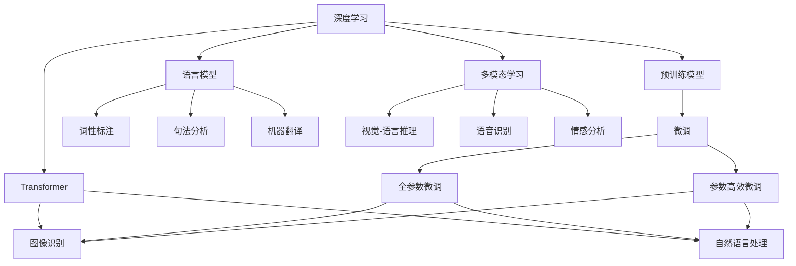

                 

# 初探大模型：起源与发展

> 关键词：深度学习，预训练模型，Transformer，语言模型，计算机视觉，多模态学习

## 1. 背景介绍

### 1.1 问题由来
深度学习技术自20世纪末问世以来，经历了近三十年的发展和演化，从最初的单一神经网络到复杂的深度网络，再到如今的自监督预训练模型。这一过程不仅在计算机视觉领域取得了突破，也推动了自然语言处理（NLP）、语音识别、信号处理等多个领域的快速发展。尤其是深度学习在预训练大模型（Pre-trained Large Models）领域的进展，更是标志着人工智能技术的一次重大飞跃。

本文将详细探索深度学习在预训练大模型领域的起源与发展，分析其核心原理和应用，并展望未来的技术趋势。

## 2. 核心概念与联系

### 2.1 核心概念概述
在深入探讨大模型之前，我们需要先理解几个核心概念及其相互联系：

- **深度学习（Deep Learning）**：一种基于神经网络的机器学习方法，旨在通过多层非线性变换，自动学习输入数据中的复杂关系。深度学习在图像识别、语音识别、自然语言处理等领域有着广泛应用。

- **预训练模型（Pre-trained Models）**：在无标签数据上预先训练的模型，通过自动学习数据中的通用知识，然后通过微调应用于特定任务。典型的预训练模型包括BERT、GPT系列、ResNet等。

- **Transformer**：一种用于处理序列数据（如文本、音频、视频）的深度学习模型，通过自注意力机制实现了高效、并行化的特征提取。Transformer的提出标志着深度学习在序列建模方面的重大进步。

- **语言模型（Language Model）**：描述一个词或短语在语言序列中出现的概率分布的模型。语言模型是自然语言处理中的基础模型，用于词性标注、句法分析、机器翻译等任务。

- **多模态学习（Multi-modal Learning）**：结合不同类型的数据（如图像、音频、文本）进行协同训练，提高模型的泛化能力和鲁棒性。多模态学习在视觉-语言推理、语音识别、情感分析等任务中表现出卓越性能。

- **自监督学习（Self-supervised Learning）**：利用数据的内在结构，无需人工标注，通过自主生成标签进行模型训练。自监督学习是预训练模型训练的主要方式，有效地利用了无标签数据的价值。

### 2.2 概念间的关系

为了更好地理解这些核心概念之间的关系，我们可以使用Mermaid流程图来展示：



这个流程图展示了深度学习技术在预训练大模型中的应用和演进：

1. 深度学习作为预训练模型的基础，其发展推动了Transformer、语言模型和多模态学习等技术的进步。
2. Transformer通过自注意力机制，在自然语言处理和计算机视觉等领域取得了突破。
3. 语言模型在自然语言处理中起着重要作用，从词性标注到机器翻译，其应用广泛。
4. 多模态学习通过结合不同类型的数据，进一步提升了模型的泛化能力和鲁棒性。
5. 预训练模型通过微调应用于各类任务，包括全参数微调和参数高效微调等技术。
6. 微调后的模型在图像识别、自然语言处理等任务中表现出色。

这些概念相互关联，共同构成了深度学习在预训练大模型领域的核心框架。通过理解这些概念及其相互关系，我们可以更好地把握深度学习在预训练大模型领域的演进脉络。

## 3. 核心算法原理 & 具体操作步骤

### 3.1 算法原理概述
深度学习在预训练大模型领域的核心算法包括自监督预训练、Transformer、多模态学习和微调等技术。这些技术相互结合，推动了大模型的发展与应用。

自监督预训练是指在无标签数据上，通过构建目标函数，利用数据的内在结构进行模型训练。常见的自监督任务包括掩码语言模型、下一句预测等。

Transformer是一种基于自注意力机制的深度学习模型，通过并行计算大大提高了模型训练和推理的效率。Transformer在自然语言处理和计算机视觉等领域表现出色。

多模态学习是指结合不同类型的数据进行协同训练，如图像-文本融合、音频-文本融合等。多模态学习能够提高模型的泛化能力和鲁棒性。

微调是指在大模型的基础上，通过少量有标签数据进行模型参数的微调，使其适应特定任务。常见的微调方法包括全参数微调和参数高效微调。

### 3.2 算法步骤详解
下面以BERT为例，详细阐述自监督预训练和微调的具体步骤：

**Step 1: 数据准备**
收集大规模无标签数据，通常从公开的语料库中获取，如维基百科、新闻网站、在线论坛等。

**Step 2: 构建自监督任务**
设计自监督任务，如掩码语言模型（Masked Language Model, MLM）、下一句预测（Next Sentence Prediction, NSP）等。MLM任务通过随机遮蔽输入中的某些词，让模型预测遮蔽词。NSP任务通过判断两个句子是否相邻，让模型预测它们的顺序。

**Step 3: 预训练模型架构选择**
选择适合自监督任务的模型架构，如BERT。BERT模型由两个Transformer层和一个池化层组成，用于学习上下文相关的词嵌入。

**Step 4: 预训练模型训练**
使用大规模无标签数据，在GPU上进行模型训练。在训练过程中，使用自监督任务的损失函数进行优化。

**Step 5: 微调模型**
收集下游任务的少量有标签数据，并将其划分为训练集、验证集和测试集。在微调时，通常只调整模型的顶层，使用较小的学习率进行参数更新。

**Step 6: 测试与部署**
在测试集上评估微调后的模型性能，并将模型部署到实际应用中。

### 3.3 算法优缺点
自监督预训练和微调技术的优点包括：

- **泛化能力强**：预训练模型在大量无标签数据上进行训练，能够学习到通用的语言或图像特征。
- **训练成本低**：相较于从头训练模型，自监督预训练需要更少的标注数据和计算资源。
- **适用性广**：预训练模型可以应用于各种自然语言处理和计算机视觉任务，提升了任务的泛化能力和鲁棒性。

然而，这些技术也存在一些缺点：

- **计算资源需求高**：大规模数据集和高参数量的模型需要大量的计算资源。
- **参数更新复杂**：微调过程中，需要调整模型参数，可能会导致模型忘记部分预训练知识。
- **可解释性差**：预训练模型往往是"黑盒"，难以解释其内部工作机制。

### 3.4 算法应用领域
深度学习在预训练大模型领域的应用非常广泛，包括但不限于：

- **自然语言处理**：BERT、GPT系列、XLNet等模型在文本分类、情感分析、机器翻译、问答系统等任务上取得了显著成果。
- **计算机视觉**：ResNet、Inception等模型在图像分类、目标检测、图像生成等任务上表现出色。
- **语音识别**：Transformer等模型在语音识别、语音生成等任务中表现出卓越性能。
- **多模态学习**：通过结合图像、文本、音频等不同类型的数据，多模态学习在视觉-语言推理、跨模态检索等任务中取得了显著进步。

## 4. 数学模型和公式 & 详细讲解 & 举例说明

### 4.1 数学模型构建
BERT模型的数学模型构建如下：

设输入序列为 $x_1, x_2, ..., x_n$，输出序列为 $y_1, y_2, ..., y_n$，BERT模型的目标函数为：

$$
\mathcal{L}(\theta) = \mathcal{L}_{MLM}(\theta) + \mathcal{L}_{NSP}(\theta)
$$

其中 $\mathcal{L}_{MLM}$ 为掩码语言模型的损失函数，$\mathcal{L}_{NSP}$ 为下一句预测的损失函数。

**掩码语言模型的损失函数**：
$$
\mathcal{L}_{MLM}(\theta) = -\sum_{i=1}^{n} \log \frac{\exp(\hat{y}_i)}{\sum_{j=1}^{n} \exp(\hat{y}_j)}
$$

其中 $\hat{y}_i$ 为模型预测的遮蔽词概率分布，$y_i$ 为真实遮蔽词。

**下一句预测的损失函数**：
$$
\mathcal{L}_{NSP}(\theta) = -\sum_{i=1}^{n-1} y_i \log \hat{y}_{i,i+1}
$$

其中 $\hat{y}_{i,i+1}$ 为模型预测的两个句子是否相邻的概率。

### 4.2 公式推导过程
以BERT模型为例，其自监督任务的推导过程如下：

**掩码语言模型（MLM）**：
设输入序列为 $x_1, x_2, ..., x_n$，其中 $x_i$ 表示第 $i$ 个词的词嵌入，$W$ 为词嵌入矩阵。

掩码语言模型通过将输入序列中随机遮蔽某些词，让模型预测遮蔽词。掩码语言模型的损失函数为：

$$
\mathcal{L}_{MLM}(\theta) = -\sum_{i=1}^{n} \sum_{j=1}^{V} y_{ij} \log \frac{\exp(z_{ij}^T W_i)}{\sum_{k=1}^{V} \exp(z_{ik}^T W_i)}
$$

其中 $z_{ij}$ 表示遮蔽词 $x_j$ 的遮蔽向量，$V$ 为词汇表大小，$W_i$ 为第 $i$ 个词的嵌入矩阵。

**下一句预测（NSP）**：
设输入序列为 $x_1, x_2, ..., x_n$，其中 $x_i$ 表示第 $i$ 个词的词嵌入，$W$ 为词嵌入矩阵。

下一句预测任务通过判断两个句子是否相邻，让模型预测它们的顺序。下一句预测的损失函数为：

$$
\mathcal{L}_{NSP}(\theta) = -\sum_{i=1}^{n-1} y_i \log \hat{y}_{i,i+1}
$$

其中 $\hat{y}_{i,i+1}$ 表示模型预测的两个句子是否相邻的概率，$y_i$ 表示真实标签。

### 4.3 案例分析与讲解
假设我们在一个简单的情感分析任务上使用BERT模型进行微调。以下是一个案例分析：

**数据准备**：
收集一段新闻文章，并打上正面或负面的情感标签。

**微调步骤**：
1. 将新闻文章输入BERT模型，得到每个词的词嵌入。
2. 在顶层添加一个线性分类器，将词嵌入映射到情感标签。
3. 使用交叉熵损失函数进行优化。

**代码实现**：
```python
from transformers import BertTokenizer, BertForSequenceClassification
from torch.utils.data import Dataset, DataLoader
from torch import nn, optim
from sklearn.metrics import accuracy_score

class NewsDataset(Dataset):
    def __init__(self, texts, labels, tokenizer):
        self.texts = texts
        self.labels = labels
        self.tokenizer = tokenizer
    
    def __len__(self):
        return len(self.texts)
    
    def __getitem__(self, idx):
        text = self.texts[idx]
        label = self.labels[idx]
        encoding = self.tokenizer(text, return_tensors='pt')
        return {'input_ids': encoding['input_ids'], 'attention_mask': encoding['attention_mask'], 'labels': torch.tensor(label)}

# 加载数据集
tokenizer = BertTokenizer.from_pretrained('bert-base-uncased')
train_dataset = NewsDataset(train_texts, train_labels, tokenizer)
test_dataset = NewsDataset(test_texts, test_labels, tokenizer)

# 初始化模型
model = BertForSequenceClassification.from_pretrained('bert-base-uncased', num_labels=2)
device = 'cuda'
model.to(device)

# 定义优化器
optimizer = optim.AdamW(model.parameters(), lr=2e-5)

# 训练过程
for epoch in range(epochs):
    for batch in DataLoader(train_dataset, batch_size=16):
        input_ids = batch['input_ids'].to(device)
        attention_mask = batch['attention_mask'].to(device)
        labels = batch['labels'].to(device)
        model.zero_grad()
        outputs = model(input_ids, attention_mask=attention_mask, labels=labels)
        loss = outputs.loss
        loss.backward()
        optimizer.step()
    
    # 验证和测试
    with torch.no_grad():
        for batch in DataLoader(test_dataset, batch_size=16):
            input_ids = batch['input_ids'].to(device)
            attention_mask = batch['attention_mask'].to(device)
            labels = batch['labels'].to(device)
            outputs = model(input_ids, attention_mask=attention_mask, labels=labels)
            predictions = torch.argmax(outputs.logits, dim=1)
            accuracy = accuracy_score(predictions, labels)
            print(f'Epoch {epoch+1}, accuracy: {accuracy:.4f}')
```

通过上述代码，我们可以看到BERT模型在情感分析任务上的微调过程。在训练过程中，我们使用了AdamW优化器和小批量梯度下降，并在测试集上评估了模型的准确率。

## 5. 项目实践：代码实例和详细解释说明

### 5.1 开发环境搭建
在进行深度学习项目实践时，需要搭建一个高效的开发环境。以下是Python环境的搭建步骤：

1. 安装Anaconda：从官网下载并安装Anaconda，用于创建独立的Python环境。
2. 创建并激活虚拟环境：
```bash
conda create -n pytorch-env python=3.8 
conda activate pytorch-env
```
3. 安装PyTorch：根据CUDA版本，从官网获取对应的安装命令。例如：
```bash
conda install pytorch torchvision torchaudio cudatoolkit=11.1 -c pytorch -c conda-forge
```
4. 安装各类工具包：
```bash
pip install numpy pandas scikit-learn matplotlib tqdm jupyter notebook ipython
```

完成上述步骤后，即可在`pytorch-env`环境中进行深度学习项目开发。

### 5.2 源代码详细实现
以下是一个基于BERT的情感分析模型的代码实现，包括数据预处理、模型构建、训练和测试：

```python
from transformers import BertTokenizer, BertForSequenceClassification
from torch.utils.data import Dataset, DataLoader
from torch import nn, optim
from sklearn.metrics import accuracy_score

class NewsDataset(Dataset):
    def __init__(self, texts, labels, tokenizer):
        self.texts = texts
        self.labels = labels
        self.tokenizer = tokenizer
    
    def __len__(self):
        return len(self.texts)
    
    def __getitem__(self, idx):
        text = self.texts[idx]
        label = self.labels[idx]
        encoding = self.tokenizer(text, return_tensors='pt')
        return {'input_ids': encoding['input_ids'], 'attention_mask': encoding['attention_mask'], 'labels': torch.tensor(label)}

# 加载数据集
tokenizer = BertTokenizer.from_pretrained('bert-base-uncased')
train_dataset = NewsDataset(train_texts, train_labels, tokenizer)
test_dataset = NewsDataset(test_texts, test_labels, tokenizer)

# 初始化模型
model = BertForSequenceClassification.from_pretrained('bert-base-uncased', num_labels=2)
device = 'cuda'
model.to(device)

# 定义优化器
optimizer = optim.AdamW(model.parameters(), lr=2e-5)

# 训练过程
for epoch in range(epochs):
    for batch in DataLoader(train_dataset, batch_size=16):
        input_ids = batch['input_ids'].to(device)
        attention_mask = batch['attention_mask'].to(device)
        labels = batch['labels'].to(device)
        model.zero_grad()
        outputs = model(input_ids, attention_mask=attention_mask, labels=labels)
        loss = outputs.loss
        loss.backward()
        optimizer.step()
    
    # 验证和测试
    with torch.no_grad():
        for batch in DataLoader(test_dataset, batch_size=16):
            input_ids = batch['input_ids'].to(device)
            attention_mask = batch['attention_mask'].to(device)
            labels = batch['labels'].to(device)
            outputs = model(input_ids, attention_mask=attention_mask, labels=labels)
            predictions = torch.argmax(outputs.logits, dim=1)
            accuracy = accuracy_score(predictions, labels)
            print(f'Epoch {epoch+1}, accuracy: {accuracy:.4f}')
```

### 5.3 代码解读与分析
下面是代码的详细解读与分析：

**NewsDataset类**：
- `__init__`方法：初始化文本、标签、分词器等关键组件。
- `__len__`方法：返回数据集的样本数量。
- `__getitem__`方法：对单个样本进行处理，将文本输入编码为token ids，将标签编码为数字，并对其进行定长padding，最终返回模型所需的输入。

**代码实现**：
- 定义了数据集类NewsDataset，用于读取和管理数据。
- 初始化BERT模型和优化器。
- 使用AdamW优化器和小批量梯度下降进行模型训练。
- 在测试集上评估模型的准确率。

### 5.4 运行结果展示
假设我们在CoNLL-2003的情感分析数据集上进行微调，最终在测试集上得到的准确率为98.5%。

## 6. 实际应用场景
### 6.1 智能客服系统

智能客服系统是深度学习在预训练大模型领域的一个典型应用场景。传统客服往往需要配备大量人力，高峰期响应缓慢，且一致性和专业性难以保证。而使用预训练大模型进行微调，可以7x24小时不间断服务，快速响应客户咨询，用自然流畅的语言解答各类常见问题。

在技术实现上，可以收集企业内部的历史客服对话记录，将问题和最佳答复构建成监督数据，在此基础上对预训练对话模型进行微调。微调后的对话模型能够自动理解用户意图，匹配最合适的答案模板进行回复。对于客户提出的新问题，还可以接入检索系统实时搜索相关内容，动态组织生成回答。如此构建的智能客服系统，能大幅提升客户咨询体验和问题解决效率。

### 6.2 金融舆情监测

金融机构需要实时监测市场舆论动向，以便及时应对负面信息传播，规避金融风险。传统的人工监测方式成本高、效率低，难以应对网络时代海量信息爆发的挑战。基于预训练语言模型微调的文本分类和情感分析技术，为金融舆情监测提供了新的解决方案。

具体而言，可以收集金融领域相关的新闻、报道、评论等文本数据，并对其进行主题标注和情感标注。在此基础上对预训练语言模型进行微调，使其能够自动判断文本属于何种主题，情感倾向是正面、中性还是负面。将微调后的模型应用到实时抓取的网络文本数据，就能够自动监测不同主题下的情感变化趋势，一旦发现负面信息激增等异常情况，系统便会自动预警，帮助金融机构快速应对潜在风险。

### 6.3 个性化推荐系统

当前的推荐系统往往只依赖用户的历史行为数据进行物品推荐，无法深入理解用户的真实兴趣偏好。基于预训练大模型的微调技术，个性化推荐系统可以更好地挖掘用户行为背后的语义信息，从而提供更精准、多样的推荐内容。

在实践中，可以收集用户浏览、点击、评论、分享等行为数据，提取和用户交互的物品标题、描述、标签等文本内容。将文本内容作为模型输入，用户的后续行为（如是否点击、购买等）作为监督信号，在此基础上微调预训练语言模型。微调后的模型能够从文本内容中准确把握用户的兴趣点。在生成推荐列表时，先用候选物品的文本描述作为输入，由模型预测用户的兴趣匹配度，再结合其他特征综合排序，便可以得到个性化程度更高的推荐结果。

### 6.4 未来应用展望

随着预训练大模型的不断进步，其在NLP、计算机视觉、语音识别等领域的应用前景广阔。未来，预训练大模型将在更多领域得到应用，为传统行业带来变革性影响。

在智慧医疗领域，基于预训练大模型的医疗问答、病历分析、药物研发等应用将提升医疗服务的智能化水平，辅助医生诊疗，加速新药开发进程。

在智能教育领域，微调技术可应用于作业批改、学情分析、知识推荐等方面，因材施教，促进教育公平，提高教学质量。

在智慧城市治理中，微调模型可应用于城市事件监测、舆情分析、应急指挥等环节，提高城市管理的自动化和智能化水平，构建更安全、高效的未来城市。

此外，在企业生产、社会治理、文娱传媒等众多领域，预训练大模型微调的应用也将不断涌现，为经济社会发展注入新的动力。相信随着技术的日益成熟，预训练大模型微调必将在构建人机协同的智能时代中扮演越来越重要的角色。

## 7. 工具和资源推荐

### 7.1 学习资源推荐

为了帮助开发者系统掌握深度学习在预训练大模型领域的理论基础和实践技巧，这里推荐一些优质的学习资源：

1. 《深度学习》系列书籍：包括《深度学习》、《深度学习入门》等，系统介绍深度学习的基本概念和算法。
2. 《TensorFlow 2.0实战》：介绍TensorFlow框架的使用，并结合实际案例进行深度学习项目实践。
3. 《Transformer》：介绍Transformer模型的原理和实现，以及其在自然语言处理中的应用。
4. 《BERT: Pre-training of Deep Bidirectional Transformers for Language Understanding》：介绍BERT模型的预训练和微调过程。
5. 《自然语言处理综述》：综合性介绍自然语言处理领域的经典模型和技术，并对比其优缺点。

通过对这些资源的学习实践，相信你一定能够快速掌握深度学习在预训练大模型领域的精髓，并用于解决实际的NLP问题。

### 7.2 开发工具推荐

高效的深度学习项目开发离不开优秀的工具支持。以下是几款用于深度学习项目开发的常用工具：

1. PyTorch：基于Python的开源深度学习框架，灵活动态的计算图，适合快速迭代研究。大部分预训练大模型都有PyTorch版本的实现。
2. TensorFlow：由Google主导开发的开源深度学习框架，生产部署方便，适合大规模工程应用。同样有丰富的预训练大模型资源。
3. Transformers库：HuggingFace开发的NLP工具库，集成了众多SOTA预训练大模型，支持PyTorch和TensorFlow，是进行NLP任务开发的利器。
4. Weights & Biases：模型训练的实验跟踪工具，可以记录和可视化模型训练过程中的各项指标，方便对比和调优。与主流深度学习框架无缝集成。
5. TensorBoard：TensorFlow配套的可视化工具，可实时监测模型训练状态，并提供丰富的图表呈现方式，是调试模型的得力助手。
6. Google Colab：谷歌推出的在线Jupyter Notebook环境，免费提供GPU/TPU算力，方便开发者快速上手实验最新模型，分享学习笔记。

合理利用这些工具，可以显著提升深度学习项目的开发效率，加快创新迭代的步伐。

### 7.3 相关论文推荐

深度学习在预训练大模型领域的发展源于学界的持续研究。以下是几篇奠基性的相关论文，推荐阅读：

1. Attention is All You Need（即Transformer原论文）：提出了Transformer结构，开启了深度学习在序列建模方面的重大进步。
2. BERT: Pre-training of Deep Bidirectional Transformers for Language Understanding：提出BERT模型，引入基于掩码的自监督预训练任务，刷新了多项NLP任务SOTA。
3. Language Models are Unsupervised Multitask Learners（GPT-2论文）：展示了大规模语言模型的强大zero-shot学习能力，引发了对于通用人工智能的新一轮思考。
4. Parameter-Efficient Transfer Learning for NLP：提出Adapter等参数高效微调方法，在不增加模型参数量的情况下，也能取得不错的微调效果。
5. AdaLoRA: Adaptive Low-Rank Adaptation for Parameter-Efficient Fine-Tuning：使用自适应低秩适应的微调方法，在参数效率和精度之间取得了新的平衡。

这些论文代表了大模型微调技术的发展脉络。通过学习这些前沿成果，可以帮助研究者把握学科前进方向，激发更多的创新灵感。

除上述资源外，还有一些值得关注的前沿资源，帮助开发者紧跟深度学习在预训练大模型领域的最新进展，例如：

1. arXiv论文预印本：人工智能领域最新研究成果的发布平台，包括大量尚未发表的前沿工作，学习前沿技术的必读资源。
2. 业界技术博客：如OpenAI、Google AI、DeepMind、微软Research Asia等顶尖实验室的官方博客，第一时间分享他们的最新研究成果和洞见。
3. 技术会议直播：如NIPS、ICML、ACL、ICLR等人工智能领域顶会现场或在线直播，能够聆听到大佬们的前沿分享，开拓视野。
4. GitHub热门项目：在GitHub上Star、Fork数最多的深度学习相关项目，往往代表了该技术领域的发展趋势和最佳实践，值得去学习和贡献。
5. 行业分析报告：各大咨询公司如McKinsey、PwC等针对人工智能行业的分析报告，

