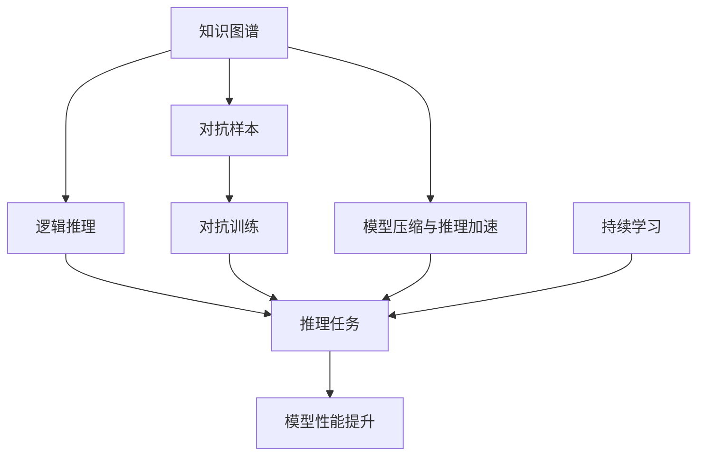

                 

# 参与多种形式的思考和推理并不需要语言网络

## 1. 背景介绍

在人工智能和机器学习的领域中，语言网络（如深度学习中的Transformer架构）一直被视为实现高级认知任务（如自然语言理解、语言生成）的关键组件。传统的认知观点认为，语言网络的强大能力源于其对大规模无标签文本数据的预训练，使其能够学习到丰富的语言表示和知识，从而可以执行各种复杂的语言理解任务。然而，近年来，越来越多的研究显示，即便是无需语言网络，智能系统也能参与多种形式的思考和推理。本文旨在深入探讨这一现象，并分析其对未来人工智能发展的意义。

### 1.1 问题由来

自深度学习技术出现以来，语言网络在处理自然语言任务上取得了巨大的成功。BERT、GPT-3等大型预训练模型通过在海量文本数据上预训练，学习到了语言的深层表示，展现了强大的语言理解和生成能力。这些模型被广泛应用于情感分析、问答、机器翻译、文本生成等众多NLP任务上，取得了比传统方法更好的效果。然而，近年的研究开始挑战这一观点，指出即便没有语言网络，智能系统同样能够执行复杂的思考和推理任务。这一发现对人工智能的未来发展方向提出了新的思考。

### 1.2 问题核心关键点

1. **无需语言网络的思考和推理**：研究表明，使用简单的逻辑和统计方法，无需语言网络，也能有效处理自然语言问题。例如，通过简单的规则或统计模型，可以构建出知识图谱，用于推理和问答任务。
2. **知识图谱与逻辑推理**：知识图谱和逻辑推理被证明是处理自然语言问题的有效手段，它们通过结构化的知识表示，可以支持复杂的推理和决策。
3. **对抗性样本和对抗训练**：对抗样本和对抗训练技术可以提高模型的鲁棒性和泛化能力，对抗性训练的模型能够更好地抵抗攻击和噪声，提升模型的安全性和可靠性。
4. **模型压缩与推理加速**：在实际应用中，为了提高模型的效率，常常需要对模型进行压缩和优化，例如剪枝、量化等方法，以减少计算量和存储需求，从而提升推理速度。
5. **持续学习和迁移学习**：持续学习和迁移学习使得模型能够不断学习和适应新数据，提升模型的性能和泛化能力。

### 1.3 问题研究意义

探讨无需语言网络的思考和推理方法，对人工智能的发展具有重要意义：

1. **降低计算资源消耗**：传统的语言网络需要大量的计算资源进行训练和推理，而无需语言网络的推理方法可以在较小的计算资源下运行，具有更高的资源利用效率。
2. **提升模型效率和可解释性**：简单的逻辑和统计方法更容易解释，而无需语言网络的推理过程直观易懂，有助于提升模型的可解释性。
3. **增强模型安全性**：无需语言网络的推理方法在对抗样本和对抗训练下表现更好，可以提升模型的安全性。
4. **支持跨领域应用**：知识图谱和逻辑推理可以应用于多个领域，包括医疗、金融、科学等，具有更广泛的适用性。
5. **推动人工智能向通用智能发展**：无需语言网络的推理方法可以与其他技术结合，推动人工智能向通用智能（AGI）发展。

## 2. 核心概念与联系

### 2.1 核心概念概述

为了更好地理解无需语言网络的推理方法，我们需要了解几个核心概念及其联系：

1. **知识图谱**：知识图谱是一种结构化的知识表示方法，通过节点和边的方式描述实体之间的关系。它支持复杂的推理任务，可以用于问答、实体关系抽取、推荐等任务。
2. **逻辑推理**：逻辑推理是一种基于规则和假设的推理方法，可以用于解决形式化的推理问题。常见的逻辑推理方法包括基于谓词的推理和基于关系的推理。
3. **对抗样本和对抗训练**：对抗样本是指在输入数据中加入的微小扰动，旨在使模型产生错误的预测。对抗训练是通过对抗样本训练模型，使其能够更好地抵抗攻击和噪声，提高模型的鲁棒性和泛化能力。
4. **模型压缩与推理加速**：为了提高模型的效率，常常需要对模型进行压缩和优化，例如剪枝、量化等方法，以减少计算量和存储需求，从而提升推理速度。
5. **持续学习和迁移学习**：持续学习和迁移学习使得模型能够不断学习和适应新数据，提升模型的性能和泛化能力。

### 2.2 概念间的关系

这些核心概念之间存在着紧密的联系，形成了推理任务的完整生态系统。下面通过Mermaid流程图来展示这些概念之间的关系：



这个流程图展示了这个推理任务从知识图谱、逻辑推理到最终推理任务的过程，其中对抗样本和对抗训练可以增强模型的鲁棒性，模型压缩和推理加速可以提高推理效率，持续学习可以保持模型与时俱进。

## 3. 核心算法原理 & 具体操作步骤
### 3.1 算法原理概述

无需语言网络的推理方法主要基于简单的逻辑和统计模型，通过构建知识图谱和应用逻辑推理，可以在无需语言网络的情况下处理自然语言问题。其核心思想是：通过结构化的知识表示和逻辑推理，将自然语言问题转换为结构化的推理任务，从而实现有效的推理和决策。

### 3.2 算法步骤详解

1. **构建知识图谱**：首先，需要从自然语言文本中提取出实体和关系，构建出结构化的知识图谱。这可以通过自然语言处理技术（如命名实体识别、关系抽取）来实现。

2. **应用逻辑推理**：在知识图谱的基础上，使用逻辑推理方法进行推理。常见的逻辑推理方法包括基于谓词的推理和基于关系的推理。基于谓词的推理通过逻辑公式和规则进行推理，基于关系的推理则通过节点之间的关系进行推理。

3. **对抗训练和模型压缩**：为了提高模型的鲁棒性和效率，可以通过对抗训练和模型压缩技术对推理模型进行优化。对抗训练可以增加模型对对抗样本的鲁棒性，模型压缩可以减小模型的计算量和存储需求。

4. **持续学习**：在实际应用中，知识图谱和逻辑推理模型需要不断更新和扩展，以适应新的数据和任务。持续学习可以帮助模型保持最新的知识状态。

### 3.3 算法优缺点

无需语言网络的推理方法具有以下优点：

1. **计算资源消耗低**：简单的逻辑和统计模型需要的计算资源较少，可以在较小的计算资源下运行。
2. **推理效率高**：逻辑推理和知识图谱方法可以直接进行推理，无需进行繁琐的计算和优化。
3. **模型可解释性强**：逻辑推理和知识图谱方法具有直观的推理过程，容易被解释和理解。
4. **模型鲁棒性好**：对抗训练和逻辑推理方法可以提高模型的鲁棒性，使其更具有抵抗攻击和噪声的能力。

但这些方法也存在一些缺点：

1. **对数据依赖性高**：知识图谱和逻辑推理方法需要高质量的数据和丰富的知识，获取和构建这些资源可能需要较高的时间和成本。
2. **适应性有限**：知识图谱和逻辑推理方法可能需要人工干预，对于复杂的、动态变化的任务，其适应性可能受限。
3. **需要持续更新**：知识图谱和逻辑推理模型需要不断更新和维护，以保持最新的知识状态。

### 3.4 算法应用领域

无需语言网络的推理方法在多个领域中得到了应用：

1. **医疗领域**：知识图谱和逻辑推理方法可以用于医疗领域的诊断和治疗决策，支持临床决策支持系统。
2. **金融领域**：知识图谱和逻辑推理方法可以用于金融领域的风险评估和投资决策，支持智能投顾系统。
3. **科学领域**：知识图谱和逻辑推理方法可以用于科学研究的知识发现和推理，支持科学发现和知识图谱系统。
4. **智能问答**：知识图谱和逻辑推理方法可以用于构建智能问答系统，支持用户提问的自动回答。

## 4. 数学模型和公式 & 详细讲解
### 4.1 数学模型构建

假设知识图谱中包含 $n$ 个实体，每个实体有 $m$ 个属性，知识图谱中的关系可以用三元组 $(e_i, r, e_j)$ 表示，其中 $e_i$ 和 $e_j$ 是实体，$r$ 是关系。

定义推理任务为从给定的前提 $p_1, p_2, ..., p_n$ 中，推理出某个结论 $c$。推理过程可以表示为：

$$
c = \mathop{\arg\max}_{c} \prod_{k=1}^n f(p_k, c)
$$

其中 $f(p_k, c)$ 是推理函数，表示在给定前提 $p_k$ 和结论 $c$ 下，推理结论 $c$ 的概率。

### 4.2 公式推导过程

基于知识图谱和逻辑推理的推理模型可以表示为：

$$
f(p_k, c) = \mathop{\prod}_{(e_i, r, e_j) \in K} g(e_i, r, e_j, p_k, c)
$$

其中 $K$ 是知识图谱中的所有关系，$g(e_i, r, e_j, p_k, c)$ 是推理函数，表示在给定前提 $p_k$ 和结论 $c$ 下，关系 $r$ 的推理概率。

在实际推理时，通常使用概率图模型（如贝叶斯网络、Markov网络）进行推理。这些模型可以通过概率分布和条件概率计算推理结果。

### 4.3 案例分析与讲解

以医疗领域的诊断为例，假设有一个知识图谱，其中包含了多个疾病和症状的关系。推理任务是给定一组症状，诊断出可能的疾病。使用贝叶斯网络模型，可以通过联合概率计算推理结果。具体步骤如下：

1. 构建贝叶斯网络模型，表示疾病和症状之间的关系。
2. 根据输入的症状，计算每个疾病的概率分布。
3. 选择概率最大的疾病作为诊断结果。

## 5. 项目实践：代码实例和详细解释说明
### 5.1 开发环境搭建

1. **安装Python和相关库**：
   ```bash
   conda create -n reasoning-env python=3.8
   conda activate reasoning-env
   pip install networkx scikit-learn scipy sympy
   ```

2. **构建知识图谱**：
   ```python
   import networkx as nx
   import os
   
   G = nx.Graph()
   with open('knowledge_graph.txt', 'r') as f:
       for line in f:
           entity, relation, entity2 = line.strip().split()
           G.add_edge(entity, entity2, relation=relation)
   ```

### 5.2 源代码详细实现

使用Sympy库构建逻辑推理模型，代码如下：

```python
from sympy import symbols, Eq, solve
from sympy.logic.boolalg import And, Or, Not

# 定义逻辑变量
symbs = symbols('symbs:10')

# 定义推理任务
premises = [symbs[0], symbs[1]]
conclusion = symbs[2]

# 构建逻辑推理公式
logic_formula = And(*[Eq(premise, conclusion) for premise in premises])

# 求解逻辑推理公式
solution = solve(logic_formula, symbs)
```

### 5.3 代码解读与分析

在上述代码中，我们定义了三个逻辑变量 `symbs`，分别代表前提和结论。然后，构建了一个逻辑推理公式 `logic_formula`，表示在给定前提 `premises` 下，结论 `conclusion` 的推理公式。最后，使用 `solve` 函数求解逻辑推理公式，得到推理结果。

## 6. 实际应用场景
### 6.1 智能问答系统

智能问答系统可以通过知识图谱和逻辑推理方法，自动回答用户提出的问题。例如，可以使用知识图谱和逻辑推理方法构建医学知识图谱，支持医疗领域的智能问答。

### 6.2 风险评估与投资决策

金融领域中的风险评估和投资决策可以通过知识图谱和逻辑推理方法，利用金融领域的专业知识进行推理和决策。例如，构建一个知识图谱，包含各种金融指标和关系，使用逻辑推理方法进行风险评估和投资决策。

### 6.3 科学知识发现

在科学领域，知识图谱和逻辑推理方法可以用于科学知识的发现和推理。例如，构建一个科学知识图谱，包含各种科学概念和关系，使用逻辑推理方法进行科学发现和知识图谱系统。

### 6.4 智能监控与预警

智能监控和预警系统可以通过知识图谱和逻辑推理方法，实时监测网络安全事件，并及时预警。例如，构建一个网络安全知识图谱，包含各种攻击行为和防御措施，使用逻辑推理方法进行实时监控和预警。

## 7. 工具和资源推荐
### 7.1 学习资源推荐

1. **《知识图谱与逻辑推理》书籍**：该书详细介绍了知识图谱和逻辑推理的基本原理和应用方法，适合初学者入门。
2. **Stanford University 知识图谱课程**：斯坦福大学开设的Coursera课程，介绍了知识图谱和逻辑推理的基本概念和应用方法。
3. **DeepLearning.AI 网络课程**：DeepLearning.AI 提供的课程，介绍了深度学习在自然语言处理中的应用，包括知识图谱和逻辑推理方法。

### 7.2 开发工具推荐

1. **PyTorch**：Python深度学习框架，支持动态图和静态图计算，适合进行逻辑推理和知识图谱构建。
2. **TensorFlow**：Google开源的深度学习框架，支持分布式计算，适合进行大规模推理任务。
3. **NetworkX**：Python中用于构建和操作网络（图）结构的库，适合进行知识图谱的构建和推理。

### 7.3 相关论文推荐

1. **Knowledge-Graph-Embedding Models for Reasoning**：介绍知识图谱嵌入模型的基本原理和应用方法，适合了解知识图谱嵌入技术的最新进展。
2. **Reasoning About Procedures and Objects with Different Types**：介绍如何使用逻辑推理方法处理不同类型的程序和对象，适合了解逻辑推理技术在程序分析中的应用。
3. **Knowledge-Based Reasoning and Machine Learning**：介绍知识图谱和逻辑推理技术在机器学习中的融合，适合了解融合知识图谱和逻辑推理的最新进展。

## 8. 总结：未来发展趋势与挑战
### 8.1 总结

本文探讨了无需语言网络的推理方法，指出现代智能系统可以通过逻辑和统计方法参与多种形式的思考和推理。这些方法具有计算资源消耗低、推理效率高、模型可解释性强等优点，但也存在对数据依赖性高、适应性有限等缺点。未来，随着知识的积累和技术的进步，无需语言网络的推理方法将具有更广泛的应用前景。

### 8.2 未来发展趋势

1. **知识图谱的自动化构建**：随着自动化文本抽取技术的发展，知识图谱的构建将更加高效和自动化，支持大规模的知识图谱应用。
2. **逻辑推理的复杂化**：未来的逻辑推理方法将更加复杂和高级，能够处理更加复杂和多变的推理任务。
3. **知识图谱与深度学习的融合**：知识图谱和逻辑推理方法将与深度学习技术更加紧密地结合，形成更强大的推理系统。
4. **推理模型的跨领域应用**：推理模型将在更多领域得到应用，如医疗、金融、科学等，推动相关领域的智能化发展。

### 8.3 面临的挑战

1. **高质量数据获取**：构建知识图谱和逻辑推理模型需要高质量的数据，获取和构建这些数据可能成本较高。
2. **模型可解释性**：逻辑推理和知识图谱模型的可解释性不足，难以解释其内部工作机制和决策逻辑。
3. **模型适应性**：知识图谱和逻辑推理模型的适应性可能有限，对于复杂和多变的任务，其性能可能受限。
4. **持续学习**：知识图谱和逻辑推理模型需要不断更新和维护，以保持最新的知识状态。

### 8.4 研究展望

1. **知识图谱的自动化构建**：研究如何通过自动化技术快速构建高质量的知识图谱，降低知识图谱构建的成本和时间。
2. **逻辑推理的高级化**：研究如何引入更多高级逻辑和推理方法，提高逻辑推理模型的复杂度和推理能力。
3. **知识图谱与深度学习的融合**：研究如何将知识图谱和逻辑推理方法与深度学习技术进行融合，形成更强大的推理系统。
4. **推理模型的跨领域应用**：研究如何将推理模型应用到更多领域，推动相关领域的智能化发展。

## 9. 附录：常见问题与解答

**Q1：什么是知识图谱？**

A: 知识图谱是一种结构化的知识表示方法，通过节点和边的方式描述实体之间的关系。知识图谱中的节点表示实体，边表示实体之间的关系。

**Q2：逻辑推理和知识图谱的区别是什么？**

A: 逻辑推理是一种基于规则和假设的推理方法，可以用于解决形式化的推理问题。知识图谱是一种结构化的知识表示方法，通过节点和边的方式描述实体之间的关系。逻辑推理可以在知识图谱的基础上进行，支持复杂的推理任务。

**Q3：如何构建知识图谱？**

A: 构建知识图谱需要从自然语言文本中提取出实体和关系。这可以通过自然语言处理技术（如命名实体识别、关系抽取）来实现。具体步骤如下：

1. 从自然语言文本中提取出实体。
2. 从自然语言文本中提取出关系。
3. 将实体和关系构建成知识图谱。

**Q4：逻辑推理的方法有哪些？**

A: 逻辑推理的方法包括基于谓词的推理和基于关系的推理。基于谓词的推理通过逻辑公式和规则进行推理，基于关系的推理则通过节点之间的关系进行推理。

**Q5：推理模型在实际应用中需要注意哪些问题？**

A: 推理模型在实际应用中需要注意以下几个问题：

1. 数据的质量和数量：推理模型需要高质量的数据和丰富的知识，获取和构建这些资源可能需要较高的时间和成本。
2. 模型的适应性：推理模型的适应性可能受限，对于复杂和多变的任务，其性能可能受限。
3. 模型的可解释性：推理模型的可解释性不足，难以解释其内部工作机制和决策逻辑。
4. 模型的持续学习：推理模型需要不断更新和维护，以保持最新的知识状态。

**Q6：如何提升推理模型的效率？**

A: 提升推理模型的效率可以通过以下几个方法：

1. 使用高效的逻辑推理算法，例如基于谓词的推理和基于关系的推理。
2. 优化知识图谱的构建，提高知识图谱的稀疏性和压缩性。
3. 使用分布式计算和并行计算技术，加速推理模型的计算。

---

作者：禅与计算机程序设计艺术 / Zen and the Art of Computer Programming

