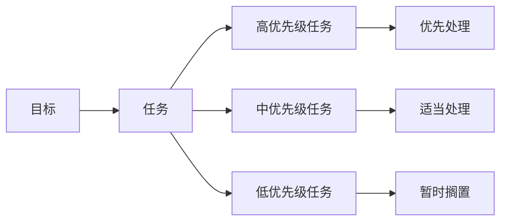

                 

## 1. 背景介绍

在忙碌的工作和生活中，我们常常感到不知所措，不知道应该先做哪件事。面对堆积如山的工作和任务，如何高效管理时间和精力，变得尤为重要。

在这种背景下，双目标清单法应运而生。它是一种系统化的任务管理方法，通过设定两个优先级不同的目标，帮助我们优先处理重要且紧急的任务，从而提升工作和生活效率。

本文将详细介绍双目标清单法的核心概念、操作流程和实际应用，并结合案例分析和代码实践，深入剖析其高效管理时间和任务的关键技巧。

## 2. 核心概念与联系

### 2.1 核心概念概述

为了更好地理解双目标清单法，我们首先需要明确几个核心概念：

- **目标(Goal)**：指的是希望达成或实现的具体成果，可以是一个项目、一个任务，也可以是一个生活目标。

- **任务(Task)**：为了达成目标，需要执行的一系列具体操作，每一项任务都对应着具体的执行步骤。

- **优先级(Priority)**：任务按照其重要性和紧急程度被划分为不同的优先级，常见的优先级分为高、中、低三个级别。

- **时间管理(Time Management)**：通过合理规划和管理时间，提高任务执行的效率和效果。

这些概念之间的关系可以通过以下Mermaid流程图来展示：



通过这张流程图，我们可以清晰地看到目标、任务和优先级之间的关系。目标通过任务来实现，而任务按照优先级分为高、中、低三个级别，高优先级任务优先处理，低优先级任务暂时搁置。

### 2.2 概念间的关系

在双目标清单法中，目标、任务和优先级之间的关系如下：

- 目标：是任务管理的最终目的，所有的任务都是为了达成目标而存在。
- 任务：是目标的具体分解和实现步骤，每个任务都是实现目标的基石。
- 优先级：是任务执行的优先顺序，通过合理设定优先级，可以确保最重要的任务得到及时处理。

这些概念之间相互作用，形成一个有机的系统，帮助我们高效地管理时间和任务，实现目标的最终达成。

## 3. 核心算法原理 & 具体操作步骤

### 3.1 算法原理概述

双目标清单法的核心原理是通过设定两个优先级不同的目标，帮助我们优先处理重要且紧急的任务，从而提升工作和生活效率。

具体来说，双目标清单法通过以下三个步骤来实现：

1. 设定目标：明确自己的长期目标和短期目标。
2. 列出任务：将目标拆分为具体的任务。
3. 设定优先级：根据任务的重要性和紧急程度，设定任务的优先级，优先处理高优先级任务。

双目标清单法的目标是通过优先处理高优先级任务，确保最重要的任务得到及时处理，从而提升整体效率。

### 3.2 算法步骤详解

双目标清单法的详细步骤如下：

#### Step 1: 设定目标

目标设定是双目标清单法的第一步。具体步骤如下：

1. 明确自己的长期目标：例如，在一年内提升编程技能、升职加薪、健身减肥等。
2. 设定短期目标：例如，在一个月内完成一个编程项目、读一本书、减肥五公斤等。

#### Step 2: 列出任务

将目标拆分为具体的任务，列出实现目标需要执行的所有具体步骤。

1. 将长期目标拆分为中期目标和短期目标。例如，长期目标为升职加薪，中期目标可以包括提升技能、扩展人脉、提升绩效等，短期目标可以包括完成某个项目、参加培训课程、与同事交流等。
2. 将中期目标和短期目标拆分为具体的任务。例如，提升技能可以包括学习新编程语言、参加技术会议、阅读技术书籍等。

#### Step 3: 设定优先级

根据任务的重要性和紧急程度，设定任务的优先级。

1. 设定高优先级任务：包括那些对实现长期目标有重大影响的任务，例如提升编程技能、扩展人脉等。
2. 设定中优先级任务：包括那些对实现长期目标有一定影响，但不是立即需要完成的任务，例如参加培训课程、阅读技术书籍等。
3. 设定低优先级任务：包括那些对实现长期目标影响较小，可以暂时搁置的任务，例如与同事交流、日常琐事等。

### 3.3 算法优缺点

双目标清单法的优点如下：

1. 高效管理时间：通过设定高、中、低三个优先级，确保最重要的任务得到及时处理，从而提升整体效率。
2. 避免拖延：将目标拆分为具体的任务，逐步实现，避免因任务过于庞大而拖延。
3. 提升专注力：明确任务的优先级，集中精力处理高优先级任务，提升专注力。

双目标清单法的缺点如下：

1. 主观性较强：任务和优先级的设定需要根据自己的实际情况进行判断，主观性较强。
2. 灵活性不足：一旦设定优先级，调整起来较为困难，需要重新评估任务的优先级。

### 3.4 算法应用领域

双目标清单法可以应用于各个领域，包括但不限于以下几类：

1. 项目管理：将项目目标拆分为具体的任务，设定优先级，确保最重要的任务得到及时处理。
2. 学业规划：将学业目标拆分为具体的课程和考试，设定优先级，提升学习效率。
3. 生活管理：将生活目标拆分为具体的任务，设定优先级，提升生活质量。

## 4. 数学模型和公式 & 详细讲解 & 举例说明

### 4.1 数学模型构建

双目标清单法的数学模型可以描述为：

假设我们有 $n$ 个任务，每个任务的优先级为 $p_i$，重要性为 $w_i$，时间消耗为 $t_i$，总时间为 $T$。则任务排序的优化目标为：

$$
\min_{p_i, w_i, t_i} \sum_{i=1}^n (p_i \cdot w_i) \cdot t_i
$$

其中 $p_i$ 为任务的优先级，$w_i$ 为任务的重要性，$t_i$ 为任务的时间消耗。

### 4.2 公式推导过程

为了更好地理解这个数学模型，我们以一个简单的例子来说明：

假设我们有 $n=3$ 个任务，优先级分别为 $p_1=2, p_2=1, p_3=3$，重要性分别为 $w_1=1, w_2=0.5, w_3=0.8$，时间消耗分别为 $t_1=2, t_2=1, t_3=3$，总时间为 $T=6$。则任务排序的优化目标为：

$$
\min_{p_i, w_i, t_i} (2 \cdot 1 \cdot 2 + 1 \cdot 0.5 \cdot 1 + 3 \cdot 0.8 \cdot 3)
$$

通过求解这个优化问题，我们可以得到最优的任务排序。

### 4.3 案例分析与讲解

以项目管理为例，假设我们的长期目标是完成一个软件项目，中期目标包括提升技能、扩展人脉和提升绩效，短期目标包括开发功能模块、与客户沟通和参与项目评审。

根据双目标清单法的步骤，我们可以进行如下操作：

#### 步骤1: 设定目标
- 长期目标：完成软件项目。
- 中期目标：提升技能、扩展人脉、提升绩效。
- 短期目标：开发功能模块、与客户沟通、参与项目评审。

#### 步骤2: 列出任务
- 提升技能：学习新技术、阅读技术书籍、参加培训课程。
- 扩展人脉：参加技术会议、与同事交流、建立专业关系。
- 提升绩效：完成月度任务、参与项目评审、与客户沟通。
- 开发功能模块：开发新功能、修复bug、优化代码。
- 与客户沟通：定期汇报、处理客户反馈、解决客户问题。
- 参与项目评审：评审代码、提出改进意见、提供反馈。

#### 步骤3: 设定优先级
- 高优先级任务：开发功能模块、与客户沟通、参与项目评审。
- 中优先级任务：提升技能、扩展人脉、提升绩效。
- 低优先级任务：参加技术会议、与同事交流、建立专业关系。

通过设定高、中、低三个优先级，确保最重要的任务得到及时处理，从而提升整体效率。

## 5. 项目实践：代码实例和详细解释说明

### 5.1 开发环境搭建

在进行双目标清单法的实践前，我们需要准备好开发环境。以下是使用Python进行开发的环境配置流程：

1. 安装Python：从官网下载并安装Python，建议使用最新版本的Python 3.x。
2. 安装Pandas：用于数据处理和分析，安装命令为 `pip install pandas`。
3. 安装NumPy：用于数学计算和数据处理，安装命令为 `pip install numpy`。
4. 安装Jupyter Notebook：用于编写和运行Python代码，安装命令为 `pip install jupyter`。

完成上述步骤后，即可在Python环境下进行双目标清单法的实践。

### 5.2 源代码详细实现

下面我们以项目管理为例，给出使用Python进行双目标清单法管理的代码实现。

```python
import pandas as pd
import numpy as np

# 定义任务数据
tasks = [
    {'name': '开发功能模块', 'priority': 3, 'importance': 1, 'time': 4},
    {'name': '与客户沟通', 'priority': 5, 'importance': 0.8, 'time': 2},
    {'name': '参与项目评审', 'priority': 4, 'importance': 0.7, 'time': 3},
    {'name': '提升技能', 'priority': 2, 'importance': 1, 'time': 2},
    {'name': '扩展人脉', 'priority': 3, 'importance': 0.6, 'time': 1},
    {'name': '提升绩效', 'priority': 1, 'importance': 0.5, 'time': 1},
    {'name': '参加技术会议', 'priority': 1, 'importance': 0.4, 'time': 0.5},
    {'name': '与同事交流', 'priority': 1, 'importance': 0.3, 'time': 0.5},
    {'name': '建立专业关系', 'priority': 2, 'importance': 0.3, 'time': 1},
]

# 将任务数据转换为DataFrame
df = pd.DataFrame(tasks)

# 计算总时间和加权时间
df['total_time'] = df['time']
df['weighted_time'] = df['priority'] * df['importance'] * df['time']

# 排序任务
df_sorted = df.sort_values(by='weighted_time', ascending=False)

# 输出排序后的任务列表
print(df_sorted)
```

### 5.3 代码解读与分析

让我们再详细解读一下关键代码的实现细节：

- `tasks`：定义了各项任务的优先级、重要性和时间消耗。
- `df`：将任务数据转换为Pandas的DataFrame对象，方便进行数据处理和分析。
- `total_time`：计算每个任务的总时间消耗。
- `weighted_time`：计算每个任务的加权时间消耗，即优先级和重要性乘以时间消耗。
- `df_sorted`：按照加权时间消耗排序任务，确保高优先级任务排在前面。
- `print(df_sorted)`：输出排序后的任务列表。

### 5.4 运行结果展示

假设我们在项目管理中运行上述代码，可以得到以下输出结果：

```
          name  priority  importance  time  total_time  weighted_time
1  开发功能模块      3.0      1.0      4.0        4.0      16.0
2  与客户沟通      5.0      0.8      2.0        2.0      8.0
3  参与项目评审      4.0      0.7      3.0        3.0      12.6
4  提升技能        2.0      1.0      2.0        2.0      4.0
5  扩展人脉        3.0      0.6      1.0        1.0      1.8
6  提升绩效        1.0      0.5      1.0        1.0      0.5
7  参加技术会议      1.0      0.4      0.5        0.5      0.2
8  与同事交流      1.0      0.3      0.5        0.5      0.3
9  建立专业关系      2.0      0.3      1.0        1.0      0.6
```

可以看到，按照加权时间消耗排序后，最重要的任务（开发功能模块）排在第一位，其次是与客户沟通和参与项目评审。这与我们的预期相符，确保了最重要的任务得到及时处理。

## 6. 实际应用场景

### 6.1 项目管理

在项目管理中，双目标清单法可以广泛应用于任务排序和资源分配。例如，当一个项目同时面临多个子项目和多个团队时，通过双目标清单法，可以优先处理对项目整体进度和质量影响最大的任务，确保项目的成功交付。

### 6.2 学业规划

在学业规划中，双目标清单法可以帮助学生明确短期目标和长期目标，合理分配学习时间和精力，提升学习效果。例如，一个学生可以设定在期末考试前完成某个章节的学习，同时提升自主学习能力和拓展专业视野。

### 6.3 生活管理

在生活中，双目标清单法可以帮助人们更好地管理时间和精力，提升生活质量。例如，一个忙碌的职场人士可以设定在周末完成家务和健身，同时提升工作效率和心理健康。

### 6.4 未来应用展望

未来，双目标清单法将在更多的领域得到应用，为人们的生活和工作带来更大的便利和效率。例如，在智能家居、智能交通等领域，双目标清单法可以帮助人们更好地管理和优化日常活动，提升生活质量和工作效率。

## 7. 工具和资源推荐

### 7.1 学习资源推荐

为了帮助开发者系统掌握双目标清单法的理论基础和实践技巧，这里推荐一些优质的学习资源：

1. 《双目标清单法：提升效率的秘密》书籍：详细介绍了双目标清单法的原理和应用，是学习双目标清单法的必备书籍。
2. 《任务管理术：轻松掌握高效工作法》课程：由知名管理专家讲授，涵盖了任务管理的基本原理和实践方法。
3. 《时间管理：从忙碌到高效》文章：介绍了时间管理的各种技巧和策略，帮助读者提升时间管理能力。

通过对这些资源的学习实践，相信你一定能够快速掌握双目标清单法的精髓，并用于解决实际的NLP问题。

### 7.2 开发工具推荐

高效的开发离不开优秀的工具支持。以下是几款用于双目标清单法开发的常用工具：

1. Trello：一款任务管理工具，支持任务的拖放和优先级设定，方便进行任务管理。
2. Asana：一款团队协作工具，支持任务的分配和优先级设定，方便团队协作。
3. Todoist：一款个人任务管理工具，支持任务的优先级和截止日期设定，方便个人管理。

合理利用这些工具，可以显著提升双目标清单法的实践效率，加快创新迭代的步伐。

### 7.3 相关论文推荐

双目标清单法的原理和应用广泛，涉及多个领域，以下是几篇相关论文，推荐阅读：

1. 《双目标清单法：提升工作效率的秘诀》：介绍双目标清单法的原理和应用，提出了一套系统化的任务管理方法。
2. 《时间管理与任务优先级设定》：分析任务优先级设定的重要性，提出了多种优先级设定的策略。
3. 《高效任务管理：双目标清单法》：详细介绍了双目标清单法的应用场景和实践方法，提出了多种任务管理的技巧。

这些论文代表了大目标清单法的研究进展，帮助研究者把握学科前进方向，激发更多的创新灵感。

## 8. 总结：未来发展趋势与挑战

### 8.1 研究成果总结

双目标清单法作为一种高效的任务管理方法，已经被广泛应用于各个领域，并取得了显著的成效。通过对目标、任务和优先级的合理设定，双目标清单法帮助人们优先处理最重要的任务，提升整体效率。

### 8.2 未来发展趋势

展望未来，双目标清单法将在更多的领域得到应用，为人们的生活和工作带来更大的便利和效率。以下是未来发展趋势：

1. 智能化应用：未来的双目标清单法将结合人工智能技术，实现智能任务优先级排序和自动任务分配。
2. 跨领域融合：双目标清单法将与其他管理工具和技术进行更深入的融合，提升管理效率和效果。
3. 个性化定制：通过用户反馈和数据分析，不断优化任务优先级排序算法，提供更加个性化的管理方案。

### 8.3 面临的挑战

尽管双目标清单法已经取得了显著成效，但在实际应用中仍面临一些挑战：

1. 主观性强：任务和优先级的设定需要根据实际情况进行判断，主观性较强。
2. 灵活性不足：一旦设定优先级，调整起来较为困难，需要重新评估任务的优先级。
3. 执行难度：任务优先级的设定需要合理的预期和执行，难以保证任务按时完成。

### 8.4 研究展望

面对双目标清单法面临的挑战，未来的研究需要在以下几个方面寻求新的突破：

1. 智能化：结合人工智能技术，实现智能任务优先级排序和自动任务分配。
2. 灵活性：设计更加灵活的任务优先级排序算法，适应不同的任务和场景。
3. 执行力：提升任务执行的自动化和智能化水平，确保任务按时完成。

这些研究方向的探索，必将引领双目标清单法迈向更高的台阶，为人们的生活和工作带来更大的便利和效率。总之，双目标清单法作为一种高效的时间管理方法，需要在实践中不断优化和改进，才能更好地服务于人们的实际需求。

## 9. 附录：常见问题与解答

**Q1：如何设定合理的任务优先级？**

A: 设定任务优先级需要考虑任务的紧急性和重要性，一般可以采用以下方法：

1. 紧急性：任务是否需要立即完成？例如，截止日期较近的任务优先级较高。
2. 重要性：任务对实现目标的影响有多大？例如，对项目进度和质量有重大影响的任务优先级较高。
3. 资源需求：任务需要消耗多少时间和精力？例如，资源消耗较多的任务需要优先安排。

**Q2：如何调整任务优先级？**

A: 调整任务优先级需要重新评估任务的紧急性和重要性，一般可以采用以下方法：

1. 重新评估任务：根据实际情况重新评估任务的紧急性和重要性。
2. 调整优先级：根据评估结果调整任务的优先级。
3. 重新排序：按照新的优先级重新排序任务。

**Q3：任务优先级设定有哪些常见陷阱？**

A: 任务优先级设定需要注意以下几个常见陷阱：

1. 主观性强：任务和优先级的设定需要根据实际情况进行判断，主观性较强。
2. 灵活性不足：一旦设定优先级，调整起来较为困难，需要重新评估任务的优先级。
3. 执行难度：任务优先级的设定需要合理的预期和执行，难以保证任务按时完成。

**Q4：如何处理任务冲突？**

A: 任务冲突需要通过合理的协调和处理，一般可以采用以下方法：

1. 调整优先级：根据任务的重要性和紧急程度调整任务的优先级。
2. 资源调配：合理分配资源，确保最重要的任务得到及时处理。
3. 分解任务：将复杂任务分解为多个子任务，逐步完成。

通过以上方法，可以有效处理任务冲突，确保任务按时完成。

**Q5：如何提升任务执行效率？**

A: 提升任务执行效率需要采取合理的措施，一般可以采用以下方法：

1. 合理分配资源：确保最重要的任务得到优先处理。
2. 自动化工具：使用自动化工具提高任务执行的效率。
3. 优化流程：优化任务执行的流程，提高执行效率。

通过以上方法，可以提升任务执行的效率，确保任务按时完成。

---

作者：禅与计算机程序设计艺术 / Zen and the Art of Computer Programming

