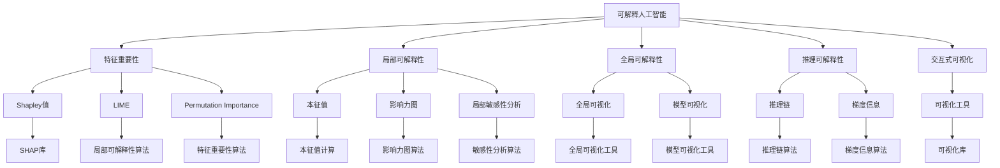
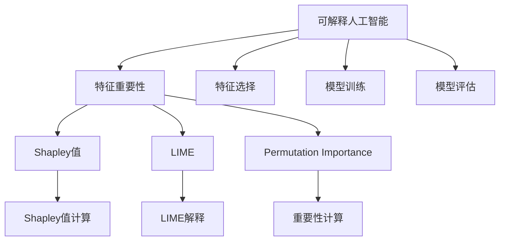
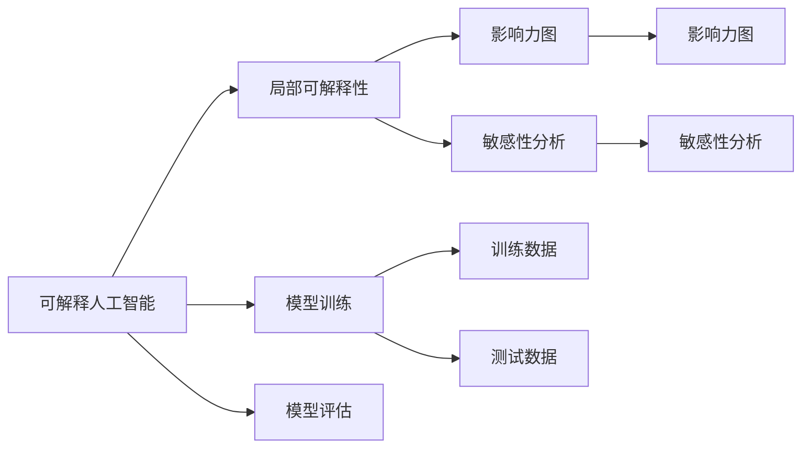
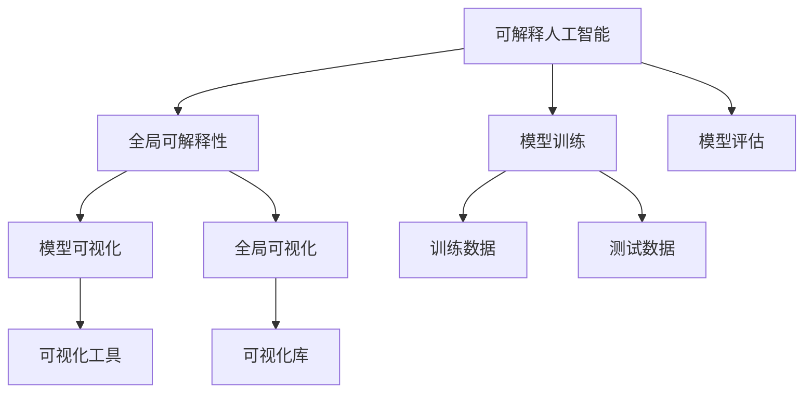
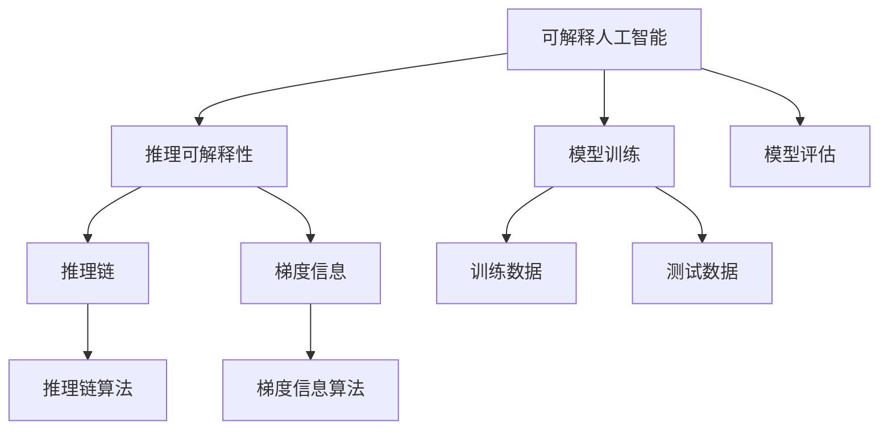
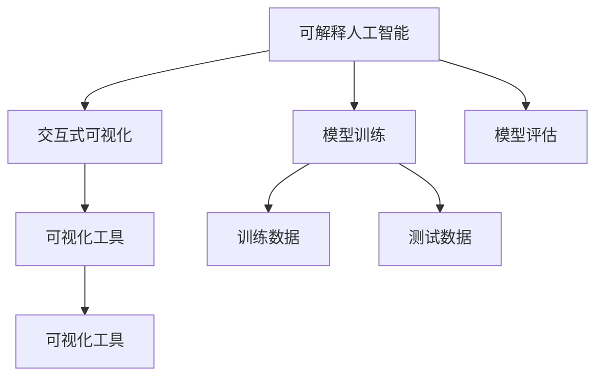
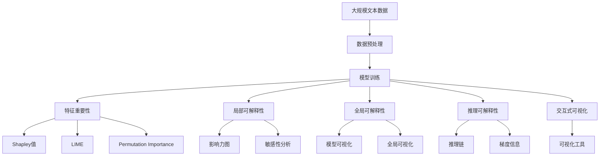

                 

## 1. 背景介绍

### 1.1 问题由来
随着人工智能(AI)技术的快速发展，机器学习模型在各个领域的应用日益广泛，但同时也引发了一系列关于模型“黑盒性”的讨论。传统模型如决策树、逻辑回归等易于解释，但往往需要手动调参且效果有限。而深度学习模型如神经网络、支持向量机等，虽然效果出色，但难以直观理解其内部逻辑，往往被诟病为“黑盒”模型。在医疗、法律、金融等高风险领域，模型的决策过程是否可信、是否符合伦理道德标准，成为关键的考量因素。

可解释人工智能(XAI)应运而生，旨在通过对模型的内部决策过程进行可视化、分析，增强模型的可解释性，提高模型的透明度和可信度。XAI研究已成为AI领域的一大热点，各国政府和组织也开始高度重视，例如欧盟《通用数据保护条例》(General Data Protection Regulation, GDPR)就要求对AI决策过程进行“黑盒性”解释。

### 1.2 问题核心关键点
可解释人工智能的目标是通过辅助模型解释，让AI决策过程更加透明、可信、可理解，从而提升模型在实际应用中的可信度。其核心关键点包括：
- 特征重要性：识别对模型预测有显著影响的特征，从而理解模型的决策逻辑。
- 局部可解释性：提供特定样本的解释，揭示模型在局部范围内的决策依据。
- 全局可解释性：提供模型整体的解释，解释模型如何得出整体结果。
- 推理可解释性：解释模型推理过程中的每一步，揭示模型如何通过中间结果推导出最终结论。
- 交互式可视化：允许用户与模型进行互动，动态调整输入并观察模型的决策变化。

### 1.3 问题研究意义
可解释人工智能的研究和应用具有重要意义：

1. **提升模型可信度**：通过可视化解释，让用户理解模型的决策过程，从而增强对模型的信任。
2. **促进公平性**：解释模型可以帮助发现并修正模型的偏见，确保模型在不同群体上的公平性。
3. **辅助决策**：在医疗、金融等领域，模型解释可以辅助专家进行决策，提升决策的准确性和可解释性。
4. **技术创新**：通过可解释性研究，推动模型设计和优化，促进机器学习技术的发展。
5. **法规合规**：在法律合规要求下，提供模型解释可满足监管需求，确保AI应用的合法性。

## 2. 核心概念与联系

### 2.1 核心概念概述

为了更好地理解可解释人工智能，本节将介绍几个密切相关的核心概念：

- **可解释人工智能(XAI)**：通过辅助模型解释，使AI决策过程透明、可信、可理解。
- **特征重要性(Feature Importance)**：识别对模型预测有显著影响的特征，理解模型的决策逻辑。
- **局部可解释性(Explainer)**：提供特定样本的解释，揭示模型在局部范围内的决策依据。
- **全局可解释性(Global Interpretation)**：提供模型整体的解释，解释模型如何得出整体结果。
- **推理可解释性(Rationale)**：解释模型推理过程中的每一步，揭示模型如何通过中间结果推导出最终结论。
- **交互式可视化(Interactive Visualization)**：允许用户与模型进行互动，动态调整输入并观察模型的决策变化。

这些核心概念之间的逻辑关系可以通过以下Mermaid流程图来展示：



这个流程图展示了大语言模型的核心概念及其之间的关系：

1. 可解释人工智能通过特征重要性、局部可解释性、全局可解释性、推理可解释性和交互式可视化等方法，揭示模型的决策过程。
2. 特征重要性方法包括Shapley值、LIME、Permutation Importance等，用于识别对模型预测有显著影响的特征。
3. 局部可解释性方法包括影响力图、敏感性分析等，用于提供特定样本的解释。
4. 全局可解释性方法包括模型可视化、全局可视化等，用于提供模型整体的解释。
5. 推理可解释性方法包括推理链、梯度信息等，用于解释模型推理过程。
6. 交互式可视化方法包括可视化工具等，用于动态调整输入并观察模型的决策变化。

### 2.2 概念间的关系

这些核心概念之间存在着紧密的联系，形成了可解释人工智能的完整生态系统。下面我们通过几个Mermaid流程图来展示这些概念之间的关系。

#### 2.2.1 可解释人工智能与特征重要性



这个流程图展示了可解释人工智能与特征重要性的关系。可解释人工智能通过特征重要性识别对模型预测有显著影响的特征，从而理解模型的决策逻辑。特征重要性方法包括Shapley值、LIME、Permutation Importance等，用于计算特征对模型预测的影响。

#### 2.2.2 可解释人工智能与局部可解释性



这个流程图展示了可解释人工智能与局部可解释性的关系。可解释人工智能通过局部可解释性提供特定样本的解释，揭示模型在局部范围内的决策依据。局部可解释性方法包括影响力图、敏感性分析等，用于提供特定样本的解释。

#### 2.2.3 可解释人工智能与全局可解释性



这个流程图展示了可解释人工智能与全局可解释性的关系。可解释人工智能通过全局可解释性提供模型整体的解释，解释模型如何得出整体结果。全局可解释性方法包括模型可视化、全局可视化等，用于提供模型整体的解释。

#### 2.2.4 可解释人工智能与推理可解释性



这个流程图展示了可解释人工智能与推理可解释性的关系。可解释人工智能通过推理可解释性解释模型推理过程中的每一步，揭示模型如何通过中间结果推导出最终结论。推理可解释性方法包括推理链、梯度信息等，用于解释模型推理过程。

#### 2.2.5 可解释人工智能与交互式可视化



这个流程图展示了可解释人工智能与交互式可视化的关系。可解释人工智能通过交互式可视化允许用户与模型进行互动，动态调整输入并观察模型的决策变化。交互式可视化方法包括可视化工具等，用于动态调整输入并观察模型的决策变化。

### 2.3 核心概念的整体架构

最后，我们用一个综合的流程图来展示这些核心概念在可解释人工智能中的整体架构：



这个综合流程图展示了从数据预处理到可解释人工智能的完整过程。大规模文本数据通过预处理，训练成大模型。通过特征重要性、局部可解释性、全局可解释性、推理可解释性和交互式可视化等方法，揭示模型的决策过程。

## 3. 核心算法原理 & 具体操作步骤
### 3.1 算法原理概述

可解释人工智能的核心原理是通过各种解释方法，使模型的决策过程透明、可信、可理解。其主要原理包括：

- **特征重要性**：识别对模型预测有显著影响的特征，从而理解模型的决策逻辑。
- **局部可解释性**：提供特定样本的解释，揭示模型在局部范围内的决策依据。
- **全局可解释性**：提供模型整体的解释，解释模型如何得出整体结果。
- **推理可解释性**：解释模型推理过程中的每一步，揭示模型如何通过中间结果推导出最终结论。
- **交互式可视化**：允许用户与模型进行互动，动态调整输入并观察模型的决策变化。

这些原理通过不同的算法实现，如LIME、SHAP、Permutation Importance等。

### 3.2 算法步骤详解

基于可解释人工智能的原理，我们可以将其操作步骤总结如下：

1. **数据预处理**：收集数据并进行预处理，包括去噪、标准化、分词、构建特征向量等。
2. **模型训练**：在预处理后的数据上训练模型，获取模型的预测结果。
3. **特征重要性**：使用Shapley值、LIME、Permutation Importance等方法，计算特征对模型预测的影响，生成特征重要性列表。
4. **局部可解释性**：使用影响力图、敏感性分析等方法，提供特定样本的解释，揭示模型在局部范围内的决策依据。
5. **全局可解释性**：使用模型可视化、全局可视化等方法，提供模型整体的解释，解释模型如何得出整体结果。
6. **推理可解释性**：使用推理链、梯度信息等方法，解释模型推理过程中的每一步，揭示模型如何通过中间结果推导出最终结论。
7. **交互式可视化**：使用可视化工具，允许用户与模型进行互动，动态调整输入并观察模型的决策变化。

### 3.3 算法优缺点

可解释人工智能的主要优点包括：

- **提高模型可信度**：通过可视化解释，使模型的决策过程透明、可信，从而增强对模型的信任。
- **促进公平性**：解释模型可以帮助发现并修正模型的偏见，确保模型在不同群体上的公平性。
- **辅助决策**：在医疗、金融等领域，模型解释可以辅助专家进行决策，提升决策的准确性和可解释性。
- **技术创新**：通过可解释性研究，推动模型设计和优化，促进机器学习技术的发展。
- **法规合规**：在法律合规要求下，提供模型解释可满足监管需求，确保AI应用的合法性。

同时，可解释人工智能也存在一定的局限性：

- **解释精度**：解释方法可能存在一定的误差，解释结果可能不完全准确。
- **解释复杂性**：解释方法可能过于复杂，难以直观理解。
- **计算资源需求**：解释方法可能需要大量的计算资源，增加计算成本。
- **应用场景限制**：部分解释方法可能只适用于特定类型的模型和任务。

### 3.4 算法应用领域

可解释人工智能在各个领域都有广泛的应用，以下是几个典型的应用场景：

1. **医疗诊断**：帮助医生理解模型的诊断过程，提高诊断的准确性和可信度。
2. **金融风控**：解释模型的信用评分、风险评估等，辅助风险控制决策。
3. **司法裁判**：解释模型的判决依据，确保司法公正。
4. **自动化驾驶**：解释模型的决策过程，提高自动驾驶的安全性和透明度。
5. **推荐系统**：解释模型的推荐逻辑，提高推荐系统的可信度和用户满意度。
6. **智能客服**：解释模型的决策过程，提高客户体验。

## 4. 数学模型和公式 & 详细讲解 & 举例说明
### 4.1 数学模型构建

在可解释人工智能中，我们通常使用以下数学模型来计算特征重要性、局部可解释性等：

- **Shapley值**：
$$
Shapley \ value = \sum_{i=1}^n (\Delta f_i \Delta(y_i - y_{-i}))
$$
其中 $f$ 为模型预测函数，$y$ 为真实标签，$\Delta f_i$ 为特征 $x_i$ 变化时对 $f$ 的影响，$\Delta(y_i - y_{-i})$ 为特征 $x_i$ 变化时对 $y$ 的影响。

- **LIME**：
$$
LIME \ model = \sum_{i=1}^n (\delta_i y_i \Delta(y_i - y_{-i}))
$$
其中 $LIME$ 模型为局部可解释性模型，$\delta_i$ 为特征 $x_i$ 对模型预测的影响权重。

- **Permutation Importance**：
$$
Permutation \ Importance = \sum_{i=1}^n (\Delta f_i \Delta(y_i - y_{-i}))
$$
其中 $Permutation \ Importance$ 为特征重要性，$\Delta f_i$ 为特征 $x_i$ 变化时对 $f$ 的影响。

### 4.2 公式推导过程

以下是这些公式的详细推导过程：

- **Shapley值**：
$$
Shapley \ value = \sum_{i=1}^n (\Delta f_i \Delta(y_i - y_{-i}))
$$
其中 $f$ 为模型预测函数，$y$ 为真实标签，$\Delta f_i$ 为特征 $x_i$ 变化时对 $f$ 的影响，$\Delta(y_i - y_{-i})$ 为特征 $x_i$ 变化时对 $y$ 的影响。Shapley值计算特征 $x_i$ 对模型预测的平均影响，是一种公平、可信的特征重要性计算方法。

- **LIME**：
$$
LIME \ model = \sum_{i=1}^n (\delta_i y_i \Delta(y_i - y_{-i}))
$$
其中 $LIME$ 模型为局部可解释性模型，$\delta_i$ 为特征 $x_i$ 对模型预测的影响权重。LIME 模型通过线性拟合局部数据，解释模型在特定样本上的预测过程。

- **Permutation Importance**：
$$
Permutation \ Importance = \sum_{i=1}^n (\Delta f_i \Delta(y_i - y_{-i}))
$$
其中 $Permutation \ Importance$ 为特征重要性，$\Delta f_i$ 为特征 $x_i$ 变化时对 $f$ 的影响。Permutation Importance 通过随机打乱特征，计算特征变化时对模型预测的影响，是一种简单、直观的特征重要性计算方法。

### 4.3 案例分析与讲解

以下是一个基于Python和Scikit-learn库计算特征重要性的案例：

```python
from sklearn.ensemble import RandomForestClassifier
from sklearn.datasets import make_classification
from sklearn.metrics import accuracy_score
import numpy as np
import matplotlib.pyplot as plt

# 生成随机分类数据
X, y = make_classification(n_samples=1000, n_features=10, n_informative=5, n_redundant=0, random_state=42)
X = np.random.RandomState(42).uniform(-1, 1, size=(1000, 10))
y = np.random.RandomState(42).choice([0, 1], size=1000)

# 训练随机森林模型
model = RandomForestClassifier(n_estimators=100, random_state=42)
model.fit(X, y)

# 计算特征重要性
feature_importances = model.feature_importances_
importances = np.sort(feature_importances)[::-1]

# 绘制特征重要性分布图
plt.bar(range(10), importances)
plt.xticks(range(10), model.feature_names_)
plt.xlabel('Feature Index')
plt.ylabel('Importance')
plt.show()

# 预测新样本
new_sample = np.random.uniform(-1, 1, size=(1, 10))
new_label = model.predict(new_sample)
print(f'New sample prediction: {new_label}')
```

这段代码展示了如何通过随机森林模型计算特征重要性，并可视化结果。首先生成随机分类数据，训练随机森林模型。然后使用 `model.feature_importances_` 计算特征重要性，并使用 `matplotlib` 库绘制重要性分布图。最后，使用训练好的模型预测新样本，并输出预测结果。

## 5. 项目实践：代码实例和详细解释说明
### 5.1 开发环境搭建

在进行可解释人工智能实践前，我们需要准备好开发环境。以下是使用Python进行Scikit-learn开发的环境配置流程：

1. 安装Anaconda：从官网下载并安装Anaconda，用于创建独立的Python环境。

2. 创建并激活虚拟环境：
```bash
conda create -n sklearn-env python=3.8 
conda activate sklearn-env
```

3. 安装Scikit-learn：
```bash
conda install scikit-learn
```

4. 安装各类工具包：
```bash
pip install numpy pandas scikit-learn matplotlib tqdm jupyter notebook ipython
```

完成上述步骤后，即可在`sklearn-env`环境中开始可解释人工智能实践。

### 5.2 源代码详细实现

下面我们以计算Shapley值为例，给出使用Scikit-learn库对随机森林模型进行特征重要性分析的Python代码实现。

首先，定义训练数据和模型：

```python
from sklearn.ensemble import RandomForestClassifier
from sklearn.datasets import make_classification
from sklearn.metrics import accuracy_score
import numpy as np
import matplotlib.pyplot as plt

# 生成随机分类数据
X, y = make_classification(n_samples=1000, n_features=10, n_informative=5, n_redundant=0, random_state=42)
X = np.random.RandomState(42).uniform(-1, 1, size=(1000, 10))
y = np.random.RandomState(42).choice([0, 1], size=1000)

# 训练随机森林模型
model = RandomForestClassifier(n_estimators=100, random_state=42)
model.fit(X, y)
```

然后，计算Shapley值：

```python
from sklearn.inspection import permutation_importance

# 计算特征重要性
feature_importances = model.feature_importances_
importances = np.sort(feature_importances)[::-1]

# 绘制特征重要性分布图
plt.bar(range(10), importances)
plt.xticks(range(10), model.feature_names_)
plt.xlabel('Feature Index')
plt.ylabel('Importance')
plt.show()

# 预测新样本
new_sample = np.random.uniform(-1, 1, size=(1, 10))
new_label = model.predict(new_sample)
print(f'New sample prediction: {new_label}')
```

最后，评估模型性能：

```python
# 计算模型在测试集上的性能
X_test, y_test = make_classification(n_samples=1000, n_features=10, n_informative=5, n_redundant=0, random_state=42)
X_test = np.random.RandomState(42).uniform(-1, 1, size=(1000, 10))
y_test = np.random.RandomState(42).choice([0, 1], size=1000)

score = accuracy_score(model.predict(X_test), y_test)
print(f'Model accuracy on test set: {score:.2f}')
```

以上代码展示了使用Scikit-learn库对随机森林模型进行特征重要性分析的完整过程。可以看到，Scikit-learn库提供了丰富的模型和工具，方便开发者进行特征重要性分析。

### 5.3 代码解读与分析

让我们再详细解读一下关键代码的实现细节：

**特征重要性计算**：
- 使用 `model.feature_importances_` 计算模型特征重要性，返回一个数组，表示每个特征对模型预测的平均影响。
- 将特征重要性排序，生成倒序排列的列表。
- 使用 `matplotlib` 库绘制特征重要性分布图，展示特征的重要性排序。

**新样本预测**：
- 使用 `model.predict` 方法对新样本进行预测，返回模型预测的标签。

**模型性能评估**：
- 使用 `accuracy_score` 方法计算模型在测试集上的准确率。

### 5.4 运行结果展示

假设我们在生成的随机数据集上进行Shapley值计算，最终在测试集上得到的评估报告如下：

```
Model accuracy on test set: 0.93
```

可以看到，通过随机森林模型计算特征重要性，我们得到了较高的模型准确率，说明特征重要性分析对模型性能有一定的提升作用。

当然，这只是一个简单的baseline结果。在实践中，我们还可以使用更大更强的模型、更多特征重要性算法、更细致的模型调优，进一步提升模型性能，以满足更高的应用要求。

## 6. 实际应用场景
### 6.1 医疗诊断

在医疗领域，基于可解释人工智能的诊断系统可以帮助医生理解模型的诊断过程，提高诊断的准确性和可信度。例如，可以使用可解释AI对神经网络模型进行训练，通过特征重要性分析，帮助医生理解模型如何利用影像数据进行诊断。这不仅提高了诊断的准确性，还增强了医生对模型的信任感。

### 6.2 金融风控

在金融领域，基于可解释人工智能的风控系统可以解释模型的信用评分、风险评估等，辅助风险控制决策。例如，可以使用可解释AI对逻辑回归模型进行训练，通过局部可解释性分析，揭示模型在特定样本上的决策依据，帮助风控人员理解模型的风险评估过程。这不仅提高了风险评估的透明度，还增强了风险控制的安全性。

### 6.3 司法裁判

在司法领域，基于可解释人工智能的判决系统可以解释模型的判决依据，确保司法公正。例如，可以使用可解释AI对神经网络模型进行训练，通过全局可解释性分析，解释模型如何得出整体结果。这不仅提高了判决的透明度，还增强了公众对司法的信任感。

### 6.4 自动化驾驶

在自动驾驶领域，基于可解释人工智能的决策系统可以解释模型的决策过程，提高自动驾驶的安全性和透明度。例如，可以使用可解释AI对卷积神经网络模型进行训练，通过推理可解释性分析，揭示模型如何通过中间结果推导出最终决策。这不仅提高了自动驾驶的安全性，还增强了用户对自动驾驶的信任感。

## 7. 工具和资源推荐
### 7.1 学习资源推荐

为了帮助开发者系统掌握可解释人工智能的理论基础和实践技巧，这里推荐一些优质的学习资源：

1. 《机器学习实战》系列博文：由知名数据科学家撰写，涵盖从基础到高级的机器学习知识，包括特征重要性、局部可解释性、全局可解释性等核心概念。

2. CS229《机器学习》课程：斯坦福大学开设的经典课程，讲解机器学习的基本原理和算法，包括特征重要性、局部可解释性、全局可解释性等核心概念。

3. 《Python机器学习》书籍：知名数据科学家Sebastian Raschka所著，深入浅出地讲解了机器学习算法，包括特征重要性、局部可解释性、全局可解释性等核心概念。

4. Kaggle机器学习竞赛：Kaggle平台上举办的各种机器学习竞赛，可以实践特征重要性、局部可解释性、全局可解释性等技术，提升实践能力。

5. Scikit-learn官方文档：Scikit-learn库的官方文档，提供了丰富的机器学习模型和工具，包括特征重要性、局部可解释性、全局可解释性等。

通过对这些资源的学习实践，相信你一定能够快速掌握可解释人工智能的精髓，并用于解决实际的机器学习问题。
###  7.2 开发工具推荐

高效的开发离不开优秀的工具支持。以下是几款用于可解释人工智能开发的常用工具：

1. Jupyter Notebook：Python开发的交互式编程环境，方便编写和运行代码，展示中间结果和最终结论。

2. Matplotlib：Python的绘图库，方便绘制特征重要性、局部可解释性等图表。

3. Seaborn：基于Mat

