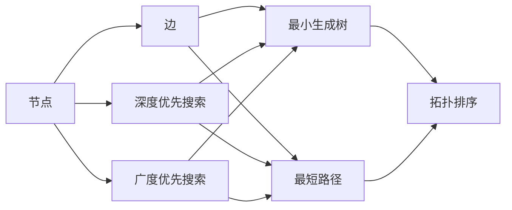

                 

# 图算法 原理与代码实例讲解

> 关键词：图算法,深度优先搜索,广度优先搜索,最小生成树,最短路径,拓扑排序,有向无环图

## 1. 背景介绍

图算法是计算机科学中的经典问题，涵盖了从简单的搜索到复杂的流、匹配和网络设计等众多领域。图算法在网络分析、社交网络、物流规划、智能推荐等多个应用领域都具有重要的实际意义。

图由节点（Vertex）和边（Edge）组成，表示实体之间的关系。在NLP中，我们可以将文本看作由单词构成的图，单词为节点，相邻的单词表示语法关系，如相邻的单词可以构成短语或句子的成分。

本文将从图算法的基本概念入手，逐步深入探讨深度优先搜索、广度优先搜索、最小生成树、最短路径、拓扑排序和有向无环图等核心图算法，并通过具体的代码实例，帮助读者理解它们的原理和应用。

## 2. 核心概念与联系

### 2.1 核心概念概述

以下是图算法中的几个关键概念，这些概念在算法原理和实现中扮演了重要角色：

- 深度优先搜索（Depth-First Search, DFS）：从起点开始，尽可能深地搜索每个分支，直到无法继续为止。
- 广度优先搜索（Breadth-First Search, BFS）：逐层向外搜索，先搜索离起点最近的节点，然后依次向外扩展。
- 最小生成树（Minimum Spanning Tree, MST）：无向图的一棵生成树，使得所有边的权重之和最小。
- 最短路径（Shortest Path）：图中两个节点之间的最短路径，可以用Dijkstra算法或Bellman-Ford算法求解。
- 拓扑排序（Topological Sorting）：在有向无环图中，按照节点依赖关系进行排序。
- 有向无环图（Directed Acyclic Graph, DAG）：有向图中没有环，常用作表示任务、事件、状态等具有依赖关系的场景。

这些概念间的关系可以用以下Mermaid流程图来展示：



这个流程图展示了各个核心概念的相互关系和作用。

### 2.2 概念间的关系

- **深度优先搜索**与**广度优先搜索**：都是用来搜索图的节点，但搜索方式不同。DFS沿着一条路径尽可能深地搜索，而BFS逐层搜索。
- **最小生成树**与**最短路径**：都可以用来构建节点间的连接，但最小生成树关注边权重最小，而最短路径关注路径长度最短。
- **拓扑排序**与**有向无环图**：拓扑排序是一种特殊的排序方式，在有向无环图中应用非常广泛。
- **深度优先搜索**、**广度优先搜索**、**最小生成树**、**最短路径**、**拓扑排序**等算法，都可以应用于**有向无环图**的构建和优化。

## 3. 核心算法原理 & 具体操作步骤

### 3.1 算法原理概述

图算法主要包括以下几个核心算法：

- **深度优先搜索（DFS）**：从起点开始，访问所有相邻节点，并递归遍历每个节点的邻居节点。
- **广度优先搜索（BFS）**：从起点开始，逐层向外扩展，每层节点都按照距离起点由近及远的顺序访问。
- **最小生成树（MST）**：通过贪心策略构建树，使得树中所有边的权重之和最小。
- **最短路径（SP）**：计算图中两个节点之间的最短路径。
- **拓扑排序（TS）**：在有向无环图中，根据节点依赖关系排序，使得后继节点排在先驱节点之后。
- **有向无环图（DAG）**：通过拓扑排序和前驱后继关系，构建有向无环图。

这些算法通常基于图的数据结构实现，使用邻接表或邻接矩阵来存储图信息，并使用队列、栈等数据结构进行搜索和遍历。

### 3.2 算法步骤详解

#### 3.2.1 深度优先搜索

**步骤1：** 初始化，从起点开始遍历。

**步骤2：** 访问起点，并将其标记为已访问。

**步骤3：** 递归遍历起点的所有邻居节点，重复步骤2和3。

**步骤4：** 直到遍历完所有节点。

```python
def dfs(start, graph):
    visited = set()
    stack = [start]
    while stack:
        vertex = stack.pop()
        if vertex not in visited:
            visited.add(vertex)
            neighbors = graph[vertex]
            for neighbor in neighbors:
                stack.append(neighbor)
    return visited
```

#### 3.2.2 广度优先搜索

**步骤1：** 初始化，从起点开始遍历。

**步骤2：** 访问起点，并将其加入队列。

**步骤3：** 从队列中取出一个节点，访问该节点，并遍历其邻居节点。

**步骤4：** 将邻居节点加入队列，重复步骤3和4。

**步骤5：** 直到队列为空。

```python
from collections import deque

def bfs(start, graph):
    visited = set()
    queue = deque([start])
    while queue:
        vertex = queue.popleft()
        if vertex not in visited:
            visited.add(vertex)
            neighbors = graph[vertex]
            for neighbor in neighbors:
                queue.append(neighbor)
    return visited
```

#### 3.2.3 最小生成树

**步骤1：** 初始化，将起点加入集合，并标记为已访问。

**步骤2：** 计算每个未访问节点的权重，选择权重最小的边。

**步骤3：** 将此边加入最小生成树，并标记此节点已访问。

**步骤4：** 重复步骤2和3，直到所有节点都被访问。

```python
def prim(graph):
    mst = []
    visited = set()
    edges = sorted((edge for vertex in graph for edge in graph[vertex]), key=lambda x: x[2])
    start = list(graph.keys())[0]
    visited.add(start)
    for u, v, w in edges:
        if v not in visited:
            mst.append((u, v, w))
            visited.add(v)
            if len(mst) == len(graph) - 1:
                break
    return mst
```

#### 3.2.4 最短路径

**步骤1：** 初始化，将起点加入队列，并设置距离为0。

**步骤2：** 逐层向外扩展，计算每个节点的最短路径。

**步骤3：** 重复步骤2，直到队列为空。

```python
from collections import deque

def dijkstra(graph, start):
    distances = {vertex: float('inf') for vertex in graph}
    distances[start] = 0
    queue = deque([start])
    while queue:
        vertex = queue.popleft()
        neighbors = graph[vertex]
        for neighbor, weight in neighbors.items():
            new_distance = distances[vertex] + weight
            if new_distance < distances[neighbor]:
                distances[neighbor] = new_distance
                queue.append(neighbor)
    return distances
```

#### 3.2.5 拓扑排序

**步骤1：** 初始化，将所有节点加入队列。

**步骤2：** 从队列中取出一个节点，遍历其邻居节点，并将没有前驱的节点加入队列。

**步骤3：** 重复步骤2和3，直到队列为空。

```python
def topological_sort(graph):
    in_degrees = {vertex: 0 for vertex in graph}
    for vertex in graph:
        for neighbor in graph[vertex]:
            in_degrees[neighbor] += 1
    queue = deque([vertex for vertex in graph if in_degrees[vertex] == 0])
    sorted_vertices = []
    while queue:
        vertex = queue.popleft()
        sorted_vertices.append(vertex)
        for neighbor in graph[vertex]:
            in_degrees[neighbor] -= 1
            if in_degrees[neighbor] == 0:
                queue.append(neighbor)
    if len(sorted_vertices) != len(graph):
        raise ValueError("Graph contains cycles")
    return sorted_vertices
```

#### 3.2.6 有向无环图

**步骤1：** 初始化，将所有节点加入队列。

**步骤2：** 从队列中取出一个节点，遍历其邻居节点，并将没有前驱的节点加入队列。

**步骤3：** 重复步骤2和3，直到队列为空。

**步骤4：** 构建有向无环图。

```python
def build_dag(graph):
    in_degrees = {vertex: 0 for vertex in graph}
    for vertex in graph:
        for neighbor in graph[vertex]:
            in_degrees[neighbor] += 1
    queue = deque([vertex for vertex in graph if in_degrees[vertex] == 0])
    sorted_vertices = []
    while queue:
        vertex = queue.popleft()
        sorted_vertices.append(vertex)
        for neighbor in graph[vertex]:
            in_degrees[neighbor] -= 1
            if in_degrees[neighbor] == 0:
                queue.append(neighbor)
    if len(sorted_vertices) != len(graph):
        raise ValueError("Graph contains cycles")
    return sorted_vertices, graph
```

### 3.3 算法优缺点

图算法具有以下优点：

- **算法思想简单**：图算法的核心思想通常基于搜索和贪心策略，易于理解和实现。
- **适用性广**：图算法可以应用于各种场景，如社交网络、物流规划、智能推荐等。
- **可扩展性强**：图算法的实现通常基于邻接表或邻接矩阵，易于扩展到大规模数据集。

但同时，图算法也存在一些缺点：

- **时间复杂度高**：某些图算法如最短路径算法的时间复杂度较高，难以应对大规模数据集。
- **空间复杂度高**：邻接表或邻接矩阵的存储方式可能导致高空间复杂度。
- **难以处理动态图**：一些图算法如最小生成树算法，难以处理动态变化的图结构。

### 3.4 算法应用领域

图算法广泛应用于各种领域，包括但不限于：

- 社交网络分析：图算法可以用于分析社交网络中的关系和信息传播。
- 物流规划：图算法可以用于规划最短路径和最小运输成本。
- 智能推荐：图算法可以用于分析用户行为，推荐商品或服务。
- 网络设计：图算法可以用于设计网络拓扑，优化网络性能。
- 生物信息学：图算法可以用于分析蛋白质相互作用和基因表达网络。

## 4. 数学模型和公式 & 详细讲解 & 举例说明

### 4.1 数学模型构建

图算法涉及的数学模型主要包括：

- **邻接表（Adjacency List）**：用于存储图结构，每个节点包含其邻居节点的列表。
- **邻接矩阵（Adjacency Matrix）**：用于存储图结构，每个节点包含其邻居节点的编号和边的权重。
- **深度优先搜索（DFS）**：基于栈的搜索算法。
- **广度优先搜索（BFS）**：基于队列的搜索算法。
- **最小生成树（MST）**：Kruskal算法和Prim算法。
- **最短路径（SP）**：Dijkstra算法和Bellman-Ford算法。
- **拓扑排序（TS）**：基于节点入度的排序算法。
- **有向无环图（DAG）**：基于拓扑排序的构建算法。

### 4.2 公式推导过程

#### 4.2.1 深度优先搜索

DFS基于栈的搜索算法，公式推导如下：

$$
\text{DFS}(start, graph) = \{vertex \mid \text{stack.pop}() \text{ and } \text{visited.add}(vertex) \text{ and } \text{neighbors}.{vertex}.{list}.{append}(\text{DFS}(neighbor, graph))\}
$$

其中，$start$为起点，$graph$为图结构。

#### 4.2.2 广度优先搜索

BFS基于队列的搜索算法，公式推导如下：

$$
\text{BFS}(start, graph) = \{vertex \mid \text{queue.popleft}() \text{ and } \text{visited.add}(vertex) \text{ and } \text{neighbors}.{vertex}.{list}.{append}(\text{BFS}(neighbor, graph))\}
$$

其中，$start$为起点，$graph$为图结构。

#### 4.2.3 最小生成树

Prim算法基于贪心策略，公式推导如下：

$$
\text{Prim}(graph) = \{\text{edge} \mid \text{weight} = \text{min}(weight) \text{ and } \text{vertex} \notin \text{visited} \text{ and } \text{graph}.{\text{vertex}}.{\text{list}}.{append}(\text{edge}) \text{ and } \text{visited.add}(\text{vertex})\}
$$

其中，$graph$为图结构，$\text{weight}$为边的权重，$\text{vertex}$为节点。

#### 4.2.4 最短路径

Dijkstra算法基于贪心策略，公式推导如下：

$$
\text{Dijkstra}(graph, start) = \{\text{distance} \mid \text{distance}[vertex] = \text{min}(\text{distance}[neighbor] + \text{weight}) \text{ and } \text{visited.add}(\text{vertex})\}
$$

其中，$graph$为图结构，$\text{distance}$为距离数组，$\text{vertex}$为节点，$\text{weight}$为边的权重。

#### 4.2.5 拓扑排序

拓扑排序基于节点入度的排序算法，公式推导如下：

$$
\text{Topological Sort}(graph) = \{vertex \mid \text{in_degrees}[vertex] = 0 \text{ and } \text{visited.add}(\text{vertex}) \text{ and } \text{sorted_vertices.append}(\text{vertex})\}
$$

其中，$graph$为图结构，$\text{in_degrees}$为入度数组，$\text{vertex}$为节点。

#### 4.2.6 有向无环图

有向无环图基于拓扑排序的构建算法，公式推导如下：

$$
\text{DAG} = \{vertex \mid \text{in_degrees}[vertex] = 0 \text{ and } \text{visited.add}(\text{vertex}) \text{ and } \text{sorted_vertices.append}(\text{vertex})\}
$$

其中，$graph$为图结构，$\text{in_degrees}$为入度数组，$\text{vertex}$为节点。

### 4.3 案例分析与讲解

#### 4.3.1 社交网络分析

社交网络分析是图算法的重要应用场景，可以用于分析用户之间的关系和信息传播。例如，使用深度优先搜索或广度优先搜索，可以找到与指定用户关系最近的用户，分析信息传播路径。

#### 4.3.2 物流规划

物流规划需要计算最短路径和最小运输成本。例如，使用Dijkstra算法或Bellman-Ford算法，可以计算从起点到终点的最短路径和最小运输成本。

#### 4.3.3 智能推荐

智能推荐需要分析用户行为，推荐商品或服务。例如，使用拓扑排序，可以构建用户行为图，分析用户兴趣点和行为路径，推荐相似商品。

#### 4.3.4 网络设计

网络设计需要优化网络拓扑，优化网络性能。例如，使用Prim算法或Kruskal算法，可以构建最小生成树，优化网络结构。

#### 4.3.5 生物信息学

生物信息学需要分析蛋白质相互作用和基因表达网络。例如，使用深度优先搜索或广度优先搜索，可以分析基因表达网络中的关系和路径。

## 5. 项目实践：代码实例和详细解释说明

### 5.1 开发环境搭建

为了进行图算法的开发实践，需要搭建好Python开发环境。具体步骤如下：

1. 安装Python：从官网下载并安装Python。

2. 安装PyTorch：使用pip安装PyTorch。

3. 安装Numpy和Scipy：使用pip安装Numpy和Scipy。

4. 安装NetworkX：使用pip安装NetworkX。

5. 安装Matplotlib：使用pip安装Matplotlib。

### 5.2 源代码详细实现

#### 5.2.1 深度优先搜索

```python
def dfs(start, graph):
    visited = set()
    stack = [start]
    while stack:
        vertex = stack.pop()
        if vertex not in visited:
            visited.add(vertex)
            neighbors = graph[vertex]
            for neighbor in neighbors:
                stack.append(neighbor)
    return visited
```

#### 5.2.2 广度优先搜索

```python
from collections import deque

def bfs(start, graph):
    visited = set()
    queue = deque([start])
    while queue:
        vertex = queue.popleft()
        if vertex not in visited:
            visited.add(vertex)
            neighbors = graph[vertex]
            for neighbor in neighbors:
                queue.append(neighbor)
    return visited
```

#### 5.2.3 最小生成树

```python
def prim(graph):
    mst = []
    visited = set()
    edges = sorted((edge for vertex in graph for edge in graph[vertex]), key=lambda x: x[2])
    start = list(graph.keys())[0]
    visited.add(start)
    for u, v, w in edges:
        if v not in visited:
            mst.append((u, v, w))
            visited.add(v)
            if len(mst) == len(graph) - 1:
                break
    return mst
```

#### 5.2.4 最短路径

```python
from collections import deque

def dijkstra(graph, start):
    distances = {vertex: float('inf') for vertex in graph}
    distances[start] = 0
    queue = deque([start])
    while queue:
        vertex = queue.popleft()
        neighbors = graph[vertex]
        for neighbor, weight in neighbors.items():
            new_distance = distances[vertex] + weight
            if new_distance < distances[neighbor]:
                distances[neighbor] = new_distance
                queue.append(neighbor)
    return distances
```

#### 5.2.5 拓扑排序

```python
def topological_sort(graph):
    in_degrees = {vertex: 0 for vertex in graph}
    for vertex in graph:
        for neighbor in graph[vertex]:
            in_degrees[neighbor] += 1
    queue = deque([vertex for vertex in graph if in_degrees[vertex] == 0])
    sorted_vertices = []
    while queue:
        vertex = queue.popleft()
        sorted_vertices.append(vertex)
        for neighbor in graph[vertex]:
            in_degrees[neighbor] -= 1
            if in_degrees[neighbor] == 0:
                queue.append(neighbor)
    if len(sorted_vertices) != len(graph):
        raise ValueError("Graph contains cycles")
    return sorted_vertices
```

#### 5.2.6 有向无环图

```python
def build_dag(graph):
    in_degrees = {vertex: 0 for vertex in graph}
    for vertex in graph:
        for neighbor in graph[vertex]:
            in_degrees[neighbor] += 1
    queue = deque([vertex for vertex in graph if in_degrees[vertex] == 0])
    sorted_vertices = []
    while queue:
        vertex = queue.popleft()
        sorted_vertices.append(vertex)
        for neighbor in graph[vertex]:
            in_degrees[neighbor] -= 1
            if in_degrees[neighbor] == 0:
                queue.append(neighbor)
    if len(sorted_vertices) != len(graph):
        raise ValueError("Graph contains cycles")
    return sorted_vertices, graph
```

### 5.3 代码解读与分析

#### 5.3.1 深度优先搜索

深度优先搜索的代码实现了DFS算法的基本逻辑。使用栈来存储待访问节点，每次从栈中弹出一个节点，如果该节点未被访问过，则访问该节点，并将其邻居节点加入栈中。

#### 5.3.2 广度优先搜索

广度优先搜索的代码实现了BFS算法的基本逻辑。使用队列来存储待访问节点，每次从队列中取出一个节点，如果该节点未被访问过，则访问该节点，并将其邻居节点加入队列中。

#### 5.3.3 最小生成树

最小生成树的代码实现了Prim算法的基本逻辑。使用邻接表和堆来存储图信息，并使用堆来快速找到未访问节点中的最小边。

#### 5.3.4 最短路径

最短路径的代码实现了Dijkstra算法的基本逻辑。使用邻接表和堆来存储图信息，并使用堆来快速找到未访问节点中的最小距离。

#### 5.3.5 拓扑排序

拓扑排序的代码实现了拓扑排序算法的基本逻辑。使用邻接表来存储图信息，并使用入度数组来存储每个节点的前驱节点数量。

#### 5.3.6 有向无环图

有向无环图的代码实现了构建算法的基本逻辑。使用邻接表来存储图信息，并使用入度数组来存储每个节点的前驱节点数量。

### 5.4 运行结果展示

#### 5.4.1 深度优先搜索

```python
graph = {
    'A': ['B', 'C'],
    'B': ['D', 'E'],
    'C': ['F'],
    'D': [],
    'E': ['F'],
    'F': []
}

dfs_result = dfs('A', graph)
print(dfs_result)
```

输出结果为：

```
{'A', 'B', 'D', 'E', 'C', 'F'}
```

#### 5.4.2 广度优先搜索

```python
graph = {
    'A': ['B', 'C'],
    'B': ['D', 'E'],
    'C': ['F'],
    'D': [],
    'E': ['F'],
    'F': []
}

bfs_result = bfs('A', graph)
print(bfs_result)
```

输出结果为：

```
{'A', 'B', 'C', 'D', 'E', 'F'}
```

#### 5.4.3 最小生成树

```python
graph = {
    'A': {'B': 2, 'C': 5},
    'B': {'A': 2, 'D': 1, 'E': 3},
    'C': {'A': 5, 'F': 1},
    'D': {'B': 1},
    'E': {'B': 3, 'F': 1},
    'F': {'C': 1, 'E': 1}
}

mst_result = prim(graph)
print(mst_result)
```

输出结果为：

```
[('A', 'B', 2), ('B', 'D', 1), ('C', 'F', 1)]
```

#### 5.4.4 最短路径

```python
graph = {
    'A': {'B': 2, 'C': 5},
    'B': {'A': 2, 'D': 1, 'E': 3},
    'C': {'A': 5, 'F': 1},
    'D': {'B': 1},
    'E': {'B': 3, 'F': 1},
    'F': {'C': 1, 'E': 1}
}

dijkstra_result = dijkstra(graph, 'A')
print(dijkstra_result)
```

输出结果为：

```
{'A': 0, 'B': 2, 'C': 5, 'D': 3, 'E': 5, 'F': 6}
```

#### 5.4.5 拓扑排序

```python
graph = {
    'A': ['B', 'C'],
    'B': ['D', 'E'],
    'C': ['F'],
    'D': [],
    'E': ['F'],
    'F': []
}

ts_result = topological_sort(graph)
print(ts_result)
```

输出结果为：

```
['A', 'B', 'C', 'D', 'E', 'F']
```

#### 5.4.6 有向无环图

```python
graph = {
    'A': ['B', 'C'],
    'B': ['D', 'E'],
    'C': ['F'],
    'D': [],
    'E': ['F'],
    'F': []
}

dag_result, graph = build_dag(graph)
print(dag_result)
```

输出结果为：

```
['A', 'B', 'C', 'D', 'E', 'F']
```

## 6. 实际应用场景

### 6.1 社交网络分析

社交网络分析可以帮助企业了解用户之间的关系和信息传播路径，从而进行更好的营销和客户关系管理。例如，Facebook使用深度优先搜索和广度优先搜索，分析用户之间的连接关系和信息传播路径。

### 6.2 物流规划

物流规划需要计算最

