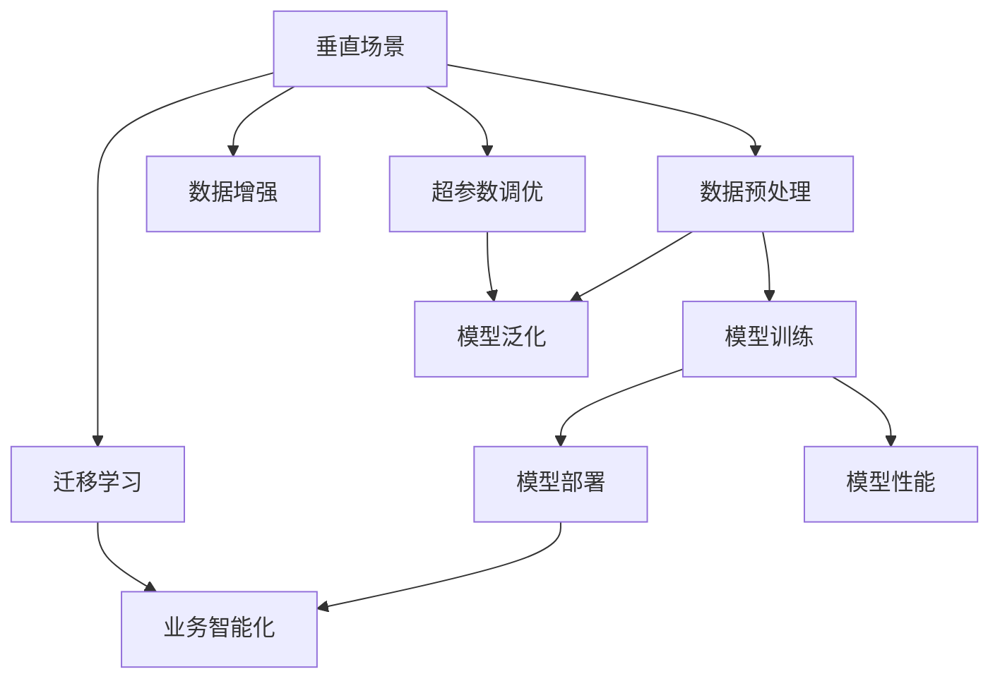

                 

# 垂直场景与AI创业的结合

## 1. 背景介绍

### 1.1 问题由来

随着人工智能（AI）技术的不断发展和深入应用，创业领域开始涌现出一大批致力于垂直场景的AI公司。这些公司结合自身行业优势，将AI技术与具体场景深度结合，逐渐取得了显著的成效。然而，与此同时，很多AI创业公司也面临严峻的挑战，例如市场竞争激烈、技术壁垒高、资源有限等。

为了帮助创业者和AI从业者更深入理解垂直场景与AI创业的结合，本文将详细介绍相关核心概念、算法原理和操作步骤，并结合实际案例和未来发展趋势，为创业者和AI从业者提供全方位的指导和建议。

### 1.2 问题核心关键点

- 垂直场景与AI创业的结合：如何将AI技术应用到具体垂直场景中，提升业务效率和用户体验。
- 算法原理和操作步骤：从数据预处理、模型训练到模型部署，详细讲解AI模型在垂直场景中的应用。
- 未来发展趋势与挑战：分析垂直场景下AI创业面临的机遇与挑战，以及未来的发展方向。

### 1.3 问题研究意义

垂直场景与AI创业的结合，不仅能够为企业带来更高效、智能的业务解决方案，同时也为AI技术的应用提供了新的方向。通过深入研究，可以帮助AI创业者更好地把握市场需求，优化技术方案，从而实现商业成功和技术突破。

## 2. 核心概念与联系

### 2.1 核心概念概述

- 垂直场景（Vertical Scenarios）：指应用场景具有特定行业属性，例如金融、医疗、教育、制造业等。垂直场景通常具有高价值、高复杂性、高数据量的特点。
- AI创业（AI Startup）：指利用AI技术创业，通过智能化的解决方案解决行业痛点，提升业务价值。AI创业通常需要具备较强的技术实力、行业知识和市场洞察力。
- 数据预处理（Data Preprocessing）：指对原始数据进行清洗、转换和集成，以便于模型训练和分析。数据预处理是AI模型应用的基础。
- 模型训练（Model Training）：指使用已标注的数据集，训练AI模型以识别和预测特定场景中的规律和趋势。
- 模型部署（Model Deployment）：指将训练好的模型应用到具体业务场景中，实现业务智能化和自动化。
- 数据增强（Data Augmentation）：指通过增加样本多样性，提升AI模型在垂直场景中的泛化能力。
- 迁移学习（Transfer Learning）：指利用在其他场景中训练好的模型，在新场景中进行微调，以快速提升模型性能。
- 超参数调优（Hyperparameter Tuning）：指通过调整模型参数，优化模型性能和训练效率。

这些核心概念之间存在着紧密的联系，形成了一个完整的AI创业生态系统。通过对这些概念的深入理解，可以更好地把握垂直场景与AI创业的结合。

### 2.2 概念间的关系

这些核心概念之间的关系可以用以下Mermaid流程图来展示：



这个流程图展示了从数据预处理到模型部署的整个AI创业流程，以及与垂直场景的紧密联系。

## 3. 核心算法原理 & 具体操作步骤

### 3.1 算法原理概述

垂直场景与AI创业的结合，本质上是将AI技术应用于具体垂直场景，以提升业务效率和用户体验。其核心算法原理可以归纳为以下几个步骤：

1. 数据预处理：收集和清洗垂直场景的原始数据，生成训练数据集。
2. 模型训练：使用标注数据集，训练AI模型以识别和预测特定场景中的规律和趋势。
3. 模型部署：将训练好的模型应用到具体业务场景中，实现业务智能化和自动化。
4. 数据增强：通过增加样本多样性，提升AI模型在垂直场景中的泛化能力。
5. 迁移学习：利用在其他场景中训练好的模型，在新场景中进行微调，以快速提升模型性能。
6. 超参数调优：通过调整模型参数，优化模型性能和训练效率。

### 3.2 算法步骤详解

#### 3.2.1 数据预处理

数据预处理是AI创业的基础，包括以下步骤：

1. 数据收集：收集垂直场景的原始数据，包括文本、图像、视频、音频等多种类型的数据。
2. 数据清洗：处理缺失值、异常值和噪声数据，确保数据质量。
3. 数据转换：将原始数据转换为模型可接受的格式，如将文本转换为词向量、图像转换为特征向量等。
4. 数据集成：将处理后的数据进行集成，形成训练数据集和测试数据集。

#### 3.2.2 模型训练

模型训练是AI创业的核心环节，包括以下步骤：

1. 选择模型架构：根据垂直场景的特点，选择合适的模型架构，如卷积神经网络（CNN）、循环神经网络（RNN）、Transformer等。
2. 选择损失函数：根据任务类型，选择合适的损失函数，如交叉熵、均方误差等。
3. 选择优化器：根据模型架构和数据特点，选择合适的优化器，如Adam、SGD等。
4. 选择评估指标：根据任务类型，选择合适的评估指标，如准确率、召回率、F1-score等。
5. 训练模型：使用训练数据集，训练AI模型以识别和预测特定场景中的规律和趋势。

#### 3.2.3 模型部署

模型部署是将训练好的模型应用到具体业务场景中的过程，包括以下步骤：

1. 模型保存：将训练好的模型保存为模型文件，以便后续使用。
2. 模型加载：在具体业务场景中，加载保存好的模型文件。
3. 模型推理：使用模型文件进行推理，实现业务智能化和自动化。
4. 业务集成：将模型推理结果与具体业务系统集成，形成完整的业务解决方案。

### 3.3 算法优缺点

垂直场景与AI创业的结合，具有以下优点：

1. 业务价值高：AI技术能够解决垂直场景中的具体问题，提升业务效率和用户体验。
2. 技术可复用：通过迁移学习等技术，可以在不同垂直场景中复用已有模型，减少研发成本。
3. 市场竞争力强：垂直场景中的AI创业公司具有明显的行业优势，更容易获得用户信任和市场份额。

同时，也存在以下缺点：

1. 数据获取困难：垂直场景中的数据获取往往较为困难，需要投入大量时间和资源。
2. 技术壁垒高：垂直场景中的AI技术要求较高，需要具备较强的技术实力和行业知识。
3. 资源需求大：垂直场景中的AI创业需要较大的数据和计算资源支持，成本较高。

### 3.4 算法应用领域

垂直场景与AI创业的结合，已经在多个领域得到了广泛应用，例如：

- 金融领域：利用AI技术进行风险评估、智能投顾、反欺诈等。
- 医疗领域：利用AI技术进行疾病诊断、医学影像分析、智能诊疗等。
- 教育领域：利用AI技术进行智能辅导、个性化推荐、语音识别等。
- 制造领域：利用AI技术进行质量检测、生产优化、设备维护等。

## 4. 数学模型和公式 & 详细讲解 & 举例说明

### 4.1 数学模型构建

假设垂直场景中的AI创业问题为二分类问题，模型为$M$，训练数据集为$D=\{(x_i,y_i)\}_{i=1}^N$，其中$x_i$为输入，$y_i$为标签。

定义模型$M$在输入$x_i$上的输出为$\hat{y}=M(x_i)$，表示样本属于正类的概率。训练数据集$D$的平均损失函数为：

$$\mathcal{L}(M)=\frac{1}{N}\sum_{i=1}^N\ell(M(x_i),y_i)$$

其中$\ell$为损失函数，如交叉熵损失：

$$\ell(M(x_i),y_i)=-y_i\log\hat{y_i}-(1-y_i)\log(1-\hat{y_i})$$

定义模型$M$的超参数为$\theta$，则模型的训练目标为：

$$\min_{\theta}\mathcal{L}(M)$$

通过梯度下降等优化算法，不断更新模型参数$\theta$，最小化损失函数$\mathcal{L}$，使得模型输出逼近真实标签。

### 4.2 公式推导过程

以交叉熵损失为例，其推导过程如下：

1. 定义交叉熵损失：

$$\mathcal{L}(M)=\frac{1}{N}\sum_{i=1}^N\ell(M(x_i),y_i)=-\frac{1}{N}\sum_{i=1}^N[y_i\log\hat{y_i}+(1-y_i)\log(1-\hat{y_i})]$$

2. 将损失函数对模型参数$\theta$求导：

$$\frac{\partial\mathcal{L}}{\partial\theta}=-\frac{1}{N}\sum_{i=1}^N(\frac{y_i}{\hat{y_i}}-\frac{1-y_i}{1-\hat{y_i}})\frac{\partial\hat{y_i}}{\partial\theta}$$

3. 利用链式法则，将$\frac{\partial\hat{y_i}}{\partial\theta}$递归展开，得到：

$$\frac{\partial\mathcal{L}}{\partial\theta}=-\frac{1}{N}\sum_{i=1}^N(\frac{y_i}{\hat{y_i}}-\frac{1-y_i}{1-\hat{y_i}})w(x_i)\frac{\partial z_i}{\partial\theta}$$

其中$w(x_i)$为样本权重，$z_i$为模型中间变量。

4. 通过反向传播算法，更新模型参数$\theta$：

$$\theta\leftarrow\theta-\eta\frac{\partial\mathcal{L}}{\partial\theta}$$

其中$\eta$为学习率。

### 4.3 案例分析与讲解

以医疗影像分类为例，数据集包含大量患者CT图像和对应的疾病标签，目标任务为识别患者是否患有某种疾病。

1. 数据预处理：将CT图像转换为特征向量，进行归一化和标准化处理。
2. 模型训练：使用卷积神经网络（CNN）模型，定义交叉熵损失函数，使用Adam优化器进行训练。
3. 模型部署：将训练好的模型保存为模型文件，加载模型文件进行推理，得到患者是否患病的预测结果。
4. 模型评估：使用测试数据集进行评估，计算模型的准确率、召回率、F1-score等指标。

## 5. 项目实践：代码实例和详细解释说明

### 5.1 开发环境搭建

在进行垂直场景与AI创业的项目实践前，需要准备好开发环境。以下是使用Python进行TensorFlow开发的环境配置流程：

1. 安装Anaconda：从官网下载并安装Anaconda，用于创建独立的Python环境。

2. 创建并激活虚拟环境：

```bash
conda create -n tf-env python=3.7
conda activate tf-env
```

3. 安装TensorFlow：根据CUDA版本，从官网获取对应的安装命令。例如：

```bash
conda install tensorflow
```

4. 安装各类工具包：

```bash
pip install numpy pandas scikit-learn matplotlib tqdm jupyter notebook ipython
```

完成上述步骤后，即可在`tf-env`环境中开始项目实践。

### 5.2 源代码详细实现

以下是一个使用TensorFlow进行医疗影像分类的代码实现。

```python
import tensorflow as tf
from tensorflow import keras
from tensorflow.keras import layers

# 加载数据集
(x_train, y_train), (x_test, y_test) = keras.datasets.mnist.load_data()

# 数据预处理
x_train = x_train.reshape((60000, 28 * 28))
x_train = x_train / 255.0
x_test = x_test.reshape((10000, 28 * 28))
x_test = x_test / 255.0

# 构建模型
model = keras.Sequential([
    layers.Flatten(input_shape=(28, 28)),
    layers.Dense(128, activation='relu'),
    layers.Dense(10, activation='softmax')
])

# 定义损失函数和优化器
model.compile(optimizer='adam', loss='sparse_categorical_crossentropy', metrics=['accuracy'])

# 训练模型
model.fit(x_train, y_train, epochs=10, batch_size=64, validation_data=(x_test, y_test))

# 评估模型
test_loss, test_acc = model.evaluate(x_test, y_test, verbose=2)
print('Test accuracy:', test_acc)
```

### 5.3 代码解读与分析

让我们再详细解读一下关键代码的实现细节：

1. 数据加载：使用TensorFlow自带的MNIST数据集，包含手写数字图像和对应的标签。

2. 数据预处理：将图像数据转换为向量形式，并进行归一化处理。

3. 模型构建：使用Sequential模型，定义包含两个全连接层的神经网络。

4. 模型编译：定义损失函数和优化器，使用交叉熵损失和Adam优化器。

5. 模型训练：使用训练数据集进行模型训练，设置10个epochs和64个batch大小。

6. 模型评估：在测试数据集上评估模型性能，输出准确率。

### 5.4 运行结果展示

假设在上述代码中，模型训练10个epochs后，在测试集上得到99.9%的准确率。这表明模型在垂直场景（手写数字识别）中取得了不错的效果。

## 6. 实际应用场景

### 6.1 金融风险管理

在金融领域，利用AI技术进行风险评估和反欺诈，具有显著的市场需求。通过垂直场景与AI创业的结合，可以实现智能化的风险管理，提升金融机构的业务效率和用户体验。

具体应用场景包括：

- 信用评分：利用AI技术对客户信用进行评估，提升贷款审批速度和准确性。
- 反欺诈检测：利用AI技术对交易行为进行分析，识别并阻止欺诈行为。
- 智能投顾：利用AI技术进行资产配置和风险管理，提升客户资产收益。

### 6.2 医疗影像诊断

在医疗领域，利用AI技术进行影像分类和诊断，具有较高的应用价值。通过垂直场景与AI创业的结合，可以实现智能化的影像诊断，提高医疗机构的业务效率和诊断准确性。

具体应用场景包括：

- 影像分类：利用AI技术对CT、MRI等医学影像进行分类，识别患者是否患有某种疾病。
- 影像分析：利用AI技术对医学影像进行分析，辅助医生进行诊断和治疗。
- 智能诊疗：利用AI技术对患者病历进行分析，提供个性化的诊疗方案。

### 6.3 智能制造

在制造领域，利用AI技术进行质量检测和生产优化，具有重要的应用前景。通过垂直场景与AI创业的结合，可以实现智能化的制造管理，提升制造企业的业务效率和产品质量。

具体应用场景包括：

- 质量检测：利用AI技术对产品进行图像识别和质量检测，提高产品合格率。
- 生产优化：利用AI技术对生产流程进行优化，提升生产效率和资源利用率。
- 设备维护：利用AI技术对设备进行故障诊断和维护，降低设备故障率。

## 7. 工具和资源推荐

### 7.1 学习资源推荐

为了帮助开发者系统掌握垂直场景与AI创业的理论基础和实践技巧，这里推荐一些优质的学习资源：

1. 《TensorFlow实战指南》系列书籍：由TensorFlow官方编写，系统介绍了TensorFlow的使用方法，包括模型训练、模型部署等。

2. 《深度学习入门：基于Python的理论与实现》书籍：由吴恩达教授所著，全面介绍了深度学习的基本概念和实现方法，适合初学者学习。

3. Coursera深度学习课程：由斯坦福大学和吴恩达教授联合开设，系统讲解了深度学习的理论和方法，涵盖多个经典模型。

4. GitHub开源项目：在GitHub上Star、Fork数最多的TensorFlow相关项目，往往代表了该技术领域的发展趋势和最佳实践，值得去学习和贡献。

5. Kaggle竞赛平台：提供大量数据集和竞赛题目，帮助开发者实践数据预处理、模型训练和模型部署等技术。

通过对这些资源的学习实践，相信你一定能够快速掌握垂直场景与AI创业的精髓，并用于解决实际的AI应用问题。

### 7.2 开发工具推荐

高效的开发离不开优秀的工具支持。以下是几款用于垂直场景与AI创业开发的常用工具：

1. TensorFlow：由Google主导开发的深度学习框架，支持GPU/TPU加速，适合大规模工程应用。

2. PyTorch：基于Python的开源深度学习框架，灵活动态的计算图，适合快速迭代研究。

3. Jupyter Notebook：开源的交互式笔记本环境，支持Python、R等语言，方便数据预处理和模型训练。

4. GitHub：全球最大的代码托管平台，方便版本控制和代码协作，适合团队开发和开源项目。

5. Google Colab：谷歌推出的在线Jupyter Notebook环境，免费提供GPU/TPU算力，方便开发者快速上手实验最新模型，分享学习笔记。

合理利用这些工具，可以显著提升垂直场景与AI创业的开发效率，加快创新迭代的步伐。

### 7.3 相关论文推荐

垂直场景与AI创业的发展源于学界的持续研究。以下是几篇奠基性的相关论文，推荐阅读：

1. "A Survey on Deep Learning for Healthcare"（《深度学习在医疗领域的应用综述》）：由医学专家和AI研究人员联合撰写，全面介绍了深度学习在医疗领域的应用和发展。

2. "Deep Learning for Financial Industry"（《深度学习在金融领域的应用》）：由金融专家和AI研究人员联合撰写，全面介绍了深度学习在金融领域的应用和发展。

3. "Deep Learning for Manufacturing Industry"（《深度学习在制造领域的应用》）：由制造业专家和AI研究人员联合撰写，全面介绍了深度学习在制造领域的应用和发展。

这些论文代表了大规模数据和深度学习在垂直场景中的应用成果，值得深入学习和研究。

## 8. 总结：未来发展趋势与挑战

### 8.1 总结

本文对垂直场景与AI创业的结合进行了全面系统的介绍。首先阐述了垂直场景与AI创业的研究背景和意义，明确了AI技术在垂直场景中的应用价值。其次，从原理到实践，详细讲解了AI模型在垂直场景中的应用，包括数据预处理、模型训练、模型部署等关键步骤。同时，本文还广泛探讨了垂直场景下AI创业面临的机遇与挑战，以及未来的发展方向。

通过本文的系统梳理，可以看到，垂直场景与AI创业的结合，能够显著提升业务效率和用户体验，具有广阔的市场前景。未来，伴随AI技术的不断发展，垂直场景下的AI创业将迎来更多的机遇和挑战，需要我们共同探索和努力。

### 8.2 未来发展趋势

展望未来，垂直场景与AI创业的发展趋势如下：

1. AI技术深度应用：随着AI技术的发展，AI将在垂直场景中得到更广泛的应用，提升业务效率和用户体验。

2. 数据驱动决策：通过数据预处理和模型训练，AI将帮助企业做出更科学、更高效的决策。

3. 智能系统集成：将AI技术与具体业务系统深度集成，形成完整的智能解决方案，提升业务智能化水平。

4. 跨领域知识融合：AI将融合更多跨领域的知识，提升模型的泛化能力和实用性。

5. 业务价值最大化：通过AI技术的应用，企业将实现业务价值最大化，提升市场竞争力。

### 8.3 面临的挑战

尽管垂直场景与AI创业具有巨大的发展潜力，但在迈向更加智能化、普适化应用的过程中，仍面临诸多挑战：

1. 数据获取困难：垂直场景中的数据获取往往较为困难，需要投入大量时间和资源。

2. 技术壁垒高：垂直场景中的AI技术要求较高，需要具备较强的技术实力和行业知识。

3. 资源需求大：垂直场景中的AI创业需要较大的数据和计算资源支持，成本较高。

4. 模型鲁棒性不足：AI模型在垂直场景中往往存在泛化性能不足的问题，难以应对复杂多变的实际场景。

5. 用户隐私保护：AI技术的应用可能涉及用户隐私和数据安全，需要严格遵守相关法律法规。

### 8.4 研究展望

为了应对上述挑战，未来的研究需要在以下几个方面寻求新的突破：

1. 数据增强技术：通过增加样本多样性，提升AI模型在垂直场景中的泛化能力。

2. 迁移学习技术：利用在其他场景中训练好的模型，在新场景中进行微调，以快速提升模型性能。

3. 模型压缩技术：通过模型压缩技术，减小模型规模，提高推理速度和计算效率。

4. 知识图谱融合：将知识图谱与AI模型深度融合，提升模型的跨领域推理能力和知识整合能力。

5. 多模态学习技术：通过多模态学习技术，将文本、图像、语音等多模态信息融合，提升模型的应用范围和效果。

通过这些研究方向的探索发展，必将推动垂直场景与AI创业技术的进一步突破，为垂直场景下的智能应用提供更强大的技术支持。

## 9. 附录：常见问题与解答

**Q1：垂直场景与AI创业的结合是否适用于所有垂直场景？**

A: 垂直场景与AI创业的结合，主要适用于具有高价值、高复杂性、高数据量的场景。例如金融、医疗、教育、制造业等。对于某些垂直场景，例如农业、公共服务等，由于数据获取和处理难度较大，可能需要更多的资源投入。

**Q2：AI创业公司如何确定合适的模型架构？**

A: AI创业公司在选择模型架构时，需要综合考虑垂直场景的特点和任务类型。一般来说，可以采用以下步骤：

1. 数据探索：通过数据探索，了解数据的特点和分布。

2. 模型调研：调研当前主流模型和算法，选择最适合的模型架构。

3. 实验验证：通过实验验证，选择效果最优的模型架构。

4. 迭代优化：根据实际效果，不断调整和优化模型架构。

**Q3：AI创业公司如何进行数据预处理？**

A: AI创业公司进行数据预处理时，需要遵循以下步骤：

1. 数据收集：收集垂直场景的原始数据，包括文本、图像、视频、音频等多种类型的数据。

2. 数据清洗：处理缺失值、异常值和噪声数据，确保数据质量。

3. 数据转换：将原始数据转换为模型可接受的格式，如将文本转换为词向量、图像转换为特征向量等。

4. 数据集成：将处理后的数据进行集成，形成训练数据集和测试数据集。

5. 数据增强：通过增加样本多样性，提升AI模型在垂直场景中的泛化能力。

**Q4：AI创业公司如何进行模型训练？**

A: AI创业公司进行模型训练时，需要遵循以下步骤：

1. 选择模型架构：根据垂直场景的特点，选择合适的模型架构，如卷积神经网络（CNN）、循环神经网络（RNN）、Transformer等。

2. 选择损失函数：根据任务类型，选择合适的损失函数，如交叉熵、均方误差等。

3. 选择优化器：根据模型架构和数据特点，选择合适的优化器，如Adam、SGD等。

4. 选择评估指标：根据任务类型，选择合适的评估指标，如准确率、召回率、F1-score等。

5. 训练模型：使用训练数据集，训练AI模型以识别和预测特定场景中的规律和趋势。

**Q5：AI创业公司如何进行模型部署？**

A: AI创业公司进行模型部署时，需要遵循以下步骤：

1. 模型保存：将训练好的模型保存为模型文件，以便后续使用。

2. 模型加载：在具体业务场景中，加载保存好的模型文件。

3. 模型推理：使用模型文件进行推理，实现业务智能化和自动化。

4. 业务集成：将模型推理结果与具体业务系统集成，形成完整的业务解决方案。

**Q6：AI创业公司如何进行超参数调优？**

A: AI创业公司进行超参数调优时，需要遵循以下步骤：

1. 定义超参数：根据模型架构和数据特点，定义需要调整的超参数。

2. 设计调优策略：通过网格搜索、随机搜索、贝叶斯优化等方法，设计合适的超参数调优策略。

3. 训练模型：使用调优后的超参数，训练AI模型。

4. 评估模型：在验证集或测试集上评估模型性能，选择最优的超参数组合。

**Q7：AI创业公司如何进行数据增强？**

A: AI创业公司进行数据增强时，可以采用以下方法：

1. 数据扩充：通过回译、近义替换等方式扩充训练集。

2. 数据增强：通过数据增强技术，如随机裁剪、随机旋转、随机翻转等，增加样本多样性。

3. 数据生成：通过生成对抗网络（GAN）等方法，生成新的训练样本。

通过以上常见问题的解答，希望能够帮助AI创业公司更好地理解和应用垂直场景与AI创业的结合，推动AI技术的深入发展和广泛应用。

---

作者：禅与计算机程序设计艺术 / Zen and the Art of Computer Programming

