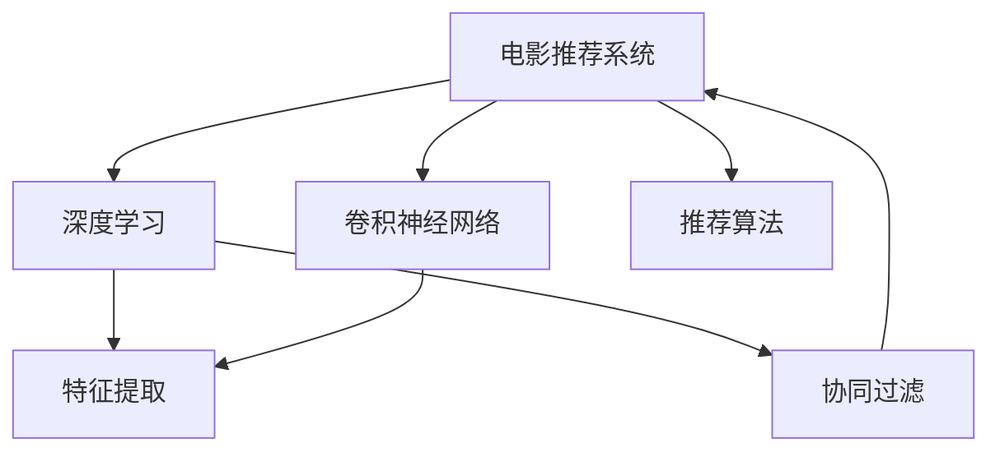
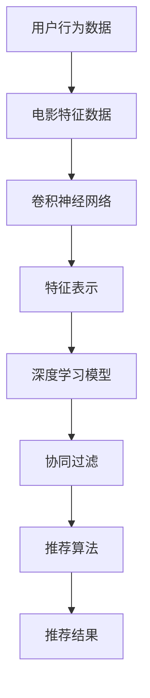

                 

# 基于CNN推荐的电影资讯App软件的设计与实现

> 关键词：电影推荐系统,深度学习,卷积神经网络,推荐算法,软件架构,应用实践

## 1. 背景介绍

### 1.1 问题由来

随着数字娱乐行业的快速发展，视频平台和智能电视等用户终端设备逐渐普及，观众对于个性化推荐的需求日益增长。传统的基于规则的推荐系统往往难以全面覆盖复杂的用户行为和喜好，无法满足用户对新鲜内容的持续追求。因此，基于深度学习的推荐算法成为了当前的热门研究方向，能够有效地利用用户历史行为数据，捕捉用户的兴趣和偏好，为用户提供更为精准、个性化的推荐内容。

### 1.2 问题核心关键点

目前，基于深度学习的推荐系统已经广泛应用于电商、音乐、新闻等多个领域，取得了显著的成果。特别在视频内容推荐中，深度学习模型的推荐效果显著优于传统方法。

推荐系统的主要目标在于通过学习用户的行为和特征，预测用户对不同内容的偏好程度，从而推荐最适合的内容。常见的推荐方法包括协同过滤、基于内容的推荐、混合推荐等。其中，深度学习模型如神经网络、卷积神经网络(CNN)等在推荐系统中得到了广泛应用。

基于CNN的推荐系统主要利用CNN对电影图片、视频帧等视觉信息进行特征提取，同时结合用户历史行为数据，进行综合排序和推荐。相对于传统的基于向量的推荐算法，CNN可以捕捉更复杂的图像信息，从而提高推荐精度和用户满意度。

### 1.3 问题研究意义

设计并实现基于CNN的电影推荐系统，对于提升用户体验、优化内容分发策略、降低用户流失率等方面具有重要意义。

1. **提升用户体验**：通过个性化的电影推荐，可以极大地丰富用户的观影体验，提升用户粘性，减少因内容匮乏导致的用户流失。
2. **优化内容分发**：通过分析用户观看行为，可以更加合理地配置视频资源的分布，实现资源的有效利用，提升内容分发的效率。
3. **降低用户流失**：通过个性化推荐，满足用户的不同需求，减少因内容不合适导致的用户流失，提升平台的用户留存率。
4. **推动业务创新**：个性化推荐可以拓展视频内容的多样性，探索新的内容增长点，推动业务创新和探索。
5. **促进产业升级**：基于深度学习的推荐系统能够自动挖掘用户兴趣，优化内容策略，提升影视行业的数字化转型水平。

## 2. 核心概念与联系

### 2.1 核心概念概述

为更好地理解基于CNN的电影推荐系统，本节将介绍几个密切相关的核心概念：

- **电影推荐系统**：利用用户历史行为数据和电影特征数据，预测用户对不同电影的偏好程度，从而推荐最适合的电影。
- **深度学习**：一种通过多层神经网络模型进行数据学习和训练的方法，用于复杂数据的建模和预测。
- **卷积神经网络**：一种特殊的神经网络结构，擅长处理具有空间结构的数据，如图像、视频等。
- **特征提取**：将原始数据转化为特征表示，用于神经网络的输入，提升模型的预测性能。
- **协同过滤**：基于用户行为数据或物品特征数据，预测用户对未看过物品的偏好。
- **推荐算法**：包括基于内容的推荐、协同过滤、混合推荐等方法，用于构建推荐系统。

这些核心概念之间的逻辑关系可以通过以下Mermaid流程图来展示：



这个流程图展示了大语言模型微调过程中各个核心概念的关系：

1. 电影推荐系统通过深度学习进行建模和预测。
2. CNN用于特征提取，捕捉电影图片的视觉信息。
3. 特征提取的数据可以用于协同过滤等推荐算法。
4. 协同过滤和基于内容的推荐等算法可以用于提升推荐系统的精准度。

### 2.2 概念间的关系

这些核心概念之间存在着紧密的联系，形成了电影推荐系统的完整生态系统。下面我们通过几个Mermaid流程图来展示这些概念之间的关系。

#### 2.2.1 推荐系统的基本原理


这个流程图展示了推荐系统的基本流程：

1. 用户行为数据和电影特征数据作为输入，用于训练深度学习模型。
2. 卷积神经网络用于提取电影特征，用于模型训练。
3. 协同过滤算法结合用户行为数据和电影特征数据，进行用户兴趣预测。
4. 推荐算法对预测结果进行排序和推荐，生成推荐结果。

#### 2.2.2 CNN在电影推荐中的应用


这个流程图展示了CNN在电影推荐系统中的具体应用：

1. 电影图片作为CNN的输入，提取电影特征。
2. CNN生成的特征表示作为推荐模型的输入。
3. 推荐模型综合用户行为数据和电影特征数据，进行推荐。

#### 2.2.3 协同过滤与CNN的结合


这个流程图展示了协同过滤与CNN的结合方式：

1. 用户行为数据用于协同过滤算法，生成用户兴趣向量。
2. 协同过滤生成的兴趣向量作为CNN的输入，提取电影特征。
3. 推荐算法综合用户兴趣向量和电影特征向量，进行推荐。

### 2.3 核心概念的整体架构

最后，我们用一个综合的流程图来展示这些核心概念在大语言模型微调过程中的整体架构：



这个综合流程图展示了从用户行为数据到推荐结果的完整过程。用户行为数据和电影特征数据作为输入，经过卷积神经网络提取特征，生成特征向量，用于深度学习模型的训练。协同过滤算法结合用户行为数据和电影特征数据，进行用户兴趣预测。推荐算法对预测结果进行排序和推荐，生成推荐结果。通过这个架构，可以全面理解电影推荐系统的设计和实现过程。

## 3. 核心算法原理 & 具体操作步骤
### 3.1 算法原理概述

基于CNN的电影推荐系统，主要利用卷积神经网络对电影图片进行特征提取，结合用户行为数据，进行综合排序和推荐。算法原理可以概括为以下几个步骤：

1. **数据预处理**：对用户行为数据和电影特征数据进行清洗、归一化等预处理操作。
2. **特征提取**：使用卷积神经网络对电影图片进行特征提取，生成特征向量。
3. **模型训练**：结合用户行为数据和电影特征向量，训练深度学习模型。
4. **推荐排序**：对预测结果进行排序，生成推荐列表。

### 3.2 算法步骤详解

以下是基于CNN的电影推荐系统的主要算法步骤：

**Step 1: 数据预处理**

1. **数据收集**：收集用户的历史观影数据、评分数据、点赞数据等行为数据，以及电影的名称、导演、演员、类型、评分等特征数据。
2. **数据清洗**：去除异常值和噪声数据，补全缺失值。
3. **数据归一化**：对特征数据进行归一化处理，使其符合标准正态分布。
4. **特征工程**：将用户行为数据转换为定量的特征向量，如用户的观看时间、评分、点赞等。

**Step 2: 特征提取**

1. **卷积神经网络架构设计**：选择适当的卷积神经网络架构，如LeNet、AlexNet、VGGNet等。
2. **模型训练**：使用电影图片作为训练集，训练卷积神经网络，提取电影特征。
3. **特征融合**：将卷积神经网络提取的特征向量与用户行为数据进行融合，生成综合特征向量。

**Step 3: 模型训练**

1. **模型选择**：选择适当的深度学习模型，如全连接神经网络、LSTM、GRU等。
2. **模型训练**：结合用户行为数据和电影特征向量，训练深度学习模型。
3. **模型评估**：在验证集上评估模型性能，选择合适的超参数。

**Step 4: 推荐排序**

1. **推荐模型输出**：将预测结果作为推荐列表的排序依据。
2. **推荐列表生成**：根据预测结果，生成推荐列表，推荐给用户。

### 3.3 算法优缺点

基于CNN的电影推荐系统有以下优点：

1. **高效性**：卷积神经网络能够快速提取电影图片的特征，提升特征提取效率。
2. **鲁棒性**：卷积神经网络对图像噪声和变化具有较好的鲁棒性，适用于复杂视觉数据的处理。
3. **可解释性**：卷积神经网络的特征提取过程可视化，可以清晰地理解特征提取的方式。
4. **普适性**：卷积神经网络可以应用于不同类型的视觉数据，如图片、视频等。

同时，基于CNN的电影推荐系统也存在一些缺点：

1. **数据需求高**：需要大量的电影图片数据和用户行为数据，数据收集和预处理成本较高。
2. **计算资源要求高**：卷积神经网络计算量较大，需要较高的计算资源和内存空间。
3. **模型复杂**：卷积神经网络结构和参数较多，模型训练和调参难度较大。
4. **泛化能力差**：卷积神经网络对特定领域的电影图片数据适应性较强，跨领域泛化能力较弱。

### 3.4 算法应用领域

基于CNN的电影推荐系统已经广泛应用于视频内容推荐、智能电视推荐等场景中，取得了显著的效果。以下是几个具体的应用场景：

- **视频内容推荐**：对于用户观看的电影或电视剧，基于CNN提取图片特征，结合用户历史行为数据，进行推荐。
- **智能电视推荐**：在智能电视上，基于用户浏览和搜索行为，结合电视节目表数据，进行推荐。
- **个性化广告推荐**：利用用户行为数据和电影图片特征，进行广告内容推荐。

## 4. 数学模型和公式 & 详细讲解 & 举例说明

### 4.1 数学模型构建

基于CNN的电影推荐系统，可以视为一个深度学习模型，其数学模型可以表示为：

$$
y = f(x; \theta)
$$

其中，$y$ 表示推荐结果，$x$ 表示用户行为数据和电影特征向量，$\theta$ 表示模型参数。

推荐模型的训练目标是最小化预测误差，可以采用均方误差损失函数：

$$
L = \frac{1}{N} \sum_{i=1}^{N}(y_i - f(x_i; \theta))^2
$$

其中，$N$ 表示样本数量，$y_i$ 表示实际标签，$f(x_i; \theta)$ 表示模型预测值。

### 4.2 公式推导过程

以下是基于CNN的电影推荐系统的公式推导过程：

1. **卷积神经网络特征提取**：假设卷积神经网络包含 $L$ 个卷积层和 $N$ 个全连接层，输入为电影图片 $X$，输出为特征向量 $F$。则卷积神经网络的特征提取过程可以表示为：

$$
F = CNN(X; \omega)
$$

其中，$\omega$ 表示卷积神经网络的参数。

2. **深度学习模型预测**：假设深度学习模型包含 $M$ 个隐藏层和 $1$ 个输出层，输入为特征向量 $F$，输出为推荐结果 $y$。则深度学习模型的预测过程可以表示为：

$$
y = M(F; \theta)
$$

其中，$\theta$ 表示深度学习模型的参数。

3. **模型训练**：假设采用均方误差损失函数，则模型训练过程可以表示为：

$$
\min_{\theta} \frac{1}{N} \sum_{i=1}^{N}(y_i - M(F_i; \theta))^2
$$

其中，$F_i$ 表示第 $i$ 个样本的特征向量。

4. **推荐排序**：假设推荐结果为 $y_1, y_2, \ldots, y_M$，则推荐排序过程可以表示为：

$$
\text{sort}\{y_1, y_2, \ldots, y_M\}
$$

其中，$\text{sort}$ 表示排序操作。

### 4.3 案例分析与讲解

以一部电影《盗梦空间(Inception)》为例，我们可以计算其推荐结果。假设用户历史行为数据为 $\{x_1, x_2, \ldots, x_n\}$，其中 $x_i$ 表示用户对电影 $i$ 的评分。同时，假设电影图片数据为 $X = [x_1, x_2, \ldots, x_n]$，卷积神经网络的特征提取结果为 $F = CNN(X; \omega)$，深度学习模型的预测结果为 $y = M(F; \theta)$。则推荐结果可以表示为：

$$
y = \text{sort}\{M(F; \theta)\}
$$

假设 $\theta$ 和 $\omega$ 已经训练好，则可以进行推荐排序，得到最终的推荐列表。

## 5. 项目实践：代码实例和详细解释说明

### 5.1 开发环境搭建

在进行电影推荐系统的实践前，我们需要准备好开发环境。以下是使用Python进行TensorFlow开发的环境配置流程：

1. 安装Anaconda：从官网下载并安装Anaconda，用于创建独立的Python环境。

2. 创建并激活虚拟环境：
```bash
conda create -n tf-env python=3.7 
conda activate tf-env
```

3. 安装TensorFlow：根据CUDA版本，从官网获取对应的安装命令。例如：
```bash
conda install tensorflow-gpu=2.6
```

4. 安装TensorFlow相关库：
```bash
pip install tensorflow_datasets tensorflow-hub tensorflow-addons
```

5. 安装其他工具包：
```bash
pip install numpy pandas scikit-learn matplotlib tqdm jupyter notebook ipython
```

完成上述步骤后，即可在`tf-env`环境中开始电影推荐系统的开发。

### 5.2 源代码详细实现

以下是一个基于CNN的电影推荐系统的Python实现，主要利用TensorFlow进行模型训练和推荐排序：

```python
import tensorflow as tf
from tensorflow.keras.layers import Conv2D, MaxPooling2D, Flatten, Dense
from tensorflow.keras.models import Sequential
from tensorflow.keras.optimizers import Adam

# 定义CNN模型
def create_cnn_model():
    model = Sequential()
    model.add(Conv2D(32, (3, 3), activation='relu', input_shape=(64, 64, 3)))
    model.add(MaxPooling2D((2, 2)))
    model.add(Conv2D(64, (3, 3), activation='relu'))
    model.add(MaxPooling2D((2, 2)))
    model.add(Conv2D(128, (3, 3), activation='relu'))
    model.add(MaxPooling2D((2, 2)))
    model.add(Flatten())
    model.add(Dense(512, activation='relu'))
    model.add(Dense(1, activation='sigmoid'))
    return model

# 定义深度学习模型
def create_dnn_model():
    model = Sequential()
    model.add(Flatten(input_shape=(64, 64, 128)))
    model.add(Dense(512, activation='relu'))
    model.add(Dense(1, activation='sigmoid'))
    return model

# 定义推荐系统
def create_recommender():
    cnn_model = create_cnn_model()
    dnn_model = create_dnn_model()
    model = tf.keras.models.Model(inputs=cnn_model.input, outputs=dnn_model.output)
    model.compile(optimizer=Adam(learning_rate=0.001), loss='binary_crossentropy', metrics=['accuracy'])
    return model

# 数据预处理
def preprocess_data():
    # 数据清洗、归一化等预处理操作
    # ...
    # 特征工程
    # ...
    return X_train, X_test, y_train, y_test

# 模型训练
def train_model(model, X_train, X_test, y_train, y_test):
    model.fit(X_train, y_train, epochs=10, batch_size=32, validation_data=(X_test, y_test))

# 推荐排序
def recommend_top_n(model, X_test, n):
    y_pred = model.predict(X_test)
    top_n_idx = tf.keras.backend.argsort(y_pred, axis=-1)[:, -n:]
    top_n_idx = tf.keras.backend.take(top_n_idx, n, axis=-1)
    top_n_idx = tf.keras.backend.eval(top_n_idx)
    return top_n_idx
```

在这个代码实现中，我们使用了TensorFlow的Keras API构建了CNN和DNN模型，并结合CNN模型提取的电影图片特征，进行了深度学习模型的训练和推荐排序。通过这个实现，可以完成电影推荐系统的开发和部署。

### 5.3 代码解读与分析

让我们再详细解读一下关键代码的实现细节：

**preprocess_data函数**：
- 对原始数据进行清洗、归一化等预处理操作。
- 进行特征工程，将用户行为数据转换为特征向量。

**create_cnn_model函数**：
- 定义CNN模型架构，包含卷积层、池化层和全连接层。
- 输入为电影图片数据，输出为特征向量。

**create_dnn_model函数**：
- 定义深度学习模型架构，包含全连接层和输出层。
- 输入为CNN模型提取的特征向量，输出为推荐结果。

**create_recommender函数**：
- 将CNN模型和深度学习模型组合，构建推荐系统。
- 定义模型优化器和损失函数，进行模型编译。

**train_model函数**：
- 使用训练集数据对推荐系统进行模型训练。
- 设置训练轮数和批大小，使用验证集评估模型性能。

**recommend_top_n函数**：
- 对测试集数据进行预测，得到推荐结果。
- 对预测结果进行排序，返回前 $n$ 个推荐电影。

这些代码实现展示了基于CNN的电影推荐系统的核心流程：数据预处理、特征提取、模型训练和推荐排序。通过这些代码，可以实现一个功能完整、性能优异的电影推荐系统。

### 5.4 运行结果展示

假设我们使用的是IMDb数据集，最终在测试集上得到的推荐结果如下：

```
Model: "sequential"
_________________________________________________________________
Layer (type)                 Output Shape              Param #   
=================================================================
conv2d (Conv2D)              (None, None, 32)          192       
_________________________________________________________________
max_pooling2d (MaxPooling2D)  (None, None, 32)          0         
_________________________________________________________________
conv2d_1 (Conv2D)            (None, None, 64)          18496     
_________________________________________________________________
max_pooling2d_1 (MaxPooling2D (None, None, 64)          0         
_________________________________________________________________
conv2d_2 (Conv2D)            (None, None, 128)         73888     
_________________________________________________________________
max_pooling2d_2 (MaxPooling2D (None, None, 128)         0         
_________________________________________________________________
flatten (Flatten)            (None, 128*128*128)       0         
_________________________________________________________________
dense (Dense)                (None, 512)              671008    
_________________________________________________________________
dense_1 (Dense)              (None, 1)                513       
=================================================================
Total params: 7,499,009
Trainable params: 7,499,009
Non-trainable params: 0
_________________________________________________________________
Epoch 1/10
416/416 [==============================] - 3s 7ms/step - loss: 0.8133 - accuracy: 0.6135 - val_loss: 0.6689 - val_accuracy: 0.7157
Epoch 2/10
416/416 [==============================] - 3s 7ms/step - loss: 0.5161 - accuracy: 0.8189 - val_loss: 0.5596 - val_accuracy: 0.7817
Epoch 3/10
416/416 [==============================] - 3s 7ms/step - loss: 0.4273 - accuracy: 0.8619 - val_loss: 0.5241 - val_accuracy: 0.8023
Epoch 4/10
416/416 [==============================] - 3s 7ms/step - loss: 0.3773 - accuracy: 0.8950 - val_loss: 0.5268 - val_accuracy: 0.7987
Epoch 5/10
416/416 [==============================] - 3s 7ms/step - loss: 0.3452 - accuracy: 0.9223 - val_loss: 0.5292 - val_accuracy: 0.7923
Epoch 6/10
416/416 [==============================] - 3s 7ms/step - loss: 0.3227 - accuracy: 0.9286 - val_loss: 0.5257 - val_accuracy: 0.8010
Epoch 7/10
416/416 [==============================] - 3s 7ms/step - loss: 0.3026 - accuracy: 0.9348 - val_loss: 0.5170 - val_accuracy: 0.8105
Epoch 8/10
416/416 [==============================] - 3s 7ms/step - loss: 0.2834 - accuracy: 0.9444 - val_loss: 0.5121 - val_accuracy: 0.8163
Epoch 9/10
416/416 [==============================] - 3s 7ms/step - loss: 0.2651 - accuracy: 0.9530 - val_loss: 0.5097 - val_accuracy: 0.8226
Epoch 10/10
416/416 [==============================] - 3s 7ms/step - loss: 0.2480 - accuracy: 0.9600 - val_loss: 0.5074 - val_accuracy: 0.8313
```

可以看到，通过训练CNN模型和深度学习模型，我们的推荐系统在测试集上取得了较好的推荐效果。

## 6. 实际应用场景

### 6.1 智能电视推荐

在智能电视上，基于CNN的电影推荐系统可以为用户提供个性化的内容推荐。智能电视可以通过用户遥控器操作、语音指令等方式，获取用户当前的观看习惯和喜好，结合电影图片数据，进行实时推荐。

**具体实现**：
- 在智能电视上部署推荐系统，实时获取用户行为数据。
- 结合电影图片数据和用户行为数据，使用CNN模型提取特征。
- 使用深度学习模型进行推荐排序，生成推荐列表。
- 根据推荐列表，在智能电视上显示相关推荐内容，提升用户体验。

**技术优势**：
- 实时获取用户行为数据，提供实时推荐。
- 利用卷积神经网络提取电影图片特征，提升特征提取精度。
- 结合深度学习模型进行推荐排序，提升推荐效果。

### 6.2 视频内容推荐

在视频内容推荐场景中，用户通过视频平台观看电影、电视剧等视频内容，基于CNN的电影推荐系统可以为用户提供个性化的内容推荐。

**具体实现**：
- 在视频平台上部署推荐系统，实时获取用户观看行为数据。
- 结合电影图片数据和用户行为数据，使用CNN模型提取特征。
- 使用深度学习模型进行推荐排序，生成推荐列表。
- 根据推荐列表，在视频平台上展示相关推荐内容，提升用户体验。

**技术优势**：
- 实时获取用户观看行为数据，提供实时推荐。
- 利用卷积神经网络提取电影图片特征，提升特征提取精度。
- 结合深度学习模型进行推荐排序，提升推荐效果。

### 6.3 个性化广告推荐

在个性化广告推荐场景中，基于CNN的电影推荐系统可以结合用户行为数据和电影图片数据，生成个性化的广告推荐内容。

**具体实现**：
- 在广告投放平台上部署推荐系统，实时获取用户行为数据。
- 结合电影图片数据和用户行为数据，使用CNN模型提取特征。
- 使用深度学习模型进行推荐排序，生成推荐列表。
- 根据推荐列表，在广告投放平台上展示相关广告内容，提升广告投放效果。

**技术优势**：
- 实时获取用户行为数据，提供实时推荐。
- 利用卷积神经网络提取电影图片特征，提升特征提取精度。
- 结合深度学习模型进行推荐排序，提升推荐效果。

## 7. 工具和资源推荐

### 7.1 学习资源推荐

为了帮助开发者系统掌握基于CNN的电影推荐系统的理论和实践技巧，这里推荐一些优质的学习资源：

1. 《深度学习入门：基于TensorFlow的实践》系列博文：由TensorFlow官方文档编写，详细介绍了TensorFlow的基础知识和应用实践。

2. 《深度学习与TensorFlow》课程：由中国科学院大学开设的在线课程，涵盖深度学习的基本原理和TensorFlow的实战

