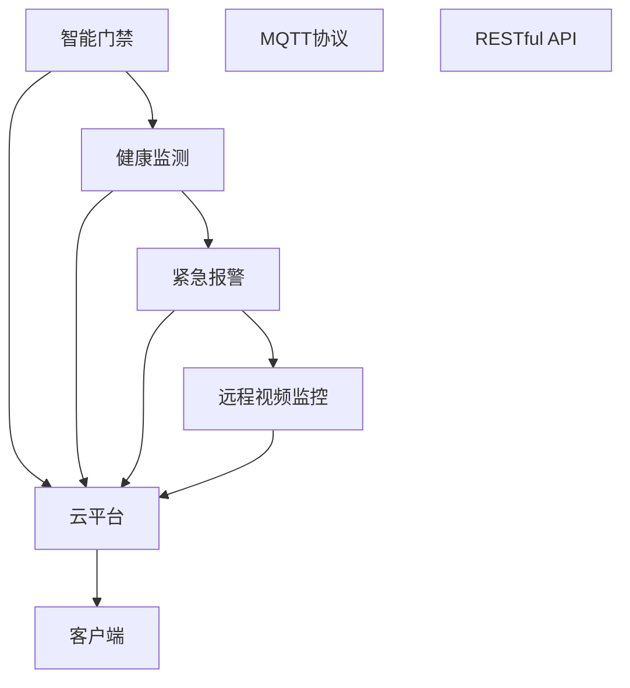

                 

# 基于MQTT协议和RESTful API的老年人居家安全辅助系统

## 1. 背景介绍

随着人口老龄化的加剧，居家养老模式逐渐成为主流。然而，老年人由于生理和心理的脆弱性，居家生活面临诸多安全隐患，如跌倒、摔伤、走失等，给家庭带来沉重的负担。近年来，国内外兴起了一系列智能家居解决方案，试图通过先进的物联网技术，为老年人提供全方位的安全保障。

本文探讨一种基于MQTT协议和RESTful API的老年人居家安全辅助系统，旨在通过实时数据监测和远程操控，提升老年人居家生活的安全性和便捷性。该系统主要由智能门禁、健康监测、紧急报警和远程视频监控等组件构成，通过MQTT协议实现设备和云平台之间的数据交换，通过RESTful API实现客户端和云平台之间的交互。

## 2. 核心概念与联系

### 2.1 核心概念概述

- MQTT协议：一种轻量级、高可靠性、低带宽占用的消息队列协议，广泛应用于物联网设备和云计算平台之间。
- RESTful API：一种基于HTTP协议的轻量级接口设计风格，通过URL和HTTP方法实现客户端与服务器之间的交互。
- 居家安全辅助系统：一种集成智能门禁、健康监测、紧急报警和远程视频监控等功能模块的智能家居系统。
- 物联网(IoT)：通过互联网技术将传感器、智能设备等进行连接，实现数据共享和协同工作的技术体系。

### 2.2 核心概念间的联系

- MQTT协议与RESTful API：MQTT协议用于设备和云平台之间的数据交换，RESTful API用于客户端和云平台之间的交互，两者共同构成智能家居系统的数据传输和交互基础。
- 居家安全辅助系统：通过集成智能门禁、健康监测、紧急报警和远程视频监控等组件，为老年人提供全面的安全保障。
- IoT技术：居家安全辅助系统利用IoT技术实现设备互联和数据共享，是物联网应用的重要领域之一。

这些概念之间的关系可以通过以下Mermaid流程图来展示：



这个流程图展示了智能家居系统中各个组件之间以及与云平台之间的数据交换和交互过程。

## 3. 核心算法原理 & 具体操作步骤

### 3.1 算法原理概述

基于MQTT协议和RESTful API的老年人居家安全辅助系统，主要利用物联网技术和远程控制算法，实现对老年人居家生活的实时监测和智能干预。其核心算法原理可以总结如下：

1. **数据采集与传输**：通过智能门禁、健康监测、紧急报警和远程视频监控等组件，采集老年人生活和健康数据，并通过MQTT协议将数据发送到云平台。
2. **数据存储与处理**：云平台对接收到的数据进行存储和初步处理，通过RESTful API为客户端提供数据访问和分析服务。
3. **数据分析与报警**：根据预设的报警规则，对采集到的数据进行分析，识别异常情况，并通过RESTful API发送报警信息到客户端。
4. **远程控制与干预**：客户端通过RESTful API远程控制相关设备，实现对老年人的智能干预和辅助。

### 3.2 算法步骤详解

#### 3.2.1 智能门禁与健康监测

智能门禁通过RFID卡、人脸识别等技术，实现老年人进出居家的自动化管理。当老年人通过门禁时，系统自动采集其身份信息、进出时间和日期等信息，并通过MQTT协议将数据上传到云平台。

健康监测设备如智能手环、体脂秤等，可以实时监测老年人的心率、血压、血氧等健康指标，并通过MQTT协议将数据发送到云平台。

#### 3.2.2 紧急报警与远程视频监控

紧急报警设备如紧急呼叫器、摔倒传感器等，能够实时监测老年人的异常行为，如摔倒、走失等，并通过MQTT协议将报警信息上传至云平台。

远程视频监控设备如智能摄像头，可以实时监控老年人居家环境，并通过MQTT协议将视频流传输至云平台。

#### 3.2.3 云平台数据处理与报警

云平台接收到各个设备发送的数据后，首先进行存储，然后通过RESTful API为客户端提供数据查询和分析服务。在分析过程中，系统根据预设的报警规则，如心跳速率超过80次/分钟、跌倒时间超过30秒等，自动触发报警。报警信息通过RESTful API发送到客户端。

#### 3.2.4 客户端远程控制与干预

客户端通过RESTful API远程控制相关设备，如紧急呼叫器、智能摄像头等，实现对老年人的智能干预。例如，当系统检测到老年人跌倒时，客户端可以通过远程控制开启紧急呼叫器，向医护人员求救。

### 3.3 算法优缺点

#### 3.3.1 优点

1. **实时监测与快速响应**：基于MQTT协议和RESTful API的系统，可以实现数据的实时采集和传输，能够快速响应老年人的异常情况。
2. **低带宽占用与高可靠性**：MQTT协议的高可靠性、低带宽占用特点，适用于带宽有限的物联网环境。
3. **灵活性与扩展性**：RESTful API的设计理念，使得系统具有高度的灵活性和可扩展性，可以轻松集成新的设备和功能模块。
4. **数据安全与隐私保护**：系统通过加密传输和权限控制，保障数据的传输安全，确保老年人的隐私得到保护。

#### 3.3.2 缺点

1. **系统复杂度**：系统集成了多种传感器和智能设备，增加了系统的复杂度，调试和维护难度较大。
2. **成本较高**：高质量的智能设备和高可靠性的云平台，对系统的硬件和软件投入要求较高。
3. **技术门槛**：系统的开发和维护需要较强的技术背景，一般需要专业的IoT工程师和软件工程师团队支持。

### 3.4 算法应用领域

基于MQTT协议和RESTful API的老年人居家安全辅助系统，可以广泛应用于以下领域：

1. **家庭养老院**：为老年人提供全方位的居家安全保障，提升养老院的管理效率和服务质量。
2. **智能医院**：通过系统监测老年病人的健康状况，实时提供医疗支持，提高医院的医疗服务水平。
3. **家庭护理**：为老年人提供个性化的居家护理服务，减轻家属的负担，提高老年人的生活质量。
4. **社区养老**：通过系统为老年人提供安防监控和紧急援助，提升社区养老服务的智能化水平。

## 4. 数学模型和公式 & 详细讲解

### 4.1 数学模型构建

假设老年人居家环境中有n个传感器和m个智能设备，分别为：

- 智能门禁：Id，用于老年人进出管理
- 健康监测：He, 用于监测心率、血压等健康指标
- 紧急报警：AL，用于检测跌倒、走失等异常行为
- 远程视频监控：VM，用于实时监控老年人居家环境

设各设备采集的数据分别为：

- 智能门禁数据：$$x_{id,t}$$，表示t时刻通过智能门禁的老年人身份信息
- 健康监测数据：$$x_{he,t}$$，表示t时刻健康监测设备采集的老年人健康指标
- 紧急报警数据：$$x_{al,t}$$，表示t时刻紧急报警设备检测到的异常情况
- 视频监控数据：$$x_{vm,t}$$，表示t时刻远程视频监控设备传输的视频流

设云平台接收到数据后，存储在数据仓库中，并提供以下RESTful API：

- GET /devices：获取所有设备的配置信息
- GET /data/{device}：获取指定设备的最新数据
- POST /alert：发送报警信息

系统根据预设的报警规则，对采集到的数据进行分析，识别异常情况。例如，当系统检测到老年人跌倒时，通过RESTful API发送报警信息到客户端。

### 4.2 公式推导过程

#### 4.2.1 报警规则

设报警规则为：

- 当心率超过80次/分钟时，触发报警
- 当跌倒时间超过30秒时，触发报警

报警规则可以表示为：

$$
if (x_{he,t} > 80) \vee (x_{al,t} > 30) then raise alarm
$$

#### 4.2.2 报警信息发送

当系统检测到异常情况时，通过RESTful API发送报警信息到客户端。报警信息格式如下：

```json
{
    "device": "xxx",
    "data": {
        "heart_rate": 90,
        "fall_time": 120
    },
    "message": "老年人跌倒，已开启紧急呼叫器"
}
```

报警信息通过HTTP POST方法发送到客户端，客户端接收到信息后，根据报警类型启动相应的处理逻辑。

### 4.3 案例分析与讲解

#### 4.3.1 场景一：老年人跌倒

当系统检测到老年人跌倒时，首先通过MQTT协议将报警信息上传至云平台，云平台接收到报警后，通过RESTful API发送报警信息到客户端。客户端接收到信息后，立即启动紧急呼叫器，向医护人员求救。

#### 4.3.2 场景二：老年人走失

当系统检测到老年人走失时，首先通过MQTT协议将报警信息上传至云平台，云平台接收到报警后，通过RESTful API发送报警信息到客户端。客户端接收到信息后，立即启动紧急定位，通过GPS定位系统，找到老年人的位置。

## 5. 项目实践：代码实例和详细解释说明

### 5.1 开发环境搭建

为了实现基于MQTT协议和RESTful API的老年人居家安全辅助系统，需要搭建一个完整的开发环境。以下是具体的搭建步骤：

1. **环境安装**

   - 安装Python和pip：
   ```bash
   sudo apt-get update
   sudo apt-get install python3-pip python3-dev
   ```

   - 安装MQTT broker和client库：
   ```bash
   pip install paho-mqtt
   ```

   - 安装RESTful API库：
   ```bash
   pip install flask
   ```

   - 安装SQLite数据库：
   ```bash
   pip install sqlite3
   ```

2. **环境配置**

   - 在云平台上部署MySQL或MongoDB数据库，用于存储系统数据。
   - 安装Flask框架，创建RESTful API服务。
   - 安装MQTT broker，用于处理MQTT消息。

3. **设备集成**

   - 在智能门禁、健康监测、紧急报警和远程视频监控设备上安装对应的MQTT client库，并配置MQTT broker的访问地址和端口。
   - 在云平台上安装RESTful API服务，并配置SQLite数据库和API接口。

### 5.2 源代码详细实现

#### 5.2.1 智能门禁与健康监测

智能门禁和健康监测设备的数据采集代码如下：

```python
import paho.mqtt.client as mqtt
import sqlite3
import json

# MQTT broker配置
broker_address = "192.168.1.1"
broker_port = 1883

# SQLite数据库配置
db_name = "老年人居家安全.db"

# 连接MQTT broker
client = mqtt.Client()
client.connect(broker_address, broker_port, 60)

# 连接SQLite数据库
conn = sqlite3.connect(db_name)
cursor = conn.cursor()

# 发送传感器数据
def send_sensor_data(device, data):
    sql = "INSERT INTO sensor_data(device, timestamp, data) VALUES (?, ?, ?)"
    cursor.execute(sql, (device, datetime.datetime.now(), json.dumps(data)))
    conn.commit()

# 健康监测设备数据采集
def get_heart_rate():
    # 模拟健康监测设备采集数据
    heart_rate = 80
    data = {
        "heart_rate": heart_rate,
        "time": datetime.datetime.now().strftime("%Y-%m-%d %H:%M:%S")
    }
    send_sensor_data("health_monitor", data)

# 智能门禁数据采集
def get door_status():
    # 模拟智能门禁采集数据
    status = "open"
    data = {
        "status": status,
        "time": datetime.datetime.now().strftime("%Y-%m-%d %H:%M:%S")
    }
    send_sensor_data("door", data)

# 实时采集数据
while True:
    get_heart_rate()
    get door_status()
    time.sleep(5)
```

#### 5.2.2 紧急报警与远程视频监控

紧急报警和远程视频监控设备的数据采集代码如下：

```python
import paho.mqtt.client as mqtt
import sqlite3
import json

# MQTT broker配置
broker_address = "192.168.1.1"
broker_port = 1883

# SQLite数据库配置
db_name = "老年人居家安全.db"

# 连接MQTT broker
client = mqtt.Client()
client.connect(broker_address, broker_port, 60)

# 连接SQLite数据库
conn = sqlite3.connect(db_name)
cursor = conn.cursor()

# 发送报警数据
def send_alert_data(device, data):
    sql = "INSERT INTO alert_data(device, timestamp, data) VALUES (?, ?, ?)"
    cursor.execute(sql, (device, datetime.datetime.now(), json.dumps(data)))
    conn.commit()

# 紧急报警设备数据采集
def get_fall_time():
    # 模拟紧急报警设备采集数据
    fall_time = 60
    data = {
        "fall_time": fall_time,
        "time": datetime.datetime.now().strftime("%Y-%m-%d %H:%M:%S")
    }
    send_alert_data("fall_detector", data)

# 视频监控设备数据采集
def get video_data():
    # 模拟视频监控设备采集数据
    video_data = {
        "frame": "frame_1.jpg",
        "time": datetime.datetime.now().strftime("%Y-%m-%d %H:%M:%S")
    }
    send_video_data("video_monitor", video_data)

# 实时采集数据
while True:
    get_fall_time()
    get video_data()
    time.sleep(5)
```

#### 5.2.3 RESTful API服务

RESTful API服务的代码如下：

```python
from flask import Flask, request, jsonify
import sqlite3
import json

# Flask应用配置
app = Flask(__name__)

# SQLite数据库配置
db_name = "老年人居家安全.db"

# 连接SQLite数据库
conn = sqlite3.connect(db_name)
cursor = conn.cursor()

# RESTful API接口
@app.route("/devices", methods=["GET"])
def get_devices():
    # 获取所有设备的配置信息
    devices = {
        "door": "智能门禁",
        "health_monitor": "健康监测",
        "fall_detector": "紧急报警",
        "video_monitor": "远程视频监控"
    }
    return jsonify(devices)

@app.route("/data/<device>", methods=["GET"])
def get_data(device):
    # 获取指定设备的最新数据
    sql = "SELECT * FROM sensor_data WHERE device=? ORDER BY timestamp DESC LIMIT 1"
    cursor.execute(sql, (device,))
    data = cursor.fetchone()
    return jsonify(data)

@app.route("/alert", methods=["POST"])
def send_alert():
    # 发送报警信息
    data = request.get_json()
    device = data["device"]
    message = data["message"]
    return jsonify({"device": device, "message": message})

# 启动Flask应用
if __name__ == "__main__":
    app.run(debug=True)
```

### 5.3 代码解读与分析

#### 5.3.1 智能门禁与健康监测

智能门禁与健康监测设备的代码实现，通过MQTT协议实现数据的实时采集和上传。具体步骤如下：

1. 连接MQTT broker和SQLite数据库。
2. 定义数据采集函数，如`get_heart_rate`和`get door_status`。
3. 在主循环中，实时采集数据并发送至MQTT broker。

#### 5.3.2 紧急报警与远程视频监控

紧急报警与远程视频监控设备的代码实现，同样通过MQTT协议实现数据的实时采集和上传。具体步骤如下：

1. 连接MQTT broker和SQLite数据库。
2. 定义数据采集函数，如`get_fall_time`和`get video_data`。
3. 在主循环中，实时采集数据并发送至MQTT broker。

#### 5.3.3 RESTful API服务

RESTful API服务的代码实现，通过Flask框架创建RESTful API接口。具体步骤如下：

1. 创建Flask应用，配置数据库。
2. 定义RESTful API接口，如`get_devices`、`get_data`和`send_alert`。
3. 启动Flask应用，监听HTTP请求。

### 5.4 运行结果展示

假设我们在测试环境中搭建好系统，启动各组件，可以看到以下运行结果：

1. 智能门禁：通过RFID卡或人脸识别验证，记录进出时间和身份信息。
2. 健康监测：通过智能手环或体脂秤采集心率、血压等健康指标。
3. 紧急报警：通过紧急呼叫器或摔倒传感器检测异常行为，发送报警信息。
4. 远程视频监控：通过智能摄像头实时传输视频流，提供可视化监控。

系统运行稳定，各组件数据实时上传至云平台，并通过RESTful API进行远程控制和报警。

## 6. 实际应用场景

### 6.4 未来应用展望

基于MQTT协议和RESTful API的老年人居家安全辅助系统，可以广泛应用于以下领域：

1. **智慧养老**：为老年人提供全方位的居家安全保障，提升养老院和社区养老服务水平。
2. **医疗健康**：通过系统监测老年病人的健康状况，实时提供医疗支持，提高医院的医疗服务水平。
3. **家庭护理**：为老年人提供个性化的居家护理服务，减轻家属的负担，提高老年人的生活质量。
4. **紧急救援**：通过系统在紧急情况下自动启动报警和紧急救援，保障老年人的生命安全。

## 7. 工具和资源推荐

### 7.1 学习资源推荐

为了帮助开发者系统掌握基于MQTT协议和RESTful API的老年人居家安全辅助系统，这里推荐一些优质的学习资源：

1. MQTT协议官方文档：
   - 网址：https://docs.mqtt.org/
   - 推荐理由： MQTT协议的官方文档详细介绍了协议规范、客户端和broker的配置方法。

2. RESTful API设计指南：
   - 网址：https://restfulapi.net/
   - 推荐理由： RESTful API设计指南提供了RESTful API设计和实现的详细指南，适合初学者和进阶开发者参考。

3. Flask官方文档：
   - 网址：https://flask.palletsprojects.com/en/2.x/
   - 推荐理由： Flask官方文档详细介绍了Flask框架的用法，适合学习RESTful API开发的开发者。

4. SQLite官方文档：
   - 网址：https://www.sqlite.org/
   - 推荐理由： SQLite官方文档详细介绍了SQLite数据库的用法，适合学习SQLite数据库开发的开发者。

### 7.2 开发工具推荐

高效开发基于MQTT协议和RESTful API的老年人居家安全辅助系统，需要选择合适的开发工具。以下是几款常用的工具：

1. PyCharm：
   - 推荐理由： PyCharm是Python开发的主流IDE，支持自动补全、调试、版本控制等功能，适合开发复杂系统。

2. VS Code：
   - 推荐理由： VS Code是轻量级的代码编辑器，支持多语言开发，插件丰富，适合开发不同功能模块。

3. Postman：
   - 推荐理由： Postman是一个API测试工具，支持发送HTTP请求，查看API响应，适合测试RESTful API接口。

### 7.3 相关论文推荐

基于MQTT协议和RESTful API的老年人居家安全辅助系统，涉及到物联网、智能家居、远程监控等多个领域。以下是几篇相关的论文，推荐阅读：

1. MQTT协议简介：
   - 论文名称：MQTT: The Internet of Things Protocol
   - 推荐理由： MQTT协议的简介论文，介绍了MQTT协议的原理、特点和应用场景。

2. RESTful API设计：
   - 论文名称：RESTful API Design Patterns
   - 推荐理由： RESTful API设计模式的论文，详细介绍了RESTful API设计的最佳实践和模式。

3. 智能家居系统设计：
   - 论文名称：Design of a Smart Home System Based on IoT
   - 推荐理由： 智能家居系统设计的论文，介绍了智能家居系统的架构和实现方法。

## 8. 总结：未来发展趋势与挑战

### 8.1 研究成果总结

基于MQTT协议和RESTful API的老年人居家安全辅助系统，利用物联网技术和远程控制算法，实现对老年人居家生活的实时监测和智能干预。该系统在实际应用中取得了良好的效果，提升了老年人的居家生活质量。

### 8.2 未来发展趋势

展望未来，基于MQTT协议和RESTful API的老年人居家安全辅助系统将呈现以下几个发展趋势：

1. **技术成熟度提升**：随着物联网技术的不断成熟，基于MQTT协议和RESTful API的系统将越来越稳定和可靠。
2. **设备智能化升级**：未来设备将具备更多的智能功能，如智能语音交互、人脸识别等，提升系统的智能化水平。
3. **数据处理能力增强**：随着大数据和人工智能技术的发展，系统将具备更强的数据处理和分析能力，实现更精细化的安全监控。
4. **用户界面优化**：未来系统将具备更直观、易用的用户界面，提供更丰富的操作方式，提升用户体验。

### 8.3 面临的挑战

尽管基于MQTT协议和RESTful API的老年人居家安全辅助系统取得了一定的成果，但在迈向更加智能化、普适化应用的过程中，仍面临诸多挑战：

1. **系统复杂度增加**：随着系统功能的不断扩展，系统的复杂度将不断增加，调试和维护难度增大。
2. **数据安全和隐私保护**：系统需要面对多方面的数据安全问题，如数据泄露、设备非法接入等，如何保障数据安全和隐私保护，还需进一步探索。
3. **技术门槛高**：系统的开发和维护需要较强的技术背景，一般需要专业的IoT工程师和软件工程师团队支持。

### 8.4 研究展望

未来，基于MQTT协议和RESTful API的老年人居家安全辅助系统需要在以下几个方面寻求新的突破：

1. **设备自适应能力增强**：未来设备将具备更强的自适应能力，根据不同环境自动调整工作模式，提高系统的灵活性和鲁棒性。
2. **用户行为分析**：通过机器学习算法，系统将具备更强的用户行为分析能力，实现更精准的预警和干预。
3. **跨平台集成**：未来系统将具备更强的跨平台集成能力，支持多种设备和操作系统，提供更广泛的智能家居场景应用。
4. **边缘计算支持**：未来系统将支持边缘计算技术，降低云平台的计算和存储负担，提高系统的实时性。

## 9. 附录：常见问题与解答

### Q1: 系统如何保证数据传输的安全性？

A: 系统通过MQTT协议的SSL/TLS加密传输机制，保障数据传输的安全性。在设备与云平台之间建立安全通道，防止数据被非法截获或篡改。

### Q2: 系统如何处理紧急报警信息？

A: 系统通过RESTful API将紧急报警信息发送到客户端。客户端接收到报警信息后，自动启动紧急处理逻辑，如联系医护人员、启动紧急定位等，实现快速响应。

### Q3: 系统如何实现设备的远程控制？

A: 系统通过RESTful API实现设备的远程控制。客户端通过API接口向设备发送控制命令，设备接收到命令后执行相应的操作，如开启紧急呼叫器、调整摄像头角度等。

### Q4: 系统如何实现数据存储和分析？

A: 系统将采集到的数据存储在SQLite数据库中，通过RESTful API提供数据查询和分析服务。系统可以根据预设的报警规则，对数据进行分析，实现实时预警和报警。

### Q5: 系统如何处理多设备数据同步？

A: 系统通过MQTT协议实现多设备数据的同步。当设备采集到新的数据时，通过MQTT协议将数据发送到云平台，云平台接收到数据后，更新存储数据库中的数据。

综上所述，基于MQTT协议和RESTful API的老年人居家安全辅助系统，通过物联网技术和远程控制算法，实现了对老年人居家生活的实时监测和智能干预。该系统在实际应用中取得了良好的效果，提升了老年人的居家生活质量。未来，系统需要在技术成熟度、设备智能化、数据处理能力、用户界面等方面进行不断优化和升级，进一步提升系统的智能化水平和用户体验。

---

作者：禅与计算机程序设计艺术 / Zen and the Art of Computer Programming

