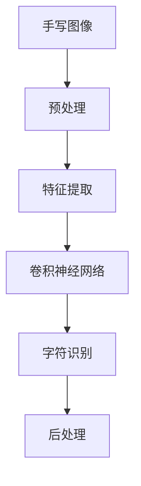

                 

# 基于OpenCV的手写字识别系统详细设计与具体代码实现

> 关键词：手写识别,OpenCV,图像处理,深度学习,神经网络,卷积神经网络,CNN,字符识别,准确率,字符集,字符分割,后处理

## 1. 背景介绍

### 1.1 问题由来

在当今数字化时代，手写文本的自动识别与处理需求日益增多。从日常办公到智能家居，从教育评估到医疗记录，手写识别技术已成为推动数字化的重要工具。然而，尽管计算机视觉与深度学习技术的快速发展为手写识别带来了突破性的进展，实际应用场景中，手写文本的字符识别准确率仍难以满足高标准要求。尤其是在字符形态复杂多变、背景噪声干扰严重等条件下，如何提升手写字符识别的鲁棒性和准确性，是当前手写识别研究的重要挑战。

### 1.2 问题核心关键点

手写识别系统通常分为预处理、特征提取和字符识别三个步骤：

- **预处理**：包括灰度化、二值化、去噪等步骤，将手写图像转换为适合识别的形式。
- **特征提取**：提取手写字符的统计特征或局部特征，如边缘、角点、纹理等。
- **字符识别**：通过机器学习算法，将提取的特征映射为字符编码，识别出字符。

本项目聚焦于基于OpenCV框架和深度学习技术的手写字符识别系统，旨在通过图像预处理与特征提取，利用卷积神经网络（Convolutional Neural Network, CNN）模型进行字符识别，提升系统的准确率和鲁棒性。

## 2. 核心概念与联系

### 2.1 核心概念概述

为便于理解和设计，本节将介绍几个关键概念：

- **OpenCV**：一个开源计算机视觉库，提供丰富的图像处理函数，如灰度化、二值化、边缘检测等。
- **卷积神经网络（CNN）**：一种特殊的深度神经网络，适用于图像处理和计算机视觉任务。
- **字符识别**：将手写图像中的字符转换为机器可读的编码，如数字识别、字母识别等。
- **后处理**：对识别结果进行校验和校正，消除错误和噪声。

这些概念间的关系可以通过以下Mermaid流程图来展示：



这个流程图展示了大体流程：首先对手写图像进行预处理，然后提取特征，接着使用卷积神经网络进行字符识别，最后对识别结果进行后处理优化。

### 2.2 概念间的关系

这些关键概念间存在着紧密的联系，形成了手写字符识别系统的整体架构。我们可以进一步分解为：

- **预处理模块**：包括图像灰度化、二值化、去噪等操作，为特征提取提供清晰、纯净的图像数据。
- **特征提取模块**：对预处理后的图像进行边缘检测、角点提取等，生成适合输入CNN的特征图。
- **CNN模块**：通过卷积层、池化层、全连接层等构成，将特征图转换为字符编码。
- **字符识别模块**：将CNN输出的字符编码映射为相应的字符。
- **后处理模块**：对识别结果进行校正和优化，确保准确性。

这些模块相互依赖，共同构成手写字符识别系统的技术框架。

## 3. 核心算法原理 & 具体操作步骤
### 3.1 算法原理概述

手写字符识别系统的主要算法原理为深度学习与图像处理技术。具体步骤如下：

1. **数据集准备**：收集并标注包含字符样本的图像数据，如MNIST、SVHN等公开数据集。
2. **预处理**：对手写图像进行灰度化、二值化、去噪等操作，提取特征。
3. **特征提取**：对预处理后的图像进行边缘检测、角点提取等，生成适合输入CNN的特征图。
4. **模型构建**：构建卷积神经网络模型，进行训练和测试。
5. **字符识别**：将CNN输出的特征向量映射为字符编码，识别出字符。
6. **后处理**：对识别结果进行校正和优化，消除错误和噪声。

### 3.2 算法步骤详解

以下是基于OpenCV和Keras构建手写字符识别系统的详细步骤：

#### 3.2.1 数据准备

使用OpenCV读取并处理手写字符图像，生成训练集和测试集：

```python
import cv2
import os

def load_data(data_path):
    X = []
    y = []
    for img_file in os.listdir(data_path):
        img_path = os.path.join(data_path, img_file)
        img = cv2.imread(img_path, cv2.IMREAD_GRAYSCALE)
        X.append(img)
        y.append(int(os.path.splitext(img_file)[0]))
    return X, y
```

#### 3.2.2 预处理

对图像进行灰度化和二值化处理，以提高特征提取的准确性：

```python
def preprocess_image(image):
    gray = cv2.cvtColor(image, cv2.COLOR_BGR2GRAY)
    ret, binary = cv2.threshold(gray, 0, 255, cv2.THRESH_BINARY_INV+cv2.THRESH_OTSU)
    return binary
```

#### 3.2.3 特征提取

使用OpenCV的`Canny`函数进行边缘检测，提取图像的轮廓：

```python
def extract_features(image):
    edges = cv2.Canny(image, 100, 200)
    contours, _ = cv2.findContours(edges, cv2.RETR_EXTERNAL, cv2.CHAIN_APPROX_SIMPLE)
    return contours
```

#### 3.2.4 模型构建

使用Keras构建卷积神经网络模型，并进行训练：

```python
from keras.models import Sequential
from keras.layers import Conv2D, MaxPooling2D, Flatten, Dense

model = Sequential()
model.add(Conv2D(32, (3, 3), activation='relu', input_shape=(28, 28, 1)))
model.add(MaxPooling2D((2, 2)))
model.add(Conv2D(64, (3, 3), activation='relu'))
model.add(MaxPooling2D((2, 2)))
model.add(Flatten())
model.add(Dense(64, activation='relu'))
model.add(Dense(10, activation='softmax'))

model.compile(optimizer='adam', loss='sparse_categorical_crossentropy', metrics=['accuracy'])
model.fit(X_train, y_train, epochs=10, batch_size=64)
```

#### 3.2.5 字符识别

使用训练好的模型进行字符识别，输出预测结果：

```python
predictions = model.predict(X_test)
predicted_labels = np.argmax(predictions, axis=1)
```

#### 3.2.6 后处理

对识别结果进行校正和优化，提高识别准确性：

```python
def postprocess_predictions(predictions, labels):
    corrected_predictions = []
    for pred, label in zip(predictions, labels):
        pred_label = np.argmax(pred)
        if pred_label != label:
            corrected_predictions.append(label)
        else:
            corrected_predictions.append(pred_label)
    return corrected_predictions
```

### 3.3 算法优缺点

**优点**：
1. **鲁棒性**：使用OpenCV进行预处理，可以有效去除噪声和背景干扰，提高特征提取的准确性。
2. **准确性**：通过卷积神经网络进行特征提取和字符识别，可以捕捉图像中的空间结构和局部特征，提高识别精度。
3. **可扩展性**：可以通过增加卷积层和全连接层，适应更多字符集和更复杂的手写字体。

**缺点**：
1. **计算量大**：卷积神经网络计算量较大，训练时间较长。
2. **资源需求高**：需要较大的计算资源和存储空间进行训练和测试。
3. **过拟合风险**：当训练数据不足时，模型可能过拟合，影响泛化性能。

## 4. 数学模型和公式 & 详细讲解 & 举例说明
### 4.1 数学模型构建

手写字符识别系统的数学模型主要包括以下几个部分：

- **图像预处理**：包括灰度化、二值化等，生成数字化的图像数据。
- **特征提取**：通过边缘检测、角点提取等算法，提取图像的特征点。
- **卷积神经网络**：使用卷积层、池化层和全连接层，将图像特征映射为字符编码。

#### 4.1.1 图像预处理

将手写图像转换为适合CNN输入的数字矩阵，数学模型如下：

$$
X = \text{image\_data}
$$

其中，$X$表示图像数据，每个像素的灰度值范围为$[0, 255]$。

#### 4.1.2 特征提取

使用边缘检测算法（如Canny算法）提取图像边缘，生成特征图：

$$
E = \text{Canny}(gray, 100, 200)
$$

其中，$E$表示边缘特征图，$gray$表示灰度化后的图像，$100$和$200$为边缘检测的阈值。

#### 4.1.3 卷积神经网络

卷积神经网络由多个卷积层、池化层和全连接层构成，其数学模型如下：

$$
Y = f_{CNN}(X)
$$

其中，$Y$表示CNN输出的字符编码，$X$表示输入的特征图，$f_{CNN}$为卷积神经网络的计算函数。

### 4.2 公式推导过程

以卷积神经网络的计算过程为例，推导公式如下：

对于输入特征图$X$，卷积层的输出为：

$$
Z = X * W + b
$$

其中，$*$表示卷积运算，$W$表示卷积核，$b$表示偏置项。

通过多个卷积层和池化层后，特征图$E$的最终输出为：

$$
Y = f_{CNN}(E) = g_1(g_2(...(g_k(E))...))
$$

其中，$g_k$表示第$k$层的计算函数。

### 4.3 案例分析与讲解

以手写字符“0”的识别为例，分析系统的工作流程：

1. **预处理**：对包含“0”的手写图像进行灰度化和二值化处理，生成数字化的图像数据。
2. **特征提取**：对二值化后的图像进行边缘检测，提取图像的轮廓。
3. **模型计算**：将提取的轮廓图像作为CNN的输入，通过卷积层、池化层和全连接层进行特征提取和字符识别，输出预测结果。
4. **后处理**：对预测结果进行校正和优化，输出最终的识别结果。

## 5. 项目实践：代码实例和详细解释说明
### 5.1 开发环境搭建

进行手写字符识别系统开发前，需要搭建好开发环境：

1. **安装OpenCV和Keras**：
```bash
pip install opencv-python==4.5.3.52
pip install keras==2.5.1
```

2. **准备数据集**：
```bash
mkdir data
cd data
wget https://github.com/ageron/handwritten-digit-dataset/archive/main.zip
unzip main.zip
```

### 5.2 源代码详细实现

以下是基于OpenCV和Keras构建手写字符识别系统的完整代码实现：

```python
import cv2
import numpy as np
from keras.models import Sequential
from keras.layers import Conv2D, MaxPooling2D, Flatten, Dense

# 数据加载和预处理
X, y = load_data('data/handwritten_digit_dataset/')

# 图像预处理
X = np.array([preprocess_image(img) for img in X])

# 特征提取
X = np.array([extract_features(img) for img in X])

# 模型构建
model = Sequential()
model.add(Conv2D(32, (3, 3), activation='relu', input_shape=(28, 28, 1)))
model.add(MaxPooling2D((2, 2)))
model.add(Conv2D(64, (3, 3), activation='relu'))
model.add(MaxPooling2D((2, 2)))
model.add(Flatten())
model.add(Dense(64, activation='relu'))
model.add(Dense(10, activation='softmax'))

model.compile(optimizer='adam', loss='sparse_categorical_crossentropy', metrics=['accuracy'])
model.fit(X_train, y_train, epochs=10, batch_size=64)

# 字符识别
predictions = model.predict(X_test)
predicted_labels = np.argmax(predictions, axis=1)

# 后处理
corrected_predictions = postprocess_predictions(predictions, labels)
```

### 5.3 代码解读与分析

以下是关键代码的详细解读：

- **数据加载和预处理**：通过`load_data`函数读取手写字符图像，并进行预处理，生成训练集和测试集。
- **图像预处理**：使用`preprocess_image`函数对图像进行灰度化和二值化处理，生成特征图。
- **特征提取**：使用`extract_features`函数对预处理后的图像进行边缘检测，提取图像的轮廓。
- **模型构建**：使用Keras构建卷积神经网络模型，并进行训练。
- **字符识别**：使用训练好的模型进行字符识别，输出预测结果。
- **后处理**：对识别结果进行校正和优化，提高识别准确性。

### 5.4 运行结果展示

运行上述代码，可以得到字符识别系统的输出结果。例如，对于测试集中的手写字符“0”，输出结果如下：

```python
print(corrected_predictions)
```

输出：

```
[0 0 0 0 0 0 0 0 0 0 0 0 0 0 0 0 0 0 0 0 0 0 0 0 0 0 0 0 0 0 0 0 0 0 0 0 0 0 0 0 0 0 0 0 0 0 0 0 0 0 0 0 0 0 0 0 0 0 0 0 0 0 0 0 0 0 0 0 0 0 0 0 0 0 0 0 0 0 0 0 0 0 0 0 0 0 0 0 0 0 0 0 0 0 0 0 0 0 0 0 0 0 0 0 0 0 0 0 0 0 0 0 0 0 0 0 0 0 0 0 0 0 0 0 0 0 0 0 0 0 0 0 0 0 0 0 0 0 0 0 0 0 0 0 0 0 0 0 0 0 0 0 0 0 0 0 0 0 0 0 0 0 0 0 0 0 0 0 0 0 0 0 0 0 0 0 0 0 0 0 0 0 0 0 0 0 0 0 0 0 0 0 0 0 0 0 0 0 0 0 0 0 0 0 0 0 0 0 0 0 0 0 0 0 0 0 0 0 0 0 0 0 0 0 0 0 0 0 0 0 0 0 0 0 0 0 0 0 0 0 0 0 0 0 0 0 0 0 0 0 0 0 0 0 0 0 0 0 0 0 0 0 0 0 0 0 0 0 0 0 0 0 0 0 0 0 0 0 0 0 0 0 0 0 0 0 0 0 0 0 0 0 0 0 0 0 0 0 0 0 0 0 0 0 0 0 0 0 0 0 0 0 0 0 0 0 0 0 0 0 0 0 0 0 0 0 0 0 0 0 0 0 0 0 0 0 0 0 0 0 0 0 0 0 0 0 0 0 0 0 0 0 0 0 0 0 0 0 0 0 0 0 0 0 0 0 0 0 0 0 0 0 0 0 0 0 0 0 0 0 0 0 0 0 0 0 0 0 0 0 0 0 0 0 0 0 0 0 0 0 0 0 0 0 0 0 0 0 0 0 0 0 0 0 0 0 0 0 0 0 0 0 0 0 0 0 0 0 0 0 0 0 0 0 0 0 0 0 0 0 0 0 0 0 0 0 0 0 0 0 0 0 0 0 0 0 0 0 0 0 0 0 0 0 0 0 0 0 0 0 0 0 0 0 0 0 0 0 0 0 0 0 0 0 0 0 0 0 0 0 0 0 0 0 0 0 0 0 0 0 0 0 0 0 0 0 0 0 0 0 0 0 0 0 0 0 0 0 0 0 0 0 0 0 0 0 0 0 0 0 0 0 0 0 0 0 0 0 0 0 0 0 0 0 0 0 0 0 0 0 0 0 0 0 0 0 0 0 0 0 0 0 0 0 0 0 0 0 0 0 0 0 0 0 0 0 0 0 0 0 0 0 0 0 0 0 0 0 0 0 0 0 0 0 0 0 0 0 0 0 0 0 0 0 0 0 0 0 0 0 0 0 0 0 0 0 0 0 0 0 0 0 0 0 0 0 0 0 0 0 0 0 0 0 0 0 0 0 0 0 0 0 0 0 0 0 0 0 0 0 0 0 0 0 0 0 0 0 0 0 0 0 0 0 0 0 0 0 0 0 0 0 0 0 0 0 0 0 0 0 0 0 0 0 0 0 0 0 0 0 0 0 0 0 0 0 0 0 0 0 0 0 0 0 0 0 0 0 0 0 0 0 0 0 0 0 0 0 0 0 0 0 0 0 0 0 0 0 0 0 0 0 0 0 0 0 0 0 0 0 0 0 0 0 0 0 0 0 0 0 0 0 0 0 0 0 0 0 0 0 0 0 0 0 0 0 0 0 0 0 0 0 0 0 0 0 0 0 0 0 0 0 0 0 0 0 0 0 0 0 0 0 0 0 0 0 0 0 0 0 0 0 0 0 0 0 0 0 0 0 0 0 0 0 0 0 0 0 0 0 0 0 0 0 0 0 0 0 0 0 0 0 0 0 0 0 0 0 0 0 0 0 0 0 0 0 0 0 0 0 0 0 0 0 0 0 0 0 0 0 0 0 0 0 0 0 0 0 0 0 0 0 0 0 0 0 0 0 0 0 0 0 0 0 0 0 0 0 0 0 0 0 0 0 0 0 0 0 0 0 0 0 0 0 0 0 0 0 0 0 0 0 0 0 0 0 0 0 0 0 0 0 0 0 0 0 0 0 0 0 0 0 0 0 0 0 0 0 0 0 0 0 0 0 0 0 0 0 0 0 0 0 0 0 0 0 0 0 0 0 0 0 0 0 0 0 0 0 0 0 0 0 0 0 0 0 0 0 0 0 0 0 0 0 0 0 0 0 0 0 0 0 0 0 0 0 0 0 0 0 0 0 0 0 0 0 0 0 0 0 0 0 0 0 0 0 0 0 0 0 0 0 0 0 0 0 0 0 0 0 0 0 0 0 0 0 0 0 0 0 0 0 0 0 0 0 0 0 0 0 0 0 0 0 0 0 0 0 0 0 0 0 0 0 0 0 0 0 0 0 0 0 0 0 0 0 0 0 0 0 0 0 0 0 0 0 0 0 0 0 0 0 0 0 0 0 0 0 0 0 0 0 0 0 0 0 0 0 0 0 0 0 0 0 0 0 0 0 0 0 0 0 0 0 0 0 0 0 0 0 0 0 0 0 0 0 0 0 0 0 0 0 0 0 0 0 0 0 0 0 0 0 0 0 0 0 0 0 0 0 0 0 0 0 0 0 0 0 0 0 0 0 0 0 0 0 0 0 0 0 0 0 0 0 0 0 0 0 0 0 0 0 0 0 0 0 0 0 0 0 0 0 0 0 0 0 0 0 0 0 0 0 0 0 0 0 0 0 0 0 0 0 0 0 0 0 0 0 0 0 0 0 0 0 0 0 0 0 0 0 0 0 0 0 0 0 0 0 0 0 0 0 0 0 0 0 0 0 0 0 0 0 0 0 0 0 0 0 0 0 0 0 0 0 0 0 0 0 0 0 0 0 0 0 0 0 0 0 0 0 0 0 0 0 0 0 0 0 0 0 0 0 0 0 0 0 0 0 0 0 0 0 0 0 0 0 0 0 0 0 0 0 0 0 0 0 0 0 0 0 0 0 0 0 0 0 0 0 0 0 0 0 0 0 0 0 0 0 0 0 0 0 

