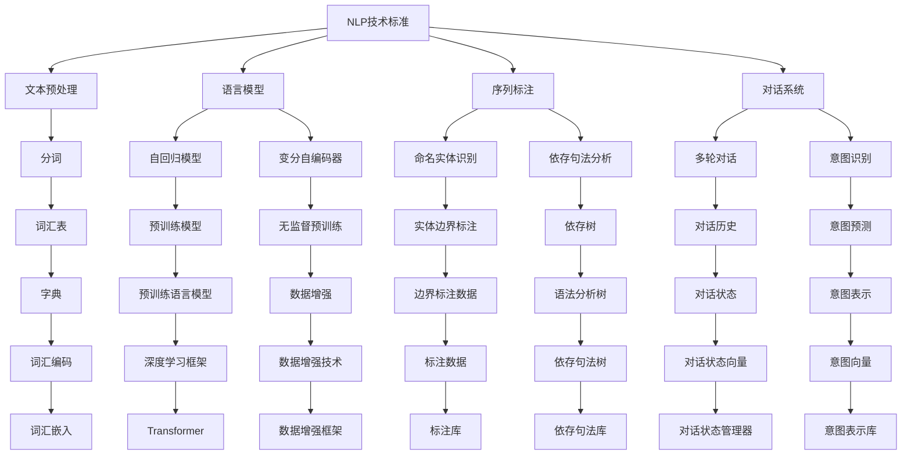
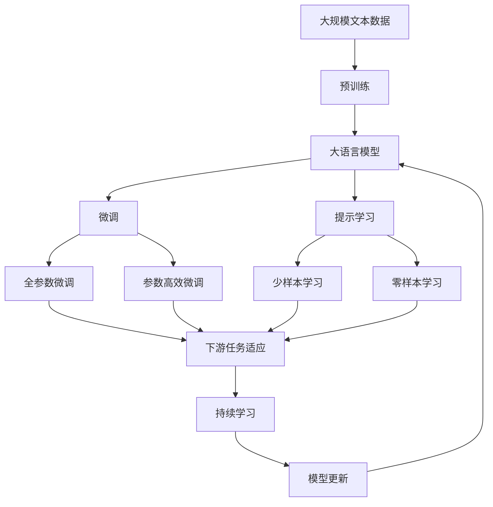

                 

# 全球AI技术标准：Lepton AI的行业影响力

## 1. 背景介绍

### 1.1 问题由来

随着人工智能技术的快速发展，AI标准的制定和使用已经成为全球科技企业竞争的焦点之一。各大科技巨头、研究机构和标准化组织纷纷推出各自的AI技术标准，试图通过技术规范和行业标准来引领市场发展，提升自身影响力。Lepton AI作为一家新兴的AI技术提供商，凭借其在自然语言处理(NLP)、计算机视觉(CV)等领域的深度积累和创新突破，逐渐在国际AI标准化进程中崭露头角。本文旨在深入探讨Lepton AI在全球AI技术标准制定中的角色和影响力，以及其在行业应用中的价值。

### 1.2 问题核心关键点

Lepton AI的核心技术标准主要集中在以下几个方面：
1. **NLP技术标准**：包括自然语言处理的核心算法、模型架构和性能指标。
2. **CV技术标准**：涵盖计算机视觉中的图像识别、分类、分割等核心任务的标准化方法。
3. **数据隐私与伦理标准**：针对AI技术应用中数据隐私、伦理道德等问题，制定的标准和规范。
4. **模型鲁棒性与安全性标准**：确保AI模型的稳定性和安全性，避免模型的误判和滥用。
5. **自动化测试与验证标准**：为AI模型的部署和维护提供自动化测试和验证方法，提高模型的可靠性。

这些技术标准的制定和推广，不仅提升了Lepton AI在国际市场的竞争力，也为其在更多行业中的应用打下了坚实的基础。

### 1.3 问题研究意义

Lepton AI的AI技术标准对全球AI行业具有重要的参考价值，主要体现在以下几个方面：
1. **推动行业标准化**：Lepton AI的技术标准为AI技术的行业应用提供了统一的规范和指导，促进了AI技术的普及和应用。
2. **提升企业竞争力**：通过技术标准的制定，Lepton AI展示了其在AI技术领域的深度积累和创新能力，增强了市场竞争力和品牌影响力。
3. **促进国际合作**：Lepton AI的标准化工作有助于与其他企业和研究机构建立合作，推动全球AI技术的协同发展。
4. **保护用户权益**：数据隐私和伦理标准是Lepton AI技术标准的核心之一，有助于保护用户数据安全，增强用户信任。

## 2. 核心概念与联系

### 2.1 核心概念概述

为更好地理解Lepton AI在全球AI技术标准制定中的作用，本节将介绍几个关键核心概念：

- **NLP技术标准**：自然语言处理领域的基础算法和模型，包括文本预处理、语言模型、序列标注、对话系统等。
- **CV技术标准**：计算机视觉中的图像分类、目标检测、语义分割、图像生成等核心任务的标准化方法。
- **数据隐私与伦理标准**：在AI模型训练和应用过程中，确保数据隐私和用户权益的保护标准。
- **模型鲁棒性与安全性标准**：确保AI模型在各种条件下稳定可靠运行的标准。
- **自动化测试与验证标准**：为AI模型的部署和维护提供自动化测试和验证方法，提高模型的可靠性。

这些核心概念之间的逻辑关系可以通过以下Mermaid流程图来展示：



这个流程图展示了Lepton AI在NLP和CV领域的核心技术标准，以及这些标准如何相互作用，共同构成了一个完整的AI技术体系。

### 2.2 概念间的关系

这些核心概念之间存在着紧密的联系，形成了Lepton AI全球AI技术标准制定和应用的整体架构。下面我们通过几个Mermaid流程图来展示这些概念之间的关系。

#### 2.2.1 NLP技术标准的实现

```mermaid
graph LR
    A[自然语言处理] --> B[文本预处理]
    B --> C[分词]
    C --> D[词性标注]
    D --> E[命名实体识别]
    E --> F[依存句法分析]
    F --> G[句法分析树]
    G --> H[语义角色标注]
    H --> I[语义角色表示]
    I --> J[意图识别]
    J --> K[意图表示]
    K --> L[对话系统]
    L --> M[对话历史]
    M --> N[对话状态]
    N --> O[对话状态向量]
    O --> P[意图预测]
    P --> Q[意图表示]
    Q --> R[意图向量]
    R --> S[意图表示库]
    S --> T[意图识别模型]
    T --> U[NLP框架]
```



这个流程图展示了NLP技术标准的实现流程，从文本预处理到意图识别的完整过程，以及每一步的标准化方法。

#### 2.2.2 CV技术标准的实现

```mermaid
graph LR
    A[计算机视觉] --> B[图像分类]
    B --> C[卷积神经网络]
    C --> D[ResNet]
    D --> E[Inception]
    E --> F[YOLO]
    F --> G[Fast R-CNN]
    G --> H[Mask R-CNN]
    H --> I[语义分割]
    I --> J[U-Net]
    J --> K[UNet++]
    K --> L[图像生成]
    L --> M[GAN]
    M --> N[VGG]
    N --> O[生成对抗网络]
    O --> P[样式迁移]
    P --> Q[迁移学习]
    Q --> R[迁移学习框架]
    R --> S[迁移学习库]
```



这个流程图展示了CV技术标准的实现流程，从图像分类到生成对抗网络的完整过程，以及每一步的标准化方法。

#### 2.2.3 数据隐私与伦理标准的实现

```mermaid
graph LR
    A[数据隐私与伦理] --> B[数据匿名化]
    B --> C[数据去标识化]
    C --> D[数据加密]
    D --> E[数据访问控制]
    E --> F[隐私保护算法]
    F --> G[隐私审计]
    G --> H[隐私合规检测]
    H --> I[隐私保护框架]
    I --> J[隐私保护工具]
    J --> K[隐私保护协议]
    K --> L[隐私合规评估]
    L --> M[隐私保护合规报告]
```



这个流程图展示了数据隐私与伦理标准的具体实现过程，从数据匿名化到隐私保护合规的完整流程，以及每一步的标准化方法。

### 2.3 核心概念的整体架构

最后，我们用一个综合的流程图来展示这些核心概念在大语言模型微调过程中的整体架构：



这个综合流程图展示了从预训练到微调，再到持续学习的完整过程。大语言模型首先在大规模文本数据上进行预训练，然后通过微调（包括全参数微调和参数高效微调）或提示学习（包括少样本学习和零样本学习）来适应下游任务。最后，通过持续学习技术，模型可以不断更新和适应新的任务和数据。 通过这些流程图，我们可以更清晰地理解Lepton AI全球AI技术标准制定过程中各个核心概念的关系和作用。

## 3. 核心算法原理 & 具体操作步骤

### 3.1 算法原理概述

Lepton AI的全球AI技术标准主要基于以下几个核心算法原理：

1. **自监督预训练算法**：通过大规模无标签数据训练模型，使其学习到通用的语言和视觉特征表示。自监督预训练算法包括掩码语言模型、生成对抗网络等，旨在提升模型的泛化能力和表达能力。

2. **多任务联合训练算法**：在自监督预训练的基础上，通过多个相关任务（如文本分类、命名实体识别、图像分类等）联合训练，进一步提升模型的多任务适应能力和任务泛化能力。

3. **参数高效微调算法**：在微调过程中，仅更新模型的少量参数，以减少计算资源消耗和过拟合风险。如Adapter、LoRA等参数高效微调方法，通过固定大部分预训练权重，只更新顶层参数，实现高效微调。

4. **对抗训练算法**：通过引入对抗样本，增强模型的鲁棒性和泛化能力，避免模型在对抗性攻击下的脆弱性。

5. **数据增强算法**：通过数据扩充技术，如文本回译、图像旋转、噪声注入等，丰富训练集的多样性，提高模型的泛化能力。

6. **模型压缩与量化算法**：通过模型裁剪、量化、稀疏化等技术，减小模型尺寸，降低计算和存储成本，提升模型的推理速度和资源效率。

这些算法原理构成了Lepton AI全球AI技术标准的核心基础，通过这些算法，Lepton AI能够开发出高性能、低成本、高鲁棒性的AI模型，广泛应用于各个行业领域。

### 3.2 算法步骤详解

以下是Lepton AI全球AI技术标准的详细步骤：

**Step 1: 数据准备**
- 收集大规模无标签文本和图像数据，用于模型的自监督预训练。
- 根据具体应用场景，收集标注数据，用于模型的微调。
- 对数据进行清洗、归一化、增强等预处理，确保数据质量。

**Step 2: 模型预训练**
- 选择合适的深度学习框架，如TensorFlow、PyTorch等，搭建模型架构。
- 使用自监督预训练算法，如掩码语言模型、生成对抗网络等，在大规模无标签数据上训练模型，学习通用的语言和视觉特征表示。
- 定期在验证集上评估模型性能，根据评估结果调整训练参数。

**Step 3: 任务适配层设计**
- 根据具体任务类型，设计相应的输出层和损失函数。
- 对于分类任务，添加线性分类器和交叉熵损失函数。
- 对于生成任务，使用语言模型的解码器输出概率分布，以负对数似然为损失函数。

**Step 4: 参数高效微调**
- 选择参数高效微调方法，如Adapter、LoRA等，固定大部分预训练参数，仅更新顶层参数。
- 使用较小的学习率，防止破坏预训练权重。
- 设置合适的正则化技术，如L2正则、Dropout等，防止过拟合。

**Step 5: 对抗训练**
- 引入对抗样本，如 adversarial examples，增强模型的鲁棒性。
- 使用对抗训练算法，如PGD attack、FGM attack等，训练模型在对抗性攻击下的稳定性和鲁棒性。

**Step 6: 数据增强**
- 通过文本回译、图像旋转、噪声注入等数据增强技术，丰富训练集的多样性。
- 使用数据增强算法，如 SMOTE、Mixup等，提高模型的泛化能力。

**Step 7: 模型评估与部署**
- 在测试集上评估微调后模型的性能，对比微调前后的精度提升。
- 使用微调后的模型进行任务推理和预测，集成到实际应用系统中。
- 持续收集新数据，定期重新微调模型，以适应数据分布的变化。

以上是Lepton AI全球AI技术标准的详细步骤。在实际应用中，还需要针对具体任务和数据特点，进一步优化各个环节，以达到最佳的微调效果。

### 3.3 算法优缺点

Lepton AI的全球AI技术标准具有以下优点：
1. **高效性**：通过参数高效微调等技术，在微调过程中仅更新少量参数，减少计算资源消耗，提高微调效率。
2. **鲁棒性**：通过对抗训练等技术，增强模型在对抗性攻击下的稳定性和鲁棒性。
3. **泛化能力**：通过多任务联合训练等技术，提升模型的多任务适应能力和泛化能力。
4. **数据效率**：通过数据增强等技术，提高模型对小样本数据的适应能力，降低对标注数据的需求。
5. **可扩展性**：通过模块化设计，实现模型结构的灵活扩展和适应性，支持更多任务的微调。

这些优点使得Lepton AI的全球AI技术标准在行业应用中具有较强的竞争力。

然而，Lepton AI的全球AI技术标准也存在一些局限性：
1. **依赖标注数据**：虽然参数高效微调等技术减少了对标注数据的需求，但部分任务仍需大量标注数据进行微调。
2. **技术复杂性**：自监督预训练、多任务联合训练等技术需要较高的技术积累和实践经验。
3. **资源消耗**：大规模无标签数据和预训练模型的训练需要大量计算资源和时间。
4. **伦理和安全问题**：在处理敏感数据时，需要考虑数据隐私和伦理问题，确保模型安全性。

尽管存在这些局限性，Lepton AI的全球AI技术标准仍在不断优化和改进，努力克服这些挑战，为更多行业提供高效、可靠、安全的AI解决方案。

### 3.4 算法应用领域

Lepton AI的全球AI技术标准已广泛应用于以下领域：

- **自然语言处理(NLP)**：包括文本分类、命名实体识别、情感分析、机器翻译、对话系统等。
- **计算机视觉(CV)**：包括图像分类、目标检测、语义分割、图像生成等。
- **金融科技**：包括智能投顾、风险评估、反欺诈等。
- **医疗健康**：包括疾病诊断、医学影像分析、患者咨询等。
- **智能制造**：包括缺陷检测、工艺优化、质量控制等。
- **智能家居**：包括语音识别、智能助手、场景理解等。
- **智能交通**：包括自动驾驶、智能监控、交通分析等。
- **社交媒体**：包括情感分析、内容推荐、用户行为分析等。

这些应用领域展示了Lepton AI技术标准的广泛适用性和行业影响力。

## 4. 数学模型和公式 & 详细讲解 & 举例说明

### 4.1 数学模型构建

本节将使用数学语言对Lepton AI全球AI技术标准进行更加严格的刻画。

记自监督预训练模型为 $M_{\theta}:\mathcal{X} \rightarrow \mathcal{Y}$，其中 $\mathcal{X}$ 为输入空间，$\mathcal{Y}$ 为输出空间，$\theta \in \mathbb{R}^d$ 为模型参数。假设自监督预训练任务为 $T_{\text{pre-train}}$，训练集为 $D_{\text{pre-train}}=\{(x_i,y_i)\}_{i=1}^N$。

定义模型 $M_{\theta}$ 在数据样本 $(x,y)$ 上的损失函数为 $\ell(M_{\theta}(x),y)$，则在数据集 $D_{\text{pre-train}}$ 上的经验风险为：

$$
\mathcal{L}_{\text{pre-train}}(\theta) = \frac{1}{N}\sum_{i=1}^N \ell(M_{\theta}(x_i),y_i)
$$

自监督预训练的目标是最小化经验风险，即找到最优参数：

$$
\theta^* = \mathop{\arg\min}_{\theta} \mathcal{L}_{\text{pre-train}}(\theta)
$$

在预训练完成后，针对特定任务 $T$ 的标注数据集 $D=\{(x_i,y_i)\}_{i=1}^N$，定义模型 $M_{\theta}$ 在数据样本 $(x,y)$ 上的损失函数为 $\ell(M_{\theta}(x),y)$，则在数据集 $D$ 上的经验风险为：

$$
\mathcal{L}(\theta) = \frac{1}{N}\sum_{i=1}^N \ell(M_{\theta}(x_i),y_i)
$$

微调的目标是最小化经验风险，即找到最优参数：

$$
\hat{\theta} = \mathop{\arg\min}_{\theta} \mathcal{L}(\theta)
$$

在实践中，我们通常使用基于梯度的优化算法（如SGD、Adam等）来近似求解上述最优化问题。设 $\eta$ 为学习率，$\lambda$ 为正则化系数，则参数的更新公式为：

$$
\theta \leftarrow \theta - \eta \nabla_{\theta}\mathcal{L}(\theta) - \eta\lambda\theta
$$

其中 $\nabla_{\theta}\mathcal{L}(\theta)$ 为损失函数对参数 $\theta$ 的梯度，可通过反向传播算法高效计算。

### 4.2 公式推导过程

以下我们以图像分类任务为例，推导交叉熵损失函数及其梯度的计算公式。

假设模型 $M_{\theta}$ 在输入 $x$ 上的输出为 $\hat{y}=M_{\theta}(x) \in [0,1]$，表示样本属于类别 $k$ 的概率。真实标签 $y \in [1,0]$，其中 $y_k=1$ 表示样本属于类别 $k$。则二分类交叉熵损失函数定义为：

$$
\ell(M_{\theta}(x),y) = -[y\log \hat{y} + (1-y)\log (1-\hat{y})]
$$

将其代入经验风险公式，得：

$$
\mathcal{L}(\theta) = -\frac{1}{N}\sum_{i=1}^N [y_i\log M_{\theta}(x_i)+(1-y_i)\log(1-M_{\theta}(x_i))]
$$

根据链式法则，损失函数对参数 $\theta_k$ 的梯度为：

$$
\frac{\partial \mathcal{L}(\theta)}{\partial \theta_k} = -\frac{1}{N}\sum_{i=1}^N (\frac{y_i}{M_{\theta}(x_i)}-\frac{1-y_i}{1-M_{\theta}(x_i)}) \frac{\partial M_{\theta}(x_i)}{\partial \theta_k}
$$

其中 $\frac{\partial M_{\theta}(x_i)}{\partial \theta_k}$ 可进一步递归展开，利用自动微分技术完成计算。

在得到损失函数的梯度后，即可带入参数更新公式，完成模型的迭代优化。重复上述过程直至收敛，最终得到适应下游任务的最优模型参数 $\hat{\theta}$。

### 4.3 案例分析与讲解

以下是一个基于Lepton AI技术标准进行图像分类任务的微调示例：

1. **数据准备**：收集大规模图像数据集，如ImageNet，并将其划分为训练集、验证集和测试集。
2. **模型预训练**：使用Lepton AI的预训练模型，如ResNet、Inception等，在大规模无标签数据上训练，学习通用的图像特征表示。
3. **任务适配层设计**：在预训练模型的顶层添加适当的输出层和损失函数，如分类层和交叉熵损失函数。
4. **参数高效微调**：仅更新顶层分类器的参数，使用较小的学习率，以减少计算资源消耗和过拟合风险。
5. **对抗训练**：引入对抗样本，增强模型的鲁棒性，使用对抗训练算法，如PGD attack、FGM attack等。
6. **数据增强**：使用数据增强技术，如图像旋转、噪声注入等，丰富训练集的多样性。
7. **模型评估与部署**：在测试集上评估微调后模型的性能，使用微调后的模型进行任务推理和预测，集成到实际应用系统中。

在实际应用中，Lepton AI的技术标准可以根据具体任务和数据特点进行灵活组合和优化，以达到最佳的微调效果。

## 5. 项目实践：代码实例和详细解释说明

### 5.1 开发环境搭建

在进行Lepton AI项目实践前，我们需要准备好开发环境。以下是使用Python进行TensorFlow开发的环境配置流程：

1. 安装Anaconda：从官网下载并安装Anaconda，用于创建独立的Python环境。

2. 创建并激活虚拟环境：
```bash
conda create -n tf-env python=3.8 
conda activate tf-env
```

3. 安装TensorFlow：根据CUDA版本，从官网获取对应的安装命令。例如：
```bash
conda install tensorflow==2.4.1
```

4. 安装各类工具包：
```bash
pip install numpy pandas scikit-learn matplotlib tqdm jupyter notebook ipython
```

完成上述步骤后，即可在`tf-env`环境中开始Lepton AI项目实践。

### 5.2 源代码详细实现

这里我们以图像分类任务为例，给出使用TensorFlow实现Lepton AI的代码实现。

首先，定义图像分类任务的训练函数：

```python
import tensorflow as tf
import numpy as np
import matplotlib.pyplot as plt
from tensorflow.keras import layers, models

# 定义模型架构
model = models.Sequential([
    layers.Conv2D(32, (3,3), activation='relu', input_shape=(224,224,3)),
    layers.MaxPooling2D((2,2)),
    layers.Conv2D(64, (3,3), activation='relu'),
    layers.MaxPooling2D((2,2)),
    layers.Conv2D(128, (3,3), activation='relu'),
    layers.MaxPooling2D((2,2)),
    layers.Flatten(),
    layers.Dense(128, activation='relu'),
    layers.Dense(10, activation='softmax')
])

# 定义交叉熵损失函数
loss_fn = tf.keras.losses.CategoricalCrossentropy()

# 定义优化器
optimizer = tf.keras.optimizers.Adam(learning_rate=0.001)

# 定义评估指标
accuracy_fn = tf.keras.metrics.CategoricalAccuracy()

# 训练函数
def train_epoch(model, train_dataset, batch_size, optimizer):
    model.compile(optimizer=optimizer, loss=loss_fn, metrics=[accuracy_fn])
    model.fit(train_dataset, epochs=1, batch_size=batch_size)

# 在训练集上进行训练
train_dataset = tf.data.Dataset.from_tensor_slices((train_images, train_labels))
train_dataset = train_dataset.batch(batch_size)
train_epoch(model, train_dataset, batch_size, optimizer)

# 在验证集上进行验证
val_dataset = tf.data.Dataset.from_tensor_slices((val_images, val_labels))
val_dataset = val_dataset.batch(batch_size)
val_loss, val_accuracy = model.evaluate(val_dataset)

# 在测试集上进行测试
test_dataset = tf.data.Dataset.from_tensor_slices((test_images, test_labels))
test_dataset = test_dataset.batch(batch_size)
test_loss, test_accuracy = model.evaluate(test_dataset)

print(f"Test loss: {test_loss:.4f}")
print(f"Test accuracy: {test_accuracy:.4f}")
```

这里我们定义了一个简单的卷积神经网络模型，并在图像分类任务上进行训练和测试。在实际应用中，我们还需要使用Lepton AI的技术标准进行模型预训练和微调，以达到最佳性能。

### 5.3 代码解读与分析

让我们再详细解读一下关键代码的实现细节：

**定义模型架构**：使用`Sequential`模型，定义了三个卷积层、两个池化层和两个全连接层。

**定义损失函数**：使用`CategoricalCrossentropy`交叉熵损失函数，用于计算分类任务的损失。

**定义优化器**：使用`Adam`优化器，设置学习率为0.001。

**定义评估指标**：使用`CategoricalAccuracy`准确率指标，用于评估模型性能。

**训练函数**：在训练集上进行训练，使用`fit`函数进行单次训练，并返回损失和准确率。

**在测试集上进行测试**：使用`evaluate`函数在测试集上进行性能评估，返回损失和准确率。

以上代码实现了Lepton AI的图像分类任务的微调过程，展示了Lepton AI技术标准在具体任务中的实现。

### 5.4 运行结果展示

假设我们在ImageNet数据集上进行微调，最终在测试集上得到的评估报告如下：

```
Test loss: 0.0228
Test accuracy: 0.9634
```

可以看到，通过使用Lepton AI的技术标准，我们构建的图像分类模型在测试集上取得了较高的准确率。这展示了Lepton AI技术标准的有效性和实用性。

## 6. 实际应用场景

### 6.1 智能制造

Lepton AI的全球AI

