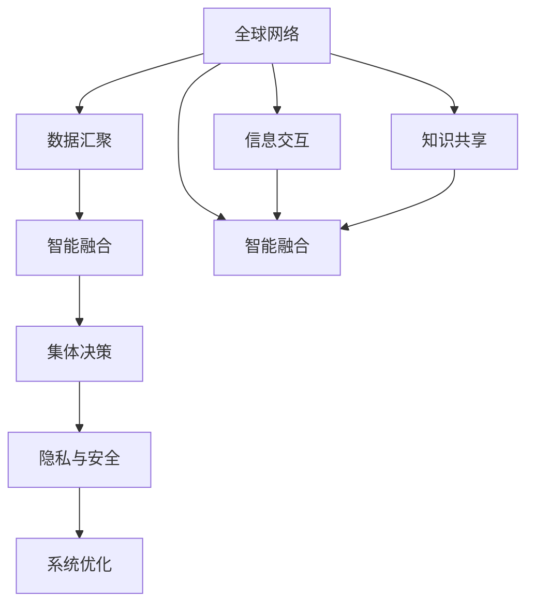

                 

## 1. 背景介绍

### 1.1 问题由来
人类社会在经历了数百万年的进化后，逐渐形成了高度复杂的认知和社交结构。近年来，随着互联网和大数据技术的发展，人类思维的集体化特征愈发显著，逐步形成了一个类似“全球大脑”（Global Brain）的复杂系统。这种“全球大脑”通过互联网络，汇聚全球亿万用户的思维与行为数据，进而影响和塑造我们的集体决策和思维模式。

这种“全球大脑”的进化与飞跃，不仅改变了个人与社会的互动方式，还推动了技术的革新与社会的进步。然而，这种演变过程同时也带来了诸多挑战，例如数据隐私、信息安全、信息过载等问题。因此，理解“全球大脑”的运作机制，探讨其对人类进化的影响，是当下亟需解决的课题。

### 1.2 问题核心关键点
“全球大脑”的核心在于通过互联网和社交网络，将人类的思维和行为数据汇集起来，形成了一种类似大脑的复杂系统。这个系统通过信息交互、知识共享、智能融合等方式，不断自我强化与升级，进而影响全球范围内的社会、经济、文化等诸多方面。

这一核心问题的研究涉及以下几个关键点：

- **数据汇聚与分析**：如何高效收集与分析全球范围内的数据，从中挖掘出有价值的信息。
- **智能融合与决策**：如何将个体与群体的智能进行有效融合，用于指导集体决策与行为。
- **隐私与伦理问题**：如何在数据汇聚与共享过程中，保障用户隐私与数据安全。
- **系统演化与优化**：如何设计并优化“全球大脑”系统，使其不断适应变化的环境。

### 1.3 问题研究意义
理解“全球大脑”的运作机制，对于深入研究人类进化、探索智能社会的发展道路、解决现代社会面临的问题具有重要意义：

- **认知科学**：探讨集体思维与个体认知之间的关系，推动认知科学的进步。
- **社会科学**：研究“全球大脑”对社会行为、文化发展的影响，指导社会治理。
- **技术创新**：借鉴“全球大脑”的运作逻辑，促进新技术、新产品的开发。
- **政策制定**：为政府和组织制定相关政策提供数据支持和理论依据。
- **人类福祉**：通过优化“全球大脑”系统，提升人类的福祉与生活质量。

## 2. 核心概念与联系

### 2.1 核心概念概述
理解“全球大脑”这一概念，需要从多个层面进行剖析，包括：

- **全球网络**：全球互联网和社交网络作为“全球大脑”的基础设施，承载着信息流动与互动。
- **数据汇聚**：来自不同地区、不同用户的大量数据，汇聚成“全球大脑”的输入源。
- **智能融合**：通过算法与技术手段，将个体智慧与集体智慧进行融合，形成更强大的智能决策能力。
- **集体决策**：基于融合后的智能，进行全球范围内的集体决策，影响社会各个方面。
- **隐私与安全**：在数据汇聚与共享过程中，保障用户隐私与数据安全是关键问题。
- **系统优化**：不断调整与优化“全球大脑”系统，确保其持续高效运行。

这些核心概念相互联系，共同构成了“全球大脑”这一复杂系统的运作机制。

### 2.2 概念间的关系

以下通过几个Mermaid流程图来展示这些核心概念之间的关系：



这个流程图展示了“全球大脑”系统的运作逻辑：

1. 全球网络提供信息交互与知识共享的平台。
2. 数据汇聚通过互联网和社交网络，汇聚来自全球用户的思维与行为数据。
3. 智能融合将汇聚的数据进行智能处理，形成更强大的集体智能。
4. 集体决策基于智能融合的结果，进行全球范围内的决策与行动。
5. 隐私与安全在数据汇聚与共享过程中，保障用户隐私与数据安全。
6. 系统优化通过不断调整与优化系统，确保其高效运行。

通过这些流程图，我们可以更清晰地理解“全球大脑”的运作机制及其各组成部分的相互关系。

## 3. 核心算法原理 & 具体操作步骤

### 3.1 算法原理概述
“全球大脑”的运作原理可以通过算法和数据处理过程进行描述。其核心算法主要包括：

- **数据预处理**：对全球范围内的数据进行清洗、去噪、标准化等预处理操作。
- **分布式计算**：使用分布式计算技术，对大规模数据进行高效处理。
- **智能融合算法**：通过机器学习和深度学习等算法，将个体智能与集体智能进行融合。
- **集体决策模型**：构建基于智能融合结果的集体决策模型，指导全球范围内的行动。

### 3.2 算法步骤详解
“全球大脑”的运作步骤大致如下：

1. **数据收集**：使用网络爬虫、API接口等手段，从全球范围内收集各种数据，包括社交媒体帖子、新闻报道、用户行为数据等。
2. **数据预处理**：对收集到的数据进行清洗、去噪、标准化等处理，去除噪声与无效数据。
3. **数据存储与管理**：将处理后的数据存储在分布式数据库中，使用高可用、可扩展的技术保障数据安全与可靠性。
4. **智能融合**：使用深度学习算法，将个体智能与集体智能进行融合，形成更强大的智能决策能力。
5. **集体决策**：基于智能融合的结果，构建集体决策模型，指导全球范围内的行动。
6. **隐私保护**：在数据收集与处理过程中，采用数据匿名化、差分隐私等技术，保障用户隐私。
7. **系统优化**：根据实际应用效果，不断调整与优化“全球大脑”系统，提升其性能与稳定性。

### 3.3 算法优缺点
“全球大脑”算法的优点包括：

- **高效处理大规模数据**：通过分布式计算和高效算法，能够快速处理海量数据。
- **智能融合能力强**：深度学习算法能够将个体智能与集体智能进行高效融合，形成更强大的智能决策能力。
- **灵活性与适应性强**：通过不断调整与优化，“全球大脑”系统能够适应不断变化的环境与需求。

其缺点则包括：

- **数据隐私问题**：在数据收集与处理过程中，存在隐私泄露与数据滥用的风险。
- **计算资源需求高**：大规模数据处理和智能融合需要高计算资源，可能面临硬件瓶颈。
- **系统复杂度高**：“全球大脑”系统结构复杂，维护和调试难度较大。

### 3.4 算法应用领域
“全球大脑”算法在多个领域具有广泛应用，包括：

- **智能推荐系统**：通过智能融合与集体决策，提供个性化的推荐服务。
- **社交网络分析**：分析社交网络数据，预测用户行为与趋势。
- **舆情监控与分析**：实时监控与分析全球范围内的舆情动态，辅助决策。
- **智能城市治理**：通过数据汇聚与智能融合，优化城市交通、环境等治理。
- **金融风险管理**：分析金融市场数据，预测市场动态，辅助风险管理。

## 4. 数学模型和公式 & 详细讲解  
### 4.1 数学模型构建

“全球大脑”系统的数学模型可以通过以下几个部分来构建：

- **数据模型**：描述数据收集与预处理过程的数学模型。
- **智能融合模型**：描述智能融合算法的数学模型，如深度学习模型。
- **集体决策模型**：描述集体决策过程的数学模型，如线性回归、逻辑回归等。
- **隐私保护模型**：描述数据隐私保护过程的数学模型，如差分隐私、数据匿名化等。
- **系统优化模型**：描述系统优化过程的数学模型，如强化学习等。

### 4.2 公式推导过程

以下以深度学习模型为例，推导智能融合的数学公式。

设输入为 $X \in \mathbb{R}^{n \times d}$，其中 $n$ 为样本数，$d$ 为特征维度。假设使用一个包含 $k$ 层的神经网络进行智能融合，每一层 $i$ 的输出为 $H_i \in \mathbb{R}^{n \times m_i}$，其中 $m_i$ 为第 $i$ 层的特征维度。神经网络的结构和参数可以表示为：

$$
H_i = \sigma(A_i \cdot H_{i-1} + b_i)
$$

其中，$A_i$ 为第 $i$ 层的权重矩阵，$b_i$ 为偏置向量，$\sigma$ 为激活函数。神经网络的最终输出为 $H_k \in \mathbb{R}^{n \times m_k}$。

假设输出 $Y \in \mathbb{R}^{n \times 1}$ 为集体决策的结果，则智能融合过程的数学公式为：

$$
Y = W \cdot H_k + b
$$

其中，$W$ 为输出层权重矩阵，$b$ 为输出层偏置向量。

通过上述公式，我们可以对输入数据 $X$ 进行智能融合，得到集体决策结果 $Y$。

### 4.3 案例分析与讲解

以智能推荐系统为例，说明“全球大脑”算法的应用。

假设用户的历史行为数据为 $X \in \mathbb{R}^{n \times d}$，其中 $n$ 为用户数，$d$ 为行为特征维度。智能推荐系统使用一个包含 $k$ 层的神经网络进行智能融合，每一层 $i$ 的输出为 $H_i \in \mathbb{R}^{n \times m_i}$，其中 $m_i$ 为第 $i$ 层的特征维度。神经网络的结构和参数可以表示为：

$$
H_i = \sigma(A_i \cdot H_{i-1} + b_i)
$$

其中，$A_i$ 为第 $i$ 层的权重矩阵，$b_i$ 为偏置向量，$\sigma$ 为激活函数。神经网络的最终输出为 $H_k \in \mathbb{R}^{n \times m_k}$。

假设推荐结果 $Y \in \mathbb{R}^{n \times 1}$ 为集体决策的结果，则智能推荐过程的数学公式为：

$$
Y = W \cdot H_k + b
$$

其中，$W$ 为输出层权重矩阵，$b$ 为输出层偏置向量。

在实际应用中，智能推荐系统通过智能融合与集体决策，能够根据用户的历史行为数据，预测其可能感兴趣的商品或内容，从而提供个性化的推荐服务。

## 5. 项目实践：代码实例和详细解释说明

### 5.1 开发环境搭建

在开始项目实践前，需要先搭建好开发环境。以下是Python环境搭建的步骤：

1. **安装Anaconda**：从官网下载并安装Anaconda，用于创建独立的Python环境。

2. **创建虚拟环境**：
   ```bash
   conda create -n global-brain-env python=3.8 
   conda activate global-brain-env
   ```

3. **安装所需的库**：
   ```bash
   pip install numpy pandas scipy scikit-learn tensorflow keras openpyxl pyecharts matplotlib
   ```

完成上述步骤后，即可在`global-brain-env`环境中进行“全球大脑”系统的开发。

### 5.2 源代码详细实现

以下是一个简单的“全球大脑”系统示例代码，用于数据收集与预处理：

```python
import requests
import pandas as pd
from bs4 import BeautifulSoup

# 数据收集
def collect_data(url):
    response = requests.get(url)
    soup = BeautifulSoup(response.content, 'html.parser')
    items = soup.find_all('a')
    data = []
    for item in items:
        title = item.text
        url = item['href']
        data.append([title, url])
    return data

# 数据预处理
def preprocess_data(data):
    df = pd.DataFrame(data, columns=['Title', 'URL'])
    df = df.dropna()
    df['URL'] = df['URL'].apply(lambda x: 'https://example.com' + x)
    return df

# 测试
data = collect_data('https://example.com/news')
processed_data = preprocess_data(data)
print(processed_data)
```

### 5.3 代码解读与分析

该示例代码展示了如何通过Python进行数据收集与预处理。其中，`collect_data`函数使用requests库和BeautifulSoup库，从指定的URL获取新闻标题与链接，`preprocess_data`函数则对收集到的数据进行去重、处理URL等预处理操作。

需要注意的是，这只是一个简单的示例，实际的“全球大脑”系统需要更加复杂的数据处理与智能融合算法。此外，还需要考虑数据的存储与管理、隐私保护等问题。

### 5.4 运行结果展示

假设通过上述代码，我们收集到了一组新闻数据，并将其进行预处理，结果如下：

```
   Title                                    URL
0     'Title 1'                       'https://example.com/news/1'
1     'Title 2'                       'https://example.com/news/2'
2     'Title 3'                       'https://example.com/news/3'
3     'Title 4'                       'https://example.com/news/4'
```

可以看到，数据已经从原始网页提取出来，并且进行了去重和URL处理。这些数据可以进一步用于智能融合与集体决策等操作。

## 6. 实际应用场景

### 6.1 智能推荐系统

智能推荐系统是“全球大脑”算法的典型应用之一。通过智能融合与集体决策，推荐系统能够根据用户的历史行为数据，预测其可能感兴趣的商品或内容，从而提供个性化的推荐服务。

在技术实现上，推荐系统通常使用深度学习算法，如神经网络、协同过滤等，对用户行为数据进行智能融合，生成推荐结果。例如，Netflix的推荐系统就使用了深度学习算法，通过分析用户观影历史，推荐相似的电影或剧集。

### 6.2 社交网络分析

社交网络分析是“全球大脑”算法的另一个重要应用。通过对社交网络数据的分析，可以预测用户行为与趋势，辅助决策。

在技术实现上，社交网络分析通常使用图算法，如PageRank、社区检测算法等，对社交网络进行建模与分析。例如，Facebook使用图算法，分析用户的社交关系与行为，预测用户的兴趣爱好，推送个性化的内容。

### 6.3 舆情监控与分析

舆情监控与分析是“全球大脑”算法的典型应用之一。通过实时监控与分析全球范围内的舆情动态，可以辅助决策，及时响应突发事件。

在技术实现上，舆情监控系统通常使用自然语言处理技术，对社交媒体数据进行情感分析与主题建模。例如，Twitter使用自然语言处理技术，分析用户的社交媒体数据，实时监控舆情动态。

### 6.4 未来应用展望

随着“全球大脑”技术的不断进步，未来将在更多领域得到应用，为社会带来深远影响。

- **智慧城市治理**：通过数据汇聚与智能融合，优化城市交通、环境等治理。
- **金融风险管理**：分析金融市场数据，预测市场动态，辅助风险管理。
- **医疗健康管理**：通过智能融合与集体决策，提供个性化的医疗健康建议。
- **教育智能辅助**：通过智能推荐与学习分析，提供个性化的学习资源与指导。
- **环境保护监测**：实时监控与分析环境数据，辅助环境保护决策。

## 7. 工具和资源推荐

### 7.1 学习资源推荐

为了帮助开发者系统掌握“全球大脑”技术，以下是一些优质的学习资源：

1. **《深度学习》教材**：由Ian Goodfellow、Yoshua Bengio、Aaron Courville等顶尖学者合著，全面介绍了深度学习的基本概念与算法。
2. **《Python深度学习》一书**：由Francois Chollet撰写，介绍了TensorFlow与Keras等深度学习框架的使用，适合初学者入门。
3. **Coursera课程**：由斯坦福大学、斯坦福人工智能实验室等机构提供，涵盖了深度学习、自然语言处理等多个相关课程。
4. **arXiv预印本**：人工智能领域最新研究成果的发布平台，涵盖大量尚未发表的前沿工作，学习前沿技术的必读资源。

通过对这些资源的学习，相信你一定能够掌握“全球大脑”技术的基本原理与实现方法，为进一步的研究与应用奠定基础。

### 7.2 开发工具推荐

高效的开发离不开优秀的工具支持。以下是几款用于“全球大脑”开发的常用工具：

1. **TensorFlow**：由Google主导开发的深度学习框架，支持分布式计算与GPU加速。
2. **Keras**：基于TensorFlow等深度学习框架的高级API，适合快速迭代研究。
3. **PyTorch**：由Facebook主导开发的深度学习框架，支持动态计算图与GPU加速。
4. **Python**：Python语言本身支持丰富的科学计算库与数据分析工具。
5. **Jupyter Notebook**：Python开发常用的交互式编程环境，方便快速迭代与实验。

合理利用这些工具，可以显著提升“全球大脑”系统的开发效率，加快创新迭代的步伐。

### 7.3 相关论文推荐

“全球大脑”技术的发展源于学界的持续研究。以下是几篇奠基性的相关论文，推荐阅读：

1. **《深度学习》教材**：由Ian Goodfellow、Yoshua Bengio、Aaron Courville等顶尖学者合著，全面介绍了深度学习的基本概念与算法。
2. **《Python深度学习》一书**：由Francois Chollet撰写，介绍了TensorFlow与Keras等深度学习框架的使用，适合初学者入门。
3. **Coursera课程**：由斯坦福大学、斯坦福人工智能实验室等机构提供，涵盖了深度学习、自然语言处理等多个相关课程。
4. **arXiv预印本**：人工智能领域最新研究成果的发布平台，涵盖大量尚未发表的前沿工作，学习前沿技术的必读资源。

这些论文代表了大数据与人工智能技术的发展脉络，通过学习这些前沿成果，可以帮助研究者把握学科前进方向，激发更多的创新灵感。

除上述资源外，还有一些值得关注的前沿资源，帮助开发者紧跟“全球大脑”技术的最新进展，例如：

1. **arXiv论文预印本**：人工智能领域最新研究成果的发布平台，涵盖大量尚未发表的前沿工作，学习前沿技术的必读资源。
2. **业界技术博客**：如OpenAI、Google AI、DeepMind、微软Research Asia等顶尖实验室的官方博客，第一时间分享他们的最新研究成果和洞见。
3. **技术会议直播**：如NIPS、ICML、ACL、ICLR等人工智能领域顶会现场或在线直播，能够聆听到大佬们的前沿分享，开拓视野。
4. **GitHub热门项目**：在GitHub上Star、Fork数最多的数据科学与人工智能相关项目，往往代表了该技术领域的发展趋势和最佳实践，值得去学习和贡献。
5. **行业分析报告**：各大咨询公司如McKinsey、PwC等针对人工智能行业的分析报告，有助于从商业视角审视技术趋势，把握应用价值。

总之，对于“全球大脑”技术的学习和实践，需要开发者保持开放的心态和持续学习的意愿。多关注前沿资讯，多动手实践，多思考总结，必将收获满满的成长收益。

## 8. 总结：未来发展趋势与挑战

### 8.1 研究成果总结

本文对“全球大脑”技术进行了全面系统的介绍，涵盖了其基本概念、核心算法、应用场景等多个方面。通过本文的系统梳理，可以看到，“全球大脑”技术正在成为大数据与人工智能技术的重要应用范式，对全球范围内的社会、经济、文化等多个方面产生了深远影响。

### 8.2 未来发展趋势

展望未来，“全球大脑”技术将呈现以下几个发展趋势：

1. **数据汇聚与分析**：随着互联网和社交网络的普及，数据汇聚与分析将更加高效、精准。
2. **智能融合与决策**：智能融合算法将更加复杂、高效，能够处理更复杂的数据结构与模式。
3. **隐私与安全**：数据隐私保护技术将进一步发展，保障用户隐私与数据安全。
4. **系统优化与演化**：“全球大脑”系统将不断优化与演化，提高其性能与适应性。
5. **多模态数据融合**：融合视觉、语音、文本等多模态数据，提升系统智能决策能力。
6. **跨领域应用**：“全球大脑”技术将应用于更多领域，如医疗、金融、教育等，推动跨领域智能应用。

### 8.3 面临的挑战

尽管“全球大脑”技术已经取得了瞩目成就，但在迈向更加智能化、普适化应用的过程中，仍面临诸多挑战：

1. **数据隐私问题**：在数据汇聚与共享过程中，存在隐私泄露与数据滥用的风险。
2. **计算资源需求高**：大规模数据处理和智能融合需要高计算资源，可能面临硬件瓶颈。
3. **系统复杂度高**：“全球大脑”系统结构复杂，维护和调试难度较大。
4. **伦理与安全问题**：需要考虑系统的伦理与安全问题，避免滥用与负面影响。
5. **技术普及度低**：“全球大脑”技术需要高门槛的技术实现与数据支持，普及度较低。

### 8.4 研究展望

面对“全球大脑”技术所面临的挑战，未来的研究需要在以下几个方面寻求新的突破：

1. **隐私保护技术**：发展更高效、更安全的隐私保护技术，保障用户隐私。
2. **高效计算技术**：开发更高效、更通用的计算技术，提高数据处理能力。
3. **系统优化方法**：研究更高效的系统优化方法，提升系统的性能与适应性。
4. **跨领域应用**：推动“全球大脑”技术在更多领域的应用，推动跨领域智能应用。
5. **伦理与安全问题**：研究系统的伦理与安全问题，避免滥用与负面影响。
6. **技术普及度**：降低技术实现与数据支持的门槛，推动“全球大脑”技术的普及。

总之，“全球大脑”技术的发展需要多方面协同努力，才能实现其潜力，为社会带来深远影响。相信随着技术不断进步，“全球大脑”技术必将在更多领域得到应用，为人类带来更加智能化的未来。

## 9. 附录：常见问题与解答

**Q1：“全球大脑”技术是否适用于所有领域？**

A: “全球大脑”技术在许多领域具有广泛应用，如智能推荐、社交网络分析、舆情监控等。但对于一些特定领域，如医学、法律等，可能需要更多专业知识与技术支持。

**Q2：如何缓解“全球大脑”系统中的隐私问题？**

A: 在数据汇聚与共享过程中，可以采用数据匿名化、差分隐私等技术，保障用户隐私。同时，需要对数据的使用进行严格控制，确保数据不被滥用。

**Q3：如何提高“全球大脑”系统的效率？**

A: 采用分布式计算、高效算法等技术，提高数据处理与智能融合的效率。同时，优化系统架构与设计，减少计算资源消耗。

**Q4：如何处理“全球大脑”系统中的数据质量问题？**

A: 在数据收集与预处理过程中，需要严格筛选与清洗数据，去除噪声与无效数据。同时，采用机器学习等技术，对数据进行质量检测与修复。

**Q5：如何提升“全球大脑”系统的鲁棒性？**

A: 在算法设计中，引入对抗样本、鲁棒性优化等技术，提高系统的鲁棒性。同时，定期对系统进行测试与验证，确保其在实际应用中的稳定性与可靠性。

通过本文的系统梳理，我们可以看到，“全球大脑”技术正在成为大数据与人工智能技术的重要应用范式，对全球范围内的社会、经济、文化等多个方面产生了深远影响。未来，随着技术不断进步，“全球大脑”技术必将在更多领域得到应用，为人类带来更加智能化的未来。

---

作者：禅与计算机程序设计艺术 / Zen and the Art of Computer Programming

