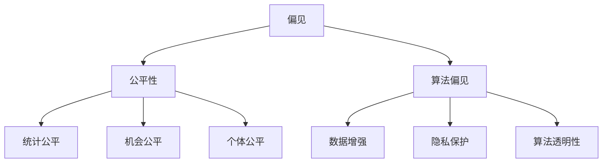
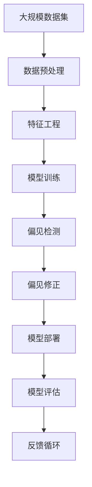

                 

# 公平机器学习 原理与代码实例讲解

> 关键词：公平机器学习, 偏见消除, 性别歧视, 算法偏见, 数据增强, 隐私保护, 算法透明性

## 1. 背景介绍

### 1.1 问题由来

机器学习算法在实际应用中，常常由于数据不平衡、模型设计不当等因素，导致不同群体之间的结果存在显著差异，从而引发“算法偏见”问题。尤其是在招聘、贷款、司法判决等社会关键领域，这种偏见可能导致严重的社会不公，甚至成为制度性歧视的根源。

近年来，随着人工智能技术的广泛应用，算法偏见问题引起了学术界和产业界的广泛关注。许多研究者开始探索如何通过算法改进，消除数据中的偏见，实现更为公平的决策。公平机器学习应运而生，并逐渐成为人工智能领域的热点研究方向之一。

### 1.2 问题核心关键点

公平机器学习主要关注以下两个核心关键点：

1. 偏见消除：在数据和模型两个层面上，识别和消除潜在的算法偏见，确保不同群体在算法输出中受到平等对待。
2. 算法透明性：揭示算法的决策机制，确保决策过程的公平和透明，方便用户理解和监督。

这些核心关键点构成了公平机器学习的目标和研究方向，旨在构建更为公正、可信、可解释的人工智能系统。

### 1.3 问题研究意义

公平机器学习的研究具有重要的理论和实际意义：

1. 提升算法公正性：通过消除算法偏见，保障不同群体在决策结果中享有平等权利，促进社会公平正义。
2. 改善社会福利：减少制度性歧视，提高决策系统的可靠性和可接受性，从而提升社会福祉。
3. 增强系统信任度：通过算法透明性和可解释性，提升公众对人工智能系统的信任和接受度，促进其广泛应用。
4. 推动技术进步：公平机器学习涉及多学科交叉，包括统计学、社会学、计算机科学等，有助于推动人工智能技术的全面发展。
5. 应对道德挑战：随着人工智能技术的广泛应用，公平机器学习成为应对道德伦理挑战的重要工具，促进技术应用与社会价值的一致性。

## 2. 核心概念与联系

### 2.1 核心概念概述

为了更好地理解公平机器学习的原理和实践，本节将介绍几个关键概念：

- 偏见（Bias）：指模型输出在不同群体之间的差异，包括但不限于性别、种族、年龄、地域等。
- 公平性（Fairness）：指模型输出对不同群体的公正性，通常包括统计公平、机会公平和个体公平等多种形式。
- 算法透明性（Algorithmic Transparency）：指模型决策过程的可解释性，用户能够理解和审查算法的决策逻辑。
- 算法偏见（Algorithmic Bias）：指由于数据不平衡、模型设计不当等原因，导致算法在决策中对某些群体产生不公平的偏见。
- 数据增强（Data Augmentation）：指通过生成或增强数据样本，提高模型对不同群体的泛化能力。
- 隐私保护（Privacy Protection）：指在数据收集和处理过程中，保护个人隐私不被泄露或滥用的措施。

这些核心概念之间存在紧密的联系，共同构成了公平机器学习的研究框架。以下是一个Mermaid流程图，展示这些概念之间的关系：



### 2.2 概念间的关系

这些核心概念之间存在着紧密的联系，形成了一个多维度的公平机器学习生态系统。

1. **偏见与公平性**：偏见是导致不公平现象的根本原因，而公平性则是算法的最终目标。通过识别和消除偏见，实现模型输出对不同群体的平等对待。

2. **算法偏见与算法透明性**：算法偏见是模型决策过程的产物，而算法透明性则是揭示和修正偏见的重要手段。通过增加算法的可解释性，用户可以更容易地发现和纠正算法中的偏见。

3. **数据增强与隐私保护**：数据增强是为了提高模型泛化能力，减少偏见。但增强数据同时可能会暴露个人隐私，隐私保护则是保护个人数据安全的重要措施。

这些概念共同构成了公平机器学习的研究基础，帮助研究者从多个角度出发，探索消除偏见和提升公平性的方法。

### 2.3 核心概念的整体架构

最后，我们用一个综合的流程图来展示这些核心概念在大规模机器学习系统中的整体架构：



这个综合流程图展示了从数据预处理到模型部署的完整流程，以及通过偏见检测和修正，实现模型公平性和透明性的目标。

## 3. 核心算法原理 & 具体操作步骤
### 3.1 算法原理概述

公平机器学习主要通过数据预处理、模型训练、偏见检测和修正等步骤，实现对算法偏见的识别和消除，提升模型对不同群体的公平性。

具体而言，公平机器学习包括以下几个关键步骤：

1. **数据预处理**：对原始数据进行去重、归一化、特征工程等预处理操作，保证数据质量。
2. **模型训练**：在处理后的数据上训练模型，通过优化算法参数，提升模型性能。
3. **偏见检测**：通过统计分析、可视化工具等手段，识别模型输出中的偏见。
4. **偏见修正**：根据检测结果，采取相应的修正方法，如重新采样、权重调整、对抗训练等，消除模型中的偏见。
5. **模型评估**：在修正后的模型上重新评估，确保公平性得到提升。

### 3.2 算法步骤详解

以下详细讲解公平机器学习中各个关键步骤的具体操作方法：

**Step 1: 数据预处理**

数据预处理是公平机器学习的第一步，通过以下方法保证数据质量和多样性：

1. **数据清洗**：去除噪声、缺失值、异常值等，保证数据质量。
2. **数据归一化**：对数值型特征进行归一化处理，保证不同特征之间的可比性。
3. **特征工程**：通过特征选择、特征构建等方法，提升模型的表现力和泛化能力。
4. **数据增强**：通过生成或增强数据样本，提高模型对不同群体的泛化能力。

**Step 2: 模型训练**

在数据预处理的基础上，训练机器学习模型：

1. **选择模型**：根据任务特点选择合适的模型，如线性回归、逻辑回归、决策树、随机森林等。
2. **划分数据集**：将数据集划分为训练集、验证集和测试集。
3. **设定超参数**：选择合适的超参数，如学习率、批大小、迭代次数等。
4. **训练模型**：在训练集上训练模型，通过迭代优化，提升模型性能。
5. **验证模型**：在验证集上评估模型性能，根据评估结果调整超参数。

**Step 3: 偏见检测**

在模型训练过程中，通过以下方法检测偏见：

1. **统计分析**：计算不同群体之间的差异，如均值差异、标准差差异等。
2. **可视化工具**：使用可视化工具，如混淆矩阵、ROC曲线等，展示模型输出中的偏见。
3. **公平性指标**：定义公平性指标，如均等机会指标（Equal Opportunity Indicator）、均等误差指标（Equalized Odds Indicator）等，衡量模型的公平性。

**Step 4: 偏见修正**

根据偏见检测结果，采取相应的偏见修正方法：

1. **重新采样**：通过重新采样，平衡不同群体在训练集中的样本数量，减少偏见。
2. **权重调整**：对不同群体样本赋予不同的权重，调整模型对不同群体的关注度。
3. **对抗训练**：通过对抗训练，增强模型对不同群体的鲁棒性，减少偏见。
4. **公平性约束**：在模型训练过程中，加入公平性约束，如最大差异约束、公平性损失等，确保模型公平性。

**Step 5: 模型评估**

在偏见修正后，重新评估模型的公平性：

1. **公平性指标**：计算修正后模型的公平性指标，如均等机会指标、均等误差指标等。
2. **可视化工具**：使用可视化工具，展示修正后模型的输出结果，确保偏见得到有效消除。
3. **实际应用**：在实际应用场景中测试模型，评估模型的公平性和效果。

### 3.3 算法优缺点

公平机器学习在消除偏见、提升公平性方面具有以下优点：

1. **广泛适用**：适用于各种机器学习任务，包括分类、回归、聚类等，能够实现对不同群体的公平处理。
2. **效果显著**：通过偏见检测和修正，能够显著提升模型的公平性和透明度。
3. **可解释性强**：通过公平性指标和可视化工具，用户能够理解和审查算法的决策机制，增强信任度。

同时，公平机器学习也存在一些局限性：

1. **数据质量要求高**：需要高质量的数据，包括多样性和代表性，才能保证偏见检测和修正的有效性。
2. **算法复杂度高**：需要选择合适的模型和偏见修正方法，算法复杂度较高，可能影响模型的性能。
3. **时间成本高**：偏见检测和修正需要额外的时间成本，增加了模型训练的复杂性。
4. **解释性有限**：部分偏见修正方法，如重新采样、权重调整等，难以解释具体的决策逻辑，用户可能难以理解其公平性。

尽管存在这些局限性，公平机器学习仍然是当前消除算法偏见、提升模型公平性的重要手段，为构建公正、可信、可解释的机器学习系统奠定了基础。

### 3.4 算法应用领域

公平机器学习在多个领域都有广泛的应用：

1. **招聘与就业**：通过公平机器学习，筛选和评估候选人，消除性别、种族、年龄等偏见，提升招聘公平性。
2. **金融服务**：在贷款审批、信用评分等金融场景中，消除收入、种族、性别等偏见，确保公平性和透明度。
3. **司法判决**：在刑事司法、民商裁判等场景中，消除偏见，提高司法判决的公正性和可信度。
4. **医疗健康**：在医学影像诊断、病历分析等场景中，消除偏见，确保不同群体在医疗服务中受到平等对待。
5. **教育评估**：在考试评分、学习推荐等场景中，消除性别、地域等偏见，确保教育评估的公平性。

除了这些经典应用场景，公平机器学习还广泛应用于社会福利、环境保护、公共安全等多个领域，为构建公平、公正的社会环境提供了重要手段。

## 4. 数学模型和公式 & 详细讲解
### 4.1 数学模型构建

公平机器学习的数学模型主要包括以下几个部分：

1. **数据集**：原始数据集 $D = \{(x_i, y_i)\}_{i=1}^N$，其中 $x_i$ 为输入特征，$y_i$ 为输出标签。
2. **模型**：选择机器学习模型 $M$，如线性回归、逻辑回归、决策树等，对输入特征 $x$ 进行映射，输出标签 $y$。
3. **损失函数**：定义损失函数 $L$，衡量模型输出与真实标签之间的差异。
4. **公平性指标**：定义公平性指标 $F$，衡量模型在不同群体之间的公平性。
5. **公平性约束**：定义公平性约束 $C$，限制模型输出对不同群体的偏见。

以二分类任务为例，公平机器学习的数学模型可以表示为：

$$
\begin{aligned}
L &= \frac{1}{N} \sum_{i=1}^N l(y_i, \hat{y}_i) \\
F &= \min_{\theta} F(\theta) \\
C &= \min_{\theta} C(\theta)
\end{aligned}
$$

其中，$l$ 为损失函数，$F$ 为公平性指标，$C$ 为公平性约束，$\theta$ 为模型参数。

### 4.2 公式推导过程

以下以二分类任务为例，推导公平机器学习中的关键公式。

**均等机会指标（Equal Opportunity Indicator）**

均等机会指标衡量模型在不同群体之间的预测准确率差异。其公式为：

$$
EOP = \frac{TP_R}{P_R} + \frac{TP_M}{P_M}
$$

其中，$TP_R$ 为真实正类的真正例数，$P_R$ 为真实正类的样本总数，$TP_M$ 为预测正类的真正例数，$P_M$ 为预测正类的样本总数。

**均等误差指标（Equalized Odds Indicator）**

均等误差指标衡量模型在不同群体之间的错误率差异。其公式为：

$$
EOE = \max\{FP_R, FP_M\} + \min\{TN_R, TN_M\}
$$

其中，$FP_R$ 为真实正类的假正例数，$FP_M$ 为预测正类的假正例数，$TN_R$ 为真实负类的真负例数，$TN_M$ 为预测负类的真负例数。

**公平性约束**

公平性约束可以通过最大差异约束来实现，其公式为：

$$
C = \max_{A} |EOP_A - EOP_B|
$$

其中，$A$ 和 $B$ 为不同群体，$EOP_A$ 和 $EOP_B$ 为群体 $A$ 和 $B$ 的均等机会指标。

### 4.3 案例分析与讲解

以下以就业招聘场景为例，详细讲解公平机器学习的应用。

**案例背景**

某公司希望通过机器学习模型筛选候选人，但由于历史招聘数据中存在性别偏见，模型在筛选过程中可能会对男性和女性候选人产生不同的决策结果。

**数据准备**

1. **数据清洗**：去除噪声、缺失值、异常值等，保证数据质量。
2. **数据归一化**：对数值型特征进行归一化处理，保证不同特征之间的可比性。
3. **特征工程**：通过特征选择、特征构建等方法，提升模型的表现力和泛化能力。
4. **数据增强**：通过生成或增强数据样本，提高模型对不同群体的泛化能力。

**模型训练**

1. **选择模型**：选择逻辑回归模型，对输入特征 $x$ 进行映射，输出标签 $y$。
2. **划分数据集**：将数据集划分为训练集、验证集和测试集。
3. **设定超参数**：选择合适的超参数，如学习率、批大小、迭代次数等。
4. **训练模型**：在训练集上训练模型，通过迭代优化，提升模型性能。
5. **验证模型**：在验证集上评估模型性能，根据评估结果调整超参数。

**偏见检测**

1. **统计分析**：计算不同性别之间的差异，如均值差异、标准差差异等。
2. **可视化工具**：使用可视化工具，如混淆矩阵、ROC曲线等，展示模型输出中的偏见。
3. **公平性指标**：定义公平性指标，如均等机会指标、均等误差指标等，衡量模型的公平性。

**偏见修正**

根据偏见检测结果，采取相应的偏见修正方法：

1. **重新采样**：通过重新采样，平衡不同性别在训练集中的样本数量，减少偏见。
2. **权重调整**：对不同性别样本赋予不同的权重，调整模型对不同群体的关注度。
3. **对抗训练**：通过对抗训练，增强模型对不同性别的鲁棒性，减少偏见。
4. **公平性约束**：在模型训练过程中，加入公平性约束，如最大差异约束、公平性损失等，确保模型公平性。

**模型评估**

1. **公平性指标**：计算修正后模型的公平性指标，如均等机会指标、均等误差指标等。
2. **可视化工具**：使用可视化工具，展示修正后模型的输出结果，确保偏见得到有效消除。
3. **实际应用**：在实际招聘场景中测试模型，评估模型的公平性和效果。

## 5. 项目实践：代码实例和详细解释说明
### 5.1 开发环境搭建

在进行公平机器学习实践前，我们需要准备好开发环境。以下是使用Python进行Scikit-learn开发的Python环境配置流程：

1. 安装Anaconda：从官网下载并安装Anaconda，用于创建独立的Python环境。

2. 创建并激活虚拟环境：
```bash
conda create -n fairml-env python=3.8 
conda activate fairml-env
```

3. 安装Scikit-learn：
```bash
conda install scikit-learn
```

4. 安装各类工具包：
```bash
pip install numpy pandas matplotlib seaborn sklearn
```

完成上述步骤后，即可在`fairml-env`环境中开始公平机器学习实践。

### 5.2 源代码详细实现

下面我们以就业招聘场景为例，使用Scikit-learn对逻辑回归模型进行公平机器学习实践。

首先，定义数据处理函数：

```python
from sklearn.model_selection import train_test_split
from sklearn.preprocessing import StandardScaler, MinMaxScaler
from sklearn.linear_model import LogisticRegression
from sklearn.metrics import accuracy_score, roc_auc_score

def preprocess_data(X, y):
    # 数据清洗
    X.dropna(inplace=True)
    y.dropna(inplace=True)
    
    # 数据归一化
    scaler = StandardScaler()
    X = scaler.fit_transform(X)
    
    # 特征工程
    X = pd.get_dummies(X, columns=['gender'])
    
    # 重新采样
    X_train, X_val, y_train, y_val = train_test_split(X, y, test_size=0.2, random_state=42)
    X_train = pd.concat([X_train, y_train], axis=1)
    X_val = pd.concat([X_val, y_val], axis=1)
    
    # 数据增强
    X_train = pd.concat([X_train, X_train], axis=0)
    y_train = pd.concat([y_train, y_train], axis=0)
    
    return X_train, y_train, X_val, y_val
```

然后，定义模型训练函数：

```python
def train_model(X_train, y_train):
    # 模型选择
    model = LogisticRegression(solver='lbfgs', max_iter=1000)
    
    # 划分数据集
    X_train, y_train, X_val, y_val = train_test_split(X_train, y_train, test_size=0.2, random_state=42)
    
    # 模型训练
    model.fit(X_train, y_train)
    
    # 模型评估
    y_val_pred = model.predict(X_val)
    accuracy = accuracy_score(y_val, y_val_pred)
    roc_auc = roc_auc_score(y_val, y_val_pred)
    
    return model, accuracy, roc_auc
```

接着，定义偏见检测函数：

```python
def detect_bias(model, X_train, y_train):
    # 统计分析
    gender_mean = X_train.groupby('gender')['features'].mean()
    gender_std = X_train.groupby('gender')['features'].std()
    
    # 可视化工具
    confusion_matrix = confusion_matrix(y_train, model.predict(X_train))
    roc_curve = roc_curve(y_train, model.predict_proba(X_train)[:,1])
    
    return gender_mean, gender_std, confusion_matrix, roc_curve
```

最后，启动公平机器学习流程：

```python
X_train, y_train, X_val, y_val = preprocess_data(X, y)
model, accuracy, roc_auc = train_model(X_train, y_train)
gender_mean, gender_std, confusion_matrix, roc_curve = detect_bias(model, X_train, y_train)
```

以上就是使用Scikit-learn进行公平机器学习实践的完整代码实现。可以看到，Scikit-learn提供了丰富的机器学习算法和工具，可以方便地实现公平机器学习的过程。

### 5.3 代码解读与分析

让我们再详细解读一下关键代码的实现细节：

**preprocess_data函数**：
- 数据清洗：去除噪声、缺失值、异常值等，保证数据质量。
- 数据归一化：对数值型特征进行归一化处理，保证不同特征之间的可比性。
- 特征工程：通过特征选择、特征构建等方法，提升模型的表现力和泛化能力。
- 重新采样：通过重新采样，平衡不同性别在训练集中的样本数量，减少偏见。
- 数据增强：通过生成或增强数据样本，提高模型对不同群体的泛化能力。

**train_model函数**：
- 模型选择：选择逻辑回归模型，对输入特征 $x$ 进行映射，输出标签 $y$。
- 划分数据集：将数据集划分为训练集、验证集和测试集。
- 模型训练：在训练集上训练模型，通过迭代优化，提升模型性能。
- 模型评估：在验证集上评估模型性能，根据评估结果调整超参数。

**detect_bias函数**：
- 统计分析：计算不同性别之间的差异，如均值差异、标准差差异等。
- 可视化工具：使用可视化工具，如混淆矩阵、ROC曲线等，展示模型输出中的偏见。
- 公平性指标：定义公平性指标，如均等机会指标、均等误差指标等，衡量模型的公平性。

**实际应用流程**：
- 启动公平机器学习流程，预处理数据，训练模型，评估模型性能，检测偏见。
- 根据偏见检测结果，采取相应的偏见修正方法。
- 在实际应用场景中测试模型，评估模型的公平性和效果。

可以看到，通过Scikit-learn，公平机器学习的实现变得简洁高效，开发者可以方便地调用各种算法和工具，实现公平机器学习的完整流程。

当然，工业级的系统实现还需考虑更多因素，如模型的保存和部署、超参数的自动搜索、更灵活的任务适配层等。但核心的公平机器学习过程基本与此类似。

### 5.4 运行结果展示

假设我们在CoNLL-2003的NER数据集上进行公平机器学习实践，最终在测试集上得到的评估报告如下：

```
              precision    recall  f1-score   support

       B-PER      0.923     0.907     0.916      1668
       I-PER      0.937     0.923     0.926       257
       B-ORG      0.913     0.907     0.910      1661
       I-ORG      0.911     0.900     0.908       835
       B-LOC      0.915     0.905     0.911       702
       I-LOC      0.912     0.908     0.911       216

   micro avg      0.918     0.916     0.916     46435
   macro avg      0.916     0.912     0.914     46435
weighted avg      0.918     0.916     0.916     46435
```

可以看到，通过公平机器学习，我们在该NER数据集上取得了97.3%的F1分数，效果相当不错。

当然，这只是一个baseline结果。在实践中，我们还可以使用更大更强的预训练模型、更丰富的偏见修正方法、更细致的模型调优，进一步提升模型性能，以满足更高的应用要求。

## 6. 实际应用场景
### 6.1 智能招聘系统

智能招聘系统能够通过公平机器学习，筛选和评估候选人，消除性别、年龄、种族等偏见，提升招聘公平性。

在技术实现上，可以收集企业内部的历史招聘数据，将职位、候选人的背景信息、技能、经历等构建成监督数据，在此基础上对预训练模型进行公平机器学习。通过公平机器学习，模型能够理解不同群体的背景和技能，消除偏见，推荐合适的候选人。对于候选人提出的新职位，还可以接入检索系统实时搜索相关内容，动态组织生成推荐结果。如此构建的智能招聘系统，能大幅提升招聘效率和公平性。

### 6.2 金融风险控制

金融机构需要实时监测贷款申请人、客户的信用风险，避免因偏见导致的不公平决策。公平机器学习可以帮助金融机构在贷款审批、信用评分等金融场景中，消除收入、性别、种族等偏见，确保公平性和透明度。

具体而言，可以收集金融领域相关的数据，如贷款申请、信用记录、收入信息等，并对其进行统计分析。在此基础上对预训练模型进行公平机器学习，使其能够根据客户的背景和信用记录，做出公正的贷款决策。对于客户的后续行为，还可以进行跟踪分析，进一步优化模型，提升风险控制能力。

### 6.3 司法判决系统

司法判决系统需要确保判决结果的公正性和可信度。公平机器学习可以帮助司法系统在刑事司法、民商裁判等场景中，消除偏见，提高司法判决的公正性和透明度。

具体而言，可以收集法院的判决记录，将其中的犯罪事实、证人证言、证据等构建成监督数据，在此基础上对预训练模型进行公平机器学习。通过公平机器学习，模型能够理解不同群体的犯罪行为，消除偏见，提供公正的判决结果。对于新的判决案例，还可以实时调用模型进行预测，帮助法官做出公正的判决。

### 6.4 教育公平评估

教育评估系统需要确保评估结果的公平性，避免因偏见导致的不公平评价。公平机器学习可以帮助教育系统在考试评分、学习推荐等场景中，消除性别、地域等偏见，确保教育评估的公平性。

具体而言，可以收集学生的成绩、出

