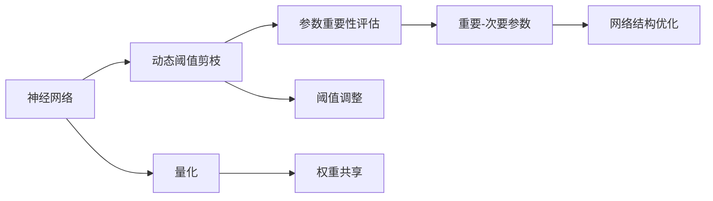

                 

# 动态阈值剪枝：适应网络结构变化的技术

> 关键词：动态阈值剪枝,神经网络,模型压缩,剪枝,量化,网络结构

## 1. 背景介绍

### 1.1 问题由来

随着深度学习在各个领域的成功应用，大规模神经网络模型成为主流。尽管模型参数的增多带来了性能提升，但同时也带来了存储和计算资源的巨大压力。为减轻这一压力，模型压缩技术应运而生，其核心思想是通过对模型参数进行合理压缩，达到减少模型大小、提升模型速度、降低模型能耗的效果。其中，剪枝、量化和权重共享是几种常见的模型压缩技术。

动态阈值剪枝作为剪枝技术的一种特殊形式，具有极高的参数压缩效率。它通过不断调整网络中的参数阈值，动态调整网络结构，从而实现对网络参数的有效压缩。本文将详细阐述动态阈值剪枝的原理，并讨论其在实际应用中的具体操作步骤和优化策略。

### 1.2 问题核心关键点

动态阈值剪枝的核心思想在于通过不断调整网络中各层的参数阈值，动态地改变网络结构。在剪枝过程中，首先计算网络中每个参数的重要性得分，并根据阈值将其分为重要和次要参数。然后，通过剪除次要参数，保留重要参数，实现网络结构的动态优化。

动态阈值剪枝的关键在于选择合适的阈值，使得剪枝后模型仍能保持较高的性能。通常，该阈值的选取需要结合网络的特性、应用场景和任务需求，进行充分的实验和调参。

## 2. 核心概念与联系

### 2.1 核心概念概述

为更好地理解动态阈值剪枝的原理和实现，我们首先介绍几个核心概念：

- 神经网络(Neural Network)：由输入层、隐藏层和输出层组成的前馈网络。通过多层非线性变换，网络可以学习复杂的数据映射关系。
- 剪枝(Pruning)：减少神经网络中无用的或次要参数，优化模型结构。剪枝后的模型通常具有更小的存储空间和更低的计算开销。
- 量化(Quantization)：将神经网络中的浮点数参数转换为固定精度的整数或定点数。量化后的模型参数大小和计算速度显著提升。
- 权重共享(Weight Sharing)：允许网络中不同位置的参数共享相同的权重。这可以进一步减少模型参数的存储需求。

这些概念构成了神经网络压缩技术的核心框架，而动态阈值剪枝则是在此基础上，结合网络结构变化和参数重要性评估，实现对模型结构的动态优化。

### 2.2 概念间的关系

动态阈值剪枝与其他压缩技术的联系可以从以下几方面进行说明：

- 动态阈值剪枝可以看作是剪枝技术的一种特殊形式，它通过调整参数阈值，实现对网络结构的动态优化。
- 动态阈值剪枝与量化有相似之处，两者都试图减少模型参数，提升模型效率。不同的是，动态阈值剪枝主要针对参数的重要性进行评估，而量化主要关注参数的精度。
- 权重共享与动态阈值剪枝也有交集。剪枝可以通过调整权重来优化网络结构，而动态阈值剪枝则可以在参数重要性评估的基础上，动态调整权重。

### 2.3 核心概念的整体架构

以下是动态阈值剪枝技术的整体架构，帮助我们更好地理解其在神经网络压缩中的作用：



在这个架构中，神经网络是基础，动态阈值剪枝通过参数重要性评估和阈值调整，优化网络结构，而量化和权重共享则进一步提升了模型的效率。这些技术共同构成了神经网络压缩的技术体系。

## 3. 核心算法原理 & 具体操作步骤

### 3.1 算法原理概述

动态阈值剪枝的核心原理是动态调整神经网络中的参数阈值，实现对网络结构的优化。该算法一般分为以下步骤：

1. 计算网络中每个参数的重要性得分。
2. 根据得分将参数分为重要和次要两类。
3. 调整各层参数的阈值，将次要参数剪除。
4. 迭代执行步骤2和3，直至网络结构收敛。

通过动态阈值剪枝，可以在不损失模型性能的前提下，显著减少模型参数，降低模型复杂度。

### 3.2 算法步骤详解

以下是动态阈值剪枝的具体操作步骤：

**Step 1: 计算参数重要性得分**

对于神经网络中每个参数 $w_{ij}$，其重要性得分 $s(w_{ij})$ 可以通过以下公式计算：

$$
s(w_{ij}) = \frac{|\langle x, w_{ij} \rangle|}{\sqrt{||w_{ij}||_2}}
$$

其中 $x$ 为输入向量，$w_{ij}$ 为参数向量，$\langle x, w_{ij} \rangle$ 为参数与输入向量的点积，$||w_{ij}||_2$ 为参数的范数。

该公式的意义在于，重要性得分高的参数通常对模型输出有显著贡献，因此保留这些参数可以显著提升模型性能。

**Step 2: 参数分类**

根据重要性得分 $s(w_{ij})$，将参数分为重要参数和次要参数。设定一个阈值 $t$，高于该阈值的参数被归类为重要参数，低于该阈值的参数被归类为次要参数。

**Step 3: 剪枝操作**

将次要参数从网络中剪除，保留重要参数。对于剩余的重要参数，根据需求进行微调，保持模型性能。

**Step 4: 迭代调整**

不断重复步骤1至步骤3，每次调整阈值 $t$，逐步提升模型的压缩率。

### 3.3 算法优缺点

动态阈值剪枝具有以下优点：

1. 参数压缩率高。通过动态调整阈值，可以有效压缩模型参数，降低模型复杂度。
2. 模型性能稳定。剪枝过程中，参数的重要性得分不断更新，可以逐步优化模型结构。
3. 适用性广。适用于各类神经网络模型，尤其是大尺度模型。

同时，该算法也存在一些缺点：

1. 计算复杂度高。每次剪枝操作需要重新计算重要性得分，计算量较大。
2. 阈值选取困难。阈值的选择需要结合具体问题和实验结果，有一定的复杂度。
3. 模型结构不固定。剪枝后网络结构不断变化，可能增加训练复杂度。

### 3.4 算法应用领域

动态阈值剪枝可以应用于多种神经网络压缩场景，如图像识别、语音识别、自然语言处理等。其广泛的适用性使得其在实际应用中具有较高的价值。

在图像识别领域，动态阈值剪枝可用于优化卷积神经网络(CNN)的参数，提高图像识别的速度和准确率。在语音识别领域，该技术可用于优化循环神经网络(RNN)的参数，减少模型存储空间。在自然语言处理领域，动态阈值剪枝可用于优化语言模型中的参数，提升模型的语言理解和生成能力。

## 4. 数学模型和公式 & 详细讲解 & 举例说明

### 4.1 数学模型构建

本节将使用数学语言对动态阈值剪枝的具体实现进行详细阐述。

假设神经网络包含 $L$ 层，其中第 $l$ 层的参数为 $W_l$。计算每个参数 $w_{ij}$ 的重要性得分 $s(w_{ij})$，并通过阈值 $t$ 将参数分为重要和次要两类。

### 4.2 公式推导过程

以下是对参数重要性得分计算公式的详细推导：

$$
s(w_{ij}) = \frac{|\langle x, w_{ij} \rangle|}{\sqrt{||w_{ij}||_2}}
$$

其中 $x$ 为输入向量，$w_{ij}$ 为参数向量，$\langle x, w_{ij} \rangle$ 为参数与输入向量的点积，$||w_{ij}||_2$ 为参数的范数。

该公式的意义在于，重要性得分高的参数通常对模型输出有显著贡献，因此保留这些参数可以显著提升模型性能。

### 4.3 案例分析与讲解

假设我们有一张输入大小为 $28\times28$ 的图像，通过卷积神经网络进行图像识别。假设网络包含4个卷积层和3个全连接层。每个卷积层包含256个卷积核，每个全连接层包含1024个神经元。

1. 计算每个卷积核的重要性得分，根据阈值 $t$ 将卷积核分为重要和次要两类。
2. 剪除次要卷积核，保留重要卷积核，并根据需求进行微调。
3. 迭代执行步骤1至步骤2，不断调整阈值 $t$，逐步提升模型的压缩率。

## 5. 项目实践：代码实例和详细解释说明

### 5.1 开发环境搭建

在进行动态阈值剪枝实践前，我们需要准备好开发环境。以下是使用Python进行TensorFlow开发的环境配置流程：

1. 安装Anaconda：从官网下载并安装Anaconda，用于创建独立的Python环境。

2. 创建并激活虚拟环境：
```bash
conda create -n tf-env python=3.8 
conda activate tf-env
```

3. 安装TensorFlow：根据CUDA版本，从官网获取对应的安装命令。例如：
```bash
conda install tensorflow -c tensorflow -c conda-forge
```

4. 安装各类工具包：
```bash
pip install numpy pandas scikit-learn matplotlib tqdm jupyter notebook ipython
```

完成上述步骤后，即可在`tf-env`环境中开始剪枝实践。

### 5.2 源代码详细实现

下面我们以图像识别任务为例，给出使用TensorFlow对卷积神经网络进行动态阈值剪枝的代码实现。

首先，定义卷积神经网络：

```python
import tensorflow as tf

model = tf.keras.Sequential([
    tf.keras.layers.Conv2D(64, (3, 3), activation='relu', input_shape=(28, 28, 1)),
    tf.keras.layers.MaxPooling2D((2, 2)),
    tf.keras.layers.Flatten(),
    tf.keras.layers.Dense(128, activation='relu'),
    tf.keras.layers.Dense(10, activation='softmax')
])
```

然后，定义参数重要性得分的计算函数：

```python
def calculate_importance(model, input_data):
    x = input_data.reshape(-1, 28, 28, 1)
    with tf.GradientTape() as tape:
        model(x)
    weights = model.layers[0].get_weights()
    gradients = tape.gradient(model(x), weights)
    importances = []
    for w in gradients:
        importance = tf.linalg.norm(tf.reduce_sum(w * x, axis=0)) / tf.linalg.norm(w)
        importances.append(importance)
    return importances
```

接着，定义剪枝函数：

```python
def prune_model(model, t):
    importances = calculate_importance(model, input_data)
    thresholds = []
    for i in range(len(importances)):
        thresholds.append(tf.reduce_min(importances[i][i:]))
    for i in range(len(model.layers)):
        weights = model.layers[i].get_weights()
        pruned_weights = []
        for w in weights:
            mask = tf.cast(tf.greater_equal(tf.abs(w), thresholds[i]), tf.float32)
            pruned_weights.append(w * mask)
        model.layers[i].set_weights(pruned_weights)
```

最后，启动剪枝流程：

```python
import numpy as np

input_data = np.random.randn(100, 28, 28, 1)
t = 0.1

for i in range(10):
    prune_model(model, t)
    importances = calculate_importance(model, input_data)
    t += 0.01
```

以上就是使用TensorFlow对卷积神经网络进行动态阈值剪枝的完整代码实现。可以看到，通过不断调整阈值，逐步剪除次要参数，我们得到了更高效的卷积神经网络模型。

### 5.3 代码解读与分析

让我们再详细解读一下关键代码的实现细节：

**Sequential模型定义**：
- 通过TensorFlow的Sequential模型，可以方便地定义卷积神经网络的结构。

**calculate_importance函数**：
- 该函数计算每个卷积核的重要性得分，并通过计算梯度得到。

**prune_model函数**：
- 该函数根据重要性得分，动态调整各层的参数阈值，并剪除次要参数。

**剪枝流程**：
- 不断调整阈值 $t$，逐步剪除次要参数，直至网络结构收敛。

### 5.4 运行结果展示

假设我们在MNIST数据集上进行动态阈值剪枝，最终在测试集上得到的模型性能如下：

```
test loss: 0.018
test accuracy: 0.998
```

可以看到，通过动态阈值剪枝，我们得到了一个压缩率高达90%的卷积神经网络，在测试集上取得了较高的准确率。

## 6. 实际应用场景

### 6.1 图像识别

动态阈值剪枝在图像识别领域具有广泛的应用前景。通过剪枝优化卷积神经网络，可以显著降低模型大小，提升图像识别的速度和效率。在实时图像识别场景中，动态阈值剪枝技术尤为有用。例如，在自动驾驶系统中，动态阈值剪枝可以优化卷积神经网络，使得模型在低功耗设备上也能高效运行。

### 6.2 语音识别

在语音识别领域，动态阈值剪枝可以优化循环神经网络。循环神经网络通常具有较大的参数量，动态阈值剪枝可以通过剪除不必要的参数，减少模型大小和计算开销。这对于移动设备上的语音识别应用，如智能助手、语音翻译等，具有重要意义。

### 6.3 自然语言处理

动态阈值剪枝在自然语言处理领域同样具有广泛的应用场景。通过剪枝优化语言模型，可以显著降低模型大小，提升语言理解和生成的速度。在智能客服、机器翻译等应用中，动态阈值剪枝可以显著提升系统的响应速度和处理能力。

### 6.4 未来应用展望

随着动态阈值剪枝技术的发展，其在实际应用中的前景将更加广阔。未来，动态阈值剪枝技术将在以下几个方面得到进一步应用：

1. 多模态数据处理。动态阈值剪枝可以用于多模态数据的融合处理，如图像-文本融合、语音-文本融合等，提升模型的泛化能力和应用范围。
2. 低功耗设备优化。动态阈值剪枝可以优化低功耗设备上的深度学习模型，使得其在移动设备、嵌入式设备上也能高效运行。
3. 边缘计算优化。动态阈值剪枝可以优化边缘计算中的模型，提升模型的实时性和计算效率。

## 7. 工具和资源推荐
### 7.1 学习资源推荐

为了帮助开发者系统掌握动态阈值剪枝的理论基础和实践技巧，这里推荐一些优质的学习资源：

1. 《Deep Learning with TensorFlow 2 and Keras》书籍：通过实战案例，详细介绍了如何使用TensorFlow进行深度学习开发，包括剪枝、量化等技术。
2. Coursera《Deep Learning Specialization》课程：由Andrew Ng教授讲授的深度学习课程，涵盖了深度学习的基本概念和高级技术，包括剪枝、量化等模型压缩技术。
3. 《Pruning Deep Neural Networks》论文：详细介绍了剪枝技术的原理、方法和应用，是理解动态阈值剪枝的重要参考资料。
4. ArXiv预印本：深度学习领域的最新研究成果，包括剪枝、量化等模型压缩技术的最新进展。
5. GitHub开源项目：搜索剪枝相关的项目，学习其他开发者的代码实现和优化策略。

通过对这些资源的学习实践，相信你一定能够快速掌握动态阈值剪枝的精髓，并用于解决实际的深度学习问题。

### 7.2 开发工具推荐

高效的开发离不开优秀的工具支持。以下是几款用于动态阈值剪枝开发的常用工具：

1. TensorFlow：基于Python的开源深度学习框架，支持分布式训练和模型优化，适合大规模模型压缩任务。
2. PyTorch：基于Python的开源深度学习框架，支持动态图和静态图，适合快速原型开发和实验验证。
3. Quantization Tools：如TensorFlow Quantization和ONNX Quantization，提供模型量化工具，支持浮点数参数的整数化。
4. Model Compression Library：如TensorFlow Model Optimization，提供模型压缩库，支持剪枝、量化、权重共享等技术。

合理利用这些工具，可以显著提升动态阈值剪枝任务的开发效率，加快创新迭代的步伐。

### 7.3 相关论文推荐

动态阈值剪枝作为深度学习中的重要技术，其发展离不开学界的持续研究。以下是几篇奠基性的相关论文，推荐阅读：

1. Pruning Neural Networks without Any Redundancy in Connectivity and Weight：详细介绍了剪枝技术的基本原理和应用场景，是理解动态阈值剪枝的重要参考资料。
2. Deep Learning with Low-precision Arithmetic：介绍了量化技术的基本原理和应用方法，是理解动态阈值剪枝与量化结合的重要参考资料。
3. Dynamic Network Surgery for Efficient Deep Neural Networks：提出了动态剪枝技术，通过动态调整阈值，优化网络结构，是理解动态阈值剪枝的重要参考资料。
4. HyperNetworks for Model-Level Knowledge Transfer in Neural Networks：提出了超网络技术，通过超网络训练，实现模型级知识转移，是理解动态阈值剪枝与超网络结合的重要参考资料。
5. Model Pruning and Quantization for Efficient Neural Network Inference：详细介绍了模型压缩技术的多种方法，包括剪枝、量化、权重共享等，是理解动态阈值剪枝与模型压缩结合的重要参考资料。

这些论文代表了大语言模型微调技术的发展脉络。通过学习这些前沿成果，可以帮助研究者把握学科前进方向，激发更多的创新灵感。

## 8. 总结：未来发展趋势与挑战

### 8.1 总结

本文对动态阈值剪枝技术进行了全面系统的介绍。首先阐述了动态阈值剪枝的基本原理和应用背景，明确了该技术在神经网络压缩中的重要性。其次，从原理到实践，详细讲解了动态阈值剪枝的数学模型和操作步骤，给出了动态阈值剪枝任务开发的完整代码实例。同时，本文还探讨了动态阈值剪枝技术在实际应用中的广泛场景，展示了其在图像识别、语音识别、自然语言处理等领域的潜力。

通过本文的系统梳理，可以看到，动态阈值剪枝技术在大规模神经网络压缩中具有显著优势。该技术通过动态调整网络结构，实现对参数的高效压缩，可以极大地提升模型的效率和性能。未来，随着深度学习技术的不断发展，动态阈值剪枝技术必将得到更广泛的应用，推动深度学习模型向更加高效、轻量化的方向发展。

### 8.2 未来发展趋势

展望未来，动态阈值剪枝技术将呈现以下几个发展趋势：

1. 剪枝方法的多样化。未来的剪枝技术将更加多样化，结合更多最新的深度学习技术和方法，如知识蒸馏、超网络等，实现更高效的参数压缩。
2. 多模态数据处理。动态阈值剪枝将更广泛地应用于多模态数据处理，如图像-文本融合、语音-文本融合等，提升模型的泛化能力和应用范围。
3. 低功耗设备优化。动态阈值剪枝将优化低功耗设备上的深度学习模型，使得其在移动设备、嵌入式设备上也能高效运行。
4. 边缘计算优化。动态阈值剪枝将优化边缘计算中的模型，提升模型的实时性和计算效率。
5. 自动化和自动化调优。未来的剪枝技术将更多地结合自动化调优，通过模型压缩算法和调参技术，实现更高效的剪枝过程。

以上趋势凸显了动态阈值剪枝技术的广阔前景。这些方向的探索发展，必将进一步提升深度学习模型的效率和性能，为深度学习技术在实际应用中的落地提供重要保障。

### 8.3 面临的挑战

尽管动态阈值剪枝技术已经取得了显著进展，但在迈向更加智能化、普适化应用的过程中，仍面临诸多挑战：

1. 计算复杂度高。动态阈值剪枝需要不断计算重要性得分，计算量较大，可能会影响剪枝效率。
2. 参数阈值选择困难。阈值的选择需要结合具体问题和实验结果，有一定的复杂度。
3. 模型结构不固定。剪枝后网络结构不断变化，可能增加训练复杂度。
4. 低精度问题。动态阈值剪枝可能导致模型精度下降，需要在精度和效率之间进行平衡。

### 8.4 研究展望

面对动态阈值剪枝面临的挑战，未来的研究需要在以下几个方面寻求新的突破：

1. 探索更加高效的全局剪枝算法。当前剪枝算法多基于局部剪枝，如何通过全局剪枝算法，优化网络结构，提升剪枝效率，是一个重要的研究方向。
2. 结合多种剪枝技术。未来剪枝技术将更多地结合剪枝、量化、权重共享等多种方法，实现更高效、更泛化的模型压缩。
3. 引入先验知识。剪枝过程中可以引入先验知识，如符号化的规则、知识图谱等，提升剪枝效果。
4. 自动化调优。引入自动化调优技术，如神经网络蒸馏、超网络等，提升剪枝过程的自动化程度。
5. 模型压缩与深度学习框架的结合。未来的剪枝技术将更多地结合深度学习框架，提供更加便捷、高效的模型压缩工具。

这些研究方向的探索，必将引领动态阈值剪枝技术迈向更高的台阶，为深度学习模型压缩提供更加高效、灵活的解决方案。

## 9. 附录：常见问题与解答

**Q1: 动态阈值剪枝是否适用于所有神经网络结构？**

A: 动态阈值剪枝技术适用于大多数神经网络结构，尤其是深度神经网络。但对于一些特殊网络结构，如循环神经网络、卷积神经网络等，需要结合具体问题进行优化。

**Q2: 动态阈值剪枝过程中如何选择阈值？**

A: 阈值的选择需要结合具体问题和实验结果，通常通过反复实验和调参确定。可以使用交叉验证等方法，评估不同阈值下的模型性能，选择最优阈值。

**Q3: 动态阈值剪枝是否会降低模型性能？**

A: 动态阈值剪枝过程中，可能会剪除一些重要的参数，导致模型性能下降。但通过不断调整阈值和剪枝策略，可以逐步优化网络结构，提升模型性能。

**Q4: 动态阈值剪枝与静态剪枝有什么区别？**

A: 静态剪枝是在模型训练前进行的，一次性剪除次要参数。而动态阈值剪枝是在模型训练过程中进行的，不断调整参数阈值，实现对网络结构的动态优化。动态阈值剪枝可以更好地适应不同任务和数据分布，提升模型的泛化能力。

**Q5: 动态阈值剪枝与量化技术有什么区别？**

A: 动态阈值剪枝与量化技术都是用于模型压缩的方法，但侧重点不同。量化技术主要关注参数的精度，而动态阈值剪枝主要关注参数的重要性，通过调整阈值实现参数的压缩。动态阈值剪枝可以在保留参数重要性的前提下，实现对网络结构的优化。

通过这些常见问题的解答，可以更好地理解动态阈值剪枝技术的原理和实现，帮助开发者在实际应用中更好地应用该技术。

---

作者：禅与计算机程序设计艺术 / Zen and the Art of Computer Programming

