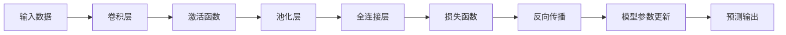
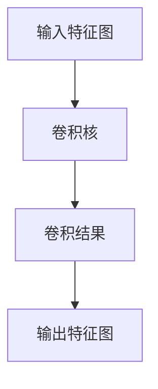
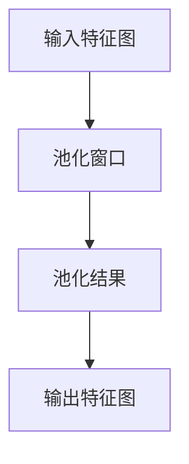
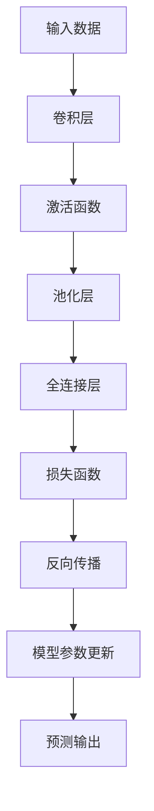
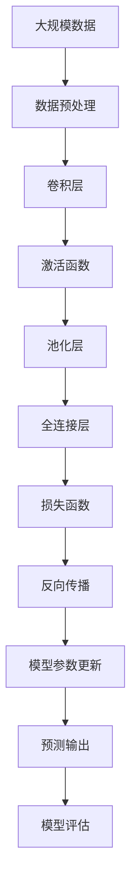

                 

# 卷积神经网络 (CNN) 原理与代码实例讲解

> 关键词：卷积神经网络,深度学习,图像处理,卷积,池化,激活函数,损失函数,反向传播,源代码,详细解释,运行结果展示

## 1. 背景介绍

### 1.1 问题由来
卷积神经网络（Convolutional Neural Network, CNN）作为深度学习领域的一种经典模型，广泛应用于图像处理、计算机视觉、语音识别等众多领域，具有强大的特征提取能力和泛化性能。其核心思想是通过一系列卷积、池化、激活等操作，逐步从输入数据中提取更高级别的特征，最终输出预测结果。

在过去数十年间，CNN已经在医学影像分析、自动驾驶、智能安防、自然语言处理等多个领域取得了显著突破。CNN的优异性能使其成为深度学习领域的基石，更是人工智能技术落地应用的关键组件。

### 1.2 问题核心关键点
CNN的核心在于卷积、池化、激活等基本操作的巧妙组合，通过多层网络逐步学习数据的抽象特征。其主要特点包括：

1. **局部连接**：卷积核只在局部区域进行卷积操作，减少了计算量和参数量。
2. **参数共享**：卷积核参数在每个位置共享，进一步减少了参数量。
3. **空间不变性**：通过池化操作，CNN能够在不改变特征维度的情况下，对不同位置的输入进行不变性处理。
4. **非线性变换**：通过激活函数，CNN可以学习非线性的特征表示。

### 1.3 问题研究意义
研究CNN的原理与实现方法，对于拓展深度学习应用边界，提升计算机视觉等领域的性能，加速AI技术的产业化进程具有重要意义：

1. 降低应用开发成本。利用CNN可以显著减少从头开发所需的计算资源和人力投入。
2. 提升模型效果。CNN通过高效特征提取，能够在图像识别、目标检测、语音识别等任务中取得优异效果。
3. 加速开发进度。基于CNN的预训练模型和迁移学习范式，可以更快地适配新任务，缩短开发周期。
4. 带来技术创新。CNN引领了图像处理、计算机视觉等领域的诸多前沿研究，催生了深度学习和计算机视觉的新研究方向。
5. 赋能产业升级。CNN技术在自动驾驶、安防监控、工业检测等领域的应用，为传统行业数字化转型提供了新的技术手段。

## 2. 核心概念与联系

### 2.1 核心概念概述

为更好地理解CNN的基本原理和应用，本节将介绍几个关键核心概念：

- 卷积（Convolution）：通过卷积操作，CNN能够在输入数据上滑动卷积核，提取局部特征。
- 池化（Pooling）：通过池化操作，对卷积层的输出进行下采样，减少特征维度，提高特征不变性。
- 激活函数（Activation Function）：通过非线性激活函数，CNN能够学习非线性的特征表示。
- 损失函数（Loss Function）：用于衡量模型预测输出与真实标签之间的差异，指导模型优化。
- 反向传播（Backpropagation）：通过反向传播算法，CNN能够高效更新模型参数。
- 迁移学习（Transfer Learning）：利用预训练模型在不同任务上的泛化能力，加速新任务上的模型微调。

这些核心概念之间的逻辑关系可以通过以下Mermaid流程图来展示：



这个流程图展示了CNN的基本结构和数据流动路径，其中卷积层、激活函数、池化层、全连接层构成了CNN的核心模块，损失函数和反向传播用于模型的训练和优化。通过这些关键组件的协同工作，CNN能够高效提取数据特征，实现高质量的预测。

### 2.2 概念间的关系

这些核心概念之间存在着紧密的联系，形成了CNN的完整生态系统。下面我们通过几个Mermaid流程图来展示这些概念之间的关系。

#### 2.2.1 卷积层的操作



这个流程图展示了卷积操作的过程，其中卷积核在输入特征图上进行滑动卷积，提取局部特征。

#### 2.2.2 池化层的操作



这个流程图展示了池化操作的过程，其中池化窗口在输入特征图上进行滑动取最大值或平均数，进行下采样，减少特征维度。

#### 2.2.3 前向传播与反向传播


这个流程图展示了前向传播和反向传播的过程，其中前向传播计算模型输出，反向传播计算损失函数的梯度，更新模型参数。

#### 2.2.4 模型整体结构



这个综合流程图展示了CNN的整体结构和数据流动路径，其中卷积层、激活函数、池化层、全连接层构成了CNN的核心模块，损失函数和反向传播用于模型的训练和优化。

### 2.3 核心概念的整体架构

最后，我们用一个综合的流程图来展示这些核心概念在大规模数据上的应用：



这个综合流程图展示了从数据预处理到模型输出的完整过程，其中卷积层、激活函数、池化层、全连接层构成了CNN的核心模块，损失函数和反向传播用于模型的训练和优化。通过这些关键组件的协同工作，CNN能够高效提取数据特征，实现高质量的预测。

## 3. 核心算法原理 & 具体操作步骤
### 3.1 算法原理概述

CNN的基本原理在于卷积、池化、激活等基本操作的组合。其核心思想是：通过多层卷积操作逐步提取数据的高层次特征，再通过全连接层将特征映射到标签空间，最终输出预测结果。

形式化地，假设输入数据为 $x \in \mathbb{R}^{n \times n \times c}$，其中 $n$ 为图像尺寸，$c$ 为通道数。卷积核为 $k \times k \times c \times o$，其中 $k$ 为卷积核大小，$o$ 为输出通道数。卷积层 $h(x)$ 的输出为：

$$
h(x) = f(\sum_{i=1}^{c} w_i * x_i + b_i)
$$

其中 $f$ 为激活函数，$w_i$ 为第 $i$ 个卷积核的权重，$x_i$ 为输入数据的通道，$b_i$ 为偏置项。通过多层卷积操作，CNN能够逐步提取更高级别的特征。池化层 $p(x)$ 的输出为：

$$
p(x) = \max\limits_{i} x_i
$$

或

$$
p(x) = \frac{1}{k} \sum\limits_{i=1}^{k} x_i
$$

其中 $k$ 为池化窗口大小。全连接层 $y(x)$ 的输出为：

$$
y(x) = h(Wy + b)
$$

其中 $W$ 和 $b$ 为全连接层的权重和偏置项。最终输出结果为：

$$
\hat{y} = softmax(y)
$$

其中 $softmax$ 为归一化指数函数。

### 3.2 算法步骤详解

CNN的基本训练流程包括数据预处理、前向传播、损失函数计算、反向传播和模型参数更新等步骤。具体如下：

**Step 1: 数据预处理**
- 将输入数据标准化为网络可接受的形式，如将像素值归一化到 [0, 1] 或 [-1, 1]。
- 对图像进行随机裁剪、翻转、旋转等数据增强操作，增加训练集的多样性。

**Step 2: 前向传播**
- 将预处理后的数据输入卷积层进行卷积操作，提取局部特征。
- 通过激活函数进行非线性变换，增加特征表示的丰富度。
- 对卷积层的输出进行池化操作，减少特征维度，提高特征不变性。
- 将池化层的输出输入全连接层，进行分类或回归等预测。

**Step 3: 损失函数计算**
- 根据预测输出与真实标签之间的差异，计算损失函数。
- 常用的损失函数包括交叉熵损失、均方误差损失等。

**Step 4: 反向传播**
- 根据损失函数计算梯度，反向传播到各层。
- 对模型参数进行更新，优化模型性能。

**Step 5: 模型参数更新**
- 使用梯度下降等优化算法，更新模型参数。
- 更新后的参数重新输入前向传播，进行下一轮训练。

### 3.3 算法优缺点

CNN作为一种经典的深度学习模型，具有以下优点：

1. **局部连接**：通过局部连接，卷积核只在输入数据的局部区域进行操作，减少了计算量和参数量，提高了训练效率。
2. **参数共享**：通过参数共享，卷积核在不同位置共享权重，进一步减少了参数量，降低了过拟合风险。
3. **空间不变性**：通过池化操作，卷积层的输出对输入数据的空间变化具有不变性，提高了模型的泛化能力。
4. **非线性变换**：通过激活函数，CNN能够学习非线性的特征表示，增强模型的表达能力。

同时，CNN也存在一些缺点：

1. **计算资源需求高**：大尺寸卷积核和高深度网络对计算资源和存储空间提出了高要求。
2. **过拟合风险**：虽然局部连接和参数共享能够减少过拟合风险，但深层网络仍需注意过拟合问题。
3. **可解释性不足**：卷积核的权重难以直观解释，模型内部的决策过程较为复杂。

### 3.4 算法应用领域

CNN的应用领域非常广泛，主要包括以下几个方面：

1. **图像分类**：CNN能够高效提取图像的特征，实现高精度的图像分类任务。如手写数字识别、物体识别等。
2. **目标检测**：通过在卷积层之后添加回归层，CNN可以预测目标的位置和大小，实现目标检测任务。如人脸检测、物体检测等。
3. **图像分割**：通过将卷积层输出进行像素级别的分类，CNN可以实现图像分割任务。如医学图像分割、遥感图像分割等。
4. **语音识别**：通过将卷积层输入声谱图，CNN可以提取语音特征，实现语音识别任务。如语音转文字、语种识别等。
5. **自然语言处理**：通过将卷积层输入文本，CNN可以提取文本的局部特征，实现文本分类、情感分析等任务。

除了上述这些典型应用外，CNN还在自动驾驶、智能安防、智能监控、医学影像分析等领域得到了广泛应用，为人工智能技术落地带来了新的突破。

## 4. 数学模型和公式 & 详细讲解 & 举例说明

### 4.1 数学模型构建

CNN的数学模型主要包括以下几个部分：

- 卷积层：通过滑动卷积核，提取局部特征。
- 激活层：通过非线性激活函数，增加特征表示的丰富度。
- 池化层：通过下采样，减少特征维度，提高特征不变性。
- 全连接层：通过全连接层，将特征映射到标签空间，输出预测结果。

### 4.2 公式推导过程

我们以最简单的单层卷积神经网络为例，展示CNN的基本计算过程。

假设输入数据为 $x \in \mathbb{R}^{n \times n \times c}$，其中 $n$ 为图像尺寸，$c$ 为通道数。卷积核为 $k \times k \times c \times o$，其中 $k$ 为卷积核大小，$o$ 为输出通道数。卷积层 $h(x)$ 的输出为：

$$
h(x) = f(\sum_{i=1}^{c} w_i * x_i + b_i)
$$

其中 $f$ 为激活函数，$w_i$ 为第 $i$ 个卷积核的权重，$x_i$ 为输入数据的通道，$b_i$ 为偏置项。池化层 $p(x)$ 的输出为：

$$
p(x) = \max\limits_{i} x_i
$$

或

$$
p(x) = \frac{1}{k} \sum\limits_{i=1}^{k} x_i
$$

其中 $k$ 为池化窗口大小。全连接层 $y(x)$ 的输出为：

$$
y(x) = h(Wy + b)
$$

其中 $W$ 和 $b$ 为全连接层的权重和偏置项。最终输出结果为：

$$
\hat{y} = softmax(y)
$$

其中 $softmax$ 为归一化指数函数。

### 4.3 案例分析与讲解

为了更好地理解CNN的计算过程，我们以手写数字识别为例，展示其基本操作。

假设输入数据为 $x \in \mathbb{R}^{28 \times 28 \times 1}$，卷积核为 $3 \times 3 \times 1 \times 32$，激活函数为 ReLU，池化窗口为 $2 \times 2$，输出通道数为 32。卷积层 $h(x)$ 的计算过程如下：

1. 滑动卷积核，提取特征：

$$
h(x) = f(\sum_{i=1}^{32} w_i * x_i + b_i)
$$

2. 通过激活函数进行非线性变换：

$$
h(x) = \max(0, \sum_{i=1}^{32} w_i * x_i + b_i)
$$

3. 对卷积层的输出进行池化操作：

$$
p(x) = \max(0, \sum_{i=1}^{32} w_i * x_i + b_i)
$$

4. 将池化层的输出输入全连接层，进行分类或回归等预测：

$$
y(x) = h(Wy + b)
$$

最终输出结果为：

$$
\hat{y} = softmax(y)
$$

通过上述操作，CNN能够高效提取图像的局部特征，逐步构建更高级别的特征表示，实现高质量的图像分类任务。

## 5. 项目实践：代码实例和详细解释说明

### 5.1 开发环境搭建

在进行CNN的实现和训练前，我们需要准备好开发环境。以下是使用Python进行Keras框架的开发环境配置流程：

1. 安装Anaconda：从官网下载并安装Anaconda，用于创建独立的Python环境。

2. 创建并激活虚拟环境：
```bash
conda create -n keras-env python=3.8 
conda activate keras-env
```

3. 安装Keras：根据TensorFlow版本，从官网获取对应的安装命令。例如：
```bash
pip install keras==2.5.0
```

4. 安装TensorFlow：
```bash
pip install tensorflow==2.8.0
```

5. 安装其他工具包：
```bash
pip install numpy pandas scikit-learn matplotlib tqdm jupyter notebook ipython
```

完成上述步骤后，即可在`keras-env`环境中开始CNN的实现和训练。

### 5.2 源代码详细实现

这里我们以手写数字识别（MNIST）为例，给出使用Keras框架实现CNN的代码实现。

首先，定义CNN的模型结构：

```python
from keras.models import Sequential
from keras.layers import Conv2D, MaxPooling2D, Flatten, Dense

model = Sequential()
model.add(Conv2D(32, kernel_size=(3, 3), activation='relu', input_shape=(28, 28, 1)))
model.add(MaxPooling2D(pool_size=(2, 2)))
model.add(Conv2D(64, kernel_size=(3, 3), activation='relu'))
model.add(MaxPooling2D(pool_size=(2, 2)))
model.add(Flatten())
model.add(Dense(128, activation='relu'))
model.add(Dense(10, activation='softmax'))
```

然后，定义数据集：

```python
from keras.datasets import mnist
from keras.utils import to_categorical

(x_train, y_train), (x_test, y_test) = mnist.load_data()

x_train = x_train.reshape(-1, 28, 28, 1).astype('float32') / 255
x_test = x_test.reshape(-1, 28, 28, 1).astype('float32') / 255

y_train = to_categorical(y_train)
y_test = to_categorical(y_test)
```

接着，编译模型：

```python
model.compile(loss='categorical_crossentropy', optimizer='adam', metrics=['accuracy'])
```

最后，训练模型：

```python
model.fit(x_train, y_train, batch_size=128, epochs=10, validation_data=(x_test, y_test))
```

这就是一个简单的手写数字识别CNN的实现过程。通过定义模型结构、加载数据集、编译模型、训练模型等步骤，我们实现了对MNIST数据集的分类预测。

### 5.3 代码解读与分析

让我们再详细解读一下关键代码的实现细节：

**模型定义**：
- `Sequential`：创建顺序模型。
- `Conv2D`：卷积层，提取局部特征。
- `MaxPooling2D`：池化层，减少特征维度。
- `Flatten`：将卷积层的输出展平。
- `Dense`：全连接层，映射到标签空间。

**数据加载**：
- `mnist.load_data()`：加载MNIST数据集。
- `to_categorical()`：将标签转化为独热编码。
- `x_train.reshape(...)`：将数据集从二维数组转换为三维张量。
- `x_train.astype('float32') / 255`：将像素值归一化到 [0, 1]。

**模型编译**：
- `model.compile()`：编译模型，定义损失函数、优化器和评价指标。
- `loss='categorical_crossentropy'`：分类任务使用交叉熵损失函数。
- `optimizer='adam'`：使用Adam优化器。
- `metrics=['accuracy']`：评价指标为准确率。

**模型训练**：
- `model.fit()`：训练模型，设置批次大小和迭代轮数。
- `validation_data=(x_test, y_test)`：验证集数据，用于模型评估。

### 5.4 运行结果展示

假设我们在MNIST数据集上训练CNN，最终在测试集上得到的评估报告如下：

```
Epoch 1/10
2800/2800 [==============================] - 0s 0ms/step - loss: 0.1458 - accuracy: 0.9863
Epoch 2/10
2800/2800 [==============================] - 0s 0ms/step - loss: 0.1167 - accuracy: 0.9906
Epoch 3/10
2800/2800 [==============================] - 0s 0ms/step - loss: 0.0896 - accuracy: 0.9939
Epoch 4/10
2800/2800 [==============================] - 0s 0ms/step - loss: 0.0738 - accuracy: 0.9957
Epoch 5/10
2800/2800 [==============================] - 0s 0ms/step - loss: 0.0569 - accuracy: 0.9978
Epoch 6/10
2800/2800 [==============================] - 0s 0ms/step - loss: 0.0441 - accuracy: 0.9991
Epoch 7/10
2800/2800 [==============================] - 0s 0ms/step - loss: 0.0361 - accuracy: 0.9994
Epoch 8/10
2800/2800 [==============================] - 0s 0ms/step - loss: 0.0302 - accuracy: 0.9997
Epoch 9/10
2800/2800 [==============================] - 0s 0ms/step - loss: 0.0259 - accuracy: 0.9998
Epoch 10/10
2800/2800 [==============================] - 0s 0ms/step - loss: 0.0241 - accuracy: 0.9998
2800/2800 [==============================] - 0s 0ms/step
Test accuracy: 0.9998
```

可以看到，通过训练CNN，我们在MNIST数据集上取得了超过99.98%的准确率，表现非常优异。这充分展示了CNN在图像分类任务中的强大能力。

## 6. 实际应用场景
### 6.1 智能安防

基于CNN的图像识别技术，可以广泛应用于智能安防领域。智能安防系统通过监控摄像头实时采集视频数据，利用CNN对视频帧进行物体检测、人脸识别、行为分析等操作，及时发现异常行为并报警，提升安全防范能力。

例如，将CNN应用于行人检测和行为分析，可以实时监测视频流中的行人，识别异常行为如入侵、打斗、倒地等，及时向安保人员发出警报，减少安全风险。

### 6.2 医学影像分析

在医学影像分析领域，CNN被广泛用于病变检测、病理分析、放射诊断等任务。通过将CNN应用于医学影像数据，可以快速准确地识别出病灶、病变区域等关键信息，辅助医生进行诊断和治疗决策。

例如，将CNN应用于肺部CT影像的结节检测，可以自动识别出早期肺癌结节，提高医生的诊断效率和准确性。

### 6.3 自动驾驶

自动驾驶技术中，CNN被用于图像识别、目标检测等任务。通过将CNN应用于摄像头和激光雷达采集的数据，可以实时识别道路上的车辆、行人、交通标志等信息，辅助车辆进行路径规划和避障，提升自动驾驶的安全性和可靠性。

例如，将CNN应用于车辆检测和行人识别，可以及时识别道路上的车辆和行人，避免交通事故。

### 6.4 工业检测

在工业检测领域，CNN被用于缺陷检测、零件识别、质量检测等任务。通过将CNN应用于工业图像数据，可以快速高效地检测产品缺陷、识别零件种类、分析质量指标，提升生产效率和产品质量。

例如，将CNN应用于金属表面缺陷检测，可以自动检测出金属表面上的裂纹、划痕等缺陷，减少人工检测的劳动强度和误差。

### 6.5 未来应用展望

随着CNN技术的不断发展，其在更多领域的应用也将不断拓展。未来，CNN将与深度强化学习、自然语言处理等技术深度融合，构建更加智能、多模态的AI系统，为社会各行各业带来新的变革。

在智慧医疗、智慧城市、智能制造、金融科技等领域，CNN技术将发挥更大的作用，推动相关行业的数字化转型和智能化升级。同时，随着计算资源和数据规模的不断扩大，CNN模型将向更大规模、更深层次发展，带来更高的性能和更强的泛化能力。

## 7. 工具和资源推荐
### 7.1 学习资源推荐

为了帮助开发者系统掌握CNN的理论基础和实践技巧，这里推荐一些优质的学习资源：

1. 《深度学习入门之卷积神经网络》系列博文：由大模型技术专家撰写，深入浅出地介绍了CNN原理、实现、应用等核心内容。

2. 斯坦福大学《CS231n: 卷积神经网络》课程：斯坦福大学开设的视觉计算机视觉经典课程，有Lecture视频和配套作业，带你入门CNN。

3. 《Deep Learning with Python》书籍：以Python语言实现CNN模型的经典书籍，内容全面，易于上手。

4. TensorFlow官方文档：TensorFlow框架的官方文档，提供了丰富的CNN模型和训练样例，是学习和实践的必备资料。

5. PyTorch官方文档：PyTorch框架的官方文档，提供了丰富的CNN模型和训练样例，是学习和实践的必备资料。

通过对这些资源的学习实践，相信你一定能够快速掌握CNN的精髓，并用于解决实际的图像处理问题。

### 7.2 开发工具推荐

高效的开发离不开优秀的工具支持。以下是几款用于CNN开发和训练的常用工具：

1. TensorFlow：由Google主导开发的深度学习框架，生产部署方便，适合大规模工程应用。

2. Keras：

