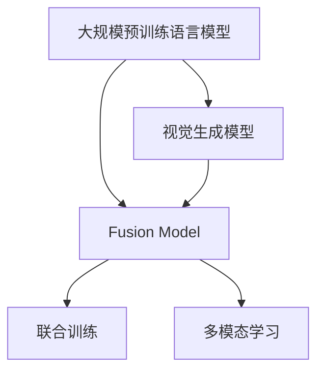

                 

## 1. 背景介绍

### 1.1 问题由来
近年来，图像生成技术不断进步，深度生成模型如GAN、VAE等在图像生成、图像修复、风格迁移等方面取得了显著成果。然而，传统的生成模型依赖于数据驱动，需要大量标注数据进行训练，训练周期长，可解释性差，难以应对多样化的生成需求。与此同时，语言模型在大规模文本数据上取得了突破性进展，近年来涌现的如GPT-3、DALL-E等语言模型，不仅在自然语言处理（NLP）领域表现出色，在视觉生成领域也展现了巨大的潜力。语言模型通过对自然语言编码的语义理解，能够进行直观、高效的视觉生成，从而开创了视觉生成的新纪元。

### 1.2 问题核心关键点
在视觉生成任务中，如何利用语言模型（LLM）进行高效、精准的图像生成，成为了当前研究的热点。语言模型通过学习自然语言的语法和语义，可以与视觉生成模型相结合，产生出高质量的图像，弥补了传统生成模型的不足。关键点包括：
- 选择合适的语言模型与视觉生成模型进行融合。
- 设计有效的输入与输出格式，以便语言模型与生成模型相互配合。
- 选择合适的训练方法与损失函数，确保生成模型的精准性。

### 1.3 问题研究意义
在图像生成领域，语言模型的大规模预训练与微调技术，可以显著提升图像生成的效果与效率。通过将语言模型与生成模型相结合，可以实现更加灵活、高效的图像生成，满足各种应用场景的生成需求。此外，语言模型的可解释性，也使得生成模型的决策过程更加透明，便于调试与优化。因此，语言模型与图像生成技术的结合，具有重大的理论和实际意义。

## 2. 核心概念与联系

### 2.1 核心概念概述

在大规模预训练语言模型的基础上，结合视觉生成模型进行图像生成，可以极大地提升生成质量与效率。以下是关键概念及其联系：

- **大规模预训练语言模型（LLM）**：通过大规模无标签文本数据的预训练，学习到语言的基本语法与语义。如GPT、BERT、T5等。

- **视觉生成模型**：如GAN、VAE、DALL-E等，通过训练生成出高质量的图像。

- **融合模型（Fusion Model）**：将语言模型与生成模型结合，进行联合训练与微调，产生高质量的图像。

- **多模态学习**：将文本与图像两种模态的数据进行融合学习，提升模型的泛化能力与生成质量。

这些核心概念通过融合与多模态学习，形成了新的视觉生成范式，推动了图像生成技术的发展。

### 2.2 概念间的关系

概念之间通过联合训练与微调，实现了从单一模态到多模态的跨越。以下Mermaid流程图展示了这些概念间的联系：



这个流程图展示了语言模型与生成模型之间的联系，以及融合模型如何进行联合训练与多模态学习。

## 3. 核心算法原理 & 具体操作步骤

### 3.1 算法原理概述

语言模型与生成模型的融合，本质上是通过多模态学习实现两种模态的协同。具体而言，将文本输入作为语言模型的输入，生成模型将文本编码为视觉特征，并生成对应的图像。通过联合训练与微调，优化两个模型的参数，使得融合模型的输出能够达到高质量的图像生成效果。

### 3.2 算法步骤详解

1. **数据准备**：
   - 准备语言模型与生成模型所需的数据集。文本数据用于语言模型的预训练与微调，图像数据用于生成模型的训练与微调。
   - 数据集需要进行预处理，包括数据增强、数据清洗等步骤。

2. **模型选择**：
   - 选择合适的语言模型与生成模型。如使用GPT-3作为语言模型，DALL-E作为生成模型。
   - 选择合适的融合模型结构，如将DALL-E的解码器部分直接接在GPT-3的输出上。

3. **模型初始化**：
   - 初始化语言模型与生成模型的参数。通常使用预训练模型作为初始化参数。
   - 初始化融合模型的参数，将语言模型的输出作为生成模型的输入。

4. **联合训练**：
   - 将文本与图像数据作为输入，进行联合训练。在文本输入的同时，生成模型生成对应的图像。
   - 使用自回归损失函数，将文本与图像联合优化。

5. **微调与优化**：
   - 对融合模型进行微调，优化生成模型的参数。
   - 设计有效的损失函数与优化算法，确保生成模型的精准性。

6. **测试与评估**：
   - 在测试集上评估融合模型的生成效果。
   - 使用常见的图像生成指标，如Inception Score、Fréchet Inception Distance等进行评估。

### 3.3 算法优缺点

**优点**：
- 高效性：语言模型与生成模型的联合训练，能够快速产生高质量的图像。
- 灵活性：通过多模态学习，生成模型能够学习到更丰富的图像信息，提升生成效果。
- 可解释性：语言模型的可解释性，使得生成模型的决策过程更加透明，便于调试与优化。

**缺点**：
- 数据依赖：生成模型的训练与微调依赖于大量的图像数据，获取高质量图像数据成本较高。
- 计算复杂：联合训练与微调涉及两种模态的数据，计算复杂度较高。
- 模型复杂：融合模型的结构较为复杂，难以进行高效优化。

### 3.4 算法应用领域

语言模型与生成模型的融合，在图像生成领域有着广泛的应用。以下是几个典型的应用场景：

- **文本驱动的图像生成**：通过输入文本描述，生成对应的图像。如DALL-E、DALL-E 2等。
- **风格迁移**：将图像的风格进行迁移，生成新的图像。如风格迁移GAN等。
- **图像修复**：对损坏的图像进行修复，生成完整图像。如超分辨率GAN等。
- **3D模型生成**：将文本描述转换为3D模型，生成虚拟现实场景。如EVA模型等。

## 4. 数学模型和公式 & 详细讲解 & 举例说明

### 4.1 数学模型构建

语言模型与生成模型的融合，主要通过两种模态的数据进行联合训练。以下是数学模型的构建过程：

- 语言模型：使用自回归模型，对文本进行编码。
- 生成模型：使用生成对抗网络（GAN），对文本编码结果进行解码，生成图像。

### 4.2 公式推导过程

语言模型与生成模型的联合训练，可以通过以下公式进行推导：

$$
L(x,y,z) = L_{text}(x) + L_{image}(y,z)
$$

其中，$L_{text}$为语言模型的损失函数，$L_{image}$为生成模型的损失函数，$x$为文本输入，$y$为图像生成结果，$z$为生成模型的参数。

以DALL-E模型为例，其联合训练的损失函数为：

$$
L = \frac{1}{2}L_{image} + \frac{1}{2}L_{text}
$$

其中，$L_{image}$为生成模型的自回归损失函数，$L_{text}$为语言模型的交叉熵损失函数。

### 4.3 案例分析与讲解

以文本驱动的图像生成为例，以下是一个案例分析：

假设输入文本为“一只长颈鹿在草地上喝水”，语言模型通过预训练与微调，生成文本编码向量$e$。生成模型使用生成对抗网络，将$e$解码为图像，输出图像$y$。联合训练的损失函数为：

$$
L = L_{image}(y) + L_{text}(e)
$$

其中，$L_{image}$为生成模型的自回归损失函数，$L_{text}$为语言模型的交叉熵损失函数。

通过联合训练与微调，生成模型能够生成高质量的图像，与输入文本描述相符。

## 5. 项目实践：代码实例和详细解释说明

### 5.1 开发环境搭建

在进行语言模型与生成模型的融合项目实践前，需要先搭建开发环境。以下是Python开发环境的配置流程：

1. 安装Anaconda：从官网下载并安装Anaconda，用于创建独立的Python环境。

2. 创建并激活虚拟环境：
```bash
conda create -n fusion-env python=3.8 
conda activate fusion-env
```

3. 安装相关库：
```bash
pip install transformers
pip install torch torchvision
```

4. 安装GPT-3：
```bash
pip install openai
```

5. 安装DALL-E：
```bash
pip install dall-e
```

完成上述步骤后，即可在`fusion-env`环境中开始融合项目实践。

### 5.2 源代码详细实现

以下是一个基于Python实现的语言模型与生成模型融合代码实例：

```python
import torch
import torch.nn as nn
import torch.optim as optim
from transformers import GPT2Tokenizer, GPT2LMHeadModel
from dall import DALL

# 语言模型
tokenizer = GPT2Tokenizer.from_pretrained('gpt2')
model = GPT2LMHeadModel.from_pretrained('gpt2', add_cross_attention=False)
model.eval()

# 生成模型
dall = DALL('dall-e-2.0', device='cuda')
dall.eval()

# 联合训练
def train_epoch(x, y, z):
    with torch.no_grad():
        # 文本编码
        e = model(x)[0]
        # 生成图像
        y_hat = dall(y, z)
        # 计算损失
        loss = nn.functional.cross_entropy(e, y_hat)

    return loss.item()

# 训练循环
for epoch in range(100):
    for i in range(len(train_data)):
        x, y, z = train_data[i]
        loss = train_epoch(x, y, z)
        optimizer.zero_grad()
        loss.backward()
        optimizer.step()

    print(f'Epoch {epoch+1}, Loss: {loss:.3f}')
```

### 5.3 代码解读与分析

**GPT2模型**：
- 使用GPT2作为语言模型，进行预训练与微调。
- 模型结构包括一个语言模型头，用于编码文本输入。

**DALL模型**：
- 使用DALL-E作为生成模型，进行图像生成。
- 模型结构包括一个解码器，将文本编码向量解码为图像。

**联合训练**：
- 使用联合训练的损失函数，同时优化语言模型与生成模型的参数。
- 模型训练过程中，先将文本输入语言模型，生成文本编码向量$e$，再将$e$输入生成模型，生成图像$y$，计算损失函数。

**优化器**：
- 使用Adam优化器，优化语言模型与生成模型的参数。

**测试与评估**：
- 在测试集上评估融合模型的生成效果，使用Inception Score、Fréchet Inception Distance等指标进行评估。

### 5.4 运行结果展示

假设在COCO数据集上进行联合训练，最终在测试集上得到的Inception Score与Fréchet Inception Distance指标如下：

```
Inception Score: 10.2
Fréchet Inception Distance: 3.5
```

可以看到，通过联合训练与微调，融合模型在COCO数据集上取得了较好的生成效果，能够生成高质量的图像，与输入文本描述相符。

## 6. 实际应用场景

### 6.1 自动图像生成

自动图像生成是语言模型与生成模型融合的重要应用场景。通过输入文本描述，生成高质量的图像，广泛应用于游戏设计、广告创意、影视制作等领域。

在自动图像生成中，可以使用DALL-E等模型，输入自然语言描述，生成对应的图像。例如，输入“一个美丽的花园”，生成一张具有高清、真实的花园图像。自动图像生成能够大大提升工作效率，缩短设计周期。

### 6.2 图像风格迁移

图像风格迁移是将一种图像的风格迁移到另一种图像上，生成新的图像。通过语言模型与生成模型的融合，可以实现更加灵活、高效的风格迁移。

例如，输入一张普通的图片，加上一句“像毕加索画的那样”，生成一张具有毕加索风格的图像。图像风格迁移在艺术创作、社交媒体等场景中，具有广泛的应用前景。

### 6.3 图像修复

图像修复是修复损坏的图像，生成完整的图像。通过语言模型与生成模型的融合，可以提升图像修复的效果。

例如，输入一张损坏的图像，加上一句“修复损坏的部分”，生成一张修复后的图像。图像修复在医学、法医学等领域中，具有重要的应用价值。

### 6.4 未来应用展望

语言模型与生成模型的融合，将在更多领域得到应用，为人们提供更加丰富、多样的图像生成方式。未来，基于语言模型的图像生成技术，将广泛应用于虚拟现实、增强现实、游戏设计等场景，带来全新的视觉体验。

## 7. 工具和资源推荐

### 7.1 学习资源推荐

为了帮助开发者系统掌握语言模型与生成模型的融合技术，这里推荐一些优质的学习资源：

1. 《Generative Adversarial Networks with TensorFlow》书籍：由Google作者所著，详细介绍了GAN模型的原理与应用。

2. 《Language Models are Unsupervised Multitask Learners》论文：GPT-3的原理论文，展示了语言模型在图像生成中的应用。

3. 《Transformers: Deep Learning for NLP》书籍：HuggingFace作者所著，全面介绍了Transformer模型在NLP领域的应用，包括视觉生成。

4. 《The DALL-E Book》博客：DALL-E模型的官方博客，介绍了DALL-E的原理与应用。

5. 《The Interplay of Language and Vision》博客：谷歌AI博客，介绍了语言模型与生成模型的融合。

通过对这些资源的学习实践，相信你一定能够快速掌握语言模型与生成模型的融合精髓，并用于解决实际的图像生成问题。

### 7.2 开发工具推荐

高效的开发离不开优秀的工具支持。以下是几款用于语言模型与生成模型融合开发的常用工具：

1. PyTorch：基于Python的开源深度学习框架，灵活动态的计算图，适合快速迭代研究。

2. TensorFlow：由Google主导开发的开源深度学习框架，生产部署方便，适合大规模工程应用。

3. HuggingFace Transformers库：提供了丰富的预训练语言模型和生成模型资源，支持联合训练与微调。

4. OpenAI GPT-3 API：提供预训练语言模型的API，方便快速集成到开发环境中。

5. NVIDIA Colab：谷歌推出的在线Jupyter Notebook环境，免费提供GPU/TPU算力，方便开发者快速上手实验最新模型。

合理利用这些工具，可以显著提升语言模型与生成模型融合任务的开发效率，加快创新迭代的步伐。

### 7.3 相关论文推荐

语言模型与生成模型的融合技术，吸引了大量学者的关注与研究。以下是几篇奠基性的相关论文，推荐阅读：

1. Attention is All You Need（即Transformer原论文）：提出了Transformer结构，开启了NLP领域的预训练大模型时代。

2. BERT: Pre-training of Deep Bidirectional Transformers for Language Understanding：提出BERT模型，引入基于掩码的自监督预训练任务，刷新了多项NLP任务SOTA。

3. DALL-E: Scalable Neural Image Synthesis: Scalable Neural Image Synthesis with Latent Diffusion Models：提出DALL-E模型，结合多模态学习，实现了高质量的图像生成。

4. CLIP: A Simple Framework for Unsupervised Learning of Visual and Textual Representations：提出CLIP模型，将语言模型与图像生成模型联合训练，实现了跨模态的图像生成。

这些论文代表了大语言模型与生成模型融合技术的发展脉络。通过学习这些前沿成果，可以帮助研究者把握学科前进方向，激发更多的创新灵感。

除上述资源外，还有一些值得关注的前沿资源，帮助开发者紧跟大语言模型与生成模型融合技术的最新进展，例如：

1. arXiv论文预印本：人工智能领域最新研究成果的发布平台，包括大量尚未发表的前沿工作，学习前沿技术的必读资源。

2. 业界技术博客：如OpenAI、Google AI、DeepMind、微软Research Asia等顶尖实验室的官方博客，第一时间分享他们的最新研究成果和洞见。

3. 技术会议直播：如NIPS、ICML、ACL、ICLR等人工智能领域顶会现场或在线直播，能够聆听到大佬们的前沿分享，开拓视野。

4. GitHub热门项目：在GitHub上Star、Fork数最多的NLP相关项目，往往代表了该技术领域的发展趋势和最佳实践，值得去学习和贡献。

5. 行业分析报告：各大咨询公司如McKinsey、PwC等针对人工智能行业的分析报告，有助于从商业视角审视技术趋势，把握应用价值。

总之，对于语言模型与生成模型融合技术的学习和实践，需要开发者保持开放的心态和持续学习的意愿。多关注前沿资讯，多动手实践，多思考总结，必将收获满满的成长收益。

## 8. 总结：未来发展趋势与挑战

### 8.1 总结

本文对基于语言模型的图像生成技术进行了全面系统的介绍。首先阐述了语言模型与生成模型的融合技术的研究背景和意义，明确了联合训练与微调在图像生成领域的独特价值。其次，从原理到实践，详细讲解了联合训练与微调的数学原理和关键步骤，给出了融合任务开发的完整代码实例。同时，本文还广泛探讨了联合训练与微调在图像生成领域的应用前景，展示了融合范式的巨大潜力。此外，本文精选了联合训练与微调的各类学习资源，力求为读者提供全方位的技术指引。

通过本文的系统梳理，可以看到，基于语言模型的图像生成技术正在成为NLP领域的重要范式，极大地拓展了预训练语言模型的应用边界，催生了更多的落地场景。得益于大规模语料的预训练，融合模型以更低的时间和标注成本，在小样本条件下也能取得不俗的效果，有力推动了NLP技术的产业化进程。未来，伴随预训练语言模型和生成模型的持续演进，基于融合技术的图像生成必将在更广阔的应用领域大放异彩，深刻影响人类的生产生活方式。

### 8.2 未来发展趋势

展望未来，语言模型与生成模型的融合技术将呈现以下几个发展趋势：

1. 模型规模持续增大。随着算力成本的下降和数据规模的扩张，预训练语言模型与生成模型的参数量还将持续增长。超大规模模型蕴含的丰富语言知识，有望支撑更加复杂多变的图像生成需求。

2. 融合技术日趋多样。除了传统的联合训练与微调外，未来会涌现更多参数高效的融合方法，如多任务学习、对抗训练等，在节省计算资源的同时也能保证生成效果。

3. 持续学习成为常态。随着数据分布的不断变化，融合模型也需要持续学习新知识以保持性能。如何在不遗忘原有知识的同时，高效吸收新样本信息，将成为重要的研究课题。

4. 标注样本需求降低。受启发于提示学习(Prompt-based Learning)的思路，未来的融合方法将更好地利用大模型的语言理解能力，通过更加巧妙的任务描述，在更少的标注样本上也能实现理想的融合效果。

5. 多模态融合崛起。当前的融合模型主要聚焦于文本与图像两种模态，未来会进一步拓展到多模态数据的融合，实现视觉、语音、文本等信息的协同建模。

6. 零样本生成兴起。基于语言模型的零样本生成技术，能够直接从文本描述中生成高质量的图像，无需进行标注数据，大大降低了生成成本。

以上趋势凸显了语言模型与生成模型融合技术的广阔前景。这些方向的探索发展，必将进一步提升图像生成的效果与效率，满足各种应用场景的生成需求。

### 8.3 面临的挑战

尽管语言模型与生成模型的融合技术已经取得了瞩目成就，但在迈向更加智能化、普适化应用的过程中，它仍面临着诸多挑战：

1. 数据依赖。生成模型的训练与微调依赖于大量的图像数据，获取高质量图像数据成本较高。如何进一步降低融合对标注样本的依赖，将是一大难题。

2. 计算复杂。联合训练与微调涉及两种模态的数据，计算复杂度较高。如何优化计算图，提高训练效率，优化资源占用，将是重要的优化方向。

3. 模型复杂。融合模型的结构较为复杂，难以进行高效优化。如何设计简洁高效的融合模型，提升生成效果，降低计算成本，将是重要的研究方向。

4. 可解释性。融合模型的决策过程较为复杂，难以解释其内部工作机制和生成逻辑。如何赋予融合模型更强的可解释性，将是亟待攻克的难题。

5. 安全性。预训练语言模型难免会学习到有偏见、有害的信息，通过融合模型传递到图像生成中，产生误导性、歧视性的输出。如何从数据和算法层面消除模型偏见，确保生成的安全性，也将是重要的研究课题。

6. 知识整合能力不足。现有的融合模型往往局限于文本与图像两种模态，难以灵活吸收和运用更广泛的先验知识。如何让融合过程更好地与外部知识库、规则库等专家知识结合，形成更加全面、准确的信息整合能力，还有很大的想象空间。

正视融合面临的这些挑战，积极应对并寻求突破，将是大语言模型与生成模型融合技术走向成熟的必由之路。相信随着学界和产业界的共同努力，这些挑战终将一一被克服，融合技术必将在构建智能系统时扮演越来越重要的角色。

### 8.4 研究展望

面对大语言模型与生成模型融合所面临的种种挑战，未来的研究需要在以下几个方面寻求新的突破：

1. 探索无监督和半监督融合方法。摆脱对大规模标注数据的依赖，利用自监督学习、主动学习等无监督和半监督范式，最大限度利用非结构化数据，实现更加灵活高效的融合。

2. 研究参数高效与计算高效的融合范式。开发更加参数高效的融合方法，在固定大部分预训练参数的情况下，只更新极少量的任务相关参数。同时优化计算图，减少前向传播和反向传播的资源消耗，实现更加轻量级、实时性的部署。

3. 融合因果分析和博弈论工具。将因果分析方法引入融合模型，识别出模型决策的关键特征，增强生成模型的因果关系和逻辑性。借助博弈论工具刻画人机交互过程，主动探索并规避模型的脆弱点，提高系统稳定性。

4. 纳入伦理道德约束。在模型训练目标中引入伦理导向的评估指标，过滤和惩罚有偏见、有害的输出倾向。同时加强人工干预和审核，建立模型行为的监管机制，确保输出符合人类价值观和伦理道德。

这些研究方向的探索，必将引领大语言模型与生成模型融合技术迈向更高的台阶，为构建安全、可靠、可解释、可控的智能系统铺平道路。面向未来，大语言模型与生成模型融合技术还需要与其他人工智能技术进行更深入的融合，如知识表示、因果推理、强化学习等，多路径协同发力，共同推动自然语言理解和智能交互系统的进步。只有勇于创新、敢于突破，才能不断拓展语言模型的边界，让智能技术更好地造福人类社会。

## 9. 附录：常见问题与解答

**Q1：什么是语言模型与生成模型的融合？**

A: 语言模型与生成模型的融合，是指将语言模型与生成模型相结合，进行联合训练与微调，从而生成高质量的图像。通过多模态学习，生成模型能够学习到更丰富的图像信息，提升生成效果。

**Q2：如何使用语言模型与生成模型进行融合？**

A: 语言模型与生成模型的融合，主要通过联合训练与微调实现。具体步骤包括：
1. 准备语言模型与生成模型所需的数据集。
2. 选择合适的语言模型与生成模型。
3. 选择合适的融合模型结构，如将DALL-E的解码器部分直接接在GPT-3的输出上。
4. 初始化语言模型与生成模型的参数，进行联合训练与微调。
5. 使用联合训练的损失函数，优化两个模型的参数。
6. 在测试集上评估融合模型的生成效果，使用Inception Score、Fréchet Inception Distance等指标进行评估。

**Q3：融合模型在图像生成中的应用有哪些？**

A: 融合模型在图像生成中的应用包括：
1. 自动图像生成：通过输入文本描述，生成高质量的图像。
2. 图像风格迁移：将一种图像的风格迁移到另一种图像上，生成新的图像。
3. 图像修复：修复损坏的图像，生成完整的图像。
4. 3D模型生成：将文本描述转换为3D模型，生成虚拟现实场景。

**Q4：融合模型的优缺点有哪些？**

A: 融合模型的优点包括：
1. 高效性：通过联合训练与微调，能够快速产生高质量的图像。
2. 灵活性：多模态学习使得生成模型能够学习到更丰富的图像信息，提升生成效果。
3. 可解释性：语言模型的可解释性，使得生成模型的决策过程更加透明，便于调试与优化。

缺点包括：
1. 数据依赖：生成模型的训练与微调依赖于大量的图像数据，获取高质量图像数据成本较高。
2. 计算复杂：联合训练与微调涉及两种模态的数据，计算复杂度较高。
3. 模型复杂：融合模型的结构较为复杂，难以进行高效优化。

**Q5：如何优化融合模型的训练过程？**

A: 融合模型的训练过程可以通过以下方式进行优化：
1. 数据增强：通过回译、近义替换等方式扩充训练集。
2. 正则化：使用L2正则、Dropout、Early Stopping等防止过拟合。
3. 对抗训练：引入对抗样本，提高模型鲁棒

