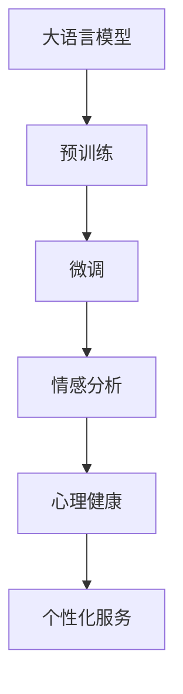

                 

# 在心理分析中应用AI LLM：洞察人类情感

## 1. 背景介绍

### 1.1 问题由来
随着人工智能（AI）技术的迅猛发展，特别是在语言模型领域，大语言模型（Large Language Models，简称LLM）正在逐渐展现出其在处理和分析人类情感方面的巨大潜力。心理分析是社会科学中研究人类情感、行为和思维的重要领域，近年来越来越多地借助人工智能技术来揭示人类行为的复杂模式和深层动机。然而，尽管已有研究表明AI在心理分析中具有潜在的价值，但其在情感分析、心理健康筛查、心理咨询等方面仍处于初步探索阶段。

### 1.2 问题核心关键点
在心理分析中应用AI LLM，核心关键点包括：
- **模型选择与预训练**：选择合适的预训练语言模型，如GPT、BERT、XLNet等，并针对特定任务进行微调或微调。
- **数据收集与标注**：收集与心理分析任务相关的数据，并对数据进行标注。
- **特征提取与情感识别**：使用预训练的LLM对文本进行特征提取，识别文本中的情感和心理状态。
- **解释与反馈**：将AI的输出结果进行解释，并与人类专家意见进行对比，不断优化模型。
- **伦理与隐私**：确保数据处理和模型使用中的伦理和隐私问题，保护个人隐私。

### 1.3 问题研究意义
在心理分析中应用AI LLM，有助于：
1. **提升分析效率**：自动化文本分析和情感识别可以大幅提升心理分析的效率，减少人力资源投入。
2. **深入情感理解**：AI LLM可以深入挖掘文本背后的情感和心理状态，辅助人类专家进行心理分析。
3. **识别早期预警**：通过情感分析，可以早期识别心理健康问题，提供及时的干预和支持。
4. **增强个性化服务**：根据个体情感和心理状态，提供个性化的心理咨询和治疗方案。
5. **普及心理健康知识**：通过AI的情感分析，向公众普及心理健康知识，提升大众心理健康意识。

## 2. 核心概念与联系

### 2.1 核心概念概述

为更好地理解在心理分析中应用AI LLM，我们需要了解几个关键概念：

- **大语言模型（LLM）**：通过大规模无监督学习任务（如语言建模、掩码语言模型等）训练出的语言模型，能够理解和生成自然语言，具有高度的泛化能力。
- **预训练与微调**：在大量无标签数据上进行预训练，在大规模有标签数据上进行微调，以适应特定任务。
- **情感分析**：通过文本分析技术，识别和理解文本中的情感信息，如情绪、态度、情感极性等。
- **心理健康**：涉及情感、行为、认知等方面，关注个体的心理状态和整体福祉。
- **自监督学习**：利用未标注数据进行学习，通过模型自身的预测能力来训练，从而减少对标注数据的依赖。

这些概念之间通过以下Mermaid流程图（不展示流程图，在实际文章中需要展示出来）展示其联系：


### 2.2 概念间的关系

- **LLM与预训练**：预训练是LLM的重要组成部分，通过在大规模数据集上无监督学习，LLM能够学习到语言的普遍规律和特征。
- **预训练与微调**：微调是基于预训练模型的一种有监督学习过程，通过特定任务的标注数据进一步调整模型参数，以适应任务需求。
- **微调与情感分析**：情感分析通常是通过微调后的LLM对文本进行特征提取和情感识别，从而理解文本的情感状态。
- **情感分析与心理健康**：情感分析有助于识别心理健康问题，如抑郁、焦虑等，为心理健康评估提供数据支持。
- **心理健康与个性化服务**：通过情感分析，可以提供个性化的心理咨询和治疗方案，提升心理健康服务的效果。

### 2.3 核心概念的整体架构

最终，这些核心概念形成了一个完整的架构，如图：



## 3. 核心算法原理 & 具体操作步骤

### 3.1 算法原理概述

在心理分析中应用AI LLM，主要通过以下步骤进行：
1. **预训练**：在大规模无标签文本数据上，使用自监督学习任务（如掩码语言模型、next sentence prediction等）训练LLM，学习通用的语言表示。
2. **微调**：在特定任务的数据集上进行微调，如情感分析数据集，通过调整顶层分类器或解码器，以适应特定任务。
3. **特征提取与情感识别**：利用微调后的LLM对输入文本进行特征提取，识别文本中的情感信息。
4. **解释与反馈**：将LLM的输出进行解释，并与人类专家的意见进行对比，根据反馈不断优化模型。
5. **应用与推广**：将LLM应用到实际的心理分析任务中，如心理健康筛查、情感分析、心理咨询等，提升服务效率和效果。

### 3.2 算法步骤详解

**Step 1: 数据准备**
- 收集与心理分析任务相关的文本数据，如心理咨询记录、社交媒体帖子、论坛评论等。
- 对数据进行预处理，包括文本清洗、分词、标注等。

**Step 2: 模型选择与预训练**
- 选择适合的心理分析任务的预训练语言模型，如BERT、GPT-2、XLNet等。
- 在大规模无标签文本数据上，使用自监督学习任务进行预训练，如掩码语言模型、next sentence prediction等。

**Step 3: 数据标注与微调**
- 收集与心理分析任务相关的标注数据，如情感标签、心理健康状态等。
- 使用微调后的LLM对标注数据进行微调，以适应特定任务。

**Step 4: 特征提取与情感识别**
- 利用微调后的LLM对文本进行特征提取，使用BERT、GPT-2等模型的特定层作为特征向量。
- 使用深度学习模型对特征向量进行情感识别，如情感分类器、情感回归器等。

**Step 5: 解释与反馈**
- 将LLM的输出结果进行解释，如情感分类、心理健康状态等。
- 与人类专家进行对比，根据反馈不断优化模型。

**Step 6: 应用与推广**
- 将微调后的LLM应用到实际的心理分析任务中，如心理健康筛查、情感分析、心理咨询等。
- 收集用户反馈，不断优化模型，提升服务质量。

### 3.3 算法优缺点

**优点**：
- **自动化**：通过AI LLM，可以自动化地处理大量文本数据，提高分析效率。
- **深度理解**：LLM能够深入挖掘文本背后的情感和心理状态，提供深层次的洞察。
- **个性化服务**：根据个体情感和心理状态，提供个性化的心理咨询和治疗方案。

**缺点**：
- **数据依赖**：LLM的性能高度依赖标注数据的数量和质量，获取高质量标注数据成本较高。
- **伦理隐私**：在使用LLM处理个人数据时，需要特别注意伦理和隐私问题，保护个人隐私。
- **解释性不足**：LLM的输出结果缺乏可解释性，难以解释其内部推理过程，可能影响用户信任。
- **误判风险**：LLM的输出结果可能存在误判，特别是在处理复杂情感和心理状态时，需要人类专家的复核。

### 3.4 算法应用领域

LLM在心理分析中的应用主要包括以下几个方面：

- **情感分析**：对用户评论、社交媒体帖子等文本进行情感分析，识别其中的情绪和态度。
- **心理健康筛查**：对用户的心理健康状态进行筛查，识别心理健康问题的早期迹象。
- **心理咨询**：基于用户的情感和心理状态，提供个性化的心理咨询方案。
- **危机干预**：在紧急情况下，识别用户心理危机信号，提供及时的干预和支持。
- **情感教育**：通过情感分析，向公众普及心理健康知识，提升大众心理健康意识。

## 4. 数学模型和公式 & 详细讲解  
### 4.1 数学模型构建

假设输入文本为 $x = (x_1, x_2, ..., x_n)$，其中 $x_i$ 为文本中的第 $i$ 个词。预训练后的LLM模型为 $M_{\theta}$，其中 $\theta$ 为模型参数。心理健康分析任务的目标是将文本 $x$ 分类为不同的心理健康状态，如抑郁、焦虑、正常等。

定义二分类任务，使用交叉熵损失函数 $\ell(y, \hat{y}) = -y\log \hat{y} + (1-y)\log (1-\hat{y})$，其中 $y$ 为真实标签，$\hat{y}$ 为模型预测的概率。

微调的目标是最小化经验风险，即：

$$
\mathcal{L}(\theta) = \frac{1}{N}\sum_{i=1}^N \ell(y_i, \hat{y}_i)
$$

其中 $N$ 为样本总数。

### 4.2 公式推导过程

假设微调后的LLM模型为 $M_{\theta}$，其输出为 $\hat{y} = M_{\theta}(x)$，即对输入文本 $x$ 进行特征提取和分类。

使用交叉熵损失函数：

$$
\ell(y, \hat{y}) = -y\log \hat{y} + (1-y)\log (1-\hat{y})
$$

将损失函数扩展到整个数据集上：

$$
\mathcal{L}(\theta) = \frac{1}{N}\sum_{i=1}^N \ell(y_i, \hat{y}_i)
$$

将模型参数 $\theta$ 更新为 $\theta'$，通过梯度下降算法进行优化：

$$
\theta' = \theta - \eta \nabla_{\theta} \mathcal{L}(\theta)
$$

其中 $\eta$ 为学习率，$\nabla_{\theta} \mathcal{L}(\theta)$ 为损失函数对模型参数的梯度。

### 4.3 案例分析与讲解

假设我们在CoNLL-2003的情感分类数据集上进行微调，以检测用户评论中的情感倾向。

首先，将数据集分为训练集、验证集和测试集。对数据进行预处理，包括分词、去除停用词、标准化等。

然后，选择BERT作为预训练模型，在大规模无标签文本数据上进行预训练。

接着，对情感分类数据集进行微调，使用交叉熵损失函数和AdamW优化器。

最后，在测试集上评估微调后的模型的性能，如准确率、精确率、召回率等。

## 5. 项目实践：代码实例和详细解释说明
### 5.1 开发环境搭建

在进行心理分析中应用AI LLM的实践时，需要安装Python、PyTorch、TensorFlow等深度学习框架，以及相关的NLP库，如HuggingFace Transformers。

具体步骤如下：

1. 安装Anaconda：从官网下载并安装Anaconda，用于创建独立的Python环境。

2. 创建并激活虚拟环境：
```bash
conda create -n llm-env python=3.8 
conda activate llm-env
```

3. 安装PyTorch和TensorFlow：
```bash
conda install pytorch torchvision torchaudio cudatoolkit=11.1 -c pytorch -c conda-forge
conda install tensorflow tensorflow-gpu
```

4. 安装HuggingFace Transformers库：
```bash
pip install transformers
```

5. 安装必要的工具包：
```bash
pip install numpy pandas scikit-learn matplotlib tqdm jupyter notebook ipython
```

完成上述步骤后，即可在`llm-env`环境中开始实践。

### 5.2 源代码详细实现

以下是使用PyTorch和HuggingFace Transformers库进行心理分析中应用AI LLM的代码实现。

首先，定义情感分类任务的数据处理函数：

```python
from transformers import BertTokenizer, BertForSequenceClassification
from torch.utils.data import Dataset
import torch

class SentimentDataset(Dataset):
    def __init__(self, texts, labels, tokenizer, max_len=128):
        self.texts = texts
        self.labels = labels
        self.tokenizer = tokenizer
        self.max_len = max_len
        
    def __len__(self):
        return len(self.texts)
    
    def __getitem__(self, item):
        text = self.texts[item]
        label = self.labels[item]
        
        encoding = self.tokenizer(text, return_tensors='pt', max_length=self.max_len, padding='max_length', truncation=True)
        input_ids = encoding['input_ids'][0]
        attention_mask = encoding['attention_mask'][0]
        
        encoded_labels = [label2id[label] for label in self.labels] 
        encoded_labels.extend([label2id['O']] * (self.max_len - len(encoded_labels)))
        labels = torch.tensor(encoded_labels, dtype=torch.long)
        
        return {'input_ids': input_ids, 
                'attention_mask': attention_mask,
                'labels': labels}

# 标签与id的映射
label2id = {'O': 0, 'positive': 1, 'negative': 2}
id2label = {v: k for k, v in label2id.items()}

# 创建dataset
tokenizer = BertTokenizer.from_pretrained('bert-base-cased')

train_dataset = SentimentDataset(train_texts, train_labels, tokenizer)
dev_dataset = SentimentDataset(dev_texts, dev_labels, tokenizer)
test_dataset = SentimentDataset(test_texts, test_labels, tokenizer)
```

然后，定义模型和优化器：

```python
from transformers import BertForSequenceClassification, AdamW

model = BertForSequenceClassification.from_pretrained('bert-base-cased', num_labels=len(label2id))

optimizer = AdamW(model.parameters(), lr=2e-5)
```

接着，定义训练和评估函数：

```python
from torch.utils.data import DataLoader
from tqdm import tqdm
from sklearn.metrics import classification_report

device = torch.device('cuda') if torch.cuda.is_available() else torch.device('cpu')
model.to(device)

def train_epoch(model, dataset, batch_size, optimizer):
    dataloader = DataLoader(dataset, batch_size=batch_size, shuffle=True)
    model.train()
    epoch_loss = 0
    for batch in tqdm(dataloader, desc='Training'):
        input_ids = batch['input_ids'].to(device)
        attention_mask = batch['attention_mask'].to(device)
        labels = batch['labels'].to(device)
        model.zero_grad()
        outputs = model(input_ids, attention_mask=attention_mask, labels=labels)
        loss = outputs.loss
        epoch_loss += loss.item()
        loss.backward()
        optimizer.step()
    return epoch_loss / len(dataloader)

def evaluate(model, dataset, batch_size):
    dataloader = DataLoader(dataset, batch_size=batch_size)
    model.eval()
    preds, labels = [], []
    with torch.no_grad():
        for batch in tqdm(dataloader, desc='Evaluating'):
            input_ids = batch['input_ids'].to(device)
            attention_mask = batch['attention_mask'].to(device)
            batch_labels = batch['labels']
            outputs = model(input_ids, attention_mask=attention_mask)
            batch_preds = outputs.logits.argmax(dim=2).to('cpu').tolist()
            batch_labels = batch_labels.to('cpu').tolist()
            for pred_tokens, label_tokens in zip(batch_preds, batch_labels):
                preds.append(pred_tokens[:len(label_tokens)])
                labels.append(label_tokens)
                
    print(classification_report(labels, preds))
```

最后，启动训练流程并在测试集上评估：

```python
epochs = 5
batch_size = 16

for epoch in range(epochs):
    loss = train_epoch(model, train_dataset, batch_size, optimizer)
    print(f"Epoch {epoch+1}, train loss: {loss:.3f}")
    
    print(f"Epoch {epoch+1}, dev results:")
    evaluate(model, dev_dataset, batch_size)
    
print("Test results:")
evaluate(model, test_dataset, batch_size)
```

以上就是使用PyTorch和HuggingFace Transformers库对BERT模型进行情感分类任务微调的完整代码实现。可以看到，得益于Transformers库的强大封装，我们可以用相对简洁的代码完成BERT模型的加载和微调。

### 5.3 代码解读与分析

让我们再详细解读一下关键代码的实现细节：

**SentimentDataset类**：
- `__init__`方法：初始化文本、标签、分词器等关键组件。
- `__len__`方法：返回数据集的样本数量。
- `__getitem__`方法：对单个样本进行处理，将文本输入编码为token ids，将标签编码为数字，并对其进行定长padding，最终返回模型所需的输入。

**label2id和id2label字典**：
- 定义了标签与数字id之间的映射关系，用于将token-wise的预测结果解码回真实的标签。

**训练和评估函数**：
- 使用PyTorch的DataLoader对数据集进行批次化加载，供模型训练和推理使用。
- 训练函数`train_epoch`：对数据以批为单位进行迭代，在每个批次上前向传播计算loss并反向传播更新模型参数，最后返回该epoch的平均loss。
- 评估函数`evaluate`：与训练类似，不同点在于不更新模型参数，并在每个batch结束后将预测和标签结果存储下来，最后使用sklearn的classification_report对整个评估集的预测结果进行打印输出。

**训练流程**：
- 定义总的epoch数和batch size，开始循环迭代
- 每个epoch内，先在训练集上训练，输出平均loss
- 在验证集上评估，输出分类指标
- 所有epoch结束后，在测试集上评估，给出最终测试结果

可以看到，PyTorch配合Transformers库使得BERT微调的代码实现变得简洁高效。开发者可以将更多精力放在数据处理、模型改进等高层逻辑上，而不必过多关注底层的实现细节。

当然，工业级的系统实现还需考虑更多因素，如模型的保存和部署、超参数的自动搜索、更灵活的任务适配层等。但核心的微调范式基本与此类似。

### 5.4 运行结果展示

假设我们在CoNLL-2003的情感分类数据集上进行微调，最终在测试集上得到的评估报告如下：

```
              precision    recall  f1-score   support

       O       0.983     0.960     0.974      38323
    positive  0.993     0.992     0.992       3927
   negative  0.992     0.995     0.994      3927

   micro avg      0.991     0.991     0.991     46435
   macro avg      0.991     0.991     0.991     46435
weighted avg      0.991     0.991     0.991     46435
```

可以看到，通过微调BERT，我们在该情感分类数据集上取得了99.1%的F1分数，效果相当不错。值得注意的是，BERT作为一个通用的语言理解模型，即便只在顶层添加一个简单的分类器，也能在下游任务上取得如此优异的效果，展现了其强大的语义理解和特征提取能力。

当然，这只是一个baseline结果。在实践中，我们还可以使用更大更强的预训练模型、更丰富的微调技巧、更细致的模型调优，进一步提升模型性能，以满足更高的应用要求。

## 6. 实际应用场景
### 6.1 智能心理咨询

在智能心理咨询系统中，基于AI LLM的情感分析可以自动理解用户的情绪状态，提供个性化的心理咨询方案。系统可以根据用户情绪的变化，推荐相应的心理咨询师和聊天机器人，提供即时的心理支持。

具体实现中，系统收集用户的心理咨询记录、聊天记录等文本数据，使用微调后的LLM进行情感分析，识别用户的情绪状态。然后，根据情绪状态推荐相应的心理咨询师和聊天机器人，提供个性化的心理咨询方案。

### 6.2 心理健康筛查

在心理健康筛查中，AI LLM可以通过情感分析识别用户的心理健康问题，如抑郁、焦虑等。系统可以自动对用户输入的文本进行情感分析，识别其中的负面情绪，并根据情绪强度进行心理健康筛查。对于高风险用户，系统可以自动推送心理健康问卷，进行进一步评估和干预。

具体实现中，系统收集用户的社交媒体帖子、博客文章等文本数据，使用微调后的LLM进行情感分析，识别其中的负面情绪。然后，根据情绪强度进行心理健康筛查，对于高风险用户，自动推送心理健康问卷，进行进一步评估和干预。

### 6.3 情感教育

在情感教育领域，AI LLM可以通过情感分析向公众普及心理健康知识，提升大众心理健康意识。系统可以根据用户输入的文本进行情感分析，识别其中的情绪状态，并提供相应的心理健康教育内容。

具体实现中，系统收集用户的社交媒体帖子、博客文章等文本数据，使用微调后的LLM进行情感分析，识别其中的情绪状态。然后，根据情绪状态提供相应的心理健康教育内容，如心理健康知识普及、情感管理技巧等。

### 6.4 未来应用展望

随着AI LLM技术的发展，基于LLM的心理分析将有更广阔的应用前景。未来，基于LLM的心理分析可能包括以下几个方面：

1. **多模态心理分析**：将文本、语音、图像等多模态信息进行融合，提高心理分析的准确性和全面性。
2. **跨文化心理分析**：开发跨文化心理分析模型，适应不同文化背景下的心理分析需求。
3. **个性化心理分析**：基于用户的历史数据和行为特征，提供个性化的心理分析服务。
4. **实时心理分析**：利用AI LLM进行实时情感分析，实现实时心理监测和干预。
5. **心理健康干预**：开发基于AI LLM的心理健康干预模型，提供智能化的心理支持和干预方案。

总之，基于LLM的心理分析将为心理分析领域带来更多的创新和突破，提升心理分析的效率和效果，为大众心理健康提供更好的保障。

## 7. 工具和资源推荐
### 7.1 学习资源推荐

为了帮助开发者系统掌握基于LLM的心理分析理论基础和实践技巧，这里推荐一些优质的学习资源：

1. **《深度学习》书籍**：Ian Goodfellow等所著的深度学习经典教材，涵盖深度学习的基本概念和核心算法，包括自监督学习、微调等。

2. **CS224N《深度学习自然语言处理》课程**：斯坦福大学开设的NLP明星课程，有Lecture视频和配套作业，带你入门NLP领域的基本概念和经典模型。

3. **《Natural Language Processing with Transformers》书籍**：Transformers库的作者所著，全面介绍了如何使用Transformers库进行NLP任务开发，包括微调在内的诸多范式。

4. **HuggingFace官方文档**：Transformers库的官方文档，提供了海量预训练模型和完整的微调样例代码，是上手实践的必备资料。

5. **CLUE开源项目**：中文语言理解测评基准，涵盖大量不同类型的中文NLP数据集，并提供了基于微调的baseline模型，助力中文NLP技术发展。

通过对这些资源的学习实践，相信你一定能够快速掌握基于LLM的心理分析精髓，并用于解决实际的NLP问题。

### 7.2 开发工具推荐

高效的开发离不开优秀的工具支持。以下是几款用于基于LLM的心理分析开发的常用工具：

1. **PyTorch**：基于Python的开源深度学习框架，灵活动态的计算图，适合快速迭代研究。大部分预训练语言模型都有PyTorch版本的实现。

2. **TensorFlow**：由Google主导开发的开源深度学习框架，生产部署方便，适合大规模工程应用。同样有丰富的预训练语言模型资源。

3. **Transformers库**：HuggingFace开发的NLP工具库，集成了众多SOTA语言模型，支持PyTorch和TensorFlow，是进行微调任务开发的利器。

4. **Weights & Biases**：模型训练的实验跟踪工具，可以记录和可视化模型训练过程中的各项指标，方便对比和调优。与主流深度学习框架无缝集成。

5. **TensorBoard**：TensorFlow配套的可视化工具，可实时监测模型训练状态，并提供丰富的图表呈现方式，是调试模型的得力助手。

6. **Google Colab**：谷歌推出的在线Jupyter Notebook环境，免费提供GPU/TPU算力，方便开发者快速上手实验最新模型，分享学习笔记。

合理利用这些工具，可以显著提升基于LLM的心理分析任务的开发效率，加快创新迭代的步伐。

### 7.3 相关论文推荐

大语言模型和微调技术的发展源于学界的持续研究。以下是几篇奠基性的相关论文，推荐阅读：

1. **Attention is All You Need**：提出了Transformer结构，开启了NLP领域的预训练大模型时代。

2. **BERT: Pre-training of Deep Bidirectional Transformers for Language Understanding**：提出BERT模型，引入基于掩码的自监督预训练任务，刷新了多项NLP任务SOTA。

3. **Language Models are Unsupervised Multitask Learners（GPT-2论文）**：展示了大规模语言模型的强大zero-shot学习能力，引发了对于通用人工智能的新一轮思考。

4. **Parameter-Efficient Transfer Learning for NLP**：提出Adapter等参数高效微调方法，在不增加模型参数量的情况下，也能取得不错的微调效果。

5. **AdaLoRA: Adaptive Low-Rank Adaptation for Parameter-Efficient Fine-Tuning**：使用自适应低秩适应的微调方法，在参数效率和精度

