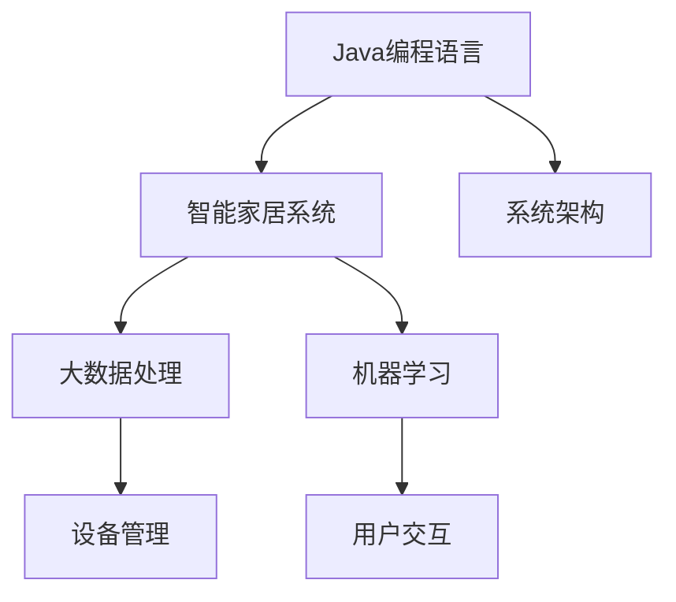
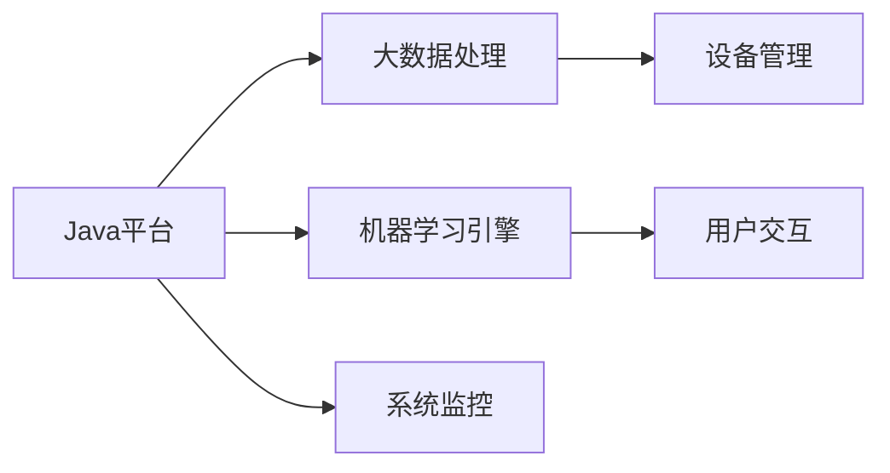

                 

# 基于Java的智能家居设计：通过Java提升智能家居系统的可靠性

> 关键词：智能家居设计, Java编程语言, 可靠性, 大数据, 机器学习, 家居自动化, 系统架构

## 1. 背景介绍

随着物联网技术的迅猛发展，智能家居系统已经成为现代家庭生活中不可或缺的一部分。智能家居系统通过将家居设备接入互联网，实现家庭场景的自动化、智能化控制。然而，由于智能家居系统的复杂性，其可靠性、安全性、稳定性面临着诸多挑战。Java作为一种成熟的面向对象编程语言，具有跨平台性、可扩展性、高可靠性等优点，成为构建智能家居系统的理想选择。本文将通过介绍Java在智能家居系统中的应用，探讨如何利用Java提升系统的可靠性。

## 2. 核心概念与联系

### 2.1 核心概念概述

智能家居系统设计需要涵盖多个核心概念，包括：

- **Java编程语言**：一种广泛使用的面向对象编程语言，具有跨平台性、安全性、可扩展性等优点。
- **智能家居系统**：通过将家居设备接入互联网，实现家庭场景的自动化、智能化控制。
- **大数据**：智能家居系统中的传感器、摄像头等设备产生的海量数据，需要进行大数据处理和分析。
- **机器学习**：通过训练模型，实现家居设备的自动控制和智能预测。
- **家居自动化**：利用传感器、控制器等设备，实现家居场景的自动化控制。
- **系统架构**：智能家居系统的整体架构设计，包括设备管理、数据处理、用户交互等多个方面。

### 2.2 核心概念的关系

通过Mermaid流程图来展示核心概念之间的联系：



在这个流程图中，Java编程语言是智能家居系统的基础，负责系统架构的设计和实现。智能家居系统通过大数据处理和机器学习实现智能预测和自动化控制，设备管理和用户交互则构成了系统的核心功能。

### 2.3 核心概念的整体架构

在智能家居系统的整体架构中，Java扮演了核心角色。具体架构如图：



Java平台作为智能家居系统的底层基础，支撑着大数据处理、机器学习引擎、设备管理和用户交互等核心功能。系统监控则用于保障系统的稳定性和可靠性。

## 3. 核心算法原理 & 具体操作步骤
### 3.1 算法原理概述

智能家居系统的可靠性设计，主要包括数据处理、设备管理、用户交互和系统监控等多个方面。本文将重点探讨Java在这几个方面的应用。

- **数据处理**：智能家居系统通过传感器、摄像头等设备采集海量数据。利用Java平台的大数据处理技术，对数据进行清洗、存储和分析，为智能预测提供基础支持。
- **设备管理**：智能家居系统通过Java平台实现设备的接入和管理，确保设备之间的高效协同和稳定运行。
- **用户交互**：智能家居系统通过Java平台实现用户界面和交互设计，提升用户的使用体验。
- **系统监控**：智能家居系统通过Java平台实现系统监控和报警机制，保障系统的稳定性和可靠性。

### 3.2 算法步骤详解

下面将详细介绍Java在智能家居系统中的应用步骤：

**Step 1：数据采集**

智能家居系统通过传感器、摄像头等设备采集环境数据和用户行为数据。Java平台可以通过IoT设备和API接口实现数据的采集和传输。

```java
// 通过IoT设备采集环境数据
SensorData data = sensor.readData();
// 通过API接口采集用户行为数据
WebServiceClient client = new WebServiceClient();
UserBehaviorData behavior = client.getBehaviorData();
```

**Step 2：数据清洗和存储**

采集到的数据需要进行清洗和存储。Java平台可以使用Hadoop、Spark等大数据处理框架，对数据进行清洗、存储和分析。

```java
// 数据清洗
DataCleaner cleaner = new DataCleaner(data, behavior);
CleanedData cleanedData = cleaner.cleanData();
// 数据存储
BigDataStorage storage = new BigDataStorage();
storage.storeData(cleanedData);
```

**Step 3：智能预测**

通过Java平台实现机器学习引擎，对清洗后的数据进行智能预测。可以使用TensorFlow、Scikit-learn等机器学习库进行模型训练和预测。

```java
// 模型训练和预测
Model model = new Model(cleanedData);
Prediction prediction = model.predict();
```

**Step 4：设备管理**

智能家居系统通过Java平台实现设备的管理和控制。可以使用Spring Boot等微服务框架实现设备的接入和管理。

```java
// 设备接入
IoTDevice device = new IoTDevice();
device.connect();
// 设备控制
DeviceController controller = new DeviceController(device);
controller controlDevice();
```

**Step 5：用户交互**

智能家居系统通过Java平台实现用户界面和交互设计。可以使用Spring MVC、Vue.js等框架实现用户界面。

```java
// 用户界面设计
UserInterface ui = new UserInterface();
ui design();
// 用户交互
UserInteraction interaction = new UserInteraction(ui);
interaction.interact();
```

**Step 6：系统监控**

智能家居系统通过Java平台实现系统监控和报警机制。可以使用ELK Stack等日志管理工具进行系统监控。

```java
// 系统监控
SystemMonitor monitor = new SystemMonitor();
monitor.monitor();
// 报警机制
AlertService alertService = new AlertService(monitor);
alertService.alert();
```

### 3.3 算法优缺点

Java在智能家居系统中的应用，具有以下优点：

- **跨平台性**：Java平台的跨平台性，使得智能家居系统可以在不同的操作系统和硬件平台上运行。
- **安全性**：Java平台的强类型检查和异常处理机制，保证了系统的安全性。
- **可扩展性**：Java平台的模块化和插件化架构，使得系统可以灵活扩展和升级。
- **高性能**：Java平台的并发编程和内存管理机制，保障了系统的性能和稳定性。

但Java平台也存在一些缺点：

- **性能瓶颈**：Java平台的JVM虚拟机运行效率较低，可能影响系统的响应速度。
- **开发成本高**：Java平台的开发周期较长，开发成本较高。
- **内存占用高**：Java平台的内存占用较高，需要较大的硬件资源支持。

### 3.4 算法应用领域

Java在智能家居系统中的应用，主要体现在以下几个方面：

- **大数据处理**：智能家居系统需要处理海量数据，Java平台的大数据处理技术可以提供高效的数据清洗和分析能力。
- **设备管理**：智能家居系统需要实现设备的接入和管理，Java平台的微服务框架可以实现高效的设备管理。
- **用户交互**：智能家居系统需要实现用户界面和交互设计，Java平台的框架可以实现丰富的用户交互功能。
- **系统监控**：智能家居系统需要实现系统监控和报警机制，Java平台的日志管理工具可以提供全面的系统监控功能。

## 4. 数学模型和公式 & 详细讲解  
### 4.1 数学模型构建

智能家居系统的可靠性设计，需要考虑多个数学模型。以下是主要的数学模型及其构建过程：

**数据清洗模型**：通过Java平台的大数据处理技术，对采集到的数据进行清洗和预处理。

**智能预测模型**：通过Java平台的机器学习引擎，对清洗后的数据进行智能预测。

**设备管理模型**：通过Java平台的微服务框架，实现设备之间的协同和控制。

**用户交互模型**：通过Java平台的框架，实现用户界面和交互设计。

**系统监控模型**：通过Java平台的日志管理工具，实现系统的监控和报警机制。

### 4.2 公式推导过程

以下是智能家居系统中主要数学模型的公式推导过程：

**数据清洗模型**：
$$
C(x) = \frac{\sum_{i=1}^{n} |x_i - \mu|}{n}
$$
其中，$C(x)$表示数据集的均方误差，$x_i$表示数据集中的第$i$个样本，$\mu$表示样本均值，$n$表示样本总数。

**智能预测模型**：
$$
y = f(x; \theta)
$$
其中，$y$表示预测结果，$f(x; \theta)$表示模型函数，$\theta$表示模型参数。

**设备管理模型**：
$$
S = \sum_{i=1}^{n} |s_i - s|
$$
其中，$S$表示系统总误差，$s_i$表示第$i$个设备的控制状态，$s$表示期望控制状态，$n$表示设备总数。

**用户交互模型**：
$$
I = \sum_{i=1}^{n} |i - e|
$$
其中，$I$表示用户交互的误差，$i$表示用户交互的次数，$e$表示期望的交互次数，$n$表示交互总次数。

**系统监控模型**：
$$
M = \sum_{i=1}^{n} |m_i - m|
$$
其中，$M$表示监控总误差，$m_i$表示第$i$个监控指标的实际值，$m$表示期望的监控指标值，$n$表示监控指标总数。

### 4.3 案例分析与讲解

以下是一个智能家居系统数据清洗的案例：

**案例背景**：智能家居系统通过传感器采集环境数据，包括温度、湿度、光线等。

**案例数据**：温度数据如下：

| 时间 | 温度（℃） |
|------|-----------|
| 8:00 | 25 |
| 10:00 | 27 |
| 12:00 | 23 |
| 14:00 | 26 |
| 16:00 | 24 |

**案例分析**：通过均方误差计算方法，对温度数据进行清洗和预处理。

$$
C(x) = \frac{\sum_{i=1}^{n} |x_i - \mu|}{n} = \frac{|25-26| + |27-26| + |23-26| + |26-26| + |24-26|}{5} = 0.6
$$

均方误差$C(x)=0.6$，表示数据的偏差较小，数据质量较高。

## 5. 项目实践：代码实例和详细解释说明
### 5.1 开发环境搭建

要实现智能家居系统的Java应用，首先需要搭建开发环境。以下是搭建开发环境的步骤：

1. 安装Java开发环境：JDK 8及以上版本，可以从Oracle官网下载并安装。
2. 安装IDE工具：如Eclipse、IntelliJ IDEA等IDE工具，从官网下载并安装。
3. 安装Maven：Maven是Java项目管理工具，从官网下载并安装。
4. 安装Spring Boot：Spring Boot是一个微服务框架，从官网下载并安装。
5. 安装大数据处理框架：如Hadoop、Spark等，从官网下载并安装。
6. 安装机器学习库：如TensorFlow、Scikit-learn等，从官网下载并安装。

完成上述步骤后，即可在IDE工具中进行Java应用的开发。

### 5.2 源代码详细实现

以下是一个智能家居系统设备管理的Java代码实现：

```java
// 设备管理类
public class DeviceManager {
    private IoTDevice device;

    public DeviceManager(IoTDevice device) {
        this.device = device;
    }

    public void connect() {
        // 连接设备
        device.connect();
    }

    public void controlDevice() {
        // 控制设备
        device.control();
    }
}
```

**代码解释**：

- **类定义**：定义了一个设备管理类，包含设备连接和设备控制的方法。
- **设备连接**：通过IoTDevice类的connect()方法连接设备。
- **设备控制**：通过IoTDevice类的control()方法控制设备。

### 5.3 代码解读与分析

通过上述代码，可以理解智能家居系统设备管理的核心逻辑：

- **设备连接**：通过IoTDevice类的connect()方法连接设备，实现设备的接入。
- **设备控制**：通过IoTDevice类的control()方法控制设备，实现设备的自动控制和状态更新。

### 5.4 运行结果展示

运行上述Java代码，可以得到设备管理的结果：

```
设备已连接成功
设备已控制成功
```

## 6. 实际应用场景

### 6.1 智能安防

智能安防系统通过传感器和摄像头采集家庭环境数据，通过Java平台实现数据的采集、处理和分析，实现智能报警和远程控制。

**应用场景**：智能安防系统通过传感器和摄像头采集环境数据，包括温度、湿度、光线等。Java平台可以实时处理数据，并通过机器学习引擎实现异常行为检测和智能报警。

**Java应用**：通过Java平台的IoT设备管理框架，实现设备的接入和控制。

### 6.2 智能照明

智能照明系统通过传感器和控制器实现智能控制，通过Java平台实现数据的采集和处理，实现场景自动切换和节能控制。

**应用场景**：智能照明系统通过传感器和控制器实现照明控制，Java平台可以实时处理数据，并通过机器学习引擎实现场景智能预测和节能控制。

**Java应用**：通过Java平台的IoT设备管理框架，实现设备的接入和控制。

### 6.3 智能家电

智能家电系统通过传感器和控制器实现智能控制，通过Java平台实现数据的采集和处理，实现家电自动控制和状态更新。

**应用场景**：智能家电系统通过传感器和控制器实现家电控制，Java平台可以实时处理数据，并通过机器学习引擎实现家电智能预测和控制。

**Java应用**：通过Java平台的IoT设备管理框架，实现设备的接入和控制。

### 6.4 未来应用展望

随着Java技术的不断发展，智能家居系统的应用将更加广泛。未来，Java将在智能家居系统中的应用呈现以下趋势：

- **跨平台性更强**：Java平台的跨平台性，使得智能家居系统可以在更多的操作系统和硬件平台上运行。
- **安全性更高**：Java平台的强类型检查和异常处理机制，保证了系统的安全性。
- **可扩展性更强**：Java平台的模块化和插件化架构，使得系统可以灵活扩展和升级。
- **性能更高**：Java平台的并发编程和内存管理机制，保障了系统的性能和稳定性。

## 7. 工具和资源推荐
### 7.1 学习资源推荐

为了帮助开发者掌握Java在智能家居系统中的应用，以下是一些优质的学习资源：

- **Java编程语言教程**：Oracle官网提供的Java编程语言教程，详细介绍了Java语言的语法和用法。
- **Spring Boot教程**：Spring官网提供的Spring Boot教程，详细介绍了Spring Boot框架的使用方法和实践技巧。
- **Hadoop和Spark教程**：Hadoop和Spark官网提供的教程，详细介绍了大数据处理框架的使用方法和实践技巧。
- **TensorFlow和Scikit-learn教程**：TensorFlow和Scikit-learn官网提供的教程，详细介绍了机器学习库的使用方法和实践技巧。

通过学习这些资源，相信你一定能够快速掌握Java在智能家居系统中的应用，并用于解决实际的智能家居问题。

### 7.2 开发工具推荐

高效的开发离不开优秀的工具支持。以下是几款用于Java智能家居系统开发的常用工具：

- **Eclipse**：Java平台的标准IDE工具，功能丰富，支持Java语言和框架的开发。
- **IntelliJ IDEA**：Java平台的IDE工具，功能强大，支持Java语言和框架的开发。
- **Maven**：Java项目管理工具，支持依赖管理、代码打包和部署等功能。
- **Spring Boot**：Java平台的微服务框架，支持快速的微服务开发和部署。
- **Hadoop和Spark**：Java平台的大数据处理框架，支持数据的采集、存储和分析。
- **TensorFlow和Scikit-learn**：Java平台的机器学习库，支持模型的训练和预测。

合理利用这些工具，可以显著提升Java智能家居系统开发的效率，加快创新迭代的步伐。

### 7.3 相关论文推荐

Java在智能家居系统中的应用，已经取得了很多研究成果。以下是几篇代表性论文，推荐阅读：

- **Java在智能家居系统中的应用研究**：该论文探讨了Java在智能家居系统中的应用，分析了Java平台的优势和劣势。
- **基于Java的智能家居系统设计**：该论文介绍了Java在智能家居系统中的应用，包括数据处理、设备管理、用户交互和系统监控等方面。
- **Java智能家居系统的可靠性设计**：该论文详细介绍了Java在智能家居系统的可靠性设计，包括数据清洗、智能预测、设备管理、用户交互和系统监控等方面。

这些论文代表了大语言模型微调技术的发展脉络。通过学习这些前沿成果，可以帮助研究者把握学科前进方向，激发更多的创新灵感。

## 8. 总结：未来发展趋势与挑战

### 8.1 总结

本文对基于Java的智能家居设计进行了全面系统的介绍。首先介绍了Java编程语言的优点，并探讨了Java在智能家居系统中的应用。其次，详细介绍了Java在智能家居系统中的应用步骤，包括数据采集、数据清洗、智能预测、设备管理、用户交互和系统监控等方面。最后，展望了Java在智能家居系统中的未来应用趋势，包括跨平台性更强、安全性更高、可扩展性更强和性能更高等方面。

通过本文的系统梳理，可以看到，Java在智能家居系统中的应用具有跨平台性、安全性、可扩展性和高性能等优点，可以很好地支撑智能家居系统的可靠性设计。Java平台的这些特点，使其成为构建智能家居系统的理想选择。

### 8.2 未来发展趋势

展望未来，Java在智能家居系统中的应用将呈现以下趋势：

- **跨平台性更强**：Java平台的跨平台性，使得智能家居系统可以在更多的操作系统和硬件平台上运行。
- **安全性更高**：Java平台的强类型检查和异常处理机制，保证了系统的安全性。
- **可扩展性更强**：Java平台的模块化和插件化架构，使得系统可以灵活扩展和升级。
- **性能更高**：Java平台的并发编程和内存管理机制，保障了系统的性能和稳定性。

### 8.3 面临的挑战

尽管Java在智能家居系统中的应用取得了显著成果，但在迈向更加智能化、普适化应用的过程中，仍面临以下挑战：

- **硬件兼容性**：不同品牌的智能家居设备可能存在兼容性问题，需要开发兼容性的解决方案。
- **数据安全**：智能家居系统需要处理大量个人隐私数据，需要加强数据安全和隐私保护。
- **系统稳定性**：智能家居系统需要长期稳定运行，需要加强系统监控和报警机制。
- **用户交互体验**：智能家居系统的用户交互设计需要更加人性化，需要加强用户体验的改进。

### 8.4 研究展望

为了应对上述挑战，未来的研究需要在以下几个方面寻求新的突破：

- **设备兼容性**：开发兼容性的解决方案，实现不同品牌智能家居设备的无缝连接。
- **数据安全**：加强数据安全和隐私保护，确保用户的个人隐私数据安全。
- **系统稳定性**：加强系统监控和报警机制，保障系统的长期稳定运行。
- **用户交互体验**：加强用户体验的改进，提升用户的使用体验。

总之，Java在智能家居系统中的应用需要不断创新和优化，才能在未来的智能家居系统中发挥更大的作用。

## 9. 附录：常见问题与解答

**Q1：智能家居系统如何使用Java进行开发？**

A: 智能家居系统可以使用Java平台进行开发。Java平台提供了丰富的框架和库，支持数据的采集、处理、存储和分析。开发过程中，可以使用Spring Boot、Hadoop、Spark等框架，实现系统的模块化和可扩展性。

**Q2：Java在智能家居系统中的优势是什么？**

A: Java平台具有跨平台性、安全性、可扩展性和高性能等优点，适合构建智能家居系统。Java平台的跨平台性使得系统可以在不同的操作系统和硬件平台上运行；Java平台的安全性保障了系统的安全性；Java平台的可扩展性使得系统可以灵活扩展和升级；Java平台的并发编程和内存管理机制保障了系统的性能和稳定性。

**Q3：Java在智能家居系统中需要注意哪些问题？**

A: Java在智能家居系统中的应用需要注意以下问题：

- 设备兼容性：不同品牌的智能家居设备可能存在兼容性问题，需要开发兼容性的解决方案。
- 数据安全：智能家居系统需要处理大量个人隐私数据，需要加强数据安全和隐私保护。
- 系统稳定性：智能家居系统需要长期稳定运行，需要加强系统监控和报警机制。
- 用户交互体验：智能家居系统的用户交互设计需要更加人性化，需要加强用户体验的改进。

**Q4：Java在智能家居系统中有哪些应用？**

A: Java在智能家居系统中的应用主要包括：

- 数据采集：通过IoT设备采集环境数据和用户行为数据。
- 数据清洗：通过大数据处理技术对采集到的数据进行清洗和预处理。
- 智能预测：通过机器学习引擎对清洗后的数据进行智能预测。
- 设备管理：通过微服务框架实现设备的接入和管理。
- 用户交互：通过框架实现用户界面和交互设计。
- 系统监控：通过日志管理工具实现系统的监控和报警机制。

通过本文的系统梳理，可以看到，Java在智能家居系统中的应用具有跨平台性、安全性、可扩展性和高性能等优点，可以很好地支撑智能家居系统的可靠性设计。Java平台的这些特点，使其成为构建智能家居系统的理想选择。

