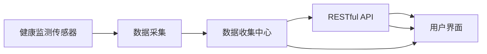

                 

# 基于MQTT协议和RESTful API的家庭健康监测系统

## 1. 背景介绍

随着科技的进步，家庭健康监测系统（Home Health Monitoring System，HHMS）在现代家庭生活中扮演着越来越重要的角色。这些系统通过收集家庭成员的健康数据，如血压、血糖、心率等，及时发现潜在的健康风险，从而改善居民的健康状况和生活质量。然而，传统的家庭健康监测系统多采用有线连接或本地采集设备，存在部署复杂、扩展性差、维护成本高等问题。

为了解决这些痛点，文章将基于MQTT协议和RESTful API，构建一个高效、可靠、易于扩展的家庭健康监测系统。该系统能够通过无线方式实时收集健康数据，并对外提供RESTful API，支持各类移动设备访问和数据管理。通过这种方式，系统能够实现数据的无缝同步和实时监控，确保家庭成员的健康得到及时关注和保障。

## 2. 核心概念与联系

### 2.1 核心概念概述

在讨论基于MQTT协议和RESTful API的家庭健康监测系统之前，我们需要了解以下核心概念：

- **MQTT（Message Queuing Telemetry Transport）协议**：一种轻量级、低功耗的发布/订阅消息协议，适用于物联网设备的通讯。其特点包括连接简单、传输数据量小、数据丢失率低等。

- **RESTful API**：基于REST（Representational State Transfer）架构风格的设计API，通过HTTP协议实现资源的CRUD（Create, Read, Update, Delete）操作。其特点包括易于理解、可扩展性强、支持多种数据格式等。

- **健康监测传感器**：用于采集健康数据（如心率、血压、血糖等）的硬件设备，通常包含微控制器和通讯模块。

- **数据收集中心**：负责集中存储和管理健康数据的服务器，通常运行在云端，通过API对外提供服务。

- **用户界面**：用于展示健康数据、控制监测设备的客户端应用，通常运行在移动设备或PC上。

这些概念通过MQTT协议和RESTful API紧密地联系在一起，形成了高效、灵活的家庭健康监测系统架构。

### 2.2 核心概念原理和架构

通过Mermaid流程图，可以直观地展示这些概念之间的联系：



上述图表展示了健康监测传感器通过MQTT协议将数据发送到数据收集中心，然后通过RESTful API将数据对外提供服务，最终用户界面通过API获取数据并展示在用户面前。

## 3. 核心算法原理 & 具体操作步骤

### 3.1 算法原理概述

基于MQTT协议和RESTful API的家庭健康监测系统主要包含数据采集、数据传输、数据存储和数据展示四个部分。其核心算法原理如下：

1. **数据采集**：健康监测传感器采集家庭成员的健康数据，并通过MQTT协议发布到数据收集中心。
2. **数据传输**：数据收集中心通过RESTful API接收传感器数据，并将其存储在云端数据库中。
3. **数据存储**：云端数据库采用分布式存储技术（如Hadoop、Cassandra等），确保数据的高可用性和可扩展性。
4. **数据展示**：用户界面通过RESTful API获取云端数据，并展示在用户面前。

### 3.2 算法步骤详解

基于上述算法原理，我们接下来详细介绍每个步骤的详细步骤：

#### 3.2.1 数据采集

1. **选择传感器**：根据监测需求选择合适的健康监测传感器，如心率监测器、血压计、血糖仪等。
2. **传感器初始化**：传感器通过编程方式初始化，设置通讯参数（如MQTT服务器的地址、端口等）。
3. **数据采集**：传感器周期性地采集健康数据，并通过MQTT协议发布到数据收集中心。

#### 3.2.2 数据传输

1. **搭建MQTT服务器**：在数据收集中心搭建MQTT服务器，用于接收传感器数据。
2. **数据接收与处理**：MQTT服务器通过订阅特定主题（如`/sensor_data`）接收传感器数据，并解析为JSON格式。
3. **数据存储**：将解析后的数据存储在云端数据库中，确保数据的安全性和可靠性。

#### 3.2.3 数据存储

1. **选择存储引擎**：根据数据量和访问模式选择合适的存储引擎，如Hadoop、Cassandra、MongoDB等。
2. **数据导入**：通过API将传感器数据导入存储引擎中，确保数据的完整性和一致性。
3. **数据备份与恢复**：定期备份存储引擎中的数据，确保数据的高可用性和容灾能力。

#### 3.2.4 数据展示

1. **开发用户界面**：根据用户需求开发用户界面，如移动应用、Web应用等。
2. **API集成**：将用户界面与RESTful API集成，通过API获取云端数据。
3. **数据展示**：用户界面展示健康数据，并提供相关的交互功能，如数据同步、设备控制等。

### 3.3 算法优缺点

#### 3.3.1 优点

1. **高效性**：通过MQTT协议和RESTful API，系统能够实现数据的高效传输和实时展示，减少中间环节。
2. **可扩展性**：基于RESTful API的设计，系统支持各类移动设备访问，具有较好的可扩展性。
3. **灵活性**：传感器和数据收集中心通过MQTT协议连接，能够灵活地适应各种部署环境。

#### 3.3.2 缺点

1. **复杂度**：系统需要同时处理MQTT协议和RESTful API的通信，增加了系统设计的复杂度。
2. **安全性**：系统通过API对外提供服务，需要确保API的安全性，防止未授权访问和数据泄露。
3. **实时性要求高**：系统需要实时接收和展示健康数据，对系统的网络带宽和服务器性能要求较高。

### 3.4 算法应用领域

基于MQTT协议和RESTful API的家庭健康监测系统，除了在家庭健康监测场景中应用外，还可以扩展到其他领域，如智能家居、工业物联网、智慧农业等。这些场景中，物联网设备通过MQTT协议将数据发送到中心服务器，然后通过RESTful API实现数据的展示和控制。

## 4. 数学模型和公式 & 详细讲解

### 4.1 数学模型构建

为了方便理解，我们通过数学模型来描述系统的各个部分。

假设健康监测传感器的数量为 $N$，采集的健康数据分别为 $D_1, D_2, \cdots, D_N$。数据收集中心接收到的数据为 $D_1', D_2', \cdots, D_N'$，其中 $D_i' = f(D_i)$，表示数据经过协议解析和格式转换后的结果。

云端数据库中存储的数据为 $D_1'', D_2'', \cdots, D_N''$，其中 $D_i'' = g(D_i')$，表示数据经过存储引擎处理后的结果。

用户界面展示的数据为 $D_1'''', D_2'''', \cdots, D_N'''$，其中 $D_i''' = h(D_i'')$，表示数据经过API处理和格式展示后的结果。

### 4.2 公式推导过程

以健康数据为例，公式推导过程如下：

1. **传感器数据采集**：
   $$
   D_i = f_{\text{sensor}}(t_i)
   $$
   其中 $f_{\text{sensor}}$ 表示传感器数据采集函数，$t_i$ 表示采集时间。

2. **MQTT数据传输**：
   $$
   D_i' = f_{\text{MQTT}}(D_i)
   $$
   其中 $f_{\text{MQTT}}$ 表示MQTT协议解析函数。

3. **数据存储**：
   $$
   D_i'' = f_{\text{storage}}(D_i')
   $$
   其中 $f_{\text{storage}}$ 表示存储引擎处理函数。

4. **API数据展示**：
   $$
   D_i''' = f_{\text{API}}(D_i'')
   $$
   其中 $f_{\text{API}}$ 表示RESTful API处理函数。

通过上述公式，可以清晰地看出系统各个部分之间的数据流向和转换关系。

### 4.3 案例分析与讲解

以智能家居为例，分析系统的实际应用情况：

1. **传感器部署**：在家庭环境中部署智能手表、血压计、心率监测器等传感器，采集家庭成员的健康数据。
2. **数据采集与传输**：传感器通过MQTT协议将采集到的数据发送到数据收集中心，中心服务器接收数据并解析。
3. **数据存储**：解析后的数据存储在云端数据库中，确保数据的高可用性和可扩展性。
4. **数据展示**：家庭成员通过智能终端（如智能手机、平板电脑等）访问RESTful API，获取家庭成员的健康数据，并进行相关的健康管理。

## 5. 项目实践：代码实例和详细解释说明

### 5.1 开发环境搭建

在搭建开发环境之前，需要先准备好必要的硬件和软件资源。

1. **硬件资源**：
   - 健康监测传感器（如心率监测器、血压计等）。
   - MQTT服务器（如Eclipse Mosquitto）。
   - 云端数据库（如Cassandra、MongoDB等）。
   - 服务器（如AWS、阿里云等）。

2. **软件资源**：
   - MQTT客户端库（如paho-mqtt）。
   - RESTful API开发框架（如Flask、Spring Boot等）。
   - 数据可视化工具（如Tableau、Grafana等）。

### 5.2 源代码详细实现

以下是基于Python的MQTT和RESTful API实现的代码示例：

#### MQTT服务器端

```python
from paho.mqtt import mqtt

# MQTT服务器初始化
def init_mqtt_server():
    mqtt_server = mqtt.Client()
    mqtt_server.connect('mqtt.example.com', 1883, 60)
    return mqtt_server

# MQTT数据接收与处理
def process_mqtt_data(mqtt_server, topic):
    while True:
        message = mqtt_server.receive(topic)
        if message:
            print(f"Received MQTT message: {message}")
            # 将MQTT消息转换为JSON格式，并存储到数据库中
            json_data = json.loads(message.payload)
            store_to_database(json_data)

# 存储数据到云端数据库
def store_to_database(data):
    # 使用Cassandra或MongoDB等存储引擎存储数据
    # ...

# 启动MQTT服务器
if __name__ == '__main__':
    mqtt_server = init_mqtt_server()
    process_mqtt_data(mqtt_server, '/sensor_data')
```

#### RESTful API客户端

```python
import requests

# RESTful API数据获取与展示
def fetch_data():
    response = requests.get('http://api.example.com/data')
    if response.status_code == 200:
        data = response.json()
        # 展示数据到用户界面
        display_data(data)
    else:
        print(f"Failed to fetch data: {response.status_code}")

# 展示数据到用户界面
def display_data(data):
    # 使用Tableau或Grafana等可视化工具展示数据
    # ...

# 启动RESTful API客户端
if __name__ == '__main__':
    fetch_data()
```

### 5.3 代码解读与分析

上述代码展示了MQTT服务器和RESTful API客户端的基本实现。

- **MQTT服务器端**：使用paho-mqtt库搭建MQTT服务器，并通过订阅`/sensor_data`主题接收传感器数据。接收到的数据经过解析后，存储到云端数据库中。
- **RESTful API客户端**：使用requests库访问RESTful API，获取云端存储的数据，并展示到用户界面。

### 5.4 运行结果展示

假设传感器数据如下：

```json
{"id": 1, "timestamp": "2022-01-01 08:00:00", "value": 80}
```

在服务器端，通过MQTT协议接收到的数据为：

```json
{"id": 1, "timestamp": "2022-01-01 08:00:00", "value": 80, "protocol": "MQTT"}
```

在客户端，通过RESTful API获取到的数据为：

```json
{"id": 1, "timestamp": "2022-01-01 08:00:00", "value": 80, "protocol": "RESTful API"}
```

最终，在用户界面展示的数据为：

```json
{"id": 1, "timestamp": "2022-01-01 08:00:00", "value": 80}
```

通过上述运行结果，可以看出系统各个部分的数据流向和转换关系。

## 6. 实际应用场景

基于MQTT协议和RESTful API的家庭健康监测系统，可以在各种场景中实现数据的高效采集和展示。

### 6.1 智能家居

在智能家居中，通过安装各类健康监测传感器，可以实时监控家庭成员的健康状况。用户可以通过智能终端访问RESTful API，获取家庭成员的健康数据，并进行相关的健康管理。例如，家庭成员可以及时发现异常健康数据，并通知医生或家属，从而提高家庭健康管理水平。

### 6.2 工业物联网

在工业物联网中，健康监测传感器可以用于监测设备的运行状态，如温度、湿度、振动等。通过MQTT协议将数据发送到中心服务器，中心服务器通过RESTful API对外提供数据展示和控制功能。工业生产管理者可以通过API获取设备运行状态，进行故障预测和维护。

### 6.3 智慧农业

在智慧农业中，健康监测传感器可以用于监测植物的生长状态，如土壤湿度、光照强度等。通过MQTT协议将数据发送到中心服务器，中心服务器通过RESTful API对外提供数据展示和控制功能。农业生产者可以通过API获取植物的生长状态，进行精准施肥和灌溉，提高农业生产效率和质量。

### 6.4 未来应用展望

随着物联网技术的发展，基于MQTT协议和RESTful API的家庭健康监测系统将在更多场景中得到应用，为人类生活和工作提供更便捷、高效的健康管理服务。未来，我们可以进一步拓展系统的功能和应用领域，如智能家居安防、工业智能制造、智慧城市建设等。

## 7. 工具和资源推荐

### 7.1 学习资源推荐

为了帮助开发者掌握基于MQTT协议和RESTful API的家庭健康监测系统的开发，以下是一些推荐的学习资源：

1. **MQTT官方文档**：MQTT官方网站提供了详细的MQTT协议规范和参考实现，是学习和理解MQTT协议的基础。
2. **RESTful API设计指南**：阮一峰博客提供了一份全面的RESTful API设计指南，帮助开发者设计高效、易用的API。
3. **Flask框架文档**：Flask官方文档提供了Flask框架的使用指南和开发技巧，适合快速开发RESTful API。
4. **Cassandra官方文档**：Apache Cassandra官方网站提供了Cassandra数据库的使用指南和API文档，帮助开发者设计高效的数据存储方案。

### 7.2 开发工具推荐

为了高效地开发基于MQTT协议和RESTful API的家庭健康监测系统，以下是一些推荐的开发工具：

1. **PyCharm**：一款强大的Python IDE，支持MQTT协议和RESTful API开发，提供了代码高亮、调试功能、版本控制等功能。
2. **Visual Studio Code**：一款轻量级的代码编辑器，支持MQTT协议和RESTful API开发，提供了丰富的插件和扩展功能。
3. **Eclipse**：一款开源的IDE，支持MQTT协议和RESTful API开发，提供了详细的文档和教程。

### 7.3 相关论文推荐

以下是一些推荐的相关论文，帮助开发者深入理解MQTT协议和RESTful API在家庭健康监测系统中的应用：

1. "A Survey on MQTT for IoT"：该论文综述了MQTT在物联网中的应用，帮助开发者理解MQTT协议的优缺点和应用场景。
2. "RESTful API: A Brief Overview"：该论文提供了RESTful API的设计原则和实现技巧，帮助开发者设计高效、易用的API。
3. "Health Monitoring System for Smart Homes"：该论文介绍了一种基于MQTT协议和RESTful API的家庭健康监测系统，并详细描述了系统的实现过程和应用效果。

## 8. 总结：未来发展趋势与挑战

### 8.1 研究成果总结

基于MQTT协议和RESTful API的家庭健康监测系统，已经在多个领域展示了其高效、可靠和灵活的特点，得到了广泛的应用。通过MQTT协议的发布/订阅机制，系统能够实时采集和传输数据，提高了健康监测的及时性和准确性。通过RESTful API的设计，系统支持各类移动设备的访问，增强了数据的展示和控制能力。

### 8.2 未来发展趋势

未来，基于MQTT协议和RESTful API的家庭健康监测系统将继续发展和创新。以下是一些可能的发展趋势：

1. **边缘计算的应用**：随着边缘计算技术的发展，健康监测数据可以在本地进行处理和分析，减少数据传输的延迟和带宽消耗，提高系统的实时性和效率。
2. **AI技术的应用**：结合AI技术，系统可以实现智能数据分析和预测，如心率预测、健康风险评估等，提高健康管理的智能化水平。
3. **跨平台和跨设备的数据集成**：系统可以实现不同设备和平台的数据集成和共享，如智能手表、手机、PC等，提高数据的综合利用率。
4. **隐私保护和安全性的增强**：系统需要进一步增强隐私保护和安全性的设计，确保用户数据的安全和隐私。

### 8.3 面临的挑战

虽然基于MQTT协议和RESTful API的家庭健康监测系统已经取得了不少进展，但仍面临一些挑战：

1. **数据安全和隐私保护**：系统的数据安全和隐私保护需要进一步加强，防止未授权访问和数据泄露。
2. **系统的实时性和可靠性**：系统需要保证数据的实时性和可靠性，确保数据的完整性和一致性。
3. **跨平台和跨设备的数据集成**：不同设备和平台的数据集成需要进一步优化，提高数据的综合利用率。
4. **系统的稳定性和可扩展性**：系统需要在高并发和数据量大的情况下保持稳定和高效，满足不断增长的应用需求。

### 8.4 研究展望

未来的研究需要进一步解决以上挑战，提升系统的性能和可靠性。以下是一些可能的研究方向：

1. **增强数据安全和隐私保护**：通过加密技术、访问控制等手段，进一步增强系统的数据安全和隐私保护能力。
2. **优化系统的实时性和可靠性**：引入缓存机制、负载均衡等技术，提高系统的实时性和可靠性。
3. **提升跨平台和跨设备的数据集成能力**：通过标准化接口、协议转换等手段，提高不同设备和平台的数据集成能力。
4. **提高系统的稳定性和可扩展性**：引入容器化、微服务架构等技术，提高系统的稳定性和可扩展性。

## 9. 附录：常见问题与解答

**Q1：如何选择合适的健康监测传感器？**

A: 选择健康监测传感器时，需要考虑传感器的精度、稳定性、成本等因素。一般来说，选择传感器时应优先考虑精度和稳定性，然后根据预算和应用场景选择合适的传感器。

**Q2：如何保证数据的安全和隐私？**

A: 数据安全和隐私保护是系统设计的重要一环。可以采用以下措施：
1. 数据加密：在数据传输和存储过程中，对数据进行加密处理。
2. 访问控制：通过身份认证和授权机制，确保只有授权用户可以访问系统数据。
3. 数据匿名化：对数据进行匿名化处理，确保用户隐私不泄露。

**Q3：如何提高系统的实时性和可靠性？**

A: 提高系统的实时性和可靠性，需要从以下几个方面入手：
1. 使用缓存机制：将高频访问的数据缓存到本地，减少数据传输的延迟。
2. 引入负载均衡：通过负载均衡机制，将请求分发到多个服务器处理，提高系统的并发能力。
3. 使用异步编程：使用异步编程技术，提高系统的响应速度和吞吐量。

**Q4：如何优化跨平台和跨设备的数据集成？**

A: 优化跨平台和跨设备的数据集成，需要从以下几个方面入手：
1. 标准化接口：设计统一的数据接口，确保不同设备和平台的数据格式一致。
2. 协议转换：对不同设备的数据进行协议转换，实现数据的高效传输。
3. 数据同步：通过同步机制，确保不同设备和平台的数据同步更新。

通过以上研究和实践，基于MQTT协议和RESTful API的家庭健康监测系统将进一步提升其性能和可靠性，为人类健康管理带来更多便利和保障。

---

作者：禅与计算机程序设计艺术 / Zen and the Art of Computer Programming

