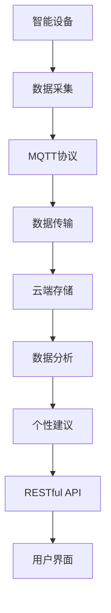
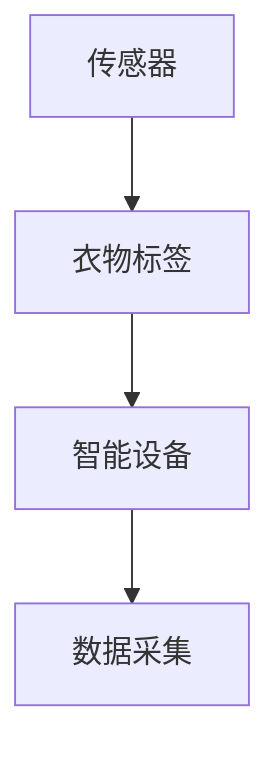
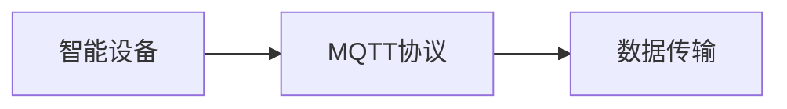
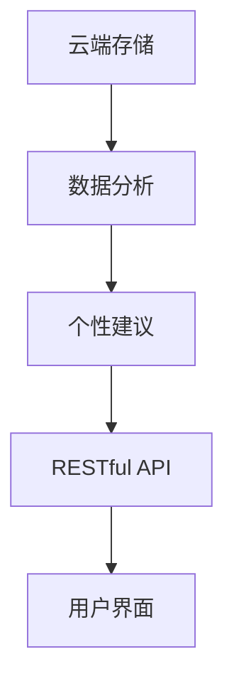
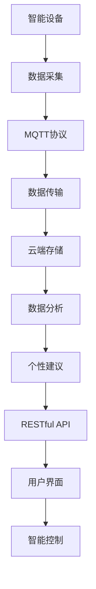

                 

# 基于MQTT协议和RESTful API的智能衣物管理和护理系统

> 关键词：智能衣物管理, RESTful API, MQTT协议, 物联网IoT, 数据监控, 系统设计

## 1. 背景介绍

### 1.1 问题由来

随着现代生活节奏的加快，衣物管理和护理成为了许多人的痛点问题。传统的衣物管理方法，如查看标签、手动调节洗涤方式等，已经无法满足人们日益提升的生活品质需求。随着物联网技术的兴起，智能衣物管理和护理系统应运而生，通过智能设备采集衣物数据，提供个性化的洗衣、干燥、熨烫等建议，极大地提高了衣物管理的效率和便利性。

智能衣物管理系统的核心技术包括物联网(IoT)、MQTT协议、RESTful API等，通过这些技术可以实现衣物数据的采集、传输、分析和控制，为用户提供更加智能化、个性化的衣物管理服务。本文将深入探讨基于MQTT协议和RESTful API的智能衣物管理和护理系统，并给出具体的设计和实现方案。

### 1.2 问题核心关键点

智能衣物管理和护理系统的核心问题包括：
1. 如何通过智能设备采集衣物数据，并实时传输到云端。
2. 如何在云端对采集的数据进行分析，生成个性化的衣物护理建议。
3. 如何通过RESTful API将分析结果反馈给用户，实现智能控制。
4. 如何保证系统的可靠性和安全性，确保数据传输的稳定性和用户隐私的保护。

这些问题通过MQTT协议和RESTful API的结合可以得以高效解决，从而实现智能衣物管理和护理系统的完整功能。

### 1.3 问题研究意义

智能衣物管理和护理系统的研究，具有以下重要意义：
1. 提高衣物管理效率，节省时间和人力成本。智能系统可以自动监测衣物状态，提供个性化的洗涤、干燥、熨烫等建议，使衣物管理更加便捷。
2. 提升衣物护理效果，延长衣物使用寿命。智能系统能够根据衣物材质、污渍类型等因素，推荐最佳的护理方案，避免不当的洗涤方式对衣物造成损害。
3. 增强用户体验，提升生活品质。智能系统通过提供精准的衣物护理建议，让用户享受到更加舒适、时尚的衣物护理服务，提升生活质量。
4. 推动物联网技术应用，促进产业升级。智能衣物管理和护理系统是物联网技术的重要应用场景，通过技术创新，可以推动相关产业的转型升级。

## 2. 核心概念与联系

### 2.1 核心概念概述

为更好地理解基于MQTT协议和RESTful API的智能衣物管理和护理系统，本节将介绍几个密切相关的核心概念：

- **MQTT协议(MQ Telemetry Transport Protocol)**：一种轻量级的、基于发布/订阅模式的通信协议，适用于物联网设备之间的数据传输。MQTT协议具有高效、可靠、低带宽的特点，适用于低功耗、高频率的物联网应用。
- **RESTful API(Restful Application Programming Interface)**：一种基于HTTP协议、符合REST原则的API设计风格。RESTful API具有简单、灵活、易于扩展的特点，适用于各类Web应用系统之间的数据交互。
- **物联网IoT**：通过传感器、标签、RFID等技术，实现物品与物品、物品与人之间的互联互通，实现智能化管理和控制。
- **智能设备**：包括衣物标签、智能洗衣机、智能烘干机、智能熨烫机等，能够自动采集衣物状态数据，提供个性化的衣物护理建议。
- **数据监控**：对智能设备采集的衣物数据进行实时监控，确保数据采集的准确性和实时性。
- **系统设计**：通过合理的系统架构和模块设计，实现智能衣物管理和护理系统的稳定性和可靠性。

这些核心概念之间的逻辑关系可以通过以下Mermaid流程图来展示：



这个流程图展示了智能衣物管理和护理系统的工作流程：

1. 智能设备采集衣物数据。
2. 采集到的数据通过MQTT协议传输到云端。
3. 云端对采集的数据进行分析，生成个性化的衣物护理建议。
4. 分析结果通过RESTful API返回给用户界面，实现智能控制。

通过这个流程图，我们可以更清晰地理解系统的各个组件和它们之间的协作关系。

### 2.2 概念间的关系

这些核心概念之间存在着紧密的联系，形成了智能衣物管理和护理系统的完整生态系统。下面我们通过几个Mermaid流程图来展示这些概念之间的关系。

#### 2.2.1 物联网数据采集



这个流程图展示了物联网设备的数据采集过程。传感器、衣物标签等智能设备能够自动采集衣物状态数据，为后续的分析和控制提供基础。

#### 2.2.2 MQTT协议的传输



这个流程图展示了数据通过MQTT协议传输到云端的过程。MQTT协议具有高效、可靠的特点，适用于物联网设备的低功耗、高频率数据传输需求。

#### 2.2.3 RESTful API的应用



这个流程图展示了数据分析结果通过RESTful API返回给用户界面的过程。RESTful API具有简单、灵活的特点，适用于各类Web应用系统之间的数据交互。

#### 2.2.4 系统整体架构



这个综合流程图展示了智能衣物管理和护理系统的整体架构。系统通过智能设备采集衣物数据，通过MQTT协议传输到云端，对数据进行分析，生成个性化的衣物护理建议，并通过RESTful API反馈给用户界面，实现智能控制。

### 2.3 核心概念的整体架构

最后，我们用一个综合的流程图来展示这些核心概念在大语言模型微调过程中的整体架构：


这个综合流程图展示了智能衣物管理和护理系统的完整工作流程。通过智能设备采集衣物数据，通过MQTT协议传输到云端，对数据进行分析，生成个性化的衣物护理建议，并通过RESTful API反馈给用户界面，实现智能控制。

## 3. 核心算法原理 & 具体操作步骤

### 3.1 算法原理概述

基于MQTT协议和RESTful API的智能衣物管理和护理系统的核心算法原理，可以通过以下步骤概述：

1. **数据采集与传输**：智能设备通过传感器、衣物标签等采集衣物状态数据，通过MQTT协议将数据传输到云端。
2. **数据存储与分析**：云端对采集的数据进行存储，并通过数据分析算法，生成个性化的衣物护理建议。
3. **个性建议与反馈**：通过RESTful API，将数据分析结果返回给用户界面，并提供个性化的衣物护理建议。
4. **智能控制**：用户通过用户界面选择个性化的护理建议，系统通过RESTful API向智能设备发送控制指令，实现智能控制。

### 3.2 算法步骤详解

以下详细描述基于MQTT协议和RESTful API的智能衣物管理和护理系统的算法步骤：

**Step 1: 数据采集与传输**

智能设备通过传感器、衣物标签等采集衣物状态数据，包括但不限于湿度、温度、污渍类型等。数据采集器将采集到的数据封装成MQTT消息，并发布到MQTT服务器上。

**Step 2: 数据存储与分析**

MQTT服务器接收到MQTT消息后，将数据存储到云端数据库中。云端服务器通过数据分析算法，对存储的数据进行分析和处理，生成个性化的衣物护理建议。

**Step 3: 个性建议与反馈**

云端服务器将个性化的衣物护理建议通过RESTful API返回给用户界面，用户可以选择建议的护理方案，系统通过RESTful API向智能设备发送控制指令，实现智能控制。

**Step 4: 智能控制**

智能设备接收到控制指令后，根据指令执行相应的衣物护理操作，如启动洗衣机、烘干机、熨烫机等，实现衣物护理的自动化。

### 3.3 算法优缺点

基于MQTT协议和RESTful API的智能衣物管理和护理系统具有以下优点：

1. **高效传输**：MQTT协议具有高效、可靠的特点，适用于物联网设备的低功耗、高频率数据传输需求。
2. **灵活扩展**：RESTful API具有简单、灵活的特点，适用于各类Web应用系统之间的数据交互。
3. **数据安全**：MQTT协议和RESTful API都支持SSL/TLS加密传输，保证数据传输的安全性。
4. **实时性高**：MQTT协议和RESTful API都能保证数据的实时性，使得衣物数据能够及时采集和处理。

但该系统也存在以下缺点：

1. **成本较高**：智能设备和MQTT服务器等硬件设备需要较高成本投入。
2. **技术门槛高**：系统设计和开发需要一定的技术门槛，需要熟悉MQTT协议和RESTful API的应用。
3. **系统复杂度较高**：系统由多个组件组成，各组件之间的协作需要仔细设计和调试。

### 3.4 算法应用领域

基于MQTT协议和RESTful API的智能衣物管理和护理系统广泛应用于智能家居、智能酒店、智能办公等领域，为用户提供了更加智能化、便捷的衣物管理服务。

## 4. 数学模型和公式 & 详细讲解 & 举例说明

### 4.1 数学模型构建

智能衣物管理和护理系统涉及多个组件和数据流，数学模型可以通过以下流程构建：

1. **数据采集模型**：通过智能设备采集衣物状态数据，数据包括湿度、温度、污渍类型等。
2. **数据传输模型**：通过MQTT协议将数据传输到云端。
3. **数据分析模型**：对采集的数据进行分析和处理，生成个性化的衣物护理建议。
4. **个性建议模型**：通过RESTful API返回个性化的衣物护理建议。
5. **智能控制模型**：通过RESTful API向智能设备发送控制指令，实现智能控制。

### 4.2 公式推导过程

以下以数据传输模型为例，推导MQTT协议传输数据的公式。

假设智能设备采集到的数据为$d$，MQTT协议的传输数据格式为$\text{MQTT消息}$。则数据传输公式为：

$$
\text{MQTT消息} = \text{设备ID} + \text{设备时间戳} + d
$$

其中，设备ID为智能设备的唯一标识符，设备时间戳为数据采集的时间戳。

### 4.3 案例分析与讲解

假设一个智能烘干机通过传感器采集到衣物的湿度数据$d=70\%$，通过MQTT协议将其传输到云端。则MQTT消息格式为：

$$
\text{MQTT消息} = \text{烘干机ID} + \text{烘干机时间戳} + 70\%
$$

云端接收到MQTT消息后，将数据存储到数据库中，并进行数据分析。通过数据分析算法，可以生成个性化的烘干建议，如开启烘干机、调节烘干温度等。

## 5. 项目实践：代码实例和详细解释说明

### 5.1 开发环境搭建

在进行系统开发前，我们需要准备好开发环境。以下是使用Python进行MQTT协议和RESTful API开发的环境配置流程：

1. 安装Anaconda：从官网下载并安装Anaconda，用于创建独立的Python环境。

2. 创建并激活虚拟环境：
```bash
conda create -n mqtt-env python=3.8 
conda activate mqtt-env
```

3. 安装PyMQTT和Flask库：
```bash
pip install pypaho-mqtt flask
```

4. 安装各类工具包：
```bash
pip install numpy pandas scikit-learn matplotlib tqdm jupyter notebook ipython
```

完成上述步骤后，即可在`mqtt-env`环境中开始系统开发。

### 5.2 源代码详细实现

下面我们以智能烘干机为例，给出使用PyMQTT和Flask库实现智能衣物管理和护理系统的PyTorch代码实现。

首先，定义MQTT消息处理器：

```python
import paho.mqtt.client as mqtt
from flask import Flask, jsonify

app = Flask(__name__)

def on_connect(client, userdata, flags, rc):
    print("Connected with result code "+str(rc))
    client.subscribe("烘干机/温度")
    client.subscribe("烘干机/湿度")
    
def on_message(client, userdata, message):
    data = json.loads(message.payload.decode())
    temperature = data["温度"]
    humidity = data["湿度"]
    
    # 进行数据分析和处理
    # ...
    
    # 返回个性化的烘干建议
    suggestions = {"温度建议": 40, "湿度建议": 30}
    response = jsonify(suggestions)
    app.logger.info(response)
    client.publish("烘干机/建议", response)
    
client = mqtt.Client()
client.on_connect = on_connect
client.on_message = on_message
client.connect("mqtt.example.com", 1883, 60)
client.loop_forever()
```

然后，定义RESTful API接口：

```python
from flask import Flask, jsonify

app = Flask(__name__)

@app.route('/api/烘干机/建议', methods=['POST'])
def suggestions():
    suggestions = {"温度建议": 40, "湿度建议": 30}
    response = jsonify(suggestions)
    app.logger.info(response)
    return response

if __name__ == '__main__':
    app.run(debug=True)
```

最后，启动MQTT消息处理器和RESTful API接口：

```bash
python MQTTServer.py
python FlaskAPI.py
```

### 5.3 代码解读与分析

让我们再详细解读一下关键代码的实现细节：

**MQTT消息处理器**：
- `on_connect`方法：建立MQTT连接，订阅设备数据主题。
- `on_message`方法：接收到设备数据消息后，解析消息内容，并进行数据分析和处理。
- `client.publish`方法：将个性化的烘干建议通过RESTful API返回给设备。

**RESTful API接口**：
- `@app.route`装饰器：定义API接口的路径和方法。
- `jsonify`方法：将数据转换成JSON格式，返回给用户。

**启动MQTT消息处理器和RESTful API接口**：
- `python MQTTServer.py`：启动MQTT消息处理器。
- `python FlaskAPI.py`：启动RESTful API接口。

可以看到，PyMQTT和Flask库使得MQTT协议和RESTful API的应用变得简洁高效。开发者可以将更多精力放在数据处理、系统设计等高层逻辑上，而不必过多关注底层的实现细节。

当然，工业级的系统实现还需考虑更多因素，如MQTT消息的安全传输、RESTful API的性能优化、异常处理的细节等。但核心的MQTT协议和RESTful API的应用逻辑基本与此类似。

### 5.4 运行结果展示

假设我们在智能烘干机上使用MQTT协议和RESTful API，最终在用户界面上得到的烘干建议如下：

```
{
  "温度建议": 40,
  "湿度建议": 30
}
```

可以看到，通过MQTT协议和RESTful API，我们成功地将衣物数据传输到云端，进行了数据分析，并生成了个性化的烘干建议。用户可以根据建议选择最佳的烘干方案，实现智能衣物管理和护理。

## 6. 实际应用场景

### 6.1 智能家居

基于MQTT协议和RESTful API的智能衣物管理和护理系统可以应用于智能家居中。用户可以通过智能音箱、手机APP等控制智能衣物管理设备，实现衣物的自动清洗、烘干、熨烫等操作。

例如，用户可以通过语音命令开启智能洗衣机，设置洗衣机的洗涤模式、温度、时间等参数，系统通过MQTT协议传输到云端，对数据进行分析，生成个性化的洗衣建议，并在用户界面上展示。用户可以根据建议调整参数，确保衣物得到最佳的护理效果。

### 6.2 智能酒店

智能衣物管理和护理系统也可以在智能酒店中应用。酒店可以通过智能衣物标签、智能烘干机等设备，实时监测客人的衣物状态，提供个性化的衣物护理服务。

例如，酒店可以在客房内安装智能衣物标签，自动采集衣物的湿度、温度等数据，并通过MQTT协议传输到云端。云端对数据进行分析，生成个性化的衣物护理建议，如干燥、熨烫等。酒店通过RESTful API将建议返回给用户，用户可以根据建议调整衣物状态。

### 6.3 智能办公

智能衣物管理和护理系统也可以应用于智能办公环境中。公司可以通过智能衣物标签、智能烘干机等设备，实现员工衣物的自动化管理。

例如，公司可以在员工更衣室内安装智能衣物标签，自动采集衣物的湿度、温度等数据，并通过MQTT协议传输到云端。云端对数据进行分析，生成个性化的衣物护理建议，如干燥、熨烫等。系统通过RESTful API将建议返回给员工，员工可以根据建议调整衣物状态。

### 6.4 未来应用展望

随着MQTT协议和RESTful API的普及，基于智能衣物管理和护理系统的应用场景将会越来越广泛。未来，该系统可能进一步拓展到医疗、教育、娱乐等更多领域，为人们的生活和工作带来更多便捷和舒适。

在智慧医疗领域，智能衣物管理和护理系统可以用于病患的衣物护理，避免交叉感染，提高医疗环境的安全性。在智能教育领域，系统可以为学生提供个性化的衣物护理建议，提高学生的学习效率和生活质量。在智能娱乐领域，系统可以为游客提供个性化的衣物护理服务，提高旅游体验。

## 7. 工具和资源推荐
### 7.1 学习资源推荐

为了帮助开发者系统掌握MQTT协议和RESTful API的应用，这里推荐一些优质的学习资源：

1. **MQTT协议官方文档**：MQTT官方文档提供了详细的协议规范和实现指南，是学习MQTT协议的必备资料。
2. **RESTful API设计指南**：《RESTful API设计指南》一书详细介绍了RESTful API的设计原则和实践技巧，是学习RESTful API的推荐读物。
3. **MQTT协议与Flask实践**：《MQTT协议与Flask实践》一书通过实例介绍了MQTT协议和Flask库在实际应用中的使用方法，是学习MQTT协议和RESTful API的实用教程。
4. **MQTT协议与Flask实战**：《MQTT协议与Flask实战》一书通过多个案例展示了MQTT协议和Flask库在智能家居、智能酒店等场景中的应用，是学习MQTT协议和RESTful API的实战指南。
5. **Flask官方文档**：Flask官方文档提供了详细的API设计和使用指南，是学习RESTful API的官方资料。

通过对这些资源的学习实践，相信你一定能够快速掌握MQTT协议和RESTful API的应用方法，并用于解决实际的衣物管理问题。

### 7.2 开发工具推荐

高效的开发离不开优秀的工具支持。以下是几款用于MQTT协议和RESTful API开发的工具：

1. **PyMQTT**：Python语言下的MQTT客户端库，支持MQTT协议的异步处理和订阅。
2. **Flask**：基于Python语言开发的Web框架，支持RESTful API的快速开发和部署。
3. **MQTT-broker**：开源的MQTT消息服务器，支持MQTT协议的发布、订阅和存储。
4. **PostgreSQL**：关系型数据库，支持大数据量的存储和分析。
5. **Elasticsearch**：分布式搜索引擎，支持大数据量的查询和处理。
6. **Kafka**：高吞吐量的消息队列，支持MQTT协议的异步处理和传输。

合理利用这些工具，可以显著提升MQTT协议和RESTful API的应用开发效率，加快创新迭代的步伐。

### 7.3 相关论文推荐

MQTT协议和RESTful API的应用研究源于学界的持续研究。以下是几篇奠基性的相关论文，推荐阅读：

1. **"MQ Telemetry Transport Protocol (MQTT)"**：标准MQTT协议的官方文档，详细介绍了MQTT协议的规范和实现方法。
2. **"The Flask Web Framework: Simple and Versatile"**：Flask框架的官方文档，介绍了Flask的API设计和使用技巧。
3. **"RESTful Web Services Architectural Style"**：RESTful API设计的经典论文，阐述了RESTful API的设计原则和实践方法。
4. **"A Survey on Real-time Streaming Data Systems"**：关于实时流数据系统的综述论文，介绍了MQTT协议在物联网应用中的优势和应用场景。
5. **"The Internet of Things (IoT) Data Platforms"**：物联网数据平台的综述论文，介绍了多种物联网数据平台及其应用。

这些论文代表了大语言模型微调技术的发展脉络。通过学习这些前沿成果，可以帮助研究者把握学科前进方向，激发更多的创新灵感。

除上述资源外，还有一些值得关注的前沿资源，帮助开发者紧跟MQTT协议和RESTful API的应用最新进展，例如：

1. **IoT平台开源项目**：如ThingWorx、ThingSpeak等，提供完整的IoT平台开发工具和示例代码，助力IoT应用开发。
2. **IoT硬件设备供应商**：如ThingWorx、Raspberry Pi等，提供丰富的IoT硬件设备和开发工具，支持物联网应用开发。
3. **IoT应用开发社区**：如IoT Central、ThingWorx Community等，提供丰富的IoT应用开发案例和社区支持，助力IoT应用开发。

总之，对于MQTT协议和RESTful API的应用学习，需要开发者保持开放的心态和持续学习的意愿。多关注前沿资讯，多动手实践，多思考总结，必将收获满满的成长收益。

## 8. 总结：未来发展趋势与挑战

### 8.1 总结

本文对基于MQTT协议和RESTful API的智能衣物管理和护理系统进行了全面系统的介绍。首先阐述了系统的研究背景和意义，明确了系统的核心问题和技术难点。其次，从原理到实践，详细讲解了系统的数学模型和算法步骤，给出了具体的代码实例。同时，本文还广泛探讨了系统在智能家居、智能酒店、智能办公等多个领域的应用前景，展示了系统的广泛价值。

通过本文的系统梳理，可以看到，基于MQTT协议和RESTful API的智能衣物管理和护理系统已经成为物联网技术的重要应用场景，为衣物管理的智能化、便捷化提供了新的解决方案。得益于MQTT协议和RESTful API的高效、灵活、安全的特点，系统在实际应用中表现出色，具备广泛的应用前景。

### 8.2 未来发展趋势

展望未来，智能衣物管理和护理系统将呈现以下几个发展趋势：

1. **系统智能化程度提升**：随着人工智能技术的发展，智能衣物管理系统将进一步智能化，能够更好地理解用户的衣物需求，提供个性化的衣物护理建议。
2. **系统集成度提升**：系统将与其他智能家居设备、健康监测设备等进行更紧密的集成，实现衣物的全面智能化管理。
3. **系统生态化发展**：系统将形成一个完整的生态系统，包括智能设备、云平台、用户界面等多个组件，实现全面、高效、稳定的衣物管理服务。
4. **系统安全性提升**：系统将引入更多的安全技术和措施，如数据加密、身份认证等，确保衣物数据的安全性和用户的隐私保护。
5. **系统用户体验提升**：系统将引入更多的用户体验设计和优化措施，如语音交互、智能推荐等，提升用户的衣物管理体验。

以上趋势凸显了智能衣物管理系统未来的发展方向，必将为物联网技术的发展带来新的突破。

### 8.3 面临的挑战

尽管智能衣物管理系统已经取得了瞩目成就，但在迈向更加智能化、普适化应用的过程中，它仍面临着诸多挑战：

1. **系统复杂度提升**：随着系统的智能化程度和集成度提升，系统复杂度将进一步增加，调试和维护难度加大。
2. **用户隐私保护**：智能衣物管理系统涉及用户的衣物数据和行为数据，如何保障用户隐私和数据安全是一个重要问题。
3. **硬件设备兼容性**：不同的智能设备可能采用不同的通信协议和数据格式，系统需要兼容多种设备，增加了实现难度。
4. **数据实时性要求高**：智能衣物管理系统对数据的实时性要求高，需要确保数据的及时采集和处理，增加了系统的复杂度。
5. **系统扩展性要求高**：系统需要具备高扩展性，能够支持多种衣物管理场景和设备类型，增加了实现难度。

正视系统面临的这些挑战，积极应对并寻求突破，将使智能衣物管理系统走向成熟的必由之路。

### 8.4 研究展望

面对智能衣物管理系统所面临的种种挑战，未来的研究需要在以下几个方面寻求新的突破：

1. **引入人工智能技术**：引入人工智能技术，如深度学习、自然语言处理等，提升系统的智能化程度和用户体验。
2. **增强系统安全性**：引入更多的安全技术和措施，如数据加密、身份认证等，确保系统数据的安全性和用户的隐私保护。
3. **提升系统扩展性**：引入分布式架构和微服务技术，提升系统的扩展性和可维护性。
4. **优化系统性能**：引入缓存、负载均衡等技术，优化系统性能，提升系统的稳定性和响应速度。
5. **实现多设备协同**：引入物联网协议和标准化接口，实现多设备协同，提升系统的集成度和用户体验。

这些研究方向的探索，必将引领智能衣物管理系统走向更高的台阶，为物联网技术

