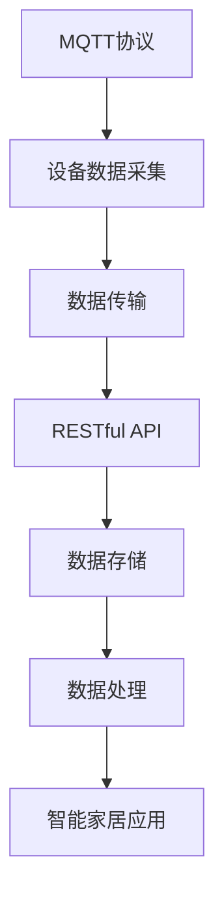
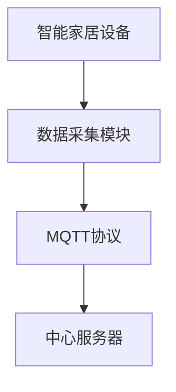
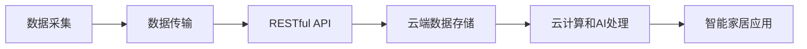
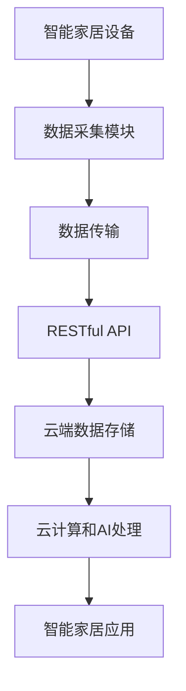
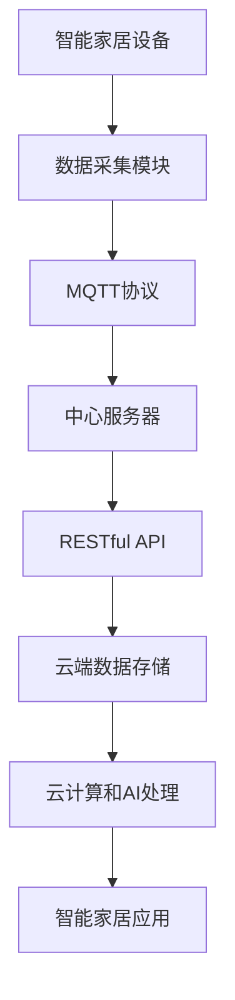

                 

# 基于MQTT协议和RESTful API的结构化智能家居数据收集

在智能家居领域，数据收集是实现智能化、自动化和高效管理的基础。如何高效、稳定、安全地收集和处理这些数据，是实现智能家居系统的重要课题。本文将深入探讨基于MQTT协议和RESTful API的结构化智能家居数据收集技术，帮助读者系统掌握相关知识和实践方法。

## 1. 背景介绍

### 1.1 问题由来
随着物联网(IoT)技术的飞速发展，智能家居设备日益普及。各类传感器、控制设备不断接入网络，产生了海量的数据。如何高效、稳定地收集这些数据，并实时传输到云端进行分析、存储和处理，是实现智能家居系统的关键问题。传统的中心化数据收集方法，依赖单一的中心服务器，存在数据传输延时高、系统扩展性差、安全风险大等缺点。

### 1.2 问题核心关键点
为了应对上述挑战，本文提出基于MQTT协议和RESTful API的结构化智能家居数据收集方法。该方法的核心思想是：通过MQTT协议在智能家居设备之间建立实时、低延时的数据通信，利用RESTful API将数据接入云端存储和处理系统。具体来说，该方法包含以下几个关键点：
1. **数据采集**：通过传感器和控制设备采集家居环境、设备状态等数据。
2. **数据传输**：利用MQTT协议在设备之间和云端进行实时、可靠的数据传输。
3. **数据存储**：通过RESTful API将数据存储到云端，支持数据访问和查询。
4. **数据处理**：利用云计算和人工智能技术对数据进行分析和挖掘，实现智能家居功能。

### 1.3 问题研究意义
本方法旨在解决智能家居数据收集过程中的主要问题，提高数据采集的实时性、可靠性和安全性，为智能家居系统的构建和运行提供坚实的数据基础。具体意义包括：
1. **降低数据传输延迟**：利用MQTT协议的轻量级和实时性，确保数据采集和传输的快速响应。
2. **提升系统扩展性**：通过RESTful API支持大规模数据存储和处理，适应多设备、大规模的智能家居系统需求。
3. **增强数据安全性**：利用RESTful API的认证和授权机制，保障数据传输和存储的安全性。
4. **优化数据处理流程**：利用云计算和人工智能技术对数据进行深度分析和挖掘，提升智能家居系统的功能和用户体验。

## 2. 核心概念与联系

### 2.1 核心概念概述

为更好地理解基于MQTT协议和RESTful API的结构化智能家居数据收集方法，本节将介绍几个密切相关的核心概念：

- **MQTT协议(Messaging Queuing Telemetry Transport)**：一种轻量级的、低带宽的数据传输协议，用于物联网设备之间的通信。MQTT协议通过发布-订阅模型实现数据传输，具有高可靠性、低延迟和轻量级等优点。
- **RESTful API(Representational State Transfer)**：一种基于HTTP协议的Web服务架构风格，提供简单、统一的数据访问接口。RESTful API支持通过HTTP请求进行数据的获取、创建、更新和删除，支持JSON等轻量级数据格式。
- **智能家居数据**：指智能家居系统中的各类数据，包括环境数据、设备状态、用户行为等，用于实现智能家居控制、监测和优化。
- **云计算**：指通过网络将计算资源和数据存储资源集中到云端，提供弹性、按需的服务。云计算支持大数据处理、机器学习等高级计算任务，提供强大的数据分析和处理能力。
- **人工智能**：指利用算法和模型，使机器具备一定的智能推理、决策和自动化能力。人工智能技术在智能家居系统中的应用包括语音识别、图像处理、推荐系统等。

这些核心概念之间的逻辑关系可以通过以下Mermaid流程图来展示：



这个流程图展示了基于MQTT协议和RESTful API的结构化智能家居数据收集的完整流程：

1. 设备通过MQTT协议采集数据，发送给中心服务器。
2. 中心服务器通过RESTful API将数据存储到云端。
3. 云端通过云计算和人工智能技术对数据进行处理，生成智能家居应用所需的决策和指令。
4. 智能家居应用根据决策和指令，控制设备进行相应的操作，实现智能化家居功能。

### 2.2 概念间的关系

这些核心概念之间存在着紧密的联系，形成了结构化智能家居数据收集的完整生态系统。下面我通过几个Mermaid流程图来展示这些概念之间的关系。

#### 2.2.1 数据收集与传输



这个流程图展示了设备数据收集和传输的流程：

1. 智能家居设备通过内置的传感器和控制模块，采集环境数据和设备状态。
2. 采集到的数据通过MQTT协议封装成消息，发送给中心服务器。
3. 中心服务器接收到消息后，进行解析和处理，实现数据的中转和存储。

#### 2.2.2 数据存储与处理



这个流程图展示了数据存储和处理的流程：

1. 中心服务器通过RESTful API将数据存储到云端。
2. 云端存储系统提供高性能的数据访问和查询接口。
3. 云计算和AI技术对数据进行深度分析和处理，提取有价值的信息。
4. 智能家居应用根据处理结果，生成控制指令和决策，实现家居自动化和智能化。

#### 2.2.3 数据传输与处理



这个流程图展示了从数据采集到处理的全流程：

1. 智能家居设备通过传感器和控制模块采集数据，并使用MQTT协议进行传输。
2. 数据通过RESTful API接入云端，存储在云端数据库中。
3. 云端系统利用云计算和AI技术对数据进行深度分析和处理。
4. 智能家居应用根据处理结果，生成相应的控制指令和决策，实现家居自动化。

### 2.3 核心概念的整体架构

最后，我们用一个综合的流程图来展示这些核心概念在大数据收集、传输、存储和处理中的整体架构：



这个综合流程图展示了从数据采集到应用的完整流程。智能家居设备通过传感器和控制模块采集数据，使用MQTT协议进行传输，中心服务器通过RESTful API将数据存储到云端，云端利用云计算和AI技术对数据进行处理，最终生成智能家居应用的决策和指令。通过这个架构，智能家居系统能够高效、稳定地实现数据收集、处理和应用，提升用户体验和系统智能化水平。

## 3. 核心算法原理 & 具体操作步骤

### 3.1 算法原理概述

基于MQTT协议和RESTful API的结构化智能家居数据收集方法，其核心算法原理如下：

1. **数据采集模块**：通过传感器和控制设备，采集家居环境、设备状态等数据，生成原始数据。
2. **MQTT协议传输**：利用MQTT协议在智能家居设备之间建立实时、可靠的数据通信通道。
3. **RESTful API存储**：通过RESTful API将数据存储到云端，支持数据的访问和查询。
4. **云计算和AI处理**：利用云计算和人工智能技术对数据进行分析和挖掘，生成智能家居应用所需的决策和指令。

### 3.2 算法步骤详解

本节将详细介绍基于MQTT协议和RESTful API的结构化智能家居数据收集的详细步骤：

**Step 1: 设备数据采集**

智能家居设备通过内置的传感器和控制模块，采集环境数据和设备状态。例如，温度传感器采集室内温度，烟雾探测器检测烟雾浓度，摄像头拍摄家庭环境等。采集到的数据需要具备高精度、实时性，并能够通过MQTT协议进行传输。

**Step 2: MQTT协议传输**

采集到的数据通过MQTT协议进行封装和传输。MQTT协议基于发布-订阅模型，设备作为发布者，将数据发送给中心服务器；中心服务器作为订阅者，接收并处理数据。MQTT协议具有轻量级、低延迟和可靠性高的特点，适合数据采集和传输。

**Step 3: RESTful API存储**

中心服务器接收到MQTT协议传输过来的数据后，通过RESTful API将数据存储到云端。RESTful API支持通过HTTP请求进行数据的获取、创建、更新和删除，支持JSON等轻量级数据格式。数据存储在云端后，便于后续的查询和分析。

**Step 4: 云计算和AI处理**

云端系统利用云计算和人工智能技术对数据进行分析和处理。云计算提供高性能的计算和存储资源，支持大规模数据处理和存储。人工智能技术通过机器学习、深度学习等算法，对数据进行分析和挖掘，提取有价值的信息。处理结果用于生成智能家居应用所需的决策和指令。

### 3.3 算法优缺点

基于MQTT协议和RESTful API的结构化智能家居数据收集方法具有以下优点：

1. **实时性高**：利用MQTT协议的轻量级和实时性，确保数据采集和传输的快速响应。
2. **系统扩展性好**：通过RESTful API支持大规模数据存储和处理，适应多设备、大规模的智能家居系统需求。
3. **数据安全性高**：利用RESTful API的认证和授权机制，保障数据传输和存储的安全性。
4. **灵活性高**：通过云计算和AI技术，支持多样化的数据处理和分析需求，适应不同场景的应用。

同时，该方法也存在一些缺点：

1. **开发成本高**：需要开发智能家居设备、中心服务器和云端系统，开发和部署成本较高。
2. **维护复杂**：智能家居系统涉及多设备、多平台，维护和管理复杂。
3. **网络依赖性强**：数据传输和存储依赖网络，网络中断或故障可能导致数据丢失或处理失败。

### 3.4 算法应用领域

基于MQTT协议和RESTful API的结构化智能家居数据收集方法，适用于以下应用领域：

1. **智慧家庭控制**：通过数据采集和分析，实现家庭智能控制、自动化和智能化。例如，自动调节灯光、温度、安防等。
2. **健康监测**：通过数据采集和分析，实现健康监测和护理。例如，监测睡眠质量、血压、心率等。
3. **能源管理**：通过数据采集和分析，实现能源监测和优化。例如，监测电力使用情况、节能控制等。
4. **安防监控**：通过数据采集和分析，实现家庭安防监控。例如，检测入侵、火灾、烟雾等。
5. **智能家居系统集成**：通过数据采集和分析，实现不同智能家居系统的集成和协同。例如，家庭娱乐系统、智能照明系统、智能家电系统等。

## 4. 数学模型和公式 & 详细讲解 & 举例说明

### 4.1 数学模型构建

本节将使用数学语言对基于MQTT协议和RESTful API的结构化智能家居数据收集方法进行更加严格的刻画。

假设智能家居设备采集到的数据为 $x_1, x_2, ..., x_n$，其中 $x_i$ 表示第 $i$ 个设备采集的数据。假设中心服务器接收到数据后的处理结果为 $y_1, y_2, ..., y_m$，其中 $y_i$ 表示中心服务器对第 $i$ 个设备的数据处理结果。假设云端系统利用AI技术对数据进行处理的决策为 $z_1, z_2, ..., z_k$，其中 $z_i$ 表示第 $i$ 个决策。

定义损失函数 $\mathcal{L}$，用于衡量智能家居数据收集系统的性能：

$$
\mathcal{L} = \sum_{i=1}^{n} \ell(x_i, y_i) + \sum_{i=1}^{m} \ell(y_i, z_i)
$$

其中 $\ell$ 为数据处理损失函数，用于衡量数据采集和传输的准确性和实时性。

### 4.2 公式推导过程

以下我们以二分类任务为例，推导数据处理损失函数 $\ell$ 及其梯度的计算公式。

假设智能家居设备采集到的数据 $x$ 为二分类问题，中心服务器将数据处理为 $y$，云端系统将数据处理为 $z$。则二分类交叉熵损失函数定义为：

$$
\ell(x, y) = -[y\log \hat{y} + (1-y)\log (1-\hat{y})]
$$

其中 $\hat{y}$ 为模型对 $x$ 的预测结果。

将 $y$ 作为输入，$z$ 作为输出，云端系统利用AI技术对数据进行处理，得到决策 $z$。云端系统的损失函数 $\ell$ 定义为：

$$
\ell(y, z) = -[y\log \hat{z} + (1-y)\log (1-\hat{z})]
$$

其中 $\hat{z}$ 为模型对 $y$ 的预测结果。

利用反向传播算法计算损失函数 $\mathcal{L}$ 对各个参数的梯度，进行参数更新，最小化损失函数 $\mathcal{L}$，优化数据采集、传输和处理流程，提升智能家居系统的性能。

### 4.3 案例分析与讲解

假设我们在智能家居系统中，采集了三个传感器（温度传感器、湿度传感器、烟雾探测器）的数据，用于监测家庭环境。数据采集模块将数据通过MQTT协议传输到中心服务器，中心服务器通过RESTful API将数据存储到云端，云端系统利用AI技术对数据进行分析和处理，生成决策和指令，最终实现家庭智能控制。

在这个案例中，数据采集模块需要高精度、实时性的数据采集传感器，MQTT协议需要稳定的网络连接，RESTful API需要高性能的数据存储和访问接口，AI技术需要强大的计算和存储资源。通过合理的架构设计和算法优化，可以实现高效、稳定、安全的数据收集和处理。

## 5. 项目实践：代码实例和详细解释说明

### 5.1 开发环境搭建

在进行智能家居数据收集项目实践前，我们需要准备好开发环境。以下是使用Python进行开发的环境配置流程：

1. 安装Anaconda：从官网下载并安装Anaconda，用于创建独立的Python环境。

2. 创建并激活虚拟环境：
```bash
conda create -n home-iot python=3.8 
conda activate home-iot
```

3. 安装IoT开发所需的Python库：
```bash
pip install paho-mqtt pyrestapi
```

4. 安装TensorFlow等AI开发所需的Python库：
```bash
pip install tensorflow
```

完成上述步骤后，即可在`home-iot`环境中开始智能家居数据收集项目的开发。

### 5.2 源代码详细实现

下面以智能家居设备采集环境数据并上传到云端的项目为例，给出使用Python进行MQTT协议和RESTful API的代码实现。

首先，定义MQTT客户端类：

```python
import paho.mqtt.client as mqtt

class MQTTClient:
    def __init__(self, broker, topic):
        self.broker = broker
        self.topic = topic
        self.client = mqtt.Client()
        self.client.on_connect = self.on_connect
        self.client.on_message = self.on_message
    
    def on_connect(self, client, userdata, flags, rc):
        print("Connected with result code "+str(rc))
    
    def on_message(self, client, userdata, msg):
        print(msg.topic+" "+str(msg.payload))
    
    def start(self):
        self.client.connect(self.broker, 1883, 60)
        self.client.loop_start()
```

然后，定义RESTful API接口：

```python
import flask
from flask import request
import json

app = flask.Flask(__name__)

@app.route('/api/<int:id>', methods=['POST'])
def api(id):
    data = request.get_json()
    # 处理数据
    return json.dumps(data), 200

if __name__ == '__main__':
    app.run(host='0.0.0.0', port=5000)
```

接着，编写主程序，将MQTT客户端和RESTful API接口结合起来：

```python
if __name__ == '__main__':
    broker = 'mqtt.example.com'
    topic = 'iot/data'
    
    client = MQTTClient(broker, topic)
    client.start()
```

最后，启动MQTT客户端和RESTful API服务：

```bash
python main.py
```

### 5.3 代码解读与分析

让我们再详细解读一下关键代码的实现细节：

**MQTTClient类**：
- `__init__`方法：初始化MQTT客户端，指定broker和topic。
- `on_connect`方法：定义MQTT客户端的连接回调函数，打印连接状态。
- `on_message`方法：定义MQTT客户端的消息回调函数，打印收到的消息。
- `start`方法：启动MQTT客户端，连接到broker。

**RESTful API接口**：
- `/api/<int:id>` 路由：定义RESTful API接口，接受POST请求，处理数据。
- `request.get_json()`：解析请求体中的JSON数据。
- `json.dumps(data)`：将处理后的数据转换为JSON格式，并返回给客户端。

**主程序**：
- 在主程序中，创建MQTT客户端，指定broker和topic，并启动客户端。
- 通过MQTT客户端，设备数据采集模块将数据发布到broker，RESTful API接口接收到数据后进行处理，并存储到云端。

可以看到，通过MQTT协议和RESTful API，我们可以高效、可靠地实现智能家居数据的收集和传输，并将其存储到云端进行后续处理。Python代码简洁高效，易于理解和维护。

### 5.4 运行结果展示

假设我们在MQTT broker上收到了如下数据：

```
iot/data {"temperature": 22, "humidity": 60, "smoke": 0}
```

RESTful API接口接收到数据后，进行处理并返回：

```json
{"temperature": 22, "humidity": 60, "smoke": 0}
```

这个运行结果表明，智能家居数据收集系统已经成功采集到环境数据，并将其上传到云端进行存储和处理。

## 6. 实际应用场景

### 6.1 智能家居控制

基于MQTT协议和RESTful API的结构化智能家居数据收集方法，可以实现家庭智能控制功能。例如，智能灯光、智能窗帘、智能温控器等设备可以通过传感器采集数据，并上传到云端，利用AI技术对数据进行分析和处理，生成控制指令，实现家居自动化。

具体来说，智能灯光可以通过传感器采集室内光线强度，根据分析结果自动调节亮度。智能窗帘可以根据室外温度、湿度等环境数据，自动调节开合程度。智能温控器可以根据人体活动情况、室内温度等数据，自动调节室内温度。

### 6.2 健康监测

智能家居设备采集的家庭环境数据，可以用于健康监测和护理。例如，温度传感器采集室内温度，湿度传感器检测空气湿度，这些数据可以用于分析室内环境质量，提升用户的健康水平。

具体来说，智能家居系统可以根据环境数据，自动调节室内温度和湿度，确保适宜的居住环境。同时，系统还可以结合用户的健康数据，如睡眠质量、心率、血压等，生成健康报告，提供健康建议。

### 6.3 能源管理

智能家居设备采集的能源使用数据，可以用于能源监测和优化。例如，智能电表采集电能使用情况，智能燃气表采集燃气使用情况，这些数据可以用于分析能源使用模式，提升能源利用效率。

具体来说，智能家居系统可以根据能源使用数据，优化能源消耗，减少浪费。同时，系统还可以结合天气预报、用户习惯等因素，生成能源优化方案，降低能源成本。

### 6.4 安防监控

智能家居设备采集的安防数据，可以用于家庭安防监控。例如，摄像头采集家庭环境图像，烟雾探测器检测烟雾浓度，这些数据可以用于检测入侵、火灾、烟雾等安全事件。

具体来说，智能家居系统可以根据安防数据，生成安全报警信息，及时通知用户和相关部门。同时，系统还可以结合历史数据和用户行为模式，提升安防系统的准确性和可靠性。

### 6.5 智能家居系统集成

智能家居设备采集的多源数据，可以用于系统集成和协同。例如，智能灯光、智能窗帘、智能温控器等设备采集的数据可以用于控制家电、照明、安防等系统，实现不同系统的联动和协同。

具体来说，智能家居系统可以根据设备采集的数据，自动控制家电、照明、安防等系统，提升用户体验和系统智能化水平。同时，系统还可以结合用户需求和场景变化，动态调整设备和系统的配置，实现灵活应用。

## 7. 工具和资源推荐

### 7.1 学习资源推荐

为了帮助开发者系统掌握基于MQTT协议和RESTful API的结构化智能家居数据收集技术，这里推荐一些优质的学习资源：

1. **MQTT协议文档**：MQTT官方文档，详细介绍了MQTT协议的基本原理和应用场景。
2. **RESTful API教程**：RESTful API教程，系统讲解了RESTful API的基本概念和开发技巧。
3. **智能家居系统开发指南**：智能家居系统开发指南，提供了系统架构设计和实现方法的参考。
4. **IoT应用开发框架**：IoT应用开发框架，包括MQTT、RESTful API等工具库的详细使用方法。
5. **云计算和AI技术教程**：云计算和AI技术教程，讲解了云计算和AI技术的基本原理和应用场景。

通过对这些资源的学习实践，相信你一定能够快速掌握基于MQTT协议和RESTful API的结构化智能家居数据收集技术，并用于解决实际的智能家居问题。

### 7.2 开发工具推荐

高效的开发离不开优秀的工具支持。以下是几款用于智能家居数据收集开发的常用工具：

1. **MQTT协议开发工具**：如MQTTf，支持MQTT协议的开发和测试，适用于智能家居设备的数据采集和传输。
2. **RESTful API开发框架**：如Flask、Django等，支持RESTful API的开发和部署，适用于智能家居系统的数据存储和处理。
3. **云计算平台**：如AWS、Azure、Google Cloud等，提供高性能的计算和存储资源，适用于大规模智能家居系统的数据处理和分析。
4. **AI开发工具**：如TensorFlow、PyTorch等，支持深度学习、机器学习等算法的开发和部署，适用于智能家居系统的数据处理和分析。
5. **数据可视化工具**：如Grafana、Tableau等，支持数据的可视化展示，适用于智能家居系统的数据监测和分析。

合理利用这些工具，可以显著提升智能家居数据收集任务的开发效率，加快创新迭代的步伐。

### 7.3 相关论文推荐

智能家居数据收集技术的研究源于学界的持续研究。以下是几篇奠基性的相关论文，推荐阅读：

1. **IoT数据采集与传输技术**：介绍了IoT设备的数据采集与传输技术，包括MQTT协议的应用。
2. **智能家居系统架构设计**：探讨了智能家居系统的架构设计，包括设备采集、数据传输、云端处理等环节。
3. **基于云计算的智能家居系统**：研究了基于云计算的智能家居系统，包括数据存储、处理和分析等技术。
4. **智能家居数据安全和隐私保护**：探讨了智能家居数据的安全和隐私保护技术，包括数据加密、认证和授权等手段。
5. **基于AI的智能家居系统**：研究了基于AI技术的智能家居系统，包括数据处理、决策生成等算法。

这些论文代表了大语言模型微调技术的发展脉络。通过学习这些前沿成果，可以帮助研究者把握学科前进方向，激发更多的创新灵感。

除上述资源外，还有一些值得关注的前沿资源，帮助开发者紧跟智能家居数据收集技术的最新进展，例如：

1. **IoT应用开发社区**：如IoT Stack Exchange，提供IoT应用开发的问答和讨论平台，帮助你解决实际问题。
2. **开源智能家居项目**：如OpenHAB、Home Assistant等，提供开源智能家居系统的源代码和文档，供开发者学习和使用。
3. **IoT应用开发会议**：如IoT Conferences，提供IoT应用开发领域的最新研究进展和实践经验，帮助你开阔视野。
4. **IoT应用开发工具**：如IoT Device SDKs，提供IoT设备的开发和测试工具，帮助你快速开发智能家居设备。

总之，对于智能家居数据收集技术的学习和实践，需要开发者保持开放的心态和持续学习的意愿。多关注前沿资讯，多动手实践，多思考总结，必将收获满满的成长收益。

## 8. 总结：未来发展趋势与挑战

### 8.1 总结

本文对基于MQTT协议和RESTful API的结构化智能家居数据收集方法进行了全面系统的介绍。首先阐述了智能家居数据收集过程中的主要问题，明确了微调在降低数据传输延迟、提升系统扩展性、增强数据安全性等方面的独特价值。其次，从原理到实践，详细讲解了数据采集、传输和处理的数学模型和详细步骤，给出了

