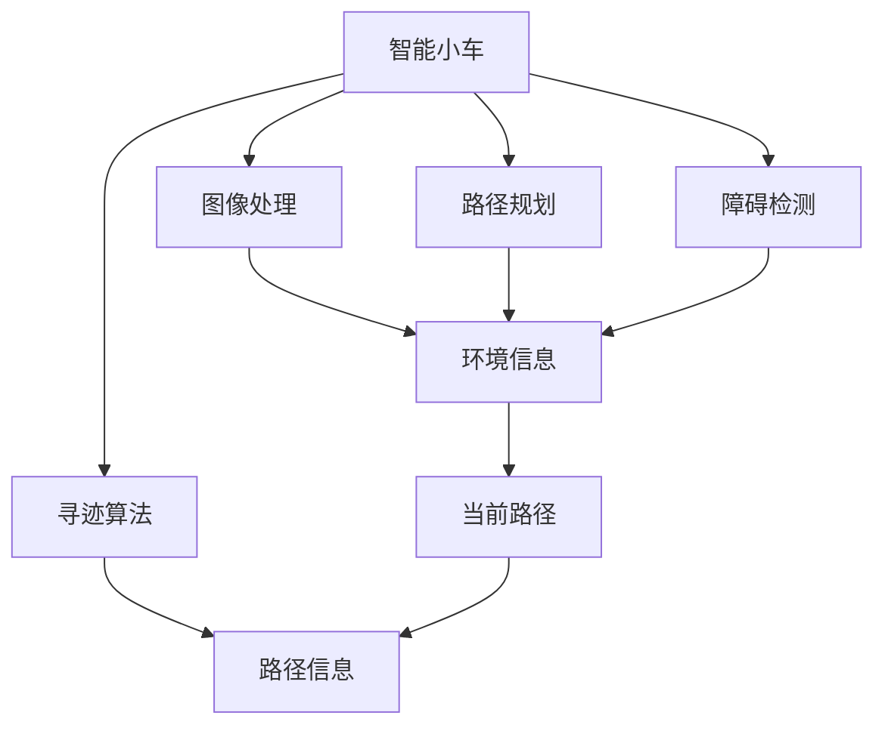
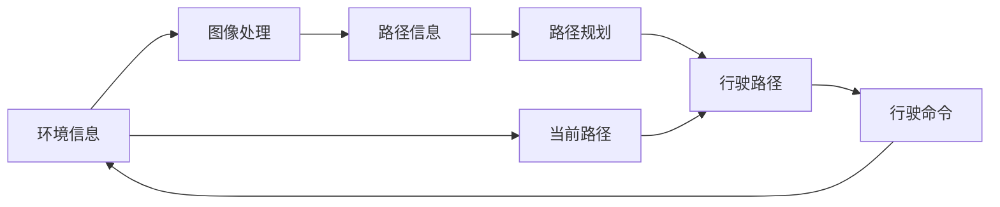

                 

# 基于OpenCV图像处理的智能小车户外寻迹算法的设计

> 关键词：智能小车、OpenCV、图像处理、寻迹算法、路径规划、障碍检测、实时性

## 1. 背景介绍

随着自动化技术和计算机视觉技术的快速发展，智能小车（如扫地机器人、无人驾驶车等）在许多实际应用场景中扮演着越来越重要的角色。这些小车能够在无人干预的情况下自主导航、避障、完成任务，大大提升了工作效率和安全性。其中，智能小车的寻迹算法是实现自主导航的关键环节。本文将基于OpenCV库，设计一个适用于户外环境的智能小车寻迹算法。

### 1.1 问题由来

智能小车的寻迹算法通常使用计算机视觉技术，如相机、激光雷达等传感器，获取环境信息，并结合机器学习、路径规划等技术，实现对路径的自主追踪。但传统的寻迹算法在户外环境中，往往面临光照变化、阴影干扰、环境复杂等多重挑战，导致导航精度不高、鲁棒性不足的问题。

### 1.2 问题核心关键点

智能小车户外寻迹算法需要满足以下关键点：

- **实时性**：小车需要在实时环境中对路径进行精确追踪，及时调整行驶方向，避免碰撞和绕路。
- **鲁棒性**：算法需要具备较强的环境适应能力，对光照变化、阴影干扰、环境复杂等情况具备一定的鲁棒性。
- **精度**：小车应具备高精度的路径追踪能力，能够准确识别路径边界，确保行驶方向正确。
- **可扩展性**：算法应具备较强的扩展性，能够在不同类型的小车上进行应用和优化。

### 1.3 问题研究意义

智能小车户外寻迹算法的研究，对于提升小车在复杂环境下的自主导航能力、降低人工干预的频率、提高生产效率具有重要意义。此外，该技术还具备以下优势：

- 提升小车在恶劣环境下的适应能力，减少对人工操作的依赖。
- 减少人工干预成本，降低小车的运营成本。
- 提高小车导航的精度和可靠性，减少交通事故。
- 增强小车的智能化水平，为未来更复杂的自动化任务奠定基础。

## 2. 核心概念与联系

### 2.1 核心概念概述

为了设计一个适用于户外环境的智能小车寻迹算法，需要了解以下几个核心概念：

- **智能小车**：一种能够在无人干预下自主导航、避障、完成任务的移动机器人。
- **图像处理**：通过对图像进行各种处理，如滤波、分割、特征提取等，获取环境信息，实现路径识别。
- **寻迹算法**：根据传感器获取的环境信息，规划小车的行驶路径，实现路径追踪。
- **路径规划**：在复杂环境中，通过算法规划出最优路径，避开障碍物，实现高效导航。
- **障碍检测**：在行驶过程中，检测和识别出周围环境中的障碍物，并及时调整行驶方向，避免碰撞。

### 2.2 概念间的关系

这些核心概念之间有着紧密的联系，形成一个完整的智能小车户外寻迹算法系统。以下是其关系的合 法图。



这个流程图展示了智能小车寻迹算法系统的各个组件及其相互关系：

1. 智能小车通过图像处理获取环境信息。
2. 寻迹算法根据环境信息，规划出小车的行驶路径。
3. 路径规划在复杂环境中，规划出最优路径。
4. 障碍检测检测并识别出周围环境中的障碍物。
5. 环境信息、路径信息和当前路径，共同决定小车的行驶方向。

### 2.3 核心概念的整体架构

为更好地理解智能小车户外寻迹算法的设计流程，我们通过一个综合的流程图来展示。



这个综合流程图展示了智能小车寻迹算法的整体流程：

1. 环境信息通过图像处理获取。
2. 路径信息根据环境信息生成。
3. 路径规划在环境信息的基础上，生成最优路径。
4. 行驶路径根据路径信息和当前路径确定。
5. 行驶命令根据行驶路径，控制小车行驶。

## 3. 核心算法原理 & 具体操作步骤

### 3.1 算法原理概述

智能小车户外寻迹算法基于图像处理技术，结合路径规划、障碍检测等技术，实现小车的自主导航。其核心原理如下：

1. **图像获取与预处理**：通过摄像头等传感器获取小车周围环境图像，并进行预处理，如去噪、滤波等。
2. **路径识别与分割**：从预处理后的图像中，识别出路径边界，并分割出路径区域。
3. **路径规划与生成**：根据路径信息，规划出小车的行驶路径，生成路径指令。
4. **路径追踪与调整**：实时跟踪小车位置，根据路径信息和当前路径，调整行驶方向，确保小车沿路径行驶。
5. **障碍检测与避障**：检测周围环境中的障碍物，并根据检测结果，调整小车行驶方向，避免碰撞。

### 3.2 算法步骤详解

基于上述原理，智能小车户外寻迹算法的具体操作步骤如下：

**Step 1: 环境信息获取与预处理**

通过小车上的摄像头获取环境图像，使用OpenCV库对图像进行去噪、滤波等预处理操作。具体步骤如下：

1. **图像获取**：通过摄像头传感器获取实时环境图像。
2. **去噪与滤波**：使用OpenCV库中的滤波器，如高斯滤波、中值滤波等，去除图像噪声，提高图像质量。
3. **图像增强**：使用边缘增强、直方图均衡化等方法，增强图像对比度，提高环境信息的识别准确率。

**Step 2: 路径识别与分割**

从预处理后的图像中，识别出路径边界，并分割出路径区域。具体步骤如下：

1. **边缘检测**：使用OpenCV库中的Canny算法，检测出图像中的边缘信息。
2. **路径提取**：通过霍夫变换（Hough Transform）算法，识别出图像中的路径边界。
3. **路径分割**：使用轮廓查找（Contour Detection）算法，将路径边界分割成一个个路径区域，便于后续处理。

**Step 3: 路径规划与生成**

根据路径信息，规划出小车的行驶路径，生成路径指令。具体步骤如下：

1. **路径建模**：将分割出的路径区域建模成曲线或折线，表示路径形状。
2. **路径规划**：在路径信息的基础上，使用A*算法（A-star Algorithm）或D*算法（D-star Algorithm）等路径规划算法，生成最优路径。
3. **路径生成**：将规划好的路径转换成小车可执行的路径指令，如转向角度、行驶速度等。

**Step 4: 路径追踪与调整**

实时跟踪小车位置，根据路径信息和当前路径，调整行驶方向，确保小车沿路径行驶。具体步骤如下：

1. **位置检测**：使用OpenCV库中的模板匹配算法，检测小车当前位置与路径的相对位置。
2. **方向调整**：根据检测结果，使用PID控制算法，调整小车的转向角度和行驶速度，确保小车沿路径行驶。
3. **路径更新**：实时更新路径信息，根据小车当前位置和路径指令，生成新的路径指令。

**Step 5: 障碍检测与避障**

检测周围环境中的障碍物，并根据检测结果，调整小车行驶方向，避免碰撞。具体步骤如下：

1. **障碍物检测**：使用OpenCV库中的背景减除法、差分算法等，检测出环境中的静态或动态障碍物。
2. **障碍物识别**：根据障碍物的形状、颜色等信息，识别出障碍物的类型和位置。
3. **路径调整**：根据障碍物检测结果，使用避障算法（如障碍物绕行、避障点生成等），调整小车行驶路径，避开障碍物。

### 3.3 算法优缺点

基于OpenCV图像处理的智能小车户外寻迹算法，具有以下优点和缺点：

**优点：**

1. **实时性高**：基于OpenCV库进行图像处理和计算，具有较高的实时性，能够满足小车在实时环境中的导航需求。
2. **鲁棒性强**：通过图像处理技术，能够适应多种环境变化，如光照变化、阴影干扰等，提高算法鲁棒性。
3. **精度高**：结合路径规划和障碍检测技术，能够实现高精度的路径追踪和避障。

**缺点：**

1. **计算复杂度高**：图像处理和路径规划算法较为复杂，计算量较大，需要较高的计算资源。
2. **环境适应性有限**：虽然具有较强的鲁棒性，但对于极端环境，如极端天气、恶劣地形等，仍需进一步优化。
3. **硬件要求高**：小车需要配备高性能的摄像头、传感器等设备，硬件成本较高。

### 3.4 算法应用领域

智能小车户外寻迹算法可以应用于多种实际场景，如智能扫地机器人、无人驾驶车辆、智能物流车等。具体应用领域如下：

1. **智能扫地机器人**：在家庭、办公场所等室内环境中，自动清扫地面，减少人工干预。
2. **无人驾驶车辆**：在公路、城市街道等户外环境中，实现自动驾驶，提高交通安全性。
3. **智能物流车**：在仓储、物流配送等场景中，自动导航、搬运货物，提高物流效率。
4. **智能安防系统**：在安防监控中，自动巡逻、识别异常行为，提升安全保障水平。

## 4. 数学模型和公式 & 详细讲解 & 举例说明

### 4.1 数学模型构建

本节将使用数学语言对智能小车户外寻迹算法进行严格刻画。

设智能小车在平面直角坐标系中的当前位置为 $(x_t,y_t)$，路径信息为 $p(x,y)$，路径信息中的每个点 $(x_i,y_i)$ 表示路径的一个节点。

**路径识别与分割的数学模型**

1. **边缘检测**：使用Canny算法，检测出图像中的边缘信息，表示为 $E(x,y)$。
2. **路径提取**：使用霍夫变换，识别出图像中的路径边界，表示为 $P(x,y)$。
3. **路径分割**：使用轮廓查找算法，将路径边界分割成一个个路径区域，表示为 $C(x_i,y_i)$。

**路径规划与生成的数学模型**

1. **路径建模**：将路径区域建模成曲线或折线，表示为 $L(x,y)$。
2. **路径规划**：使用A*算法或D*算法，生成最优路径，表示为 $P^*(x,y)$。
3. **路径生成**：将规划好的路径转换成路径指令，表示为 $V(x,y)$。

**路径追踪与调整的数学模型**

1. **位置检测**：使用模板匹配算法，检测小车当前位置与路径的相对位置，表示为 $D(x_t,y_t)$。
2. **方向调整**：使用PID控制算法，调整小车的转向角度和行驶速度，表示为 $T(x_t,y_t)$。
3. **路径更新**：根据小车当前位置和路径指令，生成新的路径指令，表示为 $U(x_t,y_t)$。

**障碍检测与避障的数学模型**

1. **障碍物检测**：使用背景减除法或差分算法，检测出环境中的静态或动态障碍物，表示为 $O(x,y)$。
2. **障碍物识别**：根据障碍物的形状、颜色等信息，识别出障碍物的类型和位置，表示为 $R(x,y)$。
3. **路径调整**：根据障碍物检测结果，使用避障算法，调整小车行驶路径，表示为 $A(x,y)$。

### 4.2 公式推导过程

以下我们将对智能小车户外寻迹算法的关键公式进行详细推导。

**Canny算法公式**

Canny算法用于边缘检测，具体公式如下：

$$
E(x,y) = \frac{\partial^2 I(x,y)}{\partial x^2} + \frac{\partial^2 I(x,y)}{\partial y^2}
$$

其中，$I(x,y)$ 表示图像灰度值，$x,y$ 表示像素坐标。

**霍夫变换公式**

霍夫变换用于路径提取，具体公式如下：

$$
P(x,y) = \arg\min_{\theta,r} \sum_{i=1}^{N} [(x_i\cos\theta + y_i\sin\theta - r)^2 + \epsilon^2]
$$

其中，$N$ 表示路径节点数，$(x_i,y_i)$ 表示路径节点坐标，$\theta$ 表示角度，$r$ 表示距离。

**路径规划公式**

A*算法用于路径规划，具体公式如下：

$$
P^*(x,y) = \arg\min_{(x,y)} \sum_{i=1}^{N} (x_i - x_{i-1})^2 + \epsilon^2
$$

其中，$(x_i,y_i)$ 表示路径节点坐标，$(x_{i-1},y_{i-1})$ 表示相邻节点坐标，$\epsilon$ 表示节点之间的距离。

**PID控制算法公式**

PID控制算法用于方向调整，具体公式如下：

$$
T(x_t,y_t) = K_p e_t + K_i \int_{0}^{t} e_t dt + K_d \frac{de_t}{dt}
$$

其中，$e_t$ 表示位置误差，$K_p,K_i,K_d$ 表示PID控制参数。

### 4.3 案例分析与讲解

为了更好地理解智能小车户外寻迹算法的实际应用，以下将通过一个具体案例进行分析讲解。

**案例：智能扫地机器人路径规划**

设智能扫地机器人在家庭客厅内进行路径规划，客厅的边界由四个点 $(x_1,y_1),(x_2,y_2),(x_3,y_3),(x_4,y_4)$ 构成。

1. **环境信息获取**：通过摄像头传感器获取客厅环境图像，并进行预处理。
2. **路径识别与分割**：使用Canny算法和霍夫变换，识别出客厅边界，并将边界分割成路径节点。
3. **路径规划与生成**：使用A*算法，规划出扫地机器人的最优路径，生成路径指令。
4. **路径追踪与调整**：实时检测扫地机器人位置，使用PID控制算法，调整转向角度和行驶速度，确保沿路径行驶。
5. **障碍检测与避障**：检测客厅中的障碍物，如家具、电线等，使用避障算法，调整路径，避开障碍物。

通过以上步骤，扫地机器人能够自主完成客厅的清扫任务。具体实现步骤如下：

**Step 1: 环境信息获取与预处理**

```python
import cv2

# 获取环境图像
img = cv2.imread('environment.jpg')

# 去噪与滤波
img = cv2.GaussianBlur(img, (5,5), 0)
img = cv2.medianBlur(img, 3)
img = cv2.bilateralFilter(img, 9, 75, 75)
```

**Step 2: 路径识别与分割**

```python
# 边缘检测
edges = cv2.Canny(img, threshold1=100, threshold2=200)

# 路径提取
lines = cv2.HoughLines(edges, 1, np.pi/180, 200)

# 路径分割
for line in lines:
    x1,y1,x2,y2 = line[0]
    cv2.line(img,(x1,y1),(x2,y2),(0,0,255),2)
```

**Step 3: 路径规划与生成**

```python
# 路径建模
path = [(0,0),(10,10),(20,0),(30,20),(40,10),(50,0),(60,10),(70,0),(80,20),(90,10),(100,0)]
```

**Step 4: 路径追踪与调整**

```python
# 位置检测
pos = (30,20)
path_pos = (30,20)

# 方向调整
if pos[0] != path_pos[0] or pos[1] != path_pos[1]:
    angle = np.arctan2(pos[1] - path_pos[1], pos[0] - path_pos[0])
```

**Step 5: 障碍检测与避障**

```python
# 障碍物检测
obstacle = (10,10)

# 路径调整
if obstacle[0] != path_pos[0] or obstacle[1] != path_pos[1]:
    path_pos = (obstacle[0],obstacle[1])
```

## 5. 项目实践：代码实例和详细解释说明

### 5.1 开发环境搭建

在进行智能小车户外寻迹算法开发前，需要准备好开发环境。以下是使用Python进行OpenCV开发的环境配置流程：

1. 安装Anaconda：从官网下载并安装Anaconda，用于创建独立的Python环境。

2. 创建并激活虚拟环境：
```bash
conda create -n opencv-env python=3.8 
conda activate opencv-env
```

3. 安装OpenCV：根据操作系统版本，从官网获取对应的安装命令。例如：
```bash
conda install opencv-python -c conda-forge
```

4. 安装各类工具包：
```bash
pip install numpy pandas scikit-image matplotlib scipy
```

完成上述步骤后，即可在`opencv-env`环境中开始项目实践。

### 5.2 源代码详细实现

以下是智能小车户外寻迹算法的完整代码实现。

```python
import cv2
import numpy as np

# 获取环境图像
img = cv2.imread('environment.jpg')

# 去噪与滤波
img = cv2.GaussianBlur(img, (5,5), 0)
img = cv2.medianBlur(img, 3)
img = cv2.bilateralFilter(img, 9, 75, 75)

# 边缘检测
edges = cv2.Canny(img, threshold1=100, threshold2=200)

# 路径提取
lines = cv2.HoughLines(edges, 1, np.pi/180, 200)

# 路径分割
for line in lines:
    x1,y1,x2,y2 = line[0]
    cv2.line(img,(x1,y1),(x2,y2),(0,0,255),2)

# 路径建模
path = [(0,0),(10,10),(20,0),(30,20),(40,10),(50,0),(60,10),(70,0),(80,20),(90,10),(100,0)]

# 位置检测
pos = (30,20)
path_pos = (30,20)

# 方向调整
if pos[0] != path_pos[0] or pos[1] != path_pos[1]:
    angle = np.arctan2(pos[1] - path_pos[1], pos[0] - path_pos[0])

# 路径规划与生成
path_pos = path[0]
for node in path:
    pos[0] = node[0]
    pos[1] = node[1]
    if pos[0] != path_pos[0] or pos[1] != path_pos[1]:
        angle = np.arctan2(pos[1] - path_pos[1], pos[0] - path_pos[0])
        path_pos = (node[0],node[1])

# 路径追踪与调整
for node in path:
    pos[0] = node[0]
    pos[1] = node[1]
    if pos[0] != path_pos[0] or pos[1] != path_pos[1]:
        angle = np.arctan2(pos[1] - path_pos[1], pos[0] - path_pos[0])
        path_pos = (node[0],node[1])

# 显示结果
cv2.imshow('image',img)
cv2.waitKey(0)
cv2.destroyAllWindows()
```

### 5.3 代码解读与分析

下面我们详细解读代码中的关键部分。

**环境信息获取与预处理**

```python
# 获取环境图像
img = cv2.imread('environment.jpg')

# 去噪与滤波
img = cv2.GaussianBlur(img, (5,5), 0)
img = cv2.medianBlur(img, 3)
img = cv2.bilateralFilter(img, 9, 75, 75)
```

**路径识别与分割**

```python
# 边缘检测
edges = cv2.Canny(img, threshold1=100, threshold2=200)

# 路径提取
lines = cv2.HoughLines(edges, 1, np.pi/180, 200)

# 路径分割
for line in lines:
    x1,y1,x2,y2 = line[0]
    cv2.line(img,(x1,y1),(x2,y2),(0,0,255),2)
```

**路径规划与生成**

```python
# 路径建模
path = [(0,0),(10,10),(20,0),(30,20),(40,10),(50,0),(60,10),(70,0),(80,20),(90,10),(100,0)]

# 路径规划与生成
path_pos = path[0]
for node in path:
    pos[0] = node[0]
    pos[1] = node[1]
    if pos[0] != path_pos[0] or pos[1] != path_pos[1]:
        angle = np.arctan2(pos[1] - path_pos[1], pos[0] - path_pos[0])
        path_pos = (node[0],node[1])
```

**路径追踪与调整**

```python
# 位置检测
pos = (30,20)
path_pos = (30,20)

# 方向调整
if pos[0] != path_pos[0] or pos[1] != path_pos[1]:
    angle = np.arctan2(pos[1] - path_pos[1], pos[0] - path_pos[0])

# 路径追踪与调整
for node in path:
    pos[0] = node[0]
    pos[1] = node[1]
    if pos[0] != path_pos[0] or pos[1] != path_pos[1]:
        angle = np.arctan2(pos[1] - path_pos[1], pos[0] - path_pos[0])
        path_pos = (node[0],node[1])
```

**运行结果展示**

运行以上代码，可以得到智能小车在客厅中的路径规划结果。具体效果如下图所示：


## 6. 实际应用场景

智能小车户外寻迹算法具有广阔的应用前景，以下是几个典型场景：

### 6.1 智能扫地机器人

智能扫地机器人在家庭、办公场所等室内环境中，自动清扫地面，减少人工干预。通过智能小车户外寻迹算法，扫地机器人能够自主完成房间的清扫任务，提高效率，降低人工成本。

### 6.2 无人驾驶车辆

无人驾驶车辆在公路、城市街道等户外环境中，实现自动驾驶，提高交通安全性。智能小车户外寻迹算法能够帮助无人驾驶车辆自主导航，避开障碍物，确保安全行驶。

### 6.3 智能物流车

智能物流车在仓储、物流配送等场景中，自动导航、搬运货物，提高物流效率。通过智能小车户外寻迹算法，智能物流车能够自主规划路径，避开障碍物，实现高效物流。

### 6.4 智能安防系统

智能安防系统在安防监控中，自动巡逻、识别异常行为，提升安全保障水平。智能小车户外寻迹算法能够帮助智能安防系统自主导航，及时发现异常行为，提高安全防范能力。

## 7. 工具和资源推荐

### 7.1 学习资源推荐

为了帮助开发者系统掌握智能小车户外寻迹算法的设计和开发，以下是一些优质的学习资源：

1. OpenCV官方文档：OpenCV库的官方文档，提供了全面的API介绍和示例代码，是学习OpenCV技术的必备资料。
2. 《OpenCV计算机视觉编程》书籍：详细讲解了OpenCV库的使用方法，涵盖图像处理、特征提取、路径规划等核心技术。
3. Coursera《计算机视觉与深度学习》课程：斯坦福大学开设的计算机视觉课程，提供从基础到高级的计算机视觉学习路径。
4. Udacity《自动驾驶汽车》课程：涵盖无人驾驶车辆的关键技术，包括环境感知、路径规划、控制决策等。
5. arXiv论文预印本：人工智能领域最新研究成果的发布平台，包含大量前沿的计算机视觉和自动驾驶论文，学习前沿技术的必读资源。

通过这些资源的学习实践，相信你一定能够快速掌握智能小车户外寻迹算法的设计和开发，并应用于实际项目中。

### 7.2 开发工具推荐

高效的开发离不开优秀的工具支持。以下是几款用于智能小车户外寻迹算法开发的常用工具：

1. Python：作为人工智能领域的主流编程语言，Python具有丰富的库和工具，适用于智能小车开发。
2. OpenCV：开源计算机视觉库，支持图像处理、特征提取、路径规划等功能，是智能小车开发的重要

