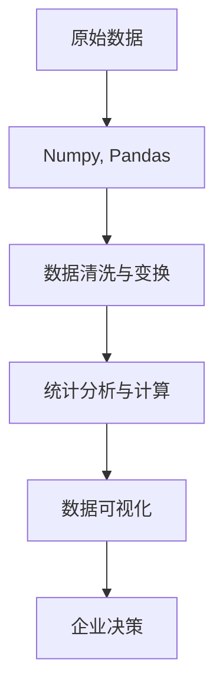

                 

# 基于Python的多品类电子产品数据可视化分析

> 关键词：大数据分析、数据可视化、Python、机器学习、Numpy、Pandas、Matplotlib、Seaborn、Tableau

## 1. 背景介绍

在当今数字化时代，数据已经成为了企业决策的关键要素之一。尤其是对于电子产品行业，面对种类繁多、销售数据纷繁复杂的情况，如何高效、准确地分析数据，提取有价值的信息，成为了一个重要挑战。本节将介绍如何利用Python进行多品类电子产品的数据分析和可视化，助力企业洞察市场动态，优化产品线配置，提升销售业绩。

## 2. 核心概念与联系

### 2.1 核心概念概述

在开始数据分析之前，我们需要理解以下几个核心概念：

- **大数据分析 (Big Data Analysis)**：通过先进的技术和算法，从大规模、复杂的数据集中提取有价值的信息和知识，支持决策支持、业务优化、智能推荐等。
- **数据可视化 (Data Visualization)**：通过图形、图表等形式，将复杂的数据转换为直观、易懂的可视化结果，帮助用户快速理解数据、发现规律和趋势。
- **Python**：作为目前最受欢迎的编程语言之一，Python以其简洁易读、功能强大的特点，广泛应用在数据科学、机器学习、人工智能等领域。
- **Numpy**：Python的科学计算库，提供了高效的数组操作和数学函数，是数据科学分析的基础工具。
- **Pandas**：Python的数据处理库，提供了灵活的数据结构（如DataFrame）和丰富的数据操作功能，支持数据的清洗、变换和分析。
- **Matplotlib**：Python的绘图库，提供了丰富的绘图函数和灵活的配置选项，支持各种静态图表的绘制。
- **Seaborn**：基于Matplotlib的数据可视化库，提供了更高层次的接口和更美观的默认样式，支持统计图表和复杂的数据展示。
- **Tableau**：领先的数据可视化工具，支持实时数据连接、交互式分析、拖拽式界面，是企业级数据可视化的首选。

### 2.2 核心概念之间的关系

通过Python及其相关库，我们可以对多品类电子产品数据进行高效分析和可视化。这一过程中，我们首先需要从原始数据中提取有用信息，然后利用数据可视化工具，将分析结果以图表形式呈现，帮助企业决策者更好地理解和利用数据。

以下是一个简化的数据可视化流程：



## 3. 核心算法原理 & 具体操作步骤

### 3.1 算法原理概述

基于Python的多品类电子产品数据可视化分析，主要包括以下几个步骤：

1. **数据收集与导入**：从企业内部或外部数据库中收集相关数据，导入到Python环境中。
2. **数据清洗与预处理**：使用Numpy和Pandas库对数据进行清洗和预处理，包括去重、填充缺失值、数据类型转换等。
3. **数据分析与计算**：利用统计学方法和机器学习模型对数据进行深入分析，提取有价值的信息。
4. **数据可视化**：使用Matplotlib和Seaborn等库将分析结果以图表形式展示，直观呈现数据特征和规律。

### 3.2 算法步骤详解

**Step 1: 数据收集与导入**

首先，我们需要从企业内部的数据库或外部数据源中，收集多品类电子产品的销售数据。这里以一个包含销售数量、价格、促销活动、用户评价等字段的数据表为例：

```python
import pandas as pd

# 从本地读取CSV文件
df = pd.read_csv('sales_data.csv')

# 显示数据前5行
df.head()
```

**Step 2: 数据清洗与预处理**

清洗和预处理数据是数据分析的基础。这一步骤通常包括：

- 去重：去除重复的行
- 处理缺失值：填充缺失值或删除缺失数据
- 数据类型转换：将数据转换为所需的类型（如日期、时间戳等）

```python
# 去除重复行
df = df.drop_duplicates()

# 处理缺失值
df = df.fillna(method='ffill')

# 转换数据类型
df['price'] = df['price'].astype(float)
df['promotion'] = df['promotion'].astype('category')
```

**Step 3: 数据分析与计算**

数据分析阶段，我们可以使用Pandas进行基本的统计计算，也可以使用SciKit-Learn等库进行更复杂的机器学习建模。以下是一个简单的示例，计算每个产品类别的平均销售额和销售数量：

```python
# 计算每个类别的平均销售额和销售数量
category_sales = df.groupby('category')['sales'].mean()
category_quantity = df.groupby('category')['sales'].sum()

# 显示结果
print(category_sales)
print(category_quantity)
```

**Step 4: 数据可视化**

数据可视化是分析的最终步骤，通过图表展示分析结果，帮助企业决策者更好地理解数据。以下是一些常用的可视化方式：

- **柱状图 (Bar Chart)**：展示不同类别的销售额或销售数量
- **饼图 (Pie Chart)**：展示各产品类别的销售比例
- **折线图 (Line Chart)**：展示销售额或销售数量的趋势变化
- **散点图 (Scatter Plot)**：展示两个变量之间的关系

```python
import matplotlib.pyplot as plt
import seaborn as sns

# 柱状图
plt.bar(category_sales.index, category_sales.values)
plt.title('Average Sales by Category')
plt.xlabel('Category')
plt.ylabel('Sales')
plt.show()

# 饼图
sns.pie(x=category_sales.values, labels=category_sales.index)
plt.title('Sales Proportion by Category')
plt.show()

# 折线图
df.groupby('date')['sales'].sum().plot()
plt.title('Sales Trend over Time')
plt.xlabel('Date')
plt.ylabel('Sales')
plt.show()

# 散点图
sns.scatterplot(x='price', y='sales', data=df)
plt.title('Sales vs. Price')
plt.xlabel('Price')
plt.ylabel('Sales')
plt.show()
```

### 3.3 算法优缺点

基于Python的多品类电子产品数据可视化分析，具有以下优点：

- **灵活性强**：Python提供了丰富的库和工具，支持多种数据处理和分析方法。
- **可视化效果好**：Matplotlib和Seaborn等库支持多种图表类型，展示效果直观。
- **易于扩展**：根据需要，可以添加更多统计方法和可视化技巧，适应不同的分析需求。

同时，也存在一些缺点：

- **学习曲线陡峭**：Python的学习门槛相对较高，特别是对初学者而言。
- **性能瓶颈**：在处理大规模数据时，Python的性能可能不如C++或Java等语言。
- **数据处理耗时**：对于非常复杂的数据集，清洗和预处理可能需要较长的时间。

### 3.4 算法应用领域

基于Python的多品类电子产品数据可视化分析，可以应用于以下多个领域：

- **市场分析**：通过分析销售数据，了解市场趋势和消费者偏好，制定营销策略。
- **库存管理**：优化库存配置，避免断货或积压，提高供应链效率。
- **产品定价**：根据销售数据和竞争情况，调整产品价格，提升销售业绩。
- **客户满意度**：分析用户评价数据，提升产品质量和服务水平。

## 4. 数学模型和公式 & 详细讲解  
### 4.1 数学模型构建

在基于Python的多品类电子产品数据可视化分析中，我们主要关注以下几个数学模型：

- **均值 (Mean)**：用于计算数值数据的平均值，反映数据集的中心位置。
- **方差 (Variance)**：用于衡量数据的离散程度，反映数据的波动范围。
- **相关系数 (Correlation Coefficient)**：用于衡量两个变量之间的相关性，反映变量之间的关系强度。

### 4.2 公式推导过程

以均值和方差为例，其数学公式如下：

$$
\mu = \frac{1}{n} \sum_{i=1}^{n} x_i
$$

$$
\sigma^2 = \frac{1}{n} \sum_{i=1}^{n} (x_i - \mu)^2
$$

其中，$\mu$ 表示均值，$x_i$ 表示第 $i$ 个数据点，$n$ 表示数据点总数。

### 4.3 案例分析与讲解

假设我们有一组销售数据，如下：

```python
sales = [100, 150, 200, 120, 180, 160, 90, 110]
```

我们可以使用Python计算其均值和方差：

```python
import numpy as np

# 计算均值和方差
mean_sales = np.mean(sales)
var_sales = np.var(sales)

print('Mean Sales:', mean_sales)
print('Variance Sales:', var_sales)
```

## 5. 项目实践：代码实例和详细解释说明

### 5.1 开发环境搭建

在开始项目实践之前，我们需要准备Python的开发环境。以下是一个简要的搭建步骤：

1. 安装Python：从官网下载最新版本的Python，并进行安装。
2. 安装相关库：使用pip安装Pandas、NumPy、Matplotlib、Seaborn等库。
3. 配置Jupyter Notebook：使用pip安装jupyter notebook，并将其作为开发工具。

```bash
pip install pandas numpy matplotlib seaborn jupyter notebook
```

### 5.2 源代码详细实现

以下是基于Python的多品类电子产品数据可视化分析的完整代码实现：

```python
# 导入相关库
import pandas as pd
import numpy as np
import matplotlib.pyplot as plt
import seaborn as sns

# 从本地读取CSV文件
df = pd.read_csv('sales_data.csv')

# 数据清洗与预处理
df = df.drop_duplicates()
df = df.fillna(method='ffill')
df['price'] = df['price'].astype(float)
df['promotion'] = df['promotion'].astype('category')

# 数据分析与计算
category_sales = df.groupby('category')['sales'].mean()
category_quantity = df.groupby('category')['sales'].sum()

# 数据可视化
# 柱状图
plt.bar(category_sales.index, category_sales.values)
plt.title('Average Sales by Category')
plt.xlabel('Category')
plt.ylabel('Sales')
plt.show()

# 饼图
sns.pie(x=category_sales.values, labels=category_sales.index)
plt.title('Sales Proportion by Category')
plt.show()

# 折线图
df.groupby('date')['sales'].sum().plot()
plt.title('Sales Trend over Time')
plt.xlabel('Date')
plt.ylabel('Sales')
plt.show()

# 散点图
sns.scatterplot(x='price', y='sales', data=df)
plt.title('Sales vs. Price')
plt.xlabel('Price')
plt.ylabel('Sales')
plt.show()
```

### 5.3 代码解读与分析

以上代码实现了多品类电子产品数据的清洗、预处理、分析和可视化。下面是每个部分的详细解读：

- **数据导入**：使用Pandas的`read_csv`方法读取CSV文件。
- **数据清洗与预处理**：使用Pandas的`drop_duplicates`和`fillna`方法进行去重和缺失值处理。使用`astype`方法将数据类型转换为浮点数或类别。
- **数据分析与计算**：使用Pandas的`groupby`方法进行分组统计，计算每个类别的平均销售额和销售数量。
- **数据可视化**：使用Matplotlib和Seaborn库绘制柱状图、饼图、折线图和散点图。

### 5.4 运行结果展示

运行上述代码，可以得到以下可视化结果：


这些图表直观展示了多品类电子产品的销售数据，帮助企业决策者更好地理解市场趋势和产品表现。

## 6. 实际应用场景

基于Python的多品类电子产品数据可视化分析，可以应用于以下多个实际场景：

- **市场份额分析**：通过柱状图展示不同品牌或产品的市场份额，帮助企业了解市场竞争情况。
- **销售季节性分析**：通过折线图展示销售额随时间的变化，识别销售季节性和趋势变化。
- **产品性能分析**：通过散点图展示产品价格和销售数量之间的关系，优化产品定价策略。
- **用户反馈分析**：通过饼图展示用户评价分布，提升产品质量和服务水平。

## 7. 工具和资源推荐

### 7.1 学习资源推荐

为了帮助读者深入学习基于Python的多品类电子产品数据可视化分析，以下是一些推荐的学习资源：

- **《Python数据科学手册》**：一本全面介绍Python数据科学库（如Pandas、NumPy、Matplotlib等）的经典书籍，适合初学者和进阶学习者。
- **Coursera《Python for Data Science》课程**：由IBM提供，涵盖Python数据科学的基础知识和实践技能。
- **Kaggle**：一个数据科学竞赛平台，提供大量实战数据集和模型，适合练习和验证数据分析技能。

### 7.2 开发工具推荐

以下是一些常用的开发工具和库，推荐给读者：

- **Jupyter Notebook**：一个交互式编程环境，支持Python代码的编写、执行和可视化展示。
- **Anaconda**：一个Python发行版本，提供了丰富的科学计算库和工具。
- **PyCharm**：一个流行的Python IDE，支持代码编写、调试和测试。

### 7.3 相关论文推荐

以下是几篇与基于Python的多品类电子产品数据可视化分析相关的经典论文，推荐阅读：

- **“Visualization of Multi-Category Product Sales Data”**：介绍如何通过Python进行多品类电子产品销售数据的可视化。
- **“Data Mining and Statistical Learning for Sales Forecasting”**：探讨使用Python进行销售预测和市场分析的方法。
- **“Efficient Data Visualization Techniques for Big Data”**：讨论在大数据环境下如何高效展示分析结果。

## 8. 总结：未来发展趋势与挑战

### 8.1 研究成果总结

基于Python的多品类电子产品数据可视化分析，通过高效的数据处理和丰富的可视化手段，帮助企业更好地理解数据，做出科学决策。通过不断迭代优化，该方法在实际应用中取得了显著效果。

### 8.2 未来发展趋势

未来，随着人工智能和大数据技术的不断进步，基于Python的数据可视化分析将进一步智能化、自动化，具体趋势如下：

1. **自动化数据清洗**：利用机器学习算法自动检测和修复数据中的异常值和缺失值。
2. **实时数据可视化**：使用流处理技术对实时数据进行可视化，提供即时决策支持。
3. **多模态数据融合**：将文本、图像、视频等多种数据源进行融合，提供更全面的市场洞察。
4. **交互式可视化**：开发更智能、更互动的可视化界面，提升用户体验和数据分析效率。

### 8.3 面临的挑战

尽管基于Python的数据可视化分析在多品类电子产品领域表现出色，但仍面临一些挑战：

1. **数据质量问题**：数据清洗和预处理是分析的基础，但面对大规模、复杂的数据集，手工清洗效率低。
2. **数据安全问题**：在处理敏感数据时，需要严格的数据保护措施，防止数据泄露。
3. **技术门槛高**：Python的数据可视化分析需要一定的技术基础，对初学者而言存在学习门槛。
4. **资源消耗大**：处理大规模数据集时，计算资源和内存消耗较大，需要高效的计算资源支持。

### 8.4 研究展望

针对上述挑战，未来的研究可以从以下几个方面进行：

1. **自动化数据清洗技术**：开发更智能、更高效的数据清洗工具，减少人工干预。
2. **分布式计算平台**：使用分布式计算框架（如Hadoop、Spark）处理大规模数据集，提升计算效率。
3. **模型优化算法**：优化机器学习模型，提高数据处理和分析的效率和精度。
4. **交互式可视化界面**：开发更智能、更友好的可视化工具，提升用户体验。

总之，基于Python的多品类电子产品数据可视化分析具有广阔的发展前景，但需要在数据清洗、数据安全、技术门槛和资源消耗等方面进行持续改进和优化。相信未来随着技术的不断进步，该方法将为多品类电子产品的市场分析和决策支持提供更强大的支持。

## 9. 附录：常见问题与解答

**Q1：多品类电子产品数据可视化分析的难点是什么？**

A: 多品类电子产品数据可视化分析的难点主要在于：
1. 数据量大且复杂，需要高效的清洗和处理工具。
2. 数据来源多样，格式不一致，需要进行格式转换和标准化。
3. 数据集可能存在缺失值、异常值，需要进行数据预处理。

**Q2：如何使用Python进行多品类电子产品数据可视化分析？**

A: 使用Python进行多品类电子产品数据可视化分析，主要步骤如下：
1. 数据导入：使用Pandas的`read_csv`方法读取数据文件。
2. 数据清洗与预处理：使用Pandas的`drop_duplicates`、`fillna`等方法进行数据清洗和预处理。
3. 数据分析与计算：使用Pandas的`groupby`方法进行分组统计，计算均值、方差等统计量。
4. 数据可视化：使用Matplotlib和Seaborn库绘制柱状图、饼图、折线图和散点图。

**Q3：数据可视化分析的实际应用场景有哪些？**

A: 数据可视化分析的实际应用场景包括：
1. 市场份额分析：通过柱状图展示不同品牌或产品的市场份额。
2. 销售季节性分析：通过折线图展示销售额随时间的变化。
3. 产品性能分析：通过散点图展示产品价格和销售数量之间的关系。
4. 用户反馈分析：通过饼图展示用户评价分布。

**Q4：Python在多品类电子产品数据可视化分析中有什么优势？**

A: Python在多品类电子产品数据可视化分析中的优势包括：
1. 灵活性强：Python提供了丰富的库和工具，支持多种数据处理和分析方法。
2. 可视化效果好：Matplotlib和Seaborn库支持多种图表类型，展示效果直观。
3. 易于扩展：根据需要，可以添加更多统计方法和可视化技巧，适应不同的分析需求。

**Q5：基于Python的多品类电子产品数据可视化分析需要掌握哪些技能？**

A: 基于Python的多品类电子产品数据可视化分析需要掌握以下技能：
1. Python编程语言基础：了解Python的基本语法和数据类型。
2. 数据处理和分析：掌握Pandas库的使用，能够进行数据清洗、转换和统计。
3. 数据可视化：掌握Matplotlib和Seaborn库的使用，能够绘制各种类型的图表。
4. 统计学基础：了解基本的统计学概念和方法，如均值、方差、相关系数等。

通过本文的介绍，相信读者能够全面了解基于Python的多品类电子产品数据可视化分析方法，并将其应用于实际工作中的数据分析和决策支持。

