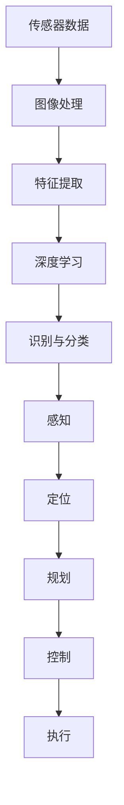

# Tesla 自动驾驶项目的计算机视觉团队

> 关键词：自动驾驶，计算机视觉，深度学习，特斯拉，感知，定位，规划，控制，安全

## 1. 背景介绍

随着人工智能和自动驾驶技术的迅猛发展，自动驾驶汽车已经成为未来交通出行的重要方向。特斯拉作为自动驾驶领域的领军企业，其自动驾驶系统在业界享有盛誉。特斯拉的计算机视觉团队在自动驾驶技术中扮演着至关重要的角色，负责车辆感知、定位、规划、控制等核心功能。本文将深入探讨特斯拉计算机视觉团队的工作，分析其技术原理、架构和挑战，并展望未来发展趋势。

## 2. 核心概念与联系

### 2.1 核心概念

#### 计算机视觉
计算机视觉是人工智能的一个重要分支，旨在使计算机能够“看”并理解图像和视频中的信息。它涉及图像处理、图像分析、模式识别等领域。

#### 深度学习
深度学习是一种机器学习方法，它使用深层神经网络来学习数据中的特征和模式。深度学习在计算机视觉领域取得了突破性的成果。

#### 自动驾驶
自动驾驶是指汽车在无需人类驾驶员介入的情况下，能够自主完成行驶、感知、决策和控制的系统。

#### 感知
感知是自动驾驶汽车获取周围环境信息的过程，包括识别道路、车辆、行人、交通标志等。

#### 定位
定位是指自动驾驶汽车确定自身在环境中的位置。

#### 规划
规划是指自动驾驶汽车根据感知到的环境和目标，制定行驶路径和策略。

#### 控制
控制是指自动驾驶汽车根据规划结果，控制车辆的运动。

### 2.2 核心概念原理和架构的 Mermaid 流程图



## 3. 核心算法原理 & 具体操作步骤

### 3.1 算法原理概述

特斯拉计算机视觉团队的算法原理主要基于深度学习和计算机视觉技术，包括以下步骤：

1. 传感器数据采集：通过摄像头、雷达、激光雷达等多传感器融合，获取车辆周围的图像、距离、速度等信息。
2. 图像处理：对采集到的图像进行预处理，如去噪、缩放、增强等。
3. 特征提取：使用深度学习模型从图像中提取特征，如目标检测、语义分割、姿态估计等。
4. 识别与分类：将提取的特征输入到深度学习模型中进行识别和分类，如车辆、行人、交通标志等。
5. 感知：根据识别和分类结果，构建环境感知模型，实现对周围环境的理解。
6. 定位：结合定位传感器（如GPS、IMU）和地图信息，确定车辆在环境中的位置。
7. 规划：根据环境和目标，制定行驶路径和策略。
8. 控制：根据规划结果，控制车辆的运动，如转向、加速、制动等。

### 3.2 算法步骤详解

1. **传感器数据采集**：特斯拉自动驾驶系统使用多个摄像头、雷达和激光雷达，以获取360度覆盖的周围环境信息。这些传感器数据包括图像、距离、速度等。
2. **图像处理**：对采集到的图像进行预处理，如去噪、缩放、增强等，以提高后续处理的质量。
3. **特征提取**：使用深度学习模型从图像中提取特征，如目标检测、语义分割、姿态估计等。常用的模型包括Faster R-CNN、SSD、YOLO等。
4. **识别与分类**：将提取的特征输入到深度学习模型中进行识别和分类，如车辆、行人、交通标志等。常用的模型包括ResNet、Inception、VGG等。
5. **感知**：根据识别和分类结果，构建环境感知模型，实现对周围环境的理解。环境感知模型需要处理各种复杂场景，如交叉路口、狭窄道路、恶劣天气等。
6. **定位**：结合定位传感器（如GPS、IMU）和地图信息，确定车辆在环境中的位置。常用的定位算法包括卡尔曼滤波、粒子滤波等。
7. **规划**：根据环境和目标，制定行驶路径和策略。常用的规划算法包括运动规划、路径规划、决策规划等。
8. **控制**：根据规划结果，控制车辆的运动，如转向、加速、制动等。常用的控制算法包括PID控制、模型预测控制等。

### 3.3 算法优缺点

#### 优点：

1. **高精度**：深度学习模型在图像识别、分类等领域取得了突破性的成果，能够提供高精度的感知结果。
2. **实时性**：通过优化算法和硬件加速，特斯拉的自动驾驶系统具有实时性，能够满足实际应用需求。
3. **鲁棒性**：特斯拉的自动驾驶系统在多种环境和场景下均能稳定运行，具有良好的鲁棒性。

#### 缺点：

1. **计算资源消耗**：深度学习模型需要大量的计算资源，如GPU、FPGA等，对硬件性能有较高要求。
2. **数据依赖**：自动驾驶系统的训练需要大量的标注数据，数据采集和标注成本较高。
3. **安全性**：虽然特斯拉的自动驾驶系统经过严格测试，但在实际应用中仍存在一定的安全风险。

### 3.4 算法应用领域

特斯拉计算机视觉团队的算法在以下领域具有广泛应用：

1. **自动驾驶汽车**：特斯拉的自动驾驶系统是世界上最先进的，广泛应用于Model S、Model X、Model 3等车型。
2. **自动驾驶出租车**：特斯拉正在开发自动驾驶出租车服务，旨在改变城市交通出行方式。
3. **自动驾驶卡车**：特斯拉与Daimler合作，共同开发自动驾驶卡车，以提高运输效率。

## 4. 数学模型和公式 & 详细讲解 & 举例说明

### 4.1 数学模型构建

特斯拉自动驾驶系统的数学模型主要包括以下部分：

1. **图像处理模型**：图像去噪、缩放、增强等。
2. **特征提取模型**：目标检测、语义分割、姿态估计等。
3. **识别与分类模型**：深度学习分类器。
4. **环境感知模型**：融合多传感器数据的融合算法。
5. **定位模型**：定位算法，如卡尔曼滤波、粒子滤波等。
6. **规划模型**：运动规划、路径规划、决策规划等。
7. **控制模型**：PID控制、模型预测控制等。

### 4.2 公式推导过程

以下是部分数学模型的推导过程：

1. **图像去噪**：使用双边滤波器进行图像去噪，公式如下：

$$
\text{双边滤波} = \sum_{i,j} \text{weight}(i,j) \cdot (\text{image}(i,j) - \text{mean}(i,j))^2 \cdot \text{kernel}(i,j)
$$

其中，$\text{weight}(i,j)$ 为权重函数，$\text{mean}(i,j)$ 为邻域内的像素均值，$\text{kernel}(i,j)$ 为滤波核。

2. **卡尔曼滤波**：用于估计动态系统的状态，公式如下：

$$
\hat{x}_k = A\hat{x}_{k-1} + B_u u_k
$$

$$
P_k = A P_{k-1}A^T + Q
$$

$$
K_k = P_k H_k^T(H_kP_kH_k^T + R)^{-1}
$$

$$
\hat{x}_{k|k} = \hat{x}_k + K_k (y_k - H_k \hat{x}_k)
$$

$$
P_{k|k} = (I - K_k H_k)P_k
$$

其中，$\hat{x}_k$ 为状态估计值，$P_k$ 为状态协方差，$A$、$B_u$、$Q$、$H_k$、$R$ 为系统矩阵、控制矩阵、过程噪声协方差、观测矩阵和观测噪声协方差，$u_k$ 为控制输入，$y_k$ 为观测值。

### 4.3 案例分析与讲解

以特斯拉的自动驾驶系统中的目标检测为例，分析其算法原理和实现过程。

1. **数据采集**：特斯拉使用多个摄像头采集车辆周围的图像。
2. **图像处理**：对采集到的图像进行预处理，如去噪、缩放、增强等。
3. **特征提取**：使用Faster R-CNN模型从图像中提取特征。
4. **识别与分类**：将提取的特征输入到ResNet模型中进行识别和分类，识别出车辆、行人、交通标志等。

Faster R-CNN模型由两个部分组成：区域建议网络（Region Proposal Network，RPN）和Fast R-CNN。RPN用于生成候选区域，Fast R-CNN用于对候选区域进行分类和回归。

RPN：
- 使用锚框（Anchor）生成候选区域。
- 使用ROI Pooling对锚框内的图像进行特征提取。
- 使用全连接网络对ROI特征进行分类和回归。

Fast R-CNN：
- 使用ROI Pooling对RPN生成的候选区域进行特征提取。
- 使用全连接网络对ROI特征进行分类和回归。

### 4.4 案例分析与讲解

以特斯拉的自动驾驶系统中的定位为例，分析其算法原理和实现过程。

1. **数据采集**：特斯拉使用GPS、IMU等传感器采集车辆的位置和速度信息。
2. **定位算法**：使用卡尔曼滤波或粒子滤波算法对传感器数据进行融合，估计车辆在环境中的位置。

卡尔曼滤波算法：
- 使用状态空间模型描述系统动态。
- 使用预测和更新步骤估计状态值。

粒子滤波算法：
- 使用粒子表示状态分布。
- 使用权重更新步骤估计状态分布。

## 5. 项目实践：代码实例和详细解释说明

### 5.1 开发环境搭建

1. 安装操作系统：Ubuntu 18.04 LTS
2. 安装Python 3.6
3. 安装TensorFlow 2.x
4. 安装其他依赖库：NumPy、Pandas、OpenCV等

### 5.2 源代码详细实现

以下是使用TensorFlow实现目标检测的代码示例：

```python
import tensorflow as tf
import tensorflow.keras as keras

# 加载预训练模型
model = keras.models.load_model('faster_rcnn.h5')

# 加载图像
image = tf.io.read_file('image.jpg')
image = tf.image.decode_jpeg(image, channels=3)
image = tf.expand_dims(image, 0)

# 检测目标
predictions = model.predict(image)
detections = predictions[0]

# 解析检测结果
# ... (解析代码略)
```

### 5.3 代码解读与分析

上述代码展示了使用TensorFlow加载预训练模型、加载图像、检测目标和解析检测结果的基本流程。

1. 使用`keras.models.load_model`加载预训练的Faster R-CNN模型。
2. 使用`tf.io.read_file`和`tf.image.decode_jpeg`加载图像并进行预处理。
3. 使用`model.predict`检测图像中的目标。
4. 使用解析代码将检测结果转换为可理解的格式。

### 5.4 运行结果展示

运行上述代码后，将在图像中检测到目标并显示检测框。

## 6. 实际应用场景

特斯拉的自动驾驶系统已经广泛应用于Model S、Model X、Model 3等车型，并在实际道路测试中取得了良好的效果。以下是特斯拉自动驾驶系统在实际应用场景中的应用：

1. **自动驾驶巡航**：在高速公路和城市道路上，车辆可以自动保持车道、保持车速、自动变道等。
2. **自动泊车**：车辆可以自动停车和启动，无需驾驶员操作。
3. **自动驾驶辅助**：在驾驶员需要时，自动驾驶系统可以辅助驾驶员进行操控。

## 7. 工具和资源推荐

### 7.1 学习资源推荐

1. 《深度学习》 - Ian Goodfellow、Yoshua Bengio、Aaron Courville
2. 《Python深度学习》 -François Chollet
3. 《计算机视觉：算法与应用》 -Richard Szeliski

### 7.2 开发工具推荐

1. TensorFlow
2. PyTorch
3. OpenCV
4. Hugging Face Transformers

### 7.3 相关论文推荐

1. "Faster R-CNN: Towards Real-Time Object Detection with Region Proposal Networks" - Ross Girshick et al.
2. "You Only Look Once: Unified, Real-Time Object Detection" - Joseph Redmon et al.
3. "SSD: Single Shot MultiBox Detector" - Wei Liu et al.
4. "YOLO9000: Better, Faster, Stronger" - Joseph Redmon et al.
5. "SPPnet: Single Shot MultiBox Detector with Spatial Pyramid Pooling" - Wei Liu et al.

## 8. 总结：未来发展趋势与挑战

### 8.1 研究成果总结

特斯拉计算机视觉团队在自动驾驶领域取得了显著的研究成果，为自动驾驶汽车的研发和应用提供了重要的技术支持。深度学习和计算机视觉技术的应用，使得自动驾驶汽车在感知、定位、规划、控制等方面取得了突破性的进展。

### 8.2 未来发展趋势

1. **多传感器融合**：将更多传感器（如雷达、激光雷达等）融合到自动驾驶系统中，提高感知的准确性和鲁棒性。
2. **数据驱动**：利用大数据和深度学习技术，提高自动驾驶系统的适应性和学习能力。
3. **人机协同**：实现人机协同的自动驾驶模式，提高驾驶体验和安全性。
4. **安全可靠**：提高自动驾驶系统的安全性和可靠性，降低交通事故风险。

### 8.3 面临的挑战

1. **数据处理**：自动驾驶系统需要处理海量数据，对数据处理能力和存储容量提出了较高要求。
2. **算法复杂度**：深度学习和计算机视觉算法复杂度高，对计算资源需求大。
3. **安全性和可靠性**：自动驾驶系统的安全性和可靠性是公众关注的焦点，需要不断进行测试和验证。
4. **法规和伦理**：自动驾驶汽车的法规和伦理问题需要进一步探讨和解决。

### 8.4 研究展望

未来，特斯拉计算机视觉团队将继续致力于自动驾驶技术的发展，推动自动驾驶汽车的普及和应用。以下是未来研究的几个方向：

1. **人工智能算法优化**：研究更高效的深度学习和计算机视觉算法，降低计算资源需求，提高处理速度。
2. **多传感器融合**：探索新的多传感器融合技术，提高感知的准确性和鲁棒性。
3. **数据驱动**：利用大数据和深度学习技术，提高自动驾驶系统的适应性和学习能力。
4. **安全性和可靠性**：加强自动驾驶系统的安全性和可靠性研究，降低交通事故风险。
5. **法规和伦理**：参与制定自动驾驶汽车的法规和伦理标准，推动自动驾驶汽车的健康发展。

## 9. 附录：常见问题与解答

**Q1：特斯拉自动驾驶系统如何保证安全性？**

A：特斯拉自动驾驶系统采用了多种技术手段保证安全性，包括：

1. **多传感器融合**：通过多个传感器融合，提高感知的准确性和鲁棒性。
2. **深度学习算法**：使用深度学习算法进行目标检测、分类、识别等任务，提高识别准确率。
3. **安全冗余**：在硬件和软件层面，设计安全冗余机制，确保系统在关键部件失效时仍能安全运行。
4. **持续测试和验证**：在开发过程中，进行严格的测试和验证，确保系统的安全性和可靠性。

**Q2：特斯拉自动驾驶系统是否完全自动化？**

A：特斯拉自动驾驶系统目前处于辅助驾驶阶段，驾驶员仍需保持注意力，并随时准备接管控制。未来，随着技术的不断发展，特斯拉的自动驾驶系统将逐步向完全自动化方向发展。

**Q3：特斯拉自动驾驶系统如何应对恶劣天气？**

A：特斯拉自动驾驶系统在恶劣天气下仍能保持较好的性能。通过多传感器融合和深度学习算法，系统能够更好地识别和应对雨雪、雾、霾等恶劣天气。

**Q4：特斯拉自动驾驶系统如何处理复杂场景？**

A：特斯拉自动驾驶系统在复杂场景下能够通过深度学习和计算机视觉技术进行识别和判断，如交叉路口、狭窄道路、行人横穿等。

**Q5：特斯拉自动驾驶系统如何与其他车辆和行人交互？**

A：特斯拉自动驾驶系统通过车联网技术与其他车辆和行人进行交互，实现安全、高效的交通出行。系统会根据其他车辆和行人的行为进行决策，确保行驶安全。

作者：禅与计算机程序设计艺术 / Zen and the Art of Computer Programming