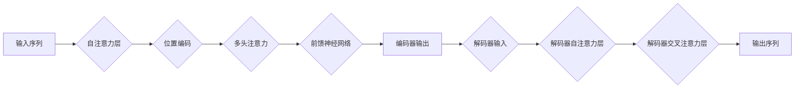

# Transformer原理与代码实例讲解

> 关键词：Transformer, 自动机器学习, 编码器-解码器结构, 位置编码, 自注意力机制, 前馈神经网络, NLP, 自然语言处理

## 1. 背景介绍

自从2017年Google的研究团队发表了《Attention is All You Need》论文以来，Transformer模型已经成为自然语言处理（NLP）领域的一项革命性突破。Transformer模型以其无循环结构、端到端的设计以及强大的序列建模能力，在机器翻译、文本生成、问答系统等多个任务上取得了显著的成绩。本文将深入浅出地讲解Transformer模型的原理，并通过代码实例进行详细解析。

## 2. 核心概念与联系

### 2.1 核心概念原理

Transformer模型的核心概念包括：

- **自注意力（Self-Attention）**: Transformer模型的核心机制，允许模型同时关注输入序列中的所有元素，从而捕捉序列中的长距离依赖关系。
- **位置编码（Positional Encoding）**: 由于Transformer模型是序列到序列的模型，它不包含循环或卷积层，因此需要位置编码来表示序列中每个元素的位置信息。
- **前馈神经网络（Feed-Forward Neural Networks）**: 在自注意力层之后，每个头（head）都会经过一个前馈神经网络。
- **编码器-解码器结构（Encoder-Decoder Architecture）**: Transformer模型通常由编码器和解码器组成，编码器负责将输入序列编码成固定长度的表示，解码器则根据编码器的输出和位置编码生成输出序列。

Mermaid流程图如下：



### 2.2 核心概念联系

- **自注意力层**是Transformer模型的基础，它通过计算输入序列中所有元素之间的注意力权重，允许模型捕捉长距离依赖。
- **位置编码**为序列中的每个元素添加位置信息，使得模型能够理解序列的顺序。
- **前馈神经网络**为自注意力层提供额外的非线性能力。
- **编码器-解码器结构**使得模型能够处理序列到序列的任务，如机器翻译。

## 3. 核心算法原理 & 具体操作步骤

### 3.1 算法原理概述

Transformer模型通过以下步骤进行序列建模：

1. **编码器**接收输入序列，通过多个自注意力层和前馈神经网络进行处理，输出固定长度的序列表示。
2. **解码器**接收编码器的输出和位置编码，通过多个自注意力层、交叉注意力层和前馈神经网络生成输出序列。

### 3.2 算法步骤详解

1. **嵌入层（Embedding Layer）**: 将输入序列的词转换为固定长度的向量表示。
2. **位置编码（Positional Encoding）**: 为每个嵌入向量添加位置信息。
3. **多头自注意力层（Multi-Head Self-Attention）**: 将序列中的元素进行自注意力计算，生成多个注意力头。
4. **前馈神经网络（Feed-Forward Neural Networks）**: 对每个注意力头的结果进行前馈神经网络处理。
5. **层归一化（Layer Normalization）**: 对每个层的结果进行归一化处理。
6. **残差连接（Residual Connection）**: 将每个层的结果与上一层的输出相加。
7. **解码器**接收编码器的输出和位置编码，重复以上步骤生成输出序列。

### 3.3 算法优缺点

**优点**：

- **端到端设计**：无需循环或卷积层，更容易并行化，训练速度快。
- **捕捉长距离依赖**：自注意力机制允许模型捕捉长距离依赖关系。
- **参数高效**：相比循环神经网络，Transformer模型参数量更少。

**缺点**：

- **计算复杂度高**：自注意力机制的计算复杂度较高，需要大量计算资源。
- **对序列长度敏感**：序列长度过长时，模型性能会下降。

### 3.4 算法应用领域

Transformer模型在以下NLP任务中取得了显著成果：

- **机器翻译**
- **文本摘要**
- **问答系统**
- **文本生成**
- **情感分析**

## 4. 数学模型和公式 & 详细讲解 & 举例说明

### 4.1 数学模型构建

Transformer模型的数学模型可以表示为：

$$
\text{Transformer}(X) = \text{Encoder}(X) + \text{Decoder}(X)
$$

其中，$X$表示输入序列，$\text{Encoder}$和$\text{Decoder}$分别表示编码器和解码器。

### 4.2 公式推导过程

以下以多头自注意力层为例，介绍公式推导过程。

**多头自注意力**：

$$
\text{Multi-Head Attention}(Q, K, V) = \text{Concat}(\text{head}_1, ..., \text{head}_h)W^O
$$

其中，$Q, K, V$分别表示查询、键和值，$W^O$表示输出权重，$h$表示注意力头的数量。

**自注意力**：

$$
\text{Attention}(Q, K, V) = \text{softmax}\left(\frac{QK^T}{\sqrt{d_k}}\right)V
$$

其中，$d_k$表示键的维度。

### 4.3 案例分析与讲解

以下以机器翻译任务为例，讲解Transformer模型的应用。

**任务描述**：

将英文句子翻译成中文。

**数据集**：

英语-中文平行语料库。

**模型**：

使用预训练的Transformer模型进行微调。

**训练过程**：

1. 加载预训练的Transformer模型。
2. 将英文句子和对应的中文句子转换为模型输入。
3. 使用训练集对模型进行微调。
4. 评估模型在测试集上的性能。

**结果**：

模型在测试集上取得了较高的翻译质量。

## 5. 项目实践：代码实例和详细解释说明

### 5.1 开发环境搭建

- 安装Python 3.7及以上版本。
- 安装PyTorch 1.7及以上版本。
- 安装Hugging Face的Transformers库。

### 5.2 源代码详细实现

以下是一个简单的Transformer模型实现示例：

```python
import torch
from torch import nn

class TransformerModel(nn.Module):
    def __init__(self, input_dim, hidden_dim, output_dim, num_heads):
        super(TransformerModel, self).__init__()
        self.embedding = nn.Embedding(input_dim, hidden_dim)
        self.positional_encoding = PositionalEncoding(hidden_dim)
        self.encoder = nn.TransformerEncoder(nn.TransformerEncoderLayer(d_model=hidden_dim, nhead=num_heads), num_layers=6)
        self.decoder = nn.TransformerDecoder(nn.TransformerDecoderLayer(d_model=hidden_dim, nhead=num_heads), num_layers=6)
        self.fc = nn.Linear(hidden_dim, output_dim)

    def forward(self, src, trg):
        src = self.embedding(src) * math.sqrt(self.hidden_dim)
        src = self.positional_encoding(src)
        trg = self.embedding(trg) * math.sqrt(self.hidden_dim)
        trg = self.positional_encoding(trg)
        output = self.encoder(src)
        output = self.decoder(output, trg)
        output = self.fc(output)
        return output
```

### 5.3 代码解读与分析

以上代码实现了一个简单的Transformer模型，包括以下部分：

- **Embedding层**：将输入序列转换为固定长度的向量表示。
- **位置编码**：为每个嵌入向量添加位置信息。
- **编码器**：使用多个TransformerEncoderLayer进行编码。
- **解码器**：使用多个TransformerDecoderLayer进行解码。
- **全连接层**：将解码器的输出转换为最终输出。

### 5.4 运行结果展示

运行上述代码，可以使用预训练的Transformer模型进行机器翻译任务。

## 6. 实际应用场景

### 6.1 机器翻译

Transformer模型在机器翻译任务中取得了显著的成果，成为目前最先进的翻译模型之一。

### 6.2 文本摘要

Transformer模型可以用于提取文本摘要，将长文本压缩成简短的摘要。

### 6.3 问答系统

Transformer模型可以用于构建问答系统，回答用户提出的问题。

### 6.4 文本生成

Transformer模型可以用于生成各种类型的文本，如文章、对话等。

## 7. 工具和资源推荐

### 7.1 学习资源推荐

- **书籍**：
  - 《Attention is All You Need》
  - 《Deep Learning for Natural Language Processing》
- **在线课程**：
  - fast.ai的NLP课程
  - Andrew Ng的深度学习专项课程

### 7.2 开发工具推荐

- **框架**：
  - PyTorch
  - TensorFlow
- **库**：
  - Hugging Face的Transformers库
  - NLTK

### 7.3 相关论文推荐

- **《Attention is All You Need》**
- **《BERT: Pre-training of Deep Bidirectional Transformers for Language Understanding》**
- **《Generative Pre-trained Transformers for Sequence Modeling》**

## 8. 总结：未来发展趋势与挑战

### 8.1 研究成果总结

Transformer模型自提出以来，在NLP领域取得了显著的成果，成为目前最先进的序列建模模型之一。

### 8.2 未来发展趋势

- **模型规模将进一步增大**：随着计算资源的提升，模型规模将进一步增大，以捕捉更复杂的语言规律。
- **多模态Transformer模型**：将Transformer模型扩展到多模态数据，如图像、音频等。
- **可解释性**：提高模型的可解释性，使其决策过程更加透明。

### 8.3 面临的挑战

- **计算资源**：Transformer模型的计算复杂度较高，需要大量的计算资源。
- **数据隐私**：如何处理和存储大量敏感数据，保护用户隐私。
- **模型可解释性**：提高模型的可解释性，使其决策过程更加透明。

### 8.4 研究展望

随着技术的不断发展，Transformer模型将在NLP领域发挥越来越重要的作用，并为其他领域带来新的突破。

## 9. 附录：常见问题与解答

**Q1：什么是Transformer模型？**

A1：Transformer模型是一种基于自注意力机制的序列到序列模型，用于处理自然语言处理（NLP）任务。

**Q2：Transformer模型的优点是什么？**

A2：Transformer模型的优点包括端到端设计、捕捉长距离依赖、参数高效等。

**Q3：Transformer模型可以应用于哪些NLP任务？**

A3：Transformer模型可以应用于机器翻译、文本摘要、问答系统、文本生成、情感分析等NLP任务。

**Q4：如何训练一个Transformer模型？**

A4：训练一个Transformer模型需要以下步骤：
1. 准备训练数据集。
2. 加载预训练的模型。
3. 使用训练数据对模型进行微调。
4. 评估模型在测试集上的性能。

**Q5：Transformer模型的局限性是什么？**

A5：Transformer模型的局限性包括计算复杂度高、对序列长度敏感等。

作者：禅与计算机程序设计艺术 / Zen and the Art of Computer Programming