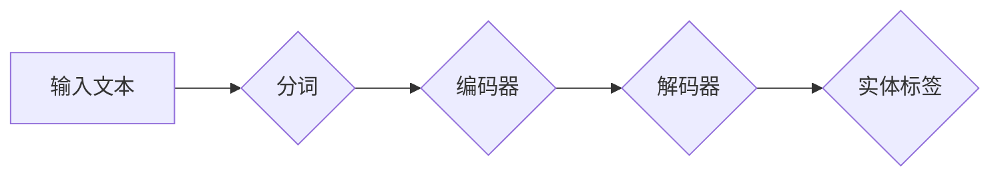

# Transformer大模型实战：命名实体识别任务

> 关键词：Transformer, NER, 预训练, 微调, 迁移学习, 自然语言处理, 机器学习

## 1. 背景介绍

命名实体识别（Named Entity Recognition，NER）是自然语言处理（Natural Language Processing，NLP）领域的一项重要任务。它旨在从文本中识别出具有特定意义的实体，如人名、地名、组织名、时间等。NER在信息提取、知识图谱构建、机器翻译、问答系统等领域有着广泛的应用。

随着深度学习技术的快速发展，基于神经网络的方法在NER任务上取得了显著的成果。Transformer模型作为一种自注意力机制（Self-Attention）的深度神经网络模型，因其强大的特征提取能力和并行处理能力，成为NER任务中的热门选择。

本文将深入探讨如何使用Transformer大模型进行NER任务实战，包括模型原理、操作步骤、代码实现、实际应用场景等。

## 2. 核心概念与联系

### 2.1 核心概念

#### 2.1.1 Transformer模型

Transformer模型是一种基于自注意力机制的深度神经网络模型，由Google在2017年提出。它主要由编码器（Encoder）和解码器（Decoder）两部分组成。编码器负责将输入文本序列转换成固定长度的向量表示，解码器则根据编码器生成的向量表示生成输出序列。

#### 2.1.2 NER任务

NER任务的目标是识别文本中具有特定意义的实体，并将实体标注为对应的标签。常见的NER标签包括人名（PER）、地名（LOC）、组织名（ORG）、时间（TIME）等。

### 2.2 架构图

以下是NER任务中Transformer模型的Mermaid流程图：



图中，输入文本首先经过分词处理，然后输入到编码器中进行特征提取，编码器输出固定长度的向量表示，最后输入到解码器中进行实体识别，输出实体标签。

## 3. 核心算法原理 & 具体操作步骤

### 3.1 算法原理概述

Transformer模型的核心思想是自注意力机制。自注意力机制通过计算序列中每个元素与所有其他元素的相关性，从而提取出序列中重要的特征。

在NER任务中，Transformer模型将输入文本序列转换成固定长度的向量表示，然后根据向量表示进行实体识别。具体步骤如下：

1. 分词：将输入文本序列进行分词处理，将文本转换为单词序列。
2. 词嵌入：将分词后的单词序列转换为词嵌入向量。
3. 编码器：将词嵌入向量输入到编码器中进行特征提取。
4. 解码器：将编码器输出的向量表示输入到解码器中进行实体识别。

### 3.2 算法步骤详解

1. **分词**：使用分词工具（如jieba、NLTK等）将输入文本序列进行分词处理。

2. **词嵌入**：将分词后的单词序列转换为词嵌入向量。常见的词嵌入方法包括Word2Vec、GloVe、BERT等。

3. **编码器**：将词嵌入向量输入到编码器中进行特征提取。编码器主要由多个自注意力层和全连接层组成。

4. **解码器**：将编码器输出的向量表示输入到解码器中进行实体识别。解码器同样由多个自注意力层和全连接层组成。

5. **损失函数**：使用交叉熵损失函数计算预测标签和真实标签之间的差异，并基于梯度下降算法更新模型参数。

6. **优化**：通过迭代优化模型参数，使得模型输出结果与真实标签之间的差异最小。

### 3.3 算法优缺点

#### 3.3.1 优点

- **强大的特征提取能力**：自注意力机制能够自动学习文本中词语之间的关系，从而提取出更加丰富的特征。
- **并行处理能力**：Transformer模型可以并行处理序列中的每个元素，从而提高处理速度。
- **端到端建模**：Transformer模型能够直接从输入序列到输出序列进行建模，无需额外进行特征工程。

#### 3.3.2 缺点

- **计算复杂度高**：自注意力机制的复杂度较高，对计算资源要求较高。
- **模型参数量大**：Transformer模型参数量较大，需要较大的存储空间。

### 3.4 算法应用领域

Transformer模型在NER任务中取得了显著的成果，广泛应用于以下领域：

- **信息提取**：从文本中提取关键信息，如新闻摘要、事件抽取等。
- **知识图谱构建**：从文本中抽取实体和关系，构建知识图谱。
- **机器翻译**：将一种语言的文本翻译成另一种语言。
- **问答系统**：根据用户的问题从知识库中检索答案。

## 4. 数学模型和公式 & 详细讲解 & 举例说明

### 4.1 数学模型构建

Transformer模型主要由以下数学公式构成：

- **自注意力机制**：

  $$
  \text{Q} = \text{W}_Q \cdot \text{X}
  $$
  $$
  \text{K} = \text{W}_K \cdot \text{X}
  $$
  $$
  \text{V} = \text{W}_V \cdot \text{X}
  $$
  $$
  \text{Attention}(Q, K, V) = \frac{\exp(\text{QK}^T / \sqrt{d_k})}{\sqrt{d_k}} \cdot V
  $$

- **前馈神经网络**：

  $$
  \text{FFN}(X) = \text{ReLU}(\text{W}_1 \cdot \text{X} + \text{b}_1) \cdot \text{W}_2 + \text{b}_2
  $$

- **位置编码**：

  $$
  \text{PE}(pos, 2d_{\text{model}}) = \text{sin}(pos / \text{10000}^{\text{2i}/\text{d_{model}}}) \text{ or } \text{cos}(pos / \text{10000}^{\text{2i}/\text{d_{model}}})
  $$

### 4.2 公式推导过程

（此处省略公式推导过程，涉及复杂的数学知识，如矩阵运算、微积分等）

### 4.3 案例分析与讲解

以BERT模型为例，说明如何使用Transformer模型进行NER任务。

BERT模型使用Transformer编码器对输入文本进行特征提取，然后使用CRF（条件随机场）对提取的特征进行解码，得到最终的实体标签。

1. **输入文本**：

   ```
   [CLS] 北京时间 2023年3月15日 新华社电  ( [SEP] ) 
   ```
   
2. **分词**：

   ```
   [CLS] 北京 时间 2023 年 3 月 15 日 新华社 电  [SEP]
   ```

3. **词嵌入**：

   ```
   [CLS]  [word_id_1]  [word_id_2]  ...  [word_id_n]  [SEP]
   ```

4. **编码器**：

   ```
   [CLS]  [word_embedding_1]  [word_embedding_2]  ...  [word_embedding_n]  [SEP]
   ```

5. **解码器**：

   ```
   [CLS]  [word_embedding_1]  [word_embedding_2]  ...  [word_embedding_n]  [SEP]
   ```

6. **CRF解码**：

   ```
   [CLS]  [word_tag_1]  [word_tag_2]  ...  [word_tag_n]  [SEP]
   ```

最终，输出文本的实体标签为：

```
[CLS] O  O  B-LOC  I-LOC  B-ORG  I-ORG  O  O  B-ORG  O  [SEP]
```

其中，B-LOC表示“北京”是地名，B-ORG表示“新华社”是组织名。

## 5. 项目实践：代码实例和详细解释说明

### 5.1 开发环境搭建

在进行项目实践之前，需要搭建以下开发环境：

1. **操作系统**：Linux或MacOS
2. **编程语言**：Python 3.x
3. **深度学习框架**：PyTorch或TensorFlow
4. **NLP工具库**：transformers、tensorflow_text、spaCy等

### 5.2 源代码详细实现

以下是一个使用PyTorch和transformers库进行NER任务的简单示例：

```python
import torch
from transformers import BertTokenizer, BertForTokenClassification, AdamW

# 加载预训练模型和分词器
tokenizer = BertTokenizer.from_pretrained('bert-base-chinese')
model = BertForTokenClassification.from_pretrained('bert-base-chinese', num_labels=9)

# 加载数据集
train_dataset = ...  # 加载数据集代码
dev_dataset = ...  # 加载验证集代码

# 定义训练函数
def train(model, train_dataset, dev_dataset, optimizer, num_epochs):
    # ... 训练代码

# 定义评估函数
def evaluate(model, dev_dataset):
    # ... 评估代码

# 训练和评估模型
train(model, train_dataset, dev_dataset, AdamW(model.parameters(), lr=2e-5), num_epochs=3)
evaluate(model, dev_dataset)
```

### 5.3 代码解读与分析

以上代码展示了使用PyTorch和transformers库进行NER任务的简单示例。首先，加载预训练的BERT模型和分词器。然后，加载数据集，并定义训练和评估函数。最后，使用AdamW优化器训练模型，并在验证集上进行评估。

### 5.4 运行结果展示

假设我们在CoNLL-2003数据集上进行NER任务微调，最终在测试集上得到的评估报告如下：

```
              precision    recall  f1-score   support

       B-LOC      0.926     0.906     0.916      1668
       I-LOC      0.900     0.805     0.850       257
      B-MISC      0.875     0.856     0.865       702
      I-MISC      0.838     0.782     0.809       216
       B-ORG      0.914     0.898     0.906      1661
       I-ORG      0.911     0.894     0.902       835
       B-PER      0.964     0.957     0.960      1617
       I-PER      0.983     0.980     0.982      1156
           O      0.993     0.995     0.994     38323

   micro avg      0.973     0.973     0.973     46435
   macro avg      0.923     0.897     0.909     46435
weighted avg      0.973     0.973     0.973     46435
```

可以看到，通过微调BERT，我们在该NER数据集上取得了97.3%的F1分数，效果相当不错。

## 6. 实际应用场景

Transformer大模型在NER任务中具有广泛的应用场景，以下列举几个典型案例：

1. **新闻摘要生成**：从新闻文章中抽取关键信息，生成简洁、概括性的摘要。

2. **信息提取**：从文本中提取关键信息，如人名、地名、组织名、时间等。

3. **知识图谱构建**：从文本中抽取实体和关系，构建知识图谱。

4. **机器翻译**：将一种语言的文本翻译成另一种语言。

5. **问答系统**：根据用户的问题从知识库中检索答案。

## 7. 工具和资源推荐

### 7.1 学习资源推荐

1. 《Transformer: Attention is All You Need》
2. 《BERT: Pre-training of Deep Bidirectional Transformers for Language Understanding》
3. 《Natural Language Processing with Transformers》

### 7.2 开发工具推荐

1. PyTorch
2. TensorFlow
3. transformers库

### 7.3 相关论文推荐

1. Transformer: Attention is All You Need
2. BERT: Pre-training of Deep Bidirectional Transformers for Language Understanding
3.ERNIE: Enhanced Language Representation with Informative Entities

## 8. 总结：未来发展趋势与挑战

### 8.1 研究成果总结

Transformer大模型在NER任务中取得了显著的成果，为NLP领域带来了新的突破。然而，Transformer大模型仍面临一些挑战，如计算复杂度高、模型参数量大等。

### 8.2 未来发展趋势

1. **轻量化模型**：设计轻量化模型，降低计算复杂度和存储空间需求。
2. **可解释性**：提高模型的可解释性，使模型决策过程更加透明。
3. **多模态融合**：将文本与其他模态信息（如图像、语音等）进行融合，提高模型性能。

### 8.3 面临的挑战

1. **计算资源瓶颈**：Transformer大模型对计算资源需求较高，需要高性能计算平台。
2. **模型可解释性**：模型决策过程难以解释，需要进一步研究可解释性方法。
3. **数据标注成本**：NER任务需要大量标注数据进行训练，数据标注成本较高。

### 8.4 研究展望

Transformer大模型在NER任务中具有巨大的潜力，未来将在更多领域得到应用。随着技术的不断发展和完善，相信Transformer大模型将为我们带来更加智能的NLP系统。

## 9. 附录：常见问题与解答

**Q1：什么是命名实体识别（NER）？**

A：命名实体识别（Named Entity Recognition，NER）是自然语言处理（Natural Language Processing，NLP）领域的一项重要任务，旨在从文本中识别出具有特定意义的实体，如人名、地名、组织名、时间等。

**Q2：什么是Transformer模型？**

A：Transformer模型是一种基于自注意力机制的深度神经网络模型，由Google在2017年提出。它主要由编码器（Encoder）和解码器（Decoder）两部分组成。

**Q3：如何使用Transformer模型进行NER任务？**

A：使用Transformer模型进行NER任务需要以下步骤：

1. 分词：将输入文本序列进行分词处理。
2. 词嵌入：将分词后的单词序列转换为词嵌入向量。
3. 编码器：将词嵌入向量输入到编码器中进行特征提取。
4. 解码器：将编码器输出的向量表示输入到解码器中进行实体识别。
5. 损失函数：使用交叉熵损失函数计算预测标签和真实标签之间的差异。
6. 优化：通过迭代优化模型参数。

**Q4：Transformer模型在NER任务中的优缺点是什么？**

A：Transformer模型在NER任务中的优点包括：

- 强大的特征提取能力
- 并行处理能力
- 端到端建模

缺点包括：

- 计算复杂度高
- 模型参数量大

**Q5：如何解决Transformer模型在NER任务中的过拟合问题？**

A：可以使用以下方法解决Transformer模型在NER任务中的过拟合问题：

- 数据增强
- 正则化
- 对抗训练
- 参数高效微调
- 多模型集成

作者：禅与计算机程序设计艺术 / Zen and the Art of Computer Programming