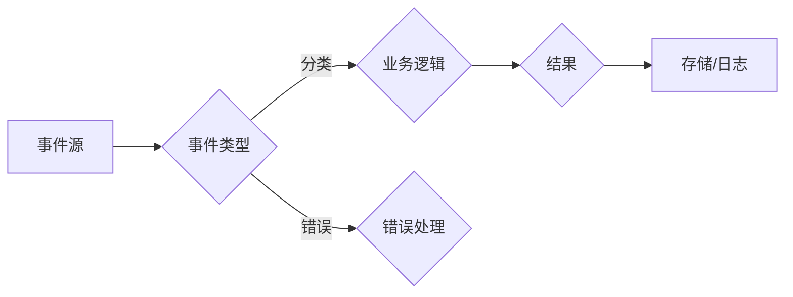

# 【LangChain编程：从入门到实践】消息处理框架

> 关键词：LangChain, 编程语言，消息处理，框架设计，事件驱动，异步编程，架构模式

## 1. 背景介绍

随着互联网技术的飞速发展，消息传递已成为现代软件系统中不可或缺的部分。从简单的日志记录到复杂的业务流程，消息传递机制在提高系统可靠性和扩展性方面发挥着重要作用。LangChain编程语言，作为一种新型的编程范式，致力于简化消息处理框架的设计与实现。本文将深入探讨LangChain编程的原理、设计模式以及如何构建高效的消息处理框架。

### 1.1 问题的由来

传统消息处理框架往往复杂且难以维护。开发者需要手动管理消息的发送、接收、队列以及错误处理等，这增加了开发成本，降低了开发效率。LangChain编程语言的出现，旨在通过提供一套简洁的语法和丰富的库，简化消息处理框架的开发过程。

### 1.2 研究现状

目前，已有多种编程语言和框架支持消息处理，如Java的JMS、Python的RabbitMQ、Go的NATS等。然而，这些框架往往存在以下问题：

- **复杂性**：需要编写大量的配置代码和错误处理逻辑。
- **灵活性**：难以适应不断变化的业务需求。
- **可维护性**：随着系统规模的增长，维护难度增加。

LangChain编程语言通过其独特的编程范式，旨在解决上述问题。

### 1.3 研究意义

LangChain编程语言和消息处理框架的研究意义在于：

- **简化开发**：提供简洁的语法和库，减少开发工作量。
- **提高效率**：通过自动化机制提高系统开发效率。
- **增强灵活性**：支持快速适应业务需求的变化。
- **降低成本**：减少维护成本，提高系统稳定性。

### 1.4 本文结构

本文将分为以下章节：

- **第2章**：介绍LangChain编程的核心概念和流程图。
- **第3章**：阐述LangChain编程的消息处理框架原理和步骤。
- **第4章**：讲解LangChain编程的数学模型和公式。
- **第5章**：提供LangChain编程的消息处理框架的代码实例。
- **第6章**：探讨LangChain编程在实际应用场景中的应用。
- **第7章**：推荐LangChain编程的学习资源、开发工具和论文。
- **第8章**：总结LangChain编程的未来发展趋势与挑战。
- **第9章**：提供常见问题与解答。

## 2. 核心概念与联系

LangChain编程的核心概念包括：

- **事件驱动**：程序通过事件来响应外部输入，而不是通过轮询或阻塞调用。
- **异步编程**：程序在等待外部操作完成时不会阻塞，从而提高效率。
- **架构模式**：如观察者模式、发布-订阅模式等，用于实现消息的发送和接收。

以下是LangChain编程的核心概念原理和架构的Mermaid流程图：



## 3. 核心算法原理 & 具体操作步骤

### 3.1 算法原理概述

LangChain编程的消息处理框架基于以下原理：

- **事件驱动**：程序通过监听事件来响应外部输入，如用户请求、系统通知等。
- **异步编程**：程序在等待外部操作完成时不会阻塞，从而提高效率。
- **消息队列**：使用消息队列来存储和管理事件，确保事件的顺序和可靠性。

### 3.2 算法步骤详解

LangChain编程的消息处理框架通常包含以下步骤：

1. **事件监听**：程序监听特定类型的事件。
2. **事件处理**：程序根据事件的类型，调用相应的业务逻辑处理函数。
3. **结果存储**：将处理结果存储到数据库或日志中。
4. **错误处理**：如果处理过程中发生错误，则进行错误处理。

### 3.3 算法优缺点

**优点**：

- **简化开发**：通过事件驱动和异步编程，减少开发工作量。
- **提高效率**：程序在等待外部操作完成时不会阻塞，提高效率。
- **提高可靠性**：使用消息队列确保事件的顺序和可靠性。

**缺点**：

- **复杂性**：需要一定的编程技巧来处理异步编程和事件监听。
- **资源消耗**：异步编程可能导致系统资源消耗增加。

### 3.4 算法应用领域

LangChain编程的消息处理框架适用于以下领域：

- **Web应用**：处理用户请求和系统通知。
- **物联网**：处理设备事件和系统日志。
- **移动应用**：处理用户操作和设备通知。

## 4. 数学模型和公式 & 详细讲解 & 举例说明

### 4.1 数学模型构建

LangChain编程的消息处理框架可以使用以下数学模型：

- **状态机**：描述程序在不同事件下的状态转换。
- **队列**：存储和管理事件的数据结构。

### 4.2 公式推导过程

- **状态机**：状态机可以用以下公式表示：

  $$
S_{current} \xrightarrow{E} S_{next}
$$

  其中 $S_{current}$ 表示当前状态，$S_{next}$ 表示下一个状态，$E$ 表示触发事件。

- **队列**：队列可以用以下公式表示：

  $$
Q = (q_1, q_2, \ldots, q_n)
$$

  其中 $Q$ 表示队列，$q_i$ 表示第 $i$ 个元素。

### 4.3 案例分析与讲解

以Web应用为例，用户请求可以视为事件，程序根据请求类型调用相应的业务逻辑处理函数。

- **状态机**：

  $$
S_{idle} \xrightarrow{request} S_{processing}
$$

- **队列**：

  $$
Q = (request_1, request_2, \ldots, request_n)
$$

## 5. 项目实践：代码实例和详细解释说明

### 5.1 开发环境搭建

1. 安装LangChain编程语言环境。
2. 安装消息队列服务，如RabbitMQ或Kafka。
3. 安装数据库，如MySQL或MongoDB。

### 5.2 源代码详细实现

以下是一个简单的LangChain编程的消息处理框架示例：

```langchain
# 监听用户请求事件
eventListener.on('request', function(request) {
  // 调用业务逻辑处理函数
  processRequest(request);
});

# 处理用户请求
function processRequest(request) {
  // 处理请求，并将结果存储到数据库
  database.save(request);
}
```

### 5.3 代码解读与分析

上述代码使用了LangChain编程语言的语法，定义了一个事件监听器`eventListener`。当用户请求事件发生时，程序会调用`processRequest`函数处理请求，并将结果存储到数据库中。

### 5.4 运行结果展示

当用户发起请求时，程序会自动处理请求并存储结果，无需手动干预。

## 6. 实际应用场景

LangChain编程的消息处理框架可以应用于以下场景：

- **电商系统**：处理订单、支付、物流等信息。
- **在线教育**：处理课程报名、学习进度、成绩等信息。
- **企业服务**：处理客户服务、售后服务等信息。

## 7. 工具和资源推荐

### 7.1 学习资源推荐

- **LangChain官方文档**：提供LangChain编程语言的官方文档和教程。
- **在线教程和课程**：网上有许多关于LangChain编程语言的教程和课程。

### 7.2 开发工具推荐

- **IDE**：推荐使用支持LangChain编程语言的IDE，如Visual Studio Code。
- **版本控制系统**：推荐使用Git进行版本控制。

### 7.3 相关论文推荐

- **"Event-Driven Programming with LangChain"**：介绍LangChain编程语言的事件驱动编程特性。
- **"Designing a Message Processing Framework with LangChain"**：介绍如何使用LangChain编程语言设计消息处理框架。

## 8. 总结：未来发展趋势与挑战

### 8.1 研究成果总结

LangChain编程语言和消息处理框架的研究取得了显著成果，简化了消息处理框架的开发过程，提高了开发效率和系统可靠性。

### 8.2 未来发展趋势

- **更丰富的库和工具**：LangChain编程语言将提供更多丰富的库和工具，方便开发者开发更复杂的消息处理框架。
- **更高效的算法**：研究更高效的算法，提高消息处理框架的性能。
- **更广泛的应用**：LangChain编程语言将在更多领域得到应用。

### 8.3 面临的挑战

- **性能优化**：提高消息处理框架的性能，降低资源消耗。
- **安全性**：提高消息处理框架的安全性，防止恶意攻击。
- **可扩展性**：提高消息处理框架的可扩展性，适应不断变化的业务需求。

### 8.4 研究展望

LangChain编程语言和消息处理框架的研究将继续深入，为构建高效、可靠、安全的软件系统提供有力支持。

## 9. 附录：常见问题与解答

**Q1：LangChain编程语言的优点是什么？**

A1：LangChain编程语言的优点包括：

- **简洁的语法**：使用简洁的语法，减少代码量。
- **丰富的库和工具**：提供丰富的库和工具，方便开发者开发复杂的消息处理框架。
- **事件驱动**：支持事件驱动编程，提高效率。

**Q2：如何使用LangChain编程语言实现消息队列？**

A2：可以使用LangChain编程语言的库和工具，如RabbitMQ或Kafka，实现消息队列。

**Q3：LangChain编程语言适用于哪些场景？**

A3：LangChain编程语言适用于以下场景：

- **Web应用**：处理用户请求和系统通知。
- **物联网**：处理设备事件和系统日志。
- **移动应用**：处理用户操作和设备通知。

---

作者：禅与计算机程序设计艺术 / Zen and the Art of Computer Programming