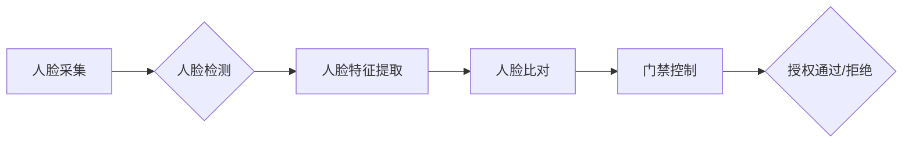

## 基于人脸识别的诃能区门禁系统设计与实现

> 关键词：人脸识别、门禁系统、深度学习、CNN、人脸检测、人脸验证、安全管理

## 1. 背景介绍

随着人工智能技术的快速发展，人脸识别技术已成为一种成熟且广泛应用的安全技术。其在身份验证、安全监控、人流统计等领域展现出巨大的潜力。基于人脸识别的门禁系统作为一种新型的安全管理方案，能够有效提升门禁系统的安全性、便捷性和智能化程度。

传统门禁系统主要依靠卡片、密码等物理手段进行身份验证，存在着卡片遗失、密码泄露等安全隐患，且操作不便。而人脸识别门禁系统则通过识别用户的独特面部特征进行身份验证，具有以下优势：

* **安全性高:** 人脸特征是独一无二的，不易被伪造，能够有效防止非法进入。
* **便捷性强:** 无需携带卡片或输入密码，只需对着摄像头进行人脸识别即可开门，操作简单方便。
* **智能化程度高:** 人脸识别门禁系统可以实现人脸比对、黑名单查询、身份记录等功能，提高门禁系统的智能化水平。

## 2. 核心概念与联系

### 2.1 人脸识别概述

人脸识别技术是指通过分析人脸图像或视频，提取人脸特征，并将其与数据库中的特征进行比对，从而识别出该人的身份的技术。

### 2.2 门禁系统概述

门禁系统是一种用于控制人员进出特定区域的安全管理系统。它通常由门禁控制器、读卡器、门锁、报警系统等组成，通过对人员身份进行验证，控制门锁的开关状态，实现对人员进出的管理。

### 2.3 人脸识别门禁系统架构

基于人脸识别的门禁系统将人脸识别技术与传统门禁系统相结合，构建了一个更加安全、便捷、智能的门禁管理方案。其系统架构主要包括以下几个模块：

* **人脸采集模块:** 负责采集人脸图像或视频数据，通常由摄像头实现。
* **人脸检测模块:** 负责从采集到的图像或视频中检测出人脸区域。
* **人脸特征提取模块:** 负责提取人脸特征，例如人脸关键点、纹理特征等。
* **人脸比对模块:** 负责将提取的人脸特征与数据库中的特征进行比对，判断身份是否匹配。
* **门禁控制模块:** 负责根据人脸比对结果控制门锁的开关状态，实现人员进出控制。

**Mermaid 流程图**



## 3. 核心算法原理 & 具体操作步骤

### 3.1 算法原理概述

人脸识别算法的核心是提取人脸特征并进行比对。常用的算法包括：

* **基于特征点的算法:** 提取人脸关键点，例如眼睛、鼻子、嘴巴等，并根据关键点的位置和关系进行描述。
* **基于纹理特征的算法:** 提取人脸纹理特征，例如皮肤纹理、毛孔特征等，并进行描述。
* **深度学习算法:** 利用深度神经网络自动学习人脸特征，具有更高的识别精度。

### 3.2 算法步骤详解

以深度学习算法为例，人脸识别算法的具体操作步骤如下：

1. **数据预处理:** 收集人脸图像数据，并进行预处理，例如图像裁剪、尺寸调整、灰度化等。
2. **模型训练:** 利用深度学习框架，例如TensorFlow或PyTorch，训练人脸识别模型。训练数据通常包含大量的人脸图像及其对应的标签信息。
3. **特征提取:** 将采集到的图像输入到训练好的模型中，模型会输出人脸特征向量。
4. **人脸比对:** 将提取的人脸特征向量与数据库中的特征向量进行比较，计算相似度。
5. **身份验证:** 根据相似度阈值，判断身份是否匹配。

### 3.3 算法优缺点

**优点:**

* **识别精度高:** 深度学习算法能够自动学习复杂的人脸特征，具有更高的识别精度。
* **鲁棒性强:** 深度学习算法对光照、角度、表情等变化具有较强的鲁棒性。
* **可扩展性强:** 深度学习模型可以根据需要进行微调和扩展。

**缺点:**

* **训练数据量大:** 深度学习算法需要大量的训练数据才能达到较高的识别精度。
* **计算资源需求高:** 深度学习模型训练和推理需要较高的计算资源。
* **隐私安全问题:** 人脸识别技术涉及到个人隐私信息，需要妥善处理隐私安全问题。

### 3.4 算法应用领域

人脸识别算法广泛应用于以下领域：

* **身份验证:** 手机解锁、银行卡验证、机场安检等。
* **安全监控:** 人员追踪、异常行为检测、犯罪识别等。
* **人流统计:** 人群密度分析、商场客流量统计等。
* **医疗诊断:** 病人身份识别、疾病诊断辅助等。

## 4. 数学模型和公式 & 详细讲解 & 举例说明

### 4.1 数学模型构建

人脸识别算法通常基于深度学习模型，例如卷积神经网络（CNN）。CNN模型通过多个卷积层、池化层和全连接层，学习人脸特征。

**卷积层:** 提取图像局部特征。

**池化层:** 降低特征维度，提高模型鲁棒性。

**全连接层:** 将提取的特征进行分类或比对。

### 4.2 公式推导过程

CNN模型的训练过程基于反向传播算法，通过优化模型参数，降低模型预测误差。

**损失函数:** 用于衡量模型预测结果与真实结果之间的差异。常用的损失函数包括交叉熵损失函数和均方误差损失函数。

**梯度下降算法:** 用于更新模型参数，降低损失函数值。

### 4.3 案例分析与讲解

以人脸识别任务为例，假设训练数据包含N张人脸图像，每张图像对应一个类别标签。

**损失函数:**

$$
L = -\frac{1}{N} \sum_{i=1}^{N} y_i \log(p_i) + (1-y_i) \log(1-p_i)
$$

其中：

* $y_i$ 是第i张图像的真实标签（0或1）。
* $p_i$ 是模型预测第i张图像属于目标类别的概率。

**梯度下降算法:**

$$
\theta = \theta - \alpha \nabla L(\theta)
$$

其中：

* $\theta$ 是模型参数。
* $\alpha$ 是学习率。
* $\nabla L(\theta)$ 是损失函数关于模型参数的梯度。

通过迭代更新模型参数，最终得到一个能够准确识别人脸的模型。

## 5. 项目实践：代码实例和详细解释说明

### 5.1 开发环境搭建

* 操作系统: Ubuntu 18.04
* Python 版本: 3.7
* 深度学习框架: TensorFlow 2.0
* 其他依赖库: OpenCV, NumPy, Matplotlib

### 5.2 源代码详细实现

```python
# 人脸识别门禁系统代码示例

import cv2
import tensorflow as tf

# 加载预训练的人脸识别模型
model = tf.keras.models.load_model('face_recognition_model.h5')

# 加载人脸数据库
face_database = {}
#...

# 人脸检测器
face_cascade = cv2.CascadeClassifier('haarcascade_frontalface_default.xml')

# 视频流
cap = cv2.VideoCapture(0)

while True:
    # 读取视频帧
    ret, frame = cap.read()

    # 人脸检测
    gray = cv2.cvtColor(frame, cv2.COLOR_BGR2GRAY)
    faces = face_cascade.detectMultiScale(gray, 1.3, 5)

    # 人脸识别
    for (x, y, w, h) in faces:
        face_roi = frame[y:y+h, x:x+w]
        face_roi = cv2.resize(face_roi, (160, 160))
        face_roi = face_roi / 255.0
        face_features = model.predict(face_roi[None,...])

        # 人脸比对
        best_match = None
        min_distance = float('inf')
        for name, features in face_database.items():
            distance = tf.keras.metrics.cosine_similarity(face_features, features)
            if distance < min_distance:
                best_match = name
                min_distance = distance

        # 显示识别结果
        if best_match:
            cv2.rectangle(frame, (x, y), (x+w, y+h), (0, 255, 0), 2)
            cv2.putText(frame, best_match, (x, y-10), cv2.FONT_HERSHEY_SIMPLEX, 0.9, (0, 255, 0), 2)
        else:
            cv2.rectangle(frame, (x, y), (x+w, y+h), (0, 0, 255), 2)
            cv2.putText(frame, 'Unknown', (x, y-10), cv2.FONT_HERSHEY_SIMPLEX, 0.9, (0, 0, 255), 2)

    # 显示视频帧
    cv2.imshow('Face Recognition', frame)

    # 按键退出
    if cv2.waitKey(1) & 0xFF == ord('q'):
        break

# 释放资源
cap.release()
cv2.destroyAllWindows()
```

### 5.3 代码解读与分析

* **加载预训练模型:** 使用TensorFlow加载预训练的人脸识别模型。
* **加载人脸数据库:** 将已知的人脸特征和对应的身份信息存储在数据库中。
* **人脸检测:** 使用Haar特征分类器检测图像中的人脸区域。
* **人脸识别:** 将检测到的脸部区域进行预处理，输入到预训练模型中，提取人脸特征。
* **人脸比对:** 将提取的人脸特征与数据库中的特征进行比对，计算相似度，判断身份。
* **显示识别结果:** 在视频帧上绘制矩形框和文本，显示识别结果。

### 5.4 运行结果展示

运行代码后，摄像头将捕捉到实时视频流，并识别出视频中的脸部，显示对应的身份信息。

## 6. 实际应用场景

### 6.1 企业门禁管理

基于人脸识别的门禁系统可以用于企业内部人员进出管理，提高门禁系统的安全性，并简化人员进出流程。

### 6.2 学校校园安全

学校可以利用人脸识别门禁系统控制学生和教职工的校园进出，提高校园安全，防止陌生人进入校园。

### 6.3 公共场所安全管理

公共场所，例如机场、车站、博物馆等，可以利用人脸识别门禁系统进行人员身份验证，提高安全管理水平。

### 6.4 未来应用展望

随着人工智能技术的不断发展，人脸识别门禁系统将更加智能化、便捷化和安全化。未来，人脸识别门禁系统可能具备以下功能：

* **多模态生物识别:** 将人脸识别与指纹识别、虹膜识别等其他生物识别技术相结合，提高身份验证的安全性。
* **行为识别:** 通过分析人员的行为特征，例如行走姿势、表情等，识别异常行为，提高安全预警能力。
* **个性化服务:** 根据人员的身份信息，提供个性化的服务，例如自动打开