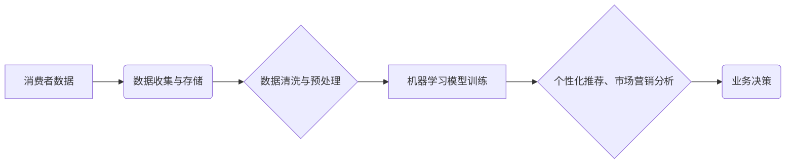

## 大数据环境下消费者数据应用分析与研究

> 关键词：消费者数据、大数据分析、机器学习、数据挖掘、个性化推荐、市场营销、隐私保护

## 1. 背景介绍

随着互联网和移动互联网的快速发展，消费者数据以指数级增长，蕴藏着丰富的商业价值。大数据技术为挖掘和分析这些数据提供了强大的工具，帮助企业深入了解消费者行为、需求和偏好，从而实现精准营销、个性化服务和产品创新。

然而，大数据环境下消费者数据应用也面临着诸多挑战，例如数据质量、数据安全、数据隐私等问题。如何有效地收集、存储、分析和利用消费者数据，同时保障数据安全和隐私，是企业和研究者需要共同面对的课题。

## 2. 核心概念与联系

### 2.1 消费者数据

消费者数据是指与消费者相关的所有信息，包括但不限于：

* **人口统计数据:** 年龄、性别、职业、收入、教育程度等
* **行为数据:** 购物记录、浏览历史、搜索行为、社交互动等
* **偏好数据:** 产品喜好、品牌偏好、兴趣爱好、价值观等
* **地理位置数据:** 消费者所在的位置信息

### 2.2 大数据分析

大数据分析是指利用大数据技术和算法，对海量数据进行处理、挖掘和分析，以发现隐藏的模式、趋势和洞察力。

### 2.3 机器学习

机器学习是人工智能领域的一个重要分支，它通过算法训练模型，使模型能够从数据中学习，并对新的数据进行预测或分类。

**数据流向与应用关系**



## 3. 核心算法原理 & 具体操作步骤

### 3.1 算法原理概述

在消费者数据分析中，常用的算法包括：

* **聚类算法:** 将消费者数据按照相似性进行分组，例如K-means聚类、层次聚类等。
* **分类算法:** 根据已知标签的数据，预测新数据的类别，例如逻辑回归、决策树、支持向量机等。
* **推荐算法:** 根据用户的历史行为和偏好，推荐相关的商品或服务，例如协同过滤、内容过滤等。

### 3.2 算法步骤详解

以协同过滤算法为例，其具体步骤如下：

1. **数据收集:** 收集用户的评分或购买记录数据。
2. **数据预处理:** 处理缺失值、异常值等问题。
3. **用户-商品矩阵构建:** 将用户和商品映射到矩阵中，每个元素表示用户对商品的评分或购买行为。
4. **相似性计算:** 计算用户之间的相似度或商品之间的相似度。
5. **推荐生成:** 根据用户的相似用户或商品的相似商品，生成推荐列表。

### 3.3 算法优缺点

**协同过滤算法**

* **优点:** 可以发现隐含的关联关系，推荐个性化结果。
* **缺点:** 数据稀疏性问题、冷启动问题、数据偏差问题。

### 3.4 算法应用领域

* **电商平台:** 商品推荐、用户画像、精准营销
* **社交媒体:** 内容推荐、用户匹配、广告投放
* **音乐平台:** 音乐推荐、用户分类、个性化播放列表

## 4. 数学模型和公式 & 详细讲解 & 举例说明

### 4.1 数学模型构建

协同过滤算法的核心是计算用户或商品之间的相似度。常用的相似度度量方法包括余弦相似度、皮尔逊相关系数等。

**余弦相似度**

$$
\text{相似度} = \frac{\mathbf{u} \cdot \mathbf{v}}{\|\mathbf{u}\| \|\mathbf{v}\|}
$$

其中：

* $\mathbf{u}$ 和 $\mathbf{v}$ 是两个向量的表示
* $\mathbf{u} \cdot \mathbf{v}$ 是两个向量的点积
* $\|\mathbf{u}\|$ 和 $\|\mathbf{v}\|$ 是两个向量的模长

### 4.2 公式推导过程

余弦相似度的计算公式可以理解为两个向量的夹角的余弦值。夹角越小，余弦值越大，表示两个向量越相似。

### 4.3 案例分析与讲解

假设有两个用户A和B，他们的评分矩阵如下：

| 商品 | A | B |
|---|---|---|
| 1 | 5 | 4 |
| 2 | 3 | 2 |
| 3 | 4 | 5 |
| 4 | 2 | 3 |

我们可以计算A和B之间的余弦相似度：

1. 计算两个向量的点积：

$$
\mathbf{A} \cdot \mathbf{B} = (5 \times 4) + (3 \times 2) + (4 \times 5) + (2 \times 3) = 20 + 6 + 20 + 6 = 52
$$

2. 计算两个向量的模长：

$$
\|\mathbf{A}\| = \sqrt{5^2 + 3^2 + 4^2 + 2^2} = \sqrt{54}
$$

$$
\|\mathbf{B}\| = \sqrt{4^2 + 2^2 + 5^2 + 3^2} = \sqrt{54}
$$

3. 计算余弦相似度：

$$
\text{相似度} = \frac{52}{\sqrt{54} \times \sqrt{54}} = \frac{52}{54} = 0.963
$$

因此，A和B之间的余弦相似度为0.963，说明他们具有较高的相似度。

## 5. 项目实践：代码实例和详细解释说明

### 5.1 开发环境搭建

* Python 3.x
* pandas
* numpy
* scikit-learn

### 5.2 源代码详细实现

```python
import pandas as pd
from sklearn.metrics.pairwise import cosine_similarity

# 加载评分数据
ratings = pd.read_csv('ratings.csv')

# 构建用户-商品矩阵
user_item_matrix = ratings.pivot_table(index='user_id', columns='item_id', values='rating')

# 计算余弦相似度
user_similarity = cosine_similarity(user_item_matrix)

# 获取用户A的相似用户
user_A_id = 1
similar_users = user_similarity[user_A_id].argsort()[:-6:-1]  # 排序获取前5个相似用户

# 生成推荐列表
recommended_items = []
for similar_user in similar_users:
    # 获取相似用户喜欢的商品
    similar_user_ratings = user_item_matrix.loc[similar_user]
    # 找出用户A没有评分过的商品
    unrated_items = similar_user_ratings[user_item_matrix.loc[user_A_id] == 0].index
    # 将相似用户喜欢的商品添加到推荐列表
    recommended_items.extend(unrated_items)

# 去除重复项并排序
recommended_items = list(set(recommended_items))
recommended_items.sort()

# 打印推荐列表
print(f'用户{user_A_id}的推荐商品：{recommended_items}')
```

### 5.3 代码解读与分析

* 首先，我们加载评分数据并构建用户-商品矩阵。
* 然后，我们使用scikit-learn库中的cosine_similarity函数计算用户之间的余弦相似度。
* 接下来，我们获取用户A的相似用户，并根据相似用户的评分生成推荐列表。
* 最后，我们去除重复项并排序推荐列表，并打印出来。

### 5.4 运行结果展示

运行代码后，会输出用户A的推荐商品列表。

## 6. 实际应用场景

### 6.1 电商平台

* **商品推荐:** 根据用户的浏览历史、购买记录和评分，推荐相关的商品。
* **用户画像:** 分析用户的消费行为和偏好，构建用户画像，以便进行精准营销。
* **个性化营销:** 根据用户的兴趣和需求，推送个性化的广告和促销信息。

### 6.2 社交媒体

* **内容推荐:** 根据用户的兴趣和行为，推荐相关的文章、视频和图片。
* **用户匹配:** 根据用户的兴趣和社交关系，推荐潜在的朋友和合作伙伴。
* **广告投放:** 根据用户的兴趣和行为，精准投放广告，提高广告效果。

### 6.3 音乐平台

* **音乐推荐:** 根据用户的听歌历史和偏好，推荐相关的歌曲和音乐人。
* **用户分类:** 将用户按照音乐风格和听歌习惯进行分类，提供个性化服务。
* **个性化播放列表:** 根据用户的喜好，自动生成个性化播放列表。

### 6.4 未来应用展望

随着大数据技术的不断发展，消费者数据应用将更加广泛和深入。未来，我们可以期待以下应用场景：

* **智能客服:** 利用机器学习技术，构建智能客服系统，为消费者提供个性化服务。
* **精准医疗:** 利用消费者健康数据，为患者提供个性化的医疗方案。
* **智慧城市:** 利用消费者数据，优化城市管理和服务。

## 7. 工具和资源推荐

### 7.1 学习资源推荐

* **书籍:**
    * 《大数据分析》
    * 《机器学习实战》
    * 《数据挖掘导论》
* **在线课程:**
    * Coursera
    * edX
    * Udacity

### 7.2 开发工具推荐

* **Python:** 
    * pandas
    * numpy
    * scikit-learn
    * TensorFlow
    * PyTorch
* **Hadoop:** 
    * HDFS
    * MapReduce
* **Spark:** 
    * Spark SQL
    * Spark MLlib

### 7.3 相关论文推荐

* **《Collaborative Filtering for Recommender Systems》**
* **《Matrix Factorization Techniques for Recommender Systems》**
* **《A Survey on Privacy-Preserving Data Mining》**

## 8. 总结：未来发展趋势与挑战

### 8.1 研究成果总结

大数据环境下消费者数据应用取得了显著成果，例如精准推荐、个性化营销、用户画像等。

### 8.2 未来发展趋势

* **人工智能技术的融合:** 将人工智能技术与消费者数据分析相结合，实现更智能、更精准的应用。
* **隐私保护技术的提升:** 加强消费者数据隐私保护技术，保障数据安全和用户权益。
* **跨领域应用的拓展:** 将消费者数据应用拓展到更多领域，例如医疗、教育、金融等。

### 8.3 面临的挑战

* **数据质量问题:** 消费者数据质量参差不齐，需要进行有效的数据清洗和预处理。
* **数据安全问题:** 消费者数据泄露风险较高，需要加强数据安全防护措施。
* **数据隐私问题:** 如何平衡数据利用和用户隐私保护，是一个需要认真思考的问题。

### 8.4 研究展望

未来，消费者数据分析研究将更加注重数据质量、数据安全和数据隐私，同时探索人工智能技术的应用，实现更智能、更精准、更安全的消费者数据应用。

## 9. 附录：常见问题与解答

### 9.1 数据稀疏性问题

数据稀疏性是指用户-商品矩阵中大部分元素都是缺失值，导致算法效果不佳。

**解决方案:**

* 使用矩阵分解技术，例如奇异值分解（SVD）
* 使用协同过滤算法的改进版本，例如基于内容的协同过滤

### 9.2 冷启动问题

冷启动问题是指新用户或新商品缺乏评分或购买记录，导致算法无法进行有效推荐。

**解决方案:**

* 使用用户属性信息或商品特征信息进行推荐
* 利用其他数据源，例如社交网络数据或商品评论数据

### 9.3 数据偏差问题

数据偏差是指数据集中存在