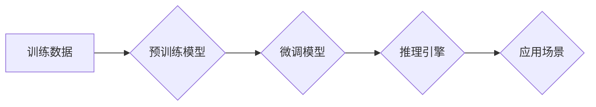

## 大语言模型原理与工程实践：大语言模型推理工程提升规模：模型量 

> 关键词：大语言模型、推理工程、模型规模、参数量、训练方法、应用场景、性能优化

## 1. 背景介绍

近年来，大语言模型（LLM）在自然语言处理领域取得了令人瞩目的成就，例如文本生成、机器翻译、问答系统等。这些模型通常拥有数十亿甚至数千亿个参数，能够学习和理解复杂的语言模式。然而，随着模型规模的不断扩大，其推理效率和部署成本也随之增加，这成为一个亟待解决的挑战。

本篇文章将深入探讨大语言模型的推理工程，重点关注模型规模对推理性能的影响，并介绍一些提升推理效率的策略和技术。

## 2. 核心概念与联系

**2.1  大语言模型 (LLM)**

大语言模型是指参数量巨大、训练数据海量的人工智能模型，能够理解和生成人类语言。它们通常基于Transformer架构，并通过大量的文本数据进行预训练，学习到丰富的语言知识和表示能力。

**2.2  推理工程**

推理工程是指将训练好的机器学习模型部署到实际应用场景中，并使其能够高效、准确地进行预测或生成输出的过程。对于大语言模型来说，推理工程面临着更大的挑战，例如模型规模庞大、计算资源需求高、延迟敏感等。

**2.3  模型规模与推理性能**

模型规模是指模型参数的数量。一般来说，模型规模越大，其表达能力越强，能够学习到更复杂的语言模式，从而提升模型性能。然而，更大的模型也意味着更高的计算成本和内存消耗，这会直接影响推理效率。

**2.4  推理效率**

推理效率是指模型在给定输入时，完成预测或生成输出所需的时间。对于实时应用场景，例如聊天机器人、语音助手等，推理效率至关重要。

**2.5  模型量化**

模型量化是指将模型参数的精度降低，例如将32位浮点数转换为8位整数，从而减少模型的内存占用和计算量。

**Mermaid 流程图**



## 3. 核心算法原理 & 具体操作步骤

**3.1  算法原理概述**

大语言模型的推理过程本质上是基于训练好的模型参数进行预测或生成文本的过程。具体来说，输入文本序列会被转换为词向量表示，然后通过一系列的Transformer层进行编码和解码，最终生成预测的文本序列。

**3.2  算法步骤详解**

1. **词嵌入:** 将输入文本中的每个词转换为低维的词向量表示。
2. **编码器:** 使用多层Transformer编码器对输入文本序列进行编码，学习文本的语义和上下文信息。
3. **解码器:** 使用多层Transformer解码器对编码后的文本序列进行解码，生成预测的文本序列。
4. **输出层:** 将解码器的输出转换为概率分布，预测每个词的下一个词。

**3.3  算法优缺点**

**优点:**

* 表达能力强，能够学习到复杂的语言模式。
* 泛化能力强，能够应用于多种自然语言处理任务。

**缺点:**

* 模型规模庞大，计算资源需求高。
* 推理效率较低，难以满足实时应用场景的需求。

**3.4  算法应用领域**

* 文本生成
* 机器翻译
* 问答系统
* 对话系统
* 代码生成

## 4. 数学模型和公式 & 详细讲解 & 举例说明

**4.1  数学模型构建**

大语言模型通常基于Transformer架构，其核心是注意力机制和多头注意力机制。

**注意力机制:**

注意力机制允许模型关注输入序列中与当前预测词相关的部分，从而提高预测的准确性。

**公式:**

$$
\text{Attention}(Q, K, V) = \text{softmax}\left(\frac{Q K^T}{\sqrt{d_k}}\right) V
$$

其中：

* $Q$：查询矩阵
* $K$：键矩阵
* $V$：值矩阵
* $d_k$：键向量的维度

**多头注意力机制:**

多头注意力机制是将多个注意力机制并行执行，并通过拼接和线性变换的方式融合结果，从而提高模型的表达能力。

**公式:**

$$
\text{MultiHeadAttention}(Q, K, V) = \text{Concat}\left(\text{head}_1(Q, K, V),..., \text{head}_h(Q, K, V)\right) W_o
$$

其中：

* $h$：注意力头的数量
* $\text{head}_i$：第 $i$ 个注意力头
* $W_o$：线性变换矩阵

**4.2  公式推导过程**

注意力机制的公式推导过程可以参考相关文献，例如Vaswani et al. (2017)的论文《Attention Is All You Need》。

**4.3  案例分析与讲解**

在机器翻译任务中，注意力机制可以帮助模型关注源语言中与目标语言词语相关的部分，从而提高翻译的准确性。例如，在翻译句子“The cat sat on the mat”时，注意力机制可以帮助模型关注“cat”和“sat”这两个词语，并将其与目标语言中的“猫”和“坐”这两个词语关联起来。

## 5. 项目实践：代码实例和详细解释说明

**5.1  开发环境搭建**

* Python 3.7+
* PyTorch 1.7+
* CUDA 10.2+

**5.2  源代码详细实现**

```python
import torch
import torch.nn as nn

class Transformer(nn.Module):
    def __init__(self, vocab_size, embedding_dim, num_heads, num_layers):
        super(Transformer, self).__init__()
        self.embedding = nn.Embedding(vocab_size, embedding_dim)
        self.encoder = nn.TransformerEncoder(nn.TransformerEncoderLayer(embedding_dim, num_heads), num_layers)
        self.decoder = nn.TransformerDecoder(nn.TransformerDecoderLayer(embedding_dim, num_heads), num_layers)
        self.linear = nn.Linear(embedding_dim, vocab_size)

    def forward(self, src, tgt):
        src = self.embedding(src)
        tgt = self.embedding(tgt)
        encoder_output = self.encoder(src)
        decoder_output = self.decoder(tgt, encoder_output)
        output = self.linear(decoder_output)
        return output
```

**5.3  代码解读与分析**

* `Transformer` 类定义了一个基于Transformer架构的大语言模型。
* `embedding` 层将输入词语转换为词向量表示。
* `encoder` 和 `decoder` 层分别负责对输入序列和目标序列进行编码和解码。
* `linear` 层将解码器的输出转换为概率分布，预测每个词的下一个词。

**5.4  运行结果展示**

训练好的模型可以用于各种自然语言处理任务，例如文本生成、机器翻译等。

## 6. 实际应用场景

**6.1  聊天机器人**

大语言模型可以用于构建更智能、更自然的聊天机器人，能够理解用户的意图并提供更准确的回复。

**6.2  语音助手**

大语言模型可以用于语音助手，例如Siri、Alexa等，能够理解用户的语音指令并执行相应的操作。

**6.3  文本摘要**

大语言模型可以用于自动生成文本摘要，提取文本的关键信息。

**6.4  代码生成**

大语言模型可以用于自动生成代码，提高开发效率。

**6.5  未来应用展望**

随着大语言模型的不断发展，其应用场景将会更加广泛，例如：

* 个性化教育
* 医疗诊断
* 法律咨询
* 创意写作

## 7. 工具和资源推荐

**7.1  学习资源推荐**

* 《深度学习》 by Ian Goodfellow
* 《Transformer模型详解》 by Jay Alammar
* Hugging Face Transformers 库

**7.2  开发工具推荐**

* PyTorch
* TensorFlow
* CUDA

**7.3  相关论文推荐**

* 《Attention Is All You Need》 by Vaswani et al. (2017)
* 《BERT: Pre-training of Deep Bidirectional Transformers for Language Understanding》 by Devlin et al. (2018)
* 《GPT-3: Language Models are Few-Shot Learners》 by Brown et al. (2020)

## 8. 总结：未来发展趋势与挑战

**8.1  研究成果总结**

近年来，大语言模型取得了显著的进展，在各种自然语言处理任务中取得了优异的性能。

**8.2  未来发展趋势**

* 模型规模的进一步扩大
* 训练数据的多样化和高质量化
* 推理效率的提升
* 模型的可解释性和安全性

**8.3  面临的挑战**

* 计算资源需求高
* 训练数据获取和标注成本高
* 模型的偏见和误差问题
* 模型的安全性问题

**8.4  研究展望**

未来，大语言模型的研究将继续朝着更强大、更安全、更可解释的方向发展。


## 9. 附录：常见问题与解答

**9.1  如何选择合适的模型规模？**

模型规模的选择需要根据具体的应用场景和资源限制进行权衡。一般来说，模型规模越大，性能越好，但计算资源需求也越高。

**9.2  如何提升模型的推理效率？**

一些常见的提升推理效率的策略包括：模型量化、模型剪枝、模型并行等。

**9.3  如何解决模型的偏见和误差问题？**

可以通过使用更丰富、更均衡的数据集进行训练，以及开发新的模型架构和训练方法来解决模型的偏见和误差问题。


作者：禅与计算机程序设计艺术 / Zen and the Art of Computer Programming 
