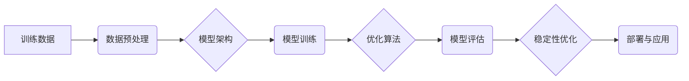

## 大语言模型原理与工程实践：稳定性优化

> 关键词：大语言模型、稳定性、优化、安全、可控性、伦理

### 1. 背景介绍

大语言模型（LLM）近年来取得了令人瞩目的进展，展现出强大的文本生成、翻译、问答和代码编写能力。然而，LLM也面临着诸多挑战，其中稳定性问题尤为突出。

**1.1  LLM稳定性问题**

LLM的稳定性是指模型在不同输入下能够始终输出预期、合理、无偏差的结果的能力。然而，LLM容易受到输入文本的微妙变化而产生不稳定输出，例如：

* **偏见和歧视:** LLM可能在训练数据中学习到社会偏见和歧视，从而在输出中反映出这些偏见。
* **虚假信息生成:** LLM可能生成虚假、不准确或误导性的信息，尤其是在处理复杂或缺乏明确答案的问题时。
* **恶意攻击:** 攻击者可以利用LLM的弱点生成恶意内容，例如垃圾邮件、网络攻击和虚假新闻。

**1.2  稳定性优化的重要性**

LLM的稳定性问题直接影响着其在实际应用中的可信度和安全性。为了确保LLM能够安全、可靠地应用于各种场景，稳定性优化至关重要。

### 2. 核心概念与联系

**2.1  核心概念**

* **训练数据:** LLM的训练数据是其学习和生成文本的基础。数据质量直接影响着模型的稳定性和性能。
* **模型架构:** LLM的模型架构决定了其学习和处理信息的方式。不同的架构具有不同的稳定性特点。
* **优化算法:** 优化算法用于训练LLM，调整模型参数以最小化训练误差。不同的优化算法对模型稳定性有不同的影响。
* **正则化技术:** 正则化技术用于防止模型过拟合，提高其泛化能力和稳定性。

**2.2  架构图**



**2.3  联系分析**

训练数据、模型架构、优化算法和正则化技术相互关联，共同影响着LLM的稳定性。高质量的训练数据是模型稳定性的基础，合适的模型架构和优化算法可以提高模型的泛化能力和鲁棒性，而正则化技术可以防止模型过拟合，增强其稳定性。

### 3. 核心算法原理 & 具体操作步骤

**3.1  算法原理概述**

稳定性优化算法旨在通过调整模型参数或训练过程，提高LLM在不同输入下输出稳定、可靠的结果。常见的稳定性优化算法包括：

* **Dropout:** 在训练过程中随机“屏蔽”一部分神经元，防止模型过拟合，提高其泛化能力。
* **Weight Decay:** 对模型参数进行衰减，防止模型参数过大，提高模型的稳定性。
* **Gradient Clipping:** 对梯度进行裁剪，防止梯度爆炸，提高模型的训练稳定性。
* **Adversarial Training:** 使用对抗样本训练模型，提高模型对恶意攻击的鲁棒性。

**3.2  算法步骤详解**

以Dropout为例，其具体操作步骤如下：

1. 在训练过程中，随机选择一部分神经元进行“屏蔽”，即将其输出设置为0。
2. 对于屏蔽的神经元，其连接的权重不会被更新。
3. 训练完成后，所有神经元的权重都会被使用，但屏蔽过的神经元在测试阶段不会被激活。

**3.3  算法优缺点**

| 算法 | 优点 | 缺点 |
|---|---|---|
| Dropout | 提高泛化能力，防止过拟合 | 训练速度较慢，模型解释性较差 |
| Weight Decay | 稳定模型参数，防止过拟合 | 可能导致模型欠拟合 |
| Gradient Clipping | 避免梯度爆炸，提高训练稳定性 | 可能导致梯度消失，影响模型训练 |
| Adversarial Training | 提高模型对恶意攻击的鲁棒性 | 训练成本高，需要生成对抗样本 |

**3.4  算法应用领域**

稳定性优化算法广泛应用于各种LLM应用场景，例如：

* **文本生成:** 生成高质量、无偏见、无误导性的文本。
* **机器翻译:** 提高翻译质量，减少错误翻译。
* **问答系统:** 提供准确、可靠的答案，避免生成虚假信息。
* **代码生成:** 生成安全、可靠的代码，减少代码错误。

### 4. 数学模型和公式 & 详细讲解 & 举例说明

**4.1  数学模型构建**

LLM的稳定性可以从以下几个方面进行数学建模：

* **损失函数:** 衡量模型预测结果与真实结果之间的差异。常用的损失函数包括交叉熵损失函数和均方误差损失函数。
* **正则化项:** 惩罚模型参数的复杂度，防止模型过拟合。常用的正则化项包括L1正则化和L2正则化。
* **稳定性指标:** 衡量模型在不同输入下输出的稳定性。常用的稳定性指标包括均方根误差（RMSE）和最大绝对误差（MAE）。

**4.2  公式推导过程**

假设模型的损失函数为L，正则化项为R，则模型的总损失函数为：

$$
L_{total} = L + \lambda R
$$

其中，λ为正则化参数。

通过优化总损失函数，可以得到模型参数的最佳值，从而提高模型的稳定性。

**4.3  案例分析与讲解**

以Dropout为例，其数学模型可以表示为：

$$
y = f(W \cdot x + b)
$$

其中，y为模型输出，x为输入，W为权重矩阵，b为偏置向量，f为激活函数。

在训练过程中，Dropout会随机屏蔽一部分神经元，其输出设置为0。因此，模型的输出可以表示为：

$$
y' = f(W' \cdot x + b)
$$

其中，W'为经过Dropout操作后的权重矩阵。

通过Dropout，可以防止模型过拟合，提高其泛化能力和稳定性。

### 5. 项目实践：代码实例和详细解释说明

**5.1  开发环境搭建**

* Python 3.7+
* TensorFlow 2.x 或 PyTorch 1.x
* CUDA 和 cuDNN (可选，用于GPU加速)

**5.2  源代码详细实现**

```python
import tensorflow as tf

# 定义模型架构
model = tf.keras.Sequential([
    tf.keras.layers.Embedding(input_dim=vocab_size, output_dim=embedding_dim),
    tf.keras.layers.LSTM(units=hidden_size),
    tf.keras.layers.Dense(units=vocab_size, activation='softmax')
])

# 定义损失函数和优化器
model.compile(loss='sparse_categorical_crossentropy', optimizer='adam')

# 使用Dropout进行稳定性优化
model.add(tf.keras.layers.Dropout(rate=0.5))

# 训练模型
model.fit(x_train, y_train, epochs=10, batch_size=32)
```

**5.3  代码解读与分析**

* 代码首先定义了模型架构，包括嵌入层、LSTM层和全连接层。
* 然后定义了损失函数和优化器，用于训练模型。
* 在模型架构中添加了Dropout层，其`rate`参数控制了屏蔽神经元的比例。
* 最后使用`fit`方法训练模型，指定训练轮数和批处理大小。

**5.4  运行结果展示**

训练完成后，可以评估模型的性能，例如使用测试集计算准确率、困惑度等指标。

### 6. 实际应用场景

**6.1  文本生成**

LLM可以用于生成各种文本，例如小说、诗歌、新闻报道、代码等。稳定性优化可以确保生成的文本高质量、无偏见、无误导性。

**6.2  机器翻译**

LLM可以用于机器翻译，将一种语言翻译成另一种语言。稳定性优化可以提高翻译质量，减少错误翻译。

**6.3  问答系统**

LLM可以用于构建问答系统，回答用户的问题。稳定性优化可以确保系统提供准确、可靠的答案，避免生成虚假信息。

**6.4  未来应用展望**

随着LLM技术的不断发展，其应用场景将更加广泛，例如：

* **个性化教育:** 根据学生的学习情况提供个性化的学习内容和辅导。
* **医疗诊断:** 辅助医生进行疾病诊断，提高诊断准确率。
* **法律服务:** 帮助律师进行法律研究和案件分析。

### 7. 工具和资源推荐

**7.1  学习资源推荐**

* **书籍:**
    * 《深度学习》
    * 《自然语言处理》
* **在线课程:**
    * Coursera: 深度学习
    * edX: 自然语言处理
* **博客和论坛:**
    * TensorFlow Blog
    * PyTorch Blog
    * Stack Overflow

**7.2  开发工具推荐**

* **TensorFlow:** 开源深度学习框架
* **PyTorch:** 开源深度学习框架
* **Hugging Face Transformers:** 预训练语言模型库

**7.3  相关论文推荐**

* 《Attention Is All You Need》
* 《BERT: Pre-training of Deep Bidirectional Transformers for Language Understanding》
* 《GPT-3: Language Models are Few-Shot Learners》

### 8. 总结：未来发展趋势与挑战

**8.1  研究成果总结**

近年来，LLM取得了显著进展，在文本生成、机器翻译、问答系统等领域展现出强大的能力。稳定性优化算法也取得了重要成果，提高了LLM的可靠性和安全性。

**8.2  未来发展趋势**

* **模型规模和能力的提升:** 未来LLM模型规模将继续扩大，能力将进一步提升。
* **多模态LLM的开发:** 将文本、图像、音频等多种模态信息融合到LLM中，实现更丰富的应用场景。
* **可解释性和透明性的增强:** 研究LLM的决策机制，提高其可解释性和透明性。

**8.3  面临的挑战**

* **数据安全和隐私保护:** LLM的训练需要大量数据，如何保证数据安全和隐私保护是一个重要挑战。
* **模型偏见和歧视:** LLM可能在训练数据中学习到社会偏见和歧视，如何消除模型偏见是一个重要的研究方向。
* **恶意攻击和滥用:** LLM可以被用于生成恶意内容，如何防止模型被恶意攻击和滥用是一个重要的安全问题。

**8.4  研究展望**

未来，LLM研究将继续朝着更安全、更可靠、更可解释的方向发展。


### 9. 附录：常见问题与解答

**9.1  Q: 如何选择合适的稳定性优化算法？**

**A:** 选择合适的稳定性优化算法需要根据具体的应用场景和模型架构进行选择。

**9.2  Q: 如何评估LLM的稳定性？**

**A:** 可以使用RMSE、MAE等指标评估LLM的稳定性。

**9.3  Q: 如何防止LLM被恶意攻击？**

**A:** 可以使用对抗训练、输入过滤等方法防止LLM被恶意攻击。


作者：禅与计算机程序设计艺术 / Zen and the Art of Computer Programming 
