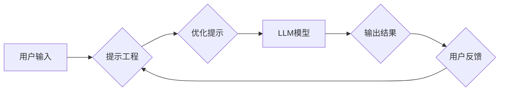

## 大语言模型应用指南：基于提示的工具

> 关键词：大语言模型、LLM、基于提示的工具、文本生成、自然语言处理、AI应用、提示工程、模型微调

### 1. 背景介绍

近年来，大语言模型（LLM）在自然语言处理（NLP）领域取得了令人瞩目的成就。从文本生成、翻译到问答和代码编写，LLM展现出强大的能力，为我们带来了全新的应用场景。然而，LLM的强大功能并非一蹴而就，而是依赖于精心设计的“提示”（Prompt）。

提示可以理解为引导LLM完成特定任务的指令或输入。一个好的提示能够有效地引导LLM生成高质量的输出，而一个糟糕的提示则可能导致LLM产生错误或无关的答案。因此，掌握基于提示的工具和技巧，对于充分利用LLM的潜力至关重要。

### 2. 核心概念与联系

**2.1  大语言模型 (LLM)**

大语言模型是一种基于深度学习的强大人工智能模型，能够理解和生成人类语言。它们通过训练海量文本数据，学习语言的语法、语义和上下文关系。

**2.2  提示 (Prompt)**

提示是引导LLM完成特定任务的输入信息。它可以是一个简单的句子、一个问题、一个代码片段，甚至是一个复杂的场景描述。

**2.3  提示工程 (Prompt Engineering)**

提示工程是指设计和优化提示以获得最佳的LLM输出的过程。它是一个不断迭代和精细化的过程，需要对LLM的特性和任务需求有深入的理解。

**2.4  模型微调 (Fine-tuning)**

模型微调是指在预训练的LLM基础上，针对特定任务进行进一步训练的过程。通过微调，可以提升LLM在特定领域的性能。

**Mermaid 流程图**



### 3. 核心算法原理 & 具体操作步骤

**3.1  算法原理概述**

基于提示的LLM应用主要依赖于Transformer模型的解码器部分。解码器通过自注意力机制学习文本序列之间的关系，并根据输入提示生成相应的输出序列。

**3.2  算法步骤详解**

1. **提示预处理:** 将用户输入的提示进行预处理，例如分词、词嵌入等。
2. **编码:** 将预处理后的提示编码成一个向量表示。
3. **解码:** 使用解码器生成输出序列，每个时间步长根据之前生成的词和提示向量预测下一个词。
4. **解码后处理:** 对生成的输出序列进行后处理，例如去除非法字符、合并重复词等。

**3.3  算法优缺点**

**优点:**

* **灵活性:** 基于提示的LLM应用能够处理各种类型的任务，只需调整提示即可。
* **易于部署:** 不需要复杂的模型训练过程，只需使用预训练的LLM模型即可。
* **可解释性:** 提示可以清晰地表达任务需求，更容易理解模型的输出结果。

**缺点:**

* **提示设计依赖:** 好的提示对于获得高质量的输出至关重要，而设计好的提示需要经验和技巧。
* **输出质量受限:** 由于LLM的训练数据和模型能力有限，输出结果可能存在偏差或错误。
* **计算资源消耗:** 尽管不需要训练模型，但解码过程仍然需要一定的计算资源。

**3.4  算法应用领域**

* **文本生成:** 写作、诗歌创作、故事生成等。
* **机器翻译:** 将文本从一种语言翻译成另一种语言。
* **问答系统:** 回答用户提出的问题。
* **代码生成:** 根据自然语言描述生成代码。
* **对话系统:** 与用户进行自然语言对话。

### 4. 数学模型和公式 & 详细讲解 & 举例说明

**4.1  数学模型构建**

LLM通常基于Transformer模型架构，其解码器部分采用自注意力机制和多层感知机。

**4.2  公式推导过程**

自注意力机制的核心公式为：

$$
Attention(Q, K, V) = \frac{exp(Q \cdot K^T / \sqrt{d_k})}{exp(Q \cdot K^T / \sqrt{d_k})} \cdot V
$$

其中：

* $Q$：查询矩阵
* $K$：键矩阵
* $V$：值矩阵
* $d_k$：键向量的维度

**4.3  案例分析与讲解**

假设我们有一个句子“我爱学习编程”，想要使用自注意力机制计算每个词与其他词之间的注意力权重。

1. 将句子中的每个词转换为词向量，形成查询矩阵 $Q$、键矩阵 $K$ 和值矩阵 $V$。
2. 计算 $Q$ 与 $K$ 的点积，并进行归一化，得到注意力权重矩阵。
3. 将注意力权重矩阵与值矩阵 $V$ 进行加权求和，得到每个词的上下文表示。

### 5. 项目实践：代码实例和详细解释说明

**5.1  开发环境搭建**

使用Python语言和相应的深度学习框架，例如PyTorch或TensorFlow，搭建开发环境。

**5.2  源代码详细实现**

```python
import torch
from transformers import AutoModelForSeq2SeqLM, AutoTokenizer

# 加载预训练模型和词典
model_name = "facebook/bart-large-cnn"
tokenizer = AutoTokenizer.from_pretrained(model_name)
model = AutoModelForSeq2SeqLM.from_pretrained(model_name)

# 定义提示
prompt = "翻译以下句子：Hello, world!"

# 将提示转换为输入序列
input_ids = tokenizer.encode(prompt, return_tensors="pt")

# 使用模型生成输出序列
output = model.generate(input_ids)

# 将输出序列转换为文本
output_text = tokenizer.decode(output[0], skip_special_tokens=True)

# 打印输出结果
print(output_text)
```

**5.3  代码解读与分析**

1. 加载预训练的BART模型和词典。
2. 定义提示文本，并将其转换为模型可识别的输入序列。
3. 使用模型生成输出序列，并将其转换为文本。
4. 打印输出结果。

**5.4  运行结果展示**

```
你好，世界！
```

### 6. 实际应用场景

**6.1  文本生成**

* **内容创作:** 使用LLM生成文章、故事、诗歌等创意内容。
* **营销文案:** 自动生成广告文案、产品描述等营销材料。
* **聊天机器人:** 构建能够进行自然对话的聊天机器人。

**6.2  机器翻译**

* **跨语言沟通:** 将文本从一种语言翻译成另一种语言，促进跨文化交流。
* **国际化网站:** 为不同语言的用户提供网站内容翻译服务。
* **文档翻译:** 将技术文档、法律文件等重要文件进行翻译。

**6.3  问答系统**

* **知识问答:** 构建能够回答用户提出的各种知识性问题的问答系统。
* **搜索引擎:** 使用LLM理解用户搜索意图，提供更精准的搜索结果。
* **客户服务:** 自动回答客户常见问题，提高客户服务效率。

**6.4  未来应用展望**

* **个性化教育:** 根据学生的学习进度和需求，提供个性化的学习内容和辅导。
* **医疗诊断:** 辅助医生进行疾病诊断，提高诊断准确率。
* **法律分析:** 分析法律文件，提供法律建议。

### 7. 工具和资源推荐

**7.1  学习资源推荐**

* **书籍:**
    * 《深度学习》
    * 《自然语言处理》
    * 《Transformer模型详解》
* **在线课程:**
    * Coursera: 自然语言处理
    * edX: 深度学习
    * fast.ai: 深度学习课程

**7.2  开发工具推荐**

* **Python:** 广泛使用的编程语言，用于深度学习开发。
* **PyTorch:** 深度学习框架，提供丰富的工具和库。
* **TensorFlow:** 另一个流行的深度学习框架。
* **Hugging Face Transformers:** 提供预训练的LLM模型和工具。

**7.3  相关论文推荐**

* **Attention Is All You Need:** 提出Transformer模型架构。
* **BERT: Pre-training of Deep Bidirectional Transformers for Language Understanding:** 提出BERT模型，在自然语言理解任务上取得突破性进展。
* **GPT-3: Language Models are Few-Shot Learners:** 提出GPT-3模型，展示了LLM在文本生成方面的强大能力。

### 8. 总结：未来发展趋势与挑战

**8.1  研究成果总结**

近年来，LLM在自然语言处理领域取得了显著进展，展现出强大的文本生成、翻译、问答和代码生成能力。基于提示的工具为LLM应用提供了灵活性和易用性，推动了LLM在各个领域的应用。

**8.2  未来发展趋势**

* **模型规模和能力提升:** 随着计算资源的不断发展，LLM模型规模将继续扩大，能力将进一步提升。
* **多模态LLM:** 将文本、图像、音频等多种模态信息融合到LLM中，实现更丰富的应用场景。
* **可解释性增强:** 研究LLM的决策机制，提高模型的可解释性和透明度。
* **安全性和伦理问题:** 关注LLM的潜在风险，例如生成虚假信息、歧视性输出等，并制定相应的安全和伦理规范。

**8.3  面临的挑战**

* **数据获取和标注:** 训练高质量的LLM模型需要海量的数据，而数据获取和标注成本较高。
* **计算资源消耗:** 训练和部署大型LLM模型需要大量的计算资源，这对于资源有限的机构或个人来说是一个挑战。
* **模型偏见和歧视:** LLM模型可能继承训练数据中的偏见和歧视，需要采取措施 mitigating 这些问题。

**8.4  研究展望**

未来，LLM研究将继续朝着更强大、更安全、更可解释的方向发展。随着技术的不断进步，LLM将为我们带来更多创新应用，改变我们的生活方式。

### 9. 附录：常见问题与解答

**9.1  如何设计好的提示？**

* **明确任务:** 清晰地表达你希望LLM完成的任务。
* **提供上下文:** 给予LLM足够的上下文信息，帮助它理解任务需求。
* **使用示例:** 提供一些示例输入和输出，引导LLM生成符合期望的答案。
* **迭代优化:** 不断尝试不同的提示，并根据LLM的输出进行调整。

**9.2  LLM模型的输出结果是否总是准确的？**

LLM模型的输出结果并非总是准确的，因为它们仍然存在局限性。

* **训练数据偏差:** LLM模型的训练数据可能存在偏差，导致模型生成不准确或有偏见的输出。
* **模型能力有限:** LLM模型的知识和能力有限，无法解决所有问题。
* **提示设计问题:** 如果提示设计不当，LLM可能无法理解任务需求，或生成错误的输出。

**9.3  如何使用LLM模型进行代码生成？**

可以使用LLM模型生成代码，但需要谨慎使用。

* **提供清晰的代码规范:** 给予LLM明确的代码风格和规范要求。
* **测试生成的代码:** 仔细测试生成的代码，确保其正确性和安全性。
* **不要完全依赖LLM:** LLM模型生成的代码可能存在错误，需要人工 review 和修改。


作者：禅与计算机程序设计艺术 / Zen and the Art of Computer Programming 
