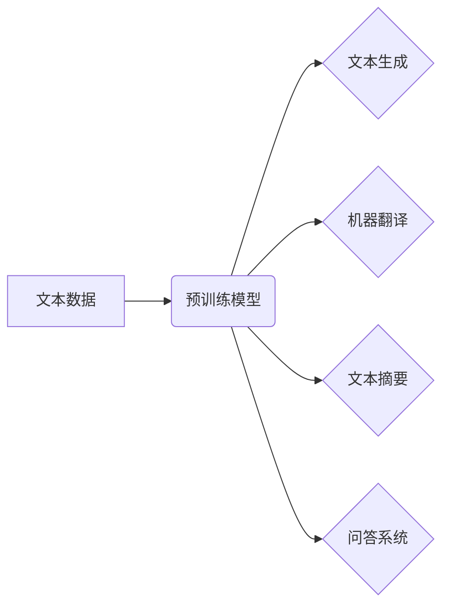

## 大语言模型应用指南：基础

> 关键词：大语言模型、Transformer、自然语言处理、文本生成、机器学习、深度学习

### 1. 背景介绍

近年来，人工智能领域取得了令人瞩目的进展，其中大语言模型（Large Language Models，LLMs）作为一种重要的突破，展现出强大的文本理解和生成能力。LLMs 能够处理和生成人类语言，在自然语言处理（Natural Language Processing，NLP）领域具有广泛的应用前景。

从早期基于统计方法的语言模型到如今深度学习驱动的 Transformer 架构，LLMs 的发展经历了飞速的迭代。随着计算能力的提升和海量数据的积累，LLMs 的规模不断扩大，性能也显著提升。

### 2. 核心概念与联系

**2.1  自然语言处理 (NLP)**

NLP 是人工智能的一个分支，旨在使计算机能够理解、处理和生成人类语言。它涵盖了多种任务，例如文本分类、情感分析、机器翻译、文本摘要等。

**2.2  深度学习 (Deep Learning)**

深度学习是机器学习的一种高级形式，它利用多层神经网络来学习数据中的复杂模式。深度学习在图像识别、语音识别、自然语言处理等领域取得了突破性的进展。

**2.3  Transformer 架构**

Transformer 是近年来深度学习领域的一项重要突破，它是一种专门用于处理序列数据的网络架构。Transformer 采用了自注意力机制（Self-Attention），能够捕捉文本中长距离依赖关系，从而在许多 NLP 任务中取得了优异的性能。

**2.4  大语言模型 (LLM)**

LLM 是基于 Transformer 架构的深度学习模型，其规模庞大，参数数量达到数十亿甚至千亿级别。LLMs 通过训练海量文本数据，学习了语言的语法、语义和上下文关系，从而能够执行各种复杂的语言任务。

**2.5  LLM 应用场景**

LLMs 在多个领域具有广泛的应用场景，例如：

* **文本生成:** 写作、诗歌创作、代码生成等
* **对话系统:** 聊天机器人、虚拟助手等
* **机器翻译:** 自动翻译文本
* **文本摘要:** 生成文本的简短摘要
* **问答系统:** 回答用户提出的问题

**Mermaid 流程图**



### 3. 核心算法原理 & 具体操作步骤

**3.1  算法原理概述**

LLMs 的核心算法是基于 Transformer 架构的深度学习模型。Transformer 模型的核心组件是自注意力机制，它能够捕捉文本中长距离依赖关系，从而提高模型的理解和生成能力。

**3.2  算法步骤详解**

1. **数据预处理:** 将文本数据进行清洗、分词、标记等预处理操作，使其能够被模型理解。
2. **模型训练:** 使用预训练模型或从头训练 Transformer 模型，训练数据通常是海量文本数据。
3. **模型评估:** 使用测试数据评估模型的性能，常用的指标包括准确率、困惑度等。
4. **模型部署:** 将训练好的模型部署到实际应用场景中，例如聊天机器人、文本生成工具等。

**3.3  算法优缺点**

**优点:**

* 能够捕捉文本中的长距离依赖关系
* 在许多 NLP 任务中取得了优异的性能
* 可迁移学习，在不同任务上进行微调

**缺点:**

* 训练成本高，需要大量的计算资源和数据
* 模型参数量大，部署成本较高
* 存在潜在的偏差和误导性问题

**3.4  算法应用领域**

LLMs 的应用领域非常广泛，包括：

* 自然语言理解
* 文本生成
* 机器翻译
* 代码生成
* 聊天机器人
* 问答系统
* 文本摘要
* 情感分析

### 4. 数学模型和公式 & 详细讲解 & 举例说明

**4.1  数学模型构建**

LLMs 通常使用 Transformer 架构，其核心是自注意力机制。自注意力机制可以计算每个词与所有其他词之间的相关性，从而捕捉文本中的长距离依赖关系。

**4.2  公式推导过程**

自注意力机制的计算过程可以概括为以下公式：

$$
Attention(Q, K, V) = softmax(\frac{QK^T}{\sqrt{d_k}})V
$$

其中：

* $Q$：查询矩阵
* $K$：键矩阵
* $V$：值矩阵
* $d_k$：键向量的维度
* $softmax$：softmax 函数

**4.3  案例分析与讲解**

假设我们有一个句子 "The cat sat on the mat"，我们想要计算 "cat" 与其他词之间的相关性。

1. 将句子中的每个词转换为词向量，形成 $Q$、$K$ 和 $V$ 矩阵。
2. 计算 $QK^T$，得到每个词与所有其他词之间的相似度得分。
3. 使用 softmax 函数将得分归一化，得到每个词与所有其他词之间的注意力权重。
4. 将注意力权重与 $V$ 矩阵相乘，得到 "cat" 与所有其他词的加权平均值，即 "cat" 的上下文表示。

### 5. 项目实践：代码实例和详细解释说明

**5.1  开发环境搭建**

* Python 3.7+
* PyTorch 或 TensorFlow
* CUDA 和 cuDNN (可选，用于 GPU 加速)

**5.2  源代码详细实现**

```python
import torch
import torch.nn as nn

class Transformer(nn.Module):
    def __init__(self, vocab_size, embedding_dim, num_heads, num_layers):
        super(Transformer, self).__init__()
        self.embedding = nn.Embedding(vocab_size, embedding_dim)
        self.transformer_layers = nn.ModuleList([
            nn.TransformerEncoderLayer(embedding_dim, num_heads)
            for _ in range(num_layers)
        ])
        self.linear = nn.Linear(embedding_dim, vocab_size)

    def forward(self, x):
        x = self.embedding(x)
        for layer in self.transformer_layers:
            x = layer(x)
        x = self.linear(x)
        return x
```

**5.3  代码解读与分析**

* `__init__` 方法初始化模型参数，包括词嵌入层、Transformer 层和输出层。
* `forward` 方法定义模型的正向传播过程，将输入序列转换为输出序列。

**5.4  运行结果展示**

训练好的模型可以用于各种 NLP 任务，例如文本生成、机器翻译等。

### 6. 实际应用场景

**6.1  文本生成**

LLMs 可以用于生成各种类型的文本，例如小说、诗歌、代码等。例如，OpenAI 的 GPT-3 模型可以生成高质量的文本，并被用于写作辅助、创意内容创作等领域。

**6.2  对话系统**

LLMs 可以构建更自然、更智能的对话系统，例如聊天机器人、虚拟助手等。例如，Google 的 LaMDA 模型能够进行流畅、富有逻辑的对话。

**6.3  机器翻译**

LLMs 可以用于机器翻译，例如将英文翻译成中文。例如，DeepL 使用 LLMs 实现的机器翻译引擎在准确性和流畅度方面表现出色。

**6.4  未来应用展望**

LLMs 的应用前景广阔，未来可能在以下领域发挥更大的作用：

* **个性化教育:** 根据学生的学习进度和需求提供个性化的学习内容和辅导。
* **医疗诊断:** 辅助医生进行疾病诊断，提高诊断准确率。
* **法律服务:** 自动分析法律文件，提供法律建议。
* **科学研究:** 帮助科学家进行数据分析和知识发现。

### 7. 工具和资源推荐

**7.1  学习资源推荐**

* **书籍:**
    * 《深度学习》 by Ian Goodfellow, Yoshua Bengio, and Aaron Courville
    * 《自然语言处理入门》 by Jacob Eisenstein
* **在线课程:**
    * Coursera: Natural Language Processing Specialization
    * Stanford CS224N: Natural Language Processing with Deep Learning

**7.2  开发工具推荐**

* **PyTorch:** https://pytorch.org/
* **TensorFlow:** https://www.tensorflow.org/
* **Hugging Face Transformers:** https://huggingface.co/transformers/

**7.3  相关论文推荐**

* **Attention Is All You Need:** https://arxiv.org/abs/1706.03762
* **BERT: Pre-training of Deep Bidirectional Transformers for Language Understanding:** https://arxiv.org/abs/1810.04805
* **GPT-3: Language Models are Few-Shot Learners:** https://arxiv.org/abs/2005.14165

### 8. 总结：未来发展趋势与挑战

**8.1  研究成果总结**

近年来，LLMs 取得了显著进展，在许多 NLP 任务中取得了优异的性能。Transformer 架构和自注意力机制成为 LLMs 的核心技术，并推动了 NLP 领域的发展。

**8.2  未来发展趋势**

* **模型规模进一步扩大:** LLMs 的规模将继续扩大，参数数量将达到万亿甚至更高。
* **多模态学习:** LLMs 将融合多模态数据，例如文本、图像、音频等，实现更全面的理解和生成能力。
* **可解释性增强:** 研究 LLMs 的决策过程，提高模型的可解释性和透明度。
* **安全性和鲁棒性提升:** 降低 LLMs 的潜在风险，例如生成虚假信息、偏见和歧视。

**8.3  面临的挑战**

* **计算资源需求:** 训练大型 LLMs 需要大量的计算资源，成本较高。
* **数据获取和标注:** LLMs 的训练需要海量高质量数据，数据获取和标注成本高昂。
* **模型可解释性和安全性:** LLMs 的决策过程难以理解，存在潜在的安全风险。
* **伦理问题:** LLMs 的应用可能引发伦理问题，例如虚假信息传播、隐私泄露等。

**8.4  研究展望**

未来，LLMs 将继续朝着更强大、更安全、更可解释的方向发展。研究者将探索新的模型架构、训练方法和应用场景，推动 LLMs 在各个领域的应用。

### 9. 附录：常见问题与解答

**9.1  什么是 LLMs 的 "预训练"?**

预训练是指在大量文本数据上训练 LLMs 的初始模型，使其学习语言的语法、语义和上下文关系。预训练后的模型可以用于各种下游任务，例如文本生成、机器翻译等。

**9.2  LLMs 的训练成本高吗?**

是的，训练大型 LLMs 需要大量的计算资源和时间，成本较高。

**9.3  LLMs 是否存在偏差和误导性问题?**

LLMs 的训练数据可能包含偏差和误导性信息，因此 LLMs 也可能存在这些问题。研究者正在努力解决这些问题，例如通过数据清洗、模型调优等方法。


作者：禅与计算机程序设计艺术 / Zen and the Art of Computer Programming 
