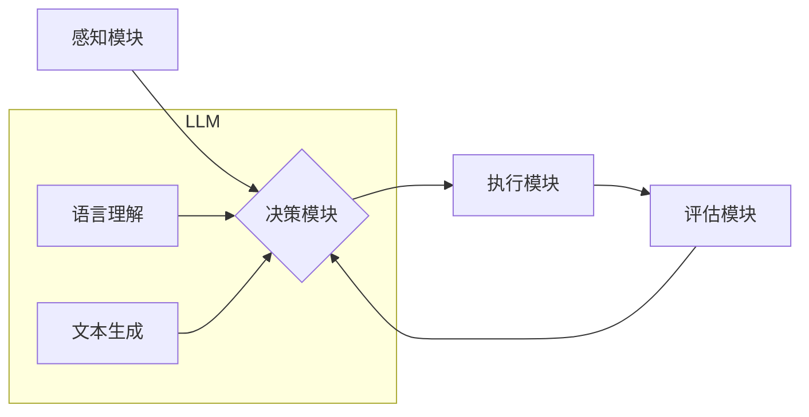

## 大语言模型应用指南：自主Agent系统简介

> 关键词：大语言模型、自主Agent、人工智能、自然语言处理、机器学习、对话系统、应用场景

### 1. 背景介绍

近年来，人工智能（AI）领域取得了令人瞩目的进展，其中大语言模型（LLM）作为一种强大的工具，在自然语言处理（NLP）领域展现出非凡的潜力。LLM 能够理解和生成人类语言，并完成各种复杂的任务，例如文本生成、翻译、问答和代码编写。

自主Agent系统是人工智能领域另一个重要的研究方向，其目标是构建能够自主学习、决策和行动的智能体。传统的Agent系统通常依赖于明确的规则和程序，而自主Agent则更注重学习和适应环境的能力。

将LLM与自主Agent系统相结合，可以构建出更智能、更灵活、更具适应性的AI应用。这种融合能够赋予Agent更强大的语言理解和生成能力，使其能够更好地与人类交互，并更有效地完成任务。

### 2. 核心概念与联系

#### 2.1  大语言模型（LLM）

大语言模型是一种基于深度学习的统计模型，能够处理和生成文本。它通过训练大量的文本数据，学习语言的语法、语义和上下文关系。

#### 2.2  自主Agent系统

自主Agent系统是指能够自主感知环境、设定目标、制定计划、执行行动并评估结果的智能体。它通常由以下几个核心组件组成：

* **感知模块:** 收集环境信息，例如传感器数据、文本信息等。
* **决策模块:** 根据感知到的信息，制定行动计划。
* **执行模块:** 执行决策模块制定的行动。
* **评估模块:** 评估行动的结果，并反馈给决策模块，用于改进后续决策。

#### 2.3  LLM与自主Agent的融合

将LLM与自主Agent系统相结合，可以将LLM的语言理解和生成能力融入到Agent的决策和行动过程中。例如，LLM可以帮助Agent：

* **理解自然语言指令:** Agent可以接收人类用自然语言提出的指令，并通过LLM将其转换为可执行的行动。
* **生成自然语言回复:** Agent可以利用LLM生成自然流畅的文本回复，与人类进行更自然的交互。
* **进行知识推理和决策支持:** LLM可以帮助Agent进行知识推理，并提供决策支持，帮助Agent做出更明智的决策。

**Mermaid 流程图**



### 3. 核心算法原理 & 具体操作步骤

#### 3.1  算法原理概述

LLM与自主Agent融合的核心算法原理主要包括：

* **Transformer模型:** Transformer模型是一种深度学习架构，能够有效地处理序列数据，例如文本。它通过注意力机制学习文本之间的上下文关系，从而实现更准确的语言理解和生成。
* **强化学习:** 强化学习是一种机器学习算法，能够训练Agent在特定环境中学习最优策略。Agent通过与环境交互，获得奖励和惩罚信号，并根据这些信号调整其策略，最终学习到能够最大化奖励的行动策略。

#### 3.2  算法步骤详解

1. **数据预处理:** 收集和预处理训练数据，例如文本清洗、分词、词向量化等。
2. **LLM训练:** 使用Transformer模型训练LLM，使其能够理解和生成人类语言。
3. **环境建模:** 建立Agent所处的环境模型，包括环境状态、Agent的行动空间和奖励函数等。
4. **策略训练:** 使用强化学习算法训练Agent的策略，使其能够在环境中学习最优行动。
5. **Agent交互:** 允许Agent与环境交互，根据其策略执行行动，并获得奖励和惩罚信号。
6. **策略更新:** 根据获得的奖励和惩罚信号，更新Agent的策略，使其能够不断改进其行动策略。

#### 3.3  算法优缺点

**优点:**

* **强大的语言理解和生成能力:** LLM能够理解和生成人类语言，使其能够与人类进行更自然的交互。
* **自主学习和适应能力:** 强化学习算法能够使Agent自主学习和适应环境，使其能够应对更复杂的任务。

**缺点:**

* **训练成本高:** LLM的训练需要大量的计算资源和时间。
* **数据依赖性强:** LLM的性能取决于训练数据的质量和数量。
* **解释性差:** LLM的决策过程通常是黑盒式的，难以解释其决策背后的原因。

#### 3.4  算法应用领域

LLM与自主Agent融合的算法应用领域广泛，例如：

* **聊天机器人:** 开发更智能、更自然的聊天机器人，能够理解人类的意图并提供更精准的回复。
* **虚拟助手:** 创建更强大的虚拟助手，能够帮助用户完成各种任务，例如日程安排、信息查询、设备控制等。
* **游戏AI:** 开发更智能的游戏AI，能够提供更具挑战性和趣味性的游戏体验。
* **自动驾驶:** 帮助自动驾驶系统理解道路环境和交通规则，提高其安全性。

### 4. 数学模型和公式 & 详细讲解 & 举例说明

#### 4.1  数学模型构建

LLM的数学模型通常基于Transformer架构，其核心是注意力机制。注意力机制允许模型关注输入序列中与当前任务最相关的部分，从而提高模型的理解能力。

#### 4.2  公式推导过程

注意力机制的计算公式如下：

$$
Attention(Q, K, V) = softmax(\frac{QK^T}{\sqrt{d_k}})V
$$

其中：

* $Q$：查询矩阵
* $K$：键矩阵
* $V$：值矩阵
* $d_k$：键向量的维度
* $softmax$：softmax函数，用于归一化注意力权重

#### 4.3  案例分析与讲解

例如，在机器翻译任务中，LLM会将源语言句子作为查询矩阵，将目标语言词典作为键矩阵和值矩阵。通过计算注意力权重，模型可以关注源语言句子中与目标语言词语最相关的部分，从而提高翻译的准确性。

### 5. 项目实践：代码实例和详细解释说明

#### 5.1  开发环境搭建

* Python 3.7+
* TensorFlow/PyTorch
* CUDA Toolkit

#### 5.2  源代码详细实现

```python
# 使用HuggingFace Transformers库加载预训练的LLM模型
from transformers import AutoModelForSeq2SeqLM, AutoTokenizer

model_name = "t5-base"
tokenizer = AutoTokenizer.from_pretrained(model_name)
model = AutoModelForSeq2SeqLM.from_pretrained(model_name)

# 输入文本
input_text = "Hello, world!"

# Token化文本
input_ids = tokenizer.encode(input_text, return_tensors="pt")

# 生成文本
output = model.generate(input_ids)

# 解码文本
output_text = tokenizer.decode(output[0], skip_special_tokens=True)

print(output_text)
```

#### 5.3  代码解读与分析

* 该代码首先使用HuggingFace Transformers库加载预训练的LLM模型和词典。
* 然后，将输入文本进行Token化，将其转换为模型可以理解的格式。
* 最后，使用模型生成文本，并将其解码回人类可读的文本。

#### 5.4  运行结果展示

```
Hello, world!
```

### 6. 实际应用场景

#### 6.1  聊天机器人

LLM可以赋予聊天机器人更强大的语言理解和生成能力，使其能够更好地理解用户的意图，并提供更自然、更人性化的回复。例如，可以利用LLM训练一个能够进行对话、回答问题、提供建议的聊天机器人。

#### 6.2  虚拟助手

LLM可以帮助虚拟助手完成更复杂的任务，例如日程安排、信息查询、设备控制等。例如，可以利用LLM训练一个能够理解自然语言指令的虚拟助手，帮助用户管理日程、查找信息、控制智能家居设备等。

#### 6.3  内容创作

LLM可以辅助内容创作，例如生成文章、故事、诗歌等。例如，可以利用LLM生成不同风格的文章，或者根据用户提供的主题和关键词生成创意故事。

#### 6.4  未来应用展望

随着LLM技术的不断发展，其应用场景将会更加广泛。例如，LLM可以应用于教育、医疗、法律等领域，帮助人们更高效地学习、工作和生活。

### 7. 工具和资源推荐

#### 7.1  学习资源推荐

* **HuggingFace Transformers库:** https://huggingface.co/docs/transformers/index
* **OpenAI API:** https://beta.openai.com/docs/api-reference/introduction
* **Stanford NLP Group:** https://nlp.stanford.edu/

#### 7.2  开发工具推荐

* **Jupyter Notebook:** https://jupyter.org/
* **Google Colab:** https://colab.research.google.com/
* **VS Code:** https://code.visualstudio.com/

#### 7.3  相关论文推荐

* **Attention Is All You Need:** https://arxiv.org/abs/1706.03762
* **BERT: Pre-training of Deep Bidirectional Transformers for Language Understanding:** https://arxiv.org/abs/1810.04805
* **GPT-3: Language Models are Few-Shot Learners:** https://arxiv.org/abs/2005.14165

### 8. 总结：未来发展趋势与挑战

#### 8.1  研究成果总结

LLM与自主Agent融合的研究取得了显著进展，为构建更智能、更灵活的AI应用提供了新的思路和方法。

#### 8.2  未来发展趋势

* **模型规模和能力提升:** 未来LLM模型的规模和能力将会进一步提升，能够处理更复杂的任务，并提供更精准的解决方案。
* **多模态融合:** 将LLM与其他模态数据，例如图像、音频、视频等融合，构建更全面的智能体。
* **可解释性增强:** 研究更有效的LLM可解释性方法，使其决策过程更加透明和可理解。

#### 8.3  面临的挑战

* **数据安全和隐私:** LLM的训练需要大量数据，如何保证数据安全和隐私是一个重要的挑战。
* **伦理问题:** LLM的应用可能会带来一些伦理问题，例如偏见、歧视、虚假信息传播等，需要认真思考和解决。
* **计算资源需求:** LLM的训练和部署需要大量的计算资源，如何降低计算成本是一个重要的研究方向。

#### 8.4  研究展望

未来，LLM与自主Agent融合的研究将继续深入，为人工智能的未来发展做出更大的贡献。


### 9. 附录：常见问题与解答

**Q1: LLM与传统规则型Agent相比，有哪些优势？**

**A1:** LLM能够学习和理解语言的复杂性，而传统规则型Agent则需要人工定义大量的规则，难以应对复杂和变化的环境。LLM能够自主学习和适应环境，并提供更灵活、更智能的解决方案。

**Q2: 如何评估LLM与自主Agent融合系统的性能？**

**A2:** 评估LLM与自主Agent融合系统的性能需要考虑多个方面，例如任务完成率、效率、鲁棒性、安全性等。可以使用各种评估指标和测试方法来评估系统的性能，例如奖励函数、准确率、召回率等。

**Q3: LLM与自主Agent融合系统的应用场景有哪些？**

**A3:** LLM与自主Agent融合系统的应用场景非常广泛，例如聊天机器人、虚拟助手、内容创作、自动驾驶、教育、医疗等。

**Q4: 如何解决LLM训练过程中数据安全和隐私问题？**

**A4:** 

* 使用匿名化技术对数据进行处理，保护用户隐私。