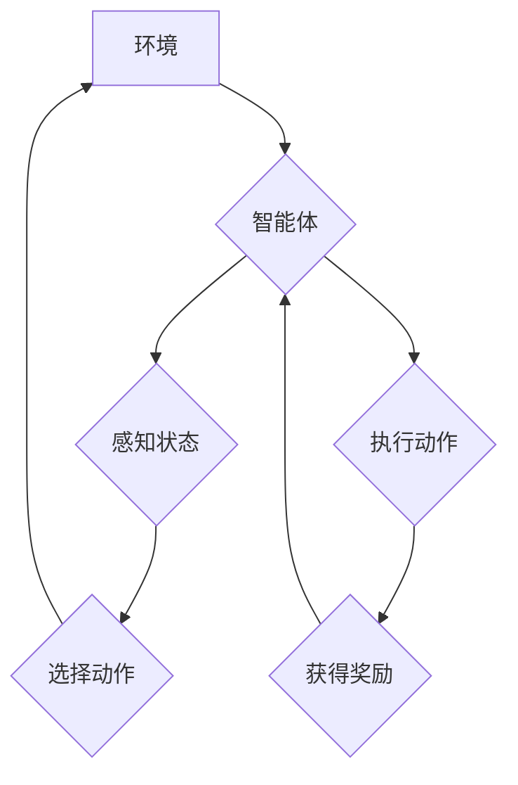

## 深度 Q-learning：在无人驾驶中的应用

> 关键词：深度学习、Q-learning、强化学习、无人驾驶、决策控制、神经网络

## 1. 背景介绍

无人驾驶技术作为人工智能领域的重要应用之一，近年来取得了显著进展。其核心在于实现车辆自主感知环境、决策规划和控制执行的能力。传统的控制方法依赖于预先定义的规则和模型，难以应对复杂多变的实际道路场景。而强化学习（Reinforcement Learning，RL）作为一种能够通过试错学习最优策略的机器学习方法，为无人驾驶提供了新的思路。

深度 Q-learning 作为一种结合深度学习和 Q-learning 的强化学习算法，在无人驾驶领域展现出巨大的潜力。它能够学习驾驶员的行为模式，并通过模拟驾驶场景进行训练，最终实现车辆的自主驾驶能力。

## 2. 核心概念与联系

### 2.1 强化学习

强化学习是一种基于交互学习的机器学习方法。在强化学习中，智能体（agent）与环境（environment）进行交互，通过执行动作（action）来感知环境的变化，并获得奖励（reward）或惩罚（penalty）。智能体的目标是学习一个策略（policy），使得在与环境交互的过程中获得最大的总奖励。

**强化学习的核心要素：**

* **智能体（Agent）：** 决策者，执行动作并感知环境。
* **环境（Environment）：** 智能体所处的外部世界，根据智能体的动作产生新的状态。
* **状态（State）：** 环境的当前描述，例如车辆的位置、速度、周围环境等。
* **动作（Action）：** 智能体可以执行的操作，例如加速、减速、转向等。
* **奖励（Reward）：** 环境对智能体动作的反馈，可以是正向奖励或负向惩罚。
* **策略（Policy）：** 智能体根据当前状态选择动作的规则。

### 2.2 Q-learning

Q-learning 是一种经典的强化学习算法，它通过学习一个 Q 值表来决定在每个状态下执行哪个动作能够获得最大的长期奖励。Q 值表是一个表格，其中每个单元格表示在特定状态下执行特定动作后获得的期望奖励。

**Q-learning 的核心思想：**

* **Q 值更新：** 通过 Bellman 方程更新 Q 值，使得 Q 值表逐渐逼近最优策略。
* **贪婪策略：** 在执行动作时，选择 Q 值最大的动作。

### 2.3 深度 Q-learning

深度 Q-learning 将深度神经网络引入 Q-learning 算法，用于学习复杂的 Q 值函数。深度神经网络能够学习非线性关系，从而能够处理更复杂的驾驶场景。

**深度 Q-learning 的优势：**

* **处理高维数据：** 深度神经网络能够处理高维的输入数据，例如车辆周围的图像信息。
* **学习非线性关系：** 深度神经网络能够学习复杂的非线性关系，从而能够更好地模拟驾驶员的行为模式。

**深度 Q-learning 的挑战：**

* **训练数据需求：** 深度 Q-learning 需要大量的训练数据，才能有效地学习最优策略。
* **训练时间：** 深度 Q-learning 的训练时间通常较长，需要大量的计算资源。

**Mermaid 流程图：**



## 3. 核心算法原理 & 具体操作步骤

### 3.1 算法原理概述

深度 Q-learning 算法的核心是学习一个 Q 函数，该函数将状态和动作映射到期望的长期奖励。深度神经网络被用来逼近 Q 函数，通过训练神经网络，使其能够预测在特定状态下执行特定动作后获得的期望奖励。

**Q 函数的定义：**

$$Q(s, a) = E[\sum_{t=0}^{\infty} \gamma^t r_{t+1}|s_t = s, a_t = a]$$

其中：

* $s$ 表示状态
* $a$ 表示动作
* $r_{t+1}$ 表示在时间步 $t+1$ 获得的奖励
* $\gamma$ 表示折扣因子，控制未来奖励的权重

**目标：**

最大化 Q 函数的值，即找到在每个状态下执行哪个动作能够获得最大的长期奖励。

### 3.2 算法步骤详解

1. **初始化 Q 网络：** 使用深度神经网络初始化 Q 函数，并设置学习率和折扣因子。
2. **环境交互：** 智能体与环境交互，感知当前状态 $s_t$。
3. **选择动作：** 根据当前状态 $s_t$ 和 Q 网络的预测，选择一个动作 $a_t$。可以使用 $\epsilon$-贪婪策略，在一定概率下随机选择动作，以探索不同的策略。
4. **执行动作：** 智能体执行动作 $a_t$，并获得下一个状态 $s_{t+1}$ 和奖励 $r_{t+1}$。
5. **更新 Q 网络：** 使用 Bellman 方程更新 Q 网络的参数，使得 Q 函数的值逐渐逼近最优策略。

$$Q(s_t, a_t) \leftarrow Q(s_t, a_t) + \alpha [r_{t+1} + \gamma \max_{a'} Q(s_{t+1}, a') - Q(s_t, a_t)]$$

其中：

* $\alpha$ 表示学习率
* $\gamma$ 表示折扣因子

6. **重复步骤 2-5：** 重复以上步骤，直到智能体学习到最优策略。

### 3.3 算法优缺点

**优点：**

* **能够处理高维数据：** 深度神经网络能够处理高维的输入数据，例如车辆周围的图像信息。
* **学习非线性关系：** 深度神经网络能够学习复杂的非线性关系，从而能够更好地模拟驾驶员的行为模式。
* **能够学习最优策略：** Q-learning 算法能够学习最优策略，使得智能体在与环境交互的过程中获得最大的总奖励。

**缺点：**

* **训练数据需求：** 深度 Q-learning 需要大量的训练数据，才能有效地学习最优策略。
* **训练时间：** 深度 Q-learning 的训练时间通常较长，需要大量的计算资源。
* **探索与利用的平衡：** 在训练过程中，需要平衡探索新策略和利用已知策略，以找到最优策略。

### 3.4 算法应用领域

深度 Q-learning 算法在无人驾驶领域有着广泛的应用，例如：

* **路径规划：** 学习最优的路径，避免碰撞和提高效率。
* **决策控制：** 学习控制车辆的加速、减速、转向等动作，实现自主驾驶。
* **环境感知：** 学习识别道路标志、交通信号灯、行人等，提高车辆的感知能力。

## 4. 数学模型和公式 & 详细讲解 & 举例说明

### 4.1 数学模型构建

深度 Q-learning 的数学模型基于强化学习的 Bellman 方程。Bellman 方程描述了 Q 值的更新规则，即在特定状态下执行特定动作后获得的期望奖励等于当前 Q 值加上学习率乘以奖励的差异。

### 4.2 公式推导过程

$$Q(s_t, a_t) \leftarrow Q(s_t, a_t) + \alpha [r_{t+1} + \gamma \max_{a'} Q(s_{t+1}, a') - Q(s_t, a_t)]$$

其中：

* $Q(s_t, a_t)$ 表示在状态 $s_t$ 下执行动作 $a_t$ 的 Q 值。
* $r_{t+1}$ 表示在时间步 $t+1$ 获得的奖励。
* $\gamma$ 表示折扣因子，控制未来奖励的权重。
* $\max_{a'} Q(s_{t+1}, a')$ 表示在下一个状态 $s_{t+1}$ 下执行所有动作 $a'$ 的 Q 值中最大的值。
* $\alpha$ 表示学习率，控制 Q 值更新的幅度。

### 4.3 案例分析与讲解

假设一个无人驾驶汽车在十字路口处，需要选择向左转、向右转或直行的动作。

* 状态 $s_t$ 包括汽车的位置、速度、周围车辆的信息等。
* 动作 $a_t$ 包括向左转、向右转或直行。
* 奖励 $r_{t+1}$ 可以根据汽车的安全性和效率来定义，例如安全行驶获得正奖励，发生碰撞获得负奖励。

通过训练深度 Q-learning 模型，汽车可以学习到在每个状态下执行哪个动作能够获得最大的长期奖励，从而实现安全高效的驾驶。

## 5. 项目实践：代码实例和详细解释说明

### 5.1 开发环境搭建

* **操作系统：** Ubuntu 18.04
* **Python 版本：** 3.7
* **深度学习框架：** TensorFlow 2.0
* **其他依赖库：** NumPy, Matplotlib

### 5.2 源代码详细实现

```python
import tensorflow as tf

# 定义 Q 网络
class QNetwork(tf.keras.Model):
    def __init__(self, state_size, action_size):
        super(QNetwork, self).__init__()
        self.dense1 = tf.keras.layers.Dense(64, activation='relu')
        self.dense2 = tf.keras.layers.Dense(32, activation='relu')
        self.output = tf.keras.layers.Dense(action_size)

    def call(self, state):
        x = self.dense1(state)
        x = self.dense2(x)
        return self.output(x)

# 定义训练函数
def train(q_network, state, action, reward, next_state, done):
    with tf.GradientTape() as tape:
        target_q = reward + gamma * tf.reduce_max(q_network(next_state), axis=1)
        q_value = q_network(state)
        loss = tf.keras.losses.mean_squared_error(target_q, q_value[tf.range(tf.shape(state)[0]), action])
    gradients = tape.gradient(loss, q_network.trainable_variables)
    optimizer.apply_gradients(zip(gradients, q_network.trainable_variables))

#... 其他代码...
```

### 5.3 代码解读与分析

* **Q 网络：** 使用深度神经网络构建 Q 网络，用于预测在特定状态下执行特定动作的期望奖励。
* **训练函数：** 使用 Bellman 方程更新 Q 网络的参数，使得 Q 值的值逐渐逼近最优策略。
* **其他代码：** 包括环境交互、动作选择、奖励计算等部分。

### 5.4 运行结果展示

训练完成后，可以将 Q 网络应用于实际场景，例如模拟驾驶场景，评估无人驾驶汽车的性能。

## 6. 实际应用场景

深度 Q-learning 在无人驾驶领域有着广泛的应用场景，例如：

* **自动驾驶汽车：** 学习控制汽车的加速、减速、转向等动作，实现自主驾驶。
* **无人机：** 学习规划飞行路径，避开障碍物，实现自主飞行。
* **机器人导航：** 学习在复杂环境中导航，避开障碍物，到达目标位置。

### 6.4 未来应用展望

随着深度学习技术的不断发展，深度 Q-learning 在无人驾驶领域将有更广泛的应用前景，例如：

* **更复杂的驾驶场景：** 深度 Q-learning 可以学习处理更复杂的驾驶场景，例如拥堵路况、恶劣天气等。
* **更安全的驾驶：** 深度 Q-learning 可以学习更安全的驾驶策略，例如提前预判危险，避免碰撞事故。
* **更智能的驾驶：** 深度 Q-learning 可以学习更智能的驾驶策略，例如根据驾驶员的喜好