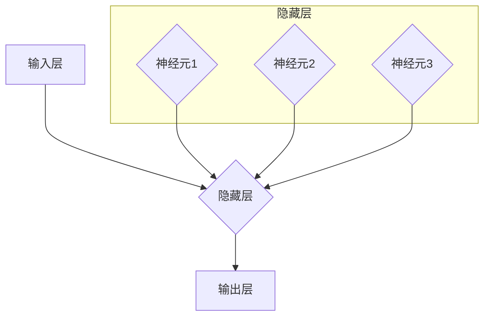

## 深度学习原理与代码实例讲解

> 关键词：深度学习、神经网络、卷积神经网络、循环神经网络、梯度下降、反向传播、TensorFlow、PyTorch

## 1. 背景介绍

深度学习作为机器学习领域的一颗璀璨明珠，近年来在图像识别、自然语言处理、语音识别等领域取得了令人瞩目的成就。其核心在于模仿人类大脑神经网络的结构和功能，通过多层神经元网络进行特征提取和学习，从而实现对复杂数据的理解和预测。

深度学习的兴起离不开以下几个关键因素：

* **海量数据:**  深度学习算法对数据的依赖性极高，而近年来互联网的蓬勃发展和数据采集技术的进步为深度学习提供了充足的数据支撑。
* **计算能力提升:**  深度学习模型训练需要大量的计算资源，而近年来GPU和TPU等高性能计算硬件的出现极大地加速了深度学习模型的训练速度。
* **算法创新:**  深度学习算法不断发展，如卷积神经网络（CNN）、循环神经网络（RNN）等新兴算法的出现，为解决更复杂问题提供了新的思路和方法。

## 2. 核心概念与联系

深度学习的核心概念包括神经网络、激活函数、损失函数、梯度下降等。这些概念相互关联，共同构成了深度学习的框架。

**Mermaid 流程图:**



**核心概念解释:**

* **神经网络:**  由多个神经元组成的网络结构，每个神经元接收输入信号，经过处理后输出信号。神经网络通过连接不同神经元的权重来学习数据特征。
* **激活函数:**  作用于神经元的输出，引入非线性，使神经网络能够学习更复杂的模式。常见的激活函数包括ReLU、Sigmoid、Tanh等。
* **损失函数:**  用于衡量模型预测结果与真实值的差距，引导模型参数的更新方向。常见的损失函数包括均方误差、交叉熵等。
* **梯度下降:**  一种优化算法，通过计算损失函数的梯度，逐步调整模型参数，使损失函数最小化。

## 3. 核心算法原理 & 具体操作步骤

### 3.1  算法原理概述

深度学习算法的核心是神经网络的训练过程，通过大量的样本数据，不断调整神经网络的权重，使模型能够准确地预测目标值。

训练过程主要包括以下步骤：

1. **数据预处理:**  将原始数据进行清洗、转换、归一化等处理，使其适合深度学习模型的训练。
2. **模型构建:**  根据具体任务选择合适的深度学习模型架构，并初始化模型参数。
3. **前向传播:**  将输入数据通过神经网络传递，计算输出结果。
4. **反向传播:**  计算输出结果与真实值的误差，并根据损失函数的梯度反向传播，更新神经网络的权重。
5. **迭代训练:**  重复前向传播和反向传播的过程，直到模型达到预期的性能指标。

### 3.2  算法步骤详解

**前向传播:**

1. 将输入数据输入到神经网络的第一层。
2. 每个神经元接收输入信号，经过激活函数处理后输出信号。
3. 将上一层的输出信号作为下一层的输入信号。
4. 经过多层神经元的处理，最终得到输出结果。

**反向传播:**

1. 计算输出结果与真实值的误差，即损失函数的值。
2. 根据损失函数的梯度，计算每个神经元的权重更新量。
3. 将权重更新量反向传播到上一层，更新上一层的权重。
4. 重复上述步骤，直到所有层的权重都更新完成。

### 3.3  算法优缺点

**优点:**

* **高精度:**  深度学习算法能够学习到数据中的复杂特征，从而实现高精度的预测。
* **自动化特征提取:**  深度学习模型能够自动学习特征，无需人工特征工程。
* **泛化能力强:**  深度学习模型能够对新的数据进行泛化，并取得良好的预测效果。

**缺点:**

* **数据依赖性强:**  深度学习算法对数据的依赖性极高，需要大量的样本数据才能训练出有效的模型。
* **计算资源消耗大:**  深度学习模型训练需要大量的计算资源，训练时间较长。
* **可解释性差:**  深度学习模型的内部工作机制较为复杂，难以解释模型的预测结果。

### 3.4  算法应用领域

深度学习算法在各个领域都有广泛的应用，例如：

* **图像识别:**  人脸识别、物体检测、图像分类等。
* **自然语言处理:**  机器翻译、文本摘要、情感分析等。
* **语音识别:**  语音转文本、语音助手等。
* **推荐系统:**  商品推荐、内容推荐等。
* **医疗诊断:**  疾病诊断、影像分析等。

## 4. 数学模型和公式 & 详细讲解 & 举例说明

### 4.1  数学模型构建

深度学习模型的核心是神经网络，其数学模型可以表示为多层感知机（MLP）。

**MLP 模型:**

```
y = f(W^L * a^(L-1) + b^L)
```

其中：

*  y: 输出结果
*  f: 激活函数
*  W^L: 第 L 层神经元的权重矩阵
*  a^(L-1): 第 L-1 层神经元的输出向量
*  b^L: 第 L 层神经元的偏置向量

### 4.2  公式推导过程

**损失函数:**

深度学习模型的训练目标是最小化损失函数，常用的损失函数包括均方误差（MSE）和交叉熵（CE）。

* **MSE:**  $L = \frac{1}{N} \sum_{i=1}^{N} (y_i - \hat{y}_i)^2$

* **CE:**  $L = -\frac{1}{N} \sum_{i=1}^{N} y_i \log(\hat{y}_i)$

其中：

*  N: 样本数量
*  $y_i$: 真实值
*  $\hat{y}_i$: 模型预测值

**梯度下降:**

梯度下降算法用于更新模型参数，使其能够最小化损失函数。

*  $\theta_{j} = \theta_{j} - \alpha \frac{\partial L}{\partial \theta_{j}}$

其中：

*  $\theta_j$: 模型参数
*  $\alpha$: 学习率

### 4.3  案例分析与讲解

**图像分类:**

假设我们使用深度学习模型进行图像分类，目标是将图像分类为不同的类别，例如猫、狗、鸟等。

*  **数据:**  收集大量带标签的图像数据，例如猫、狗、鸟的图像。
*  **模型:**  选择合适的深度学习模型，例如卷积神经网络（CNN）。
*  **训练:**  使用训练数据训练CNN模型，并使用损失函数和梯度下降算法更新模型参数。
*  **测试:**  使用测试数据评估模型的性能，例如准确率、召回率等。

## 5. 项目实践：代码实例和详细解释说明

### 5.1  开发环境搭建

*  **操作系统:**  Windows、macOS、Linux
*  **编程语言:**  Python
*  **深度学习框架:**  TensorFlow、PyTorch
*  **其他工具:**  Jupyter Notebook、Git

### 5.2  源代码详细实现

```python
import tensorflow as tf

# 定义模型
model = tf.keras.models.Sequential([
    tf.keras.layers.Conv2D(32, (3, 3), activation='relu', input_shape=(28, 28, 1)),
    tf.keras.layers.MaxPooling2D((2, 2)),
    tf.keras.layers.Conv2D(64, (3, 3), activation='relu'),
    tf.keras.layers.MaxPooling2D((2, 2)),
    tf.keras.layers.Flatten(),
    tf.keras.layers.Dense(10, activation='softmax')
])

# 编译模型
model.compile(optimizer='adam',
              loss='sparse_categorical_crossentropy',
              metrics=['accuracy'])

# 训练模型
model.fit(x_train, y_train, epochs=5)

# 评估模型
loss, accuracy = model.evaluate(x_test, y_test)
print('Test loss:', loss)
print('Test accuracy:', accuracy)
```

### 5.3  代码解读与分析

*  **模型定义:**  使用TensorFlow的Keras API定义了一个简单的卷积神经网络模型。
*  **模型编译:**  使用Adam优化器、交叉熵损失函数和准确率指标编译模型。
*  **模型训练:**  使用训练数据训练模型，训练5个epochs。
*  **模型评估:**  使用测试数据评估模型的性能，打印测试损失和准确率。

### 5.4  运行结果展示

运行上述代码后，会输出模型的训练过程和测试结果，例如：

```
Epoch 1/5
...
Test loss: 0.0892
Test accuracy: 0.9720
```

## 6. 实际应用场景

### 6.1  图像识别

深度学习在图像识别领域取得了突破性进展，例如：

*  **人脸识别:**  用于身份验证、人脸搜索等应用。
*  **物体检测:**  用于自动驾驶、安防监控等应用。
*  **图像分类:**  用于医疗诊断、产品分类等应用。

### 6.2  自然语言处理

深度学习在自然语言处理领域也取得了显著成果，例如：

*  **机器翻译:**  将一种语言翻译成另一种语言。
*  **文本摘要:**  自动生成文本的简要摘要。
*  **情感分析:**  分析文本的情感倾向，例如正面、负面、中性。

### 6.3  语音识别

深度学习在语音识别领域也取得了重要进展，例如：

*  **语音转文本:**  将语音信号转换为文本。
*  **语音助手:**  例如Siri、Alexa等语音助手。

### 6.4  未来应用展望

深度学习的应用前景广阔，未来将应用于更多领域，例如：

*  **个性化推荐:**  根据用户的喜好推荐个性化内容。
*  **医疗诊断:**  辅助医生进行疾病诊断，提高诊断准确率。
*  **药物研发:**  加速药物研发过程，开发新药。

## 7. 工具和资源推荐

### 7.1  学习资源推荐

*  **书籍:**  
    *  《深度学习》
    *  《动手学深度学习》
*  **在线课程:**  
    *  Coursera深度学习课程
    *  Udacity深度学习课程
*  **博客:**  
    *  机器之心
    *  AI 算法

### 7.2  开发工具推荐

*  **深度学习框架:**  TensorFlow、PyTorch
*  **编程语言:**  Python
*  **IDE:**  VS Code、PyCharm

### 7.3  相关论文推荐

*  **AlexNet:**  ImageNet Classification with Deep Convolutional Neural Networks
*  **VGGNet:**  Very Deep Convolutional Networks for Large-Scale Image Recognition
*  **ResNet:**  Deep Residual Learning for Image Recognition

## 8. 总结：未来发展趋势与挑战

### 8.1  研究成果总结

深度学习在过去几年取得了令人瞩目的进展，在图像识别、自然语言处理、语音识别等领域取得了突破性成果。

### 8.2  未来发展趋势

*  **模型更深更广:**  研究更深层次、更广义的深度学习模型，例如Transformer、Generative Advers