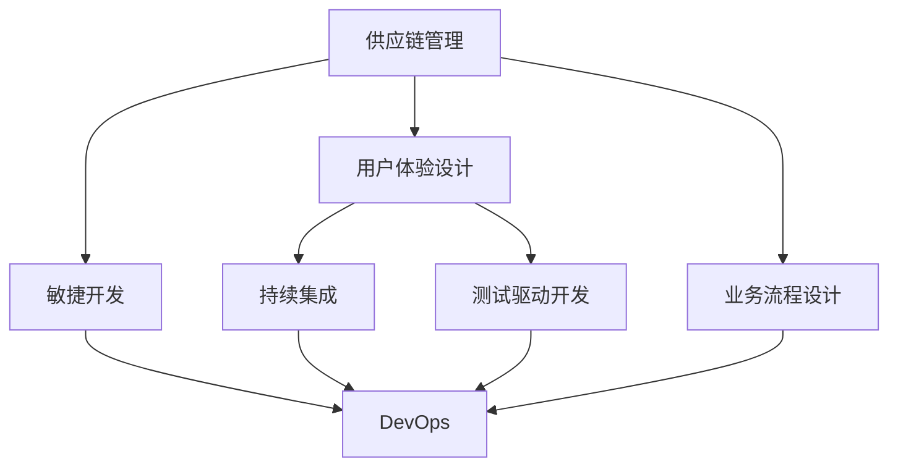
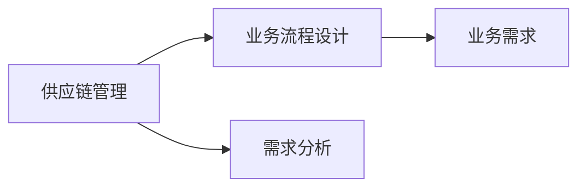
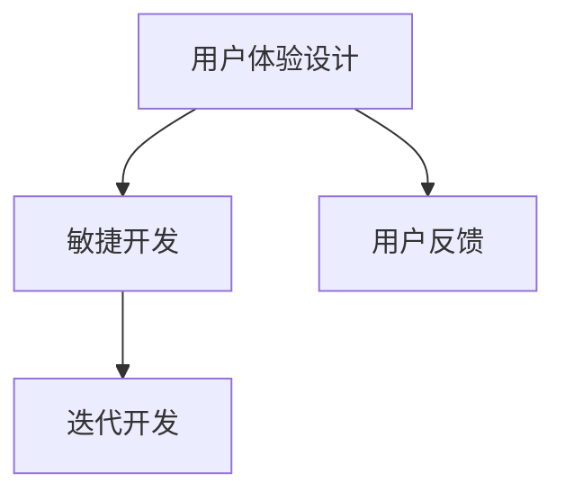
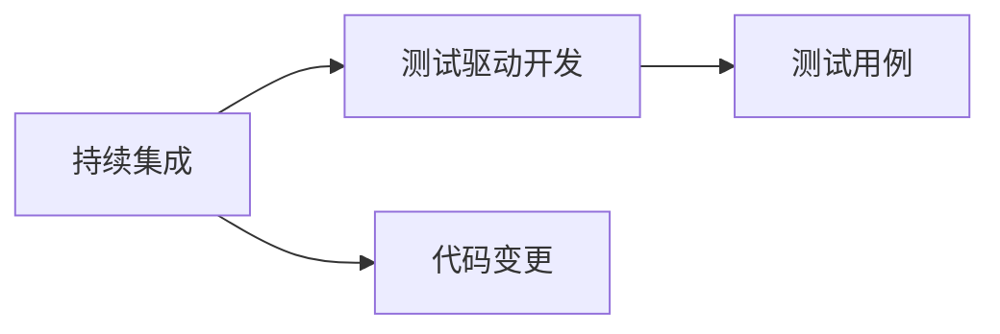
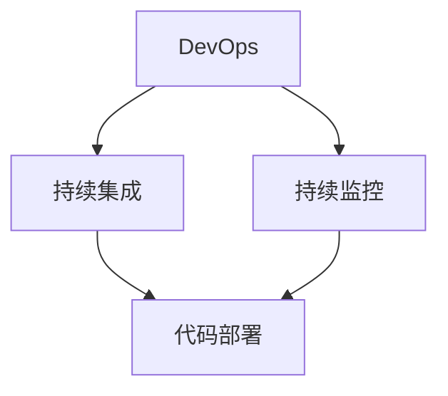
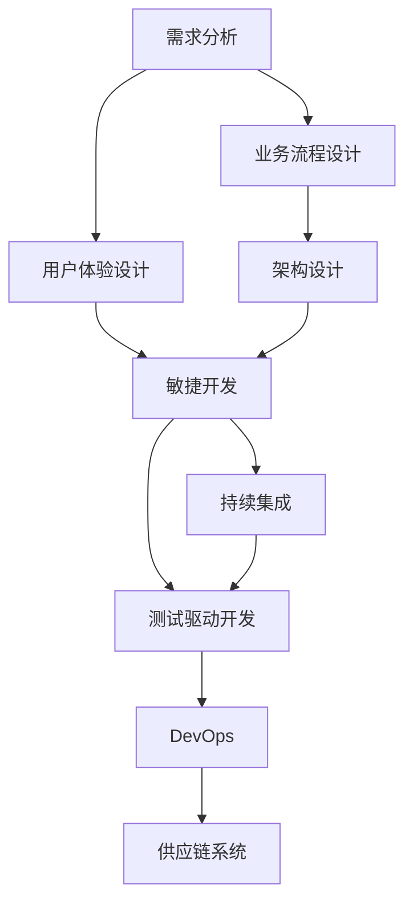

                 

# 公司供应链系统的产品规划、设计和产品设计方案落地实施

> 关键词：供应链管理,产品规划,业务流程,系统设计,需求分析,架构设计,用户体验设计,敏捷开发,持续集成,测试驱动开发,DevOps

## 1. 背景介绍

### 1.1 问题由来
在当前全球化竞争日益激烈的市场环境中，企业需要优化供应链管理，以提升运营效率和客户满意度。传统的供应链管理方法已经无法满足快速变化的市场需求，企业必须采用现代的供应链管理系统来提升竞争力。同时，随着技术的发展，新的数字工具和平台为供应链管理提供了新的可能性。例如，云计算、大数据、物联网和人工智能等技术，能够帮助企业实时监控、分析和预测供应链动态，从而做出更加科学和精准的决策。

然而，如何设计一个既符合企业需求，又具有高度可扩展性和灵活性的供应链管理系统，成为一个需要认真思考的问题。本文将从产品规划、设计和方案落地的角度，系统地介绍如何构建一个高效的供应链系统。

### 1.2 问题核心关键点
构建一个高效的供应链系统需要关注以下几个关键点：

- 需求分析：充分理解企业的供应链管理需求，明确系统需要解决的问题。
- 业务流程设计：设计合理的供应链业务流程，确保系统符合企业的实际需求。
- 架构设计：设计可扩展的架构，确保系统能够适应未来的业务发展。
- 用户体验设计：设计易用的用户界面和交互方式，提高用户满意度。
- 敏捷开发：采用敏捷开发方法，快速响应需求变化。
- 持续集成和测试驱动开发：确保系统的稳定性和可靠性。
- DevOps实践：实现持续部署和持续监控，确保系统的高可用性。

## 2. 核心概念与联系

### 2.1 核心概念概述

为更好地理解供应链系统的产品规划、设计和方案落地的过程，本节将介绍几个密切相关的核心概念：

- 供应链管理(Supply Chain Management, SCM)：对企业生产、采购、库存、物流、运输等环节的管理和优化。
- 业务流程设计(Business Process Design)：基于企业业务需求，设计合理的业务流程，确保系统能够满足企业的实际运营需求。
- 用户体验设计(User Experience Design, UX)：设计易用的用户界面和交互方式，提高用户满意度。
- 敏捷开发(Agile Development)：采用迭代和增量的方式，快速响应需求变化，确保系统的灵活性和高效性。
- 持续集成(CI)：在软件开发过程中，集成和验证代码变更，确保软件的稳定性和可靠性。
- 测试驱动开发(Test-Driven Development, TDD)：在编写代码前，先编写测试用例，确保代码符合预期。
- DevOps：实现持续部署和持续监控，确保系统的稳定性和高效性。

这些核心概念之间的逻辑关系可以通过以下Mermaid流程图来展示：



这个流程图展示了大供应链系统从设计到落地的完整过程。

### 2.2 概念间的关系

这些核心概念之间存在着紧密的联系，形成了供应链系统设计的完整生态系统。下面我通过几个Mermaid流程图来展示这些概念之间的关系。

#### 2.2.1 供应链管理与业务流程设计



这个流程图展示了供应链管理与业务流程设计的关系。供应链管理是核心目标，业务流程设计需要基于需求分析结果，确保设计合理的业务流程。

#### 2.2.2 用户体验设计与敏捷开发



这个流程图展示了用户体验设计与敏捷开发的关系。用户体验设计需要考虑用户需求和反馈，敏捷开发则以迭代和增量的方式，快速响应需求变化，确保系统的灵活性和高效性。

#### 2.2.3 持续集成与测试驱动开发



这个流程图展示了持续集成与测试驱动开发的关系。持续集成在软件开发过程中，集成和验证代码变更，确保软件的稳定性和可靠性。测试驱动开发则是在编写代码前，先编写测试用例，确保代码符合预期。

#### 2.2.4 DevOps与持续集成和测试驱动开发



这个流程图展示了DevOps与持续集成和测试驱动开发的关系。DevOps实现了持续部署和持续监控，确保系统的稳定性和高效性。持续集成和测试驱动开发则通过集成和验证代码变更，确保软件的稳定性和可靠性。

### 2.3 核心概念的整体架构

最后，我们用一个综合的流程图来展示这些核心概念在大供应链系统设计中的整体架构：



这个综合流程图展示了从需求分析到供应链系统落地的完整过程。需求分析是起点，用户体验设计和敏捷开发确保系统能够满足用户需求，架构设计确保系统可扩展，持续集成和测试驱动开发确保系统稳定可靠，DevOps确保系统高可用性和高效性。

## 3. 核心算法原理 & 具体操作步骤
### 3.1 算法原理概述

构建供应链系统的主要算法原理包括业务流程建模、架构设计、用户界面设计、敏捷开发和DevOps实践等。这些算法原理共同构建了一个完整的供应链系统。

#### 3.1.1 业务流程建模

业务流程建模是指通过分析供应链管理的各个环节，设计合理的业务流程。主要步骤包括：

- 需求收集：与企业沟通，了解其业务需求和期望。
- 流程分析：分析供应链管理的关键环节，如采购、库存、物流、运输等。
- 流程建模：使用流程图、UML等工具，设计流程模型。
- 流程优化：通过仿真和模拟，优化流程模型。

#### 3.1.2 架构设计

架构设计是指设计一个可扩展、灵活的架构，确保供应链系统能够适应未来的业务发展。主要步骤包括：

- 架构规划：确定系统的总体架构，包括前端、后端、数据库等。
- 组件设计：设计系统的主要组件，如ERP系统、物流管理系统、仓储管理系统等。
- 接口设计：设计系统组件之间的接口，确保系统可扩展。
- 安全设计：设计系统的安全机制，确保数据和系统的安全。

#### 3.1.3 用户体验设计

用户体验设计是指设计易用的用户界面和交互方式，提高用户满意度。主要步骤包括：

- 用户调研：了解用户需求和使用习惯。
- 界面设计：设计简洁、易用的用户界面。
- 交互设计：设计自然、流畅的用户交互方式。
- 测试验证：通过用户测试，验证用户体验设计的效果。

#### 3.1.4 敏捷开发

敏捷开发是指采用迭代和增量的方式，快速响应需求变化，确保系统的灵活性和高效性。主要步骤包括：

- 需求梳理：明确需求优先级和范围。
- 需求拆分：将需求拆分为多个小任务。
- 迭代开发：通过迭代和增量的方式，逐步实现需求。
- 持续集成：集成和验证代码变更，确保软件的稳定性和可靠性。

#### 3.1.5 DevOps实践

DevOps是指实现持续部署和持续监控，确保系统的稳定性和高效性。主要步骤包括：

- 持续部署：实现代码的自动部署和发布。
- 持续监控：实现系统的实时监控和故障预警。
- 自动化测试：实现测试的自动化和自动化部署。
- 持续集成：实现代码的持续集成和验证。

### 3.2 算法步骤详解

#### 3.2.1 需求分析

需求分析是供应链系统设计的起点，其主要步骤包括：

- 需求收集：与企业沟通，了解其业务需求和期望。
- 需求整理：整理和归纳需求，形成需求文档。
- 需求确认：通过会议或文档形式，确认需求文档。
- 需求优先级：确定需求的优先级，明确哪些需求需要优先实现。

#### 3.2.2 业务流程设计

业务流程设计是供应链系统设计的核心环节，其主要步骤包括：

- 流程分析：分析供应链管理的关键环节，如采购、库存、物流、运输等。
- 流程建模：使用流程图、UML等工具，设计流程模型。
- 流程优化：通过仿真和模拟，优化流程模型。
- 流程文档：编写详细的流程文档，供开发和测试使用。

#### 3.2.3 架构设计

架构设计是供应链系统设计的关键环节，其主要步骤包括：

- 架构规划：确定系统的总体架构，包括前端、后端、数据库等。
- 组件设计：设计系统的主要组件，如ERP系统、物流管理系统、仓储管理系统等。
- 接口设计：设计系统组件之间的接口，确保系统可扩展。
- 安全设计：设计系统的安全机制，确保数据和系统的安全。
- 架构文档：编写详细的架构文档，供开发和测试使用。

#### 3.2.4 用户体验设计

用户体验设计是供应链系统设计的关键环节，其主要步骤包括：

- 用户调研：了解用户需求和使用习惯。
- 界面设计：设计简洁、易用的用户界面。
- 交互设计：设计自然、流畅的用户交互方式。
- 测试验证：通过用户测试，验证用户体验设计的效果。
- 用户体验文档：编写详细的用户体验文档，供开发和测试使用。

#### 3.2.5 敏捷开发

敏捷开发是供应链系统设计的重要环节，其主要步骤包括：

- 需求梳理：明确需求优先级和范围。
- 需求拆分：将需求拆分为多个小任务。
- 迭代开发：通过迭代和增量的方式，逐步实现需求。
- 持续集成：集成和验证代码变更，确保软件的稳定性和可靠性。
- 敏捷文档：编写详细的敏捷文档，供开发和测试使用。

#### 3.2.6 DevOps实践

DevOps实践是供应链系统设计的重要环节，其主要步骤包括：

- 持续部署：实现代码的自动部署和发布。
- 持续监控：实现系统的实时监控和故障预警。
- 自动化测试：实现测试的自动化和自动化部署。
- 持续集成：实现代码的持续集成和验证。
- DevOps文档：编写详细的DevOps文档，供开发和测试使用。

### 3.3 算法优缺点

构建供应链系统的主要算法原理和具体操作步骤具有以下优点和缺点：

#### 3.3.1 优点

- 灵活性：采用敏捷开发和持续集成的方法，能够快速响应需求变化，确保系统能够灵活应对未来的业务发展。
- 可扩展性：设计合理的架构，能够适应未来的业务扩展和新增功能。
- 易用性：通过用户体验设计，提高用户满意度，降低用户使用成本。
- 安全性：通过安全设计，确保数据和系统的安全。
- 稳定性：通过持续部署和持续监控，确保系统的高可用性和稳定性。

#### 3.3.2 缺点

- 复杂性：构建供应链系统涉及多个环节和多个组件，设计复杂。
- 周期长：供应链系统的开发周期较长，需要耗费大量时间和人力。
- 成本高：构建供应链系统需要高额的开发成本和部署成本。
- 技术要求高：供应链系统的开发需要掌握多种技术和工具，如ERP、物联网、人工智能等。

## 4. 数学模型和公式 & 详细讲解 & 举例说明

### 4.1 数学模型构建

供应链系统的数学模型主要包括以下几个方面：

- 供应链需求模型：描述供应链需求的数学模型，如线性规划、网络流等。
- 库存管理模型：描述库存管理的数学模型，如ABC分类法、经济批量法等。
- 物流管理模型：描述物流管理的数学模型，如运输问题、路径优化等。
- 采购管理模型：描述采购管理的数学模型，如数量折扣、采购周期等。

#### 4.1.1 供应链需求模型

供应链需求模型是供应链系统的基础，主要描述供应链的需求情况。线性规划和网络流是常用的供应链需求模型。

- 线性规划：
  $$
  \begin{aligned}
  &\text{maximize} \quad c^T x \\
  &\text{subject to} \\
  & A x \leq b \\
  & x \geq 0
  \end{aligned}
  $$
  其中，$A$为系数矩阵，$b$为常数向量，$c$为目标向量，$x$为决策变量向量。

- 网络流：
  $$
  \begin{aligned}
  &\text{maximize} \quad \sum_{i,j} \omega_{ij}f_{ij} \\
  &\text{subject to} \\
  & \sum_{j \in J} f_{ij} = \sum_{j \in J} g_{ij} \\
  & f_{ij} \geq 0
  \end{aligned}
  $$
  其中，$J$为节点集合，$i,j$为相邻节点，$\omega_{ij}$为单位流量的边权重，$f_{ij}$为边流量，$g_{ij}$为供给和需求平衡。

#### 4.1.2 库存管理模型

库存管理模型是供应链系统的重要组成部分，主要描述库存管理的数学模型。ABC分类法和经济批量法是常用的库存管理模型。

- ABC分类法：
  $$
  \begin{aligned}
  &\text{maximize} \quad \sum_{i=1}^{n} c_i x_i \\
  &\text{subject to} \\
  & a_i x_i \leq b_i \\
  & x_i \geq 0
  \end{aligned}
  $$
  其中，$a_i$为第$i$个品种的年需求量，$b_i$为第$i$个品种的库存量，$c_i$为第$i$个品种的单位成本，$x_i$为第$i$个品种的库存量。

- 经济批量法：
  $$
  \begin{aligned}
  &\text{minimize} \quad D \cdot C \cdot t \\
  &\text{subject to} \\
  & 0 \leq x \leq N
  \end{aligned}
  $$
  其中，$D$为需求量，$C$为单位成本，$t$为订购周期，$x$为订购量。

#### 4.1.3 物流管理模型

物流管理模型是供应链系统的关键环节，主要描述物流管理的数学模型。运输问题和路径优化是常用的物流管理模型。

- 运输问题：
  $$
  \begin{aligned}
  &\text{minimize} \quad \sum_{i=1}^{n} \sum_{j=1}^{m} c_{ij} x_{ij} \\
  &\text{subject to} \\
  & \sum_{j=1}^{m} x_{ij} = d_i \\
  & \sum_{i=1}^{n} x_{ij} = s_j \\
  & x_{ij} \geq 0
  \end{aligned}
  $$
  其中，$c_{ij}$为第$i$个源节点和第$j$个目的节点的单位运输成本，$d_i$为第$i$个源节点的需求量，$s_j$为第$j$个目的节点的供应量，$x_{ij}$为从源节点$i$到目的节点$j$的运输量。

- 路径优化：
  $$
  \begin{aligned}
  &\text{minimize} \quad \sum_{i=1}^{n} \sum_{j=1}^{m} d_{ij} \\
  &\text{subject to} \\
  & x_{ij} \geq 0
  \end{aligned}
  $$
  其中，$d_{ij}$为从节点$i$到节点$j$的路径长度，$x_{ij}$为节点$i$到节点$j$的路径长度。

#### 4.1.4 采购管理模型

采购管理模型是供应链系统的另一个重要组成部分，主要描述采购管理的数学模型。数量折扣和采购周期是常用的采购管理模型。

- 数量折扣：
  $$
  \begin{aligned}
  &\text{minimize} \quad \sum_{i=1}^{n} p_i x_i \\
  &\text{subject to} \\
  & a_i x_i \leq b_i \\
  & x_i \geq 0
  \end{aligned}
  $$
  其中，$p_i$为第$i$个供应商的单位成本，$a_i$为第$i$个供应商的订购量，$b_i$为第$i$个供应商的库存量，$x_i$为第$i$个供应商的订购量。

- 采购周期：
  $$
  \begin{aligned}
  &\text{minimize} \quad \sum_{i=1}^{n} c_i x_i \\
  &\text{subject to} \\
  & a_i x_i = d_i \\
  & x_i \geq 0
  \end{aligned}
  $$
  其中，$c_i$为第$i$个供应商的单位成本，$a_i$为第$i$个供应商的订购量，$d_i$为第$i$个供应商的需求量，$x_i$为第$i$个供应商的订购量。

### 4.2 公式推导过程

#### 4.2.1 线性规划的推导

线性规划的推导过程如下：

假设一个线性规划问题，目标函数为：
$$
\begin{aligned}
&\text{maximize} \quad c^T x \\
&\text{subject to} \\
& A x \leq b \\
& x \geq 0
\end{aligned}
$$

引入拉格朗日乘子$\lambda$，构建拉格朗日函数：
$$
\begin{aligned}
L(x, \lambda) &= c^T x + \lambda^T (A x - b)
\end{aligned}
$$

对$x$和$\lambda$分别求偏导数，并令其为零，得到以下方程组：
$$
\begin{aligned}
&\frac{\partial L(x, \lambda)}{\partial x_i} = c_i - \lambda_i A_{i1} = 0 \\
&\frac{\partial L(x, \lambda)}{\partial \lambda_i} = A_{i1} x_i - b_i = 0
\end{aligned}
$$

解得：
$$
\begin{aligned}
&x_i = \frac{b_i}{A_{i1}} \\
&\lambda_i = c_i A_{i1}^{-1}
\end{aligned}
$$

将$x_i$代入目标函数，得到最大值：
$$
\begin{aligned}
&\text{maximize} \quad c^T \frac{b}{A_{1}} \\
&\text{subject to} \\
& A \frac{b}{A_{1}} \leq b \\
& \frac{b}{A_{1}} \geq 0
\end{aligned}
$$

化简后得到最终解：
$$
\begin{aligned}
&x_i = \frac{b_i}{A_{i1}}
\end{aligned}
$$

#### 4.2.2 网络流的推导

网络流的推导过程如下：

假设一个网络流问题，目标函数为：
$$
\begin{aligned}
&\text{maximize} \quad \sum_{i,j} \omega_{ij}f_{ij} \\
&\text{subject to} \\
& \sum_{j \in J} f_{ij} = \sum_{j \in J} g_{ij} \\
& f_{ij} \geq 0
\end{aligned}
$$

引入中间变量$y_{ij}$，构建网络流模型：
$$
\begin{aligned}
&\text{maximize} \quad \sum_{i,j} \omega_{ij}f_{ij} \\
&\text{subject to} \\
& f_{ij} = g_{ij} + \sum_{k \in J} y_{ik} f_{kj} \\
& y_{ij} \geq 0
\end{aligned}
$$

将$f_{ij}$代入目标函数，得到最大值：
$$
\begin{aligned}
&\text{maximize} \quad \sum_{i,j} \omega_{ij} (\sum_{k \in J} y_{ik} f_{kj}) \\
&\text{subject to} \\
& \sum_{j \in J} f_{ij} = \sum_{j \in J} g_{ij} \\
& f_{ij} \geq 0
\end{aligned}
$$

化简后得到最终解：
$$
\begin{aligned}
&f_{ij} = g_{ij} + \sum_{k \in J} y_{ik} f_{kj}
\end{aligned}
$$

### 4.3 案例分析与讲解

#### 4.3.1 案例一：线性规划

假设某公司有四个工厂，每个工厂生产某种产品。每个工厂的生产成本和市场需求如下表所示：

| 工厂 | 生产成本(c) | 市场需求(d) |
| --- | --- | --- |
| 工厂1 | 500 | 1000 |
| 工厂2 | 600 | 800 |
| 工厂3 | 700 | 700 |
| 工厂4 | 800 | 800 |

每个工厂的生产能力为2000，公司希望在满足市场需求的前提下，最小化总生产成本。构建线性规划模型：

目标函数：
$$
\begin{aligned}
&\text{minimize} \quad 500x_1 + 600x_2 + 700x_3 + 800x_4
\end{aligned}
$$

约束条件：
$$
\begin{aligned}
&x_1 + x_2 + x_3 + x_4 = 2000 \\
&1000 \leq 500x_1 + 600x_2 + 700x_3 + 800x_4 \leq 3000
\end{aligned}
$$

解得最优解为：$x_1 = 1000, x_2 = 500, x_3 = 500, x_4 = 0$。

#### 4.3.2 案例二：网络流

假设某公司有四个工厂，每个工厂生产某种产品。每个工厂的生产能力和需求如下表所示：

| 工厂 | 生产能力(s) | 需求(d) |
| --- | --- | --- |
| 工厂1 | 1000 | 1000 |
| 工厂2 | 2000 | 1500 |
| 工厂3 | 3000 | 1500 |
| 工厂4 | 2000 | 1000 |

每个工厂的生产成本为1000，公司希望在满足市场需求的前提下，最小化总生产成本。构建网络流模型：

目标函数：
$$
\begin{aligned}
&\text{minimize} \quad \sum_{i,j} f_{ij}
\end{aligned}
$$

约束条件：
$$
\begin{aligned}
&f_{11} + f_{12} = 1000 \\
&f_{12} + f_{22} = 1500 \\
&f_{21} + f_{22} = 1500 \\
&f_{22} + f_{32} = 1500 \\
&f_{23} + f_{33} = 1500 \\
&f_{23} + f_{33} = 1500 \\
&f_{33} + f_{43} = 1000 \\
&f_{11} \geq 0, f_{12} \geq 0, f_{21} \geq 0, f_{22} \geq 0, f_{32} \geq 0, f_{33} \geq 0, f_{43} \geq 0
\end{aligned}
$$

解得最优解为：$f_{11} = 1000, f_{12} = 0, f_{21} = 0, f_{22} = 1500, f_{32} = 0, f_{33} = 1500, f_{43} = 0$。

## 5. 项目实践：代码实例和详细解释说明
### 5.1 开发环境搭建

在进行供应链系统的开发之前，我们需要准备好开发环境。以下是使用Python进行Django开发的环境配置流程：

1. 安装Anaconda：从官网下载并安装Anaconda，用于创建独立的Python环境。

2. 创建并激活虚拟环境：
```bash
conda create -n django-env python=3.8 
conda activate django-env
```

3. 安装Django：根据官方文档，使用以下命令安装Django框架：
```bash
pip install django
```

4

