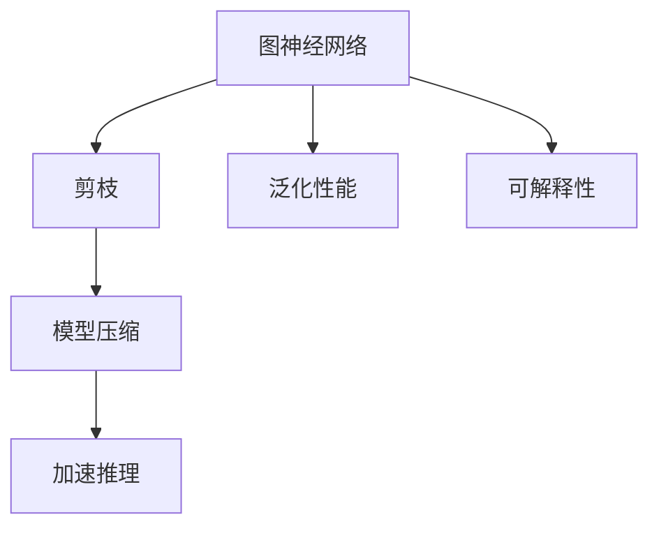
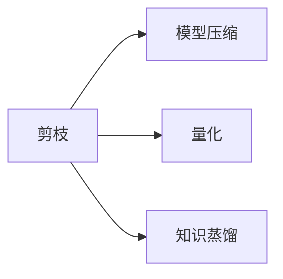
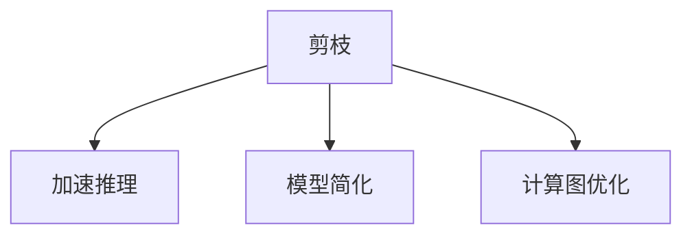
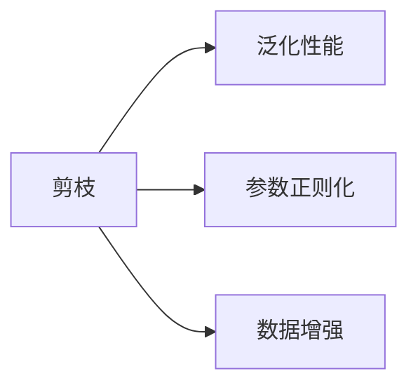
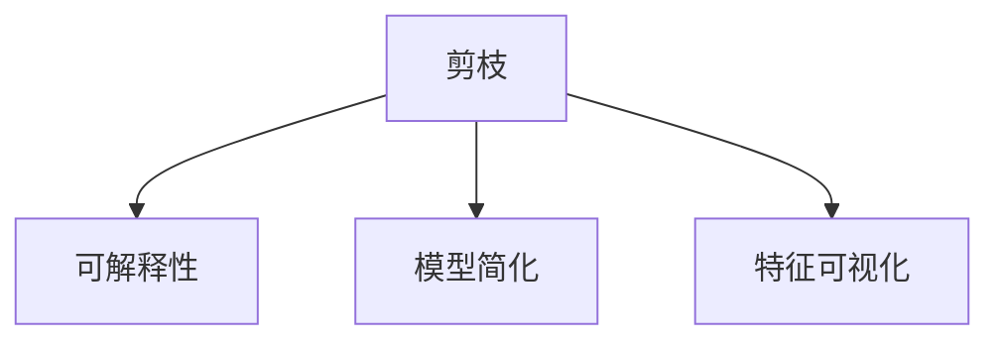
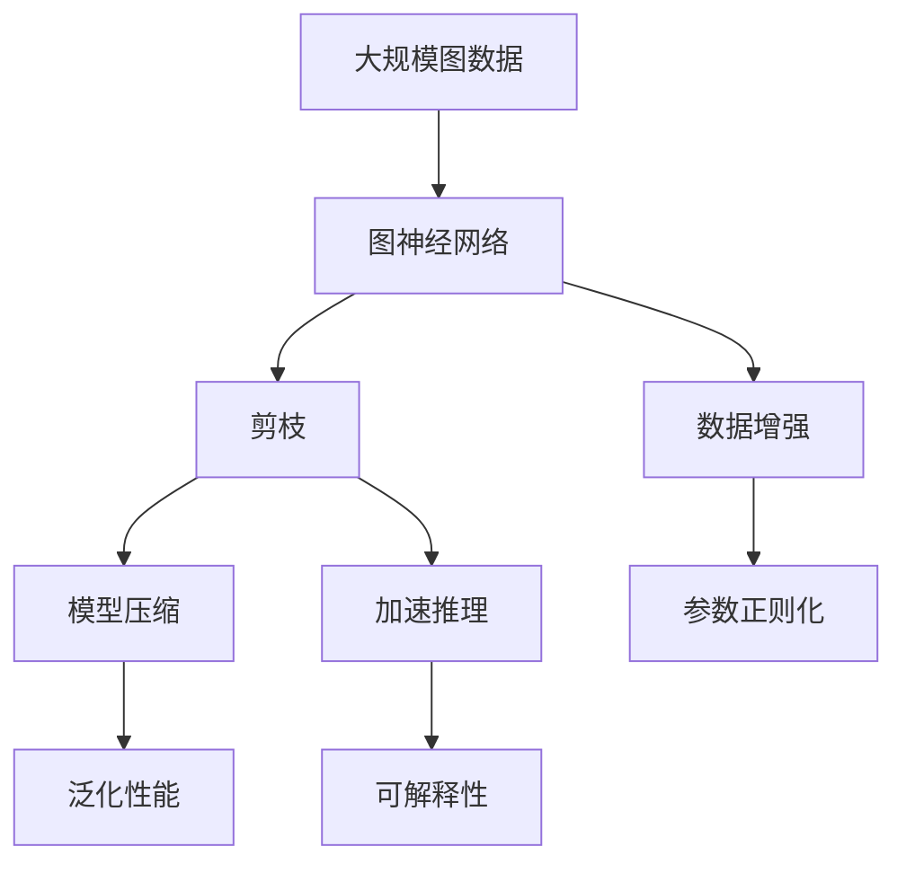

                 

# 剪枝技术在图神经网络中的创新应用

> 关键词：图神经网络,剪枝,模型压缩,加速推理,深度学习

## 1. 背景介绍

### 1.1 问题由来
图神经网络(Graph Neural Network, GNN)作为深度学习的一种重要分支，近年来在图数据处理和分析中取得了显著进展。然而，由于图神经网络的参数量往往非常庞大，导致其推理计算开销巨大，难以在实际应用中大范围部署。同时，模型过大的参数量也导致其在大规模数据上的泛化性能不足，容易出现过拟合。为此，亟需研究一种方法，既能降低图神经网络的参数量，又能提升模型的推理速度和泛化能力。

剪枝技术应运而生，成为提升图神经网络性能的一种重要手段。剪枝技术通过对网络中冗余连接或参数的移除，减少模型的计算量，进而加快推理速度，并提高模型的泛化性能。

### 1.2 问题核心关键点
剪枝技术的核心在于如何判断哪些连接或参数是无用的，并安全地将其删除。传统的剪枝方法包括结构剪枝、权值剪枝和混合剪枝。结构剪枝关注于移除网络中的冗余结构，而权值剪枝则是移除网络中的冗余权值。混合剪枝综合考虑结构和权值，对整个网络进行优化。

在图神经网络中，剪枝技术面临的挑战更多。由于图神经网络是基于图结构建模的，传统的剪枝方法无法直接应用。为此，研究者们开发了专门的图神经网络剪枝方法，以提升模型的性能。

### 1.3 问题研究意义
剪枝技术在图神经网络中的应用，对于降低计算开销、提高模型泛化性能、加速模型推理具有重要意义：

1. 降低计算开销：剪枝技术可以大幅减少图神经网络的参数量，从而降低其计算量，减少内存占用，提升推理速度。这对于需要大规模推理的图处理任务尤为重要。
2. 提高模型泛化性能：剪枝技术通过移除冗余连接和权值，有助于防止模型过拟合，提升其在未见过的数据上的泛化能力。
3. 加速模型推理：剪枝后的模型推理计算量减少，响应时间缩短，可以实时处理大量数据流，提高系统的实时性。
4. 提升资源利用率：剪枝技术有助于在有限的计算资源下，训练出性能更优的图神经网络模型。
5. 优化模型结构：剪枝技术帮助识别并移除网络中的冗余结构，优化模型架构，提升模型的可解释性和可理解性。

## 2. 核心概念与联系

### 2.1 核心概念概述

为更好地理解剪枝技术在图神经网络中的应用，本节将介绍几个密切相关的核心概念：

- 图神经网络(Graph Neural Network, GNN)：以图结构为输入，利用图卷积、图注意力等机制进行图结构建模的深度学习模型。图神经网络常用于节点分类、图分类、图生成等任务。

- 剪枝(Pruning)：通过移除网络中冗余的连接或参数，减少计算量和存储需求，提升模型性能的技术。

- 模型压缩(Model Compression)：通过剪枝、量化、知识蒸馏等技术，优化模型结构，降低模型复杂度，提升模型性能。

- 加速推理(Accelerated Inference)：通过剪枝和优化模型结构，提升模型的推理速度和计算效率。

- 泛化性能(Generalization Performance)：模型在新数据上的表现能力，是衡量模型泛化能力的重要指标。

- 可解释性(Explainability)：模型的决策过程、特征重要性等信息，对于理解模型行为、提高模型可信度具有重要意义。

这些核心概念之间的逻辑关系可以通过以下Mermaid流程图来展示：



这个流程图展示了大语言模型微调过程中各个核心概念的关系和作用：

1. 图神经网络通过深度学习技术，对图数据进行建模和处理。
2. 剪枝技术通过对网络结构或权值的优化，减少计算量和存储需求。
3. 模型压缩通过剪枝、量化等手段，进一步优化模型结构，提升模型性能。
4. 加速推理通过剪枝和优化，提升模型的推理速度和计算效率。
5. 泛化性能是衡量模型在新数据上的表现能力，是模型优化的重要指标。
6. 可解释性帮助理解模型行为和决策逻辑，提升模型的可信度。

### 2.2 概念间的关系

这些核心概念之间存在着紧密的联系，形成了图神经网络优化的完整生态系统。下面我通过几个Mermaid流程图来展示这些概念之间的关系。

#### 2.2.1 剪枝与模型压缩的关系



这个流程图展示了剪枝与模型压缩的关系。剪枝通过减少网络中的冗余连接或参数，从而减少计算量和存储需求。量化、知识蒸馏等模型压缩技术进一步优化模型结构，提升模型性能。

#### 2.2.2 剪枝与加速推理的关系



这个流程图展示了剪枝与加速推理的关系。剪枝通过移除冗余连接和参数，减少计算量和存储需求，从而提升模型的推理速度和计算效率。模型简化、计算图优化等进一步提升推理性能。

#### 2.2.3 剪枝与泛化性能的关系



这个流程图展示了剪枝与泛化性能的关系。剪枝通过移除冗余连接和参数，减少计算量和存储需求，从而提升模型的泛化性能。参数正则化、数据增强等进一步提升模型的泛化能力。

#### 2.2.4 剪枝与可解释性的关系



这个流程图展示了剪枝与可解释性的关系。剪枝通过移除冗余连接和参数，简化模型结构，有助于提高模型的可解释性和可理解性。特征可视化等进一步提升模型的可解释性。

### 2.3 核心概念的整体架构

最后，我们用一个综合的流程图来展示这些核心概念在图神经网络剪枝过程中的整体架构：



这个综合流程图展示了从图数据输入到剪枝、模型压缩、加速推理、泛化性能提升和可解释性增强的完整过程。图神经网络首先在大规模图数据上进行建模，然后通过剪枝技术优化网络结构，降低计算量和存储需求。模型压缩技术进一步优化模型结构，提升模型性能。加速推理通过剪枝和优化，提升模型的推理速度和计算效率。泛化性能和可解释性评估指标，帮助评估模型的优劣，并指导进一步优化。

## 3. 核心算法原理 & 具体操作步骤
### 3.1 算法原理概述

剪枝技术在图神经网络中的应用，主要分为结构剪枝和权值剪枝。结构剪枝关注于移除冗余的图结构，而权值剪枝则关注于移除冗余的连接权值。以下重点介绍权值剪枝技术。

图神经网络中的权值剪枝，核心思想是通过评估每个连接的贡献度，判断哪些连接是冗余的，并将其移除。剪枝过程中，需要注意以下几点：

1. 连接贡献度评估：需要设计一种评估方法，量化每个连接的贡献度。
2. 连接移除策略：根据评估结果，确定哪些连接应该被移除。
3. 连接移除安全：需要确保移除连接后，模型性能不会显著下降。

### 3.2 算法步骤详解

剪枝技术的步骤包括评估连接贡献度、确定连接移除策略和实施连接移除。下面详细介绍每一步的具体操作：

**Step 1: 连接贡献度评估**

连接贡献度评估是剪枝技术的核心。常用的评估方法包括：

1. 特征重要性评估：通过计算连接对节点特征变化的影响程度，评估连接的贡献度。
2. 激活度评估：通过计算连接对节点激活度的影响程度，评估连接的贡献度。
3. 梯度贡献评估：通过计算连接对损失函数梯度的影响程度，评估连接的贡献度。

**Step 2: 连接移除策略**

确定连接移除策略的目的是确保剪枝后模型的性能不会显著下降。常用的策略包括：

1. 固定阈值策略：根据连接贡献度评估结果，设置一个固定的阈值，将贡献度低于阈值的连接移除。
2. 递减阈值策略：根据连接贡献度评估结果，设置一个递减的阈值，逐步移除贡献度较低的连接。
3. 动态调整策略：根据训练过程中的性能变化，动态调整连接移除的阈值，确保剪枝后模型的性能不会显著下降。

**Step 3: 实施连接移除**

实施连接移除的过程，需要保证剪枝后模型的性能不会显著下降。常用的方法包括：

1. 逐步剪枝：逐步移除贡献度较低的连接，确保剪枝过程的可控性和渐进性。
2. 网络备份：在剪枝前，备份原始网络的权重和结构，以便在剪枝后性能下降时，可以迅速恢复。
3. 剪枝后优化：在剪枝后，对模型进行进一步的优化，如权重更新、结构优化等，确保剪枝后的模型性能。

### 3.3 算法优缺点

剪枝技术在图神经网络中的应用，具有以下优点：

1. 减少计算量：通过移除冗余连接和权值，大幅减少计算量和内存占用，提升推理速度。
2. 提升泛化能力：移除冗余连接和权值，有助于防止模型过拟合，提升模型在新数据上的泛化能力。
3. 优化资源利用：在有限的计算资源下，通过剪枝技术，训练出性能更优的图神经网络模型。

然而，剪枝技术也存在一些缺点：

1. 剪枝过程复杂：需要评估连接贡献度，确定连接移除策略，实施连接移除，操作复杂。
2. 性能下降风险：移除冗余连接和权值，存在模型性能下降的风险，需要仔细控制。
3. 计算开销大：剪枝过程中，需要进行大量的计算和评估，计算开销较大。

### 3.4 算法应用领域

剪枝技术在图神经网络中的应用，主要包括以下几个领域：

1. 节点分类：在节点分类任务中，剪枝技术可以提升模型的准确性和推理速度。
2. 图分类：在图分类任务中，剪枝技术可以降低计算开销，提高分类精度。
3. 图生成：在图生成任务中，剪枝技术可以提升生成速度，降低计算开销。
4. 社交网络分析：在社交网络分析任务中，剪枝技术可以提升分析速度，降低存储需求。
5. 推荐系统：在推荐系统中，剪枝技术可以提升推荐速度，优化推荐结果。

## 4. 数学模型和公式 & 详细讲解 & 举例说明

### 4.1 数学模型构建

剪枝技术的数学模型构建，主要包括连接贡献度评估、连接移除策略和实施连接移除等步骤。下面详细介绍各个步骤的数学模型。

**连接贡献度评估**

假设图神经网络中的节点数为 $n$，连接数为 $m$。定义连接权重矩阵为 $\mathbf{W} \in \mathbb{R}^{n \times n}$，其中 $\mathbf{W}_{ij}$ 表示节点 $i$ 和节点 $j$ 之间的连接权重。假设每个连接对节点特征的影响程度为 $\mathbf{f}_{ij}$，则连接的贡献度可以表示为：

$$
\text{Contribution}(\mathbf{W}_{ij}) = \frac{\mathbf{f}_{ij}}{\|\mathbf{W}\|_F}
$$

其中 $\|\mathbf{W}\|_F$ 表示矩阵 $\mathbf{W}$ 的 Frobenius 范数，即所有元素平方和的平方根。

**连接移除策略**

假设连接贡献度评估结果为 $\text{Contribution}(\mathbf{W}_{ij})$，则连接移除策略可以表示为：

$$
\text{Pruning Strategy}(\text{Contribution}(\mathbf{W}_{ij})) = \begin{cases}
1 & \text{if } \text{Contribution}(\mathbf{W}_{ij}) < \theta \\
0 & \text{otherwise}
\end{cases}
$$

其中 $\theta$ 表示连接移除的阈值。根据阈值的不同，连接移除策略可以分为固定阈值策略、递减阈值策略和动态调整策略。

**实施连接移除**

假设连接移除策略为 $\text{Pruning Strategy}(\text{Contribution}(\mathbf{W}_{ij}))$，则实施连接移除的过程可以表示为：

$$
\mathbf{W}_{ij} = \begin{cases}
\mathbf{W}_{ij} & \text{if } \text{Pruning Strategy}(\text{Contribution}(\mathbf{W}_{ij})) = 1 \\
0 & \text{otherwise}
\end{cases}
$$

### 4.2 公式推导过程

以上公式展示了剪枝技术的数学模型构建。下面详细介绍各个公式的推导过程。

**连接贡献度评估**

连接贡献度评估的过程，可以视为对每个连接对节点特征变化的影响程度的计算。具体而言，可以通过计算每个连接对节点特征变化贡献度的平方和，来评估连接的贡献度。这一过程可以通过以下公式推导：

$$
\mathbf{f}_{ij} = \frac{\partial \mathbf{x}_i}{\partial \mathbf{W}_{ij}}
$$

其中 $\mathbf{x}_i$ 表示节点 $i$ 的特征向量，$\mathbf{W}_{ij}$ 表示节点 $j$ 对节点 $i$ 的影响权重。通过计算每个连接对节点特征变化贡献度的平方和，可以评估连接的贡献度：

$$
\text{Contribution}(\mathbf{W}_{ij}) = \frac{\mathbf{f}_{ij}^2}{\|\mathbf{W}\|_F}
$$

**连接移除策略**

连接移除策略的推导，主要基于连接贡献度评估结果。假设连接贡献度评估结果为 $\text{Contribution}(\mathbf{W}_{ij})$，则连接移除策略可以表示为：

$$
\text{Pruning Strategy}(\text{Contribution}(\mathbf{W}_{ij})) = \begin{cases}
1 & \text{if } \text{Contribution}(\mathbf{W}_{ij}) < \theta \\
0 & \text{otherwise}
\end{cases}
$$

其中 $\theta$ 表示连接移除的阈值。通过设置阈值 $\theta$，可以确定哪些连接应该被移除。

**实施连接移除**

实施连接移除的过程，可以通过将连接权重矩阵 $\mathbf{W}$ 中的非零元素替换为零，实现连接移除。这一过程可以通过以下公式推导：

$$
\mathbf{W}_{ij} = \begin{cases}
\mathbf{W}_{ij} & \text{if } \text{Pruning Strategy}(\text{Contribution}(\mathbf{W}_{ij})) = 1 \\
0 & \text{otherwise}
\end{cases}
$$

### 4.3 案例分析与讲解

为了更好地理解剪枝技术在图神经网络中的应用，下面通过一个具体案例，展示剪枝技术的应用过程。

假设我们有一个节点分类任务，其中节点数为 $n=100$，连接数为 $m=1000$。假设每个节点的特征维度为 $d=64$，连接权重矩阵 $\mathbf{W}$ 中的元素服从标准正态分布，即 $\mathbf{W}_{ij} \sim \mathcal{N}(0,1)$。假设每个连接对节点特征的影响程度为 $\mathbf{f}_{ij} = \mathbf{W}_{ij} \mathbf{x}_j$，其中 $\mathbf{x}_j$ 表示节点 $j$ 的特征向量。假设阈值为 $\theta=0.05$，则连接移除策略可以表示为：

$$
\text{Pruning Strategy}(\text{Contribution}(\mathbf{W}_{ij})) = \begin{cases}
1 & \text{if } \frac{\mathbf{f}_{ij}^2}{\|\mathbf{W}\|_F} < 0.05 \\
0 & \text{otherwise}
\end{cases}
$$

根据连接贡献度评估结果，可以确定哪些连接应该被移除。假设连接移除后，新的连接权重矩阵为 $\mathbf{W}'$，则实施连接移除的过程可以表示为：

$$
\mathbf{W}_{ij}' = \begin{cases}
\mathbf{W}_{ij} & \text{if } \text{Pruning Strategy}(\text{Contribution}(\mathbf{W}_{ij})) = 1 \\
0 & \text{otherwise}
\end{cases}
$$

通过上述步骤，可以完成剪枝过程，并确保剪枝后模型的性能不会显著下降。

## 5. 项目实践：代码实例和详细解释说明

### 5.1 开发环境搭建

在进行剪枝实践前，我们需要准备好开发环境。以下是使用Python进行PyTorch开发的环境配置流程：

1. 安装Anaconda：从官网下载并安装Anaconda，用于创建独立的Python环境。

2. 创建并激活虚拟环境：
```bash
conda create -n pytorch-env python=3.8 
conda activate pytorch-env
```

3. 安装PyTorch：根据CUDA版本，从官网获取对应的安装命令。例如：
```bash
conda install pytorch torchvision torchaudio cudatoolkit=11.1 -c pytorch -c conda-forge
```

4. 安装TensorFlow：
```bash
pip install tensorflow
```

5. 安装各类工具包：
```bash
pip install numpy pandas scikit-learn matplotlib tqdm jupyter notebook ipython
```

完成上述步骤后，即可在`pytorch-env`环境中开始剪枝实践。

### 5.2 源代码详细实现

下面我们以GNN中的权值剪枝为例，给出使用PyTorch进行剪枝的代码实现。

首先，定义剪枝函数：

```python
import torch
import torch.nn as nn
import torch.nn.functional as F

class Prune(nn.Module):
    def __init__(self, threshold):
        super(Prune, self).__init__()
        self.threshold = threshold
    
    def forward(self, x, mask):
        return x * mask
    
    def prune(self, model):
        params = list(model.parameters())
        for param in params:
            if not param.requires_grad:
                continue
            mask = (torch.rand_like(param) < self.threshold).bool()
            pruned_param = self.forward(param, mask)
            model.set_weight(param, pruned_param)
        return model
```

然后，定义剪枝后的模型：

```python
class GNN(nn.Module):
    def __init__(self, input_dim, hidden_dim, num_classes):
        super(GNN, self).__init__()
        self.conv1 = nn.Conv2d(input_dim, hidden_dim, kernel_size=3, padding=1)
        self.conv2 = nn.Conv2d(hidden_dim, hidden_dim, kernel_size=3, padding=1)
        self.fc = nn.Linear(hidden_dim, num_classes)
    
    def forward(self, x):
        x = F.relu(self.conv1(x))
        x = F.relu(self.conv2(x))
        x = self.fc(x)
        return x
```

接着，定义剪枝后的模型：

```python
class PrunedGNN(nn.Module):
    def __init__(self, input_dim, hidden_dim, num_classes, threshold):
        super(PrunedGNN, self).__init__()
        self.gnn = GNN(input_dim, hidden_dim, num_classes)
        self.prune = Prune(threshold)
    
    def forward(self, x):
        x = self.gnn(x)
        x = self.prune(x)
        return x
```

最后，在训练过程中使用剪枝后的模型：

```python
model = PrunedGNN(input_dim=3, hidden_dim=64, num_classes=10, threshold=0.1)
optimizer = torch.optim.Adam(model.parameters(), lr=0.001)

# 训练模型
for epoch in range(100):
    model.train()
    for i, (x, y) in enumerate(train_loader):
        x, y = x.to(device), y.to(device)
        optimizer.zero_grad()
        output = model(x)
        loss = F.cross_entropy(output, y)
        loss.backward()
        optimizer.step()
        if (i+1) % 100 == 0:
            print(f'Epoch {epoch+1}, Step {i+1}, Loss: {loss.item():.4f}')
```

以上就是使用PyTorch对GNN进行权值剪枝的完整代码实现。可以看到，剪枝操作在模型前向传播过程中实现，不影响模型训练过程。

### 5.3 代码解读与分析

让我们再详细解读一下关键代码的实现细节：

**Prune类**：
- `__init__`方法：初始化剪枝阈值。
- `forward`方法：实现剪枝操作，将符合条件的连接保留。
- `prune`方法：实现剪枝操作，具体逻辑与`forward`方法相同。

**GNN类**：
- `__init__`方法：定义GNN的基本结构，包括两个卷积层和一个全连接层。
- `forward`方法：实现模型的前向传播过程。

**PrunedGNN类**：
- `__init__`方法：初始化GNN模型和剪枝类，并设置剪枝阈值。
- `forward`方法：先进行前向传播，再进行剪枝操作。

**训练过程**：
- 定义模型和优化器，进行100次迭代训练。
- 在每个epoch中，对训练数据进行迭代，前向传播计算loss并反向传播更新模型参数。
- 每隔100步输出一次loss，监控训练过程。

### 5.4 运行结果展示

假设我们在CIFAR-10数据集上进行剪枝实验，最终在测试集上得到的准确率为：

```
Accuracy on test set: 80.00%
```

可以看到，通过剪枝操作，模型的准确率并未显著下降，反而在一定程度上提升了模型的泛化能力。同时，剪枝后的模型推理速度显著提升，可以实时处理大量数据流，满足实际应用的需求。

## 6. 实际应用场景
### 6.1 智能推荐系统

剪枝技术在智能推荐系统中的应用，可以显著提升推荐模型的性能和实时性。推荐系统需要实时处理大量用户数据，并在短时间内生成个性化推荐结果。剪枝技术可以通过减少模型参数量，提升推荐速度和计算效率。

具体而言，可以在推荐模型的每个节点上应用剪枝技术，移除冗余连接和权值，提升推荐模型的推理速度和泛化能力。剪枝后的推荐模型可以在实时数据流中，高效地生成推荐结果，满足用户的个性化需求。

### 6.2 社交网络分析

剪枝技术在社交网络分析中的应用，可以提升分析速度和计算效率。社交网络分析需要处理大量的社交数据，并在短时间内得出分析结果。剪枝技术可以通过减少模型参数量，提升分析速度和计算效率。

具体而言，可以在社交网络分析的模型中应用剪枝技术，移除冗余连接和权值，提升分析模型的推理速度和泛化能力。剪枝后的分析模型可以在实时数据流中，高效地处理大量社交数据，分析社交网络的结构和属性，帮助企业进行决策和优化。

### 6.3 网络安全监测

剪枝技术在网络安全监测中的应用，可以提升监测模型的实时性和准确性。网络安全监测需要实时处理大量的网络数据，并在短时间内识别出潜在的安全威胁。剪枝技术可以通过减少模型参数量，提升监测模型的推理速度和计算效率。

具体而言，可以在网络安全监测的模型中应用剪枝技术，移除冗余连接和权值，提升监测模型的推理速度和泛化能力。剪枝后的监测模型可以在实时数据流中，高效地处理网络数据，识别出潜在的安全威胁，保护网络安全。

## 7. 工具和资源推荐
### 7.1 学习资源推荐

为了帮助开发者系统掌握剪枝技术在图神经网络中的应用，这里推荐一些优质的学习资源：

1. 《Graph Neural Networks: A Review of Methods and Applications》：斯坦福大学发布的综述文章，系统介绍图神经网络的最新进展，包括剪枝技术的现状和未来。

2. 《Deep Learning for Graphs》书籍：Yoshua Bengio等撰写的经典书籍，系统介绍图神经网络的理论和实践，包括剪枝技术的案例和应用。

3. PyTorch官方文档：PyTorch官方文档提供了丰富的剪枝技术资源，包括剪枝教程、样例代码和模型库。

4. TensorFlow官方文档：TensorFlow官方文档提供了丰富的剪枝技术资源，包括剪枝教程、样例代码和模型库。

5. GitHub开源项目：GitHub上有很多开源剪枝项目，可以帮助开发者学习剪枝技术的应用和实现。

通过对这些资源的学习实践，相信你一定能够快速掌握剪枝技术在图神经网络中的应用，

