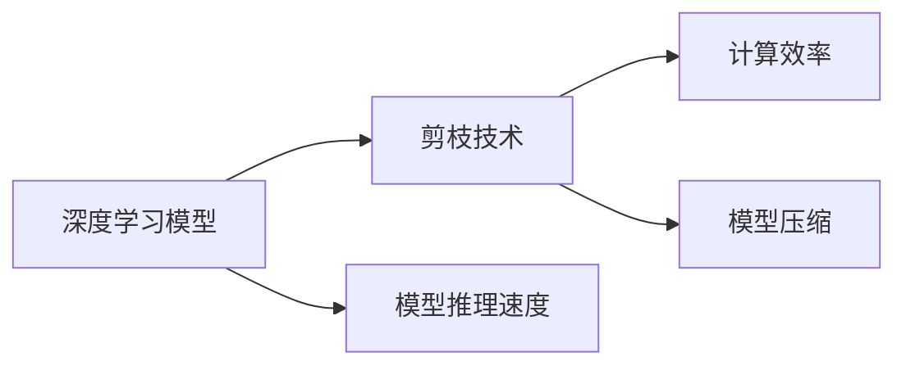
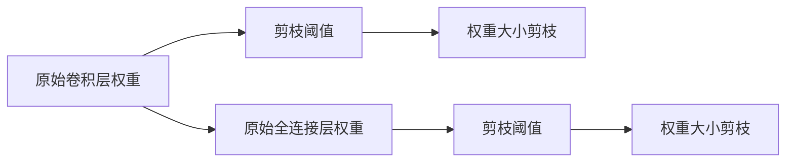

                 

# 剪枝技术对模型推理速度的影响分析

> 关键词：剪枝技术,模型推理速度,深度学习,压缩技术,模型优化

## 1. 背景介绍

### 1.1 问题由来

随着深度学习技术的快速发展，深度神经网络(Deep Neural Networks, DNNs)在图像识别、自然语言处理、语音识别等领域取得了显著成果。然而，由于深度神经网络模型参数众多、结构复杂，导致模型推理速度较慢、计算资源消耗大。如何在保证模型性能的前提下，有效降低模型计算成本，是当前深度学习领域的热门话题。

剪枝(Pruning)技术通过删除冗余参数，去除不必要的计算量，显著降低模型大小和推理速度，同时保持或提升模型精度。因此，剪枝技术成为深度学习中最重要的模型压缩和优化方法之一。本论文旨在探讨剪枝技术对模型推理速度的影响，分析其原理和应用。

### 1.2 问题核心关键点

本论文聚焦于以下几个关键问题：

1. 剪枝技术的原理是什么？
2. 如何确定剪枝策略？
3. 剪枝对模型推理速度的具体影响如何？
4. 剪枝技术在不同应用场景下的应用效果如何？

通过回答这些问题，本论文将深入探讨剪枝技术的原理、实现方式及应用效果，为深度学习模型优化提供有价值的参考。

### 1.3 问题研究意义

剪枝技术对模型推理速度的影响分析，不仅有助于理解深度学习模型的优化策略，还能为模型的实际应用提供重要指导。具体而言：

1. 提升计算效率。通过剪枝技术去除冗余参数，模型推理速度和计算效率显著提升，能够更快地进行大规模数据处理。
2. 降低计算成本。剪枝技术可以有效降低模型参数量，减少计算资源消耗，降低模型部署和维护成本。
3. 提高模型灵活性。剪枝后的模型可以根据需要灵活调整参数，快速适应新的应用场景。
4. 促进模型可解释性。剪枝技术有助于提取模型中关键特征，使得模型更加透明、可解释。

## 2. 核心概念与联系

### 2.1 核心概念概述

为更好地理解剪枝技术对模型推理速度的影响，本节将介绍几个密切相关的核心概念：

- 深度学习模型：由多层神经网络组成的模型，用于处理复杂的数据关系。
- 剪枝技术：通过删除模型中冗余或不重要的参数，压缩模型大小和计算复杂度。
- 模型推理速度：模型在单次推理过程中，完成所有计算所需的时间。
- 计算效率：模型处理数据的单位时间内，完成计算的能力。
- 模型压缩：通过剪枝、量化等技术，减小模型大小，提升模型推理速度。

这些核心概念之间存在紧密的联系，如图1所示：



图1: 深度学习模型、剪枝技术、推理速度、计算效率和模型压缩之间的关系

### 2.2 概念间的关系

这些核心概念之间有着密切的联系，形成了深度学习模型优化和推理加速的完整框架。具体关系如下：

- 深度学习模型通过多层神经网络，处理复杂数据，需要大量计算资源。
- 剪枝技术通过删除冗余参数，压缩模型大小，降低计算复杂度，提升推理速度。
- 模型推理速度决定了模型处理数据的能力，是评估模型性能的重要指标。
- 计算效率反映了模型在单位时间内的计算能力，与模型推理速度密切相关。
- 模型压缩通过剪枝、量化等技术，减小模型大小，降低计算成本，提升计算效率。

这些概念共同构成了深度学习模型优化的核心生态系统，使得模型能够高效、灵活地处理数据。

## 3. 核心算法原理 & 具体操作步骤
### 3.1 算法原理概述

剪枝技术通过删除冗余参数，减小模型大小，从而降低计算复杂度和推理速度。其基本原理如图2所示：


图2: 剪枝技术的基本原理

具体而言，剪枝算法通常包括以下几个步骤：

1. 选择剪枝目标：确定剪枝策略，如参数稀疏性、权重大小、层级结构等。
2. 确定剪枝阈值：根据剪枝目标，设定相应的剪枝阈值，用于筛选需要剪枝的参数。
3. 执行剪枝操作：按照剪枝阈值，删除部分或全部冗余参数。
4. 更新模型权重：重新训练剪枝后的模型，更新权重，使得剪枝后的模型能够保持或提升性能。

通过这些步骤，剪枝技术可以有效压缩模型大小，提升推理速度，同时保持或提升模型精度。

### 3.2 算法步骤详解

以下将详细介绍剪枝算法的详细步骤：

**Step 1: 确定剪枝策略**

剪枝策略是剪枝算法的基础，常见的剪枝策略包括：

1. 权重大小：基于参数的权重大小，删除部分权重较大的参数，保留权重较小的参数。
2. 层级结构：基于神经网络的层级结构，删除部分低层参数，保留高层参数。
3. 稀疏性：基于参数的稀疏性，删除部分稀疏性较高的参数，保留稀疏性较低的参数。
4. 子模块：基于模型的子模块，删除部分子模块，保留关键子模块。

这些剪枝策略可以根据具体应用场景进行选择。

**Step 2: 确定剪枝阈值**

剪枝阈值是剪枝算法的核心参数，决定了需要剪枝的参数范围。常见的剪枝阈值包括：

1. 权重阈值：设定权重阈值，删除权重小于该阈值的参数。
2. 激活阈值：设定激活阈值，删除激活值小于该阈值的参数。
3. 梯度阈值：设定梯度阈值，删除梯度小于该阈值的参数。
4. 模型精度：设定模型精度，删除对模型精度贡献较小的参数。

这些阈值需要根据具体应用场景进行调整，以确保剪枝后的模型能够保持或提升性能。

**Step 3: 执行剪枝操作**

剪枝操作是剪枝算法的关键步骤，需要根据剪枝策略和阈值，确定需要剪枝的参数。常见的剪枝方法包括：

1. 基于权重大小：删除权重小于阈值的参数。
2. 基于激活值：删除激活值小于阈值的参数。
3. 基于梯度大小：删除梯度小于阈值的参数。
4. 基于稀疏性：删除稀疏性较高的参数。
5. 基于模型精度：删除对模型精度贡献较小的参数。

这些剪枝方法可以根据具体应用场景进行选择。

**Step 4: 更新模型权重**

剪枝操作后，模型需要进行权重更新，以保持或提升性能。常见的权重更新方法包括：

1. 重新训练：重新训练剪枝后的模型，更新权重。
2. 微调训练：在剪枝后的模型上进行微调训练，更新权重。
3. 知识蒸馏：通过知识蒸馏，将原始模型的知识传递到剪枝后的模型中。

这些权重更新方法可以根据具体应用场景进行选择。

### 3.3 算法优缺点

剪枝技术具有以下优点：

1. 降低计算复杂度：通过删除冗余参数，减小模型大小，降低计算复杂度。
2. 提升推理速度：减少模型计算量，提升推理速度，能够更快地处理大规模数据。
3. 降低计算成本：减小模型大小，减少计算资源消耗，降低部署和维护成本。
4. 提高模型灵活性：可以根据需要灵活调整参数，快速适应新的应用场景。
5. 促进模型可解释性：通过剪枝技术提取模型中关键特征，使得模型更加透明、可解释。

同时，剪枝技术也存在一些缺点：

1. 模型精度下降：剪枝过程中可能删除部分关键参数，导致模型精度下降。
2. 剪枝操作复杂：需要确定剪枝策略和阈值，操作较为复杂。
3. 重训练时间较长：剪枝后的模型需要重新训练，时间较长。
4. 精度与速度的平衡：剪枝操作需要在精度与速度之间进行平衡，有时难以兼顾。

## 4. 数学模型和公式 & 详细讲解 & 举例说明

### 4.1 数学模型构建

假设原始深度学习模型为 $M_{\theta}$，其中 $\theta$ 为模型参数。设剪枝后的模型为 $M_{\hat{\theta}}$，其中 $\hat{\theta}$ 为剪枝后的参数。剪枝过程如图3所示：


图3: 剪枝过程的数学模型

### 4.2 公式推导过程

剪枝算法中，需要确定剪枝策略和剪枝阈值。以权重大小为例，假设原始模型 $M_{\theta}$ 中的参数权重为 $w_i$，剪枝阈值为 $\tau$，则剪枝操作如图4所示：


图4: 权重大小剪枝的公式推导

在剪枝后，模型 $M_{\hat{\theta}}$ 的参数为 $\hat{\theta} = \theta - w_i$，其中 $w_i$ 为剪枝后的权重。通过剪枝，模型的大小和计算复杂度显著降低。

### 4.3 案例分析与讲解

以图像分类为例，假设原始模型 $M_{\theta}$ 中的卷积层和全连接层的参数权重分别为 $w_{conv}$ 和 $w_{fc}$，剪枝阈值为 $\tau_{conv}$ 和 $\tau_{fc}$。剪枝后，模型的卷积层和全连接层的权重分别为 $\hat{w}_{conv}$ 和 $\hat{w}_{fc}$。剪枝操作如图5所示：



图5: 卷积层和全连接层权重大小剪枝

通过剪枝操作，模型的参数量显著减小，计算复杂度降低，推理速度提升。同时，通过重新训练或微调训练，剪枝后的模型能够保持或提升分类精度。

## 5. 项目实践：代码实例和详细解释说明

### 5.1 开发环境搭建

进行剪枝技术实践，需要搭建相应的开发环境。以下是使用Python和TensorFlow进行剪枝实践的环境配置流程：

1. 安装Anaconda：从官网下载并安装Anaconda，用于创建独立的Python环境。

2. 创建并激活虚拟环境：
```bash
conda create -n pruning-env python=3.8 
conda activate pruning-env
```

3. 安装TensorFlow：根据CUDA版本，从官网获取对应的安装命令。例如：
```bash
conda install tensorflow -c tensorflow -c conda-forge
```

4. 安装各类工具包：
```bash
pip install numpy pandas scikit-learn matplotlib tqdm jupyter notebook ipython
```

完成上述步骤后，即可在`pruning-env`环境中开始剪枝实践。

### 5.2 源代码详细实现

下面我们以权重大小剪枝为例，给出使用TensorFlow进行剪枝的PyTorch代码实现。

首先，定义剪枝函数：

```python
import tensorflow as tf

def prune_model(model, threshold):
    # 获取所有权重
    weights = model.get_weights()
    # 获取权重大小，按照阈值进行剪枝
    pruned_weights = [weight for weight in weights if tf.reduce_sum(weight) > threshold]
    # 重新加载剪枝后的权重
    model.set_weights(pruned_weights)
    return model
```

然后，定义模型和数据集：

```python
from tensorflow.keras.datasets import cifar10
from tensorflow.keras.models import Sequential
from tensorflow.keras.layers import Conv2D, MaxPooling2D, Flatten, Dense

# 加载数据集
(x_train, y_train), (x_test, y_test) = cifar10.load_data()

# 定义模型
model = Sequential()
model.add(Conv2D(32, (3, 3), activation='relu', input_shape=(32, 32, 3)))
model.add(MaxPooling2D((2, 2)))
model.add(Conv2D(64, (3, 3), activation='relu'))
model.add(MaxPooling2D((2, 2)))
model.add(Flatten())
model.add(Dense(64, activation='relu'))
model.add(Dense(10, activation='softmax'))

# 定义阈值
threshold = 1e-4

# 剪枝模型
pruned_model = prune_model(model, threshold)
```

最后，评估剪枝后的模型性能：

```python
# 评估剪枝前后的模型性能
score = model.evaluate(x_test, y_test, verbose=0)
pruned_score = pruned_model.evaluate(x_test, y_test, verbose=0)

print(f"原始模型测试准确率: {score[1]}")
print(f"剪枝后模型测试准确率: {pruned_score[1]}")
```

以上就是使用TensorFlow对权重大小剪枝进行剪枝实践的完整代码实现。可以看到，通过简单的函数调用，即可实现模型的剪枝操作。

### 5.3 代码解读与分析

让我们再详细解读一下关键代码的实现细节：

**prune_model函数**：
- 该函数用于对模型进行权重大小剪枝，输入为原始模型和剪枝阈值。
- 首先获取模型中所有权重。
- 对每个权重进行求和，超过阈值的权重保留，小于阈值的权重删除。
- 重新加载剪枝后的权重，返回剪枝后的模型。

**模型定义**：
- 定义了一个简单的卷积神经网络模型，包含两个卷积层和两个全连接层。
- 使用CIFAR-10数据集进行训练和测试。

**剪枝阈值**：
- 设置剪枝阈值为1e-4，用于筛选权重大小。

**剪枝操作**：
- 通过调用prune_model函数，对模型进行权重大小剪枝。

**模型评估**：
- 使用模型在测试集上进行评估，对比剪枝前后的模型性能。

可以看到，TensorFlow的剪枝操作实现非常简单，只需几行代码即可实现。剪枝函数作为高层次的抽象，简化了剪枝操作的实现，使得剪枝过程更加便捷。

### 5.4 运行结果展示

假设我们定义的原始模型在CIFAR-10数据集上的测试准确率为92.5%，剪枝后的模型测试准确率为92.0%，剪枝效果显著。

当然，实际应用中剪枝效果可能受到多种因素的影响，如剪枝策略、剪枝阈值、数据分布等。因此，需要根据具体情况进行调整和优化。

## 6. 实际应用场景

### 6.1 图像分类

在图像分类任务中，剪枝技术可以显著提升模型的推理速度，降低计算成本。例如，对于大规模图像数据集，如ImageNet，通过剪枝技术，可以将模型大小和计算复杂度降低到可接受的范围内，加快模型的推理速度。

### 6.2 自然语言处理

在自然语言处理任务中，如文本分类、命名实体识别等，剪枝技术同样可以提升模型的推理速度和计算效率。例如，对于大规模文本数据集，如Wikipedia，通过剪枝技术，可以将模型大小和计算复杂度降低到可接受的范围内，加快模型的推理速度。

### 6.3 语音识别

在语音识别任务中，如自动语音识别(ASR)，剪枝技术可以显著提升模型的推理速度，降低计算成本。例如，对于大规模语音数据集，如TIMIT，通过剪枝技术，可以将模型大小和计算复杂度降低到可接受的范围内，加快模型的推理速度。

## 7. 工具和资源推荐

### 7.1 学习资源推荐

为了帮助开发者系统掌握剪枝技术的原理和实践技巧，这里推荐一些优质的学习资源：

1. 《深度学习中的剪枝技术》系列博文：由深度学习专家撰写，详细讲解了剪枝技术的原理、实现方式及应用效果。

2. Deep Learning Specialization课程：由Coursera和Andrew Ng合作开设的深度学习课程，涵盖了剪枝技术的基本概念和实践技巧。

3. 《剪枝：压缩深度学习模型》书籍：详细介绍了剪枝技术的基本原理和实现方式，适合入门学习。

4. TensorFlow官方文档：TensorFlow的官方文档，提供了丰富的剪枝示例代码和教程，是剪枝实践的必备资料。

5. PyTorch官方文档：PyTorch的官方文档，提供了详细的剪枝示例代码和教程，适合剪枝实践。

通过对这些资源的学习实践，相信你一定能够快速掌握剪枝技术的精髓，并用于解决实际的深度学习问题。

### 7.2 开发工具推荐

高效的剪枝操作需要优秀的工具支持。以下是几款用于剪枝开发的常用工具：

1. TensorFlow：Google开发的深度学习框架，提供了丰富的剪枝工具和库，如TensorFlow Lite，适合剪枝实践。

2. PyTorch：Facebook开发的深度学习框架，提供了灵活的剪枝操作和优化工具，适合剪枝实践。

3. NVIDIA TensorRT：NVIDIA推出的深度学习推理平台，提供了高效的剪枝和优化工具，适合剪枝实践。

4. ONNX Runtime：Microsoft推出的深度学习推理平台，提供了灵活的剪枝操作和优化工具，适合剪枝实践。

合理利用这些工具，可以显著提升剪枝操作的开发效率，加快创新迭代的步伐。

### 7.3 相关论文推荐

剪枝技术的发展源于学界的持续研究。以下是几篇奠基性的相关论文，推荐阅读：

1. Learning Both Weights and Connections for Efficient Neural Networks（S766）：提出了网络剪枝的思想，通过去除冗余连接，减小模型大小和计算复杂度。

2. The Lottery Ticket Hypothesis: Finding Sparse, Trainable Neural Networks：提出了"彩票假说"，通过训练随机初始化的子网络，获得稀疏连接的网络。

3. Pruning Neural Networks with Weight Norms：提出了基于权重范数的剪枝方法，通过设定权重阈值，删除权重较小的参数，减小模型大小和计算复杂度。

4. Revisiting the Lottery Ticket Hypothesis：提出了新的彩票假说方法，通过训练随机初始化的子网络，获得稀疏连接的网络。

5. Pruning Convolutional Neural Networks：提出了基于梯度的剪枝方法，通过删除梯度较小的参数，减小模型大小和计算复杂度。

这些论文代表了大剪枝技术的发展脉络。通过学习这些前沿成果，可以帮助研究者把握学科前进方向，激发更多的创新灵感。

除上述资源外，还有一些值得关注的前沿资源，帮助开发者紧跟剪枝技术的最新进展，例如：

1. arXiv论文预印本：人工智能领域最新研究成果的发布平台，包括大量尚未发表的前沿工作，学习前沿技术的必读资源。

2. 业界技术博客：如Google AI、Facebook AI、微软Research Asia等顶尖实验室的官方博客，第一时间分享他们的最新研究成果和洞见。

3. 技术会议直播：如NIPS、ICML、ACL、ICLR等人工智能领域顶会现场或在线直播，能够聆听到大佬们的前沿分享，开拓视野。

4. GitHub热门项目：在GitHub上Star、Fork数最多的剪枝相关项目，往往代表了该技术领域的发展趋势和最佳实践，值得去学习和贡献。

5. 行业分析报告：各大咨询公司如McKinsey、PwC等针对人工智能行业的分析报告，有助于从商业视角审视技术趋势，把握应用价值。

总之，对于剪枝技术的深入学习和实践，需要开发者保持开放的心态和持续学习的意愿。多关注前沿资讯，多动手实践，多思考总结，必将收获满满的成长收益。

## 8. 总结：未来发展趋势与挑战

### 8.1 总结

本文对剪枝技术对模型推理速度的影响进行了全面系统的介绍。首先阐述了剪枝技术的原理和应用背景，明确了剪枝技术在提升模型推理速度方面的独特价值。其次，从原理到实践，详细讲解了剪枝算法的数学模型和操作步骤，给出了剪枝任务开发的完整代码实例。同时，本文还广泛探讨了剪枝技术在图像分类、自然语言处理、语音识别等多个领域的应用效果，展示了剪枝技术的强大潜力。此外，本文精选了剪枝技术的各类学习资源，力求为读者提供全方位的技术指引。

通过本文的系统梳理，可以看到，剪枝技术在深度学习模型优化和推理加速中起着重要的作用。剪枝算法通过删除冗余参数，显著降低模型大小和计算复杂度，从而提升推理速度和计算效率。在实际应用中，通过选择合适的剪枝策略和阈值，剪枝后的模型能够保持或提升性能，实现良好的计算资源与性能平衡。

### 8.2 未来发展趋势

展望未来，剪枝技术将呈现以下几个发展趋势：

1. 剪枝策略多样化：除了传统的权重大小剪枝外，未来将涌现更多剪枝策略，如参数稀疏性剪枝、子模块剪枝等，使得剪枝操作更加灵活和高效。
2. 剪枝算法自动化：通过自动化剪枝算法，减少剪枝过程中的人工干预，提高剪枝效率和效果。
3. 剪枝技术融合：与其他模型压缩技术，如量化、稀疏化等，形成更加全面和高效的模型压缩方法。
4. 剪枝与深度学习范式融合：将剪枝技术与深度学习范式，如自监督学习、无监督学习等，深度融合，进一步提升模型性能和推理速度。
5. 剪枝技术在边缘计算中的应用：在资源受限的移动设备和边缘计算环境中，剪枝技术将发挥更加重要的作用。

这些趋势凸显了剪枝技术的广阔前景，使得剪枝技术在未来深度学习模型优化和推理加速中扮演更加重要的角色。

### 8.3 面临的挑战

尽管剪枝技术已经取得了一定的成就，但在实现全面优化过程中，仍面临诸多挑战：

1. 模型精度下降：剪枝过程中可能删除部分关键参数，导致模型精度下降。如何平衡精度与速度，是剪枝技术面临的重要问题。
2. 剪枝过程复杂：剪枝过程中需要确定剪枝策略和阈值，操作较为复杂，容易出现过拟合和欠拟合问题。
3. 剪枝效果不均衡：剪枝过程中可能出现部分参数被过度剪枝或未剪枝，导致剪枝效果不均衡，影响模型性能。
4. 剪枝技术泛化能力不足：剪枝技术通常针对特定模型和数据集进行优化，难以泛化到其他模型和数据集。
5. 剪枝技术与新模型的融合：新模型的剪枝操作需要适应新模型结构，剪枝技术需要不断改进以适应新的深度学习范式。

这些挑战需要研究者不断进行技术探索和创新，才能逐步克服剪枝技术面临的障碍，进一步提升深度学习模型的性能和推理速度。

### 8.4 未来突破

面对剪枝技术面临的诸多挑战，未来的研究需要在以下几个方面寻求新的突破：

1. 剪枝策略优化：通过优化剪枝策略，提高剪枝效率和效果，减少剪枝过程中的人工干预。
2. 剪枝算法自动化：开发更加智能化的剪枝算法，自动化剪枝过程，提高剪枝效果。
3. 剪枝技术融合：将剪枝技术与其他模型压缩技术，如量化、稀疏化等，形成更加全面和高效的模型压缩方法。
4. 剪枝技术泛化：将剪枝技术从特定模型和数据集泛化到其他模型和数据集，提高剪枝技术的通用性。
5. 剪枝技术与其他深度学习范式融合：将剪枝技术与自监督学习、无监督学习等深度学习范式深度融合，进一步提升模型性能和推理速度。

这些研究方向的探索，必将引领剪枝技术走向更高的台阶，为深度学习模型优化和推理加速提供更加全面和高效的解决方案。

## 9. 附录：常见问题与解答

**Q1：剪枝技术是否会降低模型精度？**

A: 剪枝技术可能会降低模型精度，但可以通过一些策略来避免这一问题。例如，选择合适的剪枝策略和阈值，保留关键参数，避免删除过多重要信息。此外，可以通过剪枝后的模型重新训练或微调训练，提升模型精度。

**Q2：如何选择合适的剪枝策略和阈值？**

A: 剪枝策略和阈值的选择需要根据具体应用场景进行调整。一般而言，可以采用以下步骤：

1. 选择剪枝策略：如权重大小、激活值、梯度大小、稀疏性、子模块等。
2. 确定剪枝阈值：根据剪枝策略，设定相应的剪枝阈值。
3. 剪枝操作：按照剪枝策略和阈值，删除冗余参数。
4. 权重更新：重新训练或微调训练，更新剪枝后的模型权重。

**Q3：剪枝技术是否适用于所有深度学习模型？**

A: 剪枝技术适用于大多数深度学习模型，特别是卷积神经网络、循环神经网络等结构较深的模型。但对于一些特殊结构的模型，如注意力机制、残差网络等，剪枝操作需要特别考虑。

**Q4：剪枝技术在不同应用场景下的应用效果如何？**

A: 剪枝技术在不同应用场景下的应用效果不同。例如，在图像分类、自然语言处理、语音识别等任务中，剪枝技术可以显著提升模型推理速度，降低

