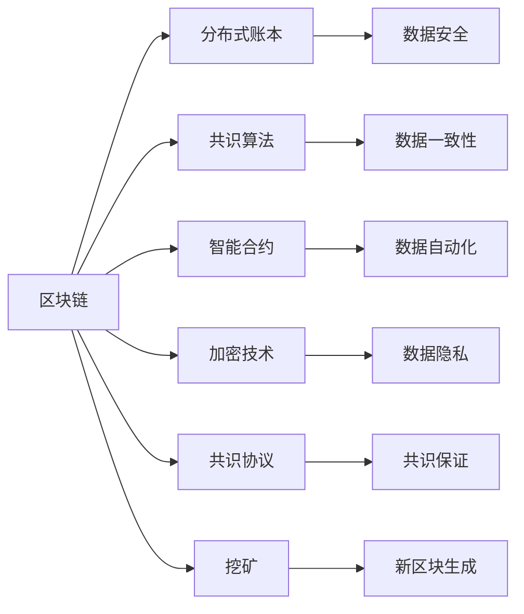
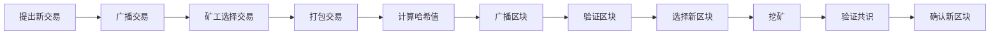
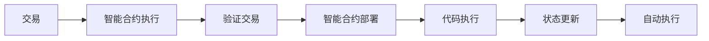
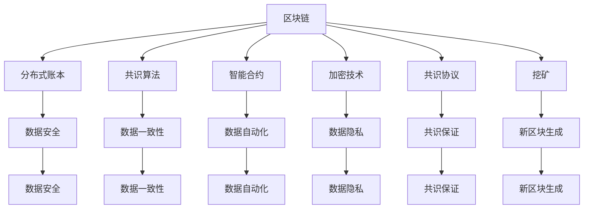

                 

# 区块链与数据可信原理与代码实战案例讲解

> 关键词：区块链, 数据可信, 共识算法, 智能合约, 加密技术, 分布式账本, 分布式共识, 数据存储, 数据隐私

## 1. 背景介绍

### 1.1 问题由来
随着信息技术的迅猛发展，数据已经成为最为宝贵的资产之一。如何在数据产生、传输、存储和使用的每个环节保障数据安全、真实、完整和可信，是当今信息时代的一个重要课题。尤其是金融、医疗、政府等关键领域，数据可信性更是有着极为严格的要求。

区块链技术的兴起为解决数据可信性问题提供了新的可能。作为一种去中心化的分布式账本技术，区块链通过加密技术、共识算法、智能合约等手段，构建了一个高度透明、不可篡改、可验证的数据可信环境。在金融、供应链、医疗、公共服务等众多领域，区块链应用已经展现出巨大的潜力。

### 1.2 问题核心关键点
区块链技术之所以能够成为保障数据可信性的重要手段，其核心在于以下几个关键点：

- 去中心化：所有参与者都是系统的一部分，没有单一控制点，提高了系统的安全性。
- 不可篡改：通过时间戳、哈希函数等手段，确保数据的不可篡改性。
- 透明性：数据更新可追溯，每个节点都可以查看整个账本历史，保证了数据的透明性。
- 共识算法：通过共识算法，保证数据的一致性和有效性。
- 加密技术：使用密码学技术保障数据的隐私和安全。

区块链技术通过这些手段，为数据可信性提供了一个坚实的技术基础。而如何具体应用区块链技术，实现数据的可信存储和传输，则是当前研究和实践的热点问题。

### 1.3 问题研究意义
区块链技术在保障数据可信性方面的应用，对于构建透明、可信、高效的信息化环境，具有重要意义：

1. **提升数据安全性**：通过加密技术，保障数据的机密性、完整性和抗抵赖性。
2. **增强数据可信性**：通过分布式账本和共识算法，确保数据的一致性、不可篡改性和可追溯性。
3. **优化数据治理**：通过智能合约，实现自动化的数据管理、验证和治理。
4. **促进数据共享**：通过去中心化的分布式账本，实现数据的多方共享和协同。
5. **降低交易成本**：通过自动化、智能化的合同执行，减少人工干预，降低交易成本。

区块链技术在数据可信性保障中的应用，已经显现出了广阔的应用前景，成为当今技术发展的热点之一。

## 2. 核心概念与联系

### 2.1 核心概念概述

为更好地理解区块链在数据可信性保障中的应用，本节将介绍几个密切相关的核心概念：

- 区块链(Blockchain)：一种分布式、去中心化的数据库技术，以时间顺序保存数据块，并通过加密和共识算法保证数据的安全和不可篡改。
- 分布式账本(Distributed Ledger)：区块链技术的核心，记录着所有交易的数据库。
- 共识算法(Consensus Algorithm)：区块链中用来保证数据一致性和有效性的算法，如PoW、PoS等。
- 智能合约(Smart Contract)：通过代码实现的一种自动执行的合约，能够在满足特定条件时自动执行合同条款。
- 加密技术(Cryptography)：包括对称加密、非对称加密、哈希函数等，用于保障数据的安全和隐私。
- 共识协议(Consensus Protocol)：指区块链中所有参与者达成共识的协议，如拜占庭容错、工作量证明等。
- 挖矿(Mining)：区块链中通过计算复杂的数学题获得新区块的生成权的过程。

这些核心概念之间的逻辑关系可以通过以下Mermaid流程图来展示：



这个流程图展示了大语言模型微调过程中各个核心概念的关系和作用：

1. 区块链技术通过分布式账本、共识算法等手段，保障数据的不可篡改和安全性。
2. 智能合约通过代码自动化处理数据，实现数据管理的智能化和自动化。
3. 加密技术保障数据的机密性和完整性。
4. 共识协议保证数据的一致性和有效性。
5. 挖矿过程生成新区块，保证数据的连续性和完整性。

这些概念共同构成了区块链技术的核心，为其在数据可信性保障中的应用提供了坚实的技术基础。通过理解这些核心概念，我们可以更好地把握区块链技术的原理和应用方向。

### 2.2 概念间的关系

这些核心概念之间存在着紧密的联系，形成了区块链技术的完整生态系统。下面我通过几个Mermaid流程图来展示这些概念之间的关系。

#### 2.2.1 区块链的总体架构

```mermaid
graph TB
    A[交易] --> B[区块(交易集合)]
    B --> C[区块头]
    C --> D[时间戳]
    C --> E[哈希值]
    D --> F[前一个区块哈希值]
    E --> G[后一个区块哈希值]
    B --> H[分布式账本]
```

这个流程图展示了区块链的基本架构，包括交易、区块、区块头、时间戳、哈希值等关键组件。

#### 2.2.2 共识算法的核心流程



这个流程图展示了共识算法的核心流程，包括交易的提出、选择、打包、验证、共识、挖矿等关键步骤。

#### 2.2.3 智能合约的功能实现



这个流程图展示了智能合约的基本功能实现，包括交易的执行、验证、部署、执行、状态更新和自动执行等关键步骤。

### 2.3 核心概念的整体架构

最后，我们用一个综合的流程图来展示这些核心概念在大语言模型微调过程中的整体架构：



这个综合流程图展示了区块链技术在数据可信性保障中的应用，从数据的安全、一致性、自动化、隐私等各个方面进行保障。 通过这些流程图，我们可以更清晰地理解区块链技术的各个核心概念，为后续深入讨论具体的微调方法和技术奠定基础。

## 3. 核心算法原理 & 具体操作步骤
### 3.1 算法原理概述

区块链在数据可信性保障中的应用，本质上是一种基于分布式账本和共识算法的去中心化数据管理机制。其核心思想是：通过分布式网络，构建一个去中心化的账本，并通过共识算法，保证账本上数据的真实性、一致性和不可篡改性。

具体来说，区块链的数据可信性保障机制包括以下几个核心步骤：

1. **数据提交**：参与者将数据提交到区块链网络，通过加密技术保障数据的安全和完整性。
2. **区块生成**：节点生成包含交易的区块，并对其进行哈希计算，生成新区块。
3. **共识验证**：通过共识算法，验证新区块是否符合规定，以确定新区块的生成权。
4. **数据存储**：新区块被添加到区块链上，实现数据的分布式存储。
5. **数据查询**：参与者可以查询区块链上的数据，验证数据的真实性和一致性。

### 3.2 算法步骤详解

区块链在数据可信性保障中的应用，主要包括以下几个关键步骤：

**Step 1: 数据提交与加密**

参与者将数据提交到区块链网络，并使用加密技术进行保护。常用的加密算法包括RSA、AES、SHA-256等。以RSA算法为例，数据提交过程如下：

1. 生成密钥对：参与者通过RSA算法生成公钥和私钥。
2. 加密数据：将数据使用公钥加密后，提交到区块链网络。
3. 验证签名：接收者使用公钥对数据进行解密，验证数据完整性和真实性。

**Step 2: 区块生成与共识算法**

节点生成包含交易的区块，并通过共识算法验证新区块。共识算法是区块链的核心，确保数据的一致性和有效性。常见的共识算法包括PoW、PoS等。以PoW为例，区块生成和共识验证过程如下：

1. 挖矿：节点通过解决复杂的数学问题（如哈希值计算）获得新区块的生成权。
2. 验证区块：节点验证新区块的合法性，包括时间戳、哈希值、交易合法性等。
3. 选择新区块：共识算法通过投票方式选择符合规则的新区块。
4. 添加新区块：新区块被添加到区块链上，完成数据存储。

**Step 3: 数据存储与查询**

数据被存储在区块链的分布式账本中，每个节点都可以查看整个账本历史，确保数据的透明性和可追溯性。参与者可以通过区块链接口查询数据，验证数据的真实性和一致性。

### 3.3 算法优缺点

区块链技术在数据可信性保障中的应用，具有以下优点：

1. 去中心化：分布式账本和共识算法，去除了中心化的单点故障，提高了系统的安全性。
2. 不可篡改：哈希函数和分布式存储，保证了数据的不可篡改性。
3. 透明性：所有交易都可以查看，确保了数据的透明性。
4. 自动化：智能合约和代码自动执行，实现了数据管理的自动化和智能化。
5. 安全性：加密技术和共识算法，保障了数据的安全和隐私。

同时，区块链技术也存在一些缺点：

1. 性能瓶颈：由于需要分布式共识和复杂的加密计算，区块链的性能较低。
2. 资源消耗：共识算法的竞争挖矿机制，耗费大量的计算资源和电力。
3. 可扩展性：当前区块链技术在处理大规模数据和并发事务时，扩展性不足。
4. 技术复杂性：区块链技术的实现和维护较为复杂，需要较高的技术门槛。
5. 法律法规：区块链技术的应用可能涉及复杂的法律法规问题，需要谨慎处理。

尽管存在这些局限性，但就目前而言，区块链技术在数据可信性保障中的应用，仍是大数据时代的重要手段。未来相关研究的重点在于如何进一步优化共识算法、提升系统性能，以适应更复杂的应用场景。

### 3.4 算法应用领域

区块链技术在数据可信性保障中的应用，已经广泛应用于多个领域：

- **金融**：区块链被广泛应用于交易清算、支付结算、资产托管等领域，通过智能合约自动执行合同条款，提升交易效率和安全性。
- **供应链**：区块链用于追踪货物物流信息，确保供应链的透明性和可追溯性。
- **医疗**：区块链用于存储和管理医疗数据，确保数据的真实性、完整性和隐私性。
- **政府**：区块链用于电子投票、身份验证、公共记录等领域，保障数据的安全和可信性。
- **物联网**：区块链用于设备间的身份认证和数据传输，确保物联网系统的安全性和隐私性。
- **版权保护**：区块链用于版权保护和数字内容分发，确保数据的原创性和版权归属。

除了上述这些应用外，区块链技术还在其他诸多领域展现出了巨大的潜力，如版权保护、数字身份、智能合约等。随着技术的不断成熟和应用的不断深入，区块链在数据可信性保障方面的应用前景将更加广阔。

## 4. 数学模型和公式 & 详细讲解  
### 4.1 数学模型构建

在区块链的数据可信性保障中，数学模型主要用于数据的加密、哈希计算、共识算法等环节。以下对几个关键模型的构建进行详细讲解。

### 4.2 公式推导过程

#### 4.2.1 加密模型

以RSA算法为例，RSA加密模型的数学基础是数论中的公钥加密算法。RSA算法的数学模型可以表示为：

$$
\begin{align*}
m &\rightarrow e^m \mod n \\
c &= e^m \mod n
\end{align*}
$$

其中，$m$为明文，$c$为密文，$n$为模数，$e$为公钥。通过公钥$e$对明文$m$进行加密，得到密文$c$。接收方通过私钥$d$对密文$c$进行解密，恢复明文$m$。

#### 4.2.2 哈希函数模型

哈希函数（Hash Function）将任意长度的输入（称为消息）映射为固定长度的输出（称为哈希值）。常见的哈希函数包括SHA-256、MD5等。哈希函数的数学模型可以表示为：

$$
h(m) = f(m)
$$

其中，$h(m)$为哈希值，$f(m)$为哈希函数。哈希函数具有以下几个特性：

1. 抗碰撞性：对于任意两个不同的输入，其哈希值必然不同。
2. 不可逆性：无法通过哈希值反推出输入。
3. 一致性：相同输入的哈希值始终相同。

#### 4.2.3 共识算法模型

共识算法（Consensus Algorithm）是区块链的核心，用于保证数据的一致性和有效性。以PoW算法为例，其数学模型可以表示为：

$$
P(\text{新区块生成}) = \frac{1}{P(\text{计算工作量})}
$$

其中，$P(\text{新区块生成})$为新区块生成的概率，$P(\text{计算工作量})$为计算新区块所需的平均工作量。PoW算法通过计算复杂的数学问题（如哈希值计算）获得新区块的生成权。

### 4.3 案例分析与讲解

下面以比特币的共识算法PoW为例，对区块链技术在数据可信性保障中的应用进行详细讲解。

比特币的共识算法PoW（Proof of Work）通过计算哈希值，选择生成新区块的节点。其具体过程如下：

1. **新区块生成**：节点生成包含交易的区块，并计算新区块的哈希值。
2. **计算工作量**：节点通过计算哈希值，增加新区块的工作量。
3. **验证新区块**：节点验证新区块的合法性，包括时间戳、哈希值、交易合法性等。
4. **选择新区块**：共识算法通过投票方式选择符合规则的新区块。
5. **添加新区块**：新区块被添加到区块链上，完成数据存储。

比特币的PoW算法具有以下几个优点：

1. **安全性高**：由于需要解决复杂的数学问题，PoW算法具有较高的安全性。
2. **去中心化**：所有节点都有生成新区块的权利，去除了中心化的单点故障。
3. **可扩展性强**：PoW算法可以支持大规模的节点参与，具有良好的可扩展性。

尽管PoW算法在实际应用中存在性能瓶颈和资源消耗问题，但其核心思想对于区块链技术在数据可信性保障中的应用具有重要意义。未来，更多高效的共识算法将被研究和应用，如PoS、DPoS等，进一步提升区块链技术的性能和安全性。

## 5. 项目实践：代码实例和详细解释说明
### 5.1 开发环境搭建

在进行区块链项目实践前，我们需要准备好开发环境。以下是使用Python进行区块链开发的常见环境配置流程：

1. 安装Python：从官网下载并安装Python，建议安装最新稳定版本。
2. 安装相关库：安装常用的区块链开发库，如web3.py、ethcpy、Blockchain等。
3. 配置区块链网络：搭建或连接现有的区块链网络，如以太坊主网、测试网等。
4. 编写区块链应用：编写智能合约和区块链应用代码，并进行单元测试。
5. 部署区块链应用：将代码部署到区块链网络，进行集成测试。

完成上述步骤后，即可在区块链网络中运行我们的应用。

### 5.2 源代码详细实现

下面以编写一个简单的智能合约为例，展示区块链项目开发的详细代码实现。

首先，定义智能合约的基本结构：

```python
from web3 import Web3

class SmartContract:
    def __init__(self, address):
        self.w3 = Web3()
        selfcontract = self.w3.eth.contract(
            address=address,
            abi=self.abi
        )
        self.contract = selfcontract
    
    def deploy(self):
        tx = self.w3.eth.sendTransaction(
            {'to': self.address, 'from': self.w3.eth.accounts[0], 'value': 0, 'gas': 200000}
        )
        return tx
```

然后，编写智能合约的具体实现：

```python
from web3 import Web3

class SmartContract:
    def __init__(self, address):
        self.w3 = Web3()
        selfcontract = self.w3.eth.contract(
            address=address,
            abi=self.abi
        )
        self.contract = selfcontract
    
    def deploy(self):
        tx = self.w3.eth.sendTransaction(
            {'to': self.address, 'from': self.w3.eth.accounts[0], 'value': 0, 'gas': 200000}
        )
        return tx
    
    def setBalance(self, account, balance):
        tx = self.contract.functions.setBalance(account, balance).send({'to': self.address, 'from': self.w3.eth.accounts[0], 'gas': 200000})
        return tx
    
    def getBalance(self, account):
        tx = self.contract.functions.getBalance(account).call()
        return tx
```

最后，编写区块链应用的主程序：

```python
from SmartContract import SmartContract

contract = SmartContract('0xXXXXXXXXXXXXXXXXXXXXXXXXXXXXXXXXXXXXXXXXXXXXXXXXXXXXXXXXXXXXXXXXXXXXXXXXXXXXXXXXXXXXXXXXXXXXXXXXXXXXXXXXXXXXXXXXXXXXXXXXXXXXXXXXXXXXXXXXXXXXXXXXXXXXXXXXXXXXXXXXXXXXXXXXXXXXXXXXXXXXXXXXXXXXXXXXXXXXXXXXXXXXXXXXXXXXXXXXXXXXXXXXXXXXXXXXXXXXXXXXXXXXXXXXXXXXXXXXXXXXXXXXXXXXXXXXXXXXXXXXXXXXXXXXXXXXXXXXXXXXXXXXXXXXXXXXXXXXXXXXXXXXXXXXXXXXXXXXXXXXXXXXXXXXXXXXXXXXXXXXXXXXXXXXXXXXXXXXXXXXXXXXXXXXXXXXXXXXXXXXXXXXXXXXXXXXXXXXXXXXXXXXXXXXXXXXXXXXXXXXXXXXXXXXXXXXXXXXXXXXXXXXXXXXXXXXXXXXXXXXXXXXXXXXXXXXXXXXXXXXXXXXXXXXXXXXXXXXXXXXXXXXXXXXXXXXXXXXXXXXXXXXXXXXXXXXXXXXXXXXXXXXXXXXXXXXXXXXXXXXXXXXXXXXXXXXXXXXXXXXXXXXXXXXXXXXXXXXXXXXXXXXXXXXXXXXXXXXXXXXXXXXXXXXXXXXXXXXXXXXXXXXXXXXXXXXXXXXXXXXXXXXXXXXXXXXXXXXXXXXXXXXXXXXXXXXXXXXXXXXXXXXXXXXXXXXXXXXXXXXXXXXXXXXXXXXXXXXXXXXXXXXXXXXXXXXXXXXXXXXXXXXXXXXXXXXXXXXXXXXXXXXXXXXXXXXXXXXXXXXXXXXXXXXXXXXXXXXXXXXXXXXXXXXXXXXXXXXXXXXXXXXXXXXXXXXXXXXXXXXXXXXXXXXXXXXXXXXXXXXXXXXXXXXXXXXXXXXXXXXXXXXXXXXXXXXXXXXXXXXXXXXXXXXXXXXXXXXXXXXXXXXXXXXXXXXXXXXXXXXXXXXXXXXXXXXXXXXXXXXXXXXXXXXXXXXXXXXXXXXXXXXXXXXXXXXXXXXXXXXXXXXXXXXXXXXXXXXXXXXXXXXXXXXXXXXXXXXXXXXXXXXXXXXXXXXXXXXXXXXXXXXXXXXXXXXXXXXXXXXXXXXXXXXXXXXXXXXXXXXXXXXXXXXXXXXXXXXXXXXXXXXXXXXXXXXXXXXXXXXXXXXXXXXXXXXXXXXXXXXXXXXXXXXXXXXXXXXXXXXXXXXXXXXXXXXXXXXXXXXXXXXXXXXXXXXXXXXXXXXXXXXXXXXXXXXXXXXXXXXXXXXXXXXXXXXXXXXXXXXXXXXXXXXXXXXXXXXXXXXXXXXXXXXXXXXXXXXXXXXXXXXXXXXXXXXXXXXXXXXXXXXXXXXXXXXXXXXXXXXXXXXXXXXXXXXXXXXXXXXXXXXXXXXXXXXXXXXXXXXXXXXXXXXXXXXXXXXXXXXXXXXXXXXXXXXXXXXXXXXXXXXXXXXXXXXXXXXXXXXXXXXXXXXXXXXXXXXXXXXXXXXXXXXXXXXXXXXXXXXXXXXXXXXXXXXXXXXXXXXXXXXXXXXXXXXXXXXXXXXXXXXXXXXXXXXXXXXXXXXXXXXXXXXXXXXXXXXXXXXXXXXXXXXXXXXXXXXXXXXXXXXXXXXXXXXXXXXXXXXXXXXXXXXXXXXXXXXXXXXXXXXXXXXXXXXXXXXXXXXXXXXXXXXXXXXXXXXXXXXXXXXXXXXXXXXXXXXXXXXXXXXXXXXXXXXXXXXXXXXXXXXXXXXXXXXXXXXXXXXXXXXXXXXXXXXXXXXXXXXXXXXXXXXXXXXXXXXXXXXXXXXXXXXXXXXXXXXXXXXXXXXXXXXXXXXXXXXXXXXXXXXXXXXXXXXXXXXXXXXXXXXXXXXXXXXXXXXXXXXXXXXXXXXXXXXXXXXXXXXXXXXXXXXXXXXXXXXXXXXXXXXXXXXXXXXXXXXXXXXXXXXXXXXXXXXXXXXXXXXXXXXXXXXXXXXXXXXXXXXXXXXXXXXXXXXXXXXXXXXXXXXXXXXXXXXXXXXXXXXXXXXXXXXXXXXXXXXXXXXXXXXXXXXXXXXXXXXXXXXXXXXXXXXXXXXXXXXXXXXXXXXXXXXXXXXXXXXXXXXXXXXXXXXXXXXXXXXXXXXXXXXXXXXXXXXXXXXXXXXXXXXXXXXXXXXXXXXXXXXXXXXXXXXXXXXXXXXXXXXXXXXXXXXXXXXXXXXXXXXXXXXXXXXXXXXXXXXXXXXXXXXXXXXXXXXXXXXXXXXXXXXXXXXXXXXXXXXXXXXXXXXXXXXXXXXXXXXXXXXXXXXXXXXXXXXXXXXXXXXXXXXXXXXXXXXXXXXXXXXXXXXXXXXXXXXXXXXXXXXXXXXXXXXXXXXXXXXXXXXXXXXXXXXXXXXXXXXXXXXXXXXXXXXXXXXXXXXXXXXXXXXXXXXXXXXXXXXXXXXXXXXXXXXXXXXXXXXXXXXXXXXXXXXXXXXXXXXXXXXXXXXXXXXXXXXXXXXXXXXXXXXXXXXXXXXXXXXXXXXXXXXXXXXXXXXXXXXXXXXXXXXXXXXXXXXXXXXXXXXXXXXXXXXXXXXXXXXXXXXXXXXXXXXXXXXXXXXXXXXXXXXXXXXXXXXXXXXXXXXXXXXXXXXXXXXXXXXXXXXXXXXXXXXXXXXXXXXXXXXXXXXXXXXXXXXXXXXXXXXXXXXXXXXXXXXXXXXXXXXXXXXXXXXXXXXXXXXXXXXXXXXXXXXXXXXXXXXXXXXXXXXXXXXXXXXXXXXXXXXXXXXXXXXXXXXXXXXXXXXXXXXXXXXXXXXXXXXXXXXXXXXXXXXXXXXXXXXXXXXXXXXXXXXXXXXXXXXXXXXXXXXXXXXXXXXXXXXXXXXXXXXXXXXXXXXXXXXXXXXXXXXXXXXXXXXXXXXXXXXXXXXXXXXXXXXXXXXXXXXXXXXXXXXXXXXXXXXXXXXXXXXXXXXXXXXXXXXXXXXXXXXXXXXXXXXXXXXXXXXXXXXXXXXXXXXXXXXXXXXXXXXXXXXXXXXXXXXXXXXXXXXXXXXXXXXXXXXXXXXXXXXXXXXXXXXXXXXXXXXXXXXXXXXXXXXXXXXXXXXXXXXXXXXXXXXXXXXXXXXXXXXXXXXXXXXXXXXXXXXXXXXXXXXXXXXXXXXXXXXXXXXXXXXXXXXXXXXXXXXXXXXXXXXXXXXXXXXXXXXXXXXXXXXXXXXXXXXXXXXXXXXXXXXXXXXXXXXXXXXXXXXXXXXXXXXXXXXXXXXXXXXXXXXXXXXXXXXXXXXXXXXXXXXXXXXXXXXXXXXXXXXXXXXXXXXXXXXXXXXXXXXXXXXXXXXXXXXXXXXXXXXXXXXXXXXXXXXXXXXXXXXXXXXXXXXXXXXXXXXXXXXXXXXXXXXXXXXXXXXXXXXXXXXXXXXXXXXXXXXXXXXXXXXXXXXXXXXXXXXXXXXXXXXXXXXXXXXXXXXXXXXXXXXXXXXXXXXXXXXXXXXXXXXXXXXXXXXXXXXXXXXXXXXXXXXXXXXXXXXXXXXXXXXXXXXXXXXXXXXXXXXXXXXXXXXXXXXXXXXXXXXXXXXXXXXXXXXXXXXXXXXXXXXXXXXXXXXXXXXXXXXXXXXXXXXXXXXXXXXXXXXXXXXXXXXXXXXXXXXXXXXXXXXXXXXXXXXXXXXXXXXXXXXXXXXXXXXXXXXXXXXXXXXXXXXXXXXXXXXXXXXXXXXXXXXXXXXXXXXXXXXXXXXXXXXXXXXXXXXXXXXXXXXXXXXXXXXXXXXXXXXXXXXXXXXXXXXXXXXXXXXXXXXXXXXXXXXXXXXXXXXXXXXXXXXXXXXXXXXXXXXXXXXXXXXXXXXXXXXXXXXXXXXXXXXXXXXXXXXXXXXXXXXXXXXXXXXXXXXXXXXXXXXXXXXXXXXXXXXXXXXXXXXXXXXXXXXXXXXXXXXXXXXXXXXXXXXXXXXXXXXXXXXXXXXXXXXXXXXXXXXXXXXXXXXXXXXXXXXXXXXXXXXXXXXXXXXXXXXXXXXXXXXXXXXXXXXXXXXXXXXXXXXXXXXXXXXXXXXXXXXXXXXXXXXXXXXXXXXXXXXXXXXXXXXXXXXXXXXXXXXXXXXXXXXXXXXXXXXXXXXXXXXXXXXXXXXXXXXXXXXXXXXXXXXXXXXXXXXXXXXXXXXXXXXXXXXXXXXXXXXXXXXXXXXXXXXXXXXXXXXXXXXXXXXXXXXXXXXXXXXXXXXXXXXXXXXXXXXXXXXXXXXXXXXXXXXXXXXXXXXXXXXXXXXXXXXXXXXXXXXXXXXXXXXXXXXXXXXXXXXXXXXXXXXXXXXXXXXXXXXXXXXXXXXXXXXXXXXXXXXXXXXXXXXXXXXXXXXXXXXXXXXXXXXXXXXXXXXXXXXXXXXXXXXXXXXXXXXXXXXXXXXXXXXXXXXXXXXXXXXXXXXXXXXXXXXXXXXXXXXXXXXXXXXXXXXXXXXXXXXXXXXXXXXXXXXXXXXXXXXXXXXXXXXXXXXXXXXXXXXXXXXXXXXXXXXXXXXXXXXXXXXXXXXXXXXXXXXXXXXXXXXXXXXXXXXXXXXXXXXXXXXXXXXXXXXXXXXXXXXXXXXXXXXXXXXXXXXXXXXXXXXXXXXXXXXXXXXXXXXXXXXXXXXXXXXXXXXXXXXXXXXXXXXXXXXXXXXXXXXXXXXXXXXXXXXXXXXXXXXXXXXXXXXXXXXXXXXXXXXXXXXXXXXXXXXXXXXXXXXXXXXXXXXXXXXXXXXXXXXXXXXXXXXXXXXXXXXXXXXXXXXXXXXXXXXXXXXXXXXXXXXXXXXXXXXXXXXXXXXXXXXXXXXXXXXXXXXXXXXXXXXXXXXXXXXXXXXXXXXXXXXXXXXXXXXXXXXXXXXXXXXXXXXXXXXXXXXXXXXXXXXXXXXXXXXXXXXXXXXXXXXXXXXXXXXXXXXXXXXXXXXXXXXXXXXXXXXXXXXXXXXXXXXXXXXXXXXXXXXXXXXXXXXXXXXXXXXXXXXXXXXXXXXXXXXXXXXXXXXXXXXXXXXXXXXXXXXXXXXXXXXXXXXXXXXXXXXXXXXXXXXXXXXXXXXXXXXXXXXXXXXXXXXXXXXXXXXXXXXXXXXXXXXXXXXXXXXXXXXXXXXXXXXXXXXXXXXXXXXXXXXXXXXXXXXXXXXXXXXXXXXXXXXXXXXXXXXXXXXXXXXXXXXXXXXXXXXXXXXXXXXXXXXXXXXXXXXXXXXXXXXXXXXXXXXXXXXXXXXXXXXXXXXXXXXXXXXXXXXXXXXXXXXXXXXXXXXXXXXXXXXXXXXXXXXXXXXXXXXXXXXXXXXXXXXXXXXXXXXXXXXXXXXXXXXXXXXXXXXXXXXXXXXXXXXXXXXXXXXXXXXXXXXXXXXXXXXXXXXXXXXXXXXXXXXXXXXXXXXXXXXXXXXXXXXXXXXXXXXXXXXXXXXXXXXXXXXXXXXXXXXXXXXXXXXXXXXXXXXXXXXXXXXXXXXXXXXXXXXXXXXXXXXXXXXXXXXXXXXXXXXXXXXXXXXXXXXXXXXXXXXXXXXXXXXXXXXXXXXXXXXXXXXXXXXXXXXXXXXXXXXXXXXXXXXXXXXXXXXXXXXXXXXXXXXXXXXXXXXXXXXXXXXXXXXXXXXXXXXXXXXXXXXXXXXXXXXXXXXXXXXXXXXXXXXXXXXXXXXXXXXXXXXXXXXXXXXXXXXXXXXXXXXXXXXXXXXXXXXXXXXXXXXXXXXXXXXXXXXXXXXXXXXXXXXXXXXXXXXXXXXXXXXXXXXXXXXXXXXXXXXXXXXXXXXXXXXXXXXXXXXXXXXXXXXXXXXXXXXXXXXXXXXXXXXXXXXXXXXXXXXXXXXXXXXXXXXXXXXXXXXXXXXXXXXXXXXXXXXXXXXXXXXXXXXXXXXXXXXXXXXXXXXXXXXXXXXXXXXXXXXXXXXXXXXXXXXXXXXXXXXXXXXXXXXXXXXXXXXXXXXXXXXXXXXXXXXXXXXXXXXXXXXXXXXXXXXXXXXXXXXXXXXXXXXXXXXXXXXXXXXXXXXXXXXXXXXXXXXXXXXXXXXXXXXXXXXXXXXXXXXXXXXXXXXXXXXXXXXXXXXXXXXXXXXXXXXXXXXXXXXXXXXXXXXXXXXXXXXXXXXXXXXXXXXXXXXXXXXXXXXXXXXXXXXXXXXXXXXXXXXXXXXXXXXXXXXXXXXXXXXXXXXXXXXXXXXXXXXXXXXXXXXXXXXXXXXXXXXXXXXXXXXXXXXXXXXXXXXXXXXXXXXXXXXXXXXXXXXXXXXXXXXXXXXXXXXXXXXXXXXXXXXXXXXXXXXXXXXXXXXXXXXXXXXXXXXXXXXXXXXXXXXXXXXXXXXXXXXXXXXXXXXXXXXXXXXXXXXXXXXXXXXXXXXXXXXXXXXXXXXXXXXXXXXXXXXXXXXXXXXXXXXXXXXXXXXXXXXXXXXXXXXXXXXXXXXXXXXXXXXXXXXXXXXXXXXXXXXXXXXXXXXXXXXXXXXXXXXXXXXXXXXXXXXXXXXXXXXXXXXXXXXXXXXXXXXXXXXXXXXXXXXXXXXXXXXXXXXXXXXXXXXXXXXXXXXXXXXXXXXXXXXXXXXXXXXXXXXXXXXXXXXXXXXXXXXXXXXXXXXXXXXXXXXXXXXXXXXXXXXXXXXXXXXXXXXXXXXXXXXXXXXXXXXXXXXXXXXXXXXXXXXXXXXXXXXXXXXXXXXXXXXXXXXXXXXXXXXXXXXXXXXXXXXXXXXXXXXXXXXXXXXXXXXXXXXXXXXXXXXXXXXXXXXXXXXXXXXXXXXXXXXXXXXXXXXXXXXXXXXXXXXXXXXXXXXXXXXXXXXXXXXXXXXXXXXXXXXXXXXXXXXXXXXXXXXXXXXXXXXXXXXXXXXXXXXXXXXXXXXXXXXXXXXXXXXXXXXXXXXXXXXXXXXXXXXXXXXXXXXXXXXXXXXXXXXXXXXXXXXXXXXXXXXXXXXXXXXXXXXXXXXXXXXXXXXXXXXXXXXXXXXXXXXXXXXXXXXXXXXXXXXXXXXXXXXXXXXXXXXXXXXXXXXXXXXXXXXXXXXXXXXXXXXXXXXXXXXXXXXXXXXXXXXXXXXXXXXXXXXXXXXXXXXXXXXXXXXXXXXXXXXXXXXXXXXXXXXXXXXXXXXXXXXXXXXXXXXXXXXXXXXXXXXXXXXXXXXXXXXXXXXXXXXXXXXXXXXXXXXXXXXXXXXXXXXXXXXXXXXXXXXXXXXXXXXXXXXXXXXXXXXXXXXXXXXXXXXXXXXXXXXXXXXXXXXXXXXXXXXXXXXXXXXXXXXXXXXXXXXXXXXXXXXXXXXXXXXXXXXXXXXXXXXXXXXXXXXXXXXXXXXXXXXXXXXXXXXXXXXXXXXXXXXXXXXXXXXXXXXXXXXXXXXXXXXXXXXXXXXXXXXXXXXXXXXXXXXXXXXXXXXXXXXXXXXXXXXXXXXXXXXXXXXXXXXXXXXXXXXXXXXXXXXXXXXXXXXXXXXXXXXXXXXXXXXXXXXXXXXXXXXXXXXXXXXXXXXXXXXXXXXXXXXXXXXXXXXXXXXXXXXXXXXXXXXXXXXXXXXXXXXXXXXXXXXXXXXXXXXXXXXXXXXXXXXXXXXXXXXXXXXXXXXXXXXXXXXXXXXXXXXXXXXXXXXXXXXXXXXXXXXXXXXXXXXXXXXXXXXXXXXXXXXXXXXXXXXXXXXXXXXXXXXXXXXXXXXXXXXXXXXXXXXXXXXXXXXXXXXXXXXXXXXXXXXXXXXXXXXXXXXXXXXXXXXXXXXXXXXXXXXXXXXXXXXXXXXXXXXXXXXXXXXXXXXXXXXXXXXXXXXXXXXXXXXXXXXXXXXXXXXXXXXXXXXXXXXXXXXXXXXXXXXXXXXXXXXXXXXXXXXXXXXXXXXXXXXXXXXXXXXXXXXXXXXXXXXXXXXXXXXXXXXXXXXXXXXXXXXXXXXXXXXXXXXXXXXXXXXXXXXXXXXXXXXXXXXXXXXXXXXXXXXXXXXXXXXXXXXXXXXXXXXXXXXXXXXXXXXXXXXXXXXXXXXXXXXXXXXXXXXXXXXXXXXXXXXXXXXXXXXXXXXXXXXXXXXXXXXXXXXXXXXXXXXXXXXXXXXXXXXXXXXXXXXXXXXXXXXXXXXXXXXXXXXXXXXXXXXXXXXXXXXXXXXXXXXXXXXXXXXXXXXXXXXXXXXXXXXXXXXXXXXXXXXXXXXXXXXXXXXXXXXXXXXXXXXXXXXXXXXXXXXXXXXXXXXXXXXXXXXXXXXXXXXXXXXXXXXXXXXXXXXXXXXXXXXXXXXXXXXXXXXXXXXXXXXXXXXXXXXXXXXXXXXXXXXXXXXXXXXXXXXXXXXXXXXXXXXXXXXXXXXXXXXXXXXXXXXXXXXXXXXXXXXXXXXXXXXXXXXXXXXXXXXXXXXXXXXXXXXXXXXXXXXXXXXXXXXXXXXXXXXXXXXXXXXXXXXXXXXXXXXXXXXXXXXXXXXXXXXXXXXXXXXXXXXXXXXXXXXXXXXXXXXXXXXXXXXXXXXXXXXXXXXXXXXXXXXXXXXXXXXXXXXXXXXXXXXXXXXXXXXXXXXXXXXXXXXXXXXXXXXXXXXXXXXXXXXXXXXXXXXXXXXXXXXXXXXXXXXXXXXXXXXXXXXXXXXXXXXXXXXXXXXXXXXXXXXXXXXXXXXXXXXXXXXXXXXXXXXXXXXXXXXXXXXXXXXXXXXXXXXXXXXXXXXXXXXXXXXXXXXXXXXXXXXXXXXXXXXXXXXXXXXXXXXXXXXXXXXXXXXXXXXXXXXXXXXXXXXXXXXXXXXXXXXXXXXXXXXXXXXXXXXXXXXXXXXXXXXXXXXXXXXXXXXXXXXXXXXXXXXXXXXXXXXXXXXXXXXXXXXXXXXXXXXXXXXXXXXXXXXXXXXXXXXXXXXXXXXXXXXXXXXXXXXXXXXXXXXXXXXXXXXXXXXXXXXXXXXXXXXXXXXXXXXXXXXXXXXXXXXXXXXXXXXXXXXXXXXXXXXXXXXXXXXXXXXXXXXXXXXXXXXXXXXXXXXXXXXXXXXXXXXXXXXXXXXXXXXXXXXXXXXXXXXXXXXXXXXXXXXXXXXXXXXXXXXXXXXXXXXXXXXXXXXXXXXXXXXXXXXXXXXXXXXXXXXXXXXXXXXXXXXXXXXXXXXXXXXXXXXXXXXXXXXXXXXXXXXXXXXXXXXXXXXXXXXXXXXXXXXXXXXXXXXXXXXXXXXXXXXXXXXXXXXXXXXXXXXXXXXXXXXXXXXXXXXXXXXXXXXXXXXXXXXXXXXXXXXXXXXXXXXXXXXXXXXXXXXXXXXXXXXXXXXXXXXXXXXXXXXXXXXXXXXXXXXXXXXXXXXXXXXXXXXXXXXXXXXXXXXXXXXXXXXXXXXXXXXXXXXXXXXXXXXXXXXXXXXXXXXXXXXXXXXXXXXXXXXXXXXXXXXXXXXXXXXXXXXXXXXXXXXXXXXXXXXXXXXXXXXXXXXXXXXXXXXXXXXXXXXXXXXXXXXXXXXXXXXXXXXXXXXXXXXXXXXXXXXXXXXXXXXXXXXXXXXXXXXXXXXXXXXXXXXXXXXXXXXXXXXXXXXXXXXXXXXXXXXXXXXXXXXXXXXXXXXXXXXXXXXXXXXXXXXXXXXXXXXXXXXXXXXXXXXXXXXXXXXXXXXXXXXXXXXXXXXXXXXXXXXXXXXXXXXXXXXXXXXXXXXXXXXXXXXXXXXXXXXXXXXXXXXXXXXXXXXXXXXXXXXXXXXXXXXXXXXXXXXXXXXXXXXXXXXXXXXXXXXXXXXXXXXXXXXXXXXXXXXXXXXXXXXXXXXXXXXXXXXXXXXXXXXXXXXXXXXXXXXXXXXXXXXXXXXXXXXXXXXXXXXXXXXXXXXXXXXXXXXXXXXXXXXXXXXXXXXXXXXXXXXXXXXXXXXXXXXXXXXXXXXXXXXXXXXXXXXXXXXXXXXXXXXXXXXXXXXXXXXXXXXXXXXXXXXXXXXXXXXXXXXXXXXXXXXXXXXXXXXXXXXXXXXXXXXXXXXXXXXXXXXXXXXXXXXXXXXXXXXXXXXXXXXXXXXXXXXXXXXXXXXXXXXXXXXXXXXXXXXXXXXXXXXXXXXXXXXXXXXXXXXXXXXXXXXXXXXXXXXXXXXXXXXXXXXXXXXXXXXXXXXXXXXXXXXXXXXXXXXXXXXXXXXXXXXXXXXXXXXXXXXXXXXXXXXXXXXXXXXXXXXXXXXXXXXXXXXXXXXXXXXXXXXXXXXXXXXXXXXXXXXXXXXXXXXXXXXXXXXXXXXXXXXXXXXXXXXXXXXXXXXXXXXXXXXXXXXXXXXXXXXXXXXXXXXXXXXXXXXXXXXXXXXXXXXXXXXXXXXXXXXXXXXXXXXXXXXXXXXXXXXXXXXXXXXXXXXXXXXXXXXXXXXXXXXXXXXXXXXXXXXXXXXXXXXXXXXXXXXXXXXXXXXXXXXXXXXXXXXXXXXXXXXXXXXXXXXXXXXXXXXXXXXXXXXXXXXXXXXXXXXXXXXXXXXXXXXXXXXXXXXXXXXXXXXXXXXXXXXXXXXXXXXXXXXXXXXXXXXXXXXXXXXXXXXXXXXXXXXXXXXXXXXXXXXXXXXXXXXXXXXXXXXXXXXXXXXXXXXXXXXXXXXXXXXXXXXXXXXXXXXXXXXXXXXXXXXXXXXXXXXXXXXXXXXXXXXXXXXXXXXXXXXXXXXXXXXXXXXXXXXXXXXXXXXXXXXXXXXXXXXXXXXXXXXXXXXXXXXXXXXXXXXXXXXXXXXXXXXXXXXXXXXXXXXXXXXXXXXXXXXXXXXXXXXXXXXXXXXXXXXXXXXXXXXXXXXXXXXXXXXXXXXXXXXXXXXXXXXXXXXXXXXXXXXXXXXXXXXXXXXXXXXXXXXXXXXXXXXXXXXXXXXXXXXXXXXXXXXXXXXXXXXXXXXXXXXXXXXXXXXXXXXXXXXXXXXXXXXXXXXXXXXXXXXXXXXXXXXXXXXXXXXXXXXXXXXXXXXXXXXXXXXXXXXXXXXXXXXXXXXXXXXXXXXXXXXXXXXXXXXXXXXXXXXXXXXXXXXXXXXXXXXXXXXXXXXXXXXXXXXXXXXXXXXXXXXXXXXXXXXXXXXXXXXXXXXXXXXXXXXXXXXXXXXXXXXXXXXXXXXXXXXXXXXXXXXXXXXXXXXXXXXXXXXXXXXXXXXXXXXXXXXXXXXXXXXXXXXXXXXXXXXXXXXXXXXXXXXXXXXXXXXXXXXXXXXXXXXXXXXXXXXXXXXXXXXXXXXXXXXXXXXXXXXXXXXXXXXXXXXXXXXXXXXXXXXXXXXXXXXXXXXXXXXXXXXXXXXXXXXXXXXXXXXXXXXXXXXXXXXXXXXXXXXXXXXXXXXXXXXXXXXXXXXXXXXXXXXXXXXXXXXXXXXXXXXXXXXXXXXXXXXXXXXXXXXXXXXXXXXXXXXXXXXXXXXXXXXXXXXXXXXXXXXXXXXXXXXXXXXXXXXXXXXXXXXXXXXXXXXXXXXXXXXXXXXXXXXXXXXXXXXXXXXXXXXXXXXXXXXXXXXXXXXXXXXXXXXXXXXXXXXXXXXXXXXXXXXXXXXXXXXXXXXXXXXXXXXXXXXXXXXXXXXXXXXXXXXXXXXXXXXXXXXXXXXXXXXXXXXXXXXXXXXXXXXXXXXXXXXXXXXXXXXXXXXXXXXXXXXXXXXXXXXXXXXXXXXXXXXXXXXXXXXXXXXXXXXXXXXXXXXXXXXXXXXXXXXXXXXXXXXXXXXXXXXXXXXXXXXXXXXXXXXXXXXXXXXXXXXXXXXXXXXXXXXXXXXXXXXXXXXXXXXXXXXXXXXXXXXXXXXXXXXXXXXXXXXXXXXXXXXXXXXXXXXXXXXXXXXXXXXXXXXXXXXXXXXXXXXXXXXXXXXXXXXXXXXXXXXXXXXXXXXXXXXXXXXXXXXXXXXXXXXXXXXXXXXXXXXXXXXXXXXXXXXXXXXXXXXXXXXXXXXXXXXXXXXXXXXXXXXXXXXXXXXXXXXXXXXXXXXXXXXXXXXXXXXXXXXXXXXXXXXXXXXXXXXXXXXXXXXXXXXXXXXXXXXXXXXXXXXXXXXXXXXXXXXXXXXXXXXXXXXXXXXXXXXXXXXXXXXXXXXXXXXXXXXXXXXXXXXXXXXXXXXXXXXXXXXXXXXXXXXXXXXXXXXXXXXXXXXXXXXXXXXXXXXXXXXXXXXXXXXXXXXXXXXXXXXXXXXXXXXXXXXXXXXXXXXXXXXXXXXXXXXXXXXXXXXXXXXXXXXXXXXXXXXXXXXXXXXXXXXXXXXXXXXXXXXXXXXXXXXXXXXXXXXXXXXXXXXXXXXXXXXXXXXXXXXXXXXXXXXXXXXXXXXXXXXXXXXXXXXXXXXXXXXXXXXXXXXXXXXXXXXXXXXXXXXXXXXXXXXXXXXXXXXXXXXXXXXXXXXXXXXXXXXXXXXXXXXXXXXXXXXXXXXXXXXXXXXXXXXXXXXXXXXXXXXXXXXXXXXXXXXXXXXXXXXXXXXXXXXXXXXXXXXXXXXXXXXXXXXXXXXXXXXXXXXXXXXXXXXXXXXXXXXXXXXXXXXXXXXXXXXXXXXXXXXXXXXXXXXXXXXXXXXXXXXXXXXXXXXXXXXXXXXXXXXXXXXXXXXXXXXXXXXXXXXXXXXXXXXXXXXXXXXXXXXXXXXXXXXXXXXXXXXXXXXXXXXXXXXXXXXXXXXXXXXXXXXXXXXXXXXXXXXXXXXXXXXXXXXXXXXXXXXXXXXXXXXXXXXXXXXXXXXXXXXXXXXXXXXXXXXXXXXXXXXXXXXXXXXXXXXXXXXXXXXXXXXXXXXXXXXXXXXXXXXXXXXXXXXXXXXXXXXXXXXXXXXXXXXXXXXXXXXXXXXXXXXXXXXXXXXXXXXXXXXXXXXXXXXXXXXXXXXXXXXXXXXXXXXXXXXXXXXXXXXXXXXXXXXXXXXXXXXXXXXXXXXXXXXXXXXXXXXXXXXXXXXXXXXXXXXXXXXXXXXXXXXXXXXXXXXXXXXXXXXXXXXXXXXXXXXXXXXXXXXXXXXXXXXXXXXXXXXXXXXXXXXXXXXXXXXXXXXXXXXXXXXXXXXXXXXXXXXXXXXXXXXXXXXXXXXXXXXXXXXXXXXXXXXXXXXXXXXXXXXXXXX

