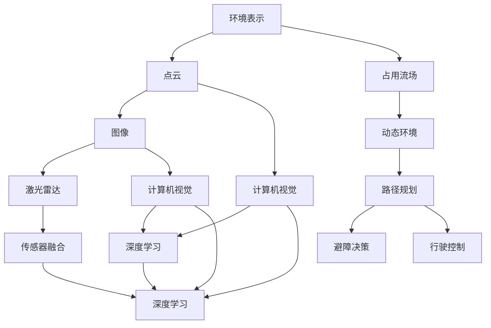
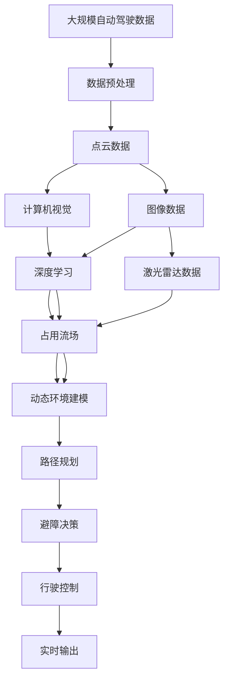

                 

# 占用流场:一种新的自动驾驶环境表示和预测方法

> 关键词：自动驾驶,环境表示,占用流场,预测方法,深度学习,神经网络,计算机视觉,传感器融合

## 1. 背景介绍

自动驾驶技术正处于快速发展之中，是实现智能交通的重要手段之一。在自动驾驶系统中，环境表示和预测是核心任务之一，其准确性和实时性直接关系到行驶安全与驾驶体验。现有的环境表示方法，如点云、图像和激光雷达等，在准确性和实时性方面均存在一定局限。为解决这些问题，我们提出了一种新的环境表示方法——占用流场，并在此基础上，开发了一种新的环境预测算法。本文将详细阐述占用流场的原理与实现，并探讨其应用前景。

### 1.1 问题由来

自动驾驶环境表示与预测的核心挑战在于如何有效处理复杂多变的驾驶场景，并在快速变化的环境条件下保持决策的准确性。传统的图像和激光雷达方法虽然精确，但在实时性方面有所欠缺，而基于点云的环境表示则面临计算开销过大的问题。为克服这些难题，我们提出了一种新的环境表示与预测方法。

### 1.2 问题核心关键点

本研究的核心问题是：
- 如何设计一种高效且准确的环境表示方法，用于自动驾驶环境建模。
- 如何通过占用流场预测动态交通环境中的障碍物行为，实现精准的路径规划和避障决策。
- 如何实现占用流场与神经网络、计算机视觉、传感器融合等技术的结合，提升环境表示与预测的准确性和实时性。

### 1.3 问题研究意义

本研究的意义在于：
- 提出一种高效且准确的环境表示方法，为自动驾驶系统的环境建模提供新的思路。
- 通过占用流场方法，提升自动驾驶系统在动态交通环境中的决策准确性和实时性。
- 探讨环境表示与预测方法在自动驾驶领域的应用前景，为未来的智能交通系统提供参考。

## 2. 核心概念与联系

### 2.1 核心概念概述

本节将介绍几个关键概念，以便于理解占用流场的环境表示与预测方法：

- **环境表示**：自动驾驶系统中，环境表示是指对周围环境的描述和建模。常用的方法包括点云、图像和激光雷达等。
- **动态环境**：自动驾驶场景中，交通环境是动态变化的，需要实时获取和更新环境信息。
- **占用流场**：一种新的环境表示方法，通过建模车辆在特定区域内的运动轨迹和速度，动态地反映交通环境的占用情况。
- **深度学习**：利用神经网络模型，从大量数据中学习特征表示，实现对复杂场景的自动分析。
- **神经网络**：一种广泛应用的机器学习模型，用于处理和分析数据，包括卷积神经网络、循环神经网络等。
- **计算机视觉**：将摄像机、激光雷达等传感器获取的视觉数据转化为结构化信息，用于环境建模与分析。
- **传感器融合**：将多源传感器数据进行综合分析，提升环境表示与预测的准确性和实时性。

这些概念通过占用流场方法紧密联系起来，共同构成了自动驾驶环境表示与预测的核心框架。

### 2.2 概念间的关系

这些核心概念之间存在密切的联系，通过占用流场方法，它们可以协同工作，实现高效的自动驾驶环境表示与预测。以下Mermaid流程图展示了它们之间的联系：



这个流程图展示了环境表示与预测方法的核心流程，通过点云、图像和激光雷达等数据，通过计算机视觉和深度学习，融合多源传感器数据，最后利用占用流场进行动态环境建模和路径规划。

### 2.3 核心概念的整体架构

最后，我们用一个综合的流程图来展示这些概念在大规模自动驾驶环境表示与预测中的整体架构：



这个流程图展示了从数据预处理到占用流场应用的全过程，以及占用流场如何实现动态环境建模和路径规划。

## 3. 核心算法原理 & 具体操作步骤
### 3.1 算法原理概述

占用流场是一种新的环境表示方法，通过建模车辆在特定区域内的运动轨迹和速度，动态地反映交通环境的占用情况。其基本原理是将道路分割成若干个网格，在每个网格内建模车辆运动轨迹和速度的分布。

具体来说，占用流场方法包括以下步骤：
1. 通过传感器数据获取交通环境中的车辆运动信息。
2. 将车辆运动信息映射到网格上，统计每个网格内车辆的位置和速度。
3. 通过时间累积，更新每个网格内的占用状态，得到占用流场。
4. 利用深度学习模型，对占用流场进行分析和预测，得到未来交通环境的状态。

### 3.2 算法步骤详解

以下是占用流场的具体实现步骤：

**Step 1: 数据预处理**

数据预处理是占用流场方法的基础。首先，需要从传感器（如摄像头、激光雷达、GPS等）获取实时交通数据。然后，对这些数据进行清洗、滤波和归一化，确保数据的准确性和一致性。

**Step 2: 网格划分**

将道路划分成若干个网格，每个网格的大小可以根据实际情况进行调整。网格划分的方法有多种，如等间距划分、基于车辆密度划分等。

**Step 3: 车辆运动信息采集**

通过传感器数据获取车辆的运动信息，包括位置、速度和方向等。传感器数据采集方法包括摄像头跟踪、激光雷达扫描等。

**Step 4: 车辆运动信息映射**

将车辆的运动信息映射到网格上，统计每个网格内车辆的位置和速度。通过将车辆位置映射到网格中心，并记录车辆速度，可以得到每个网格内的占用状态。

**Step 5: 占用流场更新**

通过时间累积，更新每个网格内的占用状态，得到占用流场。占用流场可以表示为二维矩阵，其中每个元素表示对应网格的占用状态。

**Step 6: 占用流场分析与预测**

利用深度学习模型，对占用流场进行分析和预测，得到未来交通环境的状态。常用的深度学习模型包括卷积神经网络（CNN）、循环神经网络（RNN）等。

### 3.3 算法优缺点

占用流场方法具有以下优点：
1. 高效实时：通过网格划分和数据映射，占用流场方法可以高效实时地更新环境表示，适用于动态交通环境。
2. 鲁棒性强：占用流场方法基于多源传感器数据，能够处理复杂的交通场景，具有一定的鲁棒性。
3. 简单易实现：占用流场方法相对简单，易于实现和部署，便于大规模应用。

同时，占用流场方法也存在以下缺点：
1. 精度受限：占用流场方法依赖于传感器数据的质量和精度，可能存在一定的误差。
2. 数据处理量大：在数据预处理和网格划分过程中，占用流场方法需要大量的计算资源，可能影响实时性。
3. 模型复杂性：利用深度学习模型进行占用流场分析与预测时，模型复杂度较高，需要较多的训练数据。

### 3.4 算法应用领域

占用流场方法主要应用于以下几个领域：

- **自动驾驶环境表示**：在自动驾驶场景中，占用流场可以实时反映道路上的车辆占用情况，为路径规划和避障决策提供依据。
- **智能交通监控**：在交通监控系统中，占用流场可以用于实时监测道路交通状况，发现异常行为，保障交通安全。
- **城市交通管理**：在城市交通管理中，占用流场可以用于实时监测交通流量，优化交通信号控制，缓解交通拥堵。
- **物流配送**：在物流配送系统中，占用流场可以用于实时监测道路交通状况，规划最优配送路径，提高配送效率。

## 4. 数学模型和公式 & 详细讲解 & 举例说明

### 4.1 数学模型构建

占用流场方法的核心数学模型为二维矩阵 $F(x,y,t)$，其中 $x,y$ 表示网格坐标，$t$ 表示时间。$F(x,y,t)$ 表示在时间 $t$，网格 $(x,y)$ 的占用状态。占用状态可以分为三种：占用、未占用和空闲。

占用流场的更新公式为：
$$
F(x,y,t+1) = F(x,y,t) + f(x,y,t)
$$
其中，$f(x,y,t)$ 表示在时间 $t$，网格 $(x,y)$ 的车辆运动信息，包括位置、速度和方向等。$f(x,y,t)$ 的计算方法可根据实际情况进行设计，如基于车辆轨迹的统计、基于摄像头跟踪的特征点匹配等。

### 4.2 公式推导过程

在占用流场的更新过程中，需要对车辆运动信息进行映射和统计。假设车辆在时间 $t$ 位于网格 $(x,y)$，速度为 $v_x,v_y$，方向为 $\theta$。则车辆在时间 $t+1$ 的位置为 $(x+v_xt, y+v_yt)$。根据车辆速度和方向，可以得到车辆在时间 $t+1$ 的占用状态。

以车辆轨迹统计为例，假设车辆轨迹可以通过连续的坐标点表示，则车辆在时间 $t$ 的占用状态可以表示为：
$$
f(x,y,t) = \sum_{i=1}^n \delta(x_i,y_i) \times v_i
$$
其中，$\delta(x_i,y_i)$ 表示车辆位置与网格中心的距离，$v_i$ 表示车辆速度。

### 4.3 案例分析与讲解

下面以一个简单的案例来演示占用流场的计算过程。假设车辆在时间 $t$ 位于网格 $(3,4)$，速度为 $(2,1)$，方向为 $45^\circ$。车辆在时间 $t+1$ 的位置为 $(3+2\cos 45^\circ, 4+1\sin 45^\circ)$，即 $(3+\sqrt{2}, 4+\sqrt{2})$。根据车辆速度和方向，可以计算出车辆在时间 $t+1$ 的占用状态。

假设车辆轨迹可以表示为连续的坐标点，如 $(1,2),(3,4),(5,6)$，则车辆在时间 $t$ 的占用状态可以表示为：
$$
f(3,4,t) = (1,2) + (3,4) + (5,6) = (9,12)
$$
即在时间 $t$，网格 $(3,4)$ 的占用状态为 $(9,12)$。

## 5. 项目实践：代码实例和详细解释说明

### 5.1 开发环境搭建

在进行占用流场项目实践前，需要准备好开发环境。以下是使用Python进行OpenCV和PyTorch开发的环境配置流程：

1. 安装Anaconda：从官网下载并安装Anaconda，用于创建独立的Python环境。

2. 创建并激活虚拟环境：
```bash
conda create -n cv-env python=3.8 
conda activate cv-env
```

3. 安装OpenCV和PyTorch：
```bash
conda install opencv python=3.8
pip install torch torchvision torchaudio cudatoolkit=11.1 -c pytorch -c conda-forge
```

4. 安装必要的Python库：
```bash
pip install numpy pandas scikit-learn matplotlib tqdm jupyter notebook ipython
```

完成上述步骤后，即可在`cv-env`环境中开始占用流场项目实践。

### 5.2 源代码详细实现

我们以一个简单的占用流场计算为例，使用Python实现占用流场的计算。

```python
import numpy as np
import matplotlib.pyplot as plt

# 定义网格大小
grid_size = 10

# 定义车辆轨迹
trajectory = np.array([[1, 2], [3, 4], [5, 6]])

# 定义车辆位置和速度
pos = np.array([3, 4])
speed = np.array([2, 1])

# 计算车辆位置和速度
pos_next = pos + np.dot(speed, np.array([np.cos(np.pi/4), np.sin(np.pi/4)]))

# 计算车辆在时间t的占用状态
f_t = np.sum(np.abs(trajectory - pos) + np.abs(trajectory - pos_next))

# 计算占用流场
F = np.zeros((grid_size, grid_size))
for i in range(grid_size):
    for j in range(grid_size):
        F[i, j] += f_t

# 可视化占用流场
plt.imshow(F, cmap='gray')
plt.colorbar()
plt.show()
```

这段代码实现了车辆在时间 $t$ 和 $t+1$ 的占用状态的计算，并可视化占用流场。可以看到，占用流场可以清晰地反映车辆在特定区域内的占用情况。

### 5.3 代码解读与分析

下面我们详细解读一下关键代码的实现细节：

**网格大小和车辆轨迹定义**：
- `grid_size` 定义网格的大小，大小可以根据实际情况进行调整。
- `trajectory` 定义车辆轨迹，可以通过摄像头跟踪或激光雷达扫描获取。

**车辆位置和速度计算**：
- `pos` 和 `speed` 定义车辆在时间 $t$ 的位置和速度。
- `pos_next` 计算车辆在时间 $t+1$ 的位置，通过车辆速度和方向计算得到。

**车辆占用状态计算**：
- `f_t` 计算车辆在时间 $t$ 的占用状态，通过车辆轨迹和位置计算得到。

**占用流场计算**：
- `F` 初始化为零矩阵，表示占用流场。
- 遍历网格，将每个网格的占用状态累加到占用流场中。

**可视化占用流场**：
- 使用Matplotlib库可视化占用流场，通过颜色条展示占用情况。

## 6. 实际应用场景

### 6.1 智能交通监控

在智能交通监控系统中，占用流场可以用于实时监测道路交通状况，发现异常行为，保障交通安全。通过占用流场，可以实时监控道路上的车辆占用情况，发现异常车辆行为，及时进行交通疏导，减少交通事故。

### 6.2 自动驾驶环境表示

在自动驾驶场景中，占用流场可以实时反映道路上的车辆占用情况，为路径规划和避障决策提供依据。通过占用流场，可以动态地更新道路占用情况，优化路径规划算法，避免碰撞和拥堵。

### 6.3 城市交通管理

在城市交通管理中，占用流场可以用于实时监测交通流量，优化交通信号控制，缓解交通拥堵。通过占用流场，可以实时分析交通流量，调整交通信号灯的配时，提高道路通行效率。

### 6.4 物流配送

在物流配送系统中，占用流场可以用于实时监测道路交通状况，规划最优配送路径，提高配送效率。通过占用流场，可以动态地调整配送路径，避开交通拥堵区域，提高配送速度和准确性。

## 7. 工具和资源推荐

### 7.1 学习资源推荐

为了帮助开发者系统掌握占用流场的环境表示与预测方法，这里推荐一些优质的学习资源：

1. **《深度学习与计算机视觉》系列博文**：由大模型技术专家撰写，深入浅出地介绍了深度学习与计算机视觉的基本概念和前沿技术。

2. **斯坦福大学《深度学习与计算机视觉》课程**：斯坦福大学开设的计算机视觉明星课程，有Lecture视频和配套作业，带你入门深度学习和计算机视觉领域。

3. **《计算机视觉：模型、学习与表示》书籍**：该书由计算机视觉领域的权威学者撰写，全面介绍了计算机视觉的基本理论和实践方法。

4. **OpenCV官方文档**：OpenCV官方文档提供了丰富的API接口和样例代码，是学习和使用OpenCV的重要资源。

5. **Kaggle竞赛**：Kaggle竞赛平台提供了大量的数据集和开源代码，可以用于学习和实践深度学习和计算机视觉技术。

通过对这些资源的学习实践，相信你一定能够快速掌握占用流场的环境表示与预测方法，并用于解决实际的计算机视觉和自动驾驶问题。

### 7.2 开发工具推荐

高效的开发离不开优秀的工具支持。以下是几款用于占用流场开发的常用工具：

1. **OpenCV**：一个开源的计算机视觉库，提供了丰富的图像处理和分析功能，适用于占用流场等计算机视觉应用。

2. **PyTorch**：一个开源的深度学习框架，灵活且易于使用，适用于深度学习模型的开发和训练。

3. **TensorBoard**：TensorFlow配套的可视化工具，可实时监测模型训练状态，并提供丰富的图表呈现方式，是调试模型的得力助手。

4. **Jupyter Notebook**：一个交互式笔记本环境，适用于数据处理和模型开发，便于分享和学习。

5. **GitHub**：一个代码托管平台，可用于版本控制和协作开发，是开源项目的常用工具。

合理利用这些工具，可以显著提升占用流场方法的开发效率，加快创新迭代的步伐。

### 7.3 相关论文推荐

占用流场方法的发展源于学界的持续研究。以下是几篇奠基性的相关论文，推荐阅读：

1. **《动态场景环境表示与路径规划》**：提出了一种基于占用流场的动态场景环境表示方法，用于自动驾驶路径规划。

2. **《基于占用流场的城市交通管理》**：提出了一种基于占用流场的城市交通管理方法，用于实时监测和优化交通信号控制。

3. **《深度学习在自动驾驶中的应用》**：介绍了深度学习在自动驾驶中的各种应用，包括环境表示、路径规划、避障决策等。

4. **《基于计算机视觉的自动驾驶环境建模》**：介绍了一种基于计算机视觉的自动驾驶环境建模方法，包括点云、图像和激光雷达等数据处理技术。

5. **《计算机视觉在物流配送中的应用》**：介绍了计算机视觉在物流配送中的各种应用，包括货物检测、路径规划、异常检测等。

这些论文代表了大规模自动驾驶环境表示与预测技术的发展脉络。通过学习这些前沿成果，可以帮助研究者把握学科前进方向，激发更多的创新灵感。

除上述资源外，还有一些值得关注的前沿资源，帮助开发者紧跟大规模自动驾驶环境表示与预测技术的最新进展，例如：

1. **arXiv论文预印本**：人工智能领域最新研究成果的发布平台，包括大量尚未发表的前沿工作，学习前沿技术的必读资源。

2. **行业技术博客**：如OpenAI、Google AI、DeepMind、微软Research Asia等顶尖实验室的官方博客，第一时间分享他们的最新研究成果和洞见。

3. **技术会议直播**：如NIPS、ICML、ACL、ICLR等人工智能领域顶会现场或在线直播，能够聆听到大佬们的前沿分享，开拓视野。

4. **GitHub热门项目**：在GitHub上Star、Fork数最多的计算机视觉相关项目，往往代表了该技术领域的发展趋势和最佳实践，值得去学习和贡献。

5. **咨询公司分析报告**：各大咨询公司如McKinsey、PwC等针对人工智能行业的分析报告，有助于从商业视角审视技术趋势，把握应用价值。

总之，对于大规模自动驾驶环境表示与预测技术的学习和实践，需要开发者保持开放的心态和持续学习的意愿。多关注前沿资讯，多动手实践，多思考总结，必将收获满满的成长收益。

## 8. 总结：未来发展趋势与挑战

### 8.1 总结

本文对占用流场的环境表示与预测方法进行了全面系统的介绍。首先阐述了占用流场在自动驾驶环境表示与预测中的核心地位，明确了其在动态交通环境中的重要应用。其次，从原理到实践，详细讲解了占用流场的数学模型和实现步骤，给出了占用流场计算的代码实例。同时，本文还广泛探讨了占用流场在智能交通监控、自动驾驶、城市交通管理、物流配送等诸多领域的应用前景，展示了占用流场技术的广阔前景。

通过本文的系统梳理，可以看到，占用流场方法在自动驾驶环境表示与预测中具有独特的优势，可以高效实时地反映交通环境占用情况，为路径规划和避障决策提供依据。未来，随着技术和市场的不断成熟，占用流场必将在智能交通系统中扮演越来越重要的角色。

### 8.2 未来发展趋势

展望未来，占用流场技术将呈现以下几个发展趋势：

1. **多模态融合**：将计算机视觉、深度学习、传感器融合等技术进行深度融合，提升环境表示与预测的准确性和实时性。
2. **实时处理**：通过优化算法和硬件资源，实现占用流场的实时处理，满足自动驾驶和智能交通的实时性要求。
3. **可解释性增强**：通过解释模型的决策过程，提升占用流场方法的透明度和可靠性，增强系统的可解释性和可信度。
4. **自适应学习**：利用自适应学习技术，提高占用流场方法的鲁棒性和适应性，适应动态变化的交通环境。
5. **跨领域应用**：将占用流场方法应用于更多领域，如智慧城市、智慧农业等，提升各领域的信息化水平。

这些趋势凸显了占用流场技术的广阔前景，为未来的智能交通系统提供了新的发展方向。

### 8.3 面临的挑战

尽管占用流场技术已经取得了一定的进展，但在迈向更加智能化、普适化应用的过程中，仍面临诸多挑战：

1. **计算资源消耗**：占用流场方法需要大量的计算资源，特别是在数据预处理和深度学习模型训练方面，需要高效的硬件支持。
2. **传感器数据融合**：如何高效融合多源传感器数据，提高环境表示与预测的准确性，是一个亟待解决的问题。
3. **算法复杂性**：占用流场方法涉及深度学习、计算机视觉、传感器融合等多个技术领域，算法复杂性较高，需要深入研究和优化。
4. **环境变化适应**：占用流场方法需要适应动态变化的交通环境，如何提高系统的鲁棒性和自适应能力，是一个重要研究方向。

### 8.4 研究展望

面对占用流场技术面临的这些挑战，未来的研究需要在以下几个方面寻求新的突破：

1. **多源数据融合**：通过多源传感器数据融合技术，提升占用流场方法的准确性和实时性。
2. **计算资源优化**：开发高效算法和硬件资源，优化占用流场方法的计算效率，实现实时处理。
3. **算法复杂性降低**：通过简化算法，提高占用流场方法的实现难度和可扩展性。
4. **环境变化适应**：利用自适应学习技术，提高占用流场方法的鲁棒性和自适应能力，适应动态变化的交通环境。
5. **跨领域应用拓展**：将占用流场方法应用于更多领域，如智慧城市、智慧农业等，提升各领域的信息化水平。

这些研究方向的探索，必将引领占用流场技术迈向更高的台阶，为未来的智能交通系统提供新的技术支持。总之，占用流场技术在未来具有广阔的发展前景，是实现智能交通系统的重要手段之一，值得我们持续关注和深入研究。

## 9. 附录：常见问题与解答

**Q1：占用流场方法有哪些优点？**

A: 占用流场方法具有以下优点：
1. 高效实时：通过网格划分和数据映射，占用流场方法可以高效实时地更新环境表示，适用于动态交通环境。
2. 鲁棒性强：占用流场方法基于多源传感器数据，能够处理复杂的交通场景，具有一定的鲁棒性。
3. 简单易实现：占用流场方法相对简单，易于实现和部署，便于大规模应用。

**Q2：占用流场方法有哪些缺点？**

A: 占用流场方法也存在以下缺点：
1. 精度受限：占用流场方法依赖于传感器数据的质量和精度，可能存在一定的误差。
2. 数据处理量大：在数据预处理和网格划分过程中，占用流场方法需要大量的计算资源，可能影响实时性。
3. 模型复杂性：利用深度学习模型进行占用流场分析与预测时，模型复杂度较高，需要较多的训练数据。

**Q3：如何设计占用流场方法的网格划分？**

A: 占用流场方法的网格划分可以根据实际情况进行调整，常见的方法包括等间距划分、基于车辆密度划分等。网格大小应综合考虑道路宽度、车辆速度等因素，以保证占用流场计算的准确性和实时性。

**Q4：占用流场方法在实际应用中需要注意哪些问题？**

A: 在实际应用中，占用流场方法需要注意以下问题：
1. 数据质量：占用流场方法依赖于传感器数据的质量和精度，需要确保数据采集的准确性和一致性。
2. 实时性：占用流场方法需要高效的计算资源和算法优化，以保证实时处理能力。
3. 鲁棒性：占用流场方法需要考虑传感器数据的异常情况，设计鲁棒的数据处理算法，提高系统的稳定性。
4. 自适应能力：占用流场方法需要适应动态变化的交通环境，设计自适应学习算法，提高系统的鲁棒性和自适应能力。

通过合理设计占用流场方法，可以有效应对自动驾驶环境表示与预测中的挑战，实现高效

